# Fire Spread and Intensity

Relevant source files

- [biogeochem/EDCohortDynamicsMod.F90](https://github.com/jingtao-lbl/fates/blob/e85d9977/biogeochem/EDCohortDynamicsMod.F90)
- [biogeochem/EDPhysiologyMod.F90](https://github.com/jingtao-lbl/fates/blob/e85d9977/biogeochem/EDPhysiologyMod.F90)
- [biogeochem/FatesAllometryMod.F90](https://github.com/jingtao-lbl/fates/blob/e85d9977/biogeochem/FatesAllometryMod.F90)
- [fire/SFMainMod.F90](https://github.com/jingtao-lbl/fates/blob/e85d9977/fire/SFMainMod.F90)

## Purpose and Scope

This page documents the fire spread and intensity calculations in FATES, which determine how rapidly fire propagates across a landscape and its energetic intensity. These calculations form the core of the Rothermel fire spread model as implemented in SPITFIRE. This page specifically covers:

- Fuel characteristic calculations (moisture, bulk density, surface-area-to-volume ratio)
- Rate of spread calculations (forward and backward ROS)
- Fire intensity calculations
- Area burnt calculations
- Wind effects on fire spread

For information about fire danger indices and ignition probability, see [Fire Danger and Ignition](fire/ignition.md) . For information about how fire affects vegetation mortality and crown damage, see [Fire Effects on Vegetation](fire/effects.md) .

## Overview

The fire spread and intensity system is executed daily as part of the SPITFIRE fire model. Once fire danger and ignition have been established (see [7.1](fire/ignition.md) ), the model calculates how fire spreads based on fuel characteristics, meteorological conditions, and landscape properties. The calculation proceeds through several sequential steps:

Calculation Flow Diagram

Sources: [fire/SFMainMod.F90 80-115](https://github.com/jingtao-lbl/fates/blob/e85d9977/fire/SFMainMod.F90#L80-L115)

## Fuel Characteristics

### Overview

The `charecteristics_of_fuel` subroutine calculates spatially-averaged fuel properties across six fuel size classes at the patch level. These properties drive the rate of spread and fuel consumption calculations.

### Fuel Size Classes

FATES uses six fuel size classes ( `nfsc = 6` ), indexed by constants:

| Index | Symbol | Description | Typical Diameter | 
| --- | --- | --- | --- |
| 1 | tw_sf | Twigs | < 0.64 cm | 
| 2 | sb_sf | Small branches | 0.64-2.54 cm | 
| 3 | lb_sf | Large branches | 2.54-7.62 cm | 
| 4 | tr_sf | Trunks | > 7.62 cm | 
| 5 | dl_sf | Dead leaves | fine litter | 
| 6 | lg_sf | Live grass | herbaceous | 

Fuel Size Class Mapping

Sources: [fire/SFMainMod.F90 177-344](https://github.com/jingtao-lbl/fates/blob/e85d9977/fire/SFMainMod.F90#L177-L344)  [fire/SFMainMod.F90 218-243](https://github.com/jingtao-lbl/fates/blob/e85d9977/fire/SFMainMod.F90#L218-L243)

### Fuel Property Calculations

For each patch, the model calculates weighted-average fuel properties across the first three CWD classes plus dead leaves and live grass (trunks are excluded from ROS calculations):

Sources: [fire/SFMainMod.F90 240-309](https://github.com/jingtao-lbl/fates/blob/e85d9977/fire/SFMainMod.F90#L240-L309)

### Moisture of Extinction (MEF)

The moisture of extinction is the fuel moisture content above which fire cannot spread. It is calculated for each fuel class based on the Peterson and Ryan (1986) equation:

MEF(i) = 0.524 - 0.066 × ln(SAV(i))

where `SAV(i)` is the surface-area-to-volume ratio for fuel class `i` .

The effective fuel moisture is then expressed relative to MEF:

litter_moisture(i) = fuel_moisture(i) / MEF(i)

Sources: [fire/SFMainMod.F90 260-308](https://github.com/jingtao-lbl/fates/blob/e85d9977/fire/SFMainMod.F90#L260-L308)

### Key State Variables

After `charecteristics_of_fuel` executes, the following patch-level variables are populated:

| Variable | Description | Units | 
| --- | --- | --- |
| fuel_bulkd | Weighted average bulk density | kg/m³ | 
| fuel_sav | Weighted average surface-area-to-volume | cm²/cm³ | 
| fuel_mef | Weighted average moisture of extinction | - | 
| fuel_eff_moist | Weighted average effective moisture | - | 
| fuel_frac(1:6) | Fraction of total fuel in each class | - | 
| litter_moisture(1:6) | Relative moisture for each class | - | 
| sum_fuel | Total fuel load | kgC/m² | 

Sources: [fire/SFMainMod.F90 282-309](https://github.com/jingtao-lbl/fates/blob/e85d9977/fire/SFMainMod.F90#L282-L309)

## Wind Effect on Fire Spread

### Effective Wind Speed Calculation

The `wind_effect` subroutine calculates effective wind speed at the fire front, accounting for surface roughness created by vegetation. The calculation distinguishes between tree-covered, grass-covered, and bare areas.

Wind Adjustment Process

The key reduction factors are:

- **Trees**: 0.4 (60% wind speed reduction)
- **Grass and bare ground**: 0.6 (40% wind speed reduction)

This reflects the greater surface roughness and wind shelter provided by trees compared to shorter vegetation or bare ground.

Sources: [fire/SFMainMod.F90 348-446](https://github.com/jingtao-lbl/fates/blob/e85d9977/fire/SFMainMod.F90#L348-L446)  [fire/SFMainMod.F90 381-439](https://github.com/jingtao-lbl/fates/blob/e85d9977/fire/SFMainMod.F90#L381-L439)

## Rate of Spread: Rothermel Model

### Overview

The `rate_of_spread` subroutine implements the Rothermel (1972) fire spread model, which calculates forward and backward rates of spread based on fuel properties, moisture, and wind. The model calculates several intermediate quantities before arriving at ROS.

### Rothermel Model Components

Rothermel ROS Calculation Flow

Sources: [fire/SFMainMod.F90 449-592](https://github.com/jingtao-lbl/fates/blob/e85d9977/fire/SFMainMod.F90#L449-L592)

### Key Equations
1. Packing Ratio
The packing ratio (β) represents the fraction of the fuel bed volume occupied by fuel:

β = ρ_b / ρ_p

where:

- `fuel_bulkd`ρ_b = fuel bulk density ( ) [kg/m³]
- `SF_val_part_dens`ρ_p = particle density ( ) [kg/m³]

The optimum packing ratio (β_op) depends on surface-area-to-volume ratio:

β_op = 0.200395 × SAV^(-0.8189)
2. Heat of Pre-ignition
Amount of heat required to ignite fuel:

q_ig = 581 + 2594 × M_f [kJ/kg]

where M_f is the effective fuel moisture content ( `fuel_eff_moist` ).
3. Reaction Intensity
The energy release rate per unit area:

I_R = Γ × (W_n / 0.45) × h × η_M × η_s [kJ/m²/min]

where:

- Γ = reaction velocity [1/min]
- W_n = net fuel load (excluding minerals) [kgC/m²]
- `SF_val_fuel_energy`h = fuel heat content ( ) [kJ/kg]
- η_M = moisture damping coefficient
- `SF_val_miner_damp`η_s = mineral damping coefficient ( )

4. Rate of Spread
Forward ROS is calculated as:

ROS = (I_R × ξ × (1 + φ_wind)) / (ρ_b × ε × q_ig) [m/min]

where:

- ξ = propagating flux ratio
- φ_wind = wind coefficient
- ε = effective heating number
- ρ_b = fuel bulk density [kg/m³]
- q_ig = heat of pre-ignition [kJ/kg]

Backward ROS (fire spreading against the wind) is reduced exponentially:

ROS_back = ROS_front × exp(-0.012 × wind)

Sources: [fire/SFMainMod.F90 483-585](https://github.com/jingtao-lbl/fates/blob/e85d9977/fire/SFMainMod.F90#L483-L585)

### Wind Effect on ROS

The wind coefficient (φ_wind) modulates the rate of spread based on wind speed:

φ_wind = C × (3.281 × wspeed)^B × (β/β_op)^(-E)

where parameters B, C, and E are functions of surface-area-to-volume ratio:

- B = 0.15988 × SAV^0.54
- C = 7.47 × exp(-0.8711 × SAV^0.55)
- E = 0.715 × exp(-0.01094 × SAV)

Wind speed is converted from m/min to ft/min (factor of 3.281) for compatibility with the original Rothermel formulation.

Sources: [fire/SFMainMod.F90 520-538](https://github.com/jingtao-lbl/fates/blob/e85d9977/fire/SFMainMod.F90#L520-L538)

## Ground Fuel Consumption

### Overview

The `ground_fuel_consumption` subroutine calculates what fraction of each fuel class is consumed by the fire. This depends on the moisture content of each fuel class relative to its moisture of extinction.

Fuel Consumption Calculation

Sources: [fire/SFMainMod.F90 595-683](https://github.com/jingtao-lbl/fates/blob/e85d9977/fire/SFMainMod.F90#L595-L683)

### Burnt Fraction by Moisture Content

The fraction of each fuel class consumed depends on its relative moisture content. Parameters `SF_val_min_moisture(i)` , `SF_val_mid_moisture(i)` , and associated slope/intercept coefficients define piecewise linear relationships:

| Moisture Range | Burnt Fraction Formula | 
| --- | --- |
| M ≤ M_min | 1.0 (complete consumption) | 
| M_min < M ≤ M_mid | SF_val_low_moisture_Coeff - SF_val_low_moisture_Slope × M | 
| M_mid < M ≤ 1.0 | SF_val_mid_moisture_Coeff - SF_val_mid_moisture_Slope × M | 
| M > 1.0 | 0.0 (no consumption) | 

Sources: [fire/SFMainMod.F90 622-644](https://github.com/jingtao-lbl/fates/blob/e85d9977/fire/SFMainMod.F90#L622-L644)

### Fire Residence Time

The fire residence time (τ_l) is the duration for which lethal heating occurs at the base of tree stems. This is calculated following Peterson & Ryan (1986):

τ_b(i) = 39.4 × (fuel_frac(i) × sum_fuel/4.5) × (1 - (1 - burnt_frac(i))^0.5)

where:

- fuel_frac(i) = fraction of total fuel in class i
- sum_fuel/4.5 = conversion from kgC/m² to g/cm² (factor of 10) and C to biomass (factor of 0.45)
- burnt_frac(i) = fraction of fuel class i consumed

Total residence time is the sum across fuel classes, capped at 8 minutes:

τ_l = min(8.0, Σ τ_b(i))

This residence time is later used in cambial damage calculations (see [7.3](fire/effects.md) ).

Sources: [fire/SFMainMod.F90 666-672](https://github.com/jingtao-lbl/fates/blob/e85d9977/fire/SFMainMod.F90#L666-L672)

## Area Burnt and Fire Intensity

### Overview

The `area_burnt_intensity` subroutine calculates the fraction of each patch that burns and the fire intensity at the flame front. These calculations integrate information from fire danger, ignitions, rate of spread, and fuel consumption.

### Fire Ellipse Model

Fires spread in an elliptical pattern, with the major axis aligned with the wind direction. The model calculates fire shape and area using the Canadian Forest Fire Behavior Prediction System (CFFBPS) approach.

Fire Area Calculation Process

Sources: [fire/SFMainMod.F90 687-885](https://github.com/jingtao-lbl/fates/blob/e85d9977/fire/SFMainMod.F90#L687-L885)

### Fire Duration

Fire duration (FD) is calculated from fire danger index using a sigmoidal function:

FD = (FD_max + 1) / (1 + FD_max × exp(FD_slope × FDI))

where:

- `SF_val_max_durat`FD_max = maximum fire duration parameter ( ) [min]
- `SF_val_durat_slope`FD_slope = slope parameter ( )
- FDI = fire danger index (0-1)

Higher fire danger leads to longer-burning fires.

Sources: [fire/SFMainMod.F90 785-786](https://github.com/jingtao-lbl/fates/blob/e85d9977/fire/SFMainMod.F90#L785-L786)

### Length-to-Breadth Ratio

The length-to-breadth ratio (lb) of the fire ellipse depends on wind speed and vegetation type:

For circular fire (low wind < 1 km/hr):

For forest fuels (tree_fraction > 0.55):

For grassland fuels (tree_fraction ≤ 0.55):

where wspeed_kmh is wind speed converted to km/hr.

Sources: [fire/SFMainMod.F90 803-814](https://github.com/jingtao-lbl/fates/blob/e85d9977/fire/SFMainMod.F90#L803-L814)

### Fire Size and Area Burnt

Individual fire size is calculated as the area of an ellipse:

size_of_fire = (π / (4 × lb)) × (df + db)²

where:

- df = forward spread distance = ROS_front × FD
- db = backward spread distance = ROS_back × FD
- lb = length-to-breadth ratio

Daily area burnt per km² of patch area:

AB = size_of_fire × NF × FDI

where:

- NF = number of ignitions per km² per day
- FDI = probability that ignition starts a fire

Fraction of patch burnt:

frac_burnt = min(0.99, AB / 1×10⁶)

The 0.99 cap prevents complete patch consumption.

Sources: [fire/SFMainMod.F90 820-844](https://github.com/jingtao-lbl/fates/blob/e85d9977/fire/SFMainMod.F90#L820-L844)

### Fire Intensity

Fire intensity (FI) at the flame front is calculated from the energy release rate:

FI = h × W × ROS [kW/m]

where:

- `SF_val_fuel_energy`h = heat content of fuel ( = 18,000 kJ/kg)
- W = fuel consumed per unit area = TFC_ROS / 0.45 [kgBiomass/m²]
- ROS = forward rate of spread [m/s]

Fire intensity is the power (energy per time) per unit length of fire front. Only fires exceeding a threshold intensity ( `SF_val_fire_threshold` , typically 50 kW/m) are considered successful fires.

Sources: [fire/SFMainMod.F90 854-876](https://github.com/jingtao-lbl/fates/blob/e85d9977/fire/SFMainMod.F90#L854-L876)

## Key Patch-Level State Variables

The following table summarizes the key state variables that are computed and stored at the patch level:

| Variable | Description | Units | Set By | 
| --- | --- | --- | --- |
| fuel_bulkd | Bulk density of fuel bed | kg/m³ | charecteristics_of_fuel | 
| fuel_sav | Surface-area-to-volume ratio | cm⁻¹ | charecteristics_of_fuel | 
| fuel_mef | Moisture of extinction | - | charecteristics_of_fuel | 
| fuel_eff_moist | Effective fuel moisture | - | charecteristics_of_fuel | 
| fuel_frac(1:6) | Fuel fraction by size class | - | charecteristics_of_fuel | 
| litter_moisture(1:6) | Relative moisture by class | - | charecteristics_of_fuel | 
| effect_wspeed | Effective wind speed | m/min | wind_effect | 
| ROS_front | Forward rate of spread | m/min | rate_of_spread | 
| ROS_back | Backward rate of spread | m/min | rate_of_spread | 
| burnt_frac_litter(1:6) | Fraction consumed by class | - | ground_fuel_consumption | 
| TFC_ROS | Total fuel consumed (excl. trunks) | kgC/m² | ground_fuel_consumption | 
| tau_l | Fire residence time | min | ground_fuel_consumption | 
| FD | Fire duration | min | area_burnt_intensity | 
| FI | Fire line intensity | kW/m | area_burnt_intensity | 
| frac_burnt | Fraction of patch burnt | - | area_burnt_intensity | 
| fire | Fire occurrence flag | 0/1 | area_burnt_intensity | 

Sources: [fire/SFMainMod.F90 80-885](https://github.com/jingtao-lbl/fates/blob/e85d9977/fire/SFMainMod.F90#L80-L885)

## Integration with Other Fire Components

This module interacts with other parts of the fire system:

Upstream Dependencies:

- `acc_NI``fire_danger_index`[7.1](fire/ignition.md)Fire danger index ( ) computed by (see )
- Meteorological inputs: wind speed, temperature, humidity from boundary conditions
- `NF`[7.1](fire/ignition.md)Ignition counts ( ) from lightning or anthropogenic sources (see )
- Litter pools from vegetation turnover and mortality

Downstream Effects:

- `FI`[7.3](fire/effects.md)Fire intensity ( ) and scorch height drive crown damage calculations (see )
- `tau_l`[7.3](fire/effects.md)Fire residence time ( ) drives cambial damage (see )
- `frac_burnt`Fraction burnt ( ) determines area-weighted impacts on vegetation
- Fuel consumption drives litter pool depletion and trace gas emissions

Data Flow Between Fire Modules

Sources: [fire/SFMainMod.F90 80-115](https://github.com/jingtao-lbl/fates/blob/e85d9977/fire/SFMainMod.F90#L80-L115)