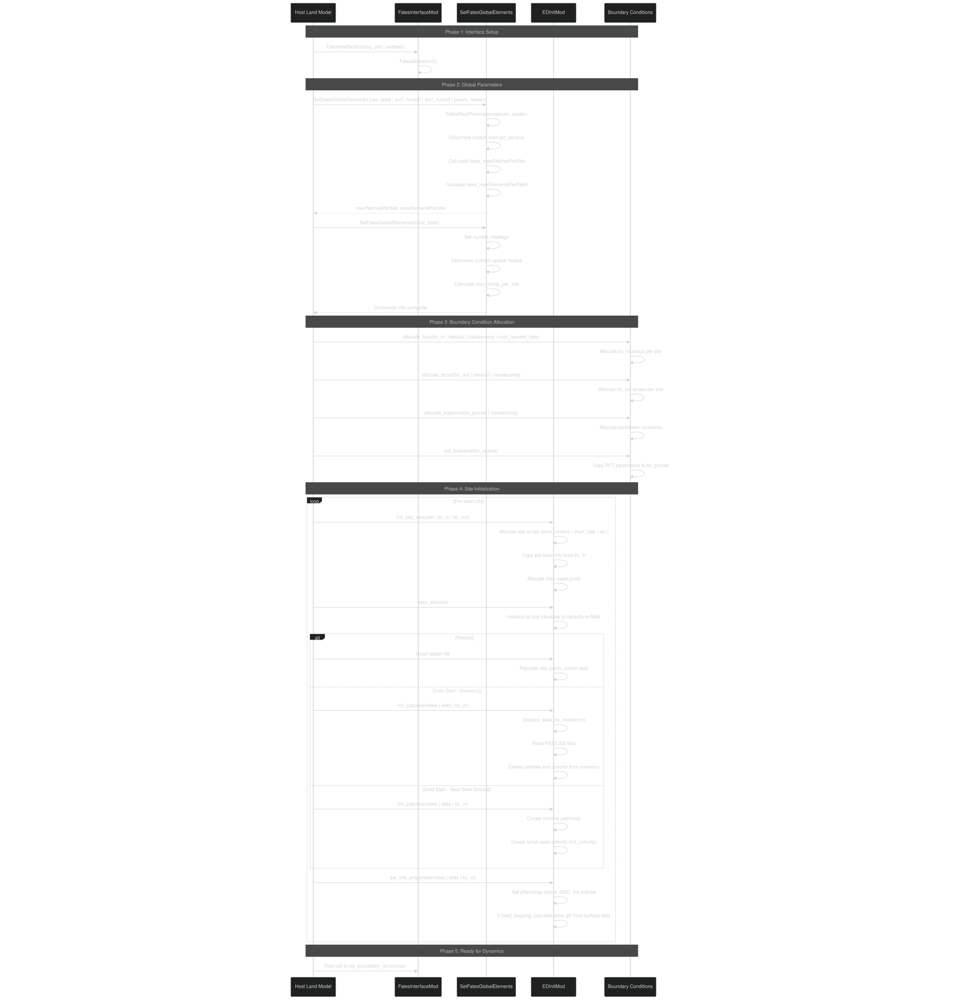
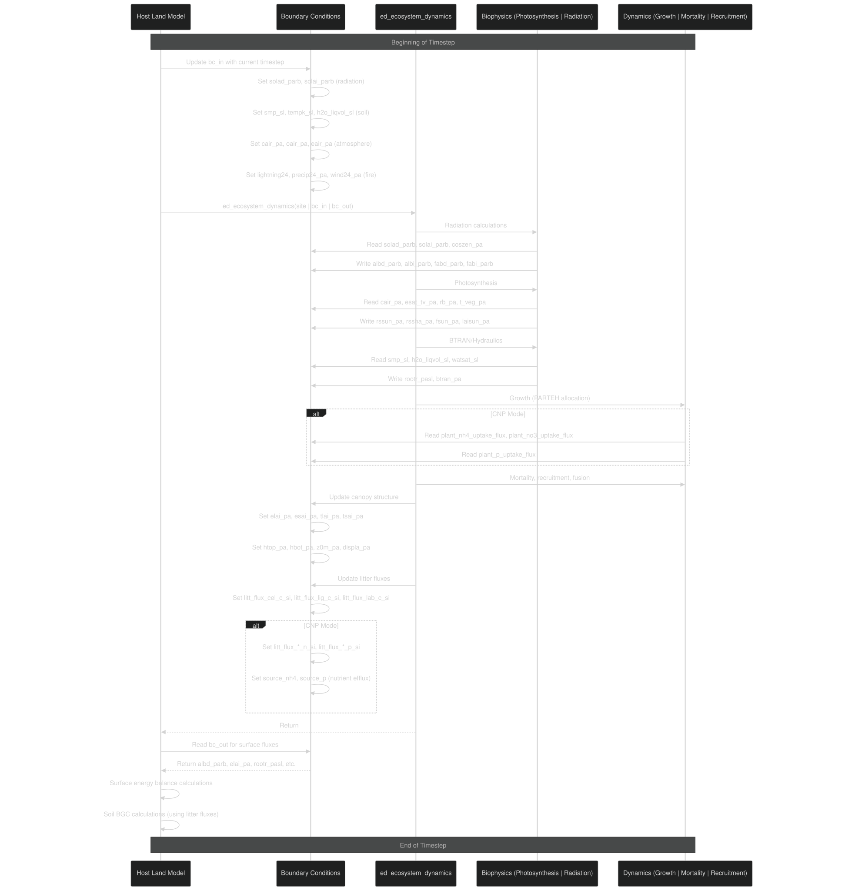

# Host Model Interface

Relevant source files

- [main/EDInitMod.F90](https://github.com/jingtao-lbl/fates/blob/e85d9977/main/EDInitMod.F90)
- [main/FatesInterfaceMod.F90](https://github.com/jingtao-lbl/fates/blob/e85d9977/main/FatesInterfaceMod.F90)
- [main/FatesInterfaceTypesMod.F90](https://github.com/jingtao-lbl/fates/blob/e85d9977/main/FatesInterfaceTypesMod.F90)
- [main/FatesInventoryInitMod.F90](https://github.com/jingtao-lbl/fates/blob/e85d9977/main/FatesInventoryInitMod.F90)
- [main/FatesRestartInterfaceMod.F90](https://github.com/jingtao-lbl/fates/blob/e85d9977/main/FatesRestartInterfaceMod.F90)

## Purpose and Scope

The Host Model Interface (HMI) defines the coupling layer between FATES and host land models (HLMs) such as CLM, ALM, and ELM. This interface establishes the API through which the HLM controls FATES execution, passes environmental drivers and boundary conditions, and receives vegetation state and flux information. The HMI is designed to be generic, allowing FATES to couple with different host models while maintaining a consistent internal implementation.

This page covers the boundary condition structures, interface data types, and coupling mechanisms. For information about specific initialization modes (near-bare-ground vs. inventory), see [Initialization Modes](getting-started/initialization.md) . For parameter file handling, see [Parameter System](getting-started/parameter_system.md) .

## Interface Architecture Overview

The host model interface is implemented primarily through three modules that work together to mediate all communication between FATES and the HLM:

Sources:  [main/FatesInterfaceMod.F90 1-200](https://github.com/jingtao-lbl/fates/blob/e85d9977/main/FatesInterfaceMod.F90#L1-L200)  [main/FatesInterfaceTypesMod.F90 1-100](https://github.com/jingtao-lbl/fates/blob/e85d9977/main/FatesInterfaceTypesMod.F90#L1-L100)

## The fates_interface_type Structure

The `fates_interface_type` is the root container for all FATES state and boundary conditions. Each HLM thread or domain instantiates one or more of these objects.

| Component | Purpose | Allocation | 
| --- | --- | --- |
| sites | Pointer array to FATES site structures containing patches and cohorts | Per site | 
| bc_in | Input boundary conditions from HLM (meteorology, soil state, etc.) | Per site | 
| bc_out | Output boundary conditions to HLM (fluxes, canopy properties, etc.) | Per site | 
| bc_pconst | Parameter constants (nutrient uptake kinetics, etc.) | Once per interface | 

Sources:  [main/FatesInterfaceMod.F90 125-159](https://github.com/jingtao-lbl/fates/blob/e85d9977/main/FatesInterfaceMod.F90#L125-L159)  [main/FatesInterfaceTypesMod.F90 348-793](https://github.com/jingtao-lbl/fates/blob/e85d9977/main/FatesInterfaceTypesMod.F90#L348-L793)

## Boundary Condition System

### Input Boundaries (bc_in_type)

The `bc_in_type` structure contains all environmental drivers and soil state information that FATES requires from the HLM. These are updated at each model timestep or sub-timestep.

Key Input Boundary Groups:

| Category | Key Variables | Units | Dimension | 
| --- | --- | --- | --- |
| Radiation | solad_parb, solai_parb | W/m² | patch × band | 
| Soil Hydrology | smp_sl, h2o_liqvol_sl, watsat_sl | mm, m³/m³ | soil layer | 
| Soil Temperature | tempk_sl, t_soisno_sl | K | soil layer | 
| Atmosphere | cair_pa, oair_pa, eair_pa | Pa | patch | 
| Fire Weather | lightning24, precip24_pa, wind24_pa, relhumid24_pa | various | patch | 
| Nutrient Fluxes | plant_nh4_uptake_flux, plant_no3_uptake_flux, plant_p_uptake_flux | kg/m²/day | competitor × layer | 

Sources:  [main/FatesInterfaceTypesMod.F90 348-562](https://github.com/jingtao-lbl/fates/blob/e85d9977/main/FatesInterfaceTypesMod.F90#L348-L562)  [main/FatesInterfaceMod.F90 412-564](https://github.com/jingtao-lbl/fates/blob/e85d9977/main/FatesInterfaceMod.F90#L412-L564)

### Output Boundaries (bc_out_type)

The `bc_out_type` structure contains vegetation state, canopy structure, and biogeochemical fluxes that FATES returns to the HLM for use in surface energy balance, hydrology, and soil biogeochemistry.

Key Output Boundary Groups:

| Category | Key Variables | Units | Dimension | 
| --- | --- | --- | --- |
| Canopy Structure | elai_pa, esai_pa, htop_pa | m²/m², m | patch | 
| Radiation | albd_parb, albi_parb, fabd_parb, fabi_parb | fraction | patch × band | 
| Hydrology | rootr_pasl, btran_pa | fraction | patch (× layer) | 
| Stomatal Conductance | rssun_pa, rssha_pa | s/m | patch | 
| Litter Fluxes | litt_flux_cel_c_si, litt_flux_lig_c_si, litt_flux_lab_c_si | g/m³/s | decomp layer | 
| Nutrient Competition | veg_rootc, ft_index, cn_scalar, cp_scalar | gC/m³, index, - | competitor (× layer) | 

Sources:  [main/FatesInterfaceTypesMod.F90 565-751](https://github.com/jingtao-lbl/fates/blob/e85d9977/main/FatesInterfaceTypesMod.F90#L565-L751)  [main/FatesInterfaceMod.F90 569-704](https://github.com/jingtao-lbl/fates/blob/e85d9977/main/FatesInterfaceMod.F90#L569-L704)

### Parameter Constants (bc_pconst_type)

The `bc_pconst_type` contains parameters that are set once during initialization and remain constant throughout the simulation. These are primarily used for nutrient uptake kinetics in ECA (Equilibrium Chemistry Approximation) mode.

Sources:  [main/FatesInterfaceTypesMod.F90 759-786](https://github.com/jingtao-lbl/fates/blob/e85d9977/main/FatesInterfaceTypesMod.F90#L759-L786)  [main/FatesInterfaceMod.F90 225-267](https://github.com/jingtao-lbl/fates/blob/e85d9977/main/FatesInterfaceMod.F90#L225-L267)

## Host Model Configuration Parameters

FATES behavior is controlled by a set of global configuration flags set by the HLM during initialization. These flags determine which modules are active and how FATES couples with the host model.

### Critical Configuration Flags

The following flags are defined in `FatesInterfaceTypesMod` and control major model features:

| Parameter | Type | Purpose | Values | 
| --- | --- | --- | --- |
| hlm_name | character(16) | Identifies the host model for I/O filtering | 'CLM', 'ALM', 'ELM' | 
| hlm_is_restart | integer | Signals restart vs. cold-start initialization | 0=cold, 1=restart | 
| hlm_parteh_mode | integer | Plant allocation hypothesis | 1=C-only, 2=CNP | 
| hlm_use_planthydro | integer | Enable plant hydraulics | 0=off, 1=on | 
| hlm_use_nocomp | integer | No-competition mode (fixed PFT patches) | 0=off, 1=on | 
| hlm_use_sp | integer | Satellite phenology mode (prescribed LAI) | 0=off, 1=on | 
| hlm_use_fixed_biogeog | integer | Fixed biogeography (PFT distribution from surface dataset) | 0=off, 1=on | 
| hlm_use_inventory_init | integer | Initialize from inventory files (PSS/CSS) | 0=off, 1=on | 
| hlm_use_lu_harvest | integer | Use land-use harvest from HLM | 0=off, 1=on | 
| hlm_spitfire_mode | integer | Fire model configuration | See fire modes below | 
| hlm_use_tree_damage | integer | Enable tree damage module | 0=off, 1=on | 
| hlm_numSWb | integer | Number of shortwave radiation bands | typically 2 (VIS/NIR) | 
| hlm_maxlevsoil | integer | Maximum number of soil layers | typically 10-25 | 
| hlm_stepsize | real(r8) | HLM timestep in seconds | typically 1800 | 

### Fire Mode Configurations

| Mode Value | Mode Name | Description | 
| --- | --- | --- |
| hlm_sf_nofire_def | No Fire | Fire module disabled | 
| hlm_sf_scalar_lightning_def | Scalar Lightning | Constant ignition rate | 
| hlm_sf_successful_ignitions_def | Successful Ignitions | Lightning ignition from dataset | 
| hlm_sf_anthro_ignitions_def | Anthropogenic Ignitions | Human-caused fire from dataset | 

Sources:  [main/FatesInterfaceTypesMod.F90 24-196](https://github.com/jingtao-lbl/fates/blob/e85d9977/main/FatesInterfaceTypesMod.F90#L24-L196)

## Initialization Sequence

The host model interface initialization follows a strict sequence to ensure all components are properly configured before the first timestep.

Key Initialization Functions:

| Function | Module | Purpose | 
| --- | --- | --- |
| FatesInterfaceInit | FatesInterfaceMod | Initialize global FATES state and logging | 
| SetFatesGlobalElements1 | FatesInterfaceMod | Read parameters, determine PFT count, calculate dimensions | 
| SetFatesGlobalElements2 | FatesInterfaceMod | Finalize dimensions, set nutrient modes | 
| allocate_bcin, allocate_bcout | FatesInterfaceMod | Allocate boundary condition arrays | 
| init_site_vars | EDInitMod | Allocate site-level arrays | 
| zero_site | EDInitMod | Initialize site variables to defaults | 
| init_patches | EDInitMod | Create initial patch/cohort structure | 
| set_site_properties | EDInitMod | Set initial phenology, fire, and biogeography state | 

Sources:  [main/FatesInterfaceMod.F90 188-803](https://github.com/jingtao-lbl/fates/blob/e85d9977/main/FatesInterfaceMod.F90#L188-L803)  [main/EDInitMod.F90 117-803](https://github.com/jingtao-lbl/fates/blob/e85d9977/main/EDInitMod.F90#L117-L803)

## Data Exchange During Timesteps

Each model timestep involves a sequence of data transfers and processing calls through the interface:

Data Flow Summary:

Sources:  [main/FatesInterfaceMod.F90 271-408](https://github.com/jingtao-lbl/fates/blob/e85d9977/main/FatesInterfaceMod.F90#L271-L408)

## Zero and Set Functions

The interface provides utility functions to initialize and populate boundary conditions:

### zero_bcs

Resets all boundary condition arrays to zero or invalid values at the beginning of each timestep. This ensures no stale data persists between timesteps.

Sources:  [main/FatesInterfaceMod.F90 271-408](https://github.com/jingtao-lbl/fates/blob/e85d9977/main/FatesInterfaceMod.F90#L271-L408)

### set_bcs

Sets boundary conditions that are determined by FATES parameters rather than HLM state (e.g., soil salinity from parameter file).

Sources:  [main/FatesInterfaceMod.F90 708-733](https://github.com/jingtao-lbl/fates/blob/e85d9977/main/FatesInterfaceMod.F90#L708-L733)

## Thread Safety and Multi-Site Execution

The interface is designed to support multi-threaded execution where each thread manages a subset of sites:

- `bc_in``bc_out`Each site has its own and instance
- `bc_pconst`The is shared across all sites (read-only after initialization)
- No inter-site communication during dynamics (sites are independent)
- Seed dispersal across sites occurs at end of day/month/year depending on configuration

Sources:  [main/FatesInterfaceMod.F90 125-159](https://github.com/jingtao-lbl/fates/blob/e85d9977/main/FatesInterfaceMod.F90#L125-L159)

## Special Modes

### Satellite Phenology (SP) Mode

When `hlm_use_sp = 1` , FATES reads prescribed LAI from the HLM rather than simulating leaf dynamics:

- `bc_in%hlm_sp_tlai(:)`- Total LAI by patch/PFT
- `bc_in%hlm_sp_tsai(:)`- Total SAI by patch/PFT
- `bc_in%hlm_sp_htop(:)`- Canopy height by patch/PFT

FATES distributes this LAI to cohorts using `calculate_sp_properties()` .

Sources:  [main/FatesInterfaceTypesMod.F90 557-560](https://github.com/jingtao-lbl/fates/blob/e85d9977/main/FatesInterfaceTypesMod.F90#L557-L560)  [main/EDPhysiologyMod.F90](https://github.com/jingtao-lbl/fates/blob/e85d9977/main/EDPhysiologyMod.F90)

### No-Competition Mode

When `hlm_use_nocomp = 1` , each patch represents a single PFT with no competition:

- `bc_in%pft_areafrac(:)``hlm_use_fixed_biogeog = 1`Patch area determined by when
- `bc_out%nocomp_pft_label_pa(:)`Each patch labeled with
- No patch fusion or disturbance-driven patch creation

Sources:  [main/FatesInterfaceTypesMod.F90 191-192](https://github.com/jingtao-lbl/fates/blob/e85d9977/main/FatesInterfaceTypesMod.F90#L191-L192)  [main/EDInitMod.F90 619-655](https://github.com/jingtao-lbl/fates/blob/e85d9977/main/EDInitMod.F90#L619-L655)

## Summary

The Host Model Interface provides a clean separation between FATES ecosystem dynamics and host land model infrastructure. Key design principles:

- **Generic API**: Same interface works with CLM, ALM, ELM, and future host models
- **Explicit Boundaries**`bc_in``bc_out`: All data exchange occurs through well-defined and structures
- **Flexible Configuration**: Extensive flags control which modules are active
- **Dimension Independence**: FATES manages its own patch/cohort structure; HLM only sees fluxes and aggregate properties
- **Restart Support**[Restart System](output/restart.md): Full state persistence through restart interface (see )

This design allows FATES to remain portable across different host models while maintaining consistent internal scientific implementations.