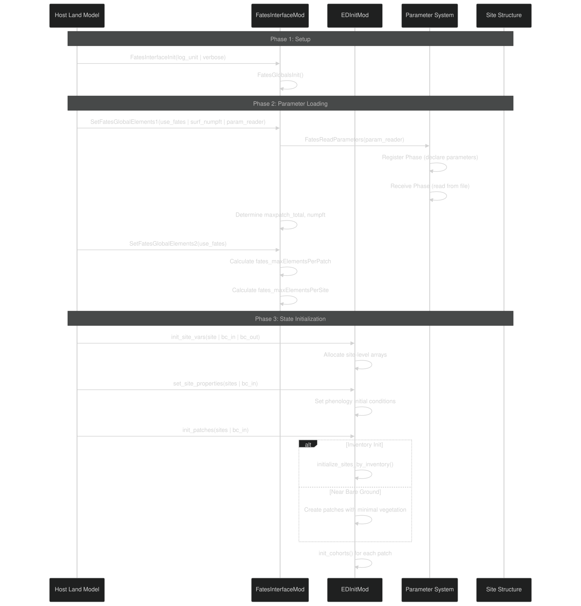

# Getting Started

Relevant source files

- [biogeophys/FatesPlantRespPhotosynthMod.F90](https://github.com/jingtao-lbl/fates/blob/e85d9977/biogeophys/FatesPlantRespPhotosynthMod.F90)
- [main/EDInitMod.F90](https://github.com/jingtao-lbl/fates/blob/e85d9977/main/EDInitMod.F90)
- [main/EDParamsMod.F90](https://github.com/jingtao-lbl/fates/blob/e85d9977/main/EDParamsMod.F90)
- [main/EDPftvarcon.F90](https://github.com/jingtao-lbl/fates/blob/e85d9977/main/EDPftvarcon.F90)
- [main/FatesInterfaceMod.F90](https://github.com/jingtao-lbl/fates/blob/e85d9977/main/FatesInterfaceMod.F90)
- [main/FatesInterfaceTypesMod.F90](https://github.com/jingtao-lbl/fates/blob/e85d9977/main/FatesInterfaceTypesMod.F90)
- [main/FatesInventoryInitMod.F90](https://github.com/jingtao-lbl/fates/blob/e85d9977/main/FatesInventoryInitMod.F90)
- [main/FatesRestartInterfaceMod.F90](https://github.com/jingtao-lbl/fates/blob/e85d9977/main/FatesRestartInterfaceMod.F90)
- [parameter_files/fates_params_default.cdl](https://github.com/jingtao-lbl/fates/blob/e85d9977/parameter_files/fates_params_default.cdl)

## Purpose and Scope

This page provides an overview of how FATES initializes and prepares for simulation. It covers the fundamental concepts needed to understand FATES startup, including the host land model interface, parameter loading, and initialization modes.

For detailed information on specific topics, see:

- [Host Model Interface](getting-started/host_interface.md)Host model coupling and boundary conditions:
- [Initialization Modes](getting-started/initialization.md)Different startup modes (cold start, inventory, restart):
- [Parameter System](getting-started/parameter_system.md)Parameter file structure and PFT parameters:
- [Parameter Management Tools](getting-started/parameter_tools.md)Tools for parameter manipulation:

The core execution loop and daily dynamics are covered in [Core Ecosystem Dynamics](core-dynamics/index.md) .

## Initialization Sequence Overview

FATES initialization occurs through a well-defined sequence of calls from the host land model (HLM). The process can be divided into three major phases: Setup , Parameter Loading , and State Initialization .

### Initialization Call Sequence

Sources:  [main/FatesInterfaceMod.F90 188-199](https://github.com/jingtao-lbl/fates/blob/e85d9977/main/FatesInterfaceMod.F90#L188-L199)  [main/FatesInterfaceMod.F90 737-804](https://github.com/jingtao-lbl/fates/blob/e85d9977/main/FatesInterfaceMod.F90#L737-L804)  [main/FatesInterfaceMod.F90 808-903](https://github.com/jingtao-lbl/fates/blob/e85d9977/main/FatesInterfaceMod.F90#L808-L903)  [main/EDInitMod.F90 117-219](https://github.com/jingtao-lbl/fates/blob/e85d9977/main/EDInitMod.F90#L117-L219)  [main/EDInitMod.F90 354-530](https://github.com/jingtao-lbl/fates/blob/e85d9977/main/EDInitMod.F90#L354-L530)  [main/EDInitMod.F90 534-710](https://github.com/jingtao-lbl/fates/blob/e85d9977/main/EDInitMod.F90#L534-L710)

## The FATES Interface Structure

The primary connection between FATES and the host land model is through the `fates_interface_type` object, which serves as the root of FATES data structures and manages boundary condition exchange.

### Core Interface Components

Sources:  [main/FatesInterfaceMod.F90 125-159](https://github.com/jingtao-lbl/fates/blob/e85d9977/main/FatesInterfaceMod.F90#L125-L159)  [main/FatesInterfaceTypesMod.F90 424-594](https://github.com/jingtao-lbl/fates/blob/e85d9977/main/FatesInterfaceTypesMod.F90#L424-L594)  [main/FatesInterfaceTypesMod.F90 596-728](https://github.com/jingtao-lbl/fates/blob/e85d9977/main/FatesInterfaceTypesMod.F90#L596-L728)

### Boundary Condition Allocation

The HLM is responsible for allocating boundary condition arrays before FATES can be initialized:

| Subroutine | Purpose | Key Arrays Allocated | 
| --- | --- | --- |
| allocate_bcin() | Allocate input boundary conditions | lightning24, solad_parb, solai_parb, smp_sl, tempk_sl, h2o_liqvol_sl | 
| allocate_bcout() | Allocate output boundary conditions | fsun_pa, laisun_pa, btran_pa, rootr_pasl, albd_parb, elai_pa | 
| allocate_bcpconst() | Allocate parameter constants | vmax_nh4, vmax_no3, vmax_p, eca_km_nh4 | 

Sources:  [main/FatesInterfaceMod.F90 412-565](https://github.com/jingtao-lbl/fates/blob/e85d9977/main/FatesInterfaceMod.F90#L412-L565)  [main/FatesInterfaceMod.F90 569-704](https://github.com/jingtao-lbl/fates/blob/e85d9977/main/FatesInterfaceMod.F90#L569-L704)  [main/FatesInterfaceMod.F90 225-243](https://github.com/jingtao-lbl/fates/blob/e85d9977/main/FatesInterfaceMod.F90#L225-L243)

## Two-Phase Parameter Loading

FATES uses a two-phase system to load parameters from NetCDF files. This design allows the host model to provide a parameter reader interface while FATES declares what parameters it needs.

### Parameter Loading Architecture

Sources:  [main/FatesInterfaceMod.F90 737-758](https://github.com/jingtao-lbl/fates/blob/e85d9977/main/FatesInterfaceMod.F90#L737-L758)  [main/EDParamsMod.F90 326-413](https://github.com/jingtao-lbl/fates/blob/e85d9977/main/EDParamsMod.F90#L326-L413)  [main/EDParamsMod.F90 415-710](https://github.com/jingtao-lbl/fates/blob/e85d9977/main/EDParamsMod.F90#L415-L710)  [main/EDPftvarcon.F90 315-438](https://github.com/jingtao-lbl/fates/blob/e85d9977/main/EDPftvarcon.F90#L315-L438)  [main/EDPftvarcon.F90 440-1108](https://github.com/jingtao-lbl/fates/blob/e85d9977/main/EDPftvarcon.F90#L440-L1108)

### Parameter Registration Example

During the Register Phase , each module declares parameters it needs:

During the Receive Phase , values are read and stored:

Sources:  [main/EDParamsMod.F90 326-413](https://github.com/jingtao-lbl/fates/blob/e85d9977/main/EDParamsMod.F90#L326-L413)  [main/EDParamsMod.F90 415-710](https://github.com/jingtao-lbl/fates/blob/e85d9977/main/EDParamsMod.F90#L415-L710)  [main/EDPftvarcon.F90 315-438](https://github.com/jingtao-lbl/fates/blob/e85d9977/main/EDPftvarcon.F90#L315-L438)  [main/EDPftvarcon.F90 440-1108](https://github.com/jingtao-lbl/fates/blob/e85d9977/main/EDPftvarcon.F90#L440-L1108)

## Initialization Modes

FATES supports three distinct initialization modes, each appropriate for different simulation scenarios. The mode is controlled by the `hlm_is_restart` and `hlm_use_inventory_init` flags.

### Initialization Mode Decision Tree

Sources:  [main/EDInitMod.F90 534-710](https://github.com/jingtao-lbl/fates/blob/e85d9977/main/EDInitMod.F90#L534-L710)  [main/FatesRestartInterfaceMod.F90 2150-2918](https://github.com/jingtao-lbl/fates/blob/e85d9977/main/FatesRestartInterfaceMod.F90#L2150-L2918)  [main/FatesInventoryInitMod.F90 113-388](https://github.com/jingtao-lbl/fates/blob/e85d9977/main/FatesInventoryInitMod.F90#L113-L388)

### Initialization Mode Comparison

| Mode | When Used | State Source | Key Modules | 
| --- | --- | --- | --- |
| Restart | Continuing previous simulation | Restart file (NetCDF) | FatesRestartInterfaceMod | 
| Inventory | Initializing from field data | PSS/CSS inventory files | FatesInventoryInitMod | 
| Near Bare Ground | Cold start with minimal vegetation | Parameter defaults | EDInitMod::init_patches() | 

For detailed information on each mode, see [Initialization Modes](getting-started/initialization.md) .

Sources:  [main/EDInitMod.F90 534-710](https://github.com/jingtao-lbl/fates/blob/e85d9977/main/EDInitMod.F90#L534-L710)  [main/FatesRestartInterfaceMod.F90 1-380](https://github.com/jingtao-lbl/fates/blob/e85d9977/main/FatesRestartInterfaceMod.F90#L1-L380)  [main/FatesInventoryInitMod.F90 1-109](https://github.com/jingtao-lbl/fates/blob/e85d9977/main/FatesInventoryInitMod.F90#L1-L109)

## Site Structure Initialization

After parameter loading, FATES initializes site-level data structures. Each site represents a geographic location and contains patches in an age-ordered linked list.

### Site Initialization Process

Sources:  [main/EDInitMod.F90 117-219](https://github.com/jingtao-lbl/fates/blob/e85d9977/main/EDInitMod.F90#L117-L219)  [main/EDInitMod.F90 354-530](https://github.com/jingtao-lbl/fates/blob/e85d9977/main/EDInitMod.F90#L354-L530)  [main/EDInitMod.F90 534-710](https://github.com/jingtao-lbl/fates/blob/e85d9977/main/EDInitMod.F90#L534-L710)  [main/EDInitMod.F90 713-1075](https://github.com/jingtao-lbl/fates/blob/e85d9977/main/EDInitMod.F90#L713-L1075)

### Site Array Allocations

Key arrays allocated during `init_site_vars()` :

| Array | Dimensions | Purpose | 
| --- | --- | --- |
| term_nindivs_canopy | nlevsclass x numpft | Track terminated individuals by size/PFT | 
| fmort_rate_canopy | nlevsclass x numpft | Fire mortality rates | 
| imort_rate | nlevsclass x numpft | Impact mortality rates | 
| mass_balance | num_elements | Track carbon/nutrient conservation | 
| flux_diags | num_elements | Element flux diagnostics | 
| liqvolmem_siwmft | numWaterMem x numpft | Soil moisture memory for phenology | 
| seed_bank | numpft | Seed pool by PFT | 

Sources:  [main/EDInitMod.F90 132-218](https://github.com/jingtao-lbl/fates/blob/e85d9977/main/EDInitMod.F90#L132-L218)

## PFT Parameter Structure

Plant Functional Type (PFT) parameters control vegetation physiology, allometry, and life history traits. These are loaded during initialization and accessed through the `EDPftvarcon_inst` singleton.

### PFT Parameter Organization

Sources:  [main/EDPftvarcon.F90 45-289](https://github.com/jingtao-lbl/fates/blob/e85d9977/main/EDPftvarcon.F90#L45-L289)  [parteh/PRTParametersMod.F90 1-100](https://github.com/jingtao-lbl/fates/blob/e85d9977/parteh/PRTParametersMod.F90#L1-L100)

### Key PFT Parameter Categories

| Category | Example Parameters | Module | 
| --- | --- | --- |
| Allometry | allom_d2h1, allom_d2h2, allom_d2bl1, allom_l2fr | EDPftvarcon, prt_params | 
| Physiology | vcmax25top, stomatal_intercept, medlyn_slope | EDPftvarcon | 
| Mortality | bmort, mort_scalar_cstarvation, mort_scalar_hydrfailure | EDPftvarcon | 
| Hydraulics | hydr_p50_node, hydr_avuln_node, hydr_kmax_node | EDPftvarcon | 
| Phenology | leaf_long, phenflush_fraction, evergreen | EDPftvarcon, prt_params | 
| Fire | fire_alpha_SH, bark_scaler, crown_kill | EDPftvarcon | 

Sources:  [parameter_files/fates_params_default.cdl 32-500](https://github.com/jingtao-lbl/fates/blob/e85d9977/parameter_files/fates_params_default.cdl#L32-L500)  [main/EDPftvarcon.F90 45-275](https://github.com/jingtao-lbl/fates/blob/e85d9977/main/EDPftvarcon.F90#L45-L275)

## Global Configuration Flags

FATES behavior is controlled by global flags set by the host land model during initialization. These flags are defined in `FatesInterfaceTypesMod` and remain constant throughout the simulation.

### Critical Global Flags

| Flag | Type | Purpose | Values | 
| --- | --- | --- | --- |
| hlm_use_planthydro | integer | Enable plant hydraulics | 0=off, 1=on | 
| hlm_parteh_mode | integer | PARTEH allocation hypothesis | 1=C-only, 2=CNP | 
| hlm_use_sp | integer | Satellite phenology mode | 0=off, 1=on | 
| hlm_use_nocomp | integer | No competition mode | 0=off, 1=on | 
| hlm_use_fixed_biogeog | integer | Fixed biogeography | 0=off, 1=on | 
| hlm_use_lu_harvest | integer | Land use harvest | 0=off, 1=on | 
| hlm_use_inventory_init | integer | Initialize from inventory | 0=off, 1=on | 
| hlm_is_restart | integer | Restart simulation | 0=cold start, 1=restart | 
| hlm_use_tree_damage | integer | Crown damage module | 0=off, 1=on | 

Sources:  [main/FatesInterfaceTypesMod.F90 23-196](https://github.com/jingtao-lbl/fates/blob/e85d9977/main/FatesInterfaceTypesMod.F90#L23-L196)

### Mode Compatibility

Sources:  [main/FatesInterfaceMod.F90 737-804](https://github.com/jingtao-lbl/fates/blob/e85d9977/main/FatesInterfaceMod.F90#L737-L804)  [main/EDInitMod.F90 354-530](https://github.com/jingtao-lbl/fates/blob/e85d9977/main/EDInitMod.F90#L354-L530)

## Summary: From Initialization to First Timestep

The complete initialization sequence prepares FATES for its first call to `ed_ecosystem_dynamics()` :

After initialization, control passes to the daily dynamics loop described in [Core Ecosystem Dynamics](core-dynamics/index.md) .

Sources:  [main/FatesInterfaceMod.F90 188-199](https://github.com/jingtao-lbl/fates/blob/e85d9977/main/FatesInterfaceMod.F90#L188-L199)  [main/FatesInterfaceMod.F90 737-804](https://github.com/jingtao-lbl/fates/blob/e85d9977/main/FatesInterfaceMod.F90#L737-L804)  [main/FatesInterfaceMod.F90 808-903](https://github.com/jingtao-lbl/fates/blob/e85d9977/main/FatesInterfaceMod.F90#L808-L903)  [main/EDInitMod.F90 117-219](https://github.com/jingtao-lbl/fates/blob/e85d9977/main/EDInitMod.F90#L117-L219)  [main/EDInitMod.F90 354-530](https://github.com/jingtao-lbl/fates/blob/e85d9977/main/EDInitMod.F90#L354-L530)  [main/EDInitMod.F90 534-710](https://github.com/jingtao-lbl/fates/blob/e85d9977/main/EDInitMod.F90#L534-L710)