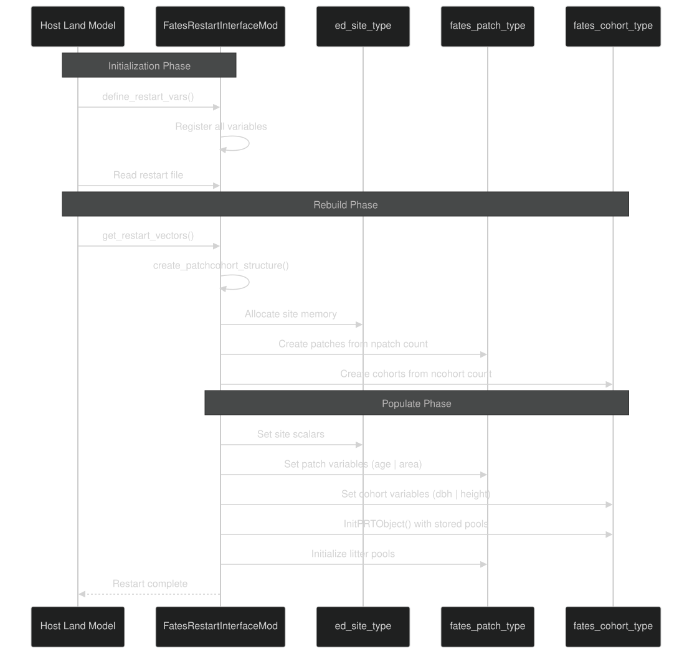

# Initialization Modes

Relevant source files

- [main/EDInitMod.F90](https://github.com/jingtao-lbl/fates/blob/e85d9977/main/EDInitMod.F90)
- [main/FatesInterfaceMod.F90](https://github.com/jingtao-lbl/fates/blob/e85d9977/main/FatesInterfaceMod.F90)
- [main/FatesInterfaceTypesMod.F90](https://github.com/jingtao-lbl/fates/blob/e85d9977/main/FatesInterfaceTypesMod.F90)
- [main/FatesInventoryInitMod.F90](https://github.com/jingtao-lbl/fates/blob/e85d9977/main/FatesInventoryInitMod.F90)
- [main/FatesRestartInterfaceMod.F90](https://github.com/jingtao-lbl/fates/blob/e85d9977/main/FatesRestartInterfaceMod.F90)

## Purpose and Scope

This document describes the three initialization modes available in FATES for starting a new simulation. These modes determine the initial state of vegetation, patches, and cohorts at the beginning of a model run. The initialization system is separate from the daily dynamics loop (see [3.1](core-dynamics/daily_loop.md) ) and the parameter loading system (see [2.3](getting-started/parameter_system.md) ).

## Overview of Initialization Modes

FATES supports three distinct initialization modes, controlled by flags set by the host land model:

| Mode | Control Flag | Description | Use Case | 
| --- | --- | --- | --- |
| Near-Bare-Ground | hlm_use_inventory_init == ifalse and hlm_is_restart == ifalse | Starts with minimal or no vegetation | Long spin-up runs, theoretical studies | 
| Inventory | hlm_use_inventory_init == itrue | Initializes from forest inventory data (PSS/CSS files) | Site-level studies with observed data | 
| Restart | hlm_is_restart == itrue | Continues from a previous simulation checkpoint | Production runs, sensitivity experiments | 

The initialization mode selection occurs during the cold-start process, before the daily dynamics loop begins. The host land model signals which mode to use via boundary condition flags.

Sources:  [main/FatesInterfaceTypesMod.F90 37-39](https://github.com/jingtao-lbl/fates/blob/e85d9977/main/FatesInterfaceTypesMod.F90#L37-L39)  [main/FatesInterfaceTypesMod.F90 175-179](https://github.com/jingtao-lbl/fates/blob/e85d9977/main/FatesInterfaceTypesMod.F90#L175-L179)  [main/EDInitMod.F90 534-803](https://github.com/jingtao-lbl/fates/blob/e85d9977/main/EDInitMod.F90#L534-L803)

## Initialization Mode Selection Flow

Sources:  [main/EDInitMod.F90 534-803](https://github.com/jingtao-lbl/fates/blob/e85d9977/main/EDInitMod.F90#L534-L803)  [main/FatesInventoryInitMod.F90 113-562](https://github.com/jingtao-lbl/fates/blob/e85d9977/main/FatesInventoryInitMod.F90#L113-L562)  [main/FatesRestartInterfaceMod.F90 358-359](https://github.com/jingtao-lbl/fates/blob/e85d9977/main/FatesRestartInterfaceMod.F90#L358-L359)

## Near-Bare-Ground Initialization

Near-bare-ground initialization creates a minimal vegetation state, suitable for long spin-up runs or when no inventory data is available.

### Process Overview

The `init_patches` subroutine in `EDInitMod` handles near-bare-ground initialization:

Sources:  [main/EDInitMod.F90 608-761](https://github.com/jingtao-lbl/fates/blob/e85d9977/main/EDInitMod.F90#L608-L761)  [main/EDInitMod.F90 656-706](https://github.com/jingtao-lbl/fates/blob/e85d9977/main/EDInitMod.F90#L656-L706)

### Cohort Initialization Parameters

The `init_cohorts` subroutine creates initial vegetation using PFT-specific parameters:

| Parameter | Source | Description | 
| --- | --- | --- |
| dbh | PFT parameter | Initial diameter at breast height [cm] | 
| cohort_n | Calculated | Number of individuals per patch | 
| height | Allometry | Calculated from DBH using h_allom | 
| c_area | Allometry | Crown area from carea_allom | 
| leaf_status | Phenology | Initial leaf on/off state | 
| prt | PARTEH | Biomass pools initialized via InitPRTObject | 

Sources:  [main/EDInitMod.F90 807-1037](https://github.com/jingtao-lbl/fates/blob/e85d9977/main/EDInitMod.F90#L807-L1037)  [main/EDInitMod.F90 859-913](https://github.com/jingtao-lbl/fates/blob/e85d9977/main/EDInitMod.F90#L859-L913)

## Inventory Initialization

Inventory initialization allows FATES to start from observed forest structure data, typically used for site-level simulations where measurements are available.

### File Structure

Inventory initialization requires three files:

### Inventory Control File Format

The control file format is defined in `assess_inventory_sites` :

| Field | Type | Description | 
| --- | --- | --- |
| format | integer | Format version (1 = legacy ED format) | 
| latitude | float | Geographic latitude of site | 
| longitude | float | Geographic longitude of site | 
| pss_path | string | Full path to patch file | 
| css_path | string | Full path to cohort file | 

Sources:  [main/FatesInventoryInitMod.F90 597-728](https://github.com/jingtao-lbl/fates/blob/e85d9977/main/FatesInventoryInitMod.F90#L597-L728)  [main/FatesInventoryInitMod.F90 616-625](https://github.com/jingtao-lbl/fates/blob/e85d9977/main/FatesInventoryInitMod.F90#L616-L625)

### PSS File Format (Patch Structure, Type 1)

| Field | Units | Description | 
| --- | --- | --- |
| time | year | Year of measurement | 
| patch | string | Unique patch identifier | 
| trk | integer | Land use type (0=non-forest, 1=secondary, 2=primary) | 
| age | years | Time since disturbance | 
| area | fraction | Fraction of site occupied by patch | 
| fsc | kg/m² | Fast soil carbon | 
| stsc | kg/m² | Structural soil carbon | 
| stsl | kg/m² | Structural soil lignin | 
| ssc | kg/m² | Slow soil carbon | 
| msn | kg/m² | Mineralized soil nitrogen | 
| fsn | kg/m² | Fast soil nitrogen | 

Sources:  [main/FatesInventoryInitMod.F90 732-841](https://github.com/jingtao-lbl/fates/blob/e85d9977/main/FatesInventoryInitMod.F90#L732-L841)  [main/FatesInventoryInitMod.F90 790-810](https://github.com/jingtao-lbl/fates/blob/e85d9977/main/FatesInventoryInitMod.F90#L790-L810)

### CSS File Format (Cohort Structure, Type 1)

The CSS file contains one line per cohort with the following key fields:

| Field | Units | Description | 
| --- | --- | --- |
| time | year | Year of measurement | 
| patch | string | Patch identifier (links to PSS) | 
| cohort | integer | Cohort number within patch | 
| dbh | cm | Diameter at breast height | 
| height | m | Tree height | 
| pft | integer | Plant functional type | 
| n | #/patch | Number of individuals | 
| bdead | kgC/plant | Structural biomass per plant | 
| balive | kgC/plant | Live biomass per plant | 

The `set_inventory_edcohort_type1` subroutine reads CSS records and creates cohorts with initialized PARTEH objects for biomass pools.

Sources:  [main/FatesInventoryInitMod.F90 846-1219](https://github.com/jingtao-lbl/fates/blob/e85d9977/main/FatesInventoryInitMod.F90#L846-L1219)  [main/FatesInventoryInitMod.F90 1051-1138](https://github.com/jingtao-lbl/fates/blob/e85d9977/main/FatesInventoryInitMod.F90#L1051-L1138)

### Inventory Initialization Process

Sources:  [main/FatesInventoryInitMod.F90 113-562](https://github.com/jingtao-lbl/fates/blob/e85d9977/main/FatesInventoryInitMod.F90#L113-L562)  [main/FatesInventoryInitMod.F90 231-557](https://github.com/jingtao-lbl/fates/blob/e85d9977/main/FatesInventoryInitMod.F90#L231-L557)

### Site Matching Algorithm

FATES matches each model grid cell to the nearest inventory site using Euclidean distance in latitude-longitude space:

If `distance > max_site_adjacency_deg` (0.05°), the initialization fails with an error.

Sources:  [main/FatesInventoryInitMod.F90 232-245](https://github.com/jingtao-lbl/fates/blob/e85d9977/main/FatesInventoryInitMod.F90#L232-L245)  [main/FatesInventoryInitMod.F90 99-102](https://github.com/jingtao-lbl/fates/blob/e85d9977/main/FatesInventoryInitMod.F90#L99-L102)

## Restart Initialization

Restart initialization continues a simulation from a previously saved state, preserving all patch, cohort, and site-level variables.

### Restart System Architecture

Sources:  [main/FatesRestartInterfaceMod.F90 631-1456](https://github.com/jingtao-lbl/fates/blob/e85d9977/main/FatesRestartInterfaceMod.F90#L631-L1456)  [main/FatesRestartInterfaceMod.F90 1458-2550](https://github.com/jingtao-lbl/fates/blob/e85d9977/main/FatesRestartInterfaceMod.F90#L1458-L2550)

### Key Restart Variables

The restart system saves/restores hundreds of variables. Key categories include:

| Category | Example Variables | Lines | 
| --- | --- | --- |
| Site | fates_PatchesPerSite, fates_gdd_site, fates_acc_nesterov_id | 661-713 | 
| Patch | fates_CohortsPerPatch, fates_age_pa, fates_area_pa | 722-737 | 
| Cohort | fates_dbh, fates_height, fates_nplant, fates_pft | 743-936 | 
| Phenology | fates_cold_dec_status, fates_cold_leafondate | 665-691 | 
| Mortality | fates_bmort, fates_cmort, fates_hmort | 873-908 | 
| PRT Pools | Defined via DefinePRTRestartVars | 2552-2665 | 
| Litter | fates_leaf_litt, fates_agcwd_litt, fates_bgcwd_litt | 940-954 | 

Sources:  [main/FatesRestartInterfaceMod.F90 661-1456](https://github.com/jingtao-lbl/fates/blob/e85d9977/main/FatesRestartInterfaceMod.F90#L661-L1456)

### Restart Data Flow

Sources:  [main/FatesRestartInterfaceMod.F90 1458-2550](https://github.com/jingtao-lbl/fates/blob/e85d9977/main/FatesRestartInterfaceMod.F90#L1458-L2550)

## Configuration and Control

### Relevant Flags and Parameters

Initialization behavior is controlled by several flags in `FatesInterfaceTypesMod` :

| Flag | Values | Effect on Initialization | 
| --- | --- | --- |
| hlm_is_restart | itrue / ifalse | If true, use restart mode | 
| hlm_use_inventory_init | itrue / ifalse | If true, use inventory files | 
| hlm_inventory_ctrl_file | file path | Location of inventory control file | 
| hlm_use_nocomp | itrue / ifalse | Create separate patches per PFT | 
| hlm_use_sp | itrue / ifalse | Satellite phenology mode (affects patch count) | 
| hlm_use_fixed_biogeog | itrue / ifalse | Use surface dataset PFT areas | 

Sources:  [main/FatesInterfaceTypesMod.F90 37-196](https://github.com/jingtao-lbl/fates/blob/e85d9977/main/FatesInterfaceTypesMod.F90#L37-L196)

### Initialization Sequence in Context

Sources:  [main/FatesInterfaceMod.F90 737-804](https://github.com/jingtao-lbl/fates/blob/e85d9977/main/FatesInterfaceMod.F90#L737-L804)  [main/EDInitMod.F90 117-219](https://github.com/jingtao-lbl/fates/blob/e85d9977/main/EDInitMod.F90#L117-L219)  [main/EDInitMod.F90 534-803](https://github.com/jingtao-lbl/fates/blob/e85d9977/main/EDInitMod.F90#L534-L803)

## Common Post-Initialization Steps

Regardless of initialization mode, several common steps occur after the initial state is established:

Sources:  [main/EDInitMod.F90 752-800](https://github.com/jingtao-lbl/fates/blob/e85d9977/main/EDInitMod.F90#L752-L800)  [main/EDInitMod.F90 795-800](https://github.com/jingtao-lbl/fates/blob/e85d9977/main/EDInitMod.F90#L795-L800)

## Summary Table: Mode Comparison

| Aspect | Near-Bare-Ground | Inventory | Restart | 
| --- | --- | --- | --- |
| Entry Point | init_patches | initialize_sites_by_inventory | get_restart_vectors | 
| Patch Count | 1 or numpft | From PSS file | From restart file | 
| Cohort Size | Small seedlings | From CSS file | From restart file | 
| Litter Pools | Zero | Zero (soil C in PSS) | From restart file | 
| Phenology State | Default values | Default values | Restored from file | 
| Fire Variables | Zero | Zero | Restored from file | 
| Use Case | Spin-up | Site studies | Continue runs | 
| Typical Runtime | Years to equilibrium | Months to years | Immediate | 

Sources:  [main/EDInitMod.F90 534-803](https://github.com/jingtao-lbl/fates/blob/e85d9977/main/EDInitMod.F90#L534-L803)  [main/FatesInventoryInitMod.F90 113-562](https://github.com/jingtao-lbl/fates/blob/e85d9977/main/FatesInventoryInitMod.F90#L113-L562)  [main/FatesRestartInterfaceMod.F90 1458-2550](https://github.com/jingtao-lbl/fates/blob/e85d9977/main/FatesRestartInterfaceMod.F90#L1458-L2550)