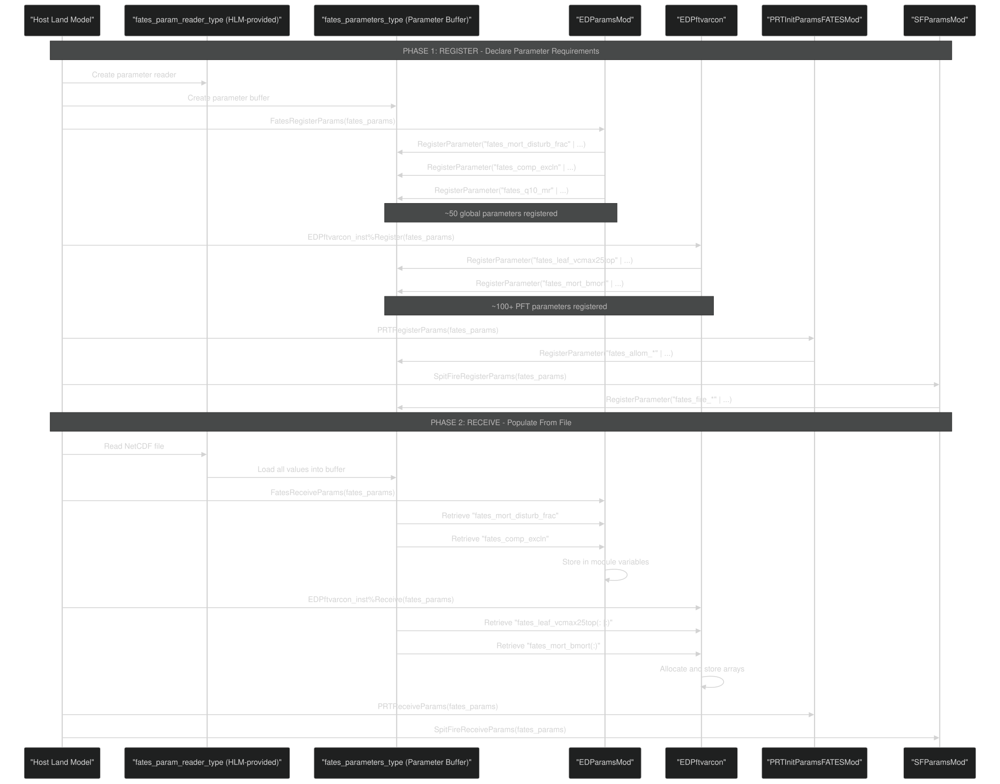
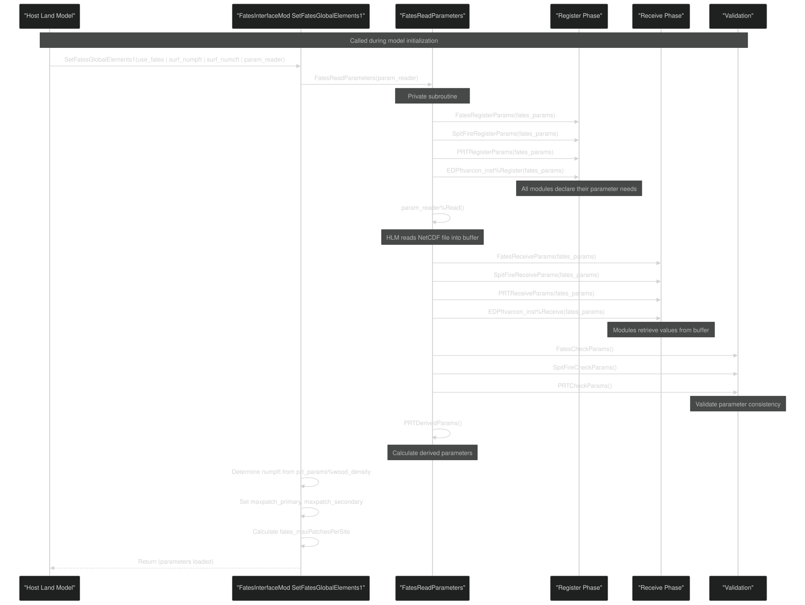

# Parameter System

Relevant source files

- [biogeophys/FatesPlantRespPhotosynthMod.F90](https://github.com/jingtao-lbl/fates/blob/e85d9977/biogeophys/FatesPlantRespPhotosynthMod.F90)
- [main/EDParamsMod.F90](https://github.com/jingtao-lbl/fates/blob/e85d9977/main/EDParamsMod.F90)
- [main/EDPftvarcon.F90](https://github.com/jingtao-lbl/fates/blob/e85d9977/main/EDPftvarcon.F90)
- [main/FatesInterfaceMod.F90](https://github.com/jingtao-lbl/fates/blob/e85d9977/main/FatesInterfaceMod.F90)
- [main/FatesInterfaceTypesMod.F90](https://github.com/jingtao-lbl/fates/blob/e85d9977/main/FatesInterfaceTypesMod.F90)
- [parameter_files/fates_params_default.cdl](https://github.com/jingtao-lbl/fates/blob/e85d9977/parameter_files/fates_params_default.cdl)

## Purpose and Scope

This document describes the FATES parameter system, which defines the configuration values that control model behavior. It covers the parameter file structure, the two-phase loading mechanism, and the storage modules that manage parameters at runtime. For information about Python tools used to modify parameter files, see [Parameter Management Tools](getting-started/parameter_tools.md) . For details about how parameters are used in specific processes like allocation or fire, see [PARTEH: Plant Allocation System](plant-physiology/parteh/index.md) and [Fire Dynamics: SPITFIRE](fire/index.md) .

## Parameter File Structure

FATES parameters are stored in NetCDF files that define both scalar and multi-dimensional parameters. The canonical definition exists in human-readable CDL (Common Data Language) format.

### File Organization

The primary parameter file is `fates_params_default.cdl` , which defines:

Dimensions (defining array sizes):

- `fates_pft`- number of plant functional types (typically 12)
- `fates_leafage_class`- number of leaf age classes
- `fates_hydr_organs`- hydraulic organs (leaf, stem, transporting root, absorbing root)
- `fates_plant_organs`- allocation organs
- `fates_history_size_bins``fates_history_age_bins`, , etc. - history output bin edges
- `fates_NCWD`- coarse woody debris size classes
- `fates_litterclass`- litter decomposition classes

[parameter_files/fates_params_default.cdl 1-16](https://github.com/jingtao-lbl/fates/blob/e85d9977/parameter_files/fates_params_default.cdl#L1-L16)

Variables with metadata:

- `units``long_name`Each variable has and attributes
- Variables may be scalar or multi-dimensional
- Character arrays store names (PFT names, organ names, etc.)

Example parameter definition:

[parameter_files/fates_params_default.cdl 368-370](https://github.com/jingtao-lbl/fates/blob/e85d9977/parameter_files/fates_params_default.cdl#L368-L370)

Sources: [parameter_files/fates_params_default.cdl 1-50](https://github.com/jingtao-lbl/fates/blob/e85d9977/parameter_files/fates_params_default.cdl#L1-L50)  [parameter_files/fates_params_default.cdl 368-370](https://github.com/jingtao-lbl/fates/blob/e85d9977/parameter_files/fates_params_default.cdl#L368-L370)

## Parameter Loading Architecture

FATES uses a two-phase parameter loading system that separates parameter declaration from parameter population. This design allows the host land model (HLM) to manage file I/O while FATES declares its requirements.

### Two-Phase Loading System

Sources: [main/FatesInterfaceMod.F90 758](https://github.com/jingtao-lbl/fates/blob/e85d9977/main/FatesInterfaceMod.F90#L758-L758)  [main/EDParamsMod.F90 391-584](https://github.com/jingtao-lbl/fates/blob/e85d9977/main/EDParamsMod.F90#L391-L584)  [main/EDPftvarcon.F90 315-346](https://github.com/jingtao-lbl/fates/blob/e85d9977/main/EDPftvarcon.F90#L315-L346)

### Parameter Interface Classes

Sources: [main/FatesInterfaceMod.F90 67-72](https://github.com/jingtao-lbl/fates/blob/e85d9977/main/FatesInterfaceMod.F90#L67-L72)  [main/EDParamsMod.F90 1-50](https://github.com/jingtao-lbl/fates/blob/e85d9977/main/EDParamsMod.F90#L1-L50)  [main/EDPftvarcon.F90 45-288](https://github.com/jingtao-lbl/fates/blob/e85d9977/main/EDPftvarcon.F90#L45-L288)

### Registration Phase Details

During registration, each module declares which parameters it needs by calling `RegisterParameter` :

The registration specifies:

- **name**: Parameter name matching the NetCDF variable name
- **dimension_shape**: Scalar (0D), 1D, or 2D array
- **dimension_names**`fates_pft``fates_hydr_organs`: Names of dimensions (e.g., , )
- **lower_bounds**: Array indexing lower bounds (typically 1)

[main/EDParamsMod.F90 544-546](https://github.com/jingtao-lbl/fates/blob/e85d9977/main/EDParamsMod.F90#L544-L546)

### Receive Phase Details

During the receive phase, modules retrieve parameter values and store them in module-level variables or derived type components:

For PFT-specific parameters, arrays are allocated based on the `numpft` value determined from the parameter file:

[main/EDPftvarcon.F90 332-346](https://github.com/jingtao-lbl/fates/blob/e85d9977/main/EDPftvarcon.F90#L332-L346)

Sources: [main/EDParamsMod.F90 544-546](https://github.com/jingtao-lbl/fates/blob/e85d9977/main/EDParamsMod.F90#L544-L546)  [main/EDPftvarcon.F90 332-346](https://github.com/jingtao-lbl/fates/blob/e85d9977/main/EDPftvarcon.F90#L332-L346)

## Parameter Storage Modules

FATES organizes parameters into specialized modules based on their scope and usage.

### Module Organization

Sources: [main/EDParamsMod.F90 1-100](https://github.com/jingtao-lbl/fates/blob/e85d9977/main/EDParamsMod.F90#L1-L100)  [main/EDPftvarcon.F90 45-275](https://github.com/jingtao-lbl/fates/blob/e85d9977/main/EDPftvarcon.F90#L45-L275)

### EDParamsMod - Global Parameters

Module `EDParamsMod` stores scalar parameters that apply globally across the simulation:

Key Global Parameters:

| Parameter | Type | Description | 
| --- | --- | --- |
| fates_mortality_disturbance_fraction | real(r8) | Fraction of canopy mortality causing disturbance | 
| ED_val_comp_excln | real(r8) | Weighting factor for canopy exclusion/promotion | 
| stomatal_model | integer | Stomatal conductance model (1=Ball-Berry, 2=Medlyn) | 
| regeneration_model | integer | Regeneration model choice | 
| photo_tempsens_model | integer | Photosynthesis temperature sensitivity model | 
| maintresp_leaf_model | integer | Leaf respiration model (1=Ryan 1991, 2=Atkin 2017) | 
| radiation_model | integer | Radiation model (1=Norman, 2=Two-stream) | 
| q10_mr | real(r8) | Q10 for maintenance respiration | 
| maxpatch_primary | integer | Maximum primary patches per site | 
| maxpatch_secondary | integer | Maximum secondary patches per site | 
| max_cohort_per_patch | integer | Maximum cohorts per patch | 

[main/EDParamsMod.F90 20-100](https://github.com/jingtao-lbl/fates/blob/e85d9977/main/EDParamsMod.F90#L20-L100)

Phenology Parameters:

- `ED_val_phen_a``ED_val_phen_b``ED_val_phen_c`, , - GDD accumulation function parameters
- `ED_val_phen_coldtemp`- Temperature threshold for cold days
- `ED_val_phen_mindayson`- Minimum days for leaves to remain on

[main/EDParamsMod.F90 62-67](https://github.com/jingtao-lbl/fates/blob/e85d9977/main/EDParamsMod.F90#L62-L67)

Cohort/Patch Fusion Tolerances:

- `ED_val_cohort_size_fusion_tol`- DBH similarity threshold for cohort fusion
- `ED_val_cohort_age_fusion_tol`- Age similarity threshold for cohort fusion
- `ED_val_patch_fusion_tol`- Profile similarity threshold for patch fusion

[main/EDParamsMod.F90 69-71](https://github.com/jingtao-lbl/fates/blob/e85d9977/main/EDParamsMod.F90#L69-L71)

Sources: [main/EDParamsMod.F90 20-100](https://github.com/jingtao-lbl/fates/blob/e85d9977/main/EDParamsMod.F90#L20-L100)  [main/EDParamsMod.F90 320-388](https://github.com/jingtao-lbl/fates/blob/e85d9977/main/EDParamsMod.F90#L320-L388)

### EDPftvarcon - PFT-Specific Parameters

The `EDPftvarcon_type` class (instantiated as `EDPftvarcon_inst` ) stores parameters that vary by plant functional type. These are typically arrays dimensioned `(numpft)` or `(numpft, other_dimension)` .

Structure:

Multi-dimensional PFT Parameters:

Some PFT parameters have additional dimensions:

- `vcmax25top(nleafage, numpft)`- Varies by leaf age class
- `hydr_p50_node(n_hydr_organs, numpft)`- Varies by plant organ
- `rhol(numpft, nSWbands)`- Varies by radiation band

[main/EDPftvarcon.F90 45-275](https://github.com/jingtao-lbl/fates/blob/e85d9977/main/EDPftvarcon.F90#L45-L275)

Parameter Access Pattern:

Sources: [main/EDPftvarcon.F90 45-275](https://github.com/jingtao-lbl/fates/blob/e85d9977/main/EDPftvarcon.F90#L45-L275)  [main/EDPftvarcon.F90 290](https://github.com/jingtao-lbl/fates/blob/e85d9977/main/EDPftvarcon.F90#L290-L290)

### PRTInitParamsFATESMod - Allocation Parameters

This module manages parameters for the PARTEH (Plant Allocation and Reactive Transport Extensible Hypotheses) system. Parameters are stored in the `prt_params` global structure.

Key Allocation Parameters:

| Parameter Group | Examples | 
| --- | --- |
| Biomass | wood_density(:), c2b(:) | 
| Leaf | slatop(:), leaf_long(:,:) | 
| Root | root_long(:), root_rho(:) | 
| Stoichiometry | nitr_stoich_p1(:,:), phos_stoich_p1(:,:) | 
| Growth | grperc(:) - growth respiration | 
| Turnover | leaf_turnover(:), root_turnover(:) | 

The structure supports both carbon-only and CNP flexible allocation modes through different parameter sets.

[main/FatesInterfaceMod.F90 71](https://github.com/jingtao-lbl/fates/blob/e85d9977/main/FatesInterfaceMod.F90#L71-L71)

Sources: [main/FatesInterfaceMod.F90 71](https://github.com/jingtao-lbl/fates/blob/e85d9977/main/FatesInterfaceMod.F90#L71-L71)

### SFParamsMod - Fire Parameters

Fire-related parameters are managed in `SFParamsMod` for the SPITFIRE fire model:

Fire Parameter Categories:

- **Ignition**: Lightning strike parameters, anthropogenic ignition
- **Fuel**: Fuel moisture, bulk density, mineral damping
- **Spread**: Rate of spread parameters, wind effects
- **Effects**: Crown scorch, cambial damage, mortality

[main/FatesInterfaceMod.F90 53](https://github.com/jingtao-lbl/fates/blob/e85d9977/main/FatesInterfaceMod.F90#L53-L53)  [main/FatesInterfaceMod.F90 70](https://github.com/jingtao-lbl/fates/blob/e85d9977/main/FatesInterfaceMod.F90#L70-L70)

Sources: [main/FatesInterfaceMod.F90 53](https://github.com/jingtao-lbl/fates/blob/e85d9977/main/FatesInterfaceMod.F90#L53-L53)  [main/FatesInterfaceMod.F90 70](https://github.com/jingtao-lbl/fates/blob/e85d9977/main/FatesInterfaceMod.F90#L70-L70)

## Parameter File Initialization Flow

The complete parameter initialization process as called from the host land model:

[main/FatesInterfaceMod.F90 737-804](https://github.com/jingtao-lbl/fates/blob/e85d9977/main/FatesInterfaceMod.F90#L737-L804)

Sources: [main/FatesInterfaceMod.F90 737-804](https://github.com/jingtao-lbl/fates/blob/e85d9977/main/FatesInterfaceMod.F90#L737-L804)

## Parameter Validation and Reporting

After parameters are loaded, FATES performs validation checks to ensure consistency and reports parameter values to the log.

### Validation Functions

Each parameter module provides a checking function:

- `FatesCheckParams()`- Validates global parameters
- `SpitFireCheckParams()`- Validates fire parameters
- `PRTCheckParams()`- Validates allocation parameters (checks stoichiometry ratios, allometry modes)

Example checks include:

- Ensuring fraction parameters are between 0 and 1
- Verifying required parameters are not at unset values
- Checking consistency between related parameters

[main/FatesInterfaceMod.F90 51-52](https://github.com/jingtao-lbl/fates/blob/e85d9977/main/FatesInterfaceMod.F90#L51-L52)

### Parameter Reporting

The `FatesReportParameters()` function outputs a complete list of parameter values to the log for documentation:

This creates a permanent record in the log file of the exact parameter values used for a simulation run.

[main/FatesInterfaceMod.F90 54](https://github.com/jingtao-lbl/fates/blob/e85d9977/main/FatesInterfaceMod.F90#L54-L54)  [main/FatesInterfaceMod.F90 170](https://github.com/jingtao-lbl/fates/blob/e85d9977/main/FatesInterfaceMod.F90#L170-L170)

Sources: [main/FatesInterfaceMod.F90 51-52](https://github.com/jingtao-lbl/fates/blob/e85d9977/main/FatesInterfaceMod.F90#L51-L52)  [main/FatesInterfaceMod.F90 54](https://github.com/jingtao-lbl/fates/blob/e85d9977/main/FatesInterfaceMod.F90#L54-L54)  [main/FatesInterfaceMod.F90 170](https://github.com/jingtao-lbl/fates/blob/e85d9977/main/FatesInterfaceMod.F90#L170-L170)

## Key Parameter Categories

### Allometry Parameters

Allometry parameters define size relationships between plant dimensions (DBH, height, leaf area, biomass). These are primarily stored in `prt_params` and accessed through allometry functions.

Major allometric relationships:

- `fates_allom_d2h1``fates_allom_d2h2``fates_allom_d2h3`DBH to height: , ,
- `fates_allom_d2bl1``fates_allom_d2bl2``fates_allom_d2bl3`DBH to leaf biomass: , ,
- `fates_allom_d2ca_coefficient_min``fates_allom_d2ca_coefficient_max`DBH to crown area: ,
- `fates_allom_la_per_sa_int``fates_allom_la_per_sa_slp`Leaf area to sapwood area: ,
- `fates_allom_agb1``fates_allom_agb2``fates_allom_agb3``fates_allom_agb4`AGB allometry: , , ,

Mode switches select which functional form to use:

- `fates_allom_hmode`- height allometry function
- `fates_allom_lmode`- leaf biomass function
- `fates_allom_smode`- sapwood allometry function
- `fates_allom_amode`- AGB allometry function

[parameter_files/fates_params_default.cdl 59-76](https://github.com/jingtao-lbl/fates/blob/e85d9977/parameter_files/fates_params_default.cdl#L59-L76)  [parameter_files/fates_params_default.cdl 86-148](https://github.com/jingtao-lbl/fates/blob/e85d9977/parameter_files/fates_params_default.cdl#L86-L148)

### Photosynthesis Parameters

Key photosynthesis parameters control carbon assimilation:

- `fates_leaf_vcmax25top`- Maximum carboxylation rate at 25°C at canopy top
- `fates_leaf_slatop`- Specific leaf area at canopy top
- `fates_leaf_stomatal_slope_ballberry`- Ball-Berry stomatal slope parameter
- `fates_leaf_stomatal_slope_medlyn`- Medlyn stomatal slope parameter
- `fates_leaf_stomatal_intercept`- Minimum stomatal conductance
- `fates_leaf_c3psn`- Photosynthetic pathway flag (1=C3, 0=C4)

Temperature sensitivity parameters (if using Kumarathunge model):

- `fates_leaf_vcmaxha``fates_leaf_vcmaxhd``fates_leaf_vcmaxse`, ,
- `fates_leaf_jmaxha``fates_leaf_jmaxhd``fates_leaf_jmaxse`, ,

[parameter_files/fates_params_default.cdl 341-379](https://github.com/jingtao-lbl/fates/blob/e85d9977/parameter_files/fates_params_default.cdl#L341-L379)

### Mortality Parameters

Mortality parameters control various death processes:

Background mortality:

- `fates_mort_bmort`- Background mortality rate [1/yr]

Carbon starvation:

- `fates_mort_scalar_cstarvation`- Maximum mortality rate from starvation
- `fates_mort_upthresh_cstarvation`- Storage threshold above which starvation is zero

Hydraulic failure:

- `fates_mort_scalar_hydrfailure`- Maximum mortality rate from hydraulic failure
- `fates_mort_hf_sm_threshold`- Soil moisture threshold (non-hydraulic model)
- `fates_mort_hf_flc_threshold`- Fractional loss of conductivity threshold (hydraulic model)

Size/age senescence:

- `fates_mort_ip_size_senescence`- DBH at inflection point
- `fates_mort_r_size_senescence`- Rate of mortality increase with DBH
- `fates_mort_ip_age_senescence`- Age at inflection point
- `fates_mort_r_age_senescence`- Rate of mortality increase with age

Environmental:

- `fates_mort_freezetol`- Minimum temperature tolerance
- `fates_mort_scalar_coldstress`- Maximum mortality from cold stress

[parameter_files/fates_params_default.cdl 395-437](https://github.com/jingtao-lbl/fates/blob/e85d9977/parameter_files/fates_params_default.cdl#L395-L437)

### Hydraulics Parameters

Plant hydraulics parameters (active when `hlm_use_planthydro=.true.` ):

Organ-level parameters (dimensioned by organ):

- `fates_hydro_p50_node`- Water potential at 50% conductivity loss [MPa]
- `fates_hydro_avuln_node`- Vulnerability curve shape parameter
- `fates_hydro_kmax_node`- Maximum conductivity [kg/MPa/m/s]
- `fates_hydro_epsil_node`- Bulk elastic modulus [MPa]
- `fates_hydro_thetas_node`- Saturated water content [cm³/cm³]
- `fates_hydro_resid_node`- Residual water content [cm³/cm³]

Stomatal control:

- `fates_hydro_p50_gs`- Water potential at 50% stomatal closure [MPa]
- `fates_hydro_avuln_gs`- Stomatal vulnerability shape parameter

Root parameters:

- `fates_hydro_rs2`- Absorbing root radius [m]
- `fates_hydro_srl`- Specific root length [m/g]

[parameter_files/fates_params_default.cdl 284-341](https://github.com/jingtao-lbl/fates/blob/e85d9977/parameter_files/fates_params_default.cdl#L284-L341)

### Nutrient Parameters

Nutrient acquisition parameters for nitrogen and phosphorus dynamics:

Uptake kinetics:

- `fates_cnp_vmax_nh4`- Maximum NH4 uptake rate [gN/gC/s]
- `fates_cnp_vmax_no3`- Maximum NO3 uptake rate [gN/gC/s]
- `fates_cnp_vmax_p`- Maximum P uptake rate [gP/gC/s]

ECA (Enzyme Competition Approach) parameters:

- `fates_cnp_eca_km_nh4`- Half-saturation constant for NH4 [gN/m³]
- `fates_cnp_eca_km_no3`- Half-saturation constant for NO3 [gN/m³]
- `fates_cnp_eca_km_p`- Half-saturation constant for P [gP/m³]
- `fates_cnp_eca_vmax_ptase`- Maximum phosphatase production [gP/m²/s]
- `fates_cnp_eca_km_ptase`- Half-saturation for biochemical P [gP/m³]
- `fates_cnp_eca_alpha_ptase`- Fraction of P from ptase to plant
- `fates_cnp_eca_decompmicc`- Maximum microbial decomposer biomass [gC/m³]

Storage and allocation:

- `fates_cnp_nitr_store_ratio`- Storable N as ratio to structural N
- `fates_cnp_phos_store_ratio`- Storable P as ratio to structural P
- `fates_cnp_store_ovrflw_frac`- Overflow storage size

PID controller for adaptive fine-root allocation:

- `fates_cnp_pid_kp`- Proportional constant
- `fates_cnp_pid_ki`- Integral constant
- `fates_cnp_pid_kd`- Derivative constant

[parameter_files/fates_params_default.cdl 170-236](https://github.com/jingtao-lbl/fates/blob/e85d9977/parameter_files/fates_params_default.cdl#L170-L236)

Sources: [parameter_files/fates_params_default.cdl 59-76](https://github.com/jingtao-lbl/fates/blob/e85d9977/parameter_files/fates_params_default.cdl#L59-L76)  [parameter_files/fates_params_default.cdl 86-148](https://github.com/jingtao-lbl/fates/blob/e85d9977/parameter_files/fates_params_default.cdl#L86-L148)  [parameter_files/fates_params_default.cdl 170-236](https://github.com/jingtao-lbl/fates/blob/e85d9977/parameter_files/fates_params_default.cdl#L170-L236)  [parameter_files/fates_params_default.cdl 284-341](https://github.com/jingtao-lbl/fates/blob/e85d9977/parameter_files/fates_params_default.cdl#L284-L341)  [parameter_files/fates_params_default.cdl 341-379](https://github.com/jingtao-lbl/fates/blob/e85d9977/parameter_files/fates_params_default.cdl#L341-L379)  [parameter_files/fates_params_default.cdl 395-437](https://github.com/jingtao-lbl/fates/blob/e85d9977/parameter_files/fates_params_default.cdl#L395-L437)

## Parameter Usage in Code

Parameters are accessed directly from their respective modules:

Global parameters:

PFT parameters:

Allocation parameters:

This direct access pattern (rather than passing parameters through function arguments) is used throughout FATES for simplicity and efficiency.

Sources: [biogeophys/FatesPlantRespPhotosynthMod.F90 46](https://github.com/jingtao-lbl/fates/blob/e85d9977/biogeophys/FatesPlantRespPhotosynthMod.F90#L46-L46)  [biogeophys/FatesPlantRespPhotosynthMod.F90 66-67](https://github.com/jingtao-lbl/fates/blob/e85d9977/biogeophys/FatesPlantRespPhotosynthMod.F90#L66-L67)  [biogeophys/FatesPlantRespPhotosynthMod.F90 295-296](https://github.com/jingtao-lbl/fates/blob/e85d9977/biogeophys/FatesPlantRespPhotosynthMod.F90#L295-L296)