# Parameter Management Tools

Relevant source files

- [biogeophys/FatesPlantRespPhotosynthMod.F90](https://github.com/jingtao-lbl/fates/blob/e85d9977/biogeophys/FatesPlantRespPhotosynthMod.F90)
- [main/EDParamsMod.F90](https://github.com/jingtao-lbl/fates/blob/e85d9977/main/EDParamsMod.F90)
- [main/EDPftvarcon.F90](https://github.com/jingtao-lbl/fates/blob/e85d9977/main/EDPftvarcon.F90)
- [parameter_files/fates_params_default.cdl](https://github.com/jingtao-lbl/fates/blob/e85d9977/parameter_files/fates_params_default.cdl)
- [parameter_files/patch_default_bciopt224.xml](https://github.com/jingtao-lbl/fates/blob/e85d9977/parameter_files/patch_default_bciopt224.xml)
- [parameter_files/patch_default_e3smtest.xml](https://github.com/jingtao-lbl/fates/blob/e85d9977/parameter_files/patch_default_e3smtest.xml)
- [tools/BatchPatchParams.py](https://github.com/jingtao-lbl/fates/blob/e85d9977/tools/BatchPatchParams.py)
- [tools/FatesPFTIndexSwapper.py](https://github.com/jingtao-lbl/fates/blob/e85d9977/tools/FatesPFTIndexSwapper.py)
- [tools/modify_fates_paramfile.py](https://github.com/jingtao-lbl/fates/blob/e85d9977/tools/modify_fates_paramfile.py)
- [tools/ncvarsort.py](https://github.com/jingtao-lbl/fates/blob/e85d9977/tools/ncvarsort.py)

## Purpose and Scope

This page documents the Python tools provided for modifying FATES parameter files. These tools enable systematic parameter manipulation for calibration, sensitivity studies, and model configuration. For information about the parameter file structure and how parameters are loaded into FATES, see [Parameter System](getting-started/parameter_system.md) .

The parameter management tools operate on NetCDF parameter files (or their human-readable CDL counterparts) and provide capabilities for:

- Modifying individual parameter values
- Cloning and reordering PFTs (Plant Functional Types)
- Batch modifications using XML configuration files
- Organizing and sorting parameter file variables

All tools are located in the `tools/` directory and are implemented as standalone Python scripts.

Sources: [tools/modify_fates_paramfile.py](https://github.com/jingtao-lbl/fates/blob/e85d9977/tools/modify_fates_paramfile.py)  [tools/FatesPFTIndexSwapper.py](https://github.com/jingtao-lbl/fates/blob/e85d9977/tools/FatesPFTIndexSwapper.py)  [tools/ncvarsort.py](https://github.com/jingtao-lbl/fates/blob/e85d9977/tools/ncvarsort.py)  [tools/BatchPatchParams.py](https://github.com/jingtao-lbl/fates/blob/e85d9977/tools/BatchPatchParams.py)  [parameter_files/fates_params_default.cdl](https://github.com/jingtao-lbl/fates/blob/e85d9977/parameter_files/fates_params_default.cdl)

## Tool Architecture and Workflow

The following diagram shows how the parameter management tools interact with parameter files and each other:

Diagram: Parameter Tool Workflow

The workflow typically follows one of two paths:

Sources: [tools/modify_fates_paramfile.py 1-327](https://github.com/jingtao-lbl/fates/blob/e85d9977/tools/modify_fates_paramfile.py#L1-L327)  [tools/FatesPFTIndexSwapper.py 1-279](https://github.com/jingtao-lbl/fates/blob/e85d9977/tools/FatesPFTIndexSwapper.py#L1-L279)  [tools/ncvarsort.py 1-138](https://github.com/jingtao-lbl/fates/blob/e85d9977/tools/ncvarsort.py#L1-L138)  [tools/BatchPatchParams.py 1-198](https://github.com/jingtao-lbl/fates/blob/e85d9977/tools/BatchPatchParams.py#L1-L198)

## Tool 1: modify_fates_paramfile.py

### Purpose

`modify_fates_paramfile.py` is the primary tool for modifying individual parameter values in a FATES parameter file. It can modify scalar parameters, PFT-specific parameters, and multi-dimensional arrays.

### Command-Line Interface

The tool accepts the following arguments:

| Argument | Required | Description | 
| --- | --- | --- |
| --var, --variable | Yes | Name of the variable to modify | 
| --val, --value | Yes | New value(s) as a real number or comma-separated list | 
| --fin, --input | Yes | Input NetCDF filename | 
| --fout, --output | Yes | Output NetCDF filename | 
| --pft, --PFT | No | PFT number to modify (1-indexed) | 
| --pftname, --PFTname | No | PFT name to modify (alternative to --pft) | 
| --allPFTs, --allpfts | No | Apply to all PFT indices | 
| --all | No | Replace all values for the parameter | 
| --O, --overwrite | No | Automatically overwrite output file | 
| --silent, --s | No | Suppress output messages | 
| --nohist | No | Do not record edit in file history | 
| --changeshape | No | Allow changing variable dimensions | 

Sources: [tools/modify_fates_paramfile.py 36-52](https://github.com/jingtao-lbl/fates/blob/e85d9977/tools/modify_fates_paramfile.py#L36-L52)

### Variable Dimensionality Handling

The script automatically detects variable dimensionality and handles different cases:

Diagram: modify_fates_paramfile.py Dimension Handling Logic

Sources: [tools/modify_fates_paramfile.py 128-154](https://github.com/jingtao-lbl/fates/blob/e85d9977/tools/modify_fates_paramfile.py#L128-L154)  [tools/modify_fates_paramfile.py 241-304](https://github.com/jingtao-lbl/fates/blob/e85d9977/tools/modify_fates_paramfile.py#L241-L304)

### Example Usage

Modify a PFT-specific parameter:

Modify a global parameter:

Modify all PFTs at once:

Modify a multi-dimensional array:

Sources: [tools/modify_fates_paramfile.py 66-126](https://github.com/jingtao-lbl/fates/blob/e85d9977/tools/modify_fates_paramfile.py#L66-L126)  [tools/modify_fates_paramfile.py 262-305](https://github.com/jingtao-lbl/fates/blob/e85d9977/tools/modify_fates_paramfile.py#L262-L305)

### History Tracking

By default, the tool appends a record of each modification to the NetCDF file's `history` attribute:

This can be suppressed with the `--nohist` flag.

Sources: [tools/modify_fates_paramfile.py 307-315](https://github.com/jingtao-lbl/fates/blob/e85d9977/tools/modify_fates_paramfile.py#L307-L315)

### Dimension Reshaping

The `--changeshape` flag enables modifying the size of certain dimensions (e.g., `fates_history_age_bins` , `fates_history_size_bins` ). When reshaping:

- **larger**If the new dimension is , new entries are filled with zeros
- **smaller**If the new dimension is , the array is truncated
- All variables sharing that dimension are reshaped accordingly

This operation is restricted to "plastic" dimensions that can be safely modified without breaking model functionality:

- `fates_history_age_bins`
- `fates_history_size_bins`
- `fates_history_coage_bins`
- `fates_history_height_bins`
- `fates_leafage_class`

Sources: [tools/modify_fates_paramfile.py 156-240](https://github.com/jingtao-lbl/fates/blob/e85d9977/tools/modify_fates_paramfile.py#L156-L240)

## Tool 2: FatesPFTIndexSwapper.py

### Purpose

`FatesPFTIndexSwapper.py` creates a new parameter file by cloning and reordering PFTs from an input file. This is useful for:

- Reducing the number of PFTs for simplified simulations
- Duplicating PFTs for sensitivity studies
- Reordering PFTs to match different indexing schemes

### Command-Line Interface

| Argument | Required | Description | 
| --- | --- | --- |
| --fin | Yes | Input NetCDF filename | 
| --fout | Yes | Output NetCDF filename | 
| --pft-indices | Yes | Comma-delimited list of PFT indices to include (1-indexed) | 
| --nohist | No | Do not record operation in file history | 
| -h, --help | No | Print help message | 

Sources: [tools/FatesPFTIndexSwapper.py 79-133](https://github.com/jingtao-lbl/fates/blob/e85d9977/tools/FatesPFTIndexSwapper.py#L79-L133)

### PFT Cloning Logic

The tool processes each variable in the input file and handles different dimensionalities:

Diagram: FatesPFTIndexSwapper.py PFT Cloning Logic

Sources: [tools/FatesPFTIndexSwapper.py 161-256](https://github.com/jingtao-lbl/fates/blob/e85d9977/tools/FatesPFTIndexSwapper.py#L161-L256)

### Handled Dimensions

The swapper recognizes and correctly handles the following dimensions:

| Dimension Name | Description | 
| --- | --- |
| fates_pft | PFT dimension (modified by the tool) | 
| fates_plant_organs | Plant organ dimension (4: leaf, fnrt, sapw, store) | 
| fates_hydr_organs | Hydraulic organ dimension (4: leaf, stem, troot, aroot) | 
| fates_litterclass | Litter class dimension (6 classes) | 
| fates_string_length | Character string length (60 characters) | 

Sources: [tools/FatesPFTIndexSwapper.py 26-30](https://github.com/jingtao-lbl/fates/blob/e85d9977/tools/FatesPFTIndexSwapper.py#L26-L30)  [tools/FatesPFTIndexSwapper.py 171-190](https://github.com/jingtao-lbl/fates/blob/e85d9977/tools/FatesPFTIndexSwapper.py#L171-L190)

### Example Usage

Create a 3-PFT file from the first PFT repeated:

Reorder PFTs (swap PFT 1 and PFT 2):

Extract a subset of PFTs:

Sources: [tools/FatesPFTIndexSwapper.py 49-76](https://github.com/jingtao-lbl/fates/blob/e85d9977/tools/FatesPFTIndexSwapper.py#L49-L76)

### Output Dimensions

The output file has the same dimensions as the input file, except:

- `fates_pft``--pft-indices`dimension is resized to match the length of
- All other dimensions remain unchanged

Sources: [tools/FatesPFTIndexSwapper.py 154-160](https://github.com/jingtao-lbl/fates/blob/e85d9977/tools/FatesPFTIndexSwapper.py#L154-L160)

## Tool 3: ncvarsort.py

### Purpose

`ncvarsort.py` reorganizes variables in a NetCDF file into a standardized order. This improves readability and ensures consistency across parameter files. The tool is particularly useful after multiple modifications that may have left variables in arbitrary order.

### Command-Line Interface

| Argument | Required | Description | 
| --- | --- | --- |
| --fin, --input | Yes | Input NetCDF filename | 
| --fout, --output | Yes | Output NetCDF filename | 
| --O, --overwrite | No | Automatically overwrite output file | 
| --debug | No | Output detailed diagnostics | 
| --silent | No | Suppress output messages | 

Sources: [tools/ncvarsort.py 16-25](https://github.com/jingtao-lbl/fates/blob/e85d9977/tools/ncvarsort.py#L16-L25)

### Sorting Strategy

Variables are sorted first by dimensionality type, then alphabetically within each group:

Diagram: ncvarsort.py Variable Grouping and Sorting Strategy

Sources: [tools/ncvarsort.py 37-59](https://github.com/jingtao-lbl/fates/blob/e85d9977/tools/ncvarsort.py#L37-L59)  [tools/ncvarsort.py 62-71](https://github.com/jingtao-lbl/fates/blob/e85d9977/tools/ncvarsort.py#L62-L71)

### Example Usage

The tool copies all dimensions, variables, attributes, and metadata while reordering the variables according to the predefined sorting strategy.

Sources: [tools/ncvarsort.py 86-131](https://github.com/jingtao-lbl/fates/blob/e85d9977/tools/ncvarsort.py#L86-L131)

## Tool 4: BatchPatchParams.py

### Purpose

`BatchPatchParams.py` orchestrates multiple parameter modifications using an XML control file. This tool is designed for complex parameter changes involving multiple PFTs and parameters, making it ideal for:

- Site-specific calibrations
- Creating specialized parameter sets for experiments
- Documenting systematic parameter modifications

The tool internally uses `FatesPFTIndexSwapper.py` , `modify_fates_paramfile.py` , and `ncvarsort.py` as building blocks.

### Command-Line Interface

| Argument | Required | Description | 
| --- | --- | --- |
| --f | Yes | XML control file path | 

Sources: [tools/BatchPatchParams.py 88-91](https://github.com/jingtao-lbl/fates/blob/e85d9977/tools/BatchPatchParams.py#L88-L91)

### XML Control File Structure

The XML control file has the following structure:

Sources: [parameter_files/patch_default_bciopt224.xml 1-63](https://github.com/jingtao-lbl/fates/blob/e85d9977/parameter_files/patch_default_bciopt224.xml#L1-L63)

### XML Element Definitions

| Element | Required | Description | 
| --- | --- | --- |
| <base_file> | Yes | Path to base CDL parameter file | 
| <new_file> | Yes | Path to output CDL file | 
| <pft_trim_list> | Yes | Comma-separated PFT indices to retain | 
| <notes> | No | Free-text description of parameter set | 
| <parameters> | Yes | Container for parameter groups | 
| <non_pft_group> | No | Global (non-PFT-specific) parameters | 
| <pft_group> | No | PFT-specific parameters with ids attribute | 

Sources: [tools/BatchPatchParams.py 98-102](https://github.com/jingtao-lbl/fates/blob/e85d9977/tools/BatchPatchParams.py#L98-L102)

### Batch Processing Workflow

Diagram: BatchPatchParams.py Workflow

Sources: [tools/BatchPatchParams.py 86-197](https://github.com/jingtao-lbl/fates/blob/e85d9977/tools/BatchPatchParams.py#L86-L197)

### Parameter Group Processing

Non-PFT Group:

- Parameters without PFT dimension
- Applied globally to the entire file
- `--all``modify_fates_paramfile.py`Uses flag in

PFT Group:

- Parameters with PFT dimension
- `ids`Requires attribute specifying target PFT indices
- 
- Single value applied to all specified PFTs
- Comma-separated list matching number of PFTs
- `fates_stoich_nitr`Multi-valued per PFT (e.g., for with 4 organ values)

Values can be:

Sources: [tools/BatchPatchParams.py 122-172](https://github.com/jingtao-lbl/fates/blob/e85d9977/tools/BatchPatchParams.py#L122-L172)

### Example XML Files

Simple parameter patch (patch_default_e3smtest.xml):

Sources: [parameter_files/patch_default_e3smtest.xml 1-11](https://github.com/jingtao-lbl/fates/blob/e85d9977/parameter_files/patch_default_e3smtest.xml#L1-L11)

Complex calibration (patch_default_bciopt224.xml):

This example demonstrates:

- Single PFT extraction (only PFT 1)
- `fates_stoich_nitr`Multi-dimensional parameter modification ( has 4 organ values)
- Non-PFT parameter modification
- `<notes>`Comprehensive calibration documentation in

Sources: [parameter_files/patch_default_bciopt224.xml 1-63](https://github.com/jingtao-lbl/fates/blob/e85d9977/parameter_files/patch_default_bciopt224.xml#L1-L63)

## Common Workflows

### Workflow 1: Single Parameter Modification

### Workflow 2: Create Simplified PFT Set

### Workflow 3: Batch Calibration

### Workflow 4: Parameter Sensitivity Study

### Workflow 5: PFT Name Modification

## File Format Details

### CDL Format

CDL (Common Data form Language) is the human-readable text representation of NetCDF files. The structure includes:

Key CDL Elements:

- `dimensions:`- Define array dimensions
- `variables:`- Declare variables with type, dimensions, and attributes
- `data:`- Provide actual parameter values

Sources: [parameter_files/fates_params_default.cdl 1-100](https://github.com/jingtao-lbl/fates/blob/e85d9977/parameter_files/fates_params_default.cdl#L1-L100)

### NetCDF Format

NetCDF is the binary format used by FATES at runtime. Conversion between CDL and NetCDF:

### XML Patch Format

XML patch files structure parameter modifications hierarchically:

Sources: [parameter_files/patch_default_bciopt224.xml 7-54](https://github.com/jingtao-lbl/fates/blob/e85d9977/parameter_files/patch_default_bciopt224.xml#L7-L54)

## Integration with FATES Parameter System

The parameter files produced by these tools are loaded into FATES through the parameter interface system:

Diagram: Parameter Tools Integration with FATES

For details on how parameters are loaded and used, see [Parameter System](getting-started/parameter_system.md) .

Sources: [main/EDPftvarcon.F90 315-346](https://github.com/jingtao-lbl/fates/blob/e85d9977/main/EDPftvarcon.F90#L315-L346)  [main/EDParamsMod.F90 1-300](https://github.com/jingtao-lbl/fates/blob/e85d9977/main/EDParamsMod.F90#L1-L300)

## Best Practices

### Parameter Modification Guidelines

### Debugging Parameter Issues

### Version Control

Parameter files should be tracked in version control as CDL (not NetCDF) for:

- Human-readable diffs
- Merge conflict resolution
- Clear change documentation

Convert to NetCDF before running simulations:

## Technical Implementation Details

### Data Type Handling

`modify_fates_paramfile.py` handles different data types:

| Input | Interpretation | Example | 
| --- | --- | --- |
| Single number | Float | 50.0 | 
| Comma-separated | Array of floats | 1.0,2.0,3.0 | 
| String (for fates_pftname) | Character array | "tropical_broadleaf" | 

Sources: [tools/modify_fates_paramfile.py 66-82](https://github.com/jingtao-lbl/fates/blob/e85d9977/tools/modify_fates_paramfile.py#L66-L82)

### Dimension Metadata Preservation

All tools preserve NetCDF metadata:

- `units`Variable attribute
- `long_name`Variable attribute
- `history``--nohist`Global attribute (unless )
- Dimension sizes and names

Sources: [tools/FatesPFTIndexSwapper.py 255-256](https://github.com/jingtao-lbl/fates/blob/e85d9977/tools/FatesPFTIndexSwapper.py#L255-L256)  [tools/ncvarsort.py 123-127](https://github.com/jingtao-lbl/fates/blob/e85d9977/tools/ncvarsort.py#L123-L127)

### Temporary File Management

`BatchPatchParams.py` uses temporary files to avoid data loss:

This ensures the original file remains intact even if the process fails.

Sources: [tools/BatchPatchParams.py 105-110](https://github.com/jingtao-lbl/fates/blob/e85d9977/tools/BatchPatchParams.py#L105-L110)

## Limitations and Caveats

### Known Limitations

### Parameter Constraints

Parameters must satisfy model constraints (not enforced by tools):

- Allometry mode indices must match available functions
- Stoichiometry ratios must be positive
- Mortality rates must be between 0 and 1 (per year)
- PFT-specific arrays must match the number of PFTs

These constraints are checked when FATES initializes, not when the parameter file is created.

Sources: [main/EDPftvarcon.F90 1-300](https://github.com/jingtao-lbl/fates/blob/e85d9977/main/EDPftvarcon.F90#L1-L300)

## Summary

The FATES parameter management tools provide a flexible framework for systematic parameter manipulation:

| Tool | Primary Use Case | Key Features | 
| --- | --- | --- |
| modify_fates_paramfile.py | Single parameter edits | PFT-specific, array support, history tracking | 
| FatesPFTIndexSwapper.py | PFT cloning/reordering | Preserve multi-dimensional structure | 
| ncvarsort.py | Variable organization | Standardized sorting order | 
| BatchPatchParams.py | Complex modifications | XML-driven, orchestrates other tools | 

All tools operate on NetCDF files and preserve metadata. For information about the parameters themselves and their scientific meaning, see [Parameter System](getting-started/parameter_system.md) . For the initialization process that loads these parameters, see [Initialization Modes](getting-started/initialization.md) .

Sources: [tools/modify_fates_paramfile.py](https://github.com/jingtao-lbl/fates/blob/e85d9977/tools/modify_fates_paramfile.py)  [tools/FatesPFTIndexSwapper.py](https://github.com/jingtao-lbl/fates/blob/e85d9977/tools/FatesPFTIndexSwapper.py)  [tools/ncvarsort.py](https://github.com/jingtao-lbl/fates/blob/e85d9977/tools/ncvarsort.py)  [tools/BatchPatchParams.py](https://github.com/jingtao-lbl/fates/blob/e85d9977/tools/BatchPatchParams.py)