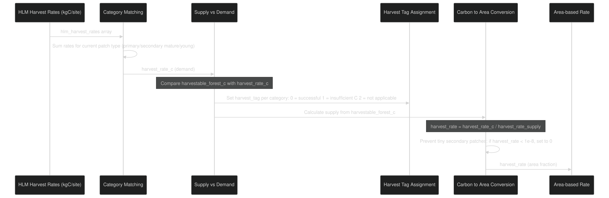

# Harvest Rate Calculations

Relevant source files

- [biogeochem/EDLoggingMortalityMod.F90](https://github.com/jingtao-lbl/fates/blob/e85d9977/biogeochem/EDLoggingMortalityMod.F90)
- [biogeochem/EDMortalityFunctionsMod.F90](https://github.com/jingtao-lbl/fates/blob/e85d9977/biogeochem/EDMortalityFunctionsMod.F90)
- [biogeochem/EDPatchDynamicsMod.F90](https://github.com/jingtao-lbl/fates/blob/e85d9977/biogeochem/EDPatchDynamicsMod.F90)
- [main/EDMainMod.F90](https://github.com/jingtao-lbl/fates/blob/e85d9977/main/EDMainMod.F90)
- [main/EDTypesMod.F90](https://github.com/jingtao-lbl/fates/blob/e85d9977/main/EDTypesMod.F90)

## Purpose and Scope

This page documents how FATES calculates harvest rates that determine the fraction of forest area or biomass to be logged during a timestep. Harvest rates bridge external land use change data (from the host land model) or FATES parameter specifications into cohort-level mortality fractions. The calculations handle two distinct modes: area-based harvest (where a fraction of patch area is harvested) and carbon-based harvest (where a target biomass is harvested).

For information about how harvest rates are applied to individual cohorts and converted to mortality, see [Logging Mortality](logging/mortality.md) . For the broader context of how harvest disturbances create new patches, see [Patch Dynamics and Disturbances](core-dynamics/patch_dynamics.md) .

## Harvest Rate Modes

FATES supports two primary approaches for specifying harvest intensity, controlled by the `hlm_use_lu_harvest` flag and `hlm_harvest_units` variable.

### Mode Selection Logic

Sources:  [biogeochem/EDLoggingMortalityMod.F90 198-346](https://github.com/jingtao-lbl/fates/blob/e85d9977/biogeochem/EDLoggingMortalityMod.F90#L198-L346)

### Harvest Categories

FATES processes harvest rates across five land use history (LUH2) categories that map to three internal forest types:

| HLM Category | Description | FATES Forest Type | Age Threshold | 
| --- | --- | --- | --- |
| HARVEST_VH1 | Primary forest harvest | Primary | N/A | 
| HARVEST_VH2 | Primary non-forest | Primary | N/A | 
| HARVEST_SH1 | Secondary mature forest | Secondary | ≥ 30 years | 
| HARVEST_SH2 | Secondary young forest | Secondary | < 30 years | 
| HARVEST_SH3 | Secondary non-forest | Secondary | < 30 years | 

Sources:  [biogeochem/EDLoggingMortalityMod.F90 258-266](https://github.com/jingtao-lbl/fates/blob/e85d9977/biogeochem/EDLoggingMortalityMod.F90#L258-L266)  [biogeochem/EDLoggingMortalityMod.F90 376-394](https://github.com/jingtao-lbl/fates/blob/e85d9977/biogeochem/EDLoggingMortalityMod.F90#L376-L394)

## Area-Based Harvest Rate Calculation

In area-based mode ( `hlm_harvest_units == hlm_harvest_area_fraction` ), harvest rates are specified as the fraction of vegetated area to be harvested annually. The function `get_harvest_rate_area` processes these rates.

### Calculation Steps

Sources:  [biogeochem/EDLoggingMortalityMod.F90 351-432](https://github.com/jingtao-lbl/fates/blob/e85d9977/biogeochem/EDLoggingMortalityMod.F90#L351-L432)

### Normalization by Forest Type

Harvest rates from the HLM are specified as fractions of the entire gridcell, but FATES applies them to specific patches. The normalization accounts for the fraction of the site that is primary versus secondary forest:

For primary forest patches:

For secondary forest patches:

This ensures that if only 20% of a site is primary forest, requesting 10% harvest of the gridcell translates to 50% harvest of the primary forest patches.

Sources:  [biogeochem/EDLoggingMortalityMod.F90 396-412](https://github.com/jingtao-lbl/fates/blob/e85d9977/biogeochem/EDLoggingMortalityMod.F90#L396-L412)

### Temporal Scaling

Annual harvest rates must be converted to the appropriate timestep based on `logging_event_code` :

| Event Code | Frequency | Temporal Scaling | 
| --- | --- | --- |
| 1 | Off | harvest_rate = 0.0 | 
| 2 | First day only | No scaling (apply once) | 
| 3 | Every day | harvest_rate / hlm_days_per_year | 
| 4 | Monthly (1st day) | harvest_rate / months_per_year | 
| < 0 | Annual (specific DOY) | No scaling (apply once) | 
| > 10000 | Specific date (YYYYMMDD) | No scaling (apply once) | 

Sources:  [biogeochem/EDLoggingMortalityMod.F90 418-430](https://github.com/jingtao-lbl/fates/blob/e85d9977/biogeochem/EDLoggingMortalityMod.F90#L418-L430)

## Carbon-Based Harvest Rate Calculation

In carbon-based mode ( `hlm_harvest_units == hlm_harvest_carbon` ), harvest targets are specified as biomass amounts (kgC) to be removed. The system must convert this to an area-based harvest rate by comparing available biomass to the target.

### Harvestable Carbon Assessment

The function `get_harvestable_carbon` calculates how much biomass is available for harvest across all patches:

Sources:  [biogeochem/EDLoggingMortalityMod.F90 437-536](https://github.com/jingtao-lbl/fates/blob/e85d9977/biogeochem/EDLoggingMortalityMod.F90#L437-L536)

### Carbon to Area Conversion

The function `get_harvest_rate_carbon` converts biomass targets to area fractions:

Sources:  [biogeochem/EDLoggingMortalityMod.F90 540-680](https://github.com/jingtao-lbl/fates/blob/e85d9977/biogeochem/EDLoggingMortalityMod.F90#L540-L680)

### Key Equations

Harvestable cohort carbon:

Area-based harvest rate from carbon:

Sources:  [biogeochem/EDLoggingMortalityMod.F90 491-495](https://github.com/jingtao-lbl/fates/blob/e85d9977/biogeochem/EDLoggingMortalityMod.F90#L491-L495)  [biogeochem/EDLoggingMortalityMod.F90 647-654](https://github.com/jingtao-lbl/fates/blob/e85d9977/biogeochem/EDLoggingMortalityMod.F90#L647-L654)

## Harvest Debt Tracking

When carbon-based harvest cannot be fully satisfied due to insufficient harvestable biomass, the system tracks "harvest debt" via the `harvest_tag` mechanism and the `get_harvest_debt` function.

### Harvest Tag System

Each harvest category is assigned a tag during the harvest rate calculation:

| Tag Value | Meaning | Action | 
| --- | --- | --- |
| 0 | Successful harvest | Full harvest rate applied | 
| 1 | Insufficient carbon | Debt recorded, partial or no harvest | 
| 2 | Not applicable | Category doesn't apply to this cohort | 

Sources:  [biogeochem/EDLoggingMortalityMod.F90 606-639](https://github.com/jingtao-lbl/fates/blob/e85d9977/biogeochem/EDLoggingMortalityMod.F90#L606-L639)

### Debt Calculation

The debt represents the amount of carbon (kgC/site) that was requested but could not be harvested due to insufficient harvestable biomass. This information can be used for diagnostics or to adjust future harvest targets.

Sources: The `get_harvest_debt` function is referenced in [biogeochem/EDPatchDynamicsMod.F90 267](https://github.com/jingtao-lbl/fates/blob/e85d9977/biogeochem/EDPatchDynamicsMod.F90#L267-L267) but its implementation details would need to be found in the full file.

## Integration with Disturbance Rates

Harvest rates calculated by the functions above are integrated into the disturbance rate calculation in `EDPatchDynamicsMod` . The `disturbance_rates` subroutine orchestrates this process.

### Disturbance Rate Calculation Flow

Sources:  [biogeochem/EDPatchDynamicsMod.F90 160-394](https://github.com/jingtao-lbl/fates/blob/e85d9977/biogeochem/EDPatchDynamicsMod.F90#L160-L394)

### Cohort-Level Mortality Application

The harvest rate is converted to cohort-level mortality fractions by `LoggingMortality_frac` :

These fractions are stored on each cohort and used during patch dynamics to determine biomass transfer to litter and product pools.

Sources:  [biogeochem/EDLoggingMortalityMod.F90 295-337](https://github.com/jingtao-lbl/fates/blob/e85d9977/biogeochem/EDLoggingMortalityMod.F90#L295-L337)

### Non-Canopy Area Adjustment

For patches with non-closed canopies, additional area is disturbed to account for interstitial ground area:

This ensures that the entire harvested area, not just the tree crown area, is transferred to secondary forest patches.

Sources:  [biogeochem/EDPatchDynamicsMod.F90 334-353](https://github.com/jingtao-lbl/fates/blob/e85d9977/biogeochem/EDPatchDynamicsMod.F90#L334-L353)

## Harvest Rate Processing Pipeline

The complete pipeline from HLM input to cohort mortality:

Sources:  [biogeochem/EDPatchDynamicsMod.F90 160-394](https://github.com/jingtao-lbl/fates/blob/e85d9977/biogeochem/EDPatchDynamicsMod.F90#L160-L394)  [biogeochem/EDLoggingMortalityMod.F90 198-346](https://github.com/jingtao-lbl/fates/blob/e85d9977/biogeochem/EDLoggingMortalityMod.F90#L198-L346)  [biogeochem/EDLoggingMortalityMod.F90 351-680](https://github.com/jingtao-lbl/fates/blob/e85d9977/biogeochem/EDLoggingMortalityMod.F90#L351-L680)

## Key Data Structures

### Site-Level Tracking

Harvest-related variables stored in `ed_site_type` :

Sources:  [main/EDTypesMod.F90 134-146](https://github.com/jingtao-lbl/fates/blob/e85d9977/main/EDTypesMod.F90#L134-L146)

### Cohort-Level Mortality Fractions

Harvest mortality fractions stored on `fates_cohort_type` :

- `lmort_direct`: Direct logging mortality (harvestable trees)
- `lmort_collateral`: Collateral damage to nearby trees
- `lmort_infra`: Infrastructure mortality (roads, skid trails)
- `l_degrad`: Degradation without mortality (transfer to secondary forest)

These are calculated in `LoggingMortality_frac` and used in `Mortality_Derivative` to compute `dndt` (rate of change of number density).

Sources:  [biogeochem/EDLoggingMortalityMod.F90 198-346](https://github.com/jingtao-lbl/fates/blob/e85d9977/biogeochem/EDLoggingMortalityMod.F90#L198-L346)  [biogeochem/EDMortalityFunctionsMod.F90 284-319](https://github.com/jingtao-lbl/fates/blob/e85d9977/biogeochem/EDMortalityFunctionsMod.F90#L284-L319)

## Configuration Parameters

Key parameters controlling harvest rate calculations:

| Parameter | Location | Purpose | 
| --- | --- | --- |
| logging_dbhmin | EDParamsMod | Minimum DBH for direct harvest | 
| logging_dbhmax | EDParamsMod | Maximum DBH for direct harvest | 
| logging_direct_frac | EDParamsMod | Fraction of trees directly logged | 
| logging_collateral_frac | EDParamsMod | Fraction experiencing collateral damage | 
| logging_mechanical_frac | EDParamsMod | Fraction killed by infrastructure | 
| logging_export_frac | EDParamsMod | Fraction of biomass exported off-site | 
| logging_event_code | EDParamsMod | Timing/frequency of logging events | 
| secondary_age_threshold | FatesConstantsMod | Age threshold for mature secondary (30 years) | 

Sources:  [biogeochem/EDLoggingMortalityMod.F90 38-44](https://github.com/jingtao-lbl/fates/blob/e85d9977/biogeochem/EDLoggingMortalityMod.F90#L38-L44)  [biogeochem/EDLoggingMortalityMod.F90 67](https://github.com/jingtao-lbl/fates/blob/e85d9977/biogeochem/EDLoggingMortalityMod.F90#L67-L67)