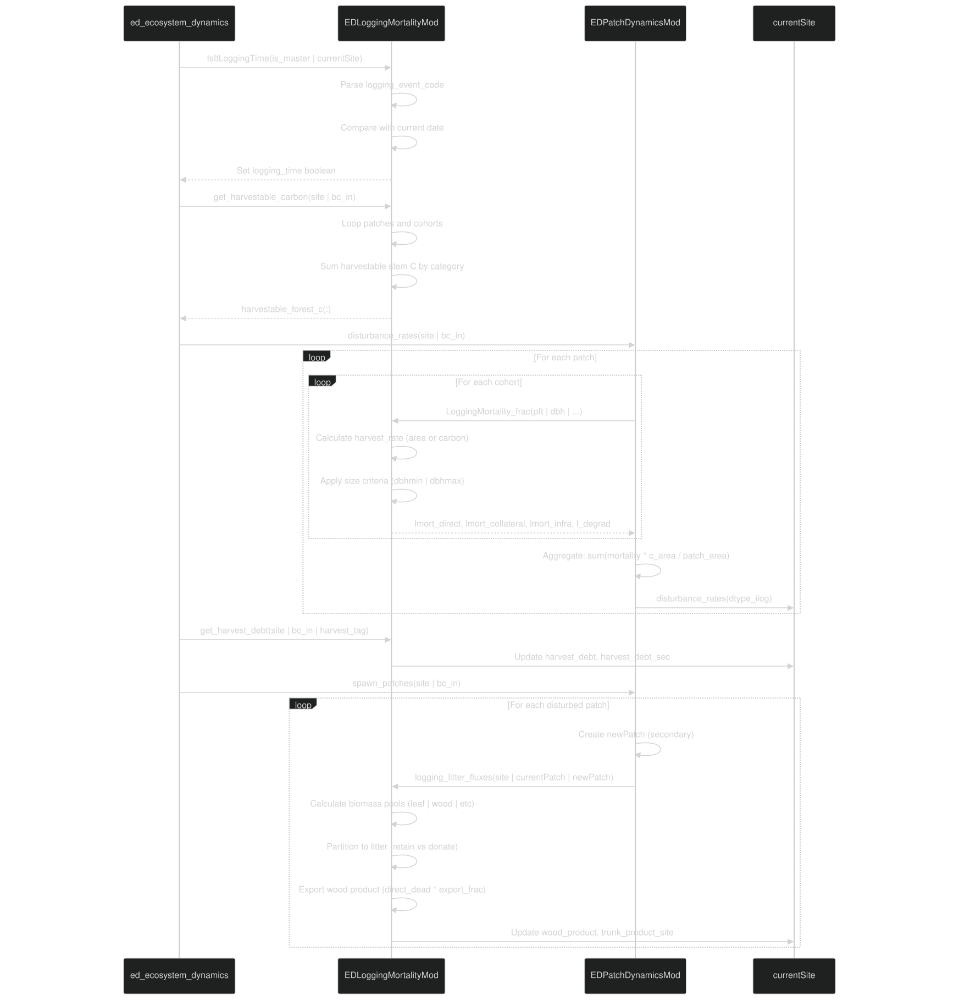

# Logging and Land Use

Relevant source files

- [biogeochem/EDLoggingMortalityMod.F90](https://github.com/jingtao-lbl/fates/blob/e85d9977/biogeochem/EDLoggingMortalityMod.F90)
- [biogeochem/EDMortalityFunctionsMod.F90](https://github.com/jingtao-lbl/fates/blob/e85d9977/biogeochem/EDMortalityFunctionsMod.F90)
- [biogeochem/EDPatchDynamicsMod.F90](https://github.com/jingtao-lbl/fates/blob/e85d9977/biogeochem/EDPatchDynamicsMod.F90)
- [main/EDMainMod.F90](https://github.com/jingtao-lbl/fates/blob/e85d9977/main/EDMainMod.F90)
- [main/EDTypesMod.F90](https://github.com/jingtao-lbl/fates/blob/e85d9977/main/EDTypesMod.F90)

## Purpose and Scope

This document describes FATES implementation of anthropogenic disturbances through logging and land use change. It covers the timing of logging events, different types of logging mortality (direct harvest, collateral damage, infrastructure damage, and degradation), harvest rate calculations in both area-based and carbon-based modes, wood product export, and the integration of logging disturbances into the patch dynamics framework. For information about natural disturbances (fire and treefall), see [Fire Dynamics: SPITFIRE](fire/index.md) and [Patch Dynamics and Disturbances](core-dynamics/patch_dynamics.md) . For general mortality processes, see [Mortality Processes](plant-physiology/mortality.md) .

## Logging Event Timing

The `IsItLoggingTime` function determines whether logging should occur during the current dynamics step by comparing the model time to the `logging_event_code` parameter. The module-level boolean `logging_time` controls whether logging mortality is applied.

Event Code Options:

| Code | Description | Frequency | 
| --- | --- | --- |
| 1 | Logging turned off | Never | 
| 2 | First timestep only | Once at model start | 
| 3 | Every day | Daily | 
| 4 | First day of month | Monthly | 
| -1 to -365 | Specific day of year (negative value) | Annually | 
| > 10000 | Specific date (YYYYMMDD format) | Once | 

The event code is parsed and compared against `hlm_current_year` , `hlm_current_month` , `hlm_current_day` , and `hlm_day_of_year` to determine if the current timestep matches the logging event criteria.

Sources:  [biogeochem/EDLoggingMortalityMod.F90 106-193](https://github.com/jingtao-lbl/fates/blob/e85d9977/biogeochem/EDLoggingMortalityMod.F90#L106-L193)

Sources:  [main/EDMainMod.F90 175-180](https://github.com/jingtao-lbl/fates/blob/e85d9977/main/EDMainMod.F90#L175-L180)  [biogeochem/EDLoggingMortalityMod.F90 106-193](https://github.com/jingtao-lbl/fates/blob/e85d9977/biogeochem/EDLoggingMortalityMod.F90#L106-L193)

## Logging Mortality Types

FATES implements four distinct types of logging-related impacts on vegetation, each with different criteria and effects:

### Direct Logging Mortality

Direct logging mortality ( `lmort_direct` ) applies to harvestable trees that meet size criteria. Trees are considered harvestable if their DBH falls within the range `[logging_dbhmin, logging_dbhmax]` . The direct mortality fraction is:

Only woody plants ( `prt_params%woody(pft) == itrue` ) in the canopy layer are subject to direct logging. The harvested trunk biomass (above-ground bole) is partially exported as wood product, with the export fraction controlled by `logging_export_frac` .

Sources:  [biogeochem/EDLoggingMortalityMod.F90 198-346](https://github.com/jingtao-lbl/fates/blob/e85d9977/biogeochem/EDLoggingMortalityMod.F90#L198-L346)

### Collateral Damage Mortality

Collateral damage mortality ( `lmort_collateral` ) represents damage to non-target trees during logging operations. This applies to:

- Canopy layer woody plants that don't meet direct logging criteria
- `logging_coll_under_frac`Understory woody plants (scaled by )

The collateral mortality rate is:

For understory plants, collateral damage is calculated during the `logging_litter_fluxes` routine and scaled by the fraction of area that is harvested versus degraded.

Sources:  [biogeochem/EDLoggingMortalityMod.F90 318-324](https://github.com/jingtao-lbl/fates/blob/e85d9977/biogeochem/EDLoggingMortalityMod.F90#L318-L324)  [biogeochem/EDLoggingMortalityMod.F90 837-848](https://github.com/jingtao-lbl/fates/blob/e85d9977/biogeochem/EDLoggingMortalityMod.F90#L837-L848)

### Infrastructure Mortality

Infrastructure mortality ( `lmort_infra` ) represents damage from roads, skid trails, and other logging infrastructure. This mortality applies to all plants (woody and non-woody) below a size threshold:

Infrastructure mortality affects both canopy and understory layers.

Sources:  [biogeochem/EDLoggingMortalityMod.F90 311-316](https://github.com/jingtao-lbl/fates/blob/e85d9977/biogeochem/EDLoggingMortalityMod.F90#L311-L316)  [biogeochem/EDLoggingMortalityMod.F90 326-330](https://github.com/jingtao-lbl/fates/blob/e85d9977/biogeochem/EDLoggingMortalityMod.F90#L326-L330)

### Forest Degradation

Forest degradation ( `l_degrad` ) represents the transfer of disturbed but not killed canopy trees to secondary forest patches:

This fraction accounts for the area occupied by surviving canopy trees that are still affected by the logging disturbance. These trees are moved to newly-created secondary forest patches without mortality.

Sources:  [biogeochem/EDLoggingMortalityMod.F90 333-337](https://github.com/jingtao-lbl/fates/blob/e85d9977/biogeochem/EDLoggingMortalityMod.F90#L333-L337)

Sources:  [biogeochem/EDLoggingMortalityMod.F90 198-346](https://github.com/jingtao-lbl/fates/blob/e85d9977/biogeochem/EDLoggingMortalityMod.F90#L198-L346)

## Harvest Modes: Area-Based vs Carbon-Based

FATES supports two harvest modes controlled by `hlm_use_lu_harvest` and `hlm_harvest_units` :

### Area-Based Harvest

When `hlm_harvest_units == hlm_harvest_area_fraction` , harvest rates are specified as fractions of vegetated area. The harvest rate is obtained from boundary conditions and normalized by the site-level primary or secondary forest fraction:

The harvest categories (HARVEST_VH1, HARVEST_VH2, HARVEST_SH1, HARVEST_SH2, HARVEST_SH3) correspond to LUH2 dataset categories for primary forest, primary non-forest, secondary mature forest, secondary young forest, and secondary non-forest respectively.

Sources:  [biogeochem/EDLoggingMortalityMod.F90 351-432](https://github.com/jingtao-lbl/fates/blob/e85d9977/biogeochem/EDLoggingMortalityMod.F90#L351-L432)

### Carbon-Based Harvest

When `hlm_harvest_units == hlm_harvest_carbon` , harvest rates are specified as carbon mass to be extracted. FATES calculates the harvestable carbon for each land use category and converts the carbon target to an area-based rate:

Harvestable carbon includes only stem wood (sapwood + structural biomass) from canopy trees meeting size criteria:

The calculation occurs at the site level before the cohort loop via `get_harvestable_carbon` , and the harvest rate is calculated per cohort via `get_harvest_rate_carbon` .

Sources:  [biogeochem/EDLoggingMortalityMod.F90 437-536](https://github.com/jingtao-lbl/fates/blob/e85d9977/biogeochem/EDLoggingMortalityMod.F90#L437-L536)  [biogeochem/EDLoggingMortalityMod.F90 540-680](https://github.com/jingtao-lbl/fates/blob/e85d9977/biogeochem/EDLoggingMortalityMod.F90#L540-L680)

Sources:  [biogeochem/EDLoggingMortalityMod.F90 247-291](https://github.com/jingtao-lbl/fates/blob/e85d9977/biogeochem/EDLoggingMortalityMod.F90#L247-L291)  [biogeochem/EDLoggingMortalityMod.F90 351-432](https://github.com/jingtao-lbl/fates/blob/e85d9977/biogeochem/EDLoggingMortalityMod.F90#L351-L432)  [biogeochem/EDLoggingMortalityMod.F90 437-536](https://github.com/jingtao-lbl/fates/blob/e85d9977/biogeochem/EDLoggingMortalityMod.F90#L437-L536)  [biogeochem/EDLoggingMortalityMod.F90 540-680](https://github.com/jingtao-lbl/fates/blob/e85d9977/biogeochem/EDLoggingMortalityMod.F90#L540-L680)

## Primary vs Secondary Forest Categories

FATES distinguishes between primary and secondary forest patches using the `anthro_disturbance_label` attribute. This distinction affects:

When logging occurs:

- **primary**`primaryforest`**not logging**If donor patch is ( ) and disturbance is → new patch is primary
- **primary****logging**If donor patch is and disturbance is → new patch is secondary
- **secondary**If donor patch is → new patch is secondary

Secondary patches are further subdivided by age:

- **Secondary mature**`age_since_anthro_disturbance >= secondary_age_threshold`: (default 50 years)
- **Secondary young**`age_since_anthro_disturbance < secondary_age_threshold`:

Sources:  [biogeochem/EDPatchDynamicsMod.F90 507-638](https://github.com/jingtao-lbl/fates/blob/e85d9977/biogeochem/EDPatchDynamicsMod.F90#L507-L638)

Sources:  [biogeochem/EDPatchDynamicsMod.F90 507-638](https://github.com/jingtao-lbl/fates/blob/e85d9977/biogeochem/EDPatchDynamicsMod.F90#L507-L638)  [biogeochem/EDLoggingMortalityMod.F90 377-412](https://github.com/jingtao-lbl/fates/blob/e85d9977/biogeochem/EDLoggingMortalityMod.F90#L377-L412)

## Disturbance Rate Calculation and Application

The logging disturbance rate is calculated in `disturbance_rates` for each patch as the sum of mortality fractions weighted by crown area:

For patches with non-closed canopy, an additional term accounts for the interstitial area:

If multiple disturbance types exceed 100% of patch area, they are proportionally scaled:

The disturbance rate determines how much area is transferred from the donor patch to a newly created secondary patch during `spawn_patches` .

Sources:  [biogeochem/EDPatchDynamicsMod.F90 160-394](https://github.com/jingtao-lbl/fates/blob/e85d9977/biogeochem/EDPatchDynamicsMod.F90#L160-L394)

Sources:  [biogeochem/EDPatchDynamicsMod.F90 223-394](https://github.com/jingtao-lbl/fates/blob/e85d9977/biogeochem/EDPatchDynamicsMod.F90#L223-L394)  [biogeochem/EDPatchDynamicsMod.F90 480-538](https://github.com/jingtao-lbl/fates/blob/e85d9977/biogeochem/EDPatchDynamicsMod.F90#L480-L538)

## Litter and Product Fluxes

When logging disturbance occurs, biomass is partitioned between litter pools (in donor and new patches) and wood product export. The `logging_litter_fluxes` routine handles these transfers.

### Biomass Partitioning

For each dying cohort, biomass is partitioned as follows:

Leaves and Fine Roots:

- Transferred to fine litter pools (leaf_fines, root_fines)
- `harvest_litter_localization`Distributed between donor and new patches based on

Storage and Reproduction:

- Transferred to fine litter pools
- Same distribution as leaves and fine roots

Stem Wood (Sapwood + Structural):

- `allom_agb_frac`Split into above-ground and below-ground fractions using
- `SF_val_CWD_frac_adj`Further split by decomposability class using (adjusted for cohort DBH)
- **direct logging only**Above-ground boles from are partially exported as wood product

### Litter Localization

The `harvest_litter_localization` parameter (default 0.0) controls how litter is distributed:

With `harvest_litter_localization = 0.0` , litter is distributed equally per unit area between donor and new patches. With `harvest_litter_localization = 1.0` , all litter goes to the new patch.

### Wood Product Export

Only above-ground bole wood from directly logged trees is exported:

This flux is recorded in:

- `site_mass%wood_product`for mass balance checking
- `currentSite%resources_management%trunk_product_site`for diagnostics

The remainder `(1 - logging_export_frac)` goes to coarse woody debris pools.

Sources:  [biogeochem/EDLoggingMortalityMod.F90 684-1139](https://github.com/jingtao-lbl/fates/blob/e85d9977/biogeochem/EDLoggingMortalityMod.F90#L684-L1139)

Sources:  [biogeochem/EDLoggingMortalityMod.F90 812-1015](https://github.com/jingtao-lbl/fates/blob/e85d9977/biogeochem/EDLoggingMortalityMod.F90#L812-L1015)

## Harvest Debt Tracking

In carbon-based harvest mode, FATES tracks harvest debt when insufficient carbon is available to meet the prescribed harvest rate. The `harvest_tag` variable indicates harvest status for each land use category:

| harvest_tag | Meaning | 
| --- | --- |
| 0 | Successful harvest (sufficient carbon available) | 
| 1 | Unsuccessful harvest (insufficient carbon) | 
| 2 | Not applicable (area-based harvest or non-matching category) | 

The harvest debt is calculated and accumulated at the site level:

Harvest debt is tracked separately for primary and secondary forest patches:

- `currentSite%resources_management%harvest_debt`(total)
- `currentSite%resources_management%harvest_debt_sec`(secondary only)

The debt accumulation occurs in `get_harvest_debt` , which is called after `disturbance_rates` determines which cohorts can be harvested. This allows the model to track unmet harvest targets across timesteps.

Sources:  [biogeochem/EDLoggingMortalityMod.F90 540-680](https://github.com/jingtao-lbl/fates/blob/e85d9977/biogeochem/EDLoggingMortalityMod.F90#L540-L680)  [biogeochem/EDPatchDynamicsMod.F90 267](https://github.com/jingtao-lbl/fates/blob/e85d9977/biogeochem/EDPatchDynamicsMod.F90#L267-L267)

## Key Data Structures

### Resource Management Type

The `ed_resources_management_type` tracks logging-related diagnostics at the site level:

Sources:  [main/EDTypesMod.F90 134-146](https://github.com/jingtao-lbl/fates/blob/e85d9977/main/EDTypesMod.F90#L134-L146)

### Cohort-Level Mortality Variables

Each cohort tracks logging-related mortality fractions:

These are calculated by `LoggingMortality_frac` and used in `disturbance_rates` to determine patch-level disturbance rates.

Sources:  [biogeochem/EDPatchDynamicsMod.F90 245-259](https://github.com/jingtao-lbl/fates/blob/e85d9977/biogeochem/EDPatchDynamicsMod.F90#L245-L259)

### Patch-Level Disturbance Tracking

Each patch tracks disturbance rates for three types:

Site-level disturbance rates are also tracked separately for primary-to-primary, primary-to-secondary, and secondary-to-secondary transitions:

Sources:  [biogeochem/EDPatchDynamicsMod.F90 293-296](https://github.com/jingtao-lbl/fates/blob/e85d9977/biogeochem/EDPatchDynamicsMod.F90#L293-L296)  [biogeochem/EDPatchDynamicsMod.F90 362-365](https://github.com/jingtao-lbl/fates/blob/e85d9977/biogeochem/EDPatchDynamicsMod.F90#L362-L365)  [biogeochem/EDPatchDynamicsMod.F90 470-472](https://github.com/jingtao-lbl/fates/blob/e85d9977/biogeochem/EDPatchDynamicsMod.F90#L470-L472)

## Integration with Main Dynamics Loop

Logging processes are integrated into the daily dynamics loop as follows:

The sequence ensures that harvest rates are calculated before mortality is applied, and that litter fluxes occur during patch spawning when new patches are created.

Sources:  [main/EDMainMod.F90 175-180](https://github.com/jingtao-lbl/fates/blob/e85d9977/main/EDMainMod.F90#L175-L180)  [main/EDMainMod.F90 220-226](https://github.com/jingtao-lbl/fates/blob/e85d9977/main/EDMainMod.F90#L220-L226)  [main/EDMainMod.F90 290-295](https://github.com/jingtao-lbl/fates/blob/e85d9977/main/EDMainMod.F90#L290-L295)

Sources:  [main/EDMainMod.F90 141-317](https://github.com/jingtao-lbl/fates/blob/e85d9977/main/EDMainMod.F90#L141-L317)  [biogeochem/EDPatchDynamicsMod.F90 160-394](https://github.com/jingtao-lbl/fates/blob/e85d9977/biogeochem/EDPatchDynamicsMod.F90#L160-L394)  [biogeochem/EDPatchDynamicsMod.F90 398-762](https://github.com/jingtao-lbl/fates/blob/e85d9977/biogeochem/EDPatchDynamicsMod.F90#L398-L762)