# Logging Mortality

Relevant source files

- [biogeochem/EDCohortDynamicsMod.F90](https://github.com/jingtao-lbl/fates/blob/e85d9977/biogeochem/EDCohortDynamicsMod.F90)
- [biogeochem/EDLoggingMortalityMod.F90](https://github.com/jingtao-lbl/fates/blob/e85d9977/biogeochem/EDLoggingMortalityMod.F90)
- [biogeochem/EDMortalityFunctionsMod.F90](https://github.com/jingtao-lbl/fates/blob/e85d9977/biogeochem/EDMortalityFunctionsMod.F90)
- [biogeochem/EDPhysiologyMod.F90](https://github.com/jingtao-lbl/fates/blob/e85d9977/biogeochem/EDPhysiologyMod.F90)
- [biogeochem/FatesAllometryMod.F90](https://github.com/jingtao-lbl/fates/blob/e85d9977/biogeochem/FatesAllometryMod.F90)
- [main/EDMainMod.F90](https://github.com/jingtao-lbl/fates/blob/e85d9977/main/EDMainMod.F90)

## Purpose and Scope

This page documents the logging mortality system in FATES, which simulates anthropogenic tree harvest and associated mortality. Logging mortality encompasses four distinct types of mortality: direct harvest of target trees, collateral damage to surrounding vegetation, infrastructure mortality from roads and skid trails, and forest degradation effects on surviving trees. This module interfaces with both FATES-driven logging parameters and Host Land Model (HLM) harvest inputs.

For information about harvest rate calculations and carbon debt tracking, see [Harvest Rate Calculations](logging/harvest_rates.md) . For general mortality processes including background, hydraulic, and starvation mortality, see [Mortality Processes](plant-physiology/mortality.md) .

## Logging Mortality Types

FATES distinguishes four types of logging-associated mortality, each applied to different portions of the vegetation based on canopy position and size criteria:

| Mortality Type | Variable | Applied To | Controlled By | 
| --- | --- | --- | --- |
| Direct Logging | lmort_direct | Canopy trees within DBH range | logging_direct_frac | 
| Collateral Damage | lmort_collateral | Canopy trees (all sizes) | logging_collateral_frac | 
| Infrastructure | lmort_infra | All plants below DBH threshold | logging_mechanical_frac | 
| Degradation | l_degrad | Surviving canopy trees | Residual after other mortality | 

Direct logging mortality targets harvestable trees meeting diameter criteria ( `logging_dbhmin` ≤ DBH < `logging_dbhmax` ). These trees are killed and their merchantable bole wood is exported from the site as wood products, with a transportation loss fraction removed via `logging_export_frac` .

Collateral mortality represents damage to adjacent canopy trees caused by the felling and extraction of target trees. This mortality applies to canopy layer trees regardless of size.

Infrastructure mortality accounts for vegetation killed during road construction and skid trail development. This applies to all plants below `logging_dbhmax_infra` , affecting both woody and non-woody vegetation.

Degradation fraction represents the portion of canopy area disturbed but not killed, transitioning surviving trees to newly-disturbed secondary forest patches. This is calculated as the residual fraction: `harvest_rate - (lmort_direct + lmort_infra + lmort_collateral)` .

Sources: [biogeochem/EDLoggingMortalityMod.F90 198-346](https://github.com/jingtao-lbl/fates/blob/e85d9977/biogeochem/EDLoggingMortalityMod.F90#L198-L346)

### Mortality Application Logic

Sources: [biogeochem/EDLoggingMortalityMod.F90 295-344](https://github.com/jingtao-lbl/fates/blob/e85d9977/biogeochem/EDLoggingMortalityMod.F90#L295-L344)

## Logging Event Timing

Logging events are controlled by the `logging_event_code` parameter and evaluated by the `IsItLoggingTime` subroutine. When `logging_time` is true, mortality fractions are calculated and applied to cohorts.

### Event Code Definitions

The `IsItLoggingTime` function is called once per dynamics step in `ed_ecosystem_dynamics` before any mortality calculations occur. Site-level diagnostic accumulators are initialized when a logging event is detected:

- `delta_litter_stock`: Change in litter mass [kgC]
- `delta_biomass_stock`: Change in live biomass [kgC]
- `delta_individual`: Change in tree count

Sources: [biogeochem/EDLoggingMortalityMod.F90 106-193](https://github.com/jingtao-lbl/fates/blob/e85d9977/biogeochem/EDLoggingMortalityMod.F90#L106-L193)  [main/EDMainMod.F90 177](https://github.com/jingtao-lbl/fates/blob/e85d9977/main/EDMainMod.F90#L177-L177)

## Harvest Rate Calculation

The `LoggingMortality_frac` subroutine calculates the fractional mortality rates for each cohort. The harvest rate applied to individual cohorts depends on whether FATES operates in standalone mode using internal parameters or receives harvest inputs from the Host Land Model.

### Harvest Mode Selection

Sources: [biogeochem/EDLoggingMortalityMod.F90 243-291](https://github.com/jingtao-lbl/fates/blob/e85d9977/biogeochem/EDLoggingMortalityMod.F90#L243-L291)

### Area-Based Harvest

In area-based harvest mode ( `hlm_harvest_units == hlm_harvest_area_fraction` ), annual harvest rates are provided as fractions of vegetated area for different land categories:

- `HARVEST_VH1`: Primary forest harvest
- `HARVEST_VH2`: Primary non-forest harvest
- `HARVEST_SH1``secondary_age_threshold`: Secondary mature forest (age ≥ )
- `HARVEST_SH2``secondary_age_threshold`: Secondary young forest (age < )
- `HARVEST_SH3`: Secondary non-forest harvest

The `get_harvest_rate_area` function aggregates relevant categories based on patch disturbance history ( `patch_anthro_disturbance_label` ) and normalizes by site-level primary/secondary fractions. For annual rates applied at intervals other than once per year, the rate is divided by the appropriate time factor (days per year, months per year, etc.).

Sources: [biogeochem/EDLoggingMortalityMod.F90 351-432](https://github.com/jingtao-lbl/fates/blob/e85d9977/biogeochem/EDLoggingMortalityMod.F90#L351-L432)

### Carbon-Based Harvest

In carbon-based harvest mode ( `hlm_harvest_units == hlm_harvest_carbon` ), target harvest amounts are specified in carbon mass [kgC site⁻¹]. The `get_harvestable_carbon` subroutine calculates available harvestable carbon for each land category:

Where:

- `sapw_m``struct_m`, : Sapwood and structural carbon per plant [kgC]
- `allom_agb_frac`: Aboveground biomass fraction
- `SF_val_CWD_frac(ncwd)`: Fraction in largest CWD class
- `n`: Plant density [plants ha⁻¹]

The `get_harvest_rate_carbon` function converts the carbon-based target to an area-based harvest rate by dividing target carbon by available carbon. If insufficient carbon exists to meet the target, the `harvest_tag` is set to indicate unsuccessful harvest (value = 1), enabling harvest debt tracking.

Sources: [biogeochem/EDLoggingMortalityMod.F90 437-536](https://github.com/jingtao-lbl/fates/blob/e85d9977/biogeochem/EDLoggingMortalityMod.F90#L437-L536)  [biogeochem/EDLoggingMortalityMod.F90 540-680](https://github.com/jingtao-lbl/fates/blob/e85d9977/biogeochem/EDLoggingMortalityMod.F90#L540-L680)

## Litter Fluxes and Wood Products

The `logging_litter_fluxes` subroutine handles carbon transfers from living biomass to litter, coarse woody debris (CWD), and wood product pools when logging mortality occurs. This routine is only called when logging disturbance is the dominant disturbance type for a patch.

### Flux Pathways

### Wood Product Calculation

For directly logged trees, merchantable bole carbon is calculated and partitioned between exported products and on-site losses:

The trunk product flux is accumulated in `site_mass%wood_product` for mass balance tracking and history output. The remaining fraction `(1 - logging_export_frac)` represents transportation losses and enters the largest CWD size class.

Sources: [biogeochem/EDLoggingMortalityMod.F90 684-1040](https://github.com/jingtao-lbl/fates/blob/e85d9977/biogeochem/EDLoggingMortalityMod.F90#L684-L1040)

### CWD Size Class Partitioning

Woody debris from logging is distributed across four CWD size classes using diameter-dependent fractions from `SF_val_CWD_frac` . The `adjust_SF_CWD_frac` function modifies these fractions based on cohort DBH to ensure realistic size distributions. Above- and belowground CWD are tracked separately, with belowground pools distributed across soil layers using the cohort's root fraction profile.

Sources: [biogeochem/EDLoggingMortalityMod.F90 812-877](https://github.com/jingtao-lbl/fates/blob/e85d9977/biogeochem/EDLoggingMortalityMod.F90#L812-L877)

## Integration with Mortality Dynamics

Logging mortality integrates with FATES' broader mortality system through the `Mortality_Derivative` subroutine, which is called during the daily state integration loop in `ed_integrate_state_variables` .

### Mortality Derivative Calculation Flow

Key distinction : Canopy-layer logging mortality (direct, collateral, infrastructure) generates disturbances that spawn new patches, while understory logging mortality is applied directly as a change in number density without creating disturbed patches. The `fates_mortality_disturbance_fraction` parameter (typically 1.0) determines what fraction of canopy mortality triggers disturbance.

Sources: [biogeochem/EDMortalityFunctionsMod.F90 234-323](https://github.com/jingtao-lbl/fates/blob/e85d9977/biogeochem/EDMortalityFunctionsMod.F90#L234-L323)

### Understory vs. Canopy Treatment

The treatment differs because canopy trees have larger crown areas that create significant gaps when they die, justifying new patch creation. The understory logging mortality rates are converted to daily rates and immediately applied:

This daily rate is added to other mortality sources to compute `dndt` , the rate of change in number density [individuals day⁻¹].

Sources: [biogeochem/EDMortalityFunctionsMod.F90 296-305](https://github.com/jingtao-lbl/fates/blob/e85d9977/biogeochem/EDMortalityFunctionsMod.F90#L296-L305)

## Parameter Summary

| Parameter | Default | Units | Description | 
| --- | --- | --- | --- |
| logging_event_code | varies | - | Controls timing of logging events | 
| logging_dbhmin | 50.0 | cm | Minimum DBH for direct harvest | 
| logging_dbhmax | unset | cm | Maximum DBH for direct harvest (optional) | 
| logging_dbhmax_infra | 35.0 | cm | DBH threshold below which infrastructure mortality applies | 
| logging_direct_frac | 0.15 | fraction | Fraction of harvest rate applied as direct mortality | 
| logging_collateral_frac | 0.05 | fraction | Fraction applied as collateral damage | 
| logging_mechanical_frac | 0.05 | fraction | Fraction applied as infrastructure mortality | 
| logging_export_frac | 0.8 | fraction | Fraction of harvested bole exported (rest = transport loss) | 
| fates_mortality_disturbance_fraction | 1.0 | fraction | Fraction of canopy mortality that generates disturbance | 

Sources: [biogeochem/EDLoggingMortalityMod.F90 36-42](https://github.com/jingtao-lbl/fates/blob/e85d9977/biogeochem/EDLoggingMortalityMod.F90#L36-L42)  [biogeochem/EDParamsMod.F90](https://github.com/jingtao-lbl/fates/blob/e85d9977/biogeochem/EDParamsMod.F90)

## Code Entity Reference

### Primary Module: EDLoggingMortalityMod

Key subroutines:

- `IsItLoggingTime`[biogeochem/EDLoggingMortalityMod.F90106-193](https://github.com/jingtao-lbl/fates/blob/e85d9977/biogeochem/EDLoggingMortalityMod.F90#L106-L193): Determines if current timestep is a logging event
- `LoggingMortality_frac`[biogeochem/EDLoggingMortalityMod.F90198-346](https://github.com/jingtao-lbl/fates/blob/e85d9977/biogeochem/EDLoggingMortalityMod.F90#L198-L346): Calculates mortality fractions for a cohort
- `get_harvest_rate_area`[biogeochem/EDLoggingMortalityMod.F90351-432](https://github.com/jingtao-lbl/fates/blob/e85d9977/biogeochem/EDLoggingMortalityMod.F90#L351-L432): Converts area-based harvest inputs to rates
- `get_harvestable_carbon`[biogeochem/EDLoggingMortalityMod.F90437-536](https://github.com/jingtao-lbl/fates/blob/e85d9977/biogeochem/EDLoggingMortalityMod.F90#L437-L536): Calculates available carbon for harvest
- `get_harvest_rate_carbon`[biogeochem/EDLoggingMortalityMod.F90540-680](https://github.com/jingtao-lbl/fates/blob/e85d9977/biogeochem/EDLoggingMortalityMod.F90#L540-L680): Converts carbon targets to area rates
- `logging_litter_fluxes`[biogeochem/EDLoggingMortalityMod.F90684-1040](https://github.com/jingtao-lbl/fates/blob/e85d9977/biogeochem/EDLoggingMortalityMod.F90#L684-L1040): Handles carbon fluxes to litter/CWD/products

### Integration Points

- `Mortality_Derivative`[biogeochem/EDMortalityFunctionsMod.F90234-323](https://github.com/jingtao-lbl/fates/blob/e85d9977/biogeochem/EDMortalityFunctionsMod.F90#L234-L323)Called from in EDMortalityFunctionsMod
- `ed_integrate_state_variables`[main/EDMainMod.F90320-685](https://github.com/jingtao-lbl/fates/blob/e85d9977/main/EDMainMod.F90#L320-L685)Invoked during in EDMainMod
- `ed_ecosystem_dynamics`[main/EDMainMod.F90177](https://github.com/jingtao-lbl/fates/blob/e85d9977/main/EDMainMod.F90#L177-L177)Logging time check in
- `disturbance_rates`Disturbance creation in (EDPatchDynamicsMod) when canopy logging occurs

Sources: [biogeochem/EDLoggingMortalityMod.F90 1-1040](https://github.com/jingtao-lbl/fates/blob/e85d9977/biogeochem/EDLoggingMortalityMod.F90#L1-L1040)  [biogeochem/EDMortalityFunctionsMod.F90 1-353](https://github.com/jingtao-lbl/fates/blob/e85d9977/biogeochem/EDMortalityFunctionsMod.F90#L1-L353)  [main/EDMainMod.F90 141-317](https://github.com/jingtao-lbl/fates/blob/e85d9977/main/EDMainMod.F90#L141-L317)