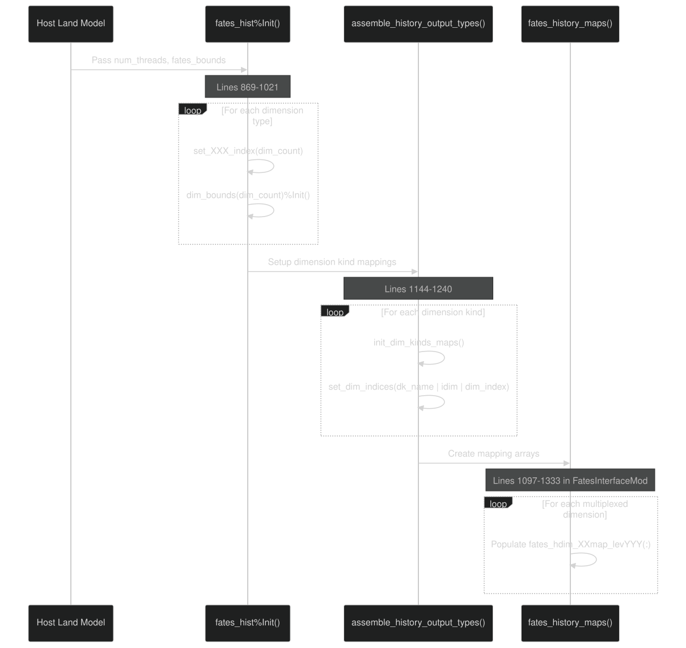
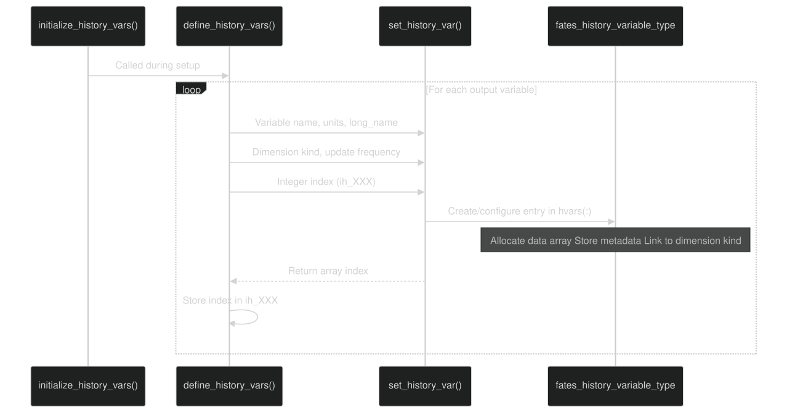
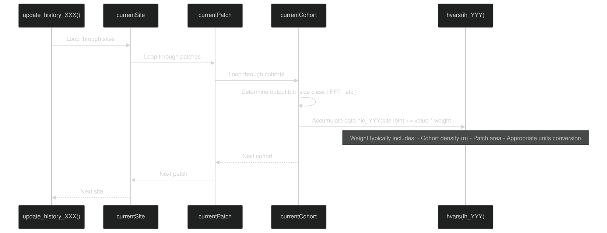
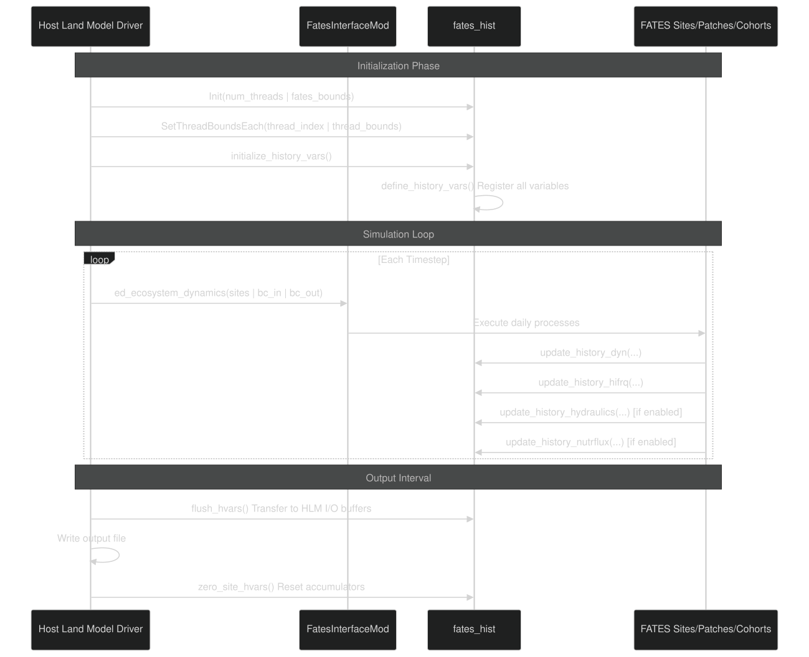

# History Output System

Relevant source files

- [main/FatesHistoryInterfaceMod.F90](https://github.com/jingtao-lbl/fates/blob/e85d9977/main/FatesHistoryInterfaceMod.F90)
- [main/FatesInterfaceMod.F90](https://github.com/jingtao-lbl/fates/blob/e85d9977/main/FatesInterfaceMod.F90)
- [main/FatesInterfaceTypesMod.F90](https://github.com/jingtao-lbl/fates/blob/e85d9977/main/FatesInterfaceTypesMod.F90)

## Purpose and Scope

The History Output System manages the definition, registration, accumulation, and output of diagnostic variables from FATES simulations. Due to FATES' complex sub-gridscale structure—with multiple patches per site and multiple cohorts per patch—the system handles multi-dimensional output across various classification schemes (PFT, size class, age class, canopy layer, etc.). It provides dimension multiplexing to work within host land model output constraints and maintains efficient variable indexing to avoid repeated name lookups during simulation timesteps.

For information about restart file I/O, see [Restart System](../output/restart.md) . For mass balance verification, see [Mass Balance Checking](../output/mass_balance.md) .

## System Architecture

The History Output System is implemented primarily in `FatesHistoryInterfaceMod` and interfaces with host land models through boundary condition types. The system operates in two phases: initialization (where variables and dimensions are defined) and runtime (where variables are updated and flushed to output).

### Core Components

Sources:  [main/FatesHistoryInterfaceMod.F90 1-170](https://github.com/jingtao-lbl/fates/blob/e85d9977/main/FatesHistoryInterfaceMod.F90#L1-L170)  [main/FatesHistoryInterfaceMod.F90 746-854](https://github.com/jingtao-lbl/fates/blob/e85d9977/main/FatesHistoryInterfaceMod.F90#L746-L854)

The `fates_history_interface_type`  [main/FatesHistoryInterfaceMod.F90 746-854](https://github.com/jingtao-lbl/fates/blob/e85d9977/main/FatesHistoryInterfaceMod.F90#L746-L854) serves as the central coordinator, containing:

- `hvars(:)`- array of history variable definitions with metadata and data arrays
- `dim_kinds(:)`- registry of dimension/kind combinations (50 static entries)
- `dim_bounds(:)`- thread-specific dimension boundaries (50 static entries)
- Integer indices for each dimension type (column, levsoil, levscpf, etc.)

A global instance `fates_hist` is declared at [main/FatesHistoryInterfaceMod.F90 862](https://github.com/jingtao-lbl/fates/blob/e85d9977/main/FatesHistoryInterfaceMod.F90#L862-L862) and used throughout the model.

## Dimension System and Multiplexing

### Dimension Types

FATES tracks variables across multiple dimensions representing the hierarchical structure of vegetation and the discretization of various classification schemes:

| Dimension Code | Full Name | Description | Source | 
| --- | --- | --- | --- |
| column | Column/Site | Host model grid cell or column | N/A | 
| levsoil | Soil Level | Vertical soil layers | Host model | 
| levpft | PFT Level | Plant functional types | Parameter file | 
| levscls | Size Class Level | Cohort diameter size bins | Parameter file | 
| levage | Age Level | Patch age bins | Parameter file | 
| levcoage | Cohort Age Level | Cohort age bins | Parameter file | 
| levcan | Canopy Level | Canopy layers (1 to nclmax) | Fixed | 
| levleaf | Leaf Level | Leaf area vertical bins | Calculated | 
| levcwdsc | CWD Size Class | Coarse woody debris size classes | Fixed | 
| levfuel | Fuel Class | Fire fuel size classes | Fixed | 
| levheight | Height Level | Height bins for output | Parameter file | 
| levelem | Element Level | Chemical elements (C, N, P) | PARTEH mode | 
| levdamage | Damage Level | Crown damage classes | Parameter file | 

Sources:  [main/FatesHistoryInterfaceMod.F90 134-152](https://github.com/jingtao-lbl/fates/blob/e85d9977/main/FatesHistoryInterfaceMod.F90#L134-L152)  [main/FatesInterfaceTypesMod.F90 323-331](https://github.com/jingtao-lbl/fates/blob/e85d9977/main/FatesInterfaceTypesMod.F90#L323-L331)

### Multiplexed Dimensions

Since host land models have limitations on the number of dimensions per output variable, FATES "multiplexes" multiple dimensions into single combined dimensions:

Sources:  [main/FatesHistoryInterfaceMod.F90 142-152](https://github.com/jingtao-lbl/fates/blob/e85d9977/main/FatesHistoryInterfaceMod.F90#L142-L152)  [main/FatesInterfaceTypesMod.F90 252-293](https://github.com/jingtao-lbl/fates/blob/e85d9977/main/FatesInterfaceTypesMod.F90#L252-L293)

Mapping arrays track how multiplexed dimensions map back to their component dimensions. For example, `fates_hdim_pfmap_levscpf(:)` and `fates_hdim_scmap_levscpf(:)`  [main/FatesInterfaceTypesMod.F90 256-257](https://github.com/jingtao-lbl/fates/blob/e85d9977/main/FatesInterfaceTypesMod.F90#L256-L257) map each element of the `levscpf` dimension back to its constituent PFT and size class indices.

### Dimension Initialization

Dimension setup occurs in three stages:

Sources:  [main/FatesHistoryInterfaceMod.F90 869-1021](https://github.com/jingtao-lbl/fates/blob/e85d9977/main/FatesHistoryInterfaceMod.F90#L869-L1021)  [main/FatesHistoryInterfaceMod.F90 1144-1240](https://github.com/jingtao-lbl/fates/blob/e85d9977/main/FatesHistoryInterfaceMod.F90#L1144-L1240)  [main/FatesInterfaceMod.F90 1097-1333](https://github.com/jingtao-lbl/fates/blob/e85d9977/main/FatesInterfaceMod.F90#L1097-L1333)

## Variable Registration and Indexing

### Registration System

The system uses integer indices (prefix `ih_` ) to reference variables efficiently without string lookups during model execution. Each variable is registered once during initialization through the `define_history_vars()` subroutine (not shown in provided excerpt but referenced at [main/FatesHistoryInterfaceMod.F90 818](https://github.com/jingtao-lbl/fates/blob/e85d9977/main/FatesHistoryInterfaceMod.F90#L818-L818) ).

Variable indices are declared as module-level integers:

Sources:  [main/FatesHistoryInterfaceMod.F90 174-740](https://github.com/jingtao-lbl/fates/blob/e85d9977/main/FatesHistoryInterfaceMod.F90#L174-L740)

### Variable Categories

Variables are organized by update frequency and dimension structure:

| Category | Update Frequency | Example Variables | 
| --- | --- | --- |
| Site-level state | Daily | ih_totvegc_si, ih_lai_si, ih_agb_si | 
| Size×PFT state | Daily | ih_nplant_si_scpf, ih_ba_si_scpf, ih_leafc_scpf | 
| Size×Age×PFT | Daily | ih_nplant_si_scagpft | 
| Canopy×Leaf×PFT | High-frequency | ih_parsun_z_si_cnlfpft, ih_laisun_z_si_cnlfpft | 
| Hydraulics | Variable | ih_sapflow_scpf, ih_btran_scpf | 
| Nutrient fluxes | Daily | ih_nh4uptake_scpf, ih_puptake_si | 

Sources:  [main/FatesHistoryInterfaceMod.F90 172-740](https://github.com/jingtao-lbl/fates/blob/e85d9977/main/FatesHistoryInterfaceMod.F90#L172-L740)

### Registration Process

During initialization, variables are registered with metadata:

Sources:  [main/FatesHistoryInterfaceMod.F90 155-170](https://github.com/jingtao-lbl/fates/blob/e85d9977/main/FatesHistoryInterfaceMod.F90#L155-L170)  [main/FatesHistoryInterfaceMod.F90 818-819](https://github.com/jingtao-lbl/fates/blob/e85d9977/main/FatesHistoryInterfaceMod.F90#L818-L819)

Each variable registration specifies:

- Variable name (for output file)
- Long descriptive name
- Physical units
- Averaging flag (e.g., "A" for average, "I" for instantaneous)
- `site_r8``site_size_pft_r8`Dimension kind (e.g., , )
- Update frequency (daily, high-frequency, etc.)
- Integer index for fast access

## Update Pipeline

The History Output System accumulates data through multiple update subroutines called at different frequencies during model execution:

### Update Subroutines

Sources:  [main/FatesHistoryInterfaceMod.F90 782-786](https://github.com/jingtao-lbl/fates/blob/e85d9977/main/FatesHistoryInterfaceMod.F90#L782-L786)
update_history_dyn
The primary update routine called daily during `ed_ecosystem_dynamics()` . It accumulates:

- Biomass state variables (leaf, stem, root carbon/nutrients)
- Population density by size class and PFT
- Growth rates (diameter increment)
- Mortality rates by mechanism
- NPP/GPP/respiration fluxes
- Patch-level disturbance rates
- Fire diagnostics
- Litter production

This routine loops through all sites, patches, and cohorts to aggregate data into appropriate output bins.

Sources:  [main/FatesHistoryInterfaceMod.F90 782](https://github.com/jingtao-lbl/fates/blob/e85d9977/main/FatesHistoryInterfaceMod.F90#L782-L782)
update_history_hifrq
Called during radiation and photosynthesis calculations (potentially multiple times per day). Accumulates:

- Sunlit/shaded leaf area by canopy layer
- Absorbed radiation (PAR) by layer and PFT
- Radiation absorption fractions
- Canopy-layer crown area

Sources:  [main/FatesHistoryInterfaceMod.F90 783](https://github.com/jingtao-lbl/fates/blob/e85d9977/main/FatesHistoryInterfaceMod.F90#L783-L783)
update_history_hydraulics
Called when plant hydraulics is enabled ( `hlm_use_planthydro == itrue` ). Accumulates:

- Transpiration by size×PFT
- Water potential by tissue compartment
- Hydraulic conductance
- Xylem cavitation (fractional loss of conductivity)
- Soil-to-root water flux

Sources:  [main/FatesHistoryInterfaceMod.F90 784](https://github.com/jingtao-lbl/fates/blob/e85d9977/main/FatesHistoryInterfaceMod.F90#L784-L784)
update_history_nutrflux
Called when CNP allocation is active ( `hlm_parteh_mode == prt_cnp_flex_allom_hyp` ). Accumulates:

- NH4/NO3/P uptake rates by size×PFT
- Nutrient demand by size×PFT
- N fixation
- Nutrient efflux (losses back to soil)
- Leaf-to-fine-root ratio dynamics

Sources:  [main/FatesHistoryInterfaceMod.F90 785](https://github.com/jingtao-lbl/fates/blob/e85d9977/main/FatesHistoryInterfaceMod.F90#L785-L785)

### Data Aggregation Pattern

The typical pattern for accumulating cohort-level data to output arrays:

Sources:  [main/FatesHistoryInterfaceMod.F90 100-132](https://github.com/jingtao-lbl/fates/blob/e85d9977/main/FatesHistoryInterfaceMod.F90#L100-L132)

A key principle stated in the code comments [main/FatesHistoryInterfaceMod.F90 100-132](https://github.com/jingtao-lbl/fates/blob/e85d9977/main/FatesHistoryInterfaceMod.F90#L100-L132) : when outputting averages across dimensions with dynamic structure (patches, cohorts), it's better to output both the numerator and denominator separately rather than the average itself. This allows proper conservation even when weights change rapidly and simplifies logic when the number of patches/cohorts varies from zero to many.

For example:

- `nplant_si_scpf`Output (number density in #/m²) as the denominator
- `nplant_si_scpf * biomass_per_plant`Output as the numerator
- Calculate average biomass per plant in post-processing

### Flushing and Zeroing

At the end of each output interval, accumulated data is written to the host model's I/O buffers through `flush_hvars()`  [main/FatesHistoryInterfaceMod.F90 850](https://github.com/jingtao-lbl/fates/blob/e85d9977/main/FatesHistoryInterfaceMod.F90#L850-L850) and then accumulators are zeroed through `zero_site_hvars()`  [main/FatesHistoryInterfaceMod.F90 851](https://github.com/jingtao-lbl/fates/blob/e85d9977/main/FatesHistoryInterfaceMod.F90#L851-L851)

## Integration with Host Land Model

The History Output System is called from the host land model's main integration loop:

Sources:  [main/FatesHistoryInterfaceMod.F90 777-786](https://github.com/jingtao-lbl/fates/blob/e85d9977/main/FatesHistoryInterfaceMod.F90#L777-L786)  [main/FatesHistoryInterfaceMod.F90 850-851](https://github.com/jingtao-lbl/fates/blob/e85d9977/main/FatesHistoryInterfaceMod.F90#L850-L851)

The host land model is responsible for:

FATES is responsible for:

- Defining all diagnostic variables and their metadata
- Accumulating data from internal state during updates
- Managing dimension mappings and multiplexing
- Ensuring mass balance and unit conversions are correct

Primary Sources:

- [main/FatesHistoryInterfaceMod.F901-12000](https://github.com/jingtao-lbl/fates/blob/e85d9977/main/FatesHistoryInterfaceMod.F90#L1-L12000)
- [main/FatesInterfaceTypesMod.F90244-293](https://github.com/jingtao-lbl/fates/blob/e85d9977/main/FatesInterfaceTypesMod.F90#L244-L293)
- [main/FatesInterfaceMod.F901097-1333](https://github.com/jingtao-lbl/fates/blob/e85d9977/main/FatesInterfaceMod.F90#L1097-L1333)