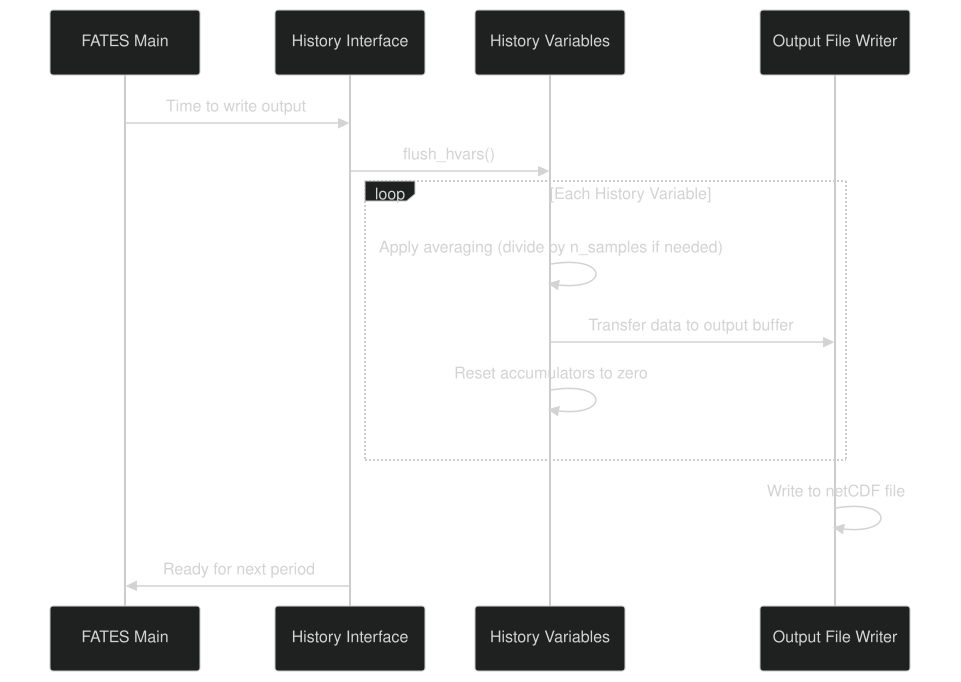

# History Update Pipeline

Relevant source files

- [biogeochem/EDCohortDynamicsMod.F90](https://github.com/jingtao-lbl/fates/blob/e85d9977/biogeochem/EDCohortDynamicsMod.F90)
- [biogeochem/EDPhysiologyMod.F90](https://github.com/jingtao-lbl/fates/blob/e85d9977/biogeochem/EDPhysiologyMod.F90)
- [biogeochem/FatesAllometryMod.F90](https://github.com/jingtao-lbl/fates/blob/e85d9977/biogeochem/FatesAllometryMod.F90)
- [main/FatesHistoryInterfaceMod.F90](https://github.com/jingtao-lbl/fates/blob/e85d9977/main/FatesHistoryInterfaceMod.F90)

## Purpose and Scope

This page explains how FATES transfers ecosystem state and flux data from its internal data structures (sites, patches, cohorts) into the history output arrays during each timestep. It focuses on the pipeline mechanisms that accumulate, aggregate, and dimension-map the data for writing to output files.

For information about the structure and registration of history variables, see [History Variables and Dimensions](../output/history/variables.md) . For details on restart files and mass balance checking, see [Restart System](../output/restart.md) and [Mass Balance Checking](../output/mass_balance.md) .

## Overview of the Update Pipeline

The history update pipeline consists of several distinct update routines called at different frequencies during the simulation. Each routine is responsible for transferring specific categories of data from FATES internal structures to the history output arrays.

### Update Routine Types

Sources: [main/FatesHistoryInterfaceMod.F90 782-785](https://github.com/jingtao-lbl/fates/blob/e85d9977/main/FatesHistoryInterfaceMod.F90#L782-L785)

### Calling Context

The history update routines are called from the main FATES interface during the dynamics and biophysics calculation phases. The calling hierarchy is:

| Update Routine | Frequency | Called From | Purpose | 
| --- | --- | --- | --- |
| update_history_dyn | Daily | After ed_ecosystem_dynamics | Growth, mortality, recruitment, patch dynamics | 
| update_history_hifrq | Sub-daily | After biophysical calculations | Photosynthesis, respiration, radiation | 
| update_history_hydraulics | Sub-daily | During hydraulics solve | Plant water status, transpiration | 
| update_history_nutrflux | Daily | After nutrient dynamics | N/P uptake, efflux, demand | 

## Data Flow Architecture

The history update pipeline follows a consistent pattern of data aggregation across FATES' hierarchical structure: cohorts → patches → sites → history arrays.

### Hierarchical Aggregation Pattern

Sources: [main/FatesHistoryInterfaceMod.F90 746-854](https://github.com/jingtao-lbl/fates/blob/e85d9977/main/FatesHistoryInterfaceMod.F90#L746-L854)  [biogeochem/EDPhysiologyMod.F90 1-200](https://github.com/jingtao-lbl/fates/blob/e85d9977/biogeochem/EDPhysiologyMod.F90#L1-L200)

## The update_history_dyn Routine

This is the primary daily update routine that transfers ecosystem dynamics data to history arrays. It is called once per day after all daily dynamics calculations complete.

### Process Flow

Sources: [main/FatesHistoryInterfaceMod.F90 782](https://github.com/jingtao-lbl/fates/blob/e85d9977/main/FatesHistoryInterfaceMod.F90#L782-L782)

### Key Data Categories Updated

The `update_history_dyn` routine populates history variables in the following categories:

Cohort-Level Variables (aggregated by size class × PFT):

- `nplant_si_scpf`Number density:
- `leafc_scpf``sapwc_scpf``fnrtc_scpf``storec_scpf`Biomass pools: , , ,
- `gpp_si_scpf``npp_totl_si_scpf``mortality_si_scpf`Fluxes: , ,
- `ddbh_si_scpf``growthflux_si_scpf`Growth: ,

Patch-Level Variables (aggregated by age class):

- `area_si_age`Patch area:
- `lai_si_age`LAI:
- `fire_disturbance_rate_si`Disturbance:

Site-Level Variables :

- `totvegc_si``balive_si``bdead_si`Total carbon: , ,
- `npp_si``gpp_si``hr_si`Fluxes: , ,
- `ncohorts_si``npatches_si`Cohort/patch counts: ,

Sources: [main/FatesHistoryInterfaceMod.F90 172-516](https://github.com/jingtao-lbl/fates/blob/e85d9977/main/FatesHistoryInterfaceMod.F90#L172-L516)

### Dimension Index Calculation

A critical aspect of the update pipeline is calculating the correct dimension index for each cohort's contribution. This involves mapping the cohort's continuous attributes to discretized bins.

Sources: [main/FatesHistoryInterfaceMod.F90 1163-1239](https://github.com/jingtao-lbl/fates/blob/e85d9977/main/FatesHistoryInterfaceMod.F90#L1163-L1239)  [biogeochem/EDCohortDynamicsMod.F90 68-69](https://github.com/jingtao-lbl/fates/blob/e85d9977/biogeochem/EDCohortDynamicsMod.F90#L68-L69)

### Accumulation Example: Leaf Carbon by Size Class × PFT

The typical accumulation pattern for a cohort-level variable follows this structure:

This pattern is repeated for all biomass pools, fluxes, and state variables at the cohort level. The key principle is mass-conservative aggregation : multiply intensive properties (per-plant values) by extensive properties (number of plants) before accumulating.

Sources: [main/FatesHistoryInterfaceMod.F90 272-286](https://github.com/jingtao-lbl/fates/blob/e85d9977/main/FatesHistoryInterfaceMod.F90#L272-L286)

## The update_history_nutrflux Routine

This specialized routine handles nutrient-related fluxes when the CNP flexible allocation hypothesis is active ( `hlm_parteh_mode == prt_cnp_flex_allom_hyp` ). It is called after nutrient dynamics calculations.

### Nutrient Flux Categories

Sources: [main/FatesHistoryInterfaceMod.F90 785](https://github.com/jingtao-lbl/fates/blob/e85d9977/main/FatesHistoryInterfaceMod.F90#L785-L785)  [main/FatesHistoryInterfaceMod.F90 226-241](https://github.com/jingtao-lbl/fates/blob/e85d9977/main/FatesHistoryInterfaceMod.F90#L226-L241)

### CNP Boundary Condition Access

The nutrient update routine accesses cohort-level CNP boundary conditions from the PARTEH allocation object:

Sources: [biogeochem/EDCohortDynamicsMod.F90 105-121](https://github.com/jingtao-lbl/fates/blob/e85d9977/biogeochem/EDCohortDynamicsMod.F90#L105-L121)

## Dimension Mapping and Multiplexing

FATES uses "multiplexed" dimensions to combine multiple classification axes into single output dimensions. This is necessary because netCDF has limitations on the number of dimensions per variable.

### Multiplexed Dimension Types

| Dimension Name | Components | Total Size | Example Usage | 
| --- | --- | --- | --- |
| levscpf | size class × PFT | nlevsclass × numpft | Cohort biomass, mortality | 
| levscag | size class × age | nlevsclass × nlevage | Size-age distributions | 
| levscagpft | size class × age × PFT | nlevsclass × nlevage × numpft | Fine-grained cohort tracking | 
| levcnlf | canopy layer × leaf layer | nclmax × nlevleaf | Radiation profiles | 
| levcnlfpft | canopy × leaf × PFT | nclmax × nlevleaf × numpft | PFT-specific radiation | 
| levagepft | age × PFT | nlevage × numpft | Patch age by PFT composition | 
| levcdpf | crown damage × PFT | nlevdamage × numpft | Damage class distributions | 

### Index Calculation for Multiplexed Dimensions

The conversion from multi-dimensional indices to a single linear index follows standard row-major ordering. For a size class × PFT dimension:

This indexing is performed by dimension-specific helper functions such as `get_layersizetype_class_index` .

Sources: [main/FatesHistoryInterfaceMod.F90 135-152](https://github.com/jingtao-lbl/fates/blob/e85d9977/main/FatesHistoryInterfaceMod.F90#L135-L152)  [biogeochem/FatesAllometryMod.F90 68-69](https://github.com/jingtao-lbl/fates/blob/e85d9977/biogeochem/FatesAllometryMod.F90#L68-L69)

## Accumulation Patterns and Weighting

Different history variables require different accumulation and weighting strategies depending on whether they represent:

- Intensive properties (per plant)
- Extensive properties (per site area)
- Rates vs. states
- Instantaneous vs. averaged values

### Weighting Strategy Table

| Variable Type | Weight Factor | Example | 
| --- | --- | --- |
| Cohort biomass (per plant) | cohort%n | hio_leafc += leaf_c × n | 
| Cohort density | 1 / patch%area | hio_nplant += n / area | 
| Patch area fraction | patch%area | hio_area_age += area | 
| Site-level total | Direct accumulation | hio_npp_si += npp | 
| Per-area flux | cohort%n / patch%area | hio_gpp_scpf += gpp × n / area | 
| Crown area | cohort%c_area | hio_crown_area += c_area | 

### Conservative vs. Non-Conservative Averaging

For variables that must conserve mass or energy, the history system outputs both numerators and denominators separately:

This approach ensures conservation even when cohort numbers and weights change between output timesteps.

Sources: [main/FatesHistoryInterfaceMod.F90 106-132](https://github.com/jingtao-lbl/fates/blob/e85d9977/main/FatesHistoryInterfaceMod.F90#L106-L132)

## Thread Safety and Boundary Management

The history interface supports threaded execution by maintaining separate dimension boundaries for each thread. Each thread operates on its own subset of sites/patches/cohorts without interference.

### Thread Boundary Structure

The `SetThreadBoundsEach` method initializes these boundaries during the setup phase, and all subsequent history updates use these boundaries to calculate correct array indices.

Sources: [main/FatesHistoryInterfaceMod.F90 1024-1141](https://github.com/jingtao-lbl/fates/blob/e85d9977/main/FatesHistoryInterfaceMod.F90#L1024-L1141)

## Flush and Reset Operations

At the end of each output interval, the history arrays are "flushed" to the output file and then reset to prepare for the next accumulation period.

### Flush-Reset Cycle

The averaging operation depends on the variable's `avgflag` :

- `'A'`: Instantaneous (no averaging)
- `'M'`: Time-mean (divide by sample count)
- `'I'`: Time-integral (no normalization)

Sources: [main/FatesHistoryInterfaceMod.F90 850-851](https://github.com/jingtao-lbl/fates/blob/e85d9977/main/FatesHistoryInterfaceMod.F90#L850-L851)

## Summary: Complete Data Path

The complete path from cohort attributes to output file follows these stages:

This pipeline executes multiple times per day (for high-frequency variables) or once per day (for daily dynamics variables), continuously building up the output dataset that represents the ecosystem's evolution over time.

Sources: [main/FatesHistoryInterfaceMod.F90 1-854](https://github.com/jingtao-lbl/fates/blob/e85d9977/main/FatesHistoryInterfaceMod.F90#L1-L854)  [biogeochem/EDPhysiologyMod.F90 1-1248](https://github.com/jingtao-lbl/fates/blob/e85d9977/biogeochem/EDPhysiologyMod.F90#L1-L1248)  [biogeochem/EDCohortDynamicsMod.F90 1-1243](https://github.com/jingtao-lbl/fates/blob/e85d9977/biogeochem/EDCohortDynamicsMod.F90#L1-L1243)