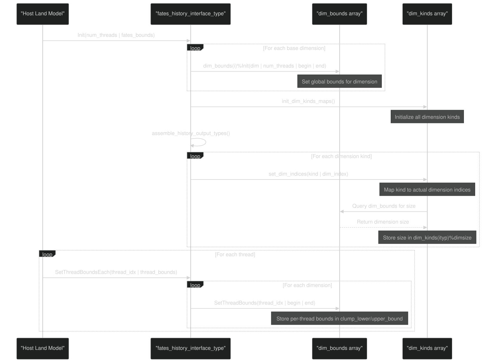

# History Variables and Dimensions

Relevant source files

- [biogeochem/EDCanopyStructureMod.F90](https://github.com/jingtao-lbl/fates/blob/e85d9977/biogeochem/EDCanopyStructureMod.F90)
- [main/FatesHistoryInterfaceMod.F90](https://github.com/jingtao-lbl/fates/blob/e85d9977/main/FatesHistoryInterfaceMod.F90)

## Purpose and Scope

This page documents the dimension system used by FATES history output. The dimension system provides a framework for organizing output variables across FATES's complex subgrid structure, which includes patches, cohorts, canopy layers, PFTs, size classes, age classes, and vertical layers. This page focuses on how dimensions are defined, how they are combined into multiplexed dimensions, and how they are associated with output variables through the dimension kind system.

For information about how history variables are actually updated and written to output files, see [History Update Pipeline](../output/history/pipeline.md) . For general information about the history output system architecture, see [History Output System](../output/history/index.md) .

## Overview of the History Dimension System

FATES requires a flexible multi-dimensional output system because vegetation is organized hierarchically (sites → patches → cohorts) and varies continuously in size and age. Since patches and cohorts can appear and disappear during a simulation, FATES bins continuous attributes (e.g., diameter, age) into discrete classes for history output. This creates a high-dimensional output space spanning spatial location, PFT, size class, age class, canopy layer, vertical leaf layer, and other attributes.

The dimension system addresses three key challenges:

The solution uses base dimensions (e.g., `levpft` , `levscls` ) and multiplexed dimensions that combine multiple base dimensions into single dimensions (e.g., `levscpf` = size class × PFT).

Sources: [main/FatesHistoryInterfaceMod.F90 100-153](https://github.com/jingtao-lbl/fates/blob/e85d9977/main/FatesHistoryInterfaceMod.F90#L100-L153)

## Base Dimensions

Base dimensions represent fundamental axes of variation in FATES output. Each dimension has a fixed size determined during initialization based on the model configuration.

### Core Base Dimensions

Table 1: Base Dimension Registry

| Dimension | Index Variable | Description | Typical Size | 
| --- | --- | --- | --- |
| column | column_index_ | Site/gridcell spatial dimension | nsites | 
| levsoil | levsoil_index_ | Soil layer vertical dimension | nlevsoil | 
| levpft | levpft_index_ | Plant functional type | numpft (12-18) | 
| levscls | levscls_index_ | Cohort size class bins | nlevsclass (13) | 
| levage | levage_index_ | Patch age class bins | nlevage (4-7) | 
| levcacls | levcacls_index_ | Cohort age class bins | nlevcoage | 
| levcan | levcan_index_ | Canopy layer (1=canopy, 2=understory) | nclmax (2) | 
| levcwdsc | levcwdsc_index_ | Coarse woody debris size classes | ncwd (4) | 
| levfuel | levfuel_index_ | Fuel size classes for fire | nfsc (6) | 
| levcdam | levcdam_index_ | Crown damage severity levels | nlevdamage | 
| levheight | levheight_index_ | Height bin for vertical distribution | nlevheight | 

Sources: [main/FatesHistoryInterfaceMod.F90 763-773](https://github.com/jingtao-lbl/fates/blob/e85d9977/main/FatesHistoryInterfaceMod.F90#L763-L773)  [main/FatesHistoryInterfaceMod.F90 869-1021](https://github.com/jingtao-lbl/fates/blob/e85d9977/main/FatesHistoryInterfaceMod.F90#L869-L1021)

## Multiplexed Dimensions

Multiplexed dimensions combine two or more base dimensions into a single dimension to work within NetCDF's dimensionality constraints. For example, `levscpf` combines size class and PFT into one dimension of size `nlevsclass × numpft` .

### Common Multiplexed Dimensions

Table 2: Multiplexed Dimension Examples

| Multiplexed Dim | Component Dims | Size Formula | Purpose | 
| --- | --- | --- | --- |
| levscpf | size class × PFT | nlevsclass × numpft | Cohort variables binned by size and PFT | 
| levscag | size class × age | nlevsclass × nlevage | Size-age distribution of cohorts | 
| levscagpft | size × age × PFT | nlevsclass × nlevage × numpft | Full size-age-PFT distribution | 
| levagepft | age × PFT | nlevage × numpft | Patch age distribution by PFT | 
| levcnlf | canopy × leaf layer | nclmax × nlevleaf | Vertical canopy structure | 
| levcnlfpft | canopy × leaf × PFT | nclmax × nlevleaf × numpft | PFT-specific vertical structure | 
| levelcwd | element × CWD size | num_elements × ncwd | CWD pools by element | 
| levelpft | element × PFT | num_elements × numpft | Element pools by PFT | 
| levagefuel | age × fuel size | nlevage × nfsc | Fuel loads by patch age | 
| levcdpf | damage × PFT × size | nlevdamage × numpft × nlevsclass | Crown damage distribution | 

Sources: [main/FatesHistoryInterfaceMod.F90 134-152](https://github.com/jingtao-lbl/fates/blob/e85d9977/main/FatesHistoryInterfaceMod.F90#L134-L152)  [main/FatesHistoryInterfaceMod.F90 901-1020](https://github.com/jingtao-lbl/fates/blob/e85d9977/main/FatesHistoryInterfaceMod.F90#L901-L1020)

## Dimension Kinds and Variable Types

Each history variable is assigned a dimension kind that specifies both the dimensionality (1D, 2D, etc.) and which dimensions are used. Dimension kinds are defined using naming conventions that encode this information.

### Dimension Kind Naming Convention

### Dimension Kind Type Definition

The `fates_io_variable_kind_type` structure encapsulates dimension kind information:

Table 3: Common Dimension Kinds

| Kind Name | Dimensionality | Dimensions | Example Variables | 
| --- | --- | --- | --- |
| site_r8 | 1D | column | NPP, GPP, total biomass | 
| site_pft_r8 | 2D | column × levpft | Biomass by PFT, mortality by PFT | 
| site_size_pft_r8 | 2D | column × levscpf | Number density by size×PFT | 
| site_size_r8 | 2D | column × levscls | Basal area by size class | 
| site_age_r8 | 2D | column × levage | Patch area by age class | 
| site_scagpft_r8 | 2D | column × levscagpft | Full size-age-PFT distribution | 
| site_cnlf_r8 | 2D | column × levcnlf | Leaf area by canopy and leaf layer | 
| site_soil_r8 | 2D | column × levsoil | Soil moisture by layer | 
| site_elem_r8 | 2D | column × levelem | Litter inputs by element | 

Sources: [main/FatesHistoryInterfaceMod.F90 1777-1913](https://github.com/jingtao-lbl/fates/blob/e85d9977/main/FatesHistoryInterfaceMod.F90#L1777-L1913)  [main/FatesHistoryInterfaceMod.F90 1144-1240](https://github.com/jingtao-lbl/fates/blob/e85d9977/main/FatesHistoryInterfaceMod.F90#L1144-L1240)

## History Variable Indexing System

Each history variable is assigned a unique integer index (e.g., `ih_npp_si` , `ih_gpp_si_scpf` ) that is used to access the variable in the history arrays. The naming convention encodes the variable name and dimension suffix.

### Variable Index Naming Convention

### Variable Declaration and Registration

History variables go through a two-step process:

Example Variable Declarations:

| Variable Index | Dimension | Description | 
| --- | --- | --- |
| ih_gpp_si | site_r8 | Gross primary production (site total) | 
| ih_npp_si | site_r8 | Net primary production (site total) | 
| ih_agb_si | site_r8 | Above-ground biomass (site total) | 
| ih_nplant_si_scpf | site_size_pft_r8 | Number density by size class and PFT | 
| ih_mortality_si_pft | site_pft_r8 | Mortality rate by PFT | 
| ih_lai_canopy_si_scpf | site_size_pft_r8 | Leaf area index by size class and PFT (canopy only) | 
| ih_nplant_si_scag | site_scag_r8 | Number density by size and age class | 
| ih_parsun_z_si_cnlf | site_cnlf_r8 | Sunlit PAR by canopy and leaf layer | 

Sources: [main/FatesHistoryInterfaceMod.F90 174-740](https://github.com/jingtao-lbl/fates/blob/e85d9977/main/FatesHistoryInterfaceMod.F90#L174-L740)

## Dimension Bounds and Threading

The `fates_io_dimension_type` manages dimension bounds for each thread in parallel execution. This allows FATES to handle multi-threaded execution where each thread operates on a subset of sites.

### Dimension Bounds Structure

### Initialization Flow

### Dimension Index Accessor Methods

Each dimension has getter methods to retrieve its index in the `dim_bounds` array:

| Method | Returns Index For | Line Reference | 
| --- | --- | --- |
| column_index() | column dimension | main/FatesHistoryInterfaceMod.F901290-1294 | 
| levsoil_index() | soil layer dimension | main/FatesHistoryInterfaceMod.F901304-1308 | 
| levscpf_index() | size class × PFT dimension | main/FatesHistoryInterfaceMod.F901318-1322 | 
| levscls_index() | size class dimension | main/FatesHistoryInterfaceMod.F901332-1336 | 
| levpft_index() | PFT dimension | main/FatesHistoryInterfaceMod.F901374-1378 | 
| levage_index() | patch age dimension | main/FatesHistoryInterfaceMod.F901388-1392 | 
| levscag_index() | size × age dimension | main/FatesHistoryInterfaceMod.F901514-1518 | 
| levscagpft_index() | size × age × PFT dimension | main/FatesHistoryInterfaceMod.F901528-1532 | 

Sources: [main/FatesHistoryInterfaceMod.F90 869-1021](https://github.com/jingtao-lbl/fates/blob/e85d9977/main/FatesHistoryInterfaceMod.F90#L869-L1021)  [main/FatesHistoryInterfaceMod.F90 1024-1141](https://github.com/jingtao-lbl/fates/blob/e85d9977/main/FatesHistoryInterfaceMod.F90#L1024-L1141)  [main/FatesHistoryInterfaceMod.F90 1283-1650](https://github.com/jingtao-lbl/fates/blob/e85d9977/main/FatesHistoryInterfaceMod.F90#L1283-L1650)

## Dimension-to-Array Mapping

The relationship between FATES's ecological structure and history output arrays is complex because FATES uses linked lists of patches and cohorts, while output requires rectangular arrays. The dimension system provides the indexing needed for this mapping.

### Cohort-to-Array Index Mapping

### Size and Age Class Indexing Functions

Key functions in [biogeochem/FatesSizeAgeTypeIndicesMod.F90](https://github.com/jingtao-lbl/fates/blob/e85d9977/biogeochem/FatesSizeAgeTypeIndicesMod.F90) map continuous variables to discrete bins:

| Function | Input | Output | Purpose | 
| --- | --- | --- | --- |
| sizetype_class_index() | dbh, pft | size_class, size_by_pft_class | Map DBH to size bin | 
| get_sizeage_class_index() | dbh, age | iscag | Map to size×age bin | 
| get_sizeagepft_class_index() | dbh, age, pft | iscagpft | Map to size×age×PFT bin | 
| get_agepft_class_index() | age, pft | iagepft | Map to age×PFT bin | 
| get_age_class_index() | age | iage | Map patch age to age bin | 
| get_layersizetype_class_index() | canopy_layer, dbh, pft | iclscpf | Map to layer×size×PFT bin | 

These functions are called during cohort initialization [biogeochem/EDCanopyStructureMod.F90 1357-1365](https://github.com/jingtao-lbl/fates/blob/e85d9977/biogeochem/EDCanopyStructureMod.F90#L1357-L1365) and when updating history variables.

Sources: [main/FatesHistoryInterfaceMod.F90 2108-2130](https://github.com/jingtao-lbl/fates/blob/e85d9977/main/FatesHistoryInterfaceMod.F90#L2108-L2130)  [biogeochem/FatesSizeAgeTypeIndicesMod.F90](https://github.com/jingtao-lbl/fates/blob/e85d9977/biogeochem/FatesSizeAgeTypeIndicesMod.F90)  [biogeochem/EDCanopyStructureMod.F90 1357-1365](https://github.com/jingtao-lbl/fates/blob/e85d9977/biogeochem/EDCanopyStructureMod.F90#L1357-L1365)

## Summary

The FATES history dimension system provides a flexible framework for organizing multi-dimensional output from a complex ecological model:

This architecture allows FATES to efficiently accumulate diagnostics during the simulation despite the dynamic nature of patches and cohorts, then output spatially and temporally averaged fields on a regular grid structure suitable for analysis.

Sources: [main/FatesHistoryInterfaceMod.F90 1-2106](https://github.com/jingtao-lbl/fates/blob/e85d9977/main/FatesHistoryInterfaceMod.F90#L1-L2106)