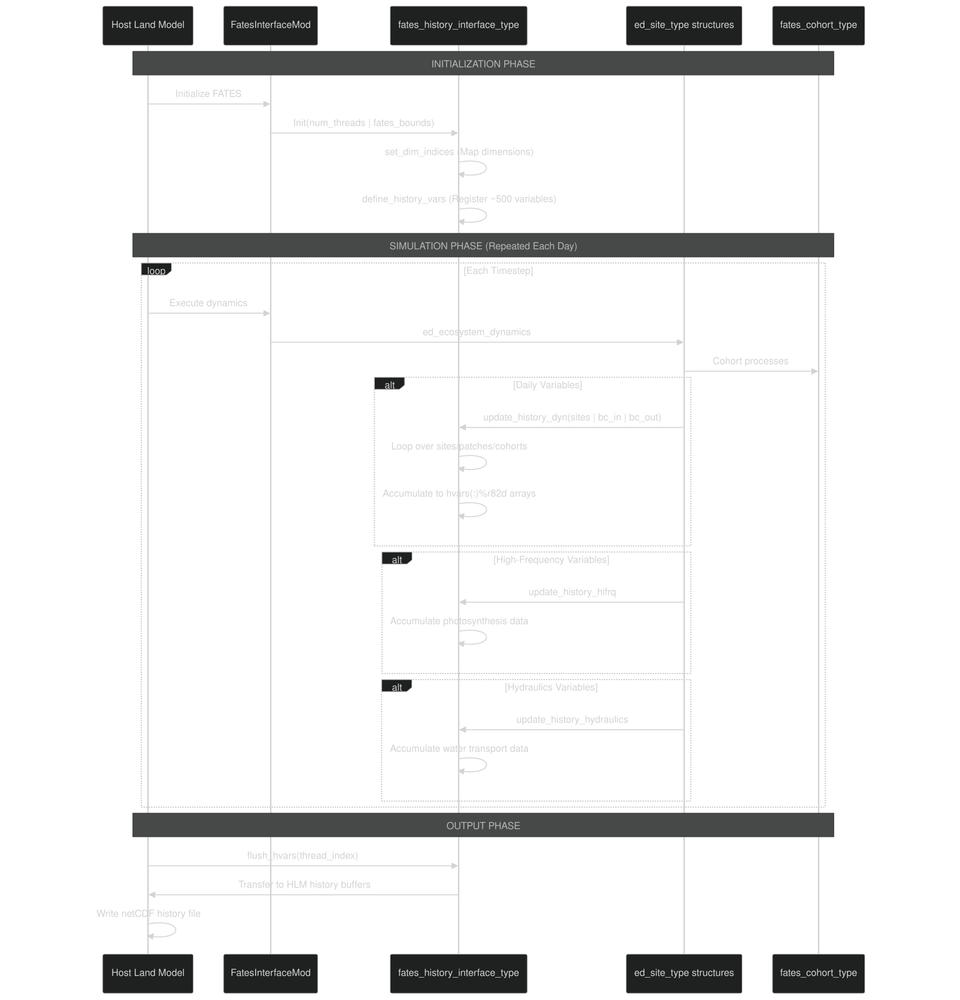

# Model Output and Diagnostics

Relevant source files

- [main/EDInitMod.F90](https://github.com/jingtao-lbl/fates/blob/e85d9977/main/EDInitMod.F90)
- [main/FatesHistoryInterfaceMod.F90](https://github.com/jingtao-lbl/fates/blob/e85d9977/main/FatesHistoryInterfaceMod.F90)
- [main/FatesInventoryInitMod.F90](https://github.com/jingtao-lbl/fates/blob/e85d9977/main/FatesInventoryInitMod.F90)
- [main/FatesRestartInterfaceMod.F90](https://github.com/jingtao-lbl/fates/blob/e85d9977/main/FatesRestartInterfaceMod.F90)

## Purpose and Scope

This page documents FATES' model output and diagnostic systems, which provide mechanisms for extracting model state, tracking simulations, and verifying conservation. The primary systems covered are:

- **History Output**[History Output System](output/history/index.md): Time-series diagnostic variables written during simulation (see )
- **Restart Files**[Restart System](output/restart.md): Complete model state serialization for simulation continuation (see )
- **Mass Balance Checking**[Mass Balance Checking](output/mass_balance.md): Conservation verification and error diagnostics (see )

For information about parameter input files, see [Parameter System](getting-started/parameter_system.md) . For initialization procedures, see [Initialization Modes](getting-started/initialization.md) .

## System Architecture Overview

FATES output and diagnostics operate through a two-track system: history output for time-series diagnostics and restart output for complete state preservation. Both systems use dimension mapping to handle FATES' complex subgrid structure (sites → patches → cohorts).

### Output System Architecture

Sources : [main/FatesHistoryInterfaceMod.F90 1-100](https://github.com/jingtao-lbl/fates/blob/e85d9977/main/FatesHistoryInterfaceMod.F90#L1-L100)  [main/FatesRestartInterfaceMod.F90 1-100](https://github.com/jingtao-lbl/fates/blob/e85d9977/main/FatesRestartInterfaceMod.F90#L1-L100)

## History Output Data Flow

The history output system operates in three phases: initialization (variable registration), accumulation (data collection during simulation), and flushing (transfer to host model).

### History Output Pipeline

Sources : [main/FatesHistoryInterfaceMod.F90 777-851](https://github.com/jingtao-lbl/fates/blob/e85d9977/main/FatesHistoryInterfaceMod.F90#L777-L851)  [main/FatesHistoryInterfaceMod.F90 1144-1160](https://github.com/jingtao-lbl/fates/blob/e85d9977/main/FatesHistoryInterfaceMod.F90#L1144-L1160)

## Key Data Structures

### History Interface Type

The `fates_history_interface_type` manages all diagnostic output variables:

Sources : [main/FatesHistoryInterfaceMod.F90 746-854](https://github.com/jingtao-lbl/fates/blob/e85d9977/main/FatesHistoryInterfaceMod.F90#L746-L854)

### Restart Interface Type

The `fates_restart_interface_type` manages complete model state serialization:

Sources : [main/FatesRestartInterfaceMod.F90 326-376](https://github.com/jingtao-lbl/fates/blob/e85d9977/main/FatesRestartInterfaceMod.F90#L326-L376)  [main/FatesRestartInterfaceMod.F90 319-322](https://github.com/jingtao-lbl/fates/blob/e85d9977/main/FatesRestartInterfaceMod.F90#L319-L322)

## Dimension System

FATES uses a sophisticated dimension system to handle its hierarchical data structure. Variables can be dimensioned by site, patch, cohort, PFT, size class, age class, and combinations thereof.

### Dimension Kinds and Multiplexing

| Dimension Kind | Description | Example Variables | 
| --- | --- | --- |
| site_r8 | Site-level real values | Total GPP, NPP, fire area | 
| site_int | Site-level integers | Number of patches, phenology status | 
| site_pft_r8 | Site × PFT | Biomass by PFT, recruitment rate | 
| site_size_pft_r8 | Site × Size Class × PFT | Number density by size and PFT | 
| site_age_r8 | Site × Patch Age | Area distribution by age | 
| cohort_r8 | Cohort-level real | DBH, height, carbon pools | 
| cohort_int | Cohort-level integers | PFT, canopy layer, damage class | 

Multiplexed Dimensions combine multiple indices into a single dimension to reduce dimensionality:

| Multiplexed Name | Components | Purpose | 
| --- | --- | --- |
| scpf | Size class × PFT | Size-structured PFT distributions | 
| scls | Size class | Size-only distributions | 
| cacpf | Cohort age class × PFT | Cohort age by PFT | 
| cnlf | Canopy layer × Leaf layer | Vertical canopy structure | 
| scag | Size class × Patch age | Joint size-age distributions | 
| scagpft | Size class × Patch age × PFT | Full size-age-PFT structure | 

Sources : [main/FatesHistoryInterfaceMod.F90 134-152](https://github.com/jingtao-lbl/fates/blob/e85d9977/main/FatesHistoryInterfaceMod.F90#L134-L152)  [main/FatesHistoryInterfaceMod.F90 1144-1200](https://github.com/jingtao-lbl/fates/blob/e85d9977/main/FatesHistoryInterfaceMod.F90#L1144-L1200)

## Variable Registration and Indexing

History and restart variables are registered during initialization using a systematic indexing scheme. Each variable receives an index ( `ih_*` for history, `ir_*` for restart) used for fast lookup during updates.

### Variable Registration Pattern

Example Registration (from [main/FatesHistoryInterfaceMod.F90 2348-2353](https://github.com/jingtao-lbl/fates/blob/e85d9977/main/FatesHistoryInterfaceMod.F90#L2348-L2353) ):

Sources : [main/FatesHistoryInterfaceMod.F90 818-820](https://github.com/jingtao-lbl/fates/blob/e85d9977/main/FatesHistoryInterfaceMod.F90#L818-L820)  [main/FatesRestartInterfaceMod.F90 631-1200](https://github.com/jingtao-lbl/fates/blob/e85d9977/main/FatesRestartInterfaceMod.F90#L631-L1200)

## Update Frequencies and Timing

History variables are updated at different frequencies depending on the process being tracked:

### Update Routine Timing

Key Update Routines :

- 
`update_history_dyn`  [main/FatesHistoryInterfaceMod.F90 4500-6500](https://github.com/jingtao-lbl/fates/blob/e85d9977/main/FatesHistoryInterfaceMod.F90#L4500-L6500) : Called once per day after `ed_ecosystem_dynamics` . Updates demographic variables, biomass states, mortality rates, and disturbance metrics.

- 
`update_history_hifrq`  [main/FatesHistoryInterfaceMod.F90 6600-7200](https://github.com/jingtao-lbl/fates/blob/e85d9977/main/FatesHistoryInterfaceMod.F90#L6600-L7200) : Called during photosynthesis calculations. Updates GPP, autotrophic respiration, radiation absorption.

- 
`update_history_hydraulics`  [main/FatesHistoryInterfaceMod.F90 7300-7800](https://github.com/jingtao-lbl/fates/blob/e85d9977/main/FatesHistoryInterfaceMod.F90#L7300-L7800) : Called during hydraulic calculations if `hlm_use_planthydro==itrue` . Updates water potential, transpiration, hydraulic conductance.

- 
`update_history_nutrflux`  [main/FatesHistoryInterfaceMod.F90 7900-8200](https://github.com/jingtao-lbl/fates/blob/e85d9977/main/FatesHistoryInterfaceMod.F90#L7900-L8200) : Called during nutrient dynamics if CNP mode is active. Updates nutrient uptake, demand, and efflux.

Sources : [main/FatesHistoryInterfaceMod.F90 782-786](https://github.com/jingtao-lbl/fates/blob/e85d9977/main/FatesHistoryInterfaceMod.F90#L782-L786)

## Restart System Operation

The restart system enables exact simulation continuation by saving and restoring complete model state. Unlike history output (which provides diagnostic snapshots), restarts capture all information needed to reconstruct the site-patch-cohort hierarchy.

### Restart Save and Restore Flow

Sources : [main/FatesRestartInterfaceMod.F90 1600-2200](https://github.com/jingtao-lbl/fates/blob/e85d9977/main/FatesRestartInterfaceMod.F90#L1600-L2200)  [main/FatesRestartInterfaceMod.F90 2300-3300](https://github.com/jingtao-lbl/fates/blob/e85d9977/main/FatesRestartInterfaceMod.F90#L2300-L3300)

### Critical Restart Variables

The restart system saves ~150 variables capturing complete state:

| Variable Category | Example Variables | Index Names | 
| --- | --- | --- |
| Site metadata | Number of patches, phenology status, fire danger | ir_npatch_si, ir_cd_status_si, ir_acc_ni_si | 
| Patch metadata | Number of cohorts, age, area, disturbance category | ir_ncohort_pa, ir_age_pa, ir_area_pa | 
| Cohort structure | DBH, height, PFT, number density | ir_dbh_co, ir_height_co, ir_pft_co, ir_nplant_co | 
| Cohort physiology | Canopy layer, phenology status, elongation factors | ir_canopy_layer_co, ir_status_co, ir_efleaf_co | 
| Carbon pools | Stored in PARTEH (via ir_prt_base) | Leaf, root, sapwood, structure, storage, reproduction | 
| Litter pools | CWD, leaf litter, root litter, seeds (per element) | ir_agcwd_litt, ir_leaf_litt, ir_seed_litt | 
| Hydraulics | Water content, recruitment water, dead water | ir_hydro_th_ag_covec, ir_hydro_recruit_si | 

Sources : [main/FatesRestartInterfaceMod.F90 85-295](https://github.com/jingtao-lbl/fates/blob/e85d9977/main/FatesRestartInterfaceMod.F90#L85-L295)

## Mass Balance Verification

FATES includes a comprehensive mass balance system to verify conservation of carbon and nutrients. Mass balance checks occur at multiple points during the daily dynamics loop.

### Mass Balance Architecture

Sources : [main/EDMainMod.F90 200-500](https://github.com/jingtao-lbl/fates/blob/e85d9977/main/EDMainMod.F90#L200-L500)  [main/ChecksBalancesMod.F90 1-300](https://github.com/jingtao-lbl/fates/blob/e85d9977/main/ChecksBalancesMod.F90#L1-L300)

### Balance Check Implementation

The `TotalBalanceCheck` routine (in [main/ChecksBalancesMod.F90 100-400](https://github.com/jingtao-lbl/fates/blob/e85d9977/main/ChecksBalancesMod.F90#L100-L400) ) performs the following:

Error reporting includes detailed diagnostics:

- Element being checked (C, N, P)
- Location in dynamics loop (check point 0-5)
- Site coordinates
- Magnitude of error and tolerance
- Individual flux components contributing to imbalance

Sources : [main/ChecksBalancesMod.F90 1-500](https://github.com/jingtao-lbl/fates/blob/e85d9977/main/ChecksBalancesMod.F90#L1-L500)  [main/FatesHistoryInterfaceMod.F90 354-356](https://github.com/jingtao-lbl/fates/blob/e85d9977/main/FatesHistoryInterfaceMod.F90#L354-L356)

## Diagnostic Variable Examples

### Common History Variables

| Variable Name | Dimension | Units | Description | 
| --- | --- | --- | --- |
| FATES_GPP | site_r8 | gC/m²/s | Gross primary production | 
| FATES_NPP | site_r8 | gC/m²/s | Net primary production | 
| FATES_NPLANT_SCPF | site_size_pft_r8 | plants/m² | Number density by size and PFT | 
| FATES_MORTALITY_SCPF | site_size_pft_r8 | plants/m²/yr | Mortality rate by size and PFT | 
| FATES_LAI | site_r8 | m²/m² | Total leaf area index | 
| FATES_FIRE_AREA | site_r8 | fraction/day | Fraction of site burned | 
| FATES_DDBH_SCPF | site_size_pft_r8 | cm/yr | Diameter growth rate | 
| FATES_STOREC_SCPF | site_size_pft_r8 | gC/m² | Storage carbon by size/PFT | 
| FATES_CANOPYCROWNAREA_PF | site_pft_r8 | m² | Crown area in canopy by PFT | 
| FATES_PARSUN_Z_CNLF | site_cnlf_r8 | W/m² | Sunlit PAR by canopy/leaf layer | 

Sources : [main/FatesHistoryInterfaceMod.F90 2300-4000](https://github.com/jingtao-lbl/fates/blob/e85d9977/main/FatesHistoryInterfaceMod.F90#L2300-L4000)

## Implementation Notes

### Thread Safety and Bounds

Both history and restart systems support multi-threaded execution through careful dimension bounds management:

- **Dimension bounds**`fates_io_dimension_type`( ) track lower/upper indices for each thread
- **Thread-specific bounds**`SetThreadBoundsEach`set via during initialization
- **Index mapping**`restart_map_type`( ) maps FATES site/cohort indices to HLM I/O positions

Sources : [main/FatesHistoryInterfaceMod.F90 1024-1141](https://github.com/jingtao-lbl/fates/blob/e85d9977/main/FatesHistoryInterfaceMod.F90#L1024-L1141)  [main/FatesRestartInterfaceMod.F90 416-437](https://github.com/jingtao-lbl/fates/blob/e85d9977/main/FatesRestartInterfaceMod.F90#L416-L437)

### Flush Values

Variables use flush values to initialize arrays between updates:

- `flushzero`: Variables that accumulate (fluxes, rates)
- `flushone`: Variables that should default to 1.0
- `flushinvalid`: Variables that must be explicitly set (metadata)

Sources : [main/FatesRestartInterfaceMod.F90 304-306](https://github.com/jingtao-lbl/fates/blob/e85d9977/main/FatesRestartInterfaceMod.F90#L304-L306)

### Host Model Integration

FATES output systems are designed to integrate with host land models (CLM/ALM/ELM) through:

- **Boundary condition types**`bc_in_type``bc_out_type`: , for bi-directional data exchange
- **Host-specific compilation**`hlms='CLM:ALM'`: Variables tagged with indicating compatible hosts
- **Ignore values**`hlm_hio_ignore_val`: flags missing/unavailable data

Sources : [main/FatesHistoryInterfaceMod.F90 38-56](https://github.com/jingtao-lbl/fates/blob/e85d9977/main/FatesHistoryInterfaceMod.F90#L38-L56)  [main/FatesRestartInterfaceMod.F90 20-28](https://github.com/jingtao-lbl/fates/blob/e85d9977/main/FatesRestartInterfaceMod.F90#L20-L28)