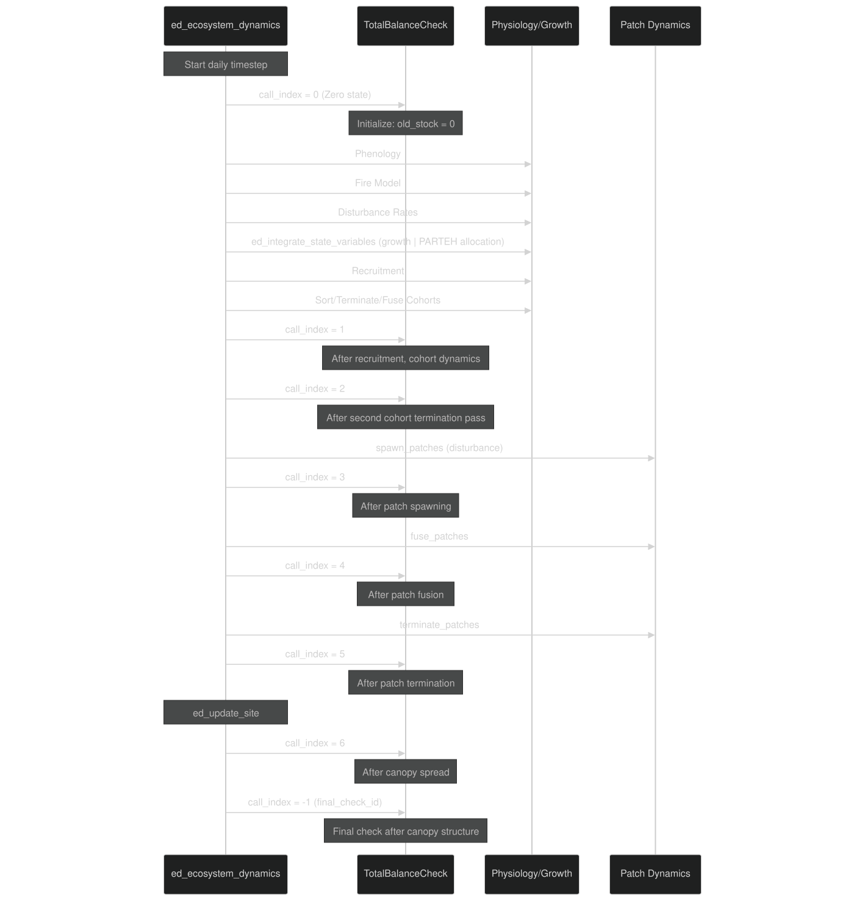

# Mass Balance Checking

Relevant source files

- [biogeochem/EDLoggingMortalityMod.F90](https://github.com/jingtao-lbl/fates/blob/e85d9977/biogeochem/EDLoggingMortalityMod.F90)
- [biogeochem/EDMortalityFunctionsMod.F90](https://github.com/jingtao-lbl/fates/blob/e85d9977/biogeochem/EDMortalityFunctionsMod.F90)
- [biogeochem/EDPatchDynamicsMod.F90](https://github.com/jingtao-lbl/fates/blob/e85d9977/biogeochem/EDPatchDynamicsMod.F90)
- [main/EDMainMod.F90](https://github.com/jingtao-lbl/fates/blob/e85d9977/main/EDMainMod.F90)
- [main/EDTypesMod.F90](https://github.com/jingtao-lbl/fates/blob/e85d9977/main/EDTypesMod.F90)

## Purpose and Scope

The mass balance checking system in FATES verifies conservation of mass for all simulated elements (carbon, nitrogen, phosphorus) at the site level. This system tracks all mass fluxes entering and leaving the FATES control volume, compares them against changes in total biomass and litter stocks, and reports any discrepancies that exceed acceptable numerical precision thresholds.

This page documents the mass balance verification framework. For information about the history output system that records these diagnostics, see [History Output System](output/history/index.md) . For restart file handling which persists mass balance state, see [Restart System](output/restart.md) .

## Overview

Mass balance checking operates on the fundamental principle:

If this equation is not satisfied within numerical precision tolerances, FATES detects a conservation error and reports detailed diagnostics. The system performs checks at multiple points during each daily timestep to isolate the source of any imbalances.

Sources:  [main/EDMainMod.F90 847-1092](https://github.com/jingtao-lbl/fates/blob/e85d9977/main/EDMainMod.F90#L847-L1092)

## Site Mass Balance Type Structure

The mass balance accounting system is organized around the `site_massbal_type` data structure, which is allocated for each element type (C, N, P) at each site.

### Data Structure Definition

### Key Fields

| Field | Description | Units | 
| --- | --- | --- |
| old_stock | Total mass at start of check interval | kg/site | 
| err_fates | Accumulated mass balance error | kg/site | 
| gpp_acc | Accumulated gross primary production | kg/site/day | 
| aresp_acc | Accumulated autotrophic respiration | kg/site/day | 
| net_root_uptake | Net nutrient uptake through roots (includes fixation and exudation) | kg/site/day | 
| seed_in | Mass from external seed dispersal | kg/site/day | 
| seed_out | Mass exported via seeds (placeholder) | kg/site/day | 
| frag_out | Litter/CWD fragmentation to SOM | kg/site/day | 
| wood_product | Mass exported as wood products (logging) | kg/site/day | 
| burn_flux_to_atm | Mass lost to atmosphere via fire | kg/site/day | 
| flux_generic_in | Generic input flux (initialization, prescribed) | kg/site/day | 
| flux_generic_out | Generic output flux (prescribed physiology mode) | kg/site/day | 
| patch_resize_err | Error from patch area precision loss | kg/site/day | 

Sources:  [main/EDTypesMod.F90 174-224](https://github.com/jingtao-lbl/fates/blob/e85d9977/main/EDTypesMod.F90#L174-L224)  [main/EDTypesMod.F90 458-485](https://github.com/jingtao-lbl/fates/blob/e85d9977/main/EDTypesMod.F90#L458-L485)

## The TotalBalanceCheck Routine

The `TotalBalanceCheck` subroutine is the core verification routine called at strategic points during the daily dynamics loop. It calculates current stocks, compares against previous stocks plus net fluxes, and reports errors exceeding tolerance.

### Routine Signature

### Mass Balance Calculation Flow

### Error Reporting

When an imbalance is detected, the routine reports:

Sources:  [main/EDMainMod.F90 847-1092](https://github.com/jingtao-lbl/fates/blob/e85d9977/main/EDMainMod.F90#L847-L1092)

## Check Points in the Daily Dynamics Loop

Mass balance checks are strategically placed throughout the daily ecosystem dynamics sequence to isolate where imbalances occur. Each check point is identified by a `call_index` .

### Check Point Sequence

| Call Index | Location | Purpose | 
| --- | --- | --- |
| 0 | Start of ed_ecosystem_dynamics | Zero accumulators, set baseline old_stock = 0 | 
| 1 | After recruitment and first cohort dynamics | Verify cohort creation and mortality | 
| 2 | After second cohort termination pass | Verify additional cohort cleanup | 
| 3 | After spawn_patches | Verify disturbance-induced patch creation | 
| 4 | After fuse_patches | Verify patch fusion mass conservation | 
| 5 | After terminate_patches | Verify patch termination mass conservation | 
| 6 | After canopy_spread in ed_update_site | Verify canopy structure adjustments | 
| -1 | After canopy_structure (final) | Final verification before timestep completion | 

Sources:  [main/EDMainMod.F90 141-317](https://github.com/jingtao-lbl/fates/blob/e85d9977/main/EDMainMod.F90#L141-L317)  [main/EDMainMod.F90 768-843](https://github.com/jingtao-lbl/fates/blob/e85d9977/main/EDMainMod.F90#L768-L843)

## Flux Components

The mass balance system tracks all pathways for mass entering and leaving the FATES control volume.

### Input Fluxes

### Output Fluxes

### Flux Accumulation Points

| Flux | Accumulation Location | Code Reference | 
| --- | --- | --- |
| gpp_acc | During photosynthesis timestep, summed in ed_integrate_state_variables | main/EDMainMod.F90629-630 | 
| aresp_acc | During photosynthesis timestep, summed in ed_integrate_state_variables | main/EDMainMod.F90632-633 | 
| net_root_uptake | After PARTEH allocation (C efflux, N/P uptake) | main/EDMainMod.F90610-626 | 
| wood_product | During logging disturbance in logging_litter_fluxes | biogeochem/EDLoggingMortalityMod.F90684-1094 | 
| burn_flux_to_atm | During fire in fire_litter_fluxes | biogeochem/EDPatchDynamicsMod.F901697-1990 | 
| frag_out | During litter turnover (passed to HLM) | Various litter routines | 
| seed_in | During SeedUpdate from external dispersal | biogeochem/EDPhysiologyMod.F90 | 

Sources:  [main/EDMainMod.F90 847-1092](https://github.com/jingtao-lbl/fates/blob/e85d9977/main/EDMainMod.F90#L847-L1092)  [main/EDMainMod.F90 320-765](https://github.com/jingtao-lbl/fates/blob/e85d9977/main/EDMainMod.F90#L320-L765)

## Stock Calculations

The `SiteMassStock` routine calculates total mass across all pools at a site, broken down into biomass, litter, and seeds.

### Stock Calculation Flow

### Stock Components

| Component | Calculation | Code Location | 
| --- | --- | --- |
| Biomass Stock | Sum over all cohorts and patches: Σ(organ_mass × n × patch_area/AREA) for all organs | Called via SiteMassStock | 
| Litter Stock | Sum over all patches: (AG_CWD + BG_CWD + leaf_litter + root_litter) × patch_area/AREA | Called via SiteMassStock | 
| Seed Stock | Sum over all patches and PFTs: (seed + seed_germinated) × patch_area/AREA | Called via SiteMassStock | 
| Total Stock | biomass_stock + litter_stock + seed_stock | main/EDMainMod.F90905 | 

The stocks are calculated in units of kg/site, where "site" refers to the notional 1 hectare (10,000 m²) unit used in FATES.

Sources: Reference to `ChecksBalancesMod::SiteMassStock` in [main/EDMainMod.F90 905](https://github.com/jingtao-lbl/fates/blob/e85d9977/main/EDMainMod.F90#L905-L905)

## Mass Balance in Special Cases

### Patch Dynamics Operations

Patch creation, fusion, and termination involve complex area and mass transfers that must conserve mass precisely:

When patch areas are very small, floating-point precision limits can cause small mass gains or losses. The `patch_resize_err` field tracks these numerical artifacts.

Sources:  [biogeochem/EDPatchDynamicsMod.F90 398-1156](https://github.com/jingtao-lbl/fates/blob/e85d9977/biogeochem/EDPatchDynamicsMod.F90#L398-L1156)

### Logging and Disturbance

Logging events involve multiple mass pathways requiring careful accounting:

The `logging_litter_fluxes` routine tracks:

- `trunk_product_site`: Mass exported as wood products
- `delta_litter_stock`: Mass transferred to litter
- `delta_biomass_stock`: Total mass leaving live pool
- `delta_individual`: Change in plant numbers

Sources:  [biogeochem/EDLoggingMortalityMod.F90 684-1094](https://github.com/jingtao-lbl/fates/blob/e85d9977/biogeochem/EDLoggingMortalityMod.F90#L684-L1094)

## Debugging Mass Balance Errors

### Error Tolerance

The mass balance check uses a fractional error tolerance:

Where `error_frac = error / abs(total_stock)` if `total_stock > 0` .

### Diagnostic Output Structure

When an error is detected, the output follows this structure:

### Common Causes of Imbalances

| Issue | Typical Call Index | Likely Cause | 
| --- | --- | --- |
| Recruitment imbalance | 1 | New cohort initialization not matching stoichiometry | 
| Patch spawning imbalance | 3 | Litter transfer calculation error during disturbance | 
| Patch fusion imbalance | 4 | Area-weighted averaging introduces precision error | 
| Growth imbalance | Between 0 and 1 | PARTEH allocation not conserving mass | 
| Logging imbalance | 3 | Wood product calculation inconsistent with litter | 

Sources:  [main/EDMainMod.F90 932-1092](https://github.com/jingtao-lbl/fates/blob/e85d9977/main/EDMainMod.F90#L932-L1092)

## Integration with Other Systems

### Relationship to History Output

The mass balance accumulators ( `gpp_acc` , `aresp_acc` , etc.) are also used to populate history output variables. The history system reads these accumulated values and outputs them to diagnostic files.

See:  [History Output System](output/history/index.md) for details on how mass balance fluxes are reported.

### Relationship to PARTEH

The PARTEH (Plant Allocation and Reactive Transport Extensible Hypotheses) system is responsible for allocating carbon and nutrients within plants. PARTEH has its own internal mass conservation checks via `CheckMassConservation` , which are called at key points during allocation.

See:  [PARTEH: Plant Allocation System](plant-physiology/parteh/index.md) for details on internal PARTEH mass balance.

### Bypassing Mass Balance in Special Modes

In satellite phenology (SP) mode and ST3 mode, some mass balance checks are bypassed because these modes prescribe vegetation state rather than prognostically simulating it:

Sources:  [main/EDMainMod.F90 894](https://github.com/jingtao-lbl/fates/blob/e85d9977/main/EDMainMod.F90#L894-L894)

## Code Architecture Summary

Sources:  [main/EDMainMod.F90 1-1109](https://github.com/jingtao-lbl/fates/blob/e85d9977/main/EDMainMod.F90#L1-L1109)  [main/EDTypesMod.F90 174-485](https://github.com/jingtao-lbl/fates/blob/e85d9977/main/EDTypesMod.F90#L174-L485)  [biogeochem/EDPatchDynamicsMod.F90 1-2891](https://github.com/jingtao-lbl/fates/blob/e85d9977/biogeochem/EDPatchDynamicsMod.F90#L1-L2891)