# Restart System

Relevant source files

- [main/EDInitMod.F90](https://github.com/jingtao-lbl/fates/blob/e85d9977/main/EDInitMod.F90)
- [main/FatesInterfaceMod.F90](https://github.com/jingtao-lbl/fates/blob/e85d9977/main/FatesInterfaceMod.F90)
- [main/FatesInterfaceTypesMod.F90](https://github.com/jingtao-lbl/fates/blob/e85d9977/main/FatesInterfaceTypesMod.F90)
- [main/FatesInventoryInitMod.F90](https://github.com/jingtao-lbl/fates/blob/e85d9977/main/FatesInventoryInitMod.F90)
- [main/FatesRestartInterfaceMod.F90](https://github.com/jingtao-lbl/fates/blob/e85d9977/main/FatesRestartInterfaceMod.F90)

## Purpose and Scope

The FATES Restart System manages the persistence and recovery of model state across simulation runs. It handles the serialization of all dynamically evolving components—including sites, patches, cohorts, litter pools, and running means—into flat arrays for storage by the Host Land Model (HLM), and the reconstruction of FATES' complex linked-list data structures from those arrays when resuming a simulation.

For information about initialization from inventory data (an alternative cold-start method), see [Initialization Modes](getting-started/initialization.md) . For details on history output (diagnostic time-series data), see [History Output System](output/history/index.md) .

Sources:  [main/FatesRestartInterfaceMod.F90 1-60](https://github.com/jingtao-lbl/fates/blob/e85d9977/main/FatesRestartInterfaceMod.F90#L1-L60)

## System Architecture

The restart system is implemented in `FatesRestartInterfaceMod` and provides a bidirectional interface between FATES' hierarchical data structures (sites → patches → cohorts) and the HLM's flat restart arrays.


Diagram: Restart System Architecture - The restart interface mediates between FATES' linked-list structures and the HLM's flat array storage.

Sources:  [main/FatesRestartInterfaceMod.F90 326-376](https://github.com/jingtao-lbl/fates/blob/e85d9977/main/FatesRestartInterfaceMod.F90#L326-L376)  [main/FatesRestartInterfaceMod.F90 297-298](https://github.com/jingtao-lbl/fates/blob/e85d9977/main/FatesRestartInterfaceMod.F90#L297-L298)

## Restart Variable Types and Dimensions

The restart system uses a fixed set of dimension kinds that determine how variables are stored:

| Dimension Kind | Base Dimension | Data Type | Description | 
| --- | --- | --- | --- |
| cohort_r8 | cohort | real(r8) | 1D cohort-scale real values | 
| cohort_int | cohort | integer | 1D cohort-scale integers | 
| site_r8 | column | real(r8) | 1D site-scale real values | 
| site_int | column | integer | 1D site-scale integers | 

The system defines exactly 2 dimensions and 4 dimension kinds :

### Flush Values

When restart arrays are allocated, they are initialized ("flushed") to sentinel values:

| Constant | Value | Usage | 
| --- | --- | --- |
| flushinvalid | -9999.0 | Variables that must be set (error if not) | 
| flushzero | 0.0 | Variables that default to zero | 
| flushone | 1.0 | Variables that default to one | 

Sources:  [main/FatesRestartInterfaceMod.F90 297-306](https://github.com/jingtao-lbl/fates/blob/e85d9977/main/FatesRestartInterfaceMod.F90#L297-L306)  [main/FatesRestartInterfaceMod.F90 532-573](https://github.com/jingtao-lbl/fates/blob/e85d9977/main/FatesRestartInterfaceMod.F90#L532-L573)

## Key Data Structures

### fates_restart_interface_type

The primary class managing all restart operations:


Diagram: Restart Interface Class Structure

### restart_map_type

Maps between FATES site/cohort indices and the HLM's restart array positions:

- `site_index(:)`- Maps FATES site index to HIO (HLM I/O) site position
- `cohort1_index(:)`- Maps FATES site index to the first cohort position in HIO arrays for that site

This mapping is necessary because the HLM stores data in contiguous arrays across all threads and sites, while FATES organizes data hierarchically by site.

Sources:  [main/FatesRestartInterfaceMod.F90 319-322](https://github.com/jingtao-lbl/fates/blob/e85d9977/main/FatesRestartInterfaceMod.F90#L319-L322)  [main/FatesRestartInterfaceMod.F90 326-376](https://github.com/jingtao-lbl/fates/blob/e85d9977/main/FatesRestartInterfaceMod.F90#L326-L376)

## Restart Variable Categories

The restart system manages hundreds of state variables organized into categories:

Diagram: Restart Variable Categories - Variables are organized by the scale and subsystem they represent.

Sources:  [main/FatesRestartInterfaceMod.F90 85-295](https://github.com/jingtao-lbl/fates/blob/e85d9977/main/FatesRestartInterfaceMod.F90#L85-L295)  [main/FatesRestartInterfaceMod.F90 631-1484](https://github.com/jingtao-lbl/fates/blob/e85d9977/main/FatesRestartInterfaceMod.F90#L631-L1484)

## Restart Workflow

### Writing a Restart File

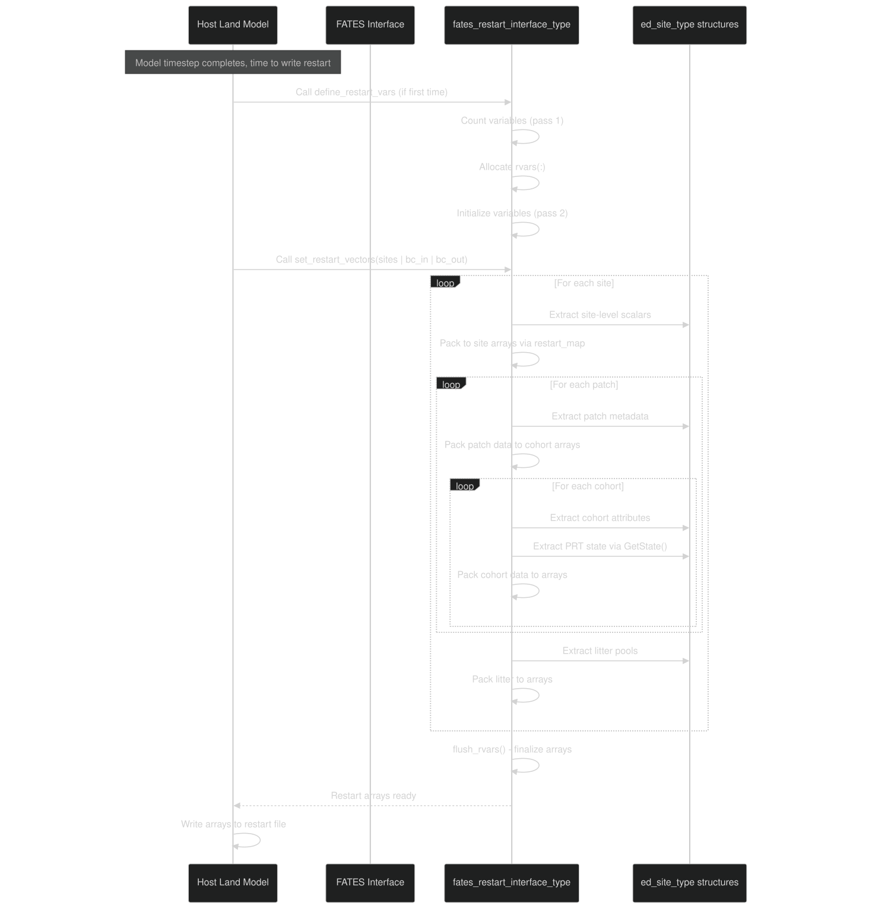

Diagram: Writing a Restart File Sequence

The `set_restart_vectors` method performs a complete traversal of the site/patch/cohort hierarchy, extracting state and packing it into the restart arrays. Key aspects:

Cohort array indexing: Cohorts from different patches are packed sequentially into the cohort restart arrays. The `restart_map` tracks the starting index for each site's cohorts.

Sources:  [main/FatesRestartInterfaceMod.F90 1697-2328](https://github.com/jingtao-lbl/fates/blob/e85d9977/main/FatesRestartInterfaceMod.F90#L1697-L2328)  [main/FatesRestartInterfaceMod.F90 610-625](https://github.com/jingtao-lbl/fates/blob/e85d9977/main/FatesRestartInterfaceMod.F90#L610-L625)

### Reading a Restart File

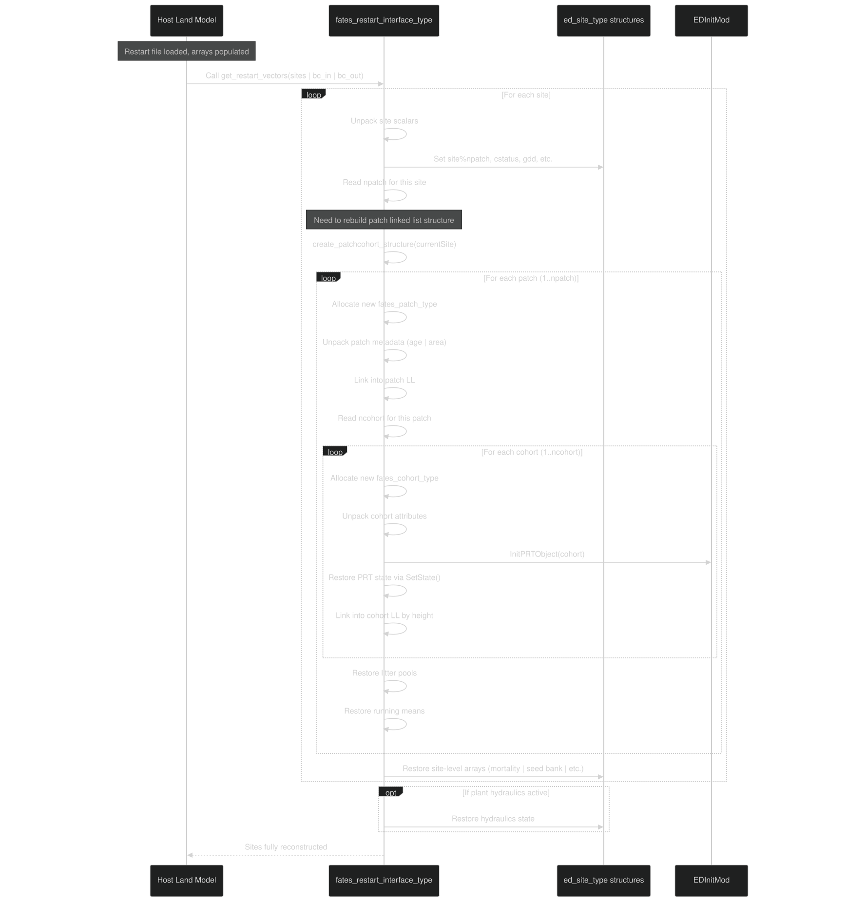

Diagram: Reading a Restart File Sequence

The `get_restart_vectors` method performs two major tasks:

Critical ordering: The structure must be created before state can be populated, because the unpacking code traverses the linked lists that `create_patchcohort_structure` builds.

Sources:  [main/FatesRestartInterfaceMod.F90 2330-3075](https://github.com/jingtao-lbl/fates/blob/e85d9977/main/FatesRestartInterfaceMod.F90#L2330-L3075)  [main/FatesRestartInterfaceMod.F90 3077-3555](https://github.com/jingtao-lbl/fates/blob/e85d9977/main/FatesRestartInterfaceMod.F90#L3077-L3555)

## Variable Registration System

Restart variables are registered using a two-phase initialization pattern:


Diagram: Two-Phase Variable Registration

Each variable is registered via `set_restart_var` :

The `ivar` counter increments on each call, and when `initialize=.true.` , the `index` parameter (e.g., `ir_dbh_co` ) is set to `ivar` for later reference.

Conditional registration: Variables for optional features (CNP, hydraulics, damage) are only registered if the corresponding flags are active:

Sources:  [main/FatesRestartInterfaceMod.F90 590-606](https://github.com/jingtao-lbl/fates/blob/e85d9977/main/FatesRestartInterfaceMod.F90#L590-L606)  [main/FatesRestartInterfaceMod.F90 631-1484](https://github.com/jingtao-lbl/fates/blob/e85d9977/main/FatesRestartInterfaceMod.F90#L631-L1484)  [main/FatesRestartInterfaceMod.F90 1522-1587](https://github.com/jingtao-lbl/fates/blob/e85d9977/main/FatesRestartInterfaceMod.F90#L1522-L1587)

## PARTEH State Serialization

PARTEH (Plant Allocation and Reactive Transport Extensible Hypotheses) biomass pools are serialized using a special registration system:


Diagram: PARTEH Variable Registration

The system registers variables for each active element-organ pair, using the naming convention `fates_<organ>_<element>` :

- `fates_leaf_c``fates_leaf_n``fates_leaf_p`, ,
- `fates_fnrt_c``fates_fnrt_n``fates_fnrt_p`, ,
- `fates_sapw_c``fates_sapw_n``fates_sapw_p`, ,
- `fates_store_c``fates_store_n``fates_store_p`, ,
- `fates_struct_c``fates_struct_n``fates_struct_p`, ,
- `fates_repro_c``fates_repro_n``fates_repro_p`, ,

During `set_restart_vectors` , PARTEH state is extracted via:

During `get_restart_vectors` , PARTEH state is restored via:

Sources:  [main/FatesRestartInterfaceMod.F90 1489-1587](https://github.com/jingtao-lbl/fates/blob/e85d9977/main/FatesRestartInterfaceMod.F90#L1489-L1587)  [main/FatesRestartInterfaceMod.F90 2102-2149](https://github.com/jingtao-lbl/fates/blob/e85d9977/main/FatesRestartInterfaceMod.F90#L2102-L2149)  [main/FatesRestartInterfaceMod.F90 3355-3414](https://github.com/jingtao-lbl/fates/blob/e85d9977/main/FatesRestartInterfaceMod.F90#L3355-L3414)

## Cohort Array Packing Strategy

Because patches can contain variable numbers of cohorts, and sites contain variable numbers of patches, the restart system uses a sequential packing strategy for cohort-scale arrays:


Diagram: Cohort Array Packing - Cohorts from all patches are packed sequentially into a flat array.

The `restart_map%cohort1_index(s)` stores the starting position in the cohort array for site `s` . As the code traverses patches and cohorts, it maintains a running index `io_idx_co` that increments with each cohort:

This approach allows variable site/patch/cohort counts while maintaining a simple 1D array structure for the HLM.

Sources:  [main/FatesRestartInterfaceMod.F90 2014-2223](https://github.com/jingtao-lbl/fates/blob/e85d9977/main/FatesRestartInterfaceMod.F90#L2014-L2223)  [main/FatesRestartInterfaceMod.F90 3249-3414](https://github.com/jingtao-lbl/fates/blob/e85d9977/main/FatesRestartInterfaceMod.F90#L3249-L3414)

## Patch and Cohort Reconstruction

The `create_patchcohort_structure` method rebuilds the linked-list hierarchy from flat restart arrays:


Diagram: Patch/Cohort Structure Reconstruction Algorithm

### Patch Ordering

Patches are linked in age order (youngest to oldest). The reconstruction code inserts each patch into the correct position:

### Cohort Ordering

Cohorts are linked in height order (tallest to shortest) within each patch. Since cohort height must be computed from `dbh` using allometry, the reconstruction first reads `dbh` , computes `height` , then inserts the cohort:

Sources:  [main/FatesRestartInterfaceMod.F90 3077-3555](https://github.com/jingtao-lbl/fates/blob/e85d9977/main/FatesRestartInterfaceMod.F90#L3077-L3555)  [main/FatesRestartInterfaceMod.F90 3104-3223](https://github.com/jingtao-lbl/fates/blob/e85d9977/main/FatesRestartInterfaceMod.F90#L3104-L3223)  [main/FatesRestartInterfaceMod.F90 3249-3414](https://github.com/jingtao-lbl/fates/blob/e85d9977/main/FatesRestartInterfaceMod.F90#L3249-L3414)

## Running Mean Variables

FATES uses exponential moving averages (EMAs) for various environmental signals. These must be saved and restored in restarts:


Diagram: Running Mean Restart Variables

Each running mean is stored using the `rmean_type` structure and has specialized accessors:

The `rmean_type` internally manages both `hvars` (history output) and `rvars` (restart state) arrays, and the restart system only accesses the `rvars` component.

Sources:  [main/FatesRestartInterfaceMod.F90 1612-1656](https://github.com/jingtao-lbl/fates/blob/e85d9977/main/FatesRestartInterfaceMod.F90#L1612-L1656)  [main/FatesRestartInterfaceMod.F90 3570-3610](https://github.com/jingtao-lbl/fates/blob/e85d9977/main/FatesRestartInterfaceMod.F90#L3570-L3610)  [main/FatesRestartInterfaceMod.F90 3612-3652](https://github.com/jingtao-lbl/fates/blob/e85d9977/main/FatesRestartInterfaceMod.F90#L3612-L3652)

## Optional Feature State

The restart system conditionally saves/restores state for optional features:

### Plant Hydraulics

When `hlm_use_planthydro == itrue` :

| Variable | Description | Units | 
| --- | --- | --- |
| fates_hydro_th_ag_covec | Aboveground water content | m3/m3 | 
| fates_hydro_th_troot | Transporting root water content | m3/m3 | 
| fates_hydro_th_aroot_covec | Absorbing root water content | m3/m3 | 
| fates_hydro_liqvol_shell_si | Rhizosphere shell water volume | m3 | 
| fates_hydro_recruit_si | Recruitment water tracker | kg H2O/m2 | 
| fates_hydro_dead_si | Mortality water tracker | kg H2O/m2 | 

Sources:  [main/FatesRestartInterfaceMod.F90 1363-1410](https://github.com/jingtao-lbl/fates/blob/e85d9977/main/FatesRestartInterfaceMod.F90#L1363-L1410)  [main/FatesRestartInterfaceMod.F90 2226-2328](https://github.com/jingtao-lbl/fates/blob/e85d9977/main/FatesRestartInterfaceMod.F90#L2226-L2328)  [main/FatesRestartInterfaceMod.F90 2860-2996](https://github.com/jingtao-lbl/fates/blob/e85d9977/main/FatesRestartInterfaceMod.F90#L2860-L2996)

### CNP Dynamics

When `hlm_parteh_mode == prt_cnp_flex_allom_hyp` :

| Variable Category | Examples | 
| --- | --- |
| Nutrient uptake | fates_daily_nh4_uptake, fates_daily_no3_uptake, fates_daily_p_uptake | 
| Nutrient demand | fates_daily_n_demand, fates_daily_p_demand | 
| Allocation control | fates_cx_int, fates_emadcxdt, fates_cnplimiter | 

Sources:  [main/FatesRestartInterfaceMod.F90 767-815](https://github.com/jingtao-lbl/fates/blob/e85d9977/main/FatesRestartInterfaceMod.F90#L767-L815)

### Tree Damage

When `hlm_use_tree_damage == itrue` :

Additional size × damage class arrays for mortality and termination tracking:

- `fates_imortrate_cdpf``fates_termnindiv_cano_cdpf`, , etc.

Sources:  [main/FatesRestartInterfaceMod.F90 1283-1331](https://github.com/jingtao-lbl/fates/blob/e85d9977/main/FatesRestartInterfaceMod.F90#L1283-L1331)

## Dimension Mapping and Array Striding

The restart interface maintains mappings between dimensions using the `dim_bounds` and `dim_kinds` structures:


Diagram: Dimension System Architecture

Each restart variable has a `vtype` that references one of the dimension kinds. When data is packed/unpacked, the system:

This abstraction allows the restart system to work with different threading models and domain decompositions without changing the variable registration code.

Sources:  [main/FatesRestartInterfaceMod.F90 333-345](https://github.com/jingtao-lbl/fates/blob/e85d9977/main/FatesRestartInterfaceMod.F90#L333-L345)  [main/FatesRestartInterfaceMod.F90 385-437](https://github.com/jingtao-lbl/fates/blob/e85d9977/main/FatesRestartInterfaceMod.F90#L385-L437)  [main/FatesRestartInterfaceMod.F90 461-497](https://github.com/jingtao-lbl/fates/blob/e85d9977/main/FatesRestartInterfaceMod.F90#L461-L497)

## Integration with Host Land Model

The restart system interfaces with the HLM at several key points:

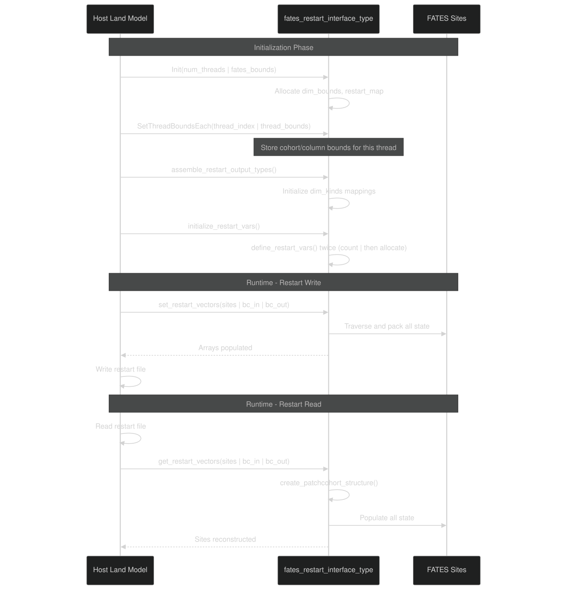

Diagram: HLM Integration Points

The HLM must:

Sources:  [main/FatesRestartInterfaceMod.F90 385-412](https://github.com/jingtao-lbl/fates/blob/e85d9977/main/FatesRestartInterfaceMod.F90#L385-L412)  [main/FatesRestartInterfaceMod.F90 416-437](https://github.com/jingtao-lbl/fates/blob/e85d9977/main/FatesRestartInterfaceMod.F90#L416-L437)  [main/FatesRestartInterfaceMod.F90 441-457](https://github.com/jingtao-lbl/fates/blob/e85d9977/main/FatesRestartInterfaceMod.F90#L441-L457)

## Special Cases and Edge Conditions

### Near-Bare-Ground Restarts

When restarting from a near-bare-ground state (few or no cohorts), special handling ensures valid initialization:

- Flush values prevent uninitialized reads
- `InitPRTObject`PARTEH objects are always initialized via even if biomass is zero
- Litter pools may be zero, which is valid

Sources:  [main/FatesRestartInterfaceMod.F90 3355-3414](https://github.com/jingtao-lbl/fates/blob/e85d9977/main/FatesRestartInterfaceMod.F90#L3355-L3414)

### Cohort Status Flags

The `status_co` variable distinguishes between old and new cohorts:

This is primarily used for tracking newly recruited cohorts during dynamics, and the restart system preserves this state.

Sources:  [main/FatesRestartInterfaceMod.F90 301-302](https://github.com/jingtao-lbl/fates/blob/e85d9977/main/FatesRestartInterfaceMod.F90#L301-L302)

### Multi-Element PARTEH

When multiple nutrient elements are active (C, N, P), the PARTEH serialization loops over all active element-organ pairs. The system queries `prt_global` to determine which combinations are active:

This ensures that restarts work correctly regardless of whether C-only, CN, or CNP allocation is configured.

Sources:  [main/FatesRestartInterfaceMod.F90 1489-1587](https://github.com/jingtao-lbl/fates/blob/e85d9977/main/FatesRestartInterfaceMod.F90#L1489-L1587)  [main/FatesRestartInterfaceMod.F90 2102-2149](https://github.com/jingtao-lbl/fates/blob/e85d9977/main/FatesRestartInterfaceMod.F90#L2102-L2149)

## Summary

The FATES Restart System provides:

- **Bidirectional mapping**between FATES' hierarchical structures and flat HLM arrays
- **Flexible variable registration**supporting optional features (hydraulics, CNP, damage)
- **Automatic structure reconstruction**of patch/cohort linked lists during restart reads
- **Element-aware PARTEH serialization**for multi-nutrient allocation
- **Thread-safe indexing**`restart_map``dim_bounds`via and

The system is designed to be extensible—new state variables can be added by registering them in `define_restart_vars` and adding corresponding pack/unpack code in `set_restart_vectors` / `get_restart_vectors` .

Sources:  [main/FatesRestartInterfaceMod.F90 1-3800](https://github.com/jingtao-lbl/fates/blob/e85d9977/main/FatesRestartInterfaceMod.F90#L1-L3800)