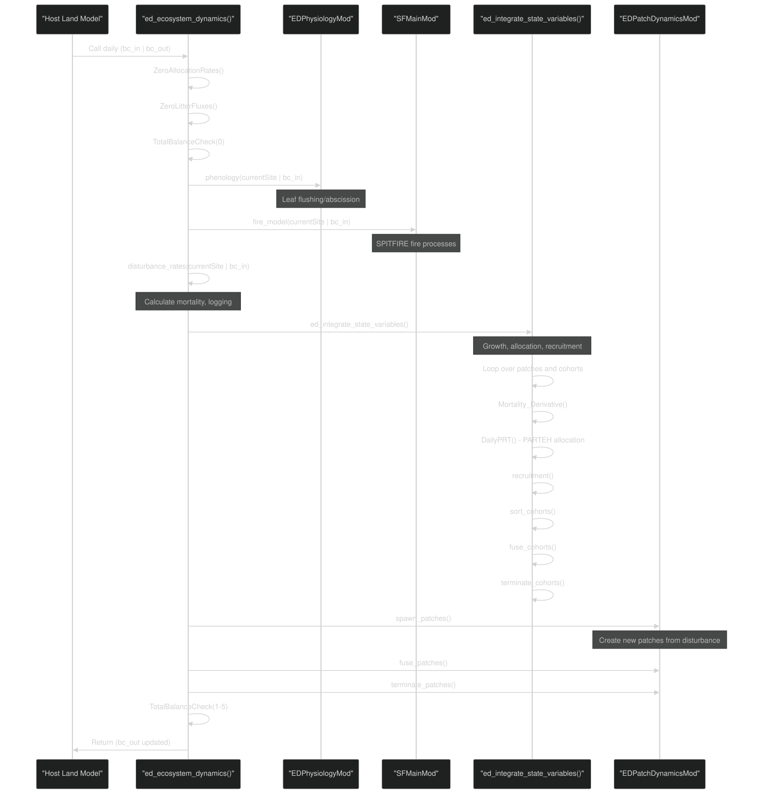

# FATES Model Overview

Relevant source files

- [biogeochem/EDCohortDynamicsMod.F90](https://github.com/jingtao-lbl/fates/blob/e85d9977/biogeochem/EDCohortDynamicsMod.F90)
- [biogeochem/EDLoggingMortalityMod.F90](https://github.com/jingtao-lbl/fates/blob/e85d9977/biogeochem/EDLoggingMortalityMod.F90)
- [biogeochem/EDMortalityFunctionsMod.F90](https://github.com/jingtao-lbl/fates/blob/e85d9977/biogeochem/EDMortalityFunctionsMod.F90)
- [biogeochem/EDPhysiologyMod.F90](https://github.com/jingtao-lbl/fates/blob/e85d9977/biogeochem/EDPhysiologyMod.F90)
- [biogeochem/FatesAllometryMod.F90](https://github.com/jingtao-lbl/fates/blob/e85d9977/biogeochem/FatesAllometryMod.F90)
- [main/EDMainMod.F90](https://github.com/jingtao-lbl/fates/blob/e85d9977/main/EDMainMod.F90)
- [main/FatesInterfaceMod.F90](https://github.com/jingtao-lbl/fates/blob/e85d9977/main/FatesInterfaceMod.F90)
- [main/FatesInterfaceTypesMod.F90](https://github.com/jingtao-lbl/fates/blob/e85d9977/main/FatesInterfaceTypesMod.F90)

## Purpose and Scope

This document provides an architectural overview of the Functionally Assembled Terrestrial Ecosystem Simulator (FATES) model. It introduces the model's core design principles, hierarchical data structures, execution flow, and major subsystems. This overview is intended for developers who need to understand how FATES components fit together before diving into specific modules.

For detailed information on specific subsystems, see:

- [Host Model Interface](getting-started/host_interface.md)Host model coupling:
- [Initialization Modes](getting-started/initialization.md)Initialization procedures:
- [Daily Dynamics Loop](core-dynamics/daily_loop.md)Daily dynamics execution:
- [Data Structures: Sites, Patches, and Cohorts](core-dynamics/data_structures.md)Data structures:
- [Plant Growth and Physiology](plant-physiology/index.md)Plant processes:
- [Canopy Structure and Competition](canopy-structure/index.md)Canopy structure:

## What is FATES?

FATES is a cohort-based vegetation demographic model that simulates ecosystem dynamics through the coupled processes of plant growth, mortality, recruitment, and disturbance. The model represents vegetation as a hierarchy of sites containing age-structured patches, each containing size-structured cohorts of plants. FATES is designed as a module that couples to host land models (HLMs) such as E3SM Land Model (ELM) or Community Land Model (CLM).

## Core Design Principles

### 1. Hierarchical Vegetation Structure

FATES organizes vegetation using a three-level hierarchy implemented through linked lists:

Sources:  [main/FatesInterfaceMod.F90 126-159](https://github.com/jingtao-lbl/fates/blob/e85d9977/main/FatesInterfaceMod.F90#L126-L159)  [biogeochem/EDCohortDynamicsMod.F90 30-34](https://github.com/jingtao-lbl/fates/blob/e85d9977/biogeochem/EDCohortDynamicsMod.F90#L30-L34)

### 2. Cohort Representation

Cohorts aggregate individual plants with similar characteristics (PFT, size, age, canopy position, damage class) to reduce computational cost while maintaining demographic detail. Each cohort tracks:

- `n`Number density ( )
- `dbh`Diameter at breast height ( )
- `height`Height ( )
- `pft`Plant functional type ( )
- `canopy_layer`Canopy layer ( )
- Biomass pools via PARTEH (Plant Allocation and Reactive Transport Extensible Hypotheses)

Sources:  [biogeochem/EDCohortDynamicsMod.F90 160-196](https://github.com/jingtao-lbl/fates/blob/e85d9977/biogeochem/EDCohortDynamicsMod.F90#L160-L196)

### 3. Perfect Plasticity Approximation (PPA)

FATES uses the PPA to efficiently simulate canopy structure and light competition. Cohorts are organized into discrete canopy layers, with upper canopy plants receiving full light and understory plants receiving reduced light. Layer assignment is based on cohort height and crown area.

Sources: See [Canopy Layering and Perfect Plasticity](canopy-structure/ppa.md)

### 4. Extensible Allocation Framework (PARTEH)

Plant carbon and nutrient allocation is handled through PARTEH, a polymorphic framework supporting multiple allocation hypotheses:

- `prt_carbon_allom_hyp`: Carbon-only allometric allocation
- `prt_cnp_flex_allom_hyp`: Flexible CNP allocation with dynamic stoichiometry

Sources:  [biogeochem/EDCohortDynamicsMod.F90 293-342](https://github.com/jingtao-lbl/fates/blob/e85d9977/biogeochem/EDCohortDynamicsMod.F90#L293-L342)  [main/FatesInterfaceMod.F90 87-98](https://github.com/jingtao-lbl/fates/blob/e85d9977/main/FatesInterfaceMod.F90#L87-L98)

## Model Architecture: Natural Language to Code Mapping

The following diagram maps conceptual model components to their primary code implementations:

Sources:  [main/FatesInterfaceMod.F90 1-223](https://github.com/jingtao-lbl/fates/blob/e85d9977/main/FatesInterfaceMod.F90#L1-L223)  [main/EDMainMod.F90 1-137](https://github.com/jingtao-lbl/fates/blob/e85d9977/main/EDMainMod.F90#L1-L137)

## Execution Flow: Daily Timestep

FATES is called once per day by the host land model. The `ed_ecosystem_dynamics()` routine orchestrates all daily processes in a specific sequence:

Sources:  [main/EDMainMod.F90 141-317](https://github.com/jingtao-lbl/fates/blob/e85d9977/main/EDMainMod.F90#L141-L317)  [main/EDMainMod.F90 320-409](https://github.com/jingtao-lbl/fates/blob/e85d9977/main/EDMainMod.F90#L320-L409)

### Detailed Integration Sequence

Within `ed_integrate_state_variables()` , the following operations occur for each cohort:

| Step | Operation | Module | Purpose | 
| --- | --- | --- | --- |
| 1 | Mortality_Derivative() | EDMortalityFunctionsMod | Calculate mortality rates (background, hydraulic, carbon starvation, etc.) | 
| 2 | LoggingMortality_frac() | EDLoggingMortalityMod | Calculate harvest mortality if logging event | 
| 3 | PRTMaintTurnover() | PRTLossFluxesMod | Maintenance turnover of tissues | 
| 4 | DailyPRT() (3 phases) | PARTEH modules | Carbon/nutrient allocation to growth | 
| 5 | UpdateSizeDepPlantHydProps() | FatesPlantHydraulicsMod | Update hydraulic properties (if enabled) | 
| 6 | Cohort management | EDCohortDynamicsMod | Sort, fuse, terminate cohorts | 

Sources:  [main/EDMainMod.F90 320-719](https://github.com/jingtao-lbl/fates/blob/e85d9977/main/EDMainMod.F90#L320-L719)

## Data Structure Details

### Site-Patch-Cohort Hierarchy

Key Implementation Details:

- 
Patches form a doubly-linked list ordered by age (youngest to oldest)

- `youngest_patch``oldest_patch``ed_site_type`and pointers in
- `younger``older`Each patch has and pointers

- 
Cohorts form a doubly-linked list ordered by height (tallest to shortest)

- `tallest``shortest``fates_patch_type`and pointers in
- `taller``shorter`Each cohort has and pointers

- 
PARTEH objects ( `prt` ) store all biomass pools (leaf, root, sapwood, structure, storage) and handle allocation

Sources:  [biogeochem/EDCohortDynamicsMod.F90 206-289](https://github.com/jingtao-lbl/fates/blob/e85d9977/biogeochem/EDCohortDynamicsMod.F90#L206-L289)  [biogeochem/EDCohortDynamicsMod.F90 293-342](https://github.com/jingtao-lbl/fates/blob/e85d9977/biogeochem/EDCohortDynamicsMod.F90#L293-L342)

## Key Process Modules

### 1. Phenology and Recruitment

Module: `EDPhysiologyMod.F90`

Key functions:

- `phenology()`[line 148]: Controls leaf flushing and abscission for deciduous PFTs
- `recruitment()`[line 152]: Creates new seedlings from germinated seeds
- `trim_canopy()`[line 147]: Optimizes leaf area based on carbon balance

Sources:  [biogeochem/EDPhysiologyMod.F90 1-200](https://github.com/jingtao-lbl/fates/blob/e85d9977/biogeochem/EDPhysiologyMod.F90#L1-L200)

### 2. Mortality

Module: `EDMortalityFunctionsMod.F90`

Calculates multiple mortality mechanisms:

- `bmort`Background mortality ( )
- `cmort`Carbon starvation mortality ( )
- `hmort`Hydraulic failure mortality ( )
- `frmort`Freezing mortality ( )
- `smort`Size-dependent senescence ( )
- `asmort`Age-dependent senescence ( )
- `dgmort`Damage-dependent mortality ( )

Combined via `Mortality_Derivative()` [line 234-323]

Sources:  [biogeochem/EDMortalityFunctionsMod.F90 51-230](https://github.com/jingtao-lbl/fates/blob/e85d9977/biogeochem/EDMortalityFunctionsMod.F90#L51-L230)

### 3. Allometry

Module: `FatesAllometryMod.F90`

Provides relationships between diameter and:

- `h_allom()`Height: [line 333]
- `blmax_allom()``bleaf()`Leaf biomass: , [lines 440, 110]
- `bsap_allom()`Sapwood biomass: [line 114]
- `bbgw_allom()`Coarse root biomass: [line 115]
- `bagw_allom()`Aboveground woody biomass: [line 108]
- `carea_allom()`Crown area: [line 118]

Sources:  [biogeochem/FatesAllometryMod.F90 1-144](https://github.com/jingtao-lbl/fates/blob/e85d9977/biogeochem/FatesAllometryMod.F90#L1-L144)

### 4. Cohort Dynamics

Module: `EDCohortDynamicsMod.F90`

Key operations:

- `create_cohort()`[line 160]: Initialize new cohort
- `terminate_cohorts()`[line 347]: Remove cohorts below thresholds
- `fuse_cohorts()`[line 134]: Merge similar cohorts to reduce computational cost
- `sort_cohorts()`[line 136]: Maintain height-ordered list

Sources:  [biogeochem/EDCohortDynamicsMod.F90 1-157](https://github.com/jingtao-lbl/fates/blob/e85d9977/biogeochem/EDCohortDynamicsMod.F90#L1-L157)

### 5. Logging and Harvest

Module: `EDLoggingMortalityMod.F90`

Implements anthropogenic disturbances:

- `LoggingMortality_frac()`
- Direct logging mortality (harvestable trees)
- Collateral damage mortality
- Infrastructure mortality (roads, skid trails)

[line 198]: Calculate harvest mortality fractions
- `get_harvest_rate_area()`[line 351]: Area-based harvest rates
- `get_harvest_rate_carbon()`: Carbon-based harvest rates

Sources:  [biogeochem/EDLoggingMortalityMod.F90 1-104](https://github.com/jingtao-lbl/fates/blob/e85d9977/biogeochem/EDLoggingMortalityMod.F90#L1-L104)

## Boundary Conditions: Host Model Interface

FATES exchanges information with the host land model through boundary condition structures:

### Inputs from HLM (bc_in_type)

| Category | Key Variables | Purpose | 
| --- | --- | --- |
| Radiation | solad_parb, solai_parb | Direct/diffuse PAR and NIR | 
| Hydrology | smp_sl, h2o_liqvol_sl, watsat_sl | Soil moisture state | 
| Meteorology | tempk_sl, t_veg_pa | Temperature drivers | 
| Fire | lightning24, pop_density | Ignition sources | 
| BGC | plant_nh4_uptake_flux, plant_no3_uptake_flux | Nutrient uptake (CNP mode) | 
| Land Use | hlm_harvest_rates, hlm_harvest_catnames | Harvest prescriptions | 

### Outputs to HLM (bc_out_type)

| Category | Key Variables | Purpose | 
| --- | --- | --- |
| Radiation | albd_parb, albi_parb, fsun_pa | Albedo, sunlit fraction | 
| Hydrology | rootr_pasl, btran_pa | Root uptake profile, transpiration stress | 
| Structure | elai_pa, htop_pa, z0m_pa | LAI, canopy height, roughness | 
| BGC Fluxes | litt_flux_cel_c_si, litt_flux_lig_c_si | Litter fragmentation to soil | 
| Nutrient Fluxes | source_nh4, source_p | Nutrient mineralization (CNP mode) | 

Sources:  [main/FatesInterfaceTypesMod.F90 412-704](https://github.com/jingtao-lbl/fates/blob/e85d9977/main/FatesInterfaceTypesMod.F90#L412-L704)

## Mass Balance and Diagnostics

FATES performs rigorous mass balance checking at multiple points during the daily timestep:

- `TotalBalanceCheck(0)`: Initial state before dynamics
- `TotalBalanceCheck(1)`: After recruitment
- `TotalBalanceCheck(2)`: After cohort dynamics
- `TotalBalanceCheck(3)`: After patch spawning
- `TotalBalanceCheck(4)`: After patch fusion
- `TotalBalanceCheck(5)`: Final check

The function `SiteMassStock()` calculates total carbon (or nutrient) across all live vegetation, litter, and seed pools to verify conservation.

Sources:  [main/EDMainMod.F90 196-315](https://github.com/jingtao-lbl/fates/blob/e85d9977/main/EDMainMod.F90#L196-L315)

## Parameter System

FATES uses a netCDF parameter file ( `fates_params.nc` ) generated from CDL format. Parameters include:

- PFT-specific traits (e.g., wood density, leaf lifespan, allometric coefficients)
- Global parameters (e.g., mortality scalars, fire parameters)
- Mode switches (e.g., allometry function choices)

Parameter loading occurs via:

Sources:  [main/FatesInterfaceMod.F90 67-72](https://github.com/jingtao-lbl/fates/blob/e85d9977/main/FatesInterfaceMod.F90#L67-L72)

## Operational Modes

FATES supports several operational modes controlled by namelist flags:

| Mode | Flag | Description | 
| --- | --- | --- |
| Standard | Default | Full demographic dynamics | 
| Satellite Phenology | hlm_use_sp | Prescribed LAI from observations | 
| No Competition | hlm_use_nocomp | Single-cohort per PFT, no vertical structure | 
| Fixed Biogeography | hlm_use_fixed_biogeog | Fixed PFT distribution | 
| Static Stand Structure | hlm_use_ed_st3 | No growth, recruitment, or mortality | 

Sources:  [main/FatesInterfaceTypesMod.F90 188-195](https://github.com/jingtao-lbl/fates/blob/e85d9977/main/FatesInterfaceTypesMod.F90#L188-L195)

## Summary

FATES implements ecosystem demography through:

The model's modular design allows components to be extended or replaced while maintaining system integrity. For detailed information on specific subsystems, refer to the linked wiki pages at the beginning of this document.