# Allometric Relationships

Relevant source files

- [biogeochem/EDCohortDynamicsMod.F90](https://github.com/jingtao-lbl/fates/blob/e85d9977/biogeochem/EDCohortDynamicsMod.F90)
- [biogeochem/EDPhysiologyMod.F90](https://github.com/jingtao-lbl/fates/blob/e85d9977/biogeochem/EDPhysiologyMod.F90)
- [biogeochem/FatesAllometryMod.F90](https://github.com/jingtao-lbl/fates/blob/e85d9977/biogeochem/FatesAllometryMod.F90)
- [biogeochem/FatesSoilBGCFluxMod.F90](https://github.com/jingtao-lbl/fates/blob/e85d9977/biogeochem/FatesSoilBGCFluxMod.F90)
- [parteh/PRTAllometricCNPMod.F90](https://github.com/jingtao-lbl/fates/blob/e85d9977/parteh/PRTAllometricCNPMod.F90)
- [parteh/PRTAllometricCarbonMod.F90](https://github.com/jingtao-lbl/fates/blob/e85d9977/parteh/PRTAllometricCarbonMod.F90)
- [parteh/PRTGenericMod.F90](https://github.com/jingtao-lbl/fates/blob/e85d9977/parteh/PRTGenericMod.F90)
- [parteh/PRTLossFluxesMod.F90](https://github.com/jingtao-lbl/fates/blob/e85d9977/parteh/PRTLossFluxesMod.F90)

## Purpose and Scope

This page documents the allometric relationships in FATES that define the mathematical relationships between plant diameter, height, and biomass pools. Allometry provides the fundamental scaling rules that constrain plant growth and determine how carbon is distributed across organs (leaves, fine roots, sapwood, structure, storage, reproduction).

These relationships are implemented in [biogeochem/FatesAllometryMod.F90](https://github.com/jingtao-lbl/fates/blob/e85d9977/biogeochem/FatesAllometryMod.F90) and are used throughout the model to:

- Calculate target biomass pools for each organ based on diameter
- Compute derivatives needed for growth integration
- Enforce structural constraints on plant growth
- Initialize cohorts with consistent size-biomass relationships

For information about how these allometric targets are used during daily carbon allocation, see [PARTEH: Plant Allocation System](plant-physiology/parteh/index.md) . For details on mortality processes that depend on allometric ratios, see [Mortality Processes](plant-physiology/mortality.md) .

## Overview of Allometric System

FATES uses diameter at breast height (DBH) as the primary integrator variable for woody plant size. All other structural properties are diagnosed from DBH through allometric functions. For non-woody plants, different scaling relationships may apply.

### Diagram: DBH as Central Integrator

Sources: [biogeochem/FatesAllometryMod.F90 1-144](https://github.com/jingtao-lbl/fates/blob/e85d9977/biogeochem/FatesAllometryMod.F90#L1-L144)

## Core Allometric Relationships

### Height-Diameter Allometry

Height is diagnosed from diameter using functions controlled by the `allom_hmode` parameter. Each PFT can use different height allometry functions.

Available Height Functions ( `allom_hmode` ):

| Mode | Name | Function Form | Parameters | 
| --- | --- | --- | --- |
| 1 | O'Brien et al. 1995 | $h = p_1 \cdot (1 - e^{p_2 \cdot d})$ | allom_d2h1, allom_d2h2 | 
| 2 | Poorter 2006 | $h = p_1 \cdot (1 - e^{p_2 \cdot d^{p_3}})$ | allom_d2h1, allom_d2h2, allom_d2h3 | 
| 3 | 2-parameter power | $h = p_1 \cdot d^{p_2}$ | allom_d2h1, allom_d2h2 | 
| 4 | Chave 2014 | $\ln(h) = p_1 + p_2 \cdot \ln(d) + p_3 \cdot \ln(d)^2$ | allom_d2h1, allom_d2h2, allom_d2h3 | 
| 5 | Martinez-Cano | Height-capped variant | allom_d2h1, allom_d2h2, allom_d2h3 | 

Height Capping : Many allometries enforce a maximum height ( `allom_dbh_maxheight` ) beyond which height plateaus even as diameter continues to grow.

Inverse Calculation : The function `h2d_allom()` provides the inverse relationship, calculating DBH from height. This is used during initialization and when forcing DBH to match structural constraints.

Sources: [biogeochem/FatesAllometryMod.F90 296-366](https://github.com/jingtao-lbl/fates/blob/e85d9977/biogeochem/FatesAllometryMod.F90#L296-L366)

### Leaf Biomass Allometry

Leaf biomass allometry calculates the maximum potential leaf biomass for a given diameter. Actual leaf biomass is then adjusted for canopy trimming, crown damage, and phenological status.

Maximum Leaf Biomass ( `blmax_allom` ):

| Mode (allom_lmode) | Function | Parameters | 
| --- | --- | --- |
| 1 | Saldarriaga | Complex function of diameter, height, wood density | 
| 2 | 2-parameter power | $bl_{max} = p_1 \cdot d^{p_2} / c2b$ | 
| 3 | Height-diameter 2-parameter power | $bl_{max} = p_1 \cdot d^{p_2} \cdot h^{p_2}$ | 

Actual Leaf Biomass ( `bleaf` ):

Where:

- `canopy_trim`: Fraction of maximum LAI maintained (0-1), determined by carbon balance
- `crown_reduction`: Biomass loss due to crown damage class
- `elongf_leaf`: Leaf elongation factor for phenology (0-1)

Sources: [biogeochem/FatesAllometryMod.F90 440-470](https://github.com/jingtao-lbl/fates/blob/e85d9977/biogeochem/FatesAllometryMod.F90#L440-L470)  [biogeochem/FatesAllometryMod.F90 554-628](https://github.com/jingtao-lbl/fates/blob/e85d9977/biogeochem/FatesAllometryMod.F90#L554-L628)

### Fine Root Biomass Allometry

Fine root biomass is calculated from leaf biomass using a leaf-to-fine-root ratio ( `l2fr` ). The ratio can be static or dynamic.

Function ( `bfineroot` ):

Allometry Mode ( `allom_fmode` ):

| Mode | Description | L2FR Source | 
| --- | --- | --- |
| 1 | Dynamic with allometry | Uses canopy_trim to scale target fine root biomass | 
| 2 | Fixed ratio | Uses fixed PFT parameter allom_l2fr | 

For CNP allocation (see [CNP Allocation and Nutrient Dynamics](plant-physiology/parteh/cnp_allocation.md) ), `l2fr` is dynamically adjusted by a PID controller to balance nutrient uptake with demand. The minimum L2FR is constrained by `l2fr_min` (0.01) to prevent numerical issues.

Sources: [biogeochem/FatesAllometryMod.F90 630-697](https://github.com/jingtao-lbl/fates/blob/e85d9977/biogeochem/FatesAllometryMod.F90#L630-L697)

### Woody Biomass Allometry

Woody biomass is partitioned into above-ground (AGBW), below-ground (BGBW), sapwood, and structural components.
Above-Ground Woody Biomass (`bagw_allom`)
| Mode (allom_amode) | Function | Parameters | 
| --- | --- | --- |
| 1 | Saldarriaga | Function of diameter, height, wood density | 
| 2 | 2-parameter power | $agbw = p_1 \cdot d^{p_2} / c2b$ | 
| 3 | Chave 2014 | $agbw = 10^{(p_1 + p_2 \cdot \ln(\rho \cdot d^2 \cdot h))} / c2b$ | 

Crown Damage and Phenology Adjustments :

Where `branch_frac` is the fraction of AGBW allocated to branches (vs. bole).

Sources: [biogeochem/FatesAllometryMod.F90 372-434](https://github.com/jingtao-lbl/fates/blob/e85d9977/biogeochem/FatesAllometryMod.F90#L372-L434)
Below-Ground Woody Biomass (`bbgw_allom`)
Where `allom_agb_frac` is the fraction of total woody biomass above ground (typically 0.6-0.8).

Sources: [biogeochem/FatesAllometryMod.F90 699-747](https://github.com/jingtao-lbl/fates/blob/e85d9977/biogeochem/FatesAllometryMod.F90#L699-L747)
Sapwood Biomass (`bsap_allom`)
Sapwood biomass is calculated from sapwood area, which is determined by leaf biomass and the leaf area per sapwood area ratio:

Parameters:

- `allom_la_per_sa_int`: Leaf area per sapwood area, intercept (m²/cm²)
- `allom_la_per_sa_slp`: Leaf area per sapwood area, slope (m²/cm²/cm)

Sources: [biogeochem/FatesAllometryMod.F90 749-825](https://github.com/jingtao-lbl/fates/blob/e85d9977/biogeochem/FatesAllometryMod.F90#L749-L825)
Structural (Dead) Biomass (`bdead_allom`)
Structural biomass represents the metabolically inactive structural tissues (heartwood, bark):

This pool does not respire and is not subject to turnover in living plants.

Sources: [biogeochem/FatesAllometryMod.F90 827-863](https://github.com/jingtao-lbl/fates/blob/e85d9977/biogeochem/FatesAllometryMod.F90#L827-L863)

### Crown Area Allometry

Crown area determines the horizontal space occupied by a cohort and is critical for canopy structure calculations (see [Canopy Layering and Perfect Plasticity](canopy-structure/ppa.md) ).

Function ( `carea_allom` ):

With capping at maximum height:

Parameters:

- `site_spread`: Site-level crowding factor (typically 0.0-1.0)
- `d2ca_min`: Minimum crown area coefficient
- `d2ca_max`: Maximum crown area coefficient (when capped)
- `d2bl_ediff`: Difference between leaf and crown area scaling exponents
- `d2bl_p2`: Leaf biomass scaling exponent

Crown Damage : Crown area is reduced for damaged cohorts:

Inverse Calculation : Crown area can be inverted to calculate DBH in special cases (e.g., SP mode initialization):

Sources: [biogeochem/FatesAllometryMod.F90 476-550](https://github.com/jingtao-lbl/fates/blob/e85d9977/biogeochem/FatesAllometryMod.F90#L476-L550)

### Storage Carbon Target

Storage carbon represents labile reserves used for maintenance, stress response, and phenological flushing.

Function ( `bstore_allom` ):

The storage fraction is PFT-dependent and represents the ratio of storage to leaf biomass at allometric target.

For CNP allocation, storage targets also include nutrient pools sized according to stoichiometric ratios (see [CNP Allocation and Nutrient Dynamics](plant-physiology/parteh/cnp_allocation.md) ).

Sources: [biogeochem/FatesAllometryMod.F90 1114-1184](https://github.com/jingtao-lbl/fates/blob/e85d9977/biogeochem/FatesAllometryMod.F90#L1114-L1184)

## Diagram: Biomass Pool Relationships

Sources: [biogeochem/FatesAllometryMod.F90 1-144](https://github.com/jingtao-lbl/fates/blob/e85d9977/biogeochem/FatesAllometryMod.F90#L1-L144)

## LAI and SAI Calculation

Leaf Area Index (LAI) and Stem Area Index (SAI) are derived from biomass using specific leaf area (SLA).

### Tree-Level LAI (tree_lai)

Where:

- `SLA`: Specific leaf area, which varies with canopy depth due to nitrogen profile
- `c_area`: Crown area of the cohort
- `leaf_c`: Actual leaf carbon per plant

Nitrogen Scaling : SLA increases with depth in the canopy according to:

Where `kn` is the nitrogen decay coefficient (see `decay_coeff_kn` ).

Sources: [biogeochem/FatesAllometryMod.F90 1260-1384](https://github.com/jingtao-lbl/fates/blob/e85d9977/biogeochem/FatesAllometryMod.F90#L1260-L1384)

### Tree-Level SAI (tree_sai)

Stem Area Index represents the occluding area of woody stems and branches:

Where `fp_treeweight` is a PFT-specific parameter ( `fates_phen_stem_drop_fraction` ) controlling the seasonality of SAI for phenology.

Sources: [biogeochem/FatesAllometryMod.F90 1386-1511](https://github.com/jingtao-lbl/fates/blob/e85d9977/biogeochem/FatesAllometryMod.F90#L1386-L1511)

## Integration with PARTEH Growth

Allometric functions provide target biomass values that constrain growth in PARTEH allocation. The integration process differs between carbon-only and CNP hypotheses.

### Diagram: Allometry-PARTEH Integration

Sources: [parteh/PRTAllometricCarbonMod.F90 260-702](https://github.com/jingtao-lbl/fates/blob/e85d9977/parteh/PRTAllometricCarbonMod.F90#L260-L702)  [parteh/PRTAllometricCNPMod.F90 370-436](https://github.com/jingtao-lbl/fates/blob/e85d9977/parteh/PRTAllometricCNPMod.F90#L370-L436)

### Growth Integration Details

Carbon-Only Allocation (Hypothesis 1):

Sources: [parteh/PRTAllometricCarbonMod.F90 260-702](https://github.com/jingtao-lbl/fates/blob/e85d9977/parteh/PRTAllometricCarbonMod.F90#L260-L702)

CNP Allocation (Hypothesis 2):

Sources: [parteh/PRTAllometricCNPMod.F90 370-436](https://github.com/jingtao-lbl/fates/blob/e85d9977/parteh/PRTAllometricCNPMod.F90#L370-L436)  [parteh/PRTAllometricCNPMod.F90 1182-1541](https://github.com/jingtao-lbl/fates/blob/e85d9977/parteh/PRTAllometricCNPMod.F90#L1182-L1541)

### Allometry Check Function

The function `CheckIntegratedAllometries()` verifies that integrated biomass pools match diagnosed allometric targets within error tolerance:

This prevents accumulation of numerical errors over long simulations.

Sources: [biogeochem/FatesAllometryMod.F90 163-288](https://github.com/jingtao-lbl/fates/blob/e85d9977/biogeochem/FatesAllometryMod.F90#L163-L288)

## Derivatives for Growth Calculations

Most allometric functions return optional derivative arguments ( `dXdd` = derivative with respect to diameter). These derivatives are used in numerical integration schemes.

Example : Height derivative

Usage in Integration :

Available Derivatives :

| Function | Derivative Output | Units | 
| --- | --- | --- |
| h_allom | dhdd | m/cm | 
| blmax_allom | dblmaxdd | kgC/cm | 
| bagw_allom | dbagwdd | kgC/cm | 
| bbgw_allom | dbbgwdd | kgC/cm | 
| bsap_allom | dbsapdd | kgC/cm | 

Sources: [biogeochem/FatesAllometryMod.F90 296-366](https://github.com/jingtao-lbl/fates/blob/e85d9977/biogeochem/FatesAllometryMod.F90#L296-L366)  [biogeochem/FatesAllometryMod.F90 440-470](https://github.com/jingtao-lbl/fates/blob/e85d9977/biogeochem/FatesAllometryMod.F90#L440-L470)

## Diameter Adjustment Functions

In some cases, diameter must be forced to match other constraints rather than being freely grown.

### ForceDBH

The `ForceDBH()` subroutine recalculates DBH to match a target pool size when pools have been externally modified (e.g., cohort fusion, damage recovery):

This uses iterative root-finding (bisection method) to solve:

Sources: [biogeochem/FatesAllometryMod.F90 1186-1258](https://github.com/jingtao-lbl/fates/blob/e85d9977/biogeochem/FatesAllometryMod.F90#L1186-L1258)

## Root Vertical Distribution

While not strictly allometry, the vertical distribution of fine roots is calculated as part of resource acquisition:

The distribution follows a beta function controlled by PFT parameters `fates_root_radius` and `fates_root_depth` , constrained by soil depth and rooting depth limitations.

Sources: [biogeochem/FatesAllometryMod.F90 1513-1668](https://github.com/jingtao-lbl/fates/blob/e85d9977/biogeochem/FatesAllometryMod.F90#L1513-L1668)

## Parameter Summary

### Key Allometry Parameters (per PFT)

| Parameter Group | Key Parameters | Purpose | 
| --- | --- | --- |
| Height | allom_hmode, allom_d2h1, allom_d2h2, allom_d2h3, allom_dbh_maxheight | Control height-diameter relationship | 
| Leaf | allom_lmode, allom_d2bl1, allom_d2bl2, allom_d2bl3, slatop, slamax | Control leaf biomass and area | 
| Fine Root | allom_fmode, allom_l2fr | Control fine root biomass | 
| Woody Biomass | allom_amode, allom_agb1-4, allom_cmode, wood_density, allom_agb_frac | Control woody tissue biomass | 
| Sapwood | allom_smode, allom_la_per_sa_int, allom_la_per_sa_slp | Control sapwood area and biomass | 
| Crown | allom_d2ca_coefficient_min, allom_d2ca_coefficient_max, allom_blca_expnt_diff | Control crown area | 
| Storage | Storage fraction parameters | Control storage pool size | 
| Units | c2b, wood_density | Conversion factors | 

All parameters are loaded from the parameter file via [FatesParametersInterface](getting-started/parameter_system.md) and accessed through `prt_params` module.

Sources: [biogeochem/FatesAllometryMod.F90 43-62](https://github.com/jingtao-lbl/fates/blob/e85d9977/biogeochem/FatesAllometryMod.F90#L43-L62)

## Code Structure and Entry Points

### Main Module File

- **[biogeochem/FatesAllometryMod.F90](https://github.com/jingtao-lbl/fates/blob/e85d9977/biogeochem/FatesAllometryMod.F90)**
- Lines 1-144: Module header, imports, parameter documentation
- `h_allom``h2d_allom`Lines 296-366: Height allometry ( , )
- `bagw_allom`Lines 372-434: Above-ground woody biomass ( )
- `blmax_allom`Lines 440-470: Maximum leaf biomass ( )
- `bleaf`Lines 554-628: Actual leaf biomass ( )
- `bfineroot`Lines 630-697: Fine root biomass ( )
- `bsap_allom`Lines 749-825: Sapwood biomass ( )
- `bbgw_allom`Lines 699-747: Below-ground woody biomass ( )
- `bdead_allom`Lines 827-863: Structural biomass ( )
- `carea_allom`Lines 476-550: Crown area ( )
- `bstore_allom`Lines 1114-1184: Storage target ( )
- `tree_lai`Lines 1260-1384: Tree LAI ( )
- `tree_sai`Lines 1386-1511: Tree SAI ( )
- `CheckIntegratedAllometries`Lines 163-288: Allometry checking ( )
- `ForceDBH`Lines 1186-1258: DBH forcing ( )

### Integration Points

PARTEH Carbon-Only :

- [parteh/PRTAllometricCarbonMod.F90260-702](https://github.com/jingtao-lbl/fates/blob/e85d9977/parteh/PRTAllometricCarbonMod.F90#L260-L702): Main allocation routine using allometry

PARTEH CNP :

- [parteh/PRTAllometricCNPMod.F90370-436](https://github.com/jingtao-lbl/fates/blob/e85d9977/parteh/PRTAllometricCNPMod.F90#L370-L436): Main allocation routine
- [parteh/PRTAllometricCNPMod.F901182-1541](https://github.com/jingtao-lbl/fates/blob/e85d9977/parteh/PRTAllometricCNPMod.F90#L1182-L1541): Stature growth integration

Cohort Dynamics :

- [biogeochem/EDCohortDynamicsMod.F90160-289](https://github.com/jingtao-lbl/fates/blob/e85d9977/biogeochem/EDCohortDynamicsMod.F90#L160-L289): Cohort creation using allometry
- [biogeochem/EDCohortDynamicsMod.F90694-1059](https://github.com/jingtao-lbl/fates/blob/e85d9977/biogeochem/EDCohortDynamicsMod.F90#L694-L1059): Cohort fusion updating allometry

Physiology :

- [biogeochem/EDPhysiologyMod.F90597-1149](https://github.com/jingtao-lbl/fates/blob/e85d9977/biogeochem/EDPhysiologyMod.F90#L597-L1149): Canopy trimming using allometry
- [biogeochem/EDPhysiologyMod.F901489-1936](https://github.com/jingtao-lbl/fates/blob/e85d9977/biogeochem/EDPhysiologyMod.F90#L1489-L1936): Recruitment using allometry

Sources: [biogeochem/FatesAllometryMod.F90 1-144](https://github.com/jingtao-lbl/fates/blob/e85d9977/biogeochem/FatesAllometryMod.F90#L1-L144)  [biogeochem/EDPhysiologyMod.F90 1-200](https://github.com/jingtao-lbl/fates/blob/e85d9977/biogeochem/EDPhysiologyMod.F90#L1-L200)  [biogeochem/EDCohortDynamicsMod.F90 1-200](https://github.com/jingtao-lbl/fates/blob/e85d9977/biogeochem/EDCohortDynamicsMod.F90#L1-L200)  [parteh/PRTAllometricCarbonMod.F90 1-200](https://github.com/jingtao-lbl/fates/blob/e85d9977/parteh/PRTAllometricCarbonMod.F90#L1-L200)  [parteh/PRTAllometricCNPMod.F90 1-200](https://github.com/jingtao-lbl/fates/blob/e85d9977/parteh/PRTAllometricCNPMod.F90#L1-L200)