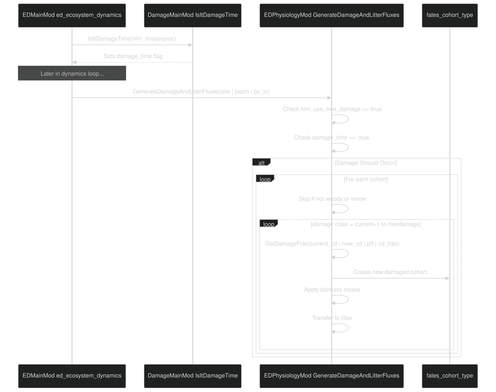

# Crown Damage and Recovery

Relevant source files

- [biogeochem/EDCohortDynamicsMod.F90](https://github.com/jingtao-lbl/fates/blob/e85d9977/biogeochem/EDCohortDynamicsMod.F90)
- [biogeochem/EDLoggingMortalityMod.F90](https://github.com/jingtao-lbl/fates/blob/e85d9977/biogeochem/EDLoggingMortalityMod.F90)
- [biogeochem/EDMortalityFunctionsMod.F90](https://github.com/jingtao-lbl/fates/blob/e85d9977/biogeochem/EDMortalityFunctionsMod.F90)
- [biogeochem/EDPhysiologyMod.F90](https://github.com/jingtao-lbl/fates/blob/e85d9977/biogeochem/EDPhysiologyMod.F90)
- [biogeochem/FatesAllometryMod.F90](https://github.com/jingtao-lbl/fates/blob/e85d9977/biogeochem/FatesAllometryMod.F90)
- [main/EDMainMod.F90](https://github.com/jingtao-lbl/fates/blob/e85d9977/main/EDMainMod.F90)

## Purpose and Scope

This page documents the crown damage and recovery system in FATES, which simulates the effects of partial crown loss on tree cohorts and their subsequent recovery. Crown damage represents physical injury to the canopy structure (e.g., from storms, impacts, herbivory) that reduces leaf area, branch biomass, and physiological function without killing the tree outright. This system tracks damage severity through discrete damage classes, applies biomass losses and functional impairments, and models gradual recovery through cohort splitting.

For information about mortality processes that may result from damage, see [Mortality Processes](plant-physiology/mortality.md) . For allometric relationships affected by damage, see [Allometric Relationships](plant-physiology/allometry.md) . For fire-related crown damage, see [Fire Effects on Vegetation](fire/effects.md) .

## System Overview

The crown damage system is controlled by the `hlm_use_tree_damage` flag and consists of three main components:

### Crown Damage State Variables

| Variable | Location | Description | 
| --- | --- | --- |
| crowndamage | fates_cohort_type | Damage class index [1: undamaged, >1: damaged] | 
| nlevdamage | FatesInterfaceTypesMod | Total number of damage classes in the model | 
| hlm_use_tree_damage | FatesInterfaceTypesMod | Switch to enable/disable damage system | 
| damage_time | DamageMainMod | Logical flag indicating if damage should occur on current timestep | 

Sources:  [biogeochem/EDPhysiologyMod.F90 16-23](https://github.com/jingtao-lbl/fates/blob/e85d9977/biogeochem/EDPhysiologyMod.F90#L16-L23)  [main/FatesCohortMod.F90](https://github.com/jingtao-lbl/fates/blob/e85d9977/main/FatesCohortMod.F90)

## Crown Damage Classification System

The damage system uses discrete damage classes to represent severity of crown injury. Each class has associated reductions in crown area, leaf biomass, and branch biomass.

### Damage Class Structure

Diagram: Damage Class Transitions and Crown Reduction Relationship

The `GetCrownReduction` function (defined in `DamageMainMod` ) maps damage class differences to fractional crown loss:

- Class 1 (undamaged): No crown reduction
- Higher classes: Increasing crown reduction fraction
- Crown reduction affects leaf and branch biomass calculations

Sources:  [biogeochem/EDPhysiologyMod.F90 136-138](https://github.com/jingtao-lbl/fates/blob/e85d9977/biogeochem/EDPhysiologyMod.F90#L136-L138)  [biogeochem/FatesAllometryMod.F90 101](https://github.com/jingtao-lbl/fates/blob/e85d9977/biogeochem/FatesAllometryMod.F90#L101-L101)

## Damage Event Timing and Triggering

Damage events are controlled globally through the `IsItDamageTime` function, which determines whether the current timestep should apply damage.

Diagram: Damage Event Sequence During Dynamics Timestep

Sources:  [main/EDMainMod.F90 179-180](https://github.com/jingtao-lbl/fates/blob/e85d9977/main/EDMainMod.F90#L179-L180)  [biogeochem/EDPhysiologyMod.F90 256-424](https://github.com/jingtao-lbl/fates/blob/e85d9977/biogeochem/EDPhysiologyMod.F90#L256-L424)

## Damage Generation and Biomass Losses

When a damage event occurs, the `GenerateDamageAndLitterFluxes` subroutine creates new damaged cohorts and transfers biomass to litter pools.

### Damage Generation Algorithm

Diagram: GenerateDamageAndLitterFluxes Flowchart

### Biomass Loss Calculations

Damage affects different plant organs differently based on whether they are above-ground and whether they are in the crown:

| Organ | Crown Loss Applied | Branch Loss Applied | Formula | 
| --- | --- | --- | --- |
| Leaf | Yes | No | leaf_loss = leaf_mass * crown_loss_frac | 
| Reproductive | Yes | No | repro_loss = repro_mass * crown_loss_frac | 
| Sapwood | No | Yes | sapw_loss = sapw_mass * branch_loss_frac | 
| Storage | No | Yes | store_loss = store_mass * branch_loss_frac | 
| Structural | No | Yes | struct_loss = struct_mass * branch_loss_frac | 
| Fine Roots | No | No | No damage applied | 

Where:

- `crown_loss_frac``GetCrownReduction`= fraction of crown lost (from )
- `branch_loss_frac``crown_loss_frac * branch_frac * agb_frac`=
- `branch_frac``param_derived%branch_frac`= fraction of above-ground woody biomass in branches ( )
- `agb_frac``prt_params%allom_agb_frac`= fraction of stem above ground ( )

Sources:  [biogeochem/EDPhysiologyMod.F90 340-396](https://github.com/jingtao-lbl/fates/blob/e85d9977/biogeochem/EDPhysiologyMod.F90#L340-L396)

### Litter Transfer

Damaged biomass is transferred to litter pools:

Diagram: Biomass Transfer from Damage to Litter Pools

The transfer uses:

- `GetDecompyFrac(pft, organ, dcmpy)`- determines decomposability partitioning for fine litter
- `adjust_SF_CWD_frac(dbh, ncwd, SF_val_CWD_frac, SF_val_CWD_frac_adj)`- adjusts CWD size class partitioning based on cohort diameter

Sources:  [biogeochem/EDPhysiologyMod.F90 364-386](https://github.com/jingtao-lbl/fates/blob/e85d9977/biogeochem/EDPhysiologyMod.F90#L364-L386)

## Effects of Crown Damage on Allometry and Function

Crown damage modifies several allometric relationships and functional properties of cohorts.

### Affected Allometric Functions

Diagram: Crown Damage Effects on Allometric Calculations

### Specific Allometric Modifications

Leaf Biomass (`bleaf`):

Above-Ground Woody Biomass (`bagw_allom`):

Crown Area (`carea_allom`):

Sources:  [biogeochem/FatesAllometryMod.F90 372-610](https://github.com/jingtao-lbl/fates/blob/e85d9977/biogeochem/FatesAllometryMod.F90#L372-L610)

## Damage Recovery Mechanism

Recovery occurs during the state variable integration phase and involves creating new cohorts in lower damage classes.

### Recovery Process Flow

Diagram: Damage Recovery Process During State Integration

### Key Recovery Characteristics

### Recovery Bypass Logic

When a cohort has just been created through recovery ( `newly_recovered = .true.` ), certain calculations are bypassed:

| Operation | Bypassed? | Reason | 
| --- | --- | --- |
| Mortality calculation | Yes | Inherited from donor cohort | 
| NPP/GPP/Resp accumulation | Yes | Inherited from donor cohort | 
| Maintenance turnover | Yes | Inherited from donor cohort | 
| PARTEH phase 1 | Yes | Allocation priorities already set | 
| PARTEH phase 2 | No | New targets require reallocation | 
| PARTEH phase 3 | No | Stature growth can proceed | 

Sources:  [main/EDMainMod.F90 456-599](https://github.com/jingtao-lbl/fates/blob/e85d9977/main/EDMainMod.F90#L456-L599)  [biogeochem/EDCohortDynamicsMod.F90 141](https://github.com/jingtao-lbl/fates/blob/e85d9977/biogeochem/EDCohortDynamicsMod.F90#L141-L141)

## Damage-Dependent Mortality

Crown damage increases mortality rates through the `dgmort` term.

### Mortality Rate Calculation

Diagram: Damage Mortality Integration into Total Mortality

The damage mortality rate is calculated in `mortality_rates` :

For understory cohorts, damage mortality directly reduces number density:

For canopy cohorts, damage mortality contributes to disturbance-generating mortality (handled separately in patch dynamics).

Sources:  [biogeochem/EDMortalityFunctionsMod.F90 127-314](https://github.com/jingtao-lbl/fates/blob/e85d9977/biogeochem/EDMortalityFunctionsMod.F90#L127-L314)

## Integration with Other Systems

### Interaction with Fire

Fire can cause crown damage through crown scorching. See [Fire Effects on Vegetation](fire/effects.md) for details on how fire intensity translates to damage class transitions.

### Interaction with Logging

Logging operations can generate collateral crown damage to neighboring trees. The `lmort_collateral` rate in logging mortality represents partial damage rather than complete mortality.

### Interaction with Patch Dynamics

When damaged trees in the canopy die, their mortality contributes to disturbance rates and patch creation, similar to undamaged trees. The damage state is preserved when cohorts are transferred to new patches.

### Interaction with PARTEH Allocation

Crown damage modifies allocation targets through:

- `bleaf`Reduced leaf biomass targets (via with damage reduction)
- `bsap_allom`Reduced sapwood biomass targets (via with branch loss)
- `bstore_allom`Reduced storage targets (via with canopy trim)

The PARTEH system responds to these modified targets during daily allocation, potentially reallocating resources to repair damage over time.

Sources:  [biogeochem/EDPhysiologyMod.F90 256-424](https://github.com/jingtao-lbl/fates/blob/e85d9977/biogeochem/EDPhysiologyMod.F90#L256-L424)  [main/EDMainMod.F90 587-599](https://github.com/jingtao-lbl/fates/blob/e85d9977/main/EDMainMod.F90#L587-L599)  [biogeochem/FatesAllometryMod.F90 372-610](https://github.com/jingtao-lbl/fates/blob/e85d9977/biogeochem/FatesAllometryMod.F90#L372-L610)

## Code Entity Reference

### Key Functions and Subroutines

| Function | Location | Purpose | 
| --- | --- | --- |
| GenerateDamageAndLitterFluxes | biogeochem/EDPhysiologyMod.F90256-424 | Creates damaged cohorts and transfers biomass to litter | 
| DamageRecovery | biogeochem/EDCohortDynamicsMod.F90141 | Creates recovered cohorts in lower damage classes | 
| GetDamageFrac | DamageMainMod | Returns fraction of cohort transitioning to new damage class | 
| GetCrownReduction | DamageMainMod | Returns crown loss fraction for damage class difference | 
| GetDamageMortality | DamageMainMod | Returns mortality rate for given damage class and PFT | 
| IsItDamageTime | DamageMainMod | Determines if damage should occur on current timestep | 
| PRTDamageLosses | PRTLossFluxesMod | Applies damage losses to PARTEH organ pools | 
| bleaf | biogeochem/FatesAllometryMod.F90554-610 | Calculates leaf biomass with damage reduction | 
| bagw_allom | biogeochem/FatesAllometryMod.F90372-434 | Calculates above-ground woody biomass with damage | 
| carea_allom | biogeochem/FatesAllometryMod.F90476-550 | Calculates crown area with damage effects | 

### Key Data Structures

| Variable | Type | Location | Description | 
| --- | --- | --- | --- |
| crowndamage | integer | fates_cohort_type | Damage class index [1 to nlevdamage] | 
| damage_time | logical | DamageMainMod | Flag indicating damage should occur | 
| hlm_use_tree_damage | integer | FatesInterfaceTypesMod | Global switch for damage system | 
| nlevdamage | integer | FatesInterfaceTypesMod | Total number of damage classes | 
| newly_recovered | logical | Local in ed_integrate_state_variables | Flag for cohorts just created by recovery | 

Sources:  [biogeochem/EDPhysiologyMod.F90 1-424](https://github.com/jingtao-lbl/fates/blob/e85d9977/biogeochem/EDPhysiologyMod.F90#L1-L424)  [biogeochem/EDCohortDynamicsMod.F90 1-141](https://github.com/jingtao-lbl/fates/blob/e85d9977/biogeochem/EDCohortDynamicsMod.F90#L1-L141)  [main/EDMainMod.F90 1-700](https://github.com/jingtao-lbl/fates/blob/e85d9977/main/EDMainMod.F90#L1-L700)  [biogeochem/FatesAllometryMod.F90 1-850](https://github.com/jingtao-lbl/fates/blob/e85d9977/biogeochem/FatesAllometryMod.F90#L1-L850)  [biogeochem/EDMortalityFunctionsMod.F90 1-353](https://github.com/jingtao-lbl/fates/blob/e85d9977/biogeochem/EDMortalityFunctionsMod.F90#L1-L353)