# Plant Growth and Physiology

Relevant source files

- [biogeochem/EDCohortDynamicsMod.F90](https://github.com/jingtao-lbl/fates/blob/e85d9977/biogeochem/EDCohortDynamicsMod.F90)
- [biogeochem/EDLoggingMortalityMod.F90](https://github.com/jingtao-lbl/fates/blob/e85d9977/biogeochem/EDLoggingMortalityMod.F90)
- [biogeochem/EDMortalityFunctionsMod.F90](https://github.com/jingtao-lbl/fates/blob/e85d9977/biogeochem/EDMortalityFunctionsMod.F90)
- [biogeochem/EDPhysiologyMod.F90](https://github.com/jingtao-lbl/fates/blob/e85d9977/biogeochem/EDPhysiologyMod.F90)
- [biogeochem/FatesAllometryMod.F90](https://github.com/jingtao-lbl/fates/blob/e85d9977/biogeochem/FatesAllometryMod.F90)
- [biogeochem/FatesSoilBGCFluxMod.F90](https://github.com/jingtao-lbl/fates/blob/e85d9977/biogeochem/FatesSoilBGCFluxMod.F90)
- [main/EDMainMod.F90](https://github.com/jingtao-lbl/fates/blob/e85d9977/main/EDMainMod.F90)
- [parteh/PRTAllometricCNPMod.F90](https://github.com/jingtao-lbl/fates/blob/e85d9977/parteh/PRTAllometricCNPMod.F90)
- [parteh/PRTAllometricCarbonMod.F90](https://github.com/jingtao-lbl/fates/blob/e85d9977/parteh/PRTAllometricCarbonMod.F90)
- [parteh/PRTGenericMod.F90](https://github.com/jingtao-lbl/fates/blob/e85d9977/parteh/PRTGenericMod.F90)
- [parteh/PRTLossFluxesMod.F90](https://github.com/jingtao-lbl/fates/blob/e85d9977/parteh/PRTLossFluxesMod.F90)

## Purpose and Scope

This document describes the plant-level growth and physiological processes in FATES, including phenology, carbon/nutrient allocation, allometric relationships, mortality, and litter production. These processes operate on individual cohorts and determine their biomass accumulation, structural changes, and survival.

For information about canopy structure and light competition, see [Canopy Structure and Competition](canopy-structure/index.md) . For biophysical processes (photosynthesis, hydraulics, transpiration), see [Biophysical Processes](biophysics/index.md) . For ecosystem-level dynamics and cohort organization, see [Core Ecosystem Dynamics](core-dynamics/index.md) .

## Overview of Plant Growth and Physiology

Plant growth and physiology in FATES operates on a daily timestep within the `ed_ecosystem_dynamics` routine. The core workflow follows this sequence:

Daily Plant Growth Workflow

Sources: [main/EDMainMod.F90 141-317](https://github.com/jingtao-lbl/fates/blob/e85d9977/main/EDMainMod.F90#L141-L317)  [biogeochem/EDPhysiologyMod.F90 148-152](https://github.com/jingtao-lbl/fates/blob/e85d9977/biogeochem/EDPhysiologyMod.F90#L148-L152)

## Phenology and Leaf Dynamics

Phenology in FATES controls the seasonal timing of leaf-on and leaf-off states for deciduous plants. Evergreen plants maintain leaves year-round with continuous background turnover.

### Phenology State Variables

Each site tracks cold deciduous status ( `cstatus` ) and drought deciduous status ( `dstatus` ) per PFT:

| State | Meaning | 
| --- | --- |
| phen_cstat_nevercold | Site never experiences cold stress | 
| phen_cstat_iscold | Site currently in cold period | 
| phen_cstat_notcold | Site not currently cold | 
| phen_dstat_timeoff | Drought deciduous leaves off by time trigger | 
| phen_dstat_moistoff | Drought deciduous leaves off by moisture trigger | 
| phen_dstat_moiston | Sufficient moisture for leaves | 
| phen_dstat_timeon | Time-based trigger for leaf flush | 
| phen_dstat_pshed | Partial shedding phase | 

Phenology State Machine

Sources: [biogeochem/EDPhysiologyMod.F90 256-1145](https://github.com/jingtao-lbl/fates/blob/e85d9977/biogeochem/EDPhysiologyMod.F90#L256-L1145)  [biogeochem/EDTypesMod.F90 81-89](https://github.com/jingtao-lbl/fates/blob/e85d9977/biogeochem/EDTypesMod.F90#L81-L89)

### Leaf Flushing and Abscission

Leaf flushing occurs when storage carbon is transferred to leaf pools via `PRTPhenologyFlush()` :

Key parameters:

- `fates_leaf_stor_priority`[biogeochem/EDPhysiologyMod.F90726-727](https://github.com/jingtao-lbl/fates/blob/e85d9977/biogeochem/EDPhysiologyMod.F90#L726-L727)- Priority for storage to support leaf growth
- `elongf_leaf`Elongation factor ( ) - Tracks partial leaf expansion [0,1]

Abscission is handled by `PRTDeciduousTurnover()` , which:

Sources: [parteh/PRTLossFluxesMod.F90 439-663](https://github.com/jingtao-lbl/fates/blob/e85d9977/parteh/PRTLossFluxesMod.F90#L439-L663)  [biogeochem/EDPhysiologyMod.F90 256-1145](https://github.com/jingtao-lbl/fates/blob/e85d9977/biogeochem/EDPhysiologyMod.F90#L256-L1145)

### Canopy Trimming

Canopy trimming optimizes leaf area by removing leaf layers with negative carbon balance:

The `trim_canopy()` routine [biogeochem/EDPhysiologyMod.F90 597-1053](https://github.com/jingtao-lbl/fates/blob/e85d9977/biogeochem/EDPhysiologyMod.F90#L597-L1053) uses a linear regression on the bottom `nll` leaf layers to determine optimal LAI and sets `canopy_trim` accordingly.

Sources: [biogeochem/EDPhysiologyMod.F90 597-1053](https://github.com/jingtao-lbl/fates/blob/e85d9977/biogeochem/EDPhysiologyMod.F90#L597-L1053)

## PARTEH: Plant Allocation and Reactive Transport

PARTEH (Plant Allocation and Reactive Transport Extensible Hypotheses) is FATES' modular allocation framework. It manages the distribution of carbon and nutrients to plant organs following allometric or optimization-based rules.

### PARTEH Class Hierarchy

Sources: [parteh/PRTGenericMod.F90 233-277](https://github.com/jingtao-lbl/fates/blob/e85d9977/parteh/PRTGenericMod.F90#L233-L277)  [parteh/PRTAllometricCarbonMod.F90 136-143](https://github.com/jingtao-lbl/fates/blob/e85d9977/parteh/PRTAllometricCarbonMod.F90#L136-L143)  [parteh/PRTAllometricCNPMod.F90 250-266](https://github.com/jingtao-lbl/fates/blob/e85d9977/parteh/PRTAllometricCNPMod.F90#L250-L266)

### PARTEH State Variables

Each organ-element combination has a `prt_vartype` object:

| Field | Description | Units | 
| --- | --- | --- |
| val | Current state | kg | 
| val0 | State at day start | kg | 
| net_alloc | Net allocation flux | kg/day | 
| turnover | Turnover loss | kg/day | 
| burned | Fire loss | kg/day | 
| damaged | Damage loss | kg/day | 

Organ Identifiers (global constants):

- `leaf_organ = 1`
- `fnrt_organ = 2`
- `sapw_organ = 3`
- `store_organ = 4`
- `repro_organ = 5`
- `struct_organ = 6`

Element Identifiers :

- `carbon12_element = 1`
- `nitrogen_element = 4`
- `phosphorus_element = 5`

Sources: [parteh/PRTGenericMod.F90 179-200](https://github.com/jingtao-lbl/fates/blob/e85d9977/parteh/PRTGenericMod.F90#L179-L200)  [parteh/PRTGenericMod.F90 70-86](https://github.com/jingtao-lbl/fates/blob/e85d9977/parteh/PRTGenericMod.F90#L70-L86)  [parteh/PRTGenericMod.F90 97-107](https://github.com/jingtao-lbl/fates/blob/e85d9977/parteh/PRTGenericMod.F90#L97-L107)

## Carbon-Only Allocation

The carbon-only hypothesis ( `prt_carbon_allom_hyp = 1` ) uses strict allometric relationships to determine organ biomass based on diameter.

### Allocation Sequence

Sources: [parteh/PRTAllometricCarbonMod.F90 260-791](https://github.com/jingtao-lbl/fates/blob/e85d9977/parteh/PRTAllometricCarbonMod.F90#L260-L791)

### Allometric Growth Integration

Carbon-only allocation integrates a system of ODEs to grow all pools simultaneously while maintaining allometry:

State vector :

Growth function  `AllomCGrowth()`  [parteh/PRTAllometricCarbonMod.F90 1163-1427](https://github.com/jingtao-lbl/fates/blob/e85d9977/parteh/PRTAllometricCarbonMod.F90#L1163-L1427) :

The integration uses RKF45 (Runge-Kutta-Fehlberg) or Euler methods [biogeochem/FatesIntegratorsMod.F90](https://github.com/jingtao-lbl/fates/blob/e85d9977/biogeochem/FatesIntegratorsMod.F90)

Checking allometry consistency : After integration, `CheckIntegratedAllometries()`  [biogeochem/FatesAllometryMod.F90 163-288](https://github.com/jingtao-lbl/fates/blob/e85d9977/biogeochem/FatesAllometryMod.F90#L163-L288) verifies that integrated values match diagnosed allometric values within tolerance.

Sources: [parteh/PRTAllometricCarbonMod.F90 1163-1427](https://github.com/jingtao-lbl/fates/blob/e85d9977/parteh/PRTAllometricCarbonMod.F90#L1163-L1427)  [biogeochem/FatesAllometryMod.F90 163-288](https://github.com/jingtao-lbl/fates/blob/e85d9977/biogeochem/FatesAllometryMod.F90#L163-L288)

## CNP Allocation and Nutrient Dynamics

The CNP flexible allometry hypothesis ( `prt_cnp_flex_allom_hyp = 2` ) allows deviation from allometric targets based on nutrient availability.

### Three-Phase Allocation

CNP allocation occurs in three prioritized phases:

Sources: [parteh/PRTAllometricCNPMod.F90 379-750](https://github.com/jingtao-lbl/fates/blob/e85d9977/parteh/PRTAllometricCNPMod.F90#L379-L750)

### Phase 1: Prioritized Replacement

Objectives (in priority order):

Stoichiometry targets : For each organ, target nutrient content is:

If nutrients are insufficient, carbon allocation is scaled back to maintain stoichiometry.

Sources: [parteh/PRTAllometricCNPMod.F90 1038-1379](https://github.com/jingtao-lbl/fates/blob/e85d9977/parteh/PRTAllometricCNPMod.F90#L1038-L1379)

### Phase 2: Stature Growth

Growth limiting factor :

The routine integrates allometric growth similar to carbon-only, but respects nutrient constraints.

Sources: [parteh/PRTAllometricCNPMod.F90 1437-1826](https://github.com/jingtao-lbl/fates/blob/e85d9977/parteh/PRTAllometricCNPMod.F90#L1437-L1826)

### Phase 3: Allocate Remainder

After filling allometric targets, excess carbon can be:

| Mode | Action | Code Constant | 
| --- | --- | --- |
| Exude | Send to soil as efflux | exude_c_store_overflow = 1 | 
| Retain | Grow storage without limit | retain_c_store_overflow = 2 | 
| Burn | Respire to atmosphere | burn_c_store_overflow = 3 | 

Current setting: `store_c_overflow = burn_c_store_overflow`

Sources: [parteh/PRTAllometricCNPMod.F90 2136-2227](https://github.com/jingtao-lbl/fates/blob/e85d9977/parteh/PRTAllometricCNPMod.F90#L2136-L2227)  [parteh/PRTAllometricCNPMod.F90 214-219](https://github.com/jingtao-lbl/fates/blob/e85d9977/parteh/PRTAllometricCNPMod.F90#L214-L219)

### Leaf-to-Fine-Root Optimization

The `CNPAdjustFRootTargets()` routine [parteh/PRTAllometricCNPMod.F90 1883-2078](https://github.com/jingtao-lbl/fates/blob/e85d9977/parteh/PRTAllometricCNPMod.F90#L1883-L2078) dynamically adjusts the leaf-to-fine-root ratio ( `l2fr` ) using a PID controller:

Target : Maximize growth by matching nutrient uptake capacity to demand

PID Controller inputs :

Where EMA is an exponential moving average.

Output : Adjustment to `l2fr` within bounds `[l2fr_min, l2fr_max]`

This allows plants to grow more roots when nutrient-limited and more leaves when light-limited.

Sources: [parteh/PRTAllometricCNPMod.F90 1883-2078](https://github.com/jingtao-lbl/fates/blob/e85d9977/parteh/PRTAllometricCNPMod.F90#L1883-L2078)

## Soil-Plant Nutrient Interface

Nutrient uptake is handled by `FatesSoilBGCFluxMod` , which mediates exchange between soil BGC and plant uptake.

### Nutrient Uptake Modes

Nitrogen uptake :

- `prescribed_n_uptake = 1`: Plants receive a parameterized fraction of their demand
- `coupled_n_uptake = 2`: Uptake calculated by soil BGC model based on competition

Phosphorus uptake :

- `prescribed_p_uptake = 1`: Parameterized fraction
- `coupled_p_uptake = 2`: Coupled to soil BGC

Sources: [biogeochem/FatesSoilBGCFluxMod.F90 102-235](https://github.com/jingtao-lbl/fates/blob/e85d9977/biogeochem/FatesSoilBGCFluxMod.F90#L102-L235)  [biogeochem/FatesSoilBGCFluxMod.F90 326-583](https://github.com/jingtao-lbl/fates/blob/e85d9977/biogeochem/FatesSoilBGCFluxMod.F90#L326-L583)

### Preparing Boundary Conditions

`PrepNutrientAquisitionBCs()` sends plant characteristics to the HLM:

For each cohort :

- Fine root carbon mass
- `rootfr_ft`Root vertical distribution ( )
- `vmax_nh4``vmax_no3``vmax_p`Uptake kinetics ( , , )
- Plant number density

Competition scaling : If `fates_np_comp_scaling == coupled_np_comp_scaling` :

- Calculate root length density from fine root biomass
- Use for ECA (Equilibrium Chemistry Approximation) competition

Sources: [biogeochem/FatesSoilBGCFluxMod.F90 326-583](https://github.com/jingtao-lbl/fates/blob/e85d9977/biogeochem/FatesSoilBGCFluxMod.F90#L326-L583)

### Unpacking Uptake Fluxes

`UnPackNutrientAquisitionBCs()` receives uptake from HLM and assigns to cohorts:

Sources: [biogeochem/FatesSoilBGCFluxMod.F90 102-235](https://github.com/jingtao-lbl/fates/blob/e85d9977/biogeochem/FatesSoilBGCFluxMod.F90#L102-L235)

## Allometric Relationships

Allometry defines scaling relationships between plant diameter and organ biomass. These are fundamental to FATES' size-structured approach.

### Allometry Function Interface

Core wrapper functions :

| Function | Purpose | Key Parameters | 
| --- | --- | --- |
| h_allom() | Diameter → height | allom_hmode, allom_d2h1-3, dbh_maxh | 
| bagw_allom() | Diameter → aboveground woody biomass | allom_amode, allom_agb1-4 | 
| blmax_allom() | Diameter → maximum leaf biomass | allom_lmode, allom_d2bl1-3 | 
| bsap_allom() | Diameter → sapwood biomass | allom_smode, allom_la_per_sa_* | 
| bfineroot() | Leaf biomass → fine root biomass | allom_l2fr | 
| bstore_allom() | Diameter → storage target | allom_stmode | 
| carea_allom() | Diameter → crown area | allom_cmode | 

Sources: [biogeochem/FatesAllometryMod.F90 106-128](https://github.com/jingtao-lbl/fates/blob/e85d9977/biogeochem/FatesAllometryMod.F90#L106-L128)

### Height Allometry

Multiple height-diameter relationships are available:

Mode 1 - O'Brien et al. 1995:

Mode 2 - Poorter 2006:

Mode 3 - 2-parameter power:

Mode 4 - Chave 2014:

Mode 5 - Martinez-Cano (asymptotic):

All modes cap height at `h_max` when `dbh >= dbh_maxh` .

Sources: [biogeochem/FatesAllometryMod.F90 333-366](https://github.com/jingtao-lbl/fates/blob/e85d9977/biogeochem/FatesAllometryMod.F90#L333-L366)

### Biomass Allometry

Aboveground woody biomass (Mode 3 - Chave 2014):

Adjusted for crown damage and phenology:

Sources: [biogeochem/FatesAllometryMod.F90 372-434](https://github.com/jingtao-lbl/fates/blob/e85d9977/biogeochem/FatesAllometryMod.F90#L372-L434)

### Leaf Biomass and Crown Trimming

Maximum leaf biomass depends on `allom_lmode` :

Mode 1 - Saldarriaga:

Mode 2 - 2-parameter power:

Actual leaf biomass incorporates:

- `crown_loss_frac = f(crowndamage)`Crown damage:
- `canopy_trim`Canopy trimming: ∈ [0,1]
- `elongf_leaf`Elongation factor: ∈ [0,1]

Sources: [biogeochem/FatesAllometryMod.F90 440-470](https://github.com/jingtao-lbl/fates/blob/e85d9977/biogeochem/FatesAllometryMod.F90#L440-L470)  [biogeochem/FatesAllometryMod.F90 565-617](https://github.com/jingtao-lbl/fates/blob/e85d9977/biogeochem/FatesAllometryMod.F90#L565-L617)

### Sapwood and Fine Root Allometry

Sapwood area from leaf area:

Sapwood biomass :

Fine root biomass :

Where `l2fr` (leaf-to-fine-root ratio) is:

- Fixed parameter for C-only allocation
- Dynamic variable for CNP allocation (optimized by PID controller)

Sources: [biogeochem/FatesAllometryMod.F90 652-743](https://github.com/jingtao-lbl/fates/blob/e85d9977/biogeochem/FatesAllometryMod.F90#L652-L743)  [biogeochem/FatesAllometryMod.F90 804-860](https://github.com/jingtao-lbl/fates/blob/e85d9977/biogeochem/FatesAllometryMod.F90#L804-L860)

## Mortality Processes

FATES simulates multiple mortality processes that operate simultaneously on each cohort.

### Mortality Rate Calculation

The `mortality_rates()` function [biogeochem/EDMortalityFunctionsMod.F90 51-230](https://github.com/jingtao-lbl/fates/blob/e85d9977/biogeochem/EDMortalityFunctionsMod.F90#L51-L230) computes fractional mortality rates [yr^-1]:

Sources: [biogeochem/EDMortalityFunctionsMod.F90 51-230](https://github.com/jingtao-lbl/fates/blob/e85d9977/biogeochem/EDMortalityFunctionsMod.F90#L51-L230)

### Mortality Types

Background Mortality ( `bmort` ):

Fixed parameter representing baseline mortality not captured by other mechanisms.

Carbon Starvation ( `cmort` ):

Occurs when storage falls below what's needed to flush leaves.

Hydraulic Failure ( `hmort` ): If plant hydraulics enabled:

Otherwise uses soil moisture proxy:

Freezing Mortality ( `frmort` ):

Sources: [biogeochem/EDMortalityFunctionsMod.F90 51-230](https://github.com/jingtao-lbl/fates/blob/e85d9977/biogeochem/EDMortalityFunctionsMod.F90#L51-L230)

Size-Dependent Senescence ( `smort` ):

Logistic function with inflection point `mort_ip_size_senescence` and rate `mort_r_size_senescence` .

Age-Dependent Senescence ( `asmort` ):

Damage-Dependent Mortality ( `dgmort` ):

Sources: [biogeochem/EDMortalityFunctionsMod.F90 99-131](https://github.com/jingtao-lbl/fates/blob/e85d9977/biogeochem/EDMortalityFunctionsMod.F90#L99-L131)  [main/DamageMainMod.F90](https://github.com/jingtao-lbl/fates/blob/e85d9977/main/DamageMainMod.F90)

### Mortality Derivative

The `Mortality_Derivative()` routine [biogeochem/EDMortalityFunctionsMod.F90 234-348](https://github.com/jingtao-lbl/fates/blob/e85d9977/biogeochem/EDMortalityFunctionsMod.F90#L234-L348) combines all mortality rates and includes logging:

Sources: [biogeochem/EDMortalityFunctionsMod.F90 234-348](https://github.com/jingtao-lbl/fates/blob/e85d9977/biogeochem/EDMortalityFunctionsMod.F90#L234-L348)

## Litter Production and Turnover

Litter is produced from three sources: maintenance turnover, mortality, and disturbance events.

### Maintenance Turnover

`PRTMaintTurnover()`  [parteh/PRTLossFluxesMod.F90 666-836](https://github.com/jingtao-lbl/fates/blob/e85d9977/parteh/PRTLossFluxesMod.F90#L666-L836) handles ongoing background losses:

For evergreen leaves :

For roots :

For stems (branchfall):

Turnover also includes retranslocation of nutrients back to storage before senescence.

Sources: [parteh/PRTLossFluxesMod.F90 666-836](https://github.com/jingtao-lbl/fates/blob/e85d9977/parteh/PRTLossFluxesMod.F90#L666-L836)

### Litter Flux Pathways

Sources: [biogeochem/EDPhysiologyMod.F90 428-501](https://github.com/jingtao-lbl/fates/blob/e85d9977/biogeochem/EDPhysiologyMod.F90#L428-L501)  [parteh/PRTLossFluxesMod.F90](https://github.com/jingtao-lbl/fates/blob/e85d9977/parteh/PRTLossFluxesMod.F90)

### CWD Input Function

`CWDInput()`  [biogeochem/EDPhysiologyMod.F90 1148-1369](https://github.com/jingtao-lbl/fates/blob/e85d9977/biogeochem/EDPhysiologyMod.F90#L1148-L1369) transfers dead woody biomass to coarse woody debris pools:

Size-dependent partitioning :

Where `SF_val_CWD_frac_adj` partitions woody material into size classes based on DBH.

Fine litter partitioning :

Where `dcmpy_frac` partitions into labile, cellulose, and lignin fractions.

Sources: [biogeochem/EDPhysiologyMod.F90 1148-1369](https://github.com/jingtao-lbl/fates/blob/e85d9977/biogeochem/EDPhysiologyMod.F90#L1148-L1369)

### Litter Integration

`PreDisturbanceIntegrateLitter()`  [biogeochem/EDPhysiologyMod.F90 505-591](https://github.com/jingtao-lbl/fates/blob/e85d9977/biogeochem/EDPhysiologyMod.F90#L505-L591) updates litter pools:

Fragmentation fluxes ( `*_frag` ) transfer material from FATES litter to HLM decomposition pools.

Sources: [biogeochem/EDPhysiologyMod.F90 505-591](https://github.com/jingtao-lbl/fates/blob/e85d9977/biogeochem/EDPhysiologyMod.F90#L505-L591)

## Crown Damage and Recovery

Crown damage represents physical injury to plant crowns from storms, impacts, or other disturbances (when `hlm_use_tree_damage == itrue` ).

### Damage Classes

Plants are categorized into damage severity levels ( `crowndamage` ):

| Class | Meaning | 
| --- | --- |
| 1 | Undamaged | 
| 2 | Light damage | 
| 3 | Moderate damage | 
| 4 | Severe damage | 
| ... | Configured by nlevdamage | 

Damage affects:

- Crown area (reduced proportionally)
- Leaf biomass (lost immediately)
- Branch biomass (lost to CWD)
- Mortality rate (increases)

Sources: [main/DamageMainMod.F90](https://github.com/jingtao-lbl/fates/blob/e85d9977/main/DamageMainMod.F90)  [biogeochem/EDPhysiologyMod.F90 256-424](https://github.com/jingtao-lbl/fates/blob/e85d9977/biogeochem/EDPhysiologyMod.F90#L256-L424)

### Damage Event Generation

`GenerateDamageAndLitterFluxes()`  [biogeochem/EDPhysiologyMod.F90 256-424](https://github.com/jingtao-lbl/fates/blob/e85d9977/biogeochem/EDPhysiologyMod.F90#L256-L424) creates new damaged cohorts:

Sources: [biogeochem/EDPhysiologyMod.F90 256-424](https://github.com/jingtao-lbl/fates/blob/e85d9977/biogeochem/EDPhysiologyMod.F90#L256-L424)

### Damage Recovery

`DamageRecovery()` allows damaged plants to recover over time:

Recovery is probabilistic and depends on:

- Time since damage
- Resource availability
- PFT recovery parameters

Sources: [biogeochem/EDCohortDynamicsMod.F90 2401-2585](https://github.com/jingtao-lbl/fates/blob/e85d9977/biogeochem/EDCohortDynamicsMod.F90#L2401-L2585)  [main/EDMainMod.F90 639-708](https://github.com/jingtao-lbl/fates/blob/e85d9977/main/EDMainMod.F90#L639-L708)

### Damage Effects on Allometry

Damage modifies allometric calculations throughout:

Crown area :

Leaf biomass :

Aboveground woody biomass :

This creates cohorts with identical DBH but different crown characteristics, allowing damaged plants to maintain structural biomass while recovering photosynthetic capacity.

Sources: [biogeochem/FatesAllometryMod.F90 372-434](https://github.com/jingtao-lbl/fates/blob/e85d9977/biogeochem/FatesAllometryMod.F90#L372-L434)  [biogeochem/FatesAllometryMod.F90 565-617](https://github.com/jingtao-lbl/fates/blob/e85d9977/biogeochem/FatesAllometryMod.F90#L565-L617)  [biogeochem/FatesAllometryMod.F90 1031-1131](https://github.com/jingtao-lbl/fates/blob/e85d9977/biogeochem/FatesAllometryMod.F90#L1031-L1131)