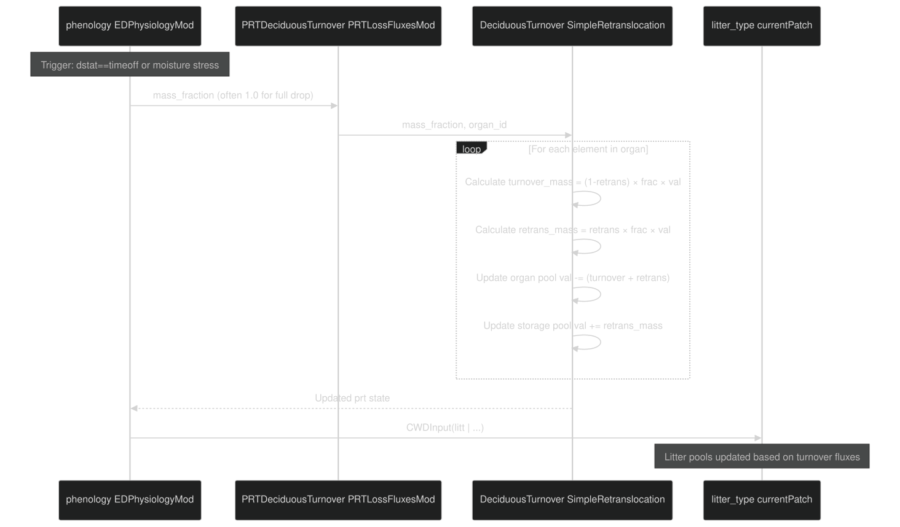
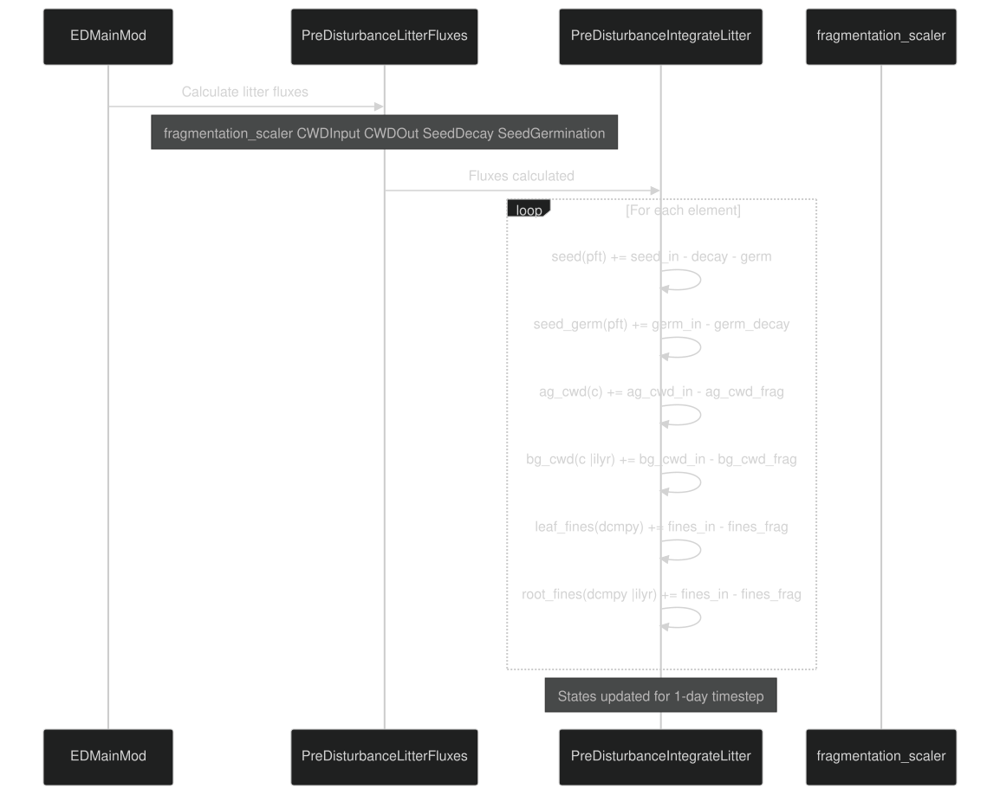

# 4.5 Litter Production and Turnover

Relevant source files

- [biogeochem/EDCohortDynamicsMod.F90](https://github.com/jingtao-lbl/fates/blob/e85d9977/biogeochem/EDCohortDynamicsMod.F90)
- [biogeochem/EDPhysiologyMod.F90](https://github.com/jingtao-lbl/fates/blob/e85d9977/biogeochem/EDPhysiologyMod.F90)
- [biogeochem/FatesAllometryMod.F90](https://github.com/jingtao-lbl/fates/blob/e85d9977/biogeochem/FatesAllometryMod.F90)
- [biogeochem/FatesSoilBGCFluxMod.F90](https://github.com/jingtao-lbl/fates/blob/e85d9977/biogeochem/FatesSoilBGCFluxMod.F90)
- [parteh/PRTAllometricCNPMod.F90](https://github.com/jingtao-lbl/fates/blob/e85d9977/parteh/PRTAllometricCNPMod.F90)
- [parteh/PRTAllometricCarbonMod.F90](https://github.com/jingtao-lbl/fates/blob/e85d9977/parteh/PRTAllometricCarbonMod.F90)
- [parteh/PRTGenericMod.F90](https://github.com/jingtao-lbl/fates/blob/e85d9977/parteh/PRTGenericMod.F90)
- [parteh/PRTLossFluxesMod.F90](https://github.com/jingtao-lbl/fates/blob/e85d9977/parteh/PRTLossFluxesMod.F90)

## Purpose and Scope

This page documents the mechanisms by which plant biomass is converted to litter in FATES, including both continuous maintenance turnover and event-based losses. Litter production encompasses the transfer of carbon and nutrients from living plant organs to dead organic matter pools. For information about how plant mortality rates are calculated, see [4.4 Mortality Processes](plant-physiology/mortality.md) . For details on nutrient uptake from soil, see [4.2.3 Soil-Plant Nutrient Interface](plant-physiology/parteh/soil_plant_interface.md) .

The litter production system handles:

- **Turnover fluxes**from living plants (leaves, fine roots, reproductive organs)
- **Retranslocation**of nutrients back to storage before abscission
- **Event-based losses**from fire, damage, and disturbance
- **Mortality transfers**when entire cohorts die or are terminated
- **Litter fragmentation**as organic matter breaks down into decomposable pools

## Litter Pool Organization

FATES organizes litter into element-specific pools within each patch. The litter structure distinguishes between coarse woody debris (CWD), fine litter, and viable seeds.

### Litter Type Structure

| Pool Category | Spatial Resolution | Size Classes | Purpose | 
| --- | --- | --- | --- |
| Above-ground CWD | Patch-level | 4 size classes (ncwd) | Large woody debris | 
| Below-ground CWD | By soil layer | 4 size classes | Coarse root debris | 
| Leaf fine litter | Patch-level | 3 decomposability classes (ndcmpy) | Leaf and reproductive tissue litter | 
| Root fine litter | By soil layer | 3 decomposability classes | Fine root litter | 
| Seed bank | Patch-level | By PFT | Viable seeds for recruitment | 

The decomposability classes ( `ilabile` , `icellulose` , `ilignin` ) allow differential rates of fragmentation based on tissue chemistry, determined by `GetDecompyFrac` in EDPftvarcon.

Sources: [biogeochem/FatesLitterMod (lines referenced in EDPhysiologyMod.F90)]

## Litter Production Pathways

Sources: [parteh/PRTLossFluxesMod.F90:1-641], [biogeochem/EDPhysiologyMod.F90:428-501], [biogeochem/EDCohortDynamicsMod.F90:560-688]

## Maintenance Turnover

Maintenance turnover represents the continuous background loss of plant tissues (primarily leaves and fine roots) for evergreen species and woody tissues for all plants. This process operates daily and is handled by the PARTEH module.

### PRTMaintTurnover Function

The `PRTMaintTurnover` subroutine calculates daily turnover rates based on PFT-specific parameters:

Key parameters from `prt_params` :

- `leaf_long(ipft, age_class)`- leaf longevity by age class [years]
- `root_long(ipft)`- fine root longevity [years]
- `turnover_nitr_retrans(ipft, organ)`- nitrogen retranslocation fraction
- `turnover_phos_retrans(ipft, organ)`- phosphorus retranslocation fraction

Retranslocation during maintenance turnover: For each organ and element, the subroutine partitions losses between:

The mass balance is:

Sources: [parteh/PRTLossFluxesMod.F90:630-800], [parteh/PRTGenericMod.F90:180-200]

## Deciduous Turnover and Retranslocation

Deciduous turnover handles the abscission of leaves and fine roots during seasonal or stress-induced phenology events. This is an event-based process, in contrast to the continuous maintenance turnover.

### Deciduous Turnover Process

The workflow for deciduous leaf drop:

Key distinctions from maintenance turnover:

- **is not**Carbon retranslocated (retrans = 0 for C)
- **are**Nutrients retranslocated at PFT-specific rates
- Applied to entire organ pools (leaves, fine roots)
- Only allowed for leaves and fine roots in woody PFTs

Sources: [parteh/PRTLossFluxesMod.F90:461-626], [biogeochem/EDPhysiologyMod.F90:148-149, 428-501]

### Retranslocation Mechanics

Retranslocation parameters control the fraction of nutrients salvaged before abscission:

| Parameter | Organ | Typical Range | Purpose | 
| --- | --- | --- | --- |
| turnover_nitr_retrans | leaf, fine root | 0.0 - 0.5 | N recovery during turnover | 
| turnover_phos_retrans | leaf, fine root | 0.0 - 0.5 | P recovery during turnover | 

The retranslocated nutrients are added to the storage pool and become available for future growth. Carbon is never retranslocated; it always goes to litter.

Implementation note: The code uses a single retranslocation mode per PFT ( `prt_params%turnover_retrans_mode` ), but as of the current implementation, only simple proportional retranslocation is active.

Sources: [parteh/PRTLossFluxesMod.F90:503-626]

## Cohort Mortality and Litter Transfer

When cohorts die or are terminated, all of their biomass is transferred to litter pools. This is handled separately from turnover because it involves whole-plant transfer and cross-patch considerations during disturbance.

### SendCohortToLitter Routine

The `SendCohortToLitter` subroutine in EDCohortDynamicsMod transfers biomass from a specified number of plants in a cohort to patch-level litter pools.

Key characteristics:

- **absolute number of plants**`nplant`Operates on ( ), not whole cohort
- **all organs**Transfers (leaf, fine root, sapwood, storage, structure, reproductive)
- **all elements**Processes (C, N, P)
- **Does NOT**`n`modify per-plant PARTEH pools (only affects cohort )
- **Does NOT**handle disturbance-related cross-patch transfers

Partitioning scheme:

The CWD size class distribution is adjusted based on cohort DBH using `adjust_SF_CWD_frac` , allowing smaller plants to contribute more to smaller CWD classes.

Sources: [biogeochem/EDCohortDynamicsMod.F90:560-688]

### Litter Flux Diagnostics

Fluxes are tracked for history output via `site_fluxdiags_type` :

Sources: [biogeochem/EDCohortDynamicsMod.F90:631-683]

## Damage-Related Litter Production

Crown damage events generate litter from the damaged fraction of the crown. This is distinct from mortality—the plant survives but loses a portion of its canopy biomass.

### Damage Litter Workflow

Key calculations:

The `branch_frac` parameter ( `param_derived%branch_frac` ) represents the fraction of above-ground woody biomass in branches (vs. bole), allowing realistic partitioning of structural losses.

Sources: [biogeochem/EDPhysiologyMod.F90:256-424], [parteh/PRTLossFluxesMod.F90:337-389]

## Fire-Related Losses

Fire consumes biomass from plants that survive the fire event. The `PRTBurnLosses` subroutine tracks these losses separately from other turnover mechanisms.

### Burn Loss Tracking

Unlike turnover or damage, burned biomass:

- **no retranslocation**Has (complete loss)
- `prt%variables(i_var)%burned`Is tracked in a dedicated flux array ( )
- Destiny is determined by fire model (fraction to atmosphere vs. litter)
- `mass_fraction`Applies a uniform to all elements in the specified organ

The separation of burn fluxes allows the fire module to distinguish between:

Sources: [parteh/PRTLossFluxesMod.F90:281-333]

## Litter Integration and Fragmentation

After litter fluxes are calculated, they must be integrated into the litter pool state variables and then fragmented for transfer to the soil biogeochemistry model.

### Pre-Disturbance Litter Workflow

The daily litter calculation sequence in `EDMainMod::ed_ecosystem_dynamics` :

Sources: [biogeochem/EDPhysiologyMod.F90:428-591]

### CWDInput and Fragmentation

The `CWDInput` subroutine (called within `PreDisturbanceLitterFluxes` ) processes turnover fluxes from the PARTEH rate variables and translates them into litter pool inputs:

Input sources to litter:

Fragmentation process: The `CWDOut` subroutine calculates the transfer from litter pools to soil decomposition:

- `fragmentation_scaler`Uses (temperature and moisture-dependent, calculated per patch)
- Fragments CWD → smaller CWD classes and fine litter
- `bc_out`Fragments fine litter → soil decomposition pools (via )
- `nlev_eff_decomp`Operates over soil layers for below-ground pools

The fragmentation flux is accumulated in `site_mass%frag_out` for mass balance checking.

Sources: [biogeochem/EDPhysiologyMod.F90:428-501, 505-591]

## Call Sequence for Litter Production

The daily dynamics loop orchestrates litter production in a specific sequence to ensure mass conservation and proper integration:

Key ordering considerations:

Sources: [biogeochem/EDPhysiologyMod.F90:202-253, 428-591], [biogeochem/EDMainMod (call sequence)]

## Mass Balance and Conservation

The litter production system maintains strict mass balance through several mechanisms:

### Flux Tracking Structure

Each PARTEH variable tracks multiple flux components:

| Flux Component | Sign Convention | Meaning | 
| --- | --- | --- |
| net_alloc | + gain, - loss | Net allocation (includes retranslocation) | 
| turnover | + is loss | Mass sent to litter | 
| burned | + is loss | Mass consumed by fire | 
| damaged | + is loss | Mass lost to damage | 

The fundamental balance equation over a timestep:

### Mass Balance Checks

The `CheckMassConservation` method (in `prt_vartypes` ) verifies:

Site-level mass balance tracking via `site_massbal_type` accumulates:

- `frag_out`- total fragmentation flux to soil [kg/site/day]
- Inputs and losses for each element type
- `TotalBalanceCheck``EDMainMod`Checked at multiple points via in

Sources: [parteh/PRTGenericMod.F90:180-200, 900-1050], [biogeochem/EDPhysiologyMod.F90:489-496]