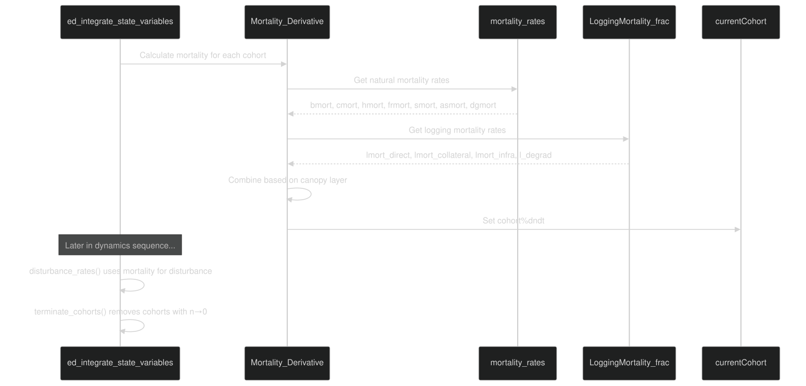

# Mortality Processes

Relevant source files

- [biogeochem/EDCohortDynamicsMod.F90](https://github.com/jingtao-lbl/fates/blob/e85d9977/biogeochem/EDCohortDynamicsMod.F90)
- [biogeochem/EDLoggingMortalityMod.F90](https://github.com/jingtao-lbl/fates/blob/e85d9977/biogeochem/EDLoggingMortalityMod.F90)
- [biogeochem/EDMortalityFunctionsMod.F90](https://github.com/jingtao-lbl/fates/blob/e85d9977/biogeochem/EDMortalityFunctionsMod.F90)
- [biogeochem/EDPhysiologyMod.F90](https://github.com/jingtao-lbl/fates/blob/e85d9977/biogeochem/EDPhysiologyMod.F90)
- [biogeochem/FatesAllometryMod.F90](https://github.com/jingtao-lbl/fates/blob/e85d9977/biogeochem/FatesAllometryMod.F90)
- [main/EDMainMod.F90](https://github.com/jingtao-lbl/fates/blob/e85d9977/main/EDMainMod.F90)

## Purpose and Scope

This page documents the mortality mechanisms in FATES that determine plant death rates. Mortality in FATES encompasses multiple environmental, physiological, and anthropogenic processes that reduce cohort number densities. These mortality rates feed into both the direct reduction of plant populations and the generation of disturbance events that create new patches.

For information about how mortality-induced disturbances create new patches, see [Patch Dynamics and Disturbances](core-dynamics/patch_dynamics.md) . For logging-specific mortality mechanisms, see [Logging Mortality](logging/mortality.md) . For litter fluxes resulting from mortality, see [Litter Production and Turnover](plant-physiology/litter.md) .

## Mortality Types

FATES calculates seven distinct mortality mechanisms, each representing different stresses or life history processes. These are calculated as fractional mortality rates per year and then integrated to determine changes in cohort number density.

### Mortality Rate Components

| Mortality Type | Variable | Description | Key Parameters | 
| --- | --- | --- | --- |
| Background | bmort | Baseline mortality representing intrinsic risks | fates_mort_bmort | 
| Carbon Starvation | cmort | Death from insufficient carbon storage | fates_mort_scalar_cstarvation | 
| Hydraulic Failure | hmort | Death from xylem cavitation or water stress | fates_mort_scalar_hydrfailure, fates_mort_hf_sm_threshold, fates_mort_hf_flc_threshold | 
| Freezing Stress | frmort | Cold-induced mortality | fates_mort_scalar_coldstress, fates_frzleaftol | 
| Size Senescence | smort | Size-dependent mortality increase | fates_mort_ip_size_senescence, fates_mort_r_size_senescence | 
| Age Senescence | asmort | Age-dependent mortality increase | fates_mort_ip_age_senescence, fates_mort_r_age_senescence | 
| Damage | dgmort | Crown damage-induced mortality | Damage class parameters | 
| Logging | lmort_* | Anthropogenic harvest mortality | Logging parameters (see Logging Mortality) | 

Sources: [biogeochem/EDMortalityFunctionsMod.F90 51-230](https://github.com/jingtao-lbl/fates/blob/e85d9977/biogeochem/EDMortalityFunctionsMod.F90#L51-L230)

## Mortality Rate Calculation

Diagram: Mortality rate calculation flow showing the seven mortality components

Sources: [biogeochem/EDMortalityFunctionsMod.F90 51-230](https://github.com/jingtao-lbl/fates/blob/e85d9977/biogeochem/EDMortalityFunctionsMod.F90#L51-L230)

### Background Mortality

Background mortality ( `bmort` ) represents the baseline death rate from causes not explicitly modeled (e.g., wind throw, disease, herbivory). It is a PFT-specific constant that provides a minimum mortality rate.

Sources: [biogeochem/EDMortalityFunctionsMod.F90 139](https://github.com/jingtao-lbl/fates/blob/e85d9977/biogeochem/EDMortalityFunctionsMod.F90#L139-L139)

### Carbon Starvation Mortality

Carbon starvation occurs when storage carbon falls below the target needed to support leaf flushing. The mortality rate increases linearly as storage becomes more depleted relative to the target leaf biomass (if fully flushed).

This mechanism represents mortality from prolonged negative carbon balance, where plants exhaust reserves and cannot maintain metabolic functions or flush new leaves.

Sources: [biogeochem/EDMortalityFunctionsMod.F90 166-184](https://github.com/jingtao-lbl/fates/blob/e85d9977/biogeochem/EDMortalityFunctionsMod.F90#L166-L184)  [biogeochem/FatesAllometryMod.F90 614-632](https://github.com/jingtao-lbl/fates/blob/e85d9977/biogeochem/FatesAllometryMod.F90#L614-L632)

### Hydraulic Failure Mortality

Hydraulic failure mortality represents death from xylem cavitation and loss of water transport capacity. Two implementations exist depending on whether plant hydraulics is enabled:

With Plant Hydraulics (`hlm_use_planthydro == itrue`):

Without Plant Hydraulics (proxy via soil moisture):

The plant hydraulics version tracks actual xylem cavitation across aboveground, transporting root, and absorbing root compartments. The simpler version uses soil moisture stress as a proxy.

Sources: [biogeochem/EDMortalityFunctionsMod.F90 141-164](https://github.com/jingtao-lbl/fates/blob/e85d9977/biogeochem/EDMortalityFunctionsMod.F90#L141-L164)

### Freezing Stress Mortality

Freezing mortality increases when temperatures fall below a PFT-specific tolerance threshold. A 5°C buffer zone provides a gradual transition:

This represents damage from ice crystal formation in tissues, membrane disruption, and other cold-induced stresses.

Sources: [biogeochem/EDMortalityFunctionsMod.F90 199-203](https://github.com/jingtao-lbl/fates/blob/e85d9977/biogeochem/EDMortalityFunctionsMod.F90#L199-L203)

### Size and Age Senescence

Both size and age senescence use logistic functions to represent increased mortality as plants reach large sizes or old ages. These processes capture demographic senescence where older/larger individuals face diminishing returns and increased vulnerability.

Size Senescence:

Age Senescence:

The inflection point ( `ip` ) parameter defines the size/age where mortality begins accelerating, while the rate ( `r` ) controls how quickly mortality increases.

Sources: [biogeochem/EDMortalityFunctionsMod.F90 99-124](https://github.com/jingtao-lbl/fates/blob/e85d9977/biogeochem/EDMortalityFunctionsMod.F90#L99-L124)

### Damage Mortality

When tree damage is enabled ( `hlm_use_tree_damage == itrue` ), crown damage increases mortality rates. Higher damage classes experience progressively higher mortality. See [Crown Damage and Recovery](plant-physiology/crown_damage.md) for details on damage classes.

Sources: [biogeochem/EDMortalityFunctionsMod.F90 127-131](https://github.com/jingtao-lbl/fates/blob/e85d9977/biogeochem/EDMortalityFunctionsMod.F90#L127-L131)

## Mortality Derivative and Number Density Change

The `Mortality_Derivative()` function integrates all mortality sources to calculate the rate of change in cohort number density ( `dndt` ). This calculation differs between canopy and understory cohorts due to disturbance generation.

Diagram: Flow of mortality derivative calculation showing canopy vs understory treatment

### Disturbance-Generating vs Non-Disturbance-Generating Mortality

A critical distinction in FATES mortality is whether death generates disturbance:

Non-Disturbance-Generating Mortality:

- All understory cohort mortality
- Mortality of non-woody plants (grasses, forbs)
- `cohort%n`Results in direct reduction of
- Litter goes to the same patch

Disturbance-Generating Mortality:

- `fates_mortality_disturbance_fraction`Fraction of canopy woody plant mortality (controlled by )
- Canopy logging mortality (all direct, collateral, and infrastructure)
- `spawn_patches()`Creates new patches via
- Litter transferred to new patch

The `ExemptTreefallDist()` function determines if a cohort is exempt from disturbance generation (currently only non-woody plants).

Sources: [biogeochem/EDMortalityFunctionsMod.F90 234-323](https://github.com/jingtao-lbl/fates/blob/e85d9977/biogeochem/EDMortalityFunctionsMod.F90#L234-L323)  [biogeochem/EDMortalityFunctionsMod.F90 327-351](https://github.com/jingtao-lbl/fates/blob/e85d9977/biogeochem/EDMortalityFunctionsMod.F90#L327-L351)

## Integration into Daily Dynamics

Mortality rates are calculated and applied during the daily dynamics sequence in `ed_integrate_state_variables()` :

Diagram: Sequence of mortality calculation within the daily dynamics loop

The mortality calculation occurs in this sequence:

### Mortality to Litter Pathway

When cohorts are terminated due to mortality, their biomass is transferred to litter pools via `SendCohortToLitter()` :

Diagram: Pathway from mortality to litter pools

Sources: [biogeochem/EDCohortDynamicsMod.F90 464-556](https://github.com/jingtao-lbl/fates/blob/e85d9977/biogeochem/EDCohortDynamicsMod.F90#L464-L556)  [biogeochem/EDCohortDynamicsMod.F90 560-688](https://github.com/jingtao-lbl/fates/blob/e85d9977/biogeochem/EDCohortDynamicsMod.F90#L560-L688)

## Prescribed Physiology Mode

When `hlm_use_ed_prescribed_phys == itrue` , mortality is simplified to prescribed rates that differ between canopy and understory:

All mechanistic mortality processes (carbon starvation, hydraulic failure, freezing) are disabled, and mortality is determined purely by prescribed PFT-specific rates.

Sources: [biogeochem/EDMortalityFunctionsMod.F90 207-217](https://github.com/jingtao-lbl/fates/blob/e85d9977/biogeochem/EDMortalityFunctionsMod.F90#L207-L217)

## Key Parameters

The following parameters control mortality processes (from parameter file):

| Parameter | Description | Default | Units | 
| --- | --- | --- | --- |
| fates_mort_bmort | Background mortality rate | PFT-specific | yr⁻¹ | 
| fates_mort_scalar_cstarvation | Carbon starvation mortality scalar | PFT-specific | yr⁻¹ | 
| fates_mort_scalar_hydrfailure | Hydraulic failure mortality scalar | PFT-specific | yr⁻¹ | 
| fates_mort_hf_sm_threshold | Soil moisture threshold for hydraulic failure | PFT-specific | - | 
| fates_mort_hf_flc_threshold | Fractional loss of conductivity threshold | PFT-specific | fraction | 
| fates_mort_scalar_coldstress | Cold stress mortality scalar | PFT-specific | yr⁻¹ | 
| fates_frzleaftol | Freezing tolerance temperature | PFT-specific | °C | 
| fates_mort_ip_size_senescence | Size senescence inflection point | PFT-specific | cm | 
| fates_mort_r_size_senescence | Size senescence rate parameter | PFT-specific | cm⁻¹ | 
| fates_mort_ip_age_senescence | Age senescence inflection point | PFT-specific | years | 
| fates_mort_r_age_senescence | Age senescence rate parameter | PFT-specific | yr⁻¹ | 
| fates_mortality_disturbance_fraction | Fraction of canopy mortality generating disturbance | 1.0 | fraction | 

Sources: [biogeochem/EDMortalityFunctionsMod.F90 1-353](https://github.com/jingtao-lbl/fates/blob/e85d9977/biogeochem/EDMortalityFunctionsMod.F90#L1-L353)  [biogeochem/EDPftvarcon.F90](https://github.com/jingtao-lbl/fates/blob/e85d9977/biogeochem/EDPftvarcon.F90) (referenced but not shown)

## Code Entry Points

| Function | Location | Purpose | 
| --- | --- | --- |
| mortality_rates() | biogeochem/EDMortalityFunctionsMod.F9051-230 | Calculate individual mortality rate components | 
| Mortality_Derivative() | biogeochem/EDMortalityFunctionsMod.F90234-323 | Integrate mortality into number density derivative | 
| ExemptTreefallDist() | biogeochem/EDMortalityFunctionsMod.F90327-351 | Determine if cohort exempted from disturbance | 
| LoggingMortality_frac() | biogeochem/EDLoggingMortalityMod.F90198-346 | Calculate logging mortality rates | 
| terminate_cohort() | biogeochem/EDCohortDynamicsMod.F90464-556 | Remove dead cohort and transfer to litter | 
| SendCohortToLitter() | biogeochem/EDCohortDynamicsMod.F90560-688 | Transfer cohort biomass to litter pools | 

Sources: [biogeochem/EDMortalityFunctionsMod.F90 1-353](https://github.com/jingtao-lbl/fates/blob/e85d9977/biogeochem/EDMortalityFunctionsMod.F90#L1-L353)  [biogeochem/EDLoggingMortalityMod.F90 1-1200](https://github.com/jingtao-lbl/fates/blob/e85d9977/biogeochem/EDLoggingMortalityMod.F90#L1-L1200)  [biogeochem/EDCohortDynamicsMod.F90 1-2500](https://github.com/jingtao-lbl/fates/blob/e85d9977/biogeochem/EDCohortDynamicsMod.F90#L1-L2500)