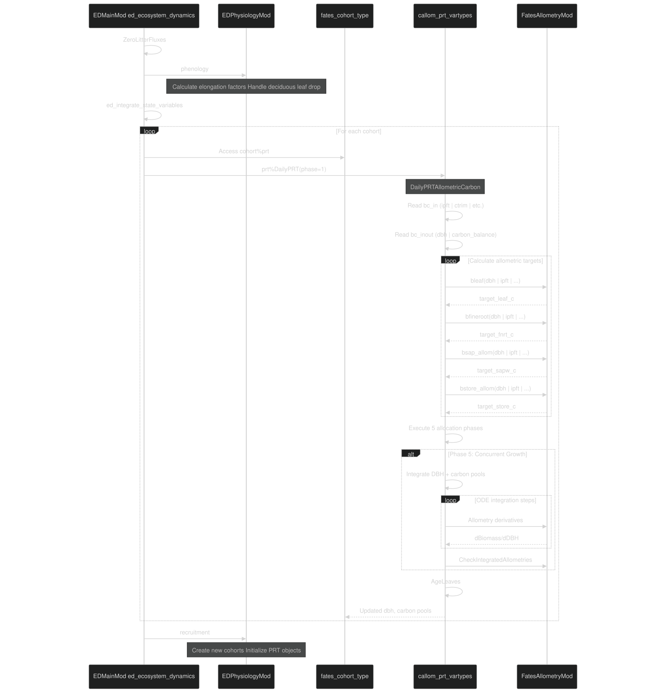

# Carbon-Only Allocation

Relevant source files

- [biogeochem/EDCohortDynamicsMod.F90](https://github.com/jingtao-lbl/fates/blob/e85d9977/biogeochem/EDCohortDynamicsMod.F90)
- [biogeochem/EDPhysiologyMod.F90](https://github.com/jingtao-lbl/fates/blob/e85d9977/biogeochem/EDPhysiologyMod.F90)
- [biogeochem/FatesAllometryMod.F90](https://github.com/jingtao-lbl/fates/blob/e85d9977/biogeochem/FatesAllometryMod.F90)
- [biogeochem/FatesSoilBGCFluxMod.F90](https://github.com/jingtao-lbl/fates/blob/e85d9977/biogeochem/FatesSoilBGCFluxMod.F90)
- [parteh/PRTAllometricCNPMod.F90](https://github.com/jingtao-lbl/fates/blob/e85d9977/parteh/PRTAllometricCNPMod.F90)
- [parteh/PRTAllometricCarbonMod.F90](https://github.com/jingtao-lbl/fates/blob/e85d9977/parteh/PRTAllometricCarbonMod.F90)
- [parteh/PRTGenericMod.F90](https://github.com/jingtao-lbl/fates/blob/e85d9977/parteh/PRTGenericMod.F90)
- [parteh/PRTLossFluxesMod.F90](https://github.com/jingtao-lbl/fates/blob/e85d9977/parteh/PRTLossFluxesMod.F90)

## Purpose and Scope

This page describes the carbon-only allometric allocation hypothesis implemented in FATES PARTEH (Plant Allocation and Reactive Transport Extensible Hypotheses). This hypothesis governs how plants allocate daily net carbon gain across different biomass pools using allometric relationships, without explicit tracking of nitrogen or phosphorus.

For information about CNP (Carbon-Nitrogen-Phosphorus) allocation with flexible stoichiometry, see [CNP Allocation and Nutrient Dynamics](../plant-physiology/parteh/cnp_allocation.md) . For the overall PARTEH framework architecture, see [PARTEH: Plant Allocation System](../plant-physiology/parteh/index.md) .

Sources:  [parteh/PRTAllometricCarbonMod.F90 1-66](https://github.com/jingtao-lbl/fates/blob/e85d9977/parteh/PRTAllometricCarbonMod.F90#L1-L66)  [parteh/PRTGenericMod.F90 1-80](https://github.com/jingtao-lbl/fates/blob/e85d9977/parteh/PRTGenericMod.F90#L1-L80)

## Hypothesis Overview

The carbon-only allocation hypothesis ( `prt_carbon_allom_hyp` ) assumes that plant growth is limited solely by carbon availability and constrained by allometric relationships between diameter and biomass pools. This hypothesis is identified by the global constant `prt_carbon_allom_hyp = 1` and is instantiated through the `callom_prt_vartypes` class.

Key Characteristics:

- All biomass pools contain only carbon (no explicit N or P tracking)
- Growth follows strict allometric relationships based on diameter at breast height (DBH)
- Allocation priorities favor leaf and fine-root replacement, then storage, then structural growth
- DBH is integrated alongside carbon pools during growth
- No nutrient limitation or soil nutrient uptake

Sources:  [parteh/PRTAllometricCarbonMod.F90 67-131](https://github.com/jingtao-lbl/fates/blob/e85d9977/parteh/PRTAllometricCarbonMod.F90#L67-L131)  [parteh/PRTGenericMod.F90 69-71](https://github.com/jingtao-lbl/fates/blob/e85d9977/parteh/PRTGenericMod.F90#L69-L71)

## Class Structure and State Variables

### Core Type Definition

The carbon-only allocation is implemented through the `callom_prt_vartypes` class, which extends the base `prt_vartypes` class and provides specialized allocation procedures.

Sources:  [parteh/PRTAllometricCarbonMod.F90 136-143](https://github.com/jingtao-lbl/fates/blob/e85d9977/parteh/PRTAllometricCarbonMod.F90#L136-L143)

### State Variables

The hypothesis tracks six carbon pools , each representing a different plant organ or function:

| Variable ID | Symbol | Description | Organ | Element | Coordinates | 
| --- | --- | --- | --- | --- | --- |
| leaf_c_id (1) | leaf_c | Leaf Carbon | leaf_organ | carbon12_element | Multiple (age classes) | 
| fnrt_c_id (2) | fnrt_c | Fine Root Carbon | fnrt_organ | carbon12_element | 1 | 
| sapw_c_id (3) | sapw_c | Sapwood Carbon | sapw_organ | carbon12_element | 1 | 
| store_c_id (4) | store_c | Storage Carbon | store_organ | carbon12_element | 1 | 
| repro_c_id (5) | repro_c | Reproductive Carbon | repro_organ | carbon12_element | 1 | 
| struct_c_id (6) | struct_c | Structural Carbon | struct_organ | carbon12_element | 1 | 

Note: Leaf carbon is discretized by age class (typically 1-4 classes), while other pools have a single spatial position.

Sources:  [parteh/PRTAllometricCarbonMod.F90 76-82](https://github.com/jingtao-lbl/fates/blob/e85d9977/parteh/PRTAllometricCarbonMod.F90#L76-L82)  [parteh/PRTGenericMod.F90 78-86](https://github.com/jingtao-lbl/fates/blob/e85d9977/parteh/PRTGenericMod.F90#L78-L86)

### Integration Variables

During allocation, the hypothesis integrates 7 variables simultaneously:

1-6: The six carbon pools listed above  7: `dbh_id` - Diameter at breast height [cm]

DBH is treated as a boundary condition externally but is integrated alongside carbon pools to maintain consistency with allometric constraints.

Sources:  [parteh/PRTAllometricCarbonMod.F90 87-90](https://github.com/jingtao-lbl/fates/blob/e85d9977/parteh/PRTAllometricCarbonMod.F90#L87-L90)

## Boundary Conditions

### Input/Output Boundary Conditions

| ID | Symbol | Description | Type | Units | 
| --- | --- | --- | --- | --- |
| ac_bc_inout_id_dbh (1) | dbh | Diameter at breast height | In/Out | cm | 
| ac_bc_inout_id_netdc (2) | carbon_balance | Net daily carbon gain | In/Out | kgC | 

These boundary conditions are both read and modified by the allocation routine.

Sources:  [parteh/PRTAllometricCarbonMod.F90 101-104](https://github.com/jingtao-lbl/fates/blob/e85d9977/parteh/PRTAllometricCarbonMod.F90#L101-L104)

### Input-Only Boundary Conditions

| ID | Symbol | Description | Type | 
| --- | --- | --- | --- |
| ac_bc_in_id_pft (1) | ipft | Plant functional type index | Integer | 
| ac_bc_in_id_ctrim (2) | canopy_trim | Canopy trimming function [0-1] | Real | 
| ac_bc_in_id_lstat (3) | leaf_status | Leaf status (on/off/shedding) | Integer | 
| ac_bc_in_id_cdamage (4) | crowndamage | Crown damage class | Integer | 
| ac_bc_in_id_efleaf (5) | elongf_leaf | Leaf elongation factor [0-1] | Real | 
| ac_bc_in_id_effnrt (6) | elongf_fnrt | Fine-root elongation factor [0-1] | Real | 
| ac_bc_in_id_efstem (7) | elongf_stem | Stem elongation factor [0-1] | Real | 

Sources:  [parteh/PRTAllometricCarbonMod.F90 107-114](https://github.com/jingtao-lbl/fates/blob/e85d9977/parteh/PRTAllometricCarbonMod.F90#L107-L114)

## Daily Allocation Algorithm

### Main Entry Point

The daily allocation is executed through `DailyPRTAllometricCarbon` , which allocates the net daily carbon balance ( `carbon_balance` ) across all biomass pools while maintaining allometric relationships.

Sources:  [parteh/PRTAllometricCarbonMod.F90 260-300](https://github.com/jingtao-lbl/fates/blob/e85d9977/parteh/PRTAllometricCarbonMod.F90#L260-L300)

### Algorithm Flow Diagram

Sources:  [parteh/PRTAllometricCarbonMod.F90 442-911](https://github.com/jingtao-lbl/fates/blob/e85d9977/parteh/PRTAllometricCarbonMod.F90#L442-L911)

### Allocation Phases in Detail
Phase 1: Replace Maintenance Turnover
When `carbon_balance < 0` (daily respiration exceeds photosynthesis), the deficit is covered by drawing from storage. Leaf and fine-root turnover demands are calculated and fulfilled from storage reserves.

Key Variables:

- `leaf_c_demand`: Carbon needed to replace leaf turnover [kgC]
- `fnrt_c_demand`: Carbon needed to replace fine-root turnover [kgC]
- `total_c_demand`: Sum of leaf and fine-root demands [kgC]

Sources:  [parteh/PRTAllometricCarbonMod.F90 505-559](https://github.com/jingtao-lbl/fates/blob/e85d9977/parteh/PRTAllometricCarbonMod.F90#L505-L559)
Phase 2: Refill Storage
Positive carbon gain first goes to replenishing storage up to its allometric target. The storage target is calculated as a fraction of leaf biomass.

Sources:  [parteh/PRTAllometricCarbonMod.F90 561-586](https://github.com/jingtao-lbl/fates/blob/e85d9977/parteh/PRTAllometricCarbonMod.F90#L561-L586)
Phase 3: Leaves and Fine-Roots to Allometry
Remaining carbon gain is allocated to bring leaves and fine-roots up to their allometric targets. The allocation is proportional to the deficit in each pool.

Sources:  [parteh/PRTAllometricCarbonMod.F90 588-621](https://github.com/jingtao-lbl/fates/blob/e85d9977/parteh/PRTAllometricCarbonMod.F90#L588-L621)
Phase 4: Sapwood and Structure to Allometry
If carbon remains, it is allocated to sapwood and structural pools to bring them to allometric targets.

Sources:  [parteh/PRTAllometricCarbonMod.F90 623-671](https://github.com/jingtao-lbl/fates/blob/e85d9977/parteh/PRTAllometricCarbonMod.F90#L623-L671)
Phase 5: Concurrent Growth (Stature Growth)
If all pools are at allometry and carbon still remains, the plant grows in stature. All pools and DBH are integrated simultaneously using an ODE solver to maintain allometric consistency.

Integration Methods:

- `ODESolve = 1`: Runge-Kutta-Fehlberg (RKF45) adaptive method
- `ODESolve = 2`: Simple Euler method (default)

Sources:  [parteh/PRTAllometricCarbonMod.F90 673-882](https://github.com/jingtao-lbl/fates/blob/e85d9977/parteh/PRTAllometricCarbonMod.F90#L673-L882)

## Allometric Constraints

### Allometry Functions Used

The allocation algorithm relies on allometric functions from `FatesAllometryMod` to calculate target biomass for each pool based on DBH:

| Function | Purpose | Key Parameters | 
| --- | --- | --- |
| bleaf() | Target leaf biomass | dbh, ipft, crowndamage, canopy_trim, elongf_leaf | 
| bfineroot() | Target fine-root biomass | dbh, ipft, canopy_trim, l2fr, elongf_fnrt | 
| bsap_allom() | Target sapwood biomass | dbh, ipft, crowndamage, canopy_trim, elongf_stem | 
| bstore_allom() | Target storage biomass | dbh, ipft, crowndamage, canopy_trim | 
| bagw_allom() | Target above-ground woody biomass | dbh, ipft, crowndamage, elongf_stem | 
| bbgw_allom() | Target below-ground woody biomass | dbh, ipft, elongf_stem | 
| bdead_allom() | Target structural biomass | bagw, bgw, sapw, ipft | 
| h_allom() | Height from diameter | dbh, ipft | 

Note:  `elongf_leaf` , `elongf_fnrt` , and `elongf_stem` are elongation factors [0-1] that allow phenology to modify allometric targets (e.g., during leaf-off periods for deciduous plants).

Sources:  [biogeochem/FatesAllometryMod.F90 106-128](https://github.com/jingtao-lbl/fates/blob/e85d9977/biogeochem/FatesAllometryMod.F90#L106-L128)  [parteh/PRTAllometricCarbonMod.F90 442-500](https://github.com/jingtao-lbl/fates/blob/e85d9977/parteh/PRTAllometricCarbonMod.F90#L442-L500)

### Allometry During Integration

During concurrent growth (Phase 5), the integration derivatives are calculated based on allometric derivatives:

Where `dBiomass/dDBH` comes from the derivative output of allometry functions (e.g., `dbldd` , `dbadd` , etc.).

Sources:  [parteh/PRTAllometricCarbonMod.F90 1083-1175](https://github.com/jingtao-lbl/fates/blob/e85d9977/parteh/PRTAllometricCarbonMod.F90#L1083-L1175)

## Integration Method and ODE Solver

### Concurrent Growth Integration

When all pools are at allometric targets and excess carbon remains, the plant grows by simultaneously integrating:

- The 6 carbon pools
- DBH

The system is represented as:

Sources:  [parteh/PRTAllometricCarbonMod.F90 1035-1082](https://github.com/jingtao-lbl/fates/blob/e85d9977/parteh/PRTAllometricCarbonMod.F90#L1035-L1082)

### ODE Solver Selection

The model supports two integration methods:

Sources:  [parteh/PRTAllometricCarbonMod.F90 405-406](https://github.com/jingtao-lbl/fates/blob/e85d9977/parteh/PRTAllometricCarbonMod.F90#L405-L406)  [FatesIntegratorsMod](https://github.com/jingtao-lbl/fates/blob/e85d9977/FatesIntegratorsMod)

### Integration Convergence Check

After integration, the routine verifies that integrated pools match allometric targets within tolerance:

Maximum allowable error: `calloc_abs_error` (typically ~1e-9 kgC)

Sources:  [biogeochem/FatesAllometryMod.F90 163-288](https://github.com/jingtao-lbl/fates/blob/e85d9977/biogeochem/FatesAllometryMod.F90#L163-L288)

## Initialization and Object Creation

### Global Initialization

The carbon-only allocation hypothesis is initialized once per simulation through:

This routine:

Sources:  [parteh/PRTAllometricCarbonMod.F90 169-255](https://github.com/jingtao-lbl/fates/blob/e85d9977/parteh/PRTAllometricCarbonMod.F90#L169-L255)

### Variable Registration

Each state variable is registered using:

This creates bidirectional mappings between variable IDs and organ/element combinations via:

- `prt_global_ac%sp_organ_map(organ_id, element_id)`→ variable ID
- `prt_global_ac%organ_map(organ_id)%var_id(:)`→ list of variable IDs for an organ

Sources:  [parteh/PRTAllometricCarbonMod.F90 237-242](https://github.com/jingtao-lbl/fates/blob/e85d9977/parteh/PRTAllometricCarbonMod.F90#L237-L242)  [parteh/PRTGenericMod.F90 447-483](https://github.com/jingtao-lbl/fates/blob/e85d9977/parteh/PRTGenericMod.F90#L447-L483)

### Per-Cohort Initialization

When a new cohort is created, its PARTEH object is initialized through:

This routine (defined in `EDCohortDynamicsMod` ):

Sources:  [biogeochem/EDCohortDynamicsMod.F90 293-342](https://github.com/jingtao-lbl/fates/blob/e85d9977/biogeochem/EDCohortDynamicsMod.F90#L293-L342)

### Setting Initial Conditions

Initial biomass values are set through the generic interface:

For new recruits, initial values are calculated from:

- Target DBH (from recruitment scheme)
- Allometric functions
- PFT-specific parameters

Sources:  [biogeochem/EDPhysiologyMod.F90 1200-1400](https://github.com/jingtao-lbl/fates/blob/e85d9977/biogeochem/EDPhysiologyMod.F90#L1200-L1400) (recruitment routine)

## Integration with FATES Dynamics

### Call Sequence Diagram

Sources:  [biogeochem/EDMainMod.F90](https://github.com/jingtao-lbl/fates/blob/e85d9977/biogeochem/EDMainMod.F90)  [parteh/PRTAllometricCarbonMod.F90 260-911](https://github.com/jingtao-lbl/fates/blob/e85d9977/parteh/PRTAllometricCarbonMod.F90#L260-L911)

### Turnover and Loss Fluxes

Maintenance turnover (for evergreens) and deciduous leaf drop are handled through generic loss flux routines:

These routines:

- Calculate turnover mass for each pool
- Handle retranslocation to storage (for nutrients in CNP mode; zero for C-only)
- `turnover`Update flux diagnostic
- Reduce pool values

Sources:  [parteh/PRTLossFluxesMod.F90 630-807](https://github.com/jingtao-lbl/fates/blob/e85d9977/parteh/PRTLossFluxesMod.F90#L630-L807)

## Key Design Decisions and Assumptions

### Carbon-Only Simplifications

Sources:  [parteh/PRTAllometricCarbonMod.F90 1-66](https://github.com/jingtao-lbl/fates/blob/e85d9977/parteh/PRTAllometricCarbonMod.F90#L1-L66)

### Allocation Priorities

The five-phase priority system reflects plant survival strategy:

Sources:  [parteh/PRTAllometricCarbonMod.F90 260-300](https://github.com/jingtao-lbl/fates/blob/e85d9977/parteh/PRTAllometricCarbonMod.F90#L260-L300)

### Deciduous vs. Evergreen

- **Deciduous PFTs**
- `PRTDeciduousTurnover`Leaf drop occurs via (triggered by phenology)
- Storage refills during leaf-off period
- `PRTPhenologyFlush`Leaf flush via transfers storage → leaves

:
- **Evergreen PFTs**
- `PRTMaintTurnover`Continuous maintenance turnover via
- No seasonal storage dynamics
- Leaf biomass relatively stable

:

Sources:  [parteh/PRTAllometricCarbonMod.F90 436-440](https://github.com/jingtao-lbl/fates/blob/e85d9977/parteh/PRTAllometricCarbonMod.F90#L436-L440)  [parteh/PRTLossFluxesMod.F90 73-277](https://github.com/jingtao-lbl/fates/blob/e85d9977/parteh/PRTLossFluxesMod.F90#L73-L277)

## Comparison with CNP Allocation

| Aspect | Carbon-Only (prt_carbon_allom_hyp) | CNP Allocation (prt_cnp_flex_allom_hyp) | 
| --- | --- | --- |
| Tracked Elements | Carbon only | Carbon, Nitrogen, Phosphorus | 
| Growth Limitation | Carbon availability + allometry | Carbon, N, P availability + allometry | 
| Storage | Carbon only | Separate C, N, P storage pools | 
| Soil Coupling | None | Uptake from soil BGC via bc_in%plant_*_uptake_flux | 
| Retranslocation | None | N and P retranslocated during turnover | 
| Leaf:Fineroot Ratio | Fixed by allom_l2fr parameter | Dynamic via PID controller (l2fr optimizes for N/P acquisition) | 
| Stoichiometry | Implicit (not tracked) | Explicit per organ (growth-minimum and maximum) | 
| Computational Cost | Lower | Higher (additional elements, optimization) | 

For details on CNP allocation, see [CNP Allocation and Nutrient Dynamics](../plant-physiology/parteh/cnp_allocation.md) .

Sources:  [parteh/PRTAllometricCarbonMod.F90 1-20](https://github.com/jingtao-lbl/fates/blob/e85d9977/parteh/PRTAllometricCarbonMod.F90#L1-L20)  [parteh/PRTAllometricCNPMod.F90 1-80](https://github.com/jingtao-lbl/fates/blob/e85d9977/parteh/PRTAllometricCNPMod.F90#L1-L80)

## Code Entry Points and Key Functions

### Primary Functions

| Function | Location | Purpose | 
| --- | --- | --- |
| InitPRTGlobalAllometricCarbon() | parteh/PRTAllometricCarbonMod.F90169-255 | Initialize global hypothesis descriptor | 
| DailyPRTAllometricCarbon() | parteh/PRTAllometricCarbonMod.F90260-911 | Main daily allocation routine | 
| AgeLeaves() | parteh/PRTAllometricCarbonMod.F90913-1030 | Transfer carbon between leaf age classes | 
| InitPRTObject() | biogeochem/EDCohortDynamicsMod.F90293-342 | Allocate PRT object for new cohort | 
| TargetAllometricCarbon() | parteh/PRTAllometricCarbonMod.F901083-1175 | Calculate allocation targets during integration | 

### Supporting Allometry Functions

| Function | Location | Purpose | 
| --- | --- | --- |
| bleaf() | biogeochem/FatesAllometryMod.F90554-623 | Leaf biomass target | 
| bfineroot() | biogeochem/FatesAllometryMod.F90625-707 | Fine-root biomass target | 
| bsap_allom() | biogeochem/FatesAllometryMod.F90753-835 | Sapwood biomass target | 
| bstore_allom() | biogeochem/FatesAllometryMod.F90837-880 | Storage biomass target | 
| bagw_allom() | biogeochem/FatesAllometryMod.F90372-434 | Above-ground woody biomass | 
| bbgw_allom() | biogeochem/FatesAllometryMod.F90709-751 | Below-ground woody biomass | 
| bdead_allom() | biogeochem/FatesAllometryMod.F90882-906 | Structural biomass | 

Sources:  [parteh/PRTAllometricCarbonMod.F90 1-911](https://github.com/jingtao-lbl/fates/blob/e85d9977/parteh/PRTAllometricCarbonMod.F90#L1-L911)  [biogeochem/FatesAllometryMod.F90 1-1000](https://github.com/jingtao-lbl/fates/blob/e85d9977/biogeochem/FatesAllometryMod.F90#L1-L1000)

## Parameter Dependencies

The carbon-only allocation relies on the following PFT-specific parameters (from `prt_params` ):

### Allometry Parameters

- `allom_hmode``allom_lmode``allom_amode`, , , etc. - Select allometry function types
- `allom_d2h1``allom_d2h2``allom_d2h3`, , - Height allometry coefficients
- `allom_d2bl1``allom_d2bl2``allom_d2bl3`, , - Leaf biomass allometry coefficients
- `allom_agb1``allom_agb2``allom_agb3`, , - Above-ground biomass allometry coefficients
- `allom_l2fr`- Leaf to fine-root biomass ratio

### Tissue Properties

- `wood_density`- Wood specific gravity [g/cm³]
- `c2b`- Carbon to biomass ratio (typically ~2.0)
- `allom_agb_frac`- Fraction of wood above ground

### Turnover and Phenology

- `leaf_long`- Leaf longevity [years] (by age class)
- `root_long`- Fine-root longevity [years]
- `season_decid`- Is PFT cold-deciduous? (integer flag)
- `stress_decid`- Is PFT drought-deciduous? (integer flag)

Sources:  [PRTParametersMod](https://github.com/jingtao-lbl/fates/blob/e85d9977/PRTParametersMod)  [biogeochem/FatesAllometryMod.F90 80-150](https://github.com/jingtao-lbl/fates/blob/e85d9977/biogeochem/FatesAllometryMod.F90#L80-L150)