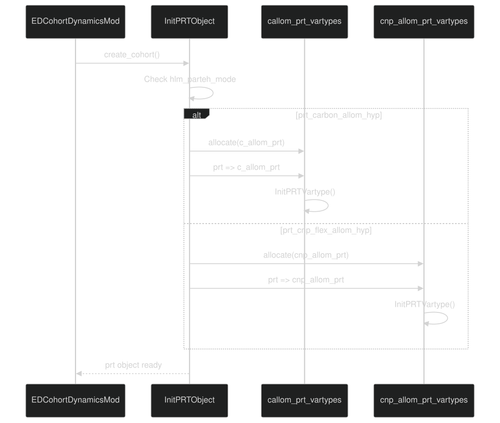
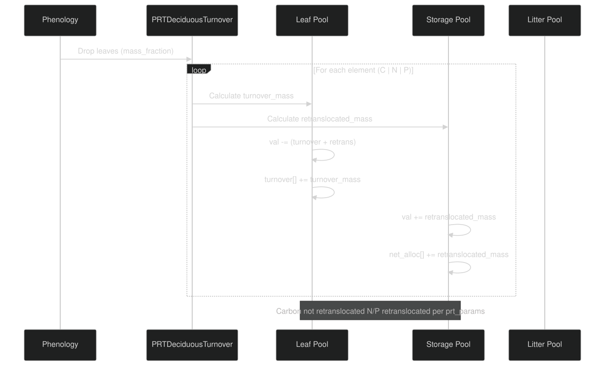
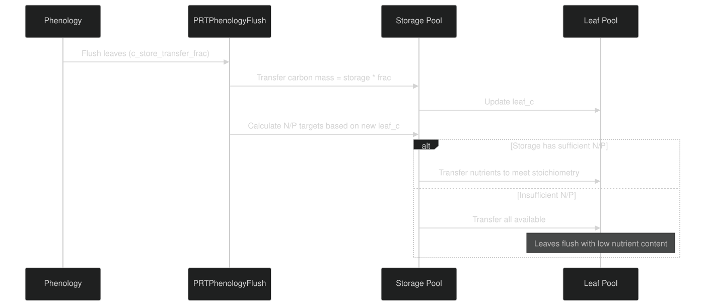
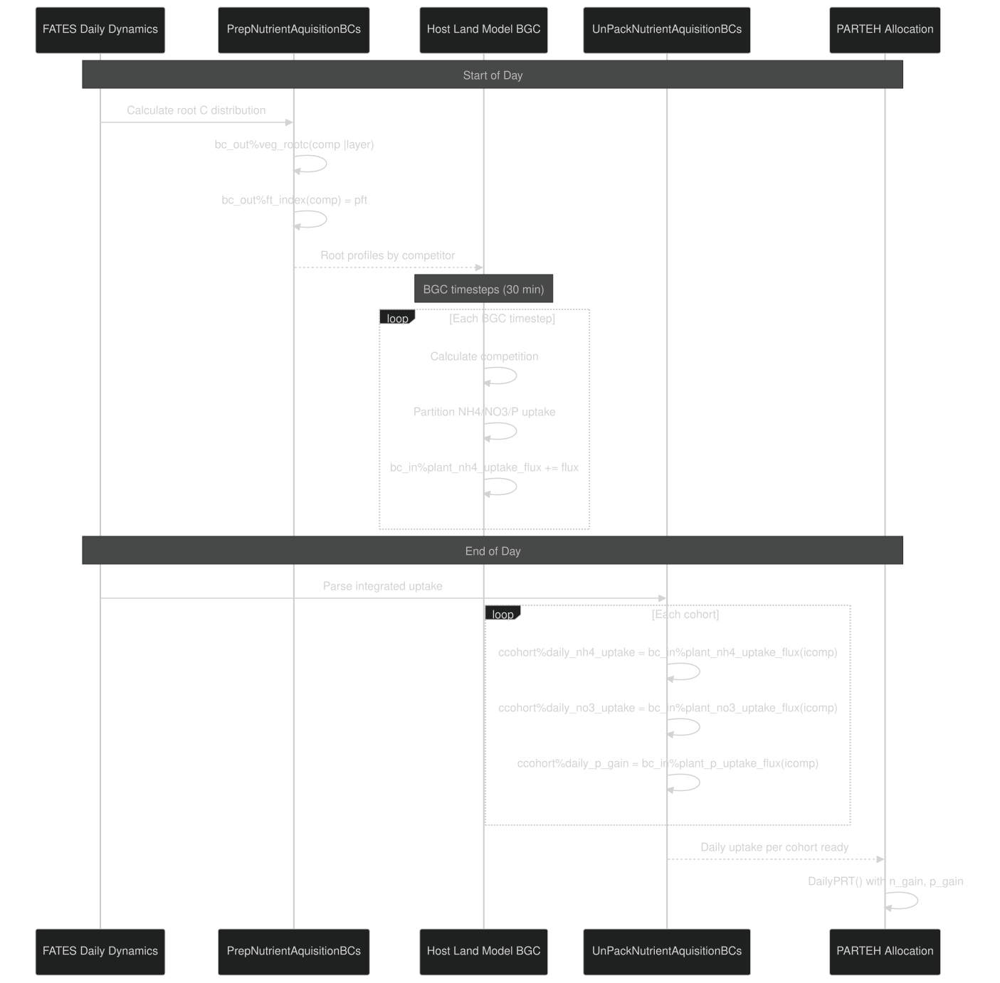
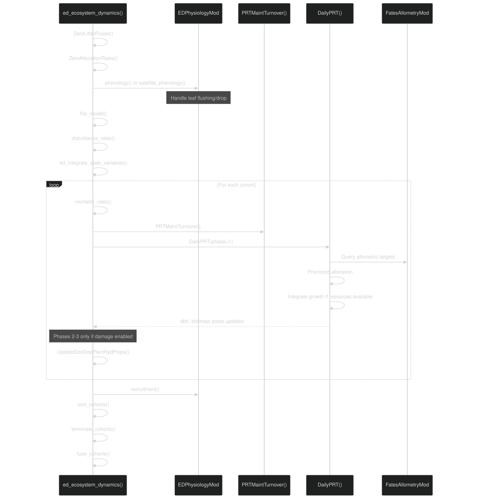

# PARTEH: Plant Allocation System

Relevant source files

- [biogeochem/EDCohortDynamicsMod.F90](https://github.com/jingtao-lbl/fates/blob/e85d9977/biogeochem/EDCohortDynamicsMod.F90)
- [biogeochem/EDPhysiologyMod.F90](https://github.com/jingtao-lbl/fates/blob/e85d9977/biogeochem/EDPhysiologyMod.F90)
- [biogeochem/FatesAllometryMod.F90](https://github.com/jingtao-lbl/fates/blob/e85d9977/biogeochem/FatesAllometryMod.F90)
- [biogeochem/FatesSoilBGCFluxMod.F90](https://github.com/jingtao-lbl/fates/blob/e85d9977/biogeochem/FatesSoilBGCFluxMod.F90)
- [parteh/PRTAllometricCNPMod.F90](https://github.com/jingtao-lbl/fates/blob/e85d9977/parteh/PRTAllometricCNPMod.F90)
- [parteh/PRTAllometricCarbonMod.F90](https://github.com/jingtao-lbl/fates/blob/e85d9977/parteh/PRTAllometricCarbonMod.F90)
- [parteh/PRTGenericMod.F90](https://github.com/jingtao-lbl/fates/blob/e85d9977/parteh/PRTGenericMod.F90)
- [parteh/PRTLossFluxesMod.F90](https://github.com/jingtao-lbl/fates/blob/e85d9977/parteh/PRTLossFluxesMod.F90)

## Purpose and Scope

PARTEH (Plant Allocation and Reactive Transport Extensible Hypotheses) is FATES' framework for managing plant carbon and nutrient allocation, growth, and reactive transport. This page documents the PARTEH architecture, its allocation hypotheses, and integration with FATES ecosystem dynamics.

For information about the allometric relationships used by PARTEH to calculate target biomass, see [Allometric Relationships](../plant-physiology/allometry.md) . For nutrient uptake from soil, see [Soil-Plant Nutrient Interface](../plant-physiology/parteh/soil_plant_interface.md) . For phenology that drives leaf flushing and turnover, see [Phenology and Leaf Dynamics](../plant-physiology/phenology.md) .

This page covers:

- PARTEH architecture and extensible hypothesis framework
- Carbon-only and CNP allocation strategies
- State variables, boundary conditions, and mass conservation
- Daily allocation workflow and prioritization schemes
- Loss fluxes (turnover, damage, fire)
- Integration points with FATES cohort dynamics

## Architecture Overview

PARTEH uses object-oriented design to support multiple allocation hypotheses. Each plant cohort contains a PARTEH object ( `prt` ) that manages its carbon and nutrient pools. The framework separates hypothesis-specific algorithms (extended classes) from generic operations (base class).

### Class Hierarchy

Sources:  [parteh/PRTGenericMod.F90 233-277](https://github.com/jingtao-lbl/fates/blob/e85d9977/parteh/PRTGenericMod.F90#L233-L277)  [parteh/PRTAllometricCarbonMod.F90 136-143](https://github.com/jingtao-lbl/fates/blob/e85d9977/parteh/PRTAllometricCarbonMod.F90#L136-L143)  [parteh/PRTAllometricCNPMod.F90 250-266](https://github.com/jingtao-lbl/fates/blob/e85d9977/parteh/PRTAllometricCNPMod.F90#L250-L266)

### Key Design Principles

| Principle | Implementation | 
| --- | --- |
| Extensibility | New hypotheses extend prt_vartypes base class | 
| Hypothesis Selection | hlm_parteh_mode determines which class to instantiate | 
| Generic Operations | Base class provides GetState, SetState, mass checking | 
| Organ Mapping | prt_global maps variables to organs × elements | 
| Mass Conservation | All fluxes tracked: net_alloc, turnover, burned, damaged | 

Sources:  [parteh/PRTGenericMod.F90 1-40](https://github.com/jingtao-lbl/fates/blob/e85d9977/parteh/PRTGenericMod.F90#L1-L40)  [parteh/PRTGenericMod.F90 233-277](https://github.com/jingtao-lbl/fates/blob/e85d9977/parteh/PRTGenericMod.F90#L233-L277)

## State Variables and Data Structures

### State Variable Structure

Each plant pool (e.g., leaf carbon) is represented as a `prt_vartype` object containing state and fluxes:

Mass balance constraint:  `val = val0 + net_alloc - turnover - burned - damaged`

Sources:  [parteh/PRTGenericMod.F90 179-200](https://github.com/jingtao-lbl/fates/blob/e85d9977/parteh/PRTGenericMod.F90#L179-L200)

### Organ and Element Mapping

PARTEH organizes state variables by organ (leaf, fine root, sapwood, storage, reproduction, structure) and element (C12, N, P):

| Organ ID | Constant | Description | 
| --- | --- | --- |
| 1 | leaf_organ | Photosynthetic tissues | 
| 2 | fnrt_organ | Fine roots for uptake | 
| 3 | sapw_organ | Sapwood for transport | 
| 4 | store_organ | Non-structural storage | 
| 5 | repro_organ | Seeds, fruits | 
| 6 | struct_organ | Dead structural biomass | 

| Element ID | Constant | Description | 
| --- | --- | --- |
| 1 | carbon12_element | C12 isotope | 
| 4 | nitrogen_element | Nitrogen | 
| 5 | phosphorus_element | Phosphorus | 

The `prt_global%sp_organ_map(organ, element)` array maps each organ × element combination to a variable index.

Sources:  [parteh/PRTGenericMod.F90 78-86](https://github.com/jingtao-lbl/fates/blob/e85d9977/parteh/PRTGenericMod.F90#L78-L86)  [parteh/PRTGenericMod.F90 97-107](https://github.com/jingtao-lbl/fates/blob/e85d9977/parteh/PRTGenericMod.F90#L97-L107)  [parteh/PRTGenericMod.F90 354-392](https://github.com/jingtao-lbl/fates/blob/e85d9977/parteh/PRTGenericMod.F90#L354-L392)

### Boundary Conditions

PARTEH exchanges information with FATES through boundary conditions:

Boundary conditions are stored in `bc_in` , `bc_inout` , and `bc_out` arrays within each `prt_vartypes` object.

Sources:  [parteh/PRTAllometricCarbonMod.F90 99-118](https://github.com/jingtao-lbl/fates/blob/e85d9977/parteh/PRTAllometricCarbonMod.F90#L99-L118)  [parteh/PRTAllometricCNPMod.F90 152-191](https://github.com/jingtao-lbl/fates/blob/e85d9977/parteh/PRTAllometricCNPMod.F90#L152-L191)

## Allocation Hypotheses

FATES currently implements two allocation hypotheses, selectable via the `hlm_parteh_mode` parameter.

### Hypothesis Comparison

| Aspect | Carbon-Only (prt_carbon_allom_hyp) | CNP Flexible (prt_cnp_flex_allom_hyp) | 
| --- | --- | --- |
| Elements | Carbon only | Carbon, nitrogen, phosphorus | 
| Class | callom_prt_vartypes | cnp_allom_prt_vartypes | 
| Module | PRTAllometricCarbonMod | PRTAllometricCNPMod | 
| State Variables | 6 (C pools × organs) | 18 (3 elements × 6 organs) | 
| Nutrient Limitation | None | N and P can limit growth | 
| L2FR | Fixed parameter | Dynamic via PID controller | 
| Stoichiometry | N/A | Enforced via prioritized replacement | 
| Exudation | None | Excess C/N/P can be exuded | 

Sources:  [parteh/PRTAllometricCarbonMod.F90 1-12](https://github.com/jingtao-lbl/fates/blob/e85d9977/parteh/PRTAllometricCarbonMod.F90#L1-L12)  [parteh/PRTAllometricCNPMod.F90 1-12](https://github.com/jingtao-lbl/fates/blob/e85d9977/parteh/PRTAllometricCNPMod.F90#L1-L12)

### Hypothesis Selection and Initialization

The `InitPRTObject()` function allocates the appropriate extended class based on `hlm_parteh_mode` , then calls the generic `InitPRTVartype()` to set up state arrays.

Sources:  [biogeochem/EDCohortDynamicsMod.F90 293-342](https://github.com/jingtao-lbl/fates/blob/e85d9977/biogeochem/EDCohortDynamicsMod.F90#L293-L342)

## Carbon-Only Allocation

The carbon-only hypothesis ( `callom_prt_vartypes` ) implements allometric growth where all pools are functions of diameter. This is FATES' simpler allocation mode.

### State Variables

The carbon-only hypothesis tracks 6 state variables, all carbon pools:

| Variable ID | Symbol | Organ | Positions | 
| --- | --- | --- | --- |
| leaf_c_id | leaf_c | Leaf | 1-4 (by age) | 
| fnrt_c_id | fnrt_c | Fine root | 1 | 
| sapw_c_id | sapw_c | Sapwood | 1 | 
| store_c_id | store_c | Storage | 1 | 
| repro_c_id | repro_c | Reproduction | 1 | 
| struct_c_id | struct_c | Structure | 1 | 

Leaves have multiple age classes for tracking turnover; other organs have single pools.

Sources:  [parteh/PRTAllometricCarbonMod.F90 76-82](https://github.com/jingtao-lbl/fates/blob/e85d9977/parteh/PRTAllometricCarbonMod.F90#L76-L82)

### Daily Allocation Workflow

Sources:  [parteh/PRTAllometricCarbonMod.F90 260-708](https://github.com/jingtao-lbl/fates/blob/e85d9977/parteh/PRTAllometricCarbonMod.F90#L260-L708)

### Key Features

Sources:  [parteh/PRTAllometricCarbonMod.F90 260-300](https://github.com/jingtao-lbl/fates/blob/e85d9977/parteh/PRTAllometricCarbonMod.F90#L260-L300)

## CNP Allocation and Nutrient Dynamics

The CNP hypothesis ( `cnp_allom_prt_vartypes` ) extends allocation to include nitrogen and phosphorus, with nutrient limitation, dynamic stoichiometry, and prioritized replacement schemes.

### State Variables

The CNP hypothesis tracks 18 state variables (6 organs × 3 elements):

Sources:  [parteh/PRTAllometricCNPMod.F90 86-106](https://github.com/jingtao-lbl/fates/blob/e85d9977/parteh/PRTAllometricCNPMod.F90#L86-L106)

### Daily Allocation Workflow

Sources:  [parteh/PRTAllometricCNPMod.F90 370-677](https://github.com/jingtao-lbl/fates/blob/e85d9977/parteh/PRTAllometricCNPMod.F90#L370-L677)

### Three-Phase Allocation

The CNP hypothesis uses a three-phase allocation strategy:
Phase 1: Prioritized Replacement
Brings all pools up to their allometric targets, with priority ordering:

This phase ensures plants maintain their functional tissues before attempting growth.

Sources:  [parteh/PRTAllometricCNPMod.F90 685-1024](https://github.com/jingtao-lbl/fates/blob/e85d9977/parteh/PRTAllometricCNPMod.F90#L685-L1024)
Phase 2: Stature Growth
If carbon remains after replacement, the plant grows in stature (DBH increases):

Sources:  [parteh/PRTAllometricCNPMod.F90 1026-1425](https://github.com/jingtao-lbl/fates/blob/e85d9977/parteh/PRTAllometricCNPMod.F90#L1026-L1425)
Phase 3: Allocate Remainder
After stature growth, handle any remaining resources:

- **Reproduction**: If prioritized, allocate to reproduction with balanced CNP
- **Storage**: Fill storage to targets
- **Exudation**: If storage is full, exude excess C/N/P to soil

Sources:  [parteh/PRTAllometricCNPMod.F90 1765-1964](https://github.com/jingtao-lbl/fates/blob/e85d9977/parteh/PRTAllometricCNPMod.F90#L1765-L1964)

### Nutrient Limitation

The CNP hypothesis explicitly tracks which nutrient limits growth:

| Limiter | Condition | Effect | 
| --- | --- | --- |
| c_limited | C most limiting | Full carbon gain used | 
| n_limited | N most limiting | Only use c_equiv_n | 
| p_limited | P most limiting | Only use c_equiv_p | 
| cnp_limited | Co-limitation | Use minimum of all three | 

The `bc_out(acnp_bc_out_id_limiter)` boundary condition reports the limiting factor.

Sources:  [parteh/PRTAllometricCNPMod.F90 222-227](https://github.com/jingtao-lbl/fates/blob/e85d9977/parteh/PRTAllometricCNPMod.F90#L222-L227)

### Dynamic Leaf-to-Fine-Root Ratio

Unlike carbon-only allocation where L2FR is fixed, the CNP hypothesis adjusts L2FR dynamically based on nutrient status:

This allows plants to optimize their leaf vs. root allocation based on whether nutrients or light are more limiting.

Sources:  [parteh/PRTAllometricCNPMod.F90 1997-2177](https://github.com/jingtao-lbl/fates/blob/e85d9977/parteh/PRTAllometricCNPMod.F90#L1997-L2177)

## Loss Fluxes

PARTEH tracks several types of biomass loss from living plants through the `PRTLossFluxesMod` module.

### Loss Flux Types

Sources:  [parteh/PRTLossFluxesMod.F90 1-70](https://github.com/jingtao-lbl/fates/blob/e85d9977/parteh/PRTLossFluxesMod.F90#L1-L70)

### Maintenance Turnover

Continuous background losses from all organs except storage:

| Organ | Turnover Parameter | Retranslocation | 
| --- | --- | --- |
| Leaf | leaf_long | N/P: turnover_nitr_retrans, turnover_phos_retrans | 
| Fine root | root_long | N/P: retranslocation parameters | 
| Sapwood | (senescence to structure) | None | 
| Structure | None (dead) | None | 

The turnover rate for each pool is:

For nutrients, a fraction is retranslocated to storage before loss:

Sources:  [parteh/PRTLossFluxesMod.F90 630-837](https://github.com/jingtao-lbl/fates/blob/e85d9977/parteh/PRTLossFluxesMod.F90#L630-L837)

### Deciduous Turnover

Event-based losses during phenology transitions:

Sources:  [parteh/PRTLossFluxesMod.F90 461-627](https://github.com/jingtao-lbl/fates/blob/e85d9977/parteh/PRTLossFluxesMod.F90#L461-L627)

### Phenology Flush

When deciduous leaves flush, storage is drawn down:

Sources:  [parteh/PRTLossFluxesMod.F90 73-277](https://github.com/jingtao-lbl/fates/blob/e85d9977/parteh/PRTLossFluxesMod.F90#L73-L277)

### Fire and Damage Losses

Fire and damage losses are simpler—mass leaves the plant without retranslocation:

These losses are tracked separately in the `burned[]` and `damaged[]` arrays to distinguish them from turnover in mass balance diagnostics.

Sources:  [parteh/PRTLossFluxesMod.F90 281-389](https://github.com/jingtao-lbl/fates/blob/e85d9977/parteh/PRTLossFluxesMod.F90#L281-L389)

## Nutrient Acquisition

PARTEH interfaces with the soil biogeochemistry model through `FatesSoilBGCFluxMod` to acquire nitrogen and phosphorus.

### Nutrient Competition Modes

FATES supports two nutrient competition schemes:

| Mode | Description | BC Structure | 
| --- | --- | --- |
| RD (Relative Demand) | Simple demand-based partitioning | 1 competitor (all plants pooled) | 
| ECA (Equilibrium Chemistry Approximation) | Complex competition with microbial decomposers | 1 competitor per cohort | 

The mode is selected via `hlm_nu_com` and affects how `PrepNutrientAquisitionBCs()` structures the boundary conditions.

Sources:  [biogeochem/FatesSoilBGCFluxMod.F90 401-501](https://github.com/jingtao-lbl/fates/blob/e85d9977/biogeochem/FatesSoilBGCFluxMod.F90#L401-L501)

### Nutrient Uptake Workflow

Sources:  [biogeochem/FatesSoilBGCFluxMod.F90 102-235](https://github.com/jingtao-lbl/fates/blob/e85d9977/biogeochem/FatesSoilBGCFluxMod.F90#L102-L235)  [biogeochem/FatesSoilBGCFluxMod.F90 401-501](https://github.com/jingtao-lbl/fates/blob/e85d9977/biogeochem/FatesSoilBGCFluxMod.F90#L401-L501)

### Root Distribution

Nutrient uptake is proportional to fine root carbon distribution:

Where `rootfrac(layer)` is calculated by `set_root_fraction()` based on the PFT's rooting profile parameters.

Sources:  [biogeochem/FatesSoilBGCFluxMod.F90 468-496](https://github.com/jingtao-lbl/fates/blob/e85d9977/biogeochem/FatesSoilBGCFluxMod.F90#L468-L496)

### Prescribed vs. Coupled Uptake

| Mode | n_uptake_mode | Uptake Calculation | 
| --- | --- | --- |
| Prescribed | prescribed_n_uptake | uptake = fnrt_c * vmax * prescribed_nuptake * sec_per_day | 
| Coupled | coupled_n_uptake | uptake = bc_in%plant_nh4_uptake_flux(icomp) + bc_in%plant_no3_uptake_flux(icomp) | 

Prescribed mode is useful for spin-up or when running without a coupled BGC model. Coupled mode allows full competition between plants and soil microbes.

Sources:  [biogeochem/FatesSoilBGCFluxMod.F90 155-225](https://github.com/jingtao-lbl/fates/blob/e85d9977/biogeochem/FatesSoilBGCFluxMod.F90#L155-L225)

## Integration with FATES Ecosystem Dynamics

### Cohort Creation and PARTEH Initialization

Sources:  [biogeochem/EDCohortDynamicsMod.F90 160-289](https://github.com/jingtao-lbl/fates/blob/e85d9977/biogeochem/EDCohortDynamicsMod.F90#L160-L289)  [biogeochem/EDCohortDynamicsMod.F90 293-342](https://github.com/jingtao-lbl/fates/blob/e85d9977/biogeochem/EDCohortDynamicsMod.F90#L293-L342)

### Daily Call Sequence

Sources:  [biogeochem/EDPhysiologyMod.F90 1-200](https://github.com/jingtao-lbl/fates/blob/e85d9977/biogeochem/EDPhysiologyMod.F90#L1-L200) Diagram 2 from high-level overview

### Mass Balance Verification

After daily allocation, PARTEH verifies mass conservation:

This check ensures that all fluxes are properly accounted for and no mass is created or destroyed.

Sources:  [parteh/PRTGenericMod.F90 915-1005](https://github.com/jingtao-lbl/fates/blob/e85d9977/parteh/PRTGenericMod.F90#L915-L1005)

### Cohort Fusion

When cohorts are fused, their PARTEH objects are merged using weighted averages:

The `WeightedFusePRTVartypes()` method handles this for all state variables and fluxes.

Sources:  [parteh/PRTGenericMod.F90 1137-1231](https://github.com/jingtao-lbl/fates/blob/e85d9977/parteh/PRTGenericMod.F90#L1137-L1231)

## Summary

PARTEH provides an extensible framework for plant allocation in FATES:

The hypothesis system allows new allocation schemes to be added by extending `prt_vartypes` and implementing the required methods ( `DailyPRT` , `FastPRT` ), making PARTEH a flexible platform for testing allocation theories.

Sources:  [parteh/PRTGenericMod.F90 1-40](https://github.com/jingtao-lbl/fates/blob/e85d9977/parteh/PRTGenericMod.F90#L1-L40)  [parteh/PRTAllometricCarbonMod.F90 1-80](https://github.com/jingtao-lbl/fates/blob/e85d9977/parteh/PRTAllometricCarbonMod.F90#L1-L80)  [parteh/PRTAllometricCNPMod.F90 1-80](https://github.com/jingtao-lbl/fates/blob/e85d9977/parteh/PRTAllometricCNPMod.F90#L1-L80)