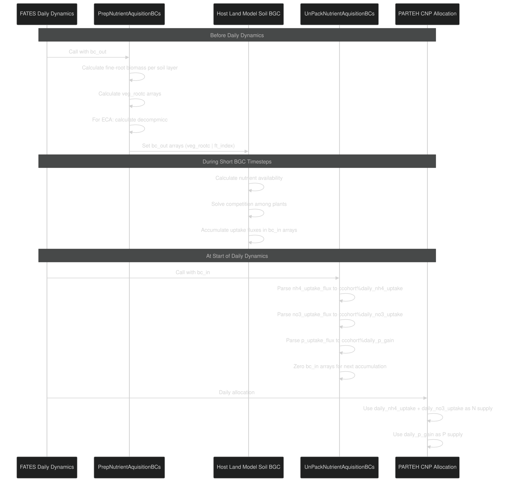

# Soil-Plant Nutrient Interface

Relevant source files

- [biogeochem/EDCohortDynamicsMod.F90](https://github.com/jingtao-lbl/fates/blob/e85d9977/biogeochem/EDCohortDynamicsMod.F90)
- [biogeochem/EDPhysiologyMod.F90](https://github.com/jingtao-lbl/fates/blob/e85d9977/biogeochem/EDPhysiologyMod.F90)
- [biogeochem/FatesAllometryMod.F90](https://github.com/jingtao-lbl/fates/blob/e85d9977/biogeochem/FatesAllometryMod.F90)
- [biogeochem/FatesSoilBGCFluxMod.F90](https://github.com/jingtao-lbl/fates/blob/e85d9977/biogeochem/FatesSoilBGCFluxMod.F90)
- [parteh/PRTAllometricCNPMod.F90](https://github.com/jingtao-lbl/fates/blob/e85d9977/parteh/PRTAllometricCNPMod.F90)
- [parteh/PRTAllometricCarbonMod.F90](https://github.com/jingtao-lbl/fates/blob/e85d9977/parteh/PRTAllometricCarbonMod.F90)
- [parteh/PRTGenericMod.F90](https://github.com/jingtao-lbl/fates/blob/e85d9977/parteh/PRTGenericMod.F90)
- [parteh/PRTLossFluxesMod.F90](https://github.com/jingtao-lbl/fates/blob/e85d9977/parteh/PRTLossFluxesMod.F90)

## Purpose and Scope

This document describes how FATES plants acquire nitrogen (N) and phosphorus (P) from soil and how nutrients flow between the soil biogeochemistry model and plant tissues. The interface handles nutrient demand calculation, uptake from soil, competition among plants, and nutrient efflux back to soil. This system is active only when running with CNP allocation hypotheses (see [CNP Allocation and Nutrient Dynamics](../plant-physiology/parteh/cnp_allocation.md) ). For the broader context of plant allocation, see [PARTEH: Plant Allocation System](../plant-physiology/parteh/index.md) .

The primary implementation resides in [biogeochem/FatesSoilBGCFluxMod.F90 1-1024](https://github.com/jingtao-lbl/fates/blob/e85d9977/biogeochem/FatesSoilBGCFluxMod.F90#L1-L1024)

## Nutrient Uptake Pipeline

The soil-plant nutrient interface operates on a daily timestep, coordinating nutrient flows between the host land model's soil biogeochemistry and FATES plant cohorts. The process involves three main phases: preparation of uptake boundary conditions, soil BGC calculation of actual uptake, and distribution of acquired nutrients to cohorts.

Diagram: Nutrient Uptake Pipeline

Sources: [biogeochem/FatesSoilBGCFluxMod.F90 101-235](https://github.com/jingtao-lbl/fates/blob/e85d9977/biogeochem/FatesSoilBGCFluxMod.F90#L101-L235)  [biogeochem/FatesSoilBGCFluxMod.F90 401-501](https://github.com/jingtao-lbl/fates/blob/e85d9977/biogeochem/FatesSoilBGCFluxMod.F90#L401-L501)

## Nutrient Demand Calculation

Each cohort calculates its nutrient demand based on fine-root biomass and PFT-specific maximum uptake rates ( `vmax` ). The demand represents the maximum amount of nutrient the plant could acquire if soil supply were unlimited.

Nitrogen Demand:

Phosphorus Demand:

Where `fnrt_c` is fine-root carbon mass [kg/plant] and `vmax_*` parameters have units [kg_nutrient / kg_fineroot_C / second].

Diagram: Demand Calculation in Code

Sources: [biogeochem/FatesSoilBGCFluxMod.F90 162-166](https://github.com/jingtao-lbl/fates/blob/e85d9977/biogeochem/FatesSoilBGCFluxMod.F90#L162-L166)  [biogeochem/FatesSoilBGCFluxMod.F90 201-202](https://github.com/jingtao-lbl/fates/blob/e85d9977/biogeochem/FatesSoilBGCFluxMod.F90#L201-L202)  [biogeochem/FatesSoilBGCFluxMod.F90 218-219](https://github.com/jingtao-lbl/fates/blob/e85d9977/biogeochem/FatesSoilBGCFluxMod.F90#L218-L219)

## Uptake Modes: Prescribed vs Coupled

FATES supports two modes for nutrient uptake, controlled by `n_uptake_mode` and `p_uptake_mode` parameters.

### Prescribed Uptake Mode

In prescribed mode ( `prescribed_n_uptake` or `prescribed_p_uptake` ), plants receive a fixed fraction of their demand, independent of soil nutrient availability. This mode is useful for simulations where soil BGC is not being modeled or for sensitivity experiments.

Implementation:

The `prescribed_nuptake` parameter is a PFT-specific fraction [0-1] determining what fraction of maximum uptake rate is achieved.

Sources: [biogeochem/FatesSoilBGCFluxMod.F90 155-171](https://github.com/jingtao-lbl/fates/blob/e85d9977/biogeochem/FatesSoilBGCFluxMod.F90#L155-L171)  [biogeochem/FatesSoilBGCFluxMod.F90 194-206](https://github.com/jingtao-lbl/fates/blob/e85d9977/biogeochem/FatesSoilBGCFluxMod.F90#L194-L206)

### Coupled Uptake Mode

In coupled mode ( `coupled_n_uptake` or `coupled_p_uptake` ), the host land model's soil BGC explicitly calculates nutrient uptake based on soil availability, root distribution, and competition among plants. FATES provides root biomass profiles and receives back the actual uptake fluxes.

Data Flow:

Sources: [biogeochem/FatesSoilBGCFluxMod.F90 172-191](https://github.com/jingtao-lbl/fates/blob/e85d9977/biogeochem/FatesSoilBGCFluxMod.F90#L172-L191)  [biogeochem/FatesSoilBGCFluxMod.F90 208-225](https://github.com/jingtao-lbl/fates/blob/e85d9977/biogeochem/FatesSoilBGCFluxMod.F90#L208-L225)

## Competition Mechanisms

When coupling with soil BGC, FATES supports two competition methods ( `hlm_nu_com` ): Relative Demand (RD) and Equilibrium Chemistry Approximation (ECA). Additionally, there are two scaling approaches ( `fates_np_comp_scaling` ): trivial and coupled.

### Competition Method Comparison

| Feature | RD (Relative Demand) | ECA (Equilibrium Chemistry Approximation) | 
| --- | --- | --- |
| Primary concept | Nutrients partitioned by relative demand | Nutrient uptake based on root-microbe equilibrium | 
| Required inputs from FATES | veg_rootc only | veg_rootc, decompmicc, cn_scalar, cp_scalar | 
| Computational complexity | Lower | Higher | 
| Microbial competition | Implicit | Explicit via decompmicc | 

Sources: [biogeochem/FatesSoilBGCFluxMod.F90 434-438](https://github.com/jingtao-lbl/fates/blob/e85d9977/biogeochem/FatesSoilBGCFluxMod.F90#L434-L438)

### ECA Decomposer Biomass Calculation

When using ECA, FATES must provide an estimate of decomposer microbial biomass ( `decompmicc` ) for each soil layer. This uses a depth-attenuation function:

Where:

- `decompmicc_pft_max`: PFT-specific maximum decomposer biomass parameter
- `lambda = 2.5`: Depth attenuation exponent
- `z_max = 0.07 m`: Depth of maximum decomposer biomass

Diagram: ECA Decomposer Biomass Calculation

Sources: [biogeochem/FatesSoilBGCFluxMod.F90 482-492](https://github.com/jingtao-lbl/fates/blob/e85d9977/biogeochem/FatesSoilBGCFluxMod.F90#L482-L492)

### Competitor Scaling: Trivial vs Coupled

The scaling approach determines whether the host land model sees individual cohorts or aggregated vegetation.

Trivial Scaling (`trivial_np_comp_scaling`):

- `icomp = 1`All cohorts aggregated into single competitor ( )
- `bc_out%num_plant_comps = 1`
- Uptake distributed back to cohorts proportionally
- Simpler, fewer boundary condition arrays
- Used when individual cohort competition not needed

Coupled Scaling (`coupled_np_comp_scaling`):

- `icomp`Each cohort is separate competitor ( increments for each cohort)
- `bc_out%num_plant_comps = total_cohort_count`
- Host model explicitly resolves cohort-level competition
- More computationally expensive but more mechanistic

Diagram: Competitor Indexing Logic

Sources: [biogeochem/FatesSoilBGCFluxMod.F90 440-465](https://github.com/jingtao-lbl/fates/blob/e85d9977/biogeochem/FatesSoilBGCFluxMod.F90#L440-L465)  [biogeochem/FatesSoilBGCFluxMod.F90 453-496](https://github.com/jingtao-lbl/fates/blob/e85d9977/biogeochem/FatesSoilBGCFluxMod.F90#L453-L496)

## Root Distribution and Vertical Profiles

Nutrient uptake depends on the vertical distribution of fine roots across soil layers. Each PFT has a characteristic rooting profile that determines what fraction of roots are in each layer.

Root Fraction Calculation:

The function `set_root_fraction` calculates normalized root fractions based on soil layer depths and PFT rooting parameters. This is called before calculating `veg_rootc` :

Where:

- `fnrt_c`: Fine-root carbon per plant [kg C / plant]
- `n_plants`: Number density [plants / ha]
- `rootfrac(id)``id`: Fraction of roots in layer [dimensionless]
- `AREA_INV = 1/10000`: Converts per-hectare to per-m²
- `dz_soil(id)`: Soil layer thickness [m]

Result has units [g C / m³].

Sources: [biogeochem/FatesSoilBGCFluxMod.F90 468-480](https://github.com/jingtao-lbl/fates/blob/e85d9977/biogeochem/FatesSoilBGCFluxMod.F90#L468-L480)  [FatesAllometryMod.F90 125-127](https://github.com/jingtao-lbl/fates/blob/e85d9977/FatesAllometryMod.F90#L125-L127)

Diagram: Root Carbon Calculation Per Layer

Sources: [biogeochem/FatesSoilBGCFluxMod.F90 474-480](https://github.com/jingtao-lbl/fates/blob/e85d9977/biogeochem/FatesSoilBGCFluxMod.F90#L474-L480)

## Nutrient Efflux and Exudation

Plants can exude nutrients back to soil when they cannot use all acquired nutrients. This occurs primarily in the CNP allocation hypothesis when nutrient uptake exceeds growth requirements. The efflux is calculated during the daily PARTEH allocation and returned via output boundary conditions.

Efflux Pathway:

In `PRTAllometricCNPMod` , if a plant acquires more N or P than can be incorporated into new growth (given stoichiometric constraints), the excess can be:

The parameter `store_c_overflow` determines the fate of excess carbon (defined at [parteh/PRTAllometricCNPMod.F90 216-219](https://github.com/jingtao-lbl/fates/blob/e85d9977/parteh/PRTAllometricCNPMod.F90#L216-L219) ).

Output Boundary Conditions:

These are accumulated and sent to the litter pools via `EffluxIntoLitterPools` .

Sources: [parteh/PRTAllometricCNPMod.F90 186-192](https://github.com/jingtao-lbl/fates/blob/e85d9977/parteh/PRTAllometricCNPMod.F90#L186-L192)  [biogeochem/FatesSoilBGCFluxMod.F90 84-90](https://github.com/jingtao-lbl/fates/blob/e85d9977/biogeochem/FatesSoilBGCFluxMod.F90#L84-L90)

## Integration with PARTEH CNP Allocation

The soil-plant nutrient interface provides the daily nutrient uptake that constrains the CNP allocation process. The uptake values are stored in cohort-level variables and accessed by PARTEH as boundary conditions.

Key Cohort Variables:

| Variable | Units | Description | 
| --- | --- | --- |
| ccohort%daily_n_demand | kg N / plant / day | Total potential N uptake | 
| ccohort%daily_nh4_uptake | kg NH4-N / plant / day | Actual ammonium uptake | 
| ccohort%daily_no3_uptake | kg NO3-N / plant / day | Actual nitrate uptake | 
| ccohort%daily_p_demand | kg P / plant / day | Total potential P uptake | 
| ccohort%daily_p_gain | kg P / plant / day | Actual phosphorus uptake | 

PARTEH CNP Access:

During `DailyPRTAllometricCNP` , nutrient gains are accessed via boundary conditions:

- `n_gain => this%bc_inout(acnp_bc_inout_id_netdn)%rval``daily_nh4_uptake + daily_no3_uptake`: Points to
- `p_gain => this%bc_inout(acnp_bc_inout_id_netdp)%rval``daily_p_gain`: Points to

These provide the nutrient supply for the three-phase CNP allocation (see [CNP Allocation and Nutrient Dynamics](../plant-physiology/parteh/cnp_allocation.md) ).

Diagram: Boundary Condition Flow to PARTEH

Sources: [parteh/PRTAllometricCNPMod.F90 388-390](https://github.com/jingtao-lbl/fates/blob/e85d9977/parteh/PRTAllometricCNPMod.F90#L388-L390)  [biogeochem/EDCohortDynamicsMod.F90 111-121](https://github.com/jingtao-lbl/fates/blob/e85d9977/biogeochem/EDCohortDynamicsMod.F90#L111-L121)

## Summary Table: Module Components

| Component | File | Key Routines | Purpose | 
| --- | --- | --- | --- |
| Nutrient demand calculation | FatesSoilBGCFluxMod.F90 | PrepNutrientAquisitionBCs | Calculate fine-root C profiles and nutrient demand | 
| Uptake distribution | FatesSoilBGCFluxMod.F90 | UnPackNutrientAquisitionBCs | Parse uptake fluxes from soil to cohorts | 
| Root profiles | FatesAllometryMod.F90 | set_root_fraction | Vertical distribution of fine roots | 
| Prescribed uptake | EDPftvarcon | vmax_nh4, vmax_no3, vmax_p, prescribed_nuptake | PFT parameters controlling uptake rates | 
| Efflux handling | FatesSoilBGCFluxMod.F90 | EffluxIntoLitterPools | Return excess nutrients to soil | 
| PARTEH integration | PRTAllometricCNPMod.F90 | DailyPRTAllometricCNP | Use uptake in allocation decisions | 

Sources: [biogeochem/FatesSoilBGCFluxMod.F90 1-1024](https://github.com/jingtao-lbl/fates/blob/e85d9977/biogeochem/FatesSoilBGCFluxMod.F90#L1-L1024)  [parteh/PRTAllometricCNPMod.F90 1-5000](https://github.com/jingtao-lbl/fates/blob/e85d9977/parteh/PRTAllometricCNPMod.F90#L1-L5000)