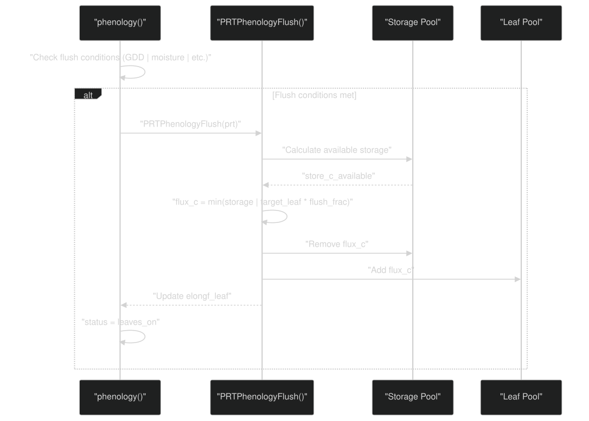
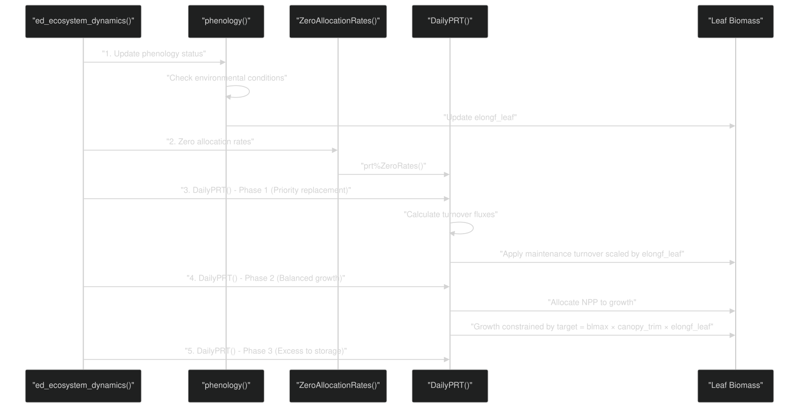

# Phenology and Leaf Dynamics

Relevant source files

- [biogeochem/EDCohortDynamicsMod.F90](https://github.com/jingtao-lbl/fates/blob/e85d9977/biogeochem/EDCohortDynamicsMod.F90)
- [biogeochem/EDPhysiologyMod.F90](https://github.com/jingtao-lbl/fates/blob/e85d9977/biogeochem/EDPhysiologyMod.F90)
- [biogeochem/FatesAllometryMod.F90](https://github.com/jingtao-lbl/fates/blob/e85d9977/biogeochem/FatesAllometryMod.F90)
- [biogeophys/FatesPlantRespPhotosynthMod.F90](https://github.com/jingtao-lbl/fates/blob/e85d9977/biogeophys/FatesPlantRespPhotosynthMod.F90)
- [main/EDParamsMod.F90](https://github.com/jingtao-lbl/fates/blob/e85d9977/main/EDParamsMod.F90)
- [main/EDPftvarcon.F90](https://github.com/jingtao-lbl/fates/blob/e85d9977/main/EDPftvarcon.F90)
- [parameter_files/fates_params_default.cdl](https://github.com/jingtao-lbl/fates/blob/e85d9977/parameter_files/fates_params_default.cdl)

## Purpose and Scope

This page documents the phenology and leaf dynamics system in FATES, which controls the seasonal timing of leaf growth (flushing), maintenance, and shedding (abscission) for different plant functional types (PFTs). Phenology determines when plants have leaves, how much leaf biomass is active, and how leaves respond to environmental conditions such as temperature, moisture, and light availability.

For information about leaf-level photosynthesis and gas exchange, see [Photosynthesis and Respiration](biophysics/photosynthesis.md) . For details on how leaf biomass is allocated through the PARTEH system, see [PARTEH: Plant Allocation System](plant-physiology/parteh/index.md) .

Scope:

- Phenological strategies (evergreen, cold deciduous, drought deciduous)
- Leaf elongation factors and state transitions
- Canopy trimming based on carbon balance
- Leaf area index (LAI) and stem area index (SAI) calculations
- Integration with growth and allocation

Key Module:  [`biogeochem/EDPhysiologyMod.F90`](https://github.com/jingtao-lbl/fates/blob/e85d9977/`biogeochem/EDPhysiologyMod.F90`)

## Phenological Strategies

FATES supports three primary phenological strategies, distinguished by PFT-level parameters:

| Strategy | Parameter Switch | Description | 
| --- | --- | --- |
| Evergreen | season_decid=0 and stress_decid=0 | Maintains leaves year-round, subject only to canopy trimming | 
| Cold Deciduous | season_decid=1 | Drops leaves in response to cold temperatures and short day length, flushes based on growing degree days (GDD) | 
| Drought Deciduous | stress_decid=1 (hard) or stress_decid=2 (semi) | Drops leaves in response to soil moisture stress, flushes when moisture returns | 

Sources:  [biogeochem/EDPhysiologyMod.F90 65-89](https://github.com/jingtao-lbl/fates/blob/e85d9977/biogeochem/EDPhysiologyMod.F90#L65-L89)  [main/EDPftvarcon.F90 1-300](https://github.com/jingtao-lbl/fates/blob/e85d9977/main/EDPftvarcon.F90#L1-L300)

## Phenology State Variables and Tracking

### Cohort-Level State Variables

Each cohort tracks its phenological state through several variables:

Elongation factors control the fraction of maximum allometric biomass that is actually present. An `elongf_leaf` of 1.0 means leaves are fully flushed; 0.0 means completely abscised.

### Site-Level Tracking Variables

The site tracks environmental conditions for phenology decisions:

Sources:  [biogeochem/EDPhysiologyMod.F90 81-90](https://github.com/jingtao-lbl/fates/blob/e85d9977/biogeochem/EDPhysiologyMod.F90#L81-L90)  [biogeochem/FatesCohortMod.F90 1-500](https://github.com/jingtao-lbl/fates/blob/e85d9977/biogeochem/FatesCohortMod.F90#L1-L500)

## Cold Deciduous Phenology State Machine

### Key Parameters for Cold Deciduous

| Parameter | Variable | Typical Value | Description | 
| --- | --- | --- | --- |
| Cold temperature threshold | phen_coldtemp | 7.5°C | Temperature below which cold days accumulate | 
| Cold day limit | phen_ncolddayslim | 5 days | Days below threshold to trigger leaf drop | 
| Min days leaves on | phen_mindayson | 30 days | Minimum duration leaves must remain on | 
| GDD function intercept | phen_a | 100 | GDD threshold equation parameter | 
| GDD function multiplier | phen_b | 100 | GDD threshold equation parameter | 
| GDD function exponent | phen_c | 0.01 | GDD threshold equation parameter | 

GDD Threshold Equation:

This adaptive threshold prevents premature leaf flushing after severe winters by requiring more accumulated warmth when the previous winter was colder (higher NCD).

Sources:  [biogeochem/EDPhysiologyMod.F90 1093-1280](https://github.com/jingtao-lbl/fates/blob/e85d9977/biogeochem/EDPhysiologyMod.F90#L1093-L1280)  [main/EDParamsMod.F90 62-68](https://github.com/jingtao-lbl/fates/blob/e85d9977/main/EDParamsMod.F90#L62-L68)

## Drought Deciduous Phenology State Machine

### Key Concepts for Drought Deciduous

Soil Moisture Potential Thresholds:

- `smpso`: Soil water potential at full stomatal opening (typically -66,000 Pa)
- `smpsc`: Soil water potential at full stomatal closure (typically -255,000 Pa)

Weighted Soil Moisture (`smp_wgt`): The weighted average soil matric potential across all soil layers, weighted by root fraction:

Partial Leaf Shedding (Semi-Deciduous): For `stress_decid=2` (semi), the elongation factor gradually decreases as soil dries:

Sources:  [biogeochem/EDPhysiologyMod.F90 1282-1600](https://github.com/jingtao-lbl/fates/blob/e85d9977/biogeochem/EDPhysiologyMod.F90#L1282-L1600)  [main/EDPftvarcon.F90 75-78](https://github.com/jingtao-lbl/fates/blob/e85d9977/main/EDPftvarcon.F90#L75-L78)

## Elongation Factor Dynamics

The elongation factor ( `elongf_leaf` , `elongf_stem` , `elongf_fnrt` ) is the key variable controlling actual biomass relative to allometric maximum. It ranges from 0.0 (fully abscised) to 1.0 (fully flushed).

### Relationship to Actual Biomass

Function Call Chain:

Sources:  [biogeochem/FatesAllometryMod.F90 554-610](https://github.com/jingtao-lbl/fates/blob/e85d9977/biogeochem/FatesAllometryMod.F90#L554-L610)  [biogeochem/FatesAllometryMod.F90 440-470](https://github.com/jingtao-lbl/fates/blob/e85d9977/biogeochem/FatesAllometryMod.F90#L440-L470)

## Leaf Flushing and Abscission Mechanisms

### Flushing Process

When conditions trigger leaf flushing (e.g., GDD threshold exceeded or moisture adequate), FATES uses the PARTEH system to generate new leaf biomass:

Key Parameter:  `phenflush_fraction` determines the maximum fraction of storage carbon used for leaf flushing (typically 0.5).

Sources:  [biogeochem/EDPhysiologyMod.F90 1093-1280](https://github.com/jingtao-lbl/fates/blob/e85d9977/biogeochem/EDPhysiologyMod.F90#L1093-L1280)  [parteh/PRTLossFluxesMod.F90 1-500](https://github.com/jingtao-lbl/fates/blob/e85d9977/parteh/PRTLossFluxesMod.F90#L1-L500)

### Abscission Process

When leaves drop (due to cold, drought, or day length), FATES transfers biomass to litter:

Retranslocation Parameters:

- `cnp_turnover_nitr_retrans(leaf_organ, ipft)`: Fraction of N reabsorbed (typically 0.5-0.7)
- `cnp_turnover_phos_retrans(leaf_organ, ipft)`: Fraction of P reabsorbed (typically 0.5-0.7)

Sources:  [biogeochem/EDPhysiologyMod.F90 1282-1600](https://github.com/jingtao-lbl/fates/blob/e85d9977/biogeochem/EDPhysiologyMod.F90#L1282-L1600)  [parteh/PRTLossFluxesMod.F90 200-400](https://github.com/jingtao-lbl/fates/blob/e85d9977/parteh/PRTLossFluxesMod.F90#L200-L400)

## Canopy Trimming: Optimizing Leaf Area

Canopy trimming is a mechanism that reduces leaf biomass below the allometric maximum when lower canopy layers have negative carbon balance (i.e., maintenance respiration exceeds photosynthesis). This is separate from phenology and applies to all PFT strategies.

### Trim Calculation Algorithm

### Mathematical Details

The trimming optimization uses a linear least squares fit of net-net uptake vs. cumulative LAI for the bottom `nll` (typically 3) leaf layers:

Variables:

- `x``year_net_uptake[z]``leaf_cost[z]`= - (net-net uptake)
- `y``cumulative_lai_cohort[z]`=

Linear System:  `y = mx + b`

The optimum trim occurs where net-net uptake = 0, giving:

Minimum Elongation: If `elongf_leaf < elongf_min` (0.05), complete abscission is assumed to avoid computational issues with residual tiny amounts.

Sources:  [biogeochem/EDPhysiologyMod.F90 597-1090](https://github.com/jingtao-lbl/fates/blob/e85d9977/biogeochem/EDPhysiologyMod.F90#L597-L1090)

## Leaf Area Index (LAI) and Stem Area Index (SAI)

### Tree-Level LAI Calculation

The `tree_lai()` function converts leaf carbon mass to leaf area index:

Where:

- `leaf_c``prt%GetState(leaf_organ, carbon12_element)`: Leaf carbon [kgC] from
- `SLA_eff`: Effective specific leaf area [m²/kgC], adjusted for canopy depth
- `crown_area`: Crown area of the cohort [m²]

SLA Nitrogen Scaling: SLA varies with canopy depth following nitrogen distribution:

Where `kn` is the nitrogen decay coefficient (typically 0.3-0.5).

Sources:  [biogeochem/FatesAllometryMod.F90 636-754](https://github.com/jingtao-lbl/fates/blob/e85d9977/biogeochem/FatesAllometryMod.F90#L636-L754)

### Tree-Level SAI Calculation

Stem Area Index (SAI) represents the area of woody stems and branches:

The parameter `allom_sai_scaler` is typically in the range 0.05-0.15 (stems are 5-15% of leaf area).

Sources:  [biogeochem/FatesAllometryMod.F90 756-850](https://github.com/jingtao-lbl/fates/blob/e85d9977/biogeochem/FatesAllometryMod.F90#L756-L850)

### Vertical LAI Profiles

FATES distributes total cohort LAI across vertical leaf layers for radiative transfer:

The array `tlai_profile(cl, ft, iv)` is indexed by:

- `cl``nclmax`: Canopy layer (1 to , typically 2)
- `ft`: Functional type (PFT index)
- `iv``nlevleaf`: Vertical leaf layer (1 to , typically 30)

Sources:  [biogeochem/FatesAllometryMod.F90 636-850](https://github.com/jingtao-lbl/fates/blob/e85d9977/biogeochem/FatesAllometryMod.F90#L636-L850)  [biogeophys/EDSurfaceAlbedoMod.F90 1-500](https://github.com/jingtao-lbl/fates/blob/e85d9977/biogeophys/EDSurfaceAlbedoMod.F90#L1-L500)

## Integration with PARTEH Allocation

Phenology interacts with the PARTEH allocation system in several ways:

### Daily Allocation Sequence

### Key Interactions

Sources:  [biogeochem/EDPhysiologyMod.F90 1-200](https://github.com/jingtao-lbl/fates/blob/e85d9977/biogeochem/EDPhysiologyMod.F90#L1-L200)  [parteh/PRTAllometricCarbonMod.F90 1-1000](https://github.com/jingtao-lbl/fates/blob/e85d9977/parteh/PRTAllometricCarbonMod.F90#L1-L1000)  [parteh/PRTAllometricCNPMod.F90 1-2000](https://github.com/jingtao-lbl/fates/blob/e85d9977/parteh/PRTAllometricCNPMod.F90#L1-L2000)

## Key Phenology-Related Functions

| Function | Location | Purpose | 
| --- | --- | --- |
| phenology() | EDPhysiologyMod.F901093-1780 | Main phenology routine; updates status, elongation factors, GDD, NCD | 
| satellite_phenology() | EDPhysiologyMod.F901782-2050 | Alternative phenology driven by prescribed LAI data | 
| trim_canopy() | EDPhysiologyMod.F90597-1090 | Optimizes leaf area based on carbon balance | 
| bleaf() | FatesAllometryMod.F90554-610 | Calculates actual leaf biomass with trimming, damage, elongation | 
| blmax_allom() | FatesAllometryMod.F90440-470 | Calculates maximum allometric leaf biomass | 
| tree_lai() | FatesAllometryMod.F90636-754 | Converts leaf carbon to LAI | 
| tree_sai() | FatesAllometryMod.F90756-850 | Calculates stem area index | 
| PRTPhenologyFlush() | parteh/PRTLossFluxesMod.F901-200 | Transfers storage carbon to leaves during flushing | 
| PRTDeciduousTurnover() | parteh/PRTLossFluxesMod.F90200-400 | Transfers leaf biomass to litter during abscission | 

## Important Phenology Parameters

### Global Parameters (EDParamsMod)

| Parameter | Name | Default | Description | 
| --- | --- | --- | --- |
| ED_val_phen_a | fates_phen_gddthresh_a | 100 | GDD threshold equation intercept | 
| ED_val_phen_b | fates_phen_gddthresh_b | 100 | GDD threshold equation multiplier | 
| ED_val_phen_c | fates_phen_gddthresh_c | 0.01 | GDD threshold equation exponent | 
| ED_val_phen_coldtemp | fates_phen_coldtemp | 7.5°C | Cold temperature threshold | 
| ED_val_phen_chiltemp | fates_phen_chilltemp | 5°C | Chilling requirement threshold | 
| ED_val_phen_mindayson | fates_phen_mindayson | 30 days | Minimum days leaves must stay on | 
| ED_val_phen_ncolddayslim | fates_phen_ncolddayslim | 5 days | Cold days threshold for leaf drop | 

Sources:  [main/EDParamsMod.F90 62-68](https://github.com/jingtao-lbl/fates/blob/e85d9977/main/EDParamsMod.F90#L62-L68)  [main/EDParamsMod.F90 174-180](https://github.com/jingtao-lbl/fates/blob/e85d9977/main/EDParamsMod.F90#L174-L180)

### PFT-Specific Parameters (EDPftvarcon)

| Parameter | Name | Units | Description | 
| --- | --- | --- | --- |
| season_decid | fates_phen_season_decid | flag | 1=cold deciduous, 0=not | 
| stress_decid | fates_phen_stress_decid | flag | 1=hard drought decid, 2=semi, 0=not | 
| phenflush_fraction | fates_phen_flush_fraction | fraction | Max storage fraction for flushing | 
| phen_cold_size_threshold | fates_phen_cold_size_threshold | cm | DBH threshold for non-woody cold decid | 
| smpso | fates_nonhydro_smpso | mm H₂O | Soil moisture at full stomatal opening | 
| smpsc | fates_nonhydro_smpsc | mm H₂O | Soil moisture at full stomatal closure | 

Sources:  [main/EDPftvarcon.F90 1-300](https://github.com/jingtao-lbl/fates/blob/e85d9977/main/EDPftvarcon.F90#L1-L300)  [parameter_files/fates_params_default.cdl 1-1000](https://github.com/jingtao-lbl/fates/blob/e85d9977/parameter_files/fates_params_default.cdl#L1-L1000)

## Satellite Phenology Mode

FATES supports an alternative phenology mode ( `satellite_phenology()` ) that uses prescribed LAI time series instead of prognostic phenology:

### Key Differences from Prognostic Phenology

### When to Use

- **Evaluation Studies:**Comparing model output to observations while removing phenology uncertainty
- **Historical Reconstructions:**Using satellite LAI products to constrain leaf area
- **Sensitivity Studies:**Isolating effects of leaf area from phenological triggers

Activation: Set `use_fates_sp = .true.` in the host model configuration.

Sources:  [biogeochem/EDPhysiologyMod.F90 1782-2050](https://github.com/jingtao-lbl/fates/blob/e85d9977/biogeochem/EDPhysiologyMod.F90#L1782-L2050)

## Phenology Constants and Type Definitions

### Leaf Status Constants

### Cold Status Constants

### Drought Status Constants

Sources:  [biogeochem/FatesConstantsMod.F90 65-75](https://github.com/jingtao-lbl/fates/blob/e85d9977/biogeochem/FatesConstantsMod.F90#L65-L75)  [main/EDTypesMod.F90 81-90](https://github.com/jingtao-lbl/fates/blob/e85d9977/main/EDTypesMod.F90#L81-L90)

## Summary Diagram: Phenology System Architecture

Sources:  [biogeochem/EDPhysiologyMod.F90 1-2050](https://github.com/jingtao-lbl/fates/blob/e85d9977/biogeochem/EDPhysiologyMod.F90#L1-L2050)  [biogeochem/FatesAllometryMod.F90 1-1000](https://github.com/jingtao-lbl/fates/blob/e85d9977/biogeochem/FatesAllometryMod.F90#L1-L1000)  [parteh/PRTLossFluxesMod.F90 1-500](https://github.com/jingtao-lbl/fates/blob/e85d9977/parteh/PRTLossFluxesMod.F90#L1-L500)