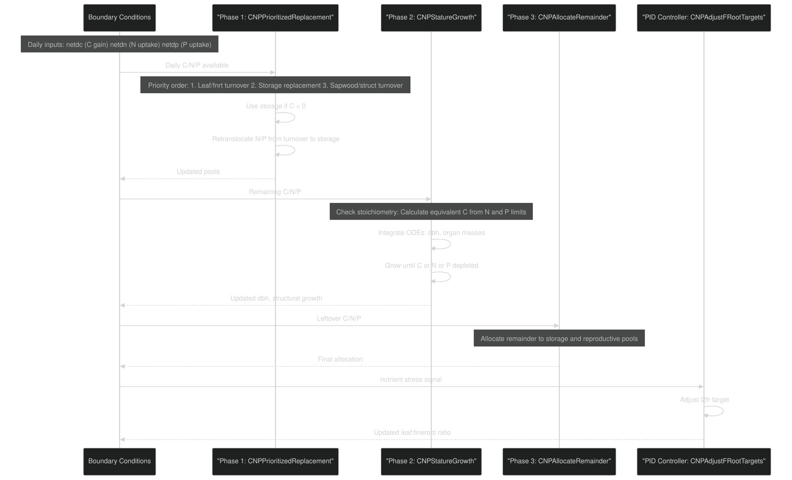
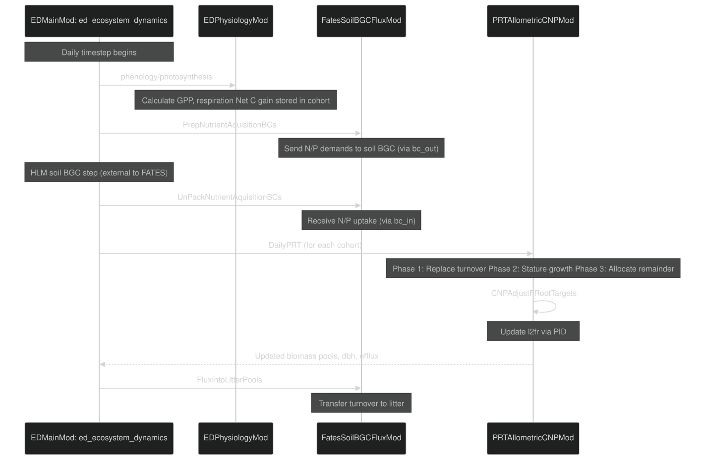

n# CNP Allocation and Nutrient Dynamics

Relevant source files

- [biogeochem/FatesSoilBGCFluxMod.F90](https://github.com/jingtao-lbl/fates/blob/e85d9977/biogeochem/FatesSoilBGCFluxMod.F90)
- [biogeophys/FatesPlantRespPhotosynthMod.F90](https://github.com/jingtao-lbl/fates/blob/e85d9977/biogeophys/FatesPlantRespPhotosynthMod.F90)
- [main/EDParamsMod.F90](https://github.com/jingtao-lbl/fates/blob/e85d9977/main/EDParamsMod.F90)
- [main/EDPftvarcon.F90](https://github.com/jingtao-lbl/fates/blob/e85d9977/main/EDPftvarcon.F90)
- [parameter_files/fates_params_default.cdl](https://github.com/jingtao-lbl/fates/blob/e85d9977/parameter_files/fates_params_default.cdl)
- [parteh/PRTAllometricCNPMod.F90](https://github.com/jingtao-lbl/fates/blob/e85d9977/parteh/PRTAllometricCNPMod.F90)
- [parteh/PRTAllometricCarbonMod.F90](https://github.com/jingtao-lbl/fates/blob/e85d9977/parteh/PRTAllometricCarbonMod.F90)
- [parteh/PRTGenericMod.F90](https://github.com/jingtao-lbl/fates/blob/e85d9977/parteh/PRTGenericMod.F90)
- [parteh/PRTLossFluxesMod.F90](https://github.com/jingtao-lbl/fates/blob/e85d9977/parteh/PRTLossFluxesMod.F90)

## Purpose and Scope

This page documents the Carbon-Nitrogen-Phosphorus (CNP) allocation hypothesis in FATES PARTEH, which governs how plants allocate carbon and acquire nutrients while maintaining stoichiometric balance. This allocation scheme extends the carbon-only hypothesis (see [4.2.1](../plant-physiology/parteh/carbon_only.md) ) to include nitrogen and phosphorus dynamics.

For information about the soil-plant nutrient interface and competition mechanisms, see [4.2.3](../plant-physiology/parteh/soil_plant_interface.md) . For broader PARTEH framework concepts, see [4.2](../plant-physiology/parteh/index.md) .

## Overview

The CNP allocation hypothesis ( `prt_cnp_flex_allom_hyp` ) tracks 18 state variables: carbon, nitrogen, and phosphorus pools for six organ types (leaf, fine root, sapwood, storage, reproduction, and structure). The allocation process balances:

Sources: [parteh/PRTAllometricCNPMod.F90 1-370](https://github.com/jingtao-lbl/fates/blob/e85d9977/parteh/PRTAllometricCNPMod.F90#L1-L370)

## State Variables and Data Structure

Each pool tracks instantaneous state ( `val` ), fluxes ( `net_alloc` , `turnover` , `burned` , `damaged` ), and initial state ( `val0` ) for mass conservation.

Sources: [parteh/PRTAllometricCNPMod.F90 86-109](https://github.com/jingtao-lbl/fates/blob/e85d9977/parteh/PRTAllometricCNPMod.F90#L86-L109)  [parteh/PRTGenericMod.F90 179-200](https://github.com/jingtao-lbl/fates/blob/e85d9977/parteh/PRTGenericMod.F90#L179-L200)

## Three-Phase Daily Allocation

The `DailyPRTAllometricCNP` method executes a three-phase allocation process each day:

Sources: [parteh/PRTAllometricCNPMod.F90 370-505](https://github.com/jingtao-lbl/fates/blob/e85d9977/parteh/PRTAllometricCNPMod.F90#L370-L505)

### Phase 1: Prioritized Replacement

Purpose : Replace maintenance turnover losses using available nutrients and storage, with retranslocation from senescing tissues.

Algorithm ( `CNPPrioritizedReplacement` ):

| Priority | Organ | Parameter | 
| --- | --- | --- |
| 1 | Leaf | fates_alloc_organ_priority(leaf_organ) = 1 | 
| 1 | Fine root | fates_alloc_organ_priority(fnrt_organ) = 1 | 
| 2 | Storage | fates_alloc_organ_priority(store_organ) = 2 | 
| 3 | Sapwood | fates_alloc_organ_priority(sapw_organ) = 3 | 
| 4+ | Structure | fates_alloc_organ_priority(struct_organ) > 3 | 

Sources: [parteh/PRTAllometricCNPMod.F90 840-1148](https://github.com/jingtao-lbl/fates/blob/e85d9977/parteh/PRTAllometricCNPMod.F90#L840-L1148)  [parameter_files/fates_params_default.cdl 50-52](https://github.com/jingtao-lbl/fates/blob/e85d9977/parameter_files/fates_params_default.cdl#L50-L52)

### Phase 2: Stature Growth

Purpose : Grow plant structure (increase DBH) while maintaining allometric and stoichiometric constraints.

Key Concept - Equivalent Carbon : When N or P limits growth, calculate "equivalent carbon" - the amount of carbon that can be supported by available nutrients:

Integration Method ( `CNPStatureGrowth` ):

The method uses numerical integration (RKF45 or Euler) to simultaneously grow all organs and DBH:

Growth Limitation :

The code determines which element limits growth using `EstimateGrowthNC` :

Sources: [parteh/PRTAllometricCNPMod.F90 1149-1437](https://github.com/jingtao-lbl/fates/blob/e85d9977/parteh/PRTAllometricCNPMod.F90#L1149-L1437)  [parteh/PRTAllometricCNPMod.F90 2210-2340](https://github.com/jingtao-lbl/fates/blob/e85d9977/parteh/PRTAllometricCNPMod.F90#L2210-L2340)

### Phase 3: Allocate Remainder

After turnover replacement and structural growth, any remaining nutrients are allocated to:

If excess carbon remains after nutrient stores are full, it is handled according to `store_c_overflow` setting:

- `burn_c_store_overflow`: Respire to atmosphere
- `exude_c_store_overflow`: Send to soil
- `retain_c_store_overflow`: Keep in storage

Sources: [parteh/PRTAllometricCNPMod.F90 1438-1594](https://github.com/jingtao-lbl/fates/blob/e85d9977/parteh/PRTAllometricCNPMod.F90#L1438-L1594)

## PID Controller for Fine-Root Optimization

The `CNPAdjustFRootTargets` method implements a PID (Proportional-Integral-Derivative) controller that dynamically adjusts the leaf-to-fine-root ratio ( `l2fr` ) based on nutrient stress:

Key Parameters :

| Parameter | Symbol | Description | Units | 
| --- | --- | --- | --- |
| fates_cnp_pid_kp | k_p | Proportional gain | - | 
| fates_cnp_pid_ki | k_i | Integral gain | - | 
| fates_cnp_pid_kd | k_d | Derivative gain | - | 

Logic :

- **high**When nutrient stores are (relative to carbon): Increase l2fr → grow more leaves, fewer roots
- **low**When nutrient stores are : Decrease l2fr → grow more roots to acquire nutrients
- The controller prevents rapid oscillations through integral and derivative terms

Sources: [parteh/PRTAllometricCNPMod.F90 1596-1823](https://github.com/jingtao-lbl/fates/blob/e85d9977/parteh/PRTAllometricCNPMod.F90#L1596-L1823)  [parameter_files/fates_params_default.cdl 203-211](https://github.com/jingtao-lbl/fates/blob/e85d9977/parameter_files/fates_params_default.cdl#L203-L211)

## Stoichiometric Targets

Each organ has target N:C and P:C ratios defined by PFT-specific parameters:

### Stoichiometry Parameters

Usage in Code :

The stoichiometry is retrieved and used to calculate nutrient targets:

Storage Targets :

Storage pools have special treatment with flexible targets:

Sources: [parameter_files/fates_params_default.cdl 545-550](https://github.com/jingtao-lbl/fates/blob/e85d9977/parameter_files/fates_params_default.cdl#L545-L550)  [parteh/PRTAllometricCNPMod.F90 2474-2541](https://github.com/jingtao-lbl/fates/blob/e85d9977/parteh/PRTAllometricCNPMod.F90#L2474-L2541)

## Nutrient Uptake

### Uptake Modes

FATES supports two nutrient uptake modes:

| Mode | Description | Parameters | 
| --- | --- | --- |
| Prescribed | Plants receive a fixed fraction of demand | fates_cnp_prescribed_nuptake, fates_cnp_prescribed_puptake | 
| Coupled | Plants compete for soil nutrients via soil BGC model | fates_cnp_vmax_nh4, fates_cnp_vmax_no3, fates_cnp_vmax_p | 

The mode is set by `n_uptake_mode` and `p_uptake_mode` flags.

### Uptake Calculation

Daily demand is calculated based on fine-root biomass and maximum uptake rates:

Coupled mode : Actual uptake is determined by soil BGC competition and returned via boundary conditions:

- `plant_nh4_uptake_flux`
- `plant_no3_uptake_flux`
- `plant_p_uptake_flux`

These are unpacked and distributed to cohorts in `UnPackNutrientAquisitionBCs` .

Sources: [biogeochem/FatesSoilBGCFluxMod.F90 102-235](https://github.com/jingtao-lbl/fates/blob/e85d9977/biogeochem/FatesSoilBGCFluxMod.F90#L102-L235)  [main/EDPftvarcon.F90 181-189](https://github.com/jingtao-lbl/fates/blob/e85d9977/main/EDPftvarcon.F90#L181-L189)

### Nitrogen Fixation

Symbiotic N fixation is modeled as a fraction of maintenance respiration:

This represents the cost of biological nitrogen fixation, which is accumulated through the year.

Sources: [parteh/PRTAllometricCNPMod.F90 706-725](https://github.com/jingtao-lbl/fates/blob/e85d9977/parteh/PRTAllometricCNPMod.F90#L706-L725)  [parameter_files/fates_params_default.cdl 194-196](https://github.com/jingtao-lbl/fates/blob/e85d9977/parameter_files/fates_params_default.cdl#L194-L196)

## Retranslocation

When tissues senesce, nutrients can be retranslocated (reabsorbed) before the biomass is sent to litter:

Parameters (per organ, per PFT):

| Parameter | Organs | Range | 
| --- | --- | --- |
| fates_cnp_turnover_nitr_retrans | leaf, fnrt, sapw, store | 0-1 | 
| fates_cnp_turnover_phos_retrans | leaf, fnrt, sapw, store | 0-1 | 

Implementation : Retranslocation occurs in Phase 1 of daily allocation, after turnover fluxes are calculated.

Sources: [parameter_files/fates_params_default.cdl 221-226](https://github.com/jingtao-lbl/fates/blob/e85d9977/parameter_files/fates_params_default.cdl#L221-L226)  [parteh/PRTLossFluxesMod.F90 503-636](https://github.com/jingtao-lbl/fates/blob/e85d9977/parteh/PRTLossFluxesMod.F90#L503-L636)

## Key Parameters Summary

### Allocation Control

| Parameter | Description | Units | 
| --- | --- | --- |
| fates_alloc_storage_cushion | Max storage relative to leaf C | fraction | 
| fates_alloc_store_priority_frac | Guaranteed replacement fraction | fraction | 
| fates_alloc_organ_priority | Priority order for replacement | index | 

### Stoichiometry

| Parameter | Description | Units | 
| --- | --- | --- |
| fates_stoich_nitr | Target N:C ratios | gN/gC | 
| fates_stoich_phos | Target P:C ratios | gP/gC | 
| fates_cnp_nitr_store_ratio | Storage N relative to organ N | gN/gN | 
| fates_cnp_phos_store_ratio | Storage P relative to organ P | gP/gP | 

### Uptake

| Parameter | Description | Units | 
| --- | --- | --- |
| fates_cnp_vmax_nh4 | Max NH4 uptake rate | gN/gC/s | 
| fates_cnp_vmax_no3 | Max NO3 uptake rate | gN/gC/s | 
| fates_cnp_vmax_p | Max P uptake rate | gP/gC/s | 

### PID Controller

| Parameter | Description | Units | 
| --- | --- | --- |
| fates_cnp_pid_kp | Proportional gain | - | 
| fates_cnp_pid_ki | Integral gain | - | 
| fates_cnp_pid_kd | Derivative gain | - | 

Sources: [parameter_files/fates_params_default.cdl 53-226](https://github.com/jingtao-lbl/fates/blob/e85d9977/parameter_files/fates_params_default.cdl#L53-L226)

## Integration with Daily Dynamics

The CNP allocation is called once per day as part of the ecosystem dynamics loop:

Key Files and Functions :

- **Main loop**`EDMainMod::ed_ecosystem_dynamics``ed_integrate_state_variables`: calls
- **Turnover**`PRTMaintTurnover``DailyPRT`: called before
- **Allocation**`prt%DailyPRT(phase)``phase = 1, 2, 3`: called three times with
- **Nutrient exchange**`PrepNutrientAquisitionBCs``UnPackNutrientAquisitionBCs`: and

Sources: [main/EDMainMod.F90](https://github.com/jingtao-lbl/fates/blob/e85d9977/main/EDMainMod.F90#LNaN-LNaN)  [parteh/PRTAllometricCNPMod.F90 370-505](https://github.com/jingtao-lbl/fates/blob/e85d9977/parteh/PRTAllometricCNPMod.F90#L370-L505)  [biogeochem/FatesSoilBGCFluxMod.F90 86-235](https://github.com/jingtao-lbl/fates/blob/e85d9977/biogeochem/FatesSoilBGCFluxMod.F90#L86-L235)

## Boundary Conditions

The CNP hypothesis uses three types of boundary conditions:

### Input Boundary Conditions

| ID | Name | Description | Type | 
| --- | --- | --- | --- |
| acnp_bc_in_id_pft | PFT | Plant functional type | integer | 
| acnp_bc_in_id_ctrim | canopy trim | Canopy trimming factor | real | 
| acnp_bc_in_id_lstat | leaf status | Phenology status | integer | 
| acnp_bc_in_id_netdc | net daily C | Daily C gain (NPP) | real (kg) | 
| acnp_bc_in_id_nc_repro | N:C reproduction | Repro tissue stoichiometry | real | 
| acnp_bc_in_id_pc_repro | P:C reproduction | Repro tissue stoichiometry | real | 
| acnp_bc_in_id_cdamage | crown damage | Damage class | integer | 

### Input-Output Boundary Conditions

| ID | Name | Description | Updated By | 
| --- | --- | --- | --- |
| acnp_bc_inout_id_dbh | DBH | Diameter at breast height | Phase 2 integration | 
| acnp_bc_inout_id_resp_excess | excess respiration | Storage overflow respired | Phase 3 | 
| acnp_bc_inout_id_l2fr | leaf:fine-root | Allocation ratio | PID controller | 
| acnp_bc_inout_id_netdn | net daily N | Daily N uptake | Consumed in Phase 1-3 | 
| acnp_bc_inout_id_netdp | net daily P | Daily P uptake | Consumed in Phase 1-3 | 

### Output Boundary Conditions

| ID | Name | Description | 
| --- | --- | --- |
| acnp_bc_out_id_cefflux | C efflux | Carbon exudation to soil | 
| acnp_bc_out_id_nefflux | N efflux | Nitrogen efflux to soil | 
| acnp_bc_out_id_pefflux | P efflux | Phosphorus efflux to soil | 
| acnp_bc_out_id_limiter | limiting element | Which element limits growth | 

Sources: [parteh/PRTAllometricCNPMod.F90 155-192](https://github.com/jingtao-lbl/fates/blob/e85d9977/parteh/PRTAllometricCNPMod.F90#L155-L192)