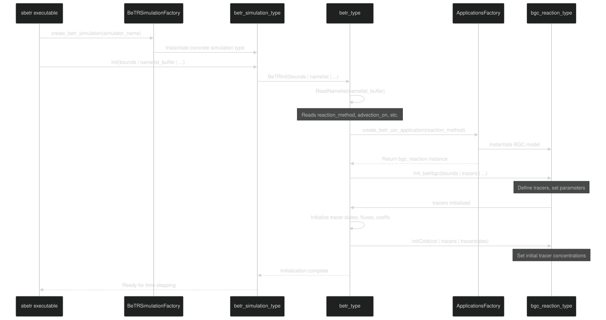

# System Architecture

Relevant source files

- [example_input/ecacnp-reaction.namelist](https://github.com/jingtao-lbl/sbetr-resomv1/blob/72301c77/example_input/ecacnp-reaction.namelist)
- [src/Applications/app_util/ApplicationsFactory.F90](https://github.com/jingtao-lbl/sbetr-resomv1/blob/72301c77/src/Applications/app_util/ApplicationsFactory.F90)
- [src/Applications/soil-farm/bgcfarm_util/BiogeoConType.F90](https://github.com/jingtao-lbl/sbetr-resomv1/blob/72301c77/src/Applications/soil-farm/bgcfarm_util/BiogeoConType.F90)
- [src/Applications/soil-farm/bgcfarm_util/GeoChemAlgorithmMod.F90](https://github.com/jingtao-lbl/sbetr-resomv1/blob/72301c77/src/Applications/soil-farm/bgcfarm_util/GeoChemAlgorithmMod.F90)
- [src/betr/betr_core/BGCReactionsMod.F90](https://github.com/jingtao-lbl/sbetr-resomv1/blob/72301c77/src/betr/betr_core/BGCReactionsMod.F90)
- [src/betr/betr_dtype/BeTR_biogeophysInputType.F90](https://github.com/jingtao-lbl/sbetr-resomv1/blob/72301c77/src/betr/betr_dtype/BeTR_biogeophysInputType.F90)
- [src/betr/betr_rxns/DIOCBGCReactionsType.F90](https://github.com/jingtao-lbl/sbetr-resomv1/blob/72301c77/src/betr/betr_rxns/DIOCBGCReactionsType.F90)
- [src/betr/betr_rxns/H2OIsotopeBGCReactionsType.F90](https://github.com/jingtao-lbl/sbetr-resomv1/blob/72301c77/src/betr/betr_rxns/H2OIsotopeBGCReactionsType.F90)
- [src/betr/betr_rxns/MockBGCReactionsType.F90](https://github.com/jingtao-lbl/sbetr-resomv1/blob/72301c77/src/betr/betr_rxns/MockBGCReactionsType.F90)
- [src/betr/betr_util/Tracer_varcon.F90](https://github.com/jingtao-lbl/sbetr-resomv1/blob/72301c77/src/betr/betr_util/Tracer_varcon.F90)
- [src/betr/betr_util/betr_ctrl.F90](https://github.com/jingtao-lbl/sbetr-resomv1/blob/72301c77/src/betr/betr_util/betr_ctrl.F90)
- [src/driver/clm/BeTRSimulationCLM.F90](https://github.com/jingtao-lbl/sbetr-resomv1/blob/72301c77/src/driver/clm/BeTRSimulationCLM.F90)
- [src/driver/main/BeTRSimulationFactory.F90](https://github.com/jingtao-lbl/sbetr-resomv1/blob/72301c77/src/driver/main/BeTRSimulationFactory.F90)
- [src/driver/main/sbetrDriverMod.F90](https://github.com/jingtao-lbl/sbetr-resomv1/blob/72301c77/src/driver/main/sbetrDriverMod.F90)
- [src/driver/shared/BeTRSimulation.F90](https://github.com/jingtao-lbl/sbetr-resomv1/blob/72301c77/src/driver/shared/BeTRSimulation.F90)
- [src/driver/shared/BeTRType.F90](https://github.com/jingtao-lbl/sbetr-resomv1/blob/72301c77/src/driver/shared/BeTRType.F90)
- [src/driver/shared/bncdio_pio.F90](https://github.com/jingtao-lbl/sbetr-resomv1/blob/72301c77/src/driver/shared/bncdio_pio.F90)
- [src/driver/standalone/BeTRSimulationStandalone.F90](https://github.com/jingtao-lbl/sbetr-resomv1/blob/72301c77/src/driver/standalone/BeTRSimulationStandalone.F90)
- [src/driver/standalone/ForcingDataType.F90](https://github.com/jingtao-lbl/sbetr-resomv1/blob/72301c77/src/driver/standalone/ForcingDataType.F90)
- [src/driver/standalone/GridMod.F90](https://github.com/jingtao-lbl/sbetr-resomv1/blob/72301c77/src/driver/standalone/GridMod.F90)
- [src/stub_clm/WaterFluxType.F90](https://github.com/jingtao-lbl/sbetr-resomv1/blob/72301c77/src/stub_clm/WaterFluxType.F90)

## Purpose and Scope

This document describes the overall system architecture of BeTR (Biogeochemical Transport and Reaction), focusing on how the major components are organized, how they interact, and the design patterns that enable extensibility. It covers the three-tier architecture (Driver → Core Engine → BGC Models), the polymorphic plugin system, and the flow of data through the system.

For details on specific subsystems referenced here:

- [Building BeTR](#2.1)For building and deployment, see
- [Tracer Transport System](#5)For tracer transport mechanics, see
- [BGC Models](#7)For specific BGC model implementations, see
- [Simulation Execution](#3)For simulation execution flow, see

## Three-Tier Architecture Overview

BeTR employs a three-tier architecture that separates concerns between simulation orchestration, biogeochemical transport, and reaction models. This design enables flexible coupling with different land surface models while maintaining a clean separation between transport physics and biogeochemistry.

### Architecture Diagram

Sources:

- [src/driver/shared/BeTRSimulation.F9068-170](https://github.com/jingtao-lbl/sbetr-resomv1/blob/72301c77/src/driver/shared/BeTRSimulation.F90#L68-L170)
- [src/driver/shared/BeTRType.F9044-106](https://github.com/jingtao-lbl/sbetr-resomv1/blob/72301c77/src/driver/shared/BeTRType.F90#L44-L106)
- [src/Applications/app_util/ApplicationsFactory.F901-370](https://github.com/jingtao-lbl/sbetr-resomv1/blob/72301c77/src/Applications/app_util/ApplicationsFactory.F90#L1-L370)
- [src/betr/betr_core/BGCReactionsMod.F901-350](https://github.com/jingtao-lbl/sbetr-resomv1/blob/72301c77/src/betr/betr_core/BGCReactionsMod.F90#L1-L350)

## Component Responsibilities

### Tier 1: Driver Layer

The driver layer manages simulation lifecycle, couples with land surface models (LSMs), and coordinates the time-stepping loop. The key abstraction is `betr_simulation_type` which provides a common interface for different simulation modes.

| Component | File | Responsibilities | 
| --- | --- | --- |
| BeTRSimulationFactory | BeTRSimulationFactory.F90 | Runtime instantiation of simulation mode based on namelist configuration | 
| betr_simulation_type | BeTRSimulation.F9068-170 | Base class defining common simulation interface, history/restart I/O, mass balance checking | 
| betr_simulation_standalone_type | BeTRSimulationStandalone.F9045-60 | Offline simulations using forcing files, no LSM coupling | 
| betr_simulation_clm_type | BeTRSimulationCLM.F9041 | CLM4.5/CLM5 coupling interface | 
| betr_simulation_elm_type | BeTRSimulationELM.F90 | E3SM Land Model coupling interface | 

Key Methods:

- `BeTRInit`[BeTRSimulation.F90378-550](https://github.com/jingtao-lbl/sbetr-resomv1/blob/72301c77/BeTRSimulation.F90#L378-L550): Initialize BeTR engine and allocate data structures
- `StepWithoutDrainage`[BeTRSimulation.F90647-672](https://github.com/jingtao-lbl/sbetr-resomv1/blob/72301c77/BeTRSimulation.F90#L647-L672): Perform transport and reactions without drainage
- `StepWithDrainage`[BeTRSimulation.F90696-714](https://github.com/jingtao-lbl/sbetr-resomv1/blob/72301c77/BeTRSimulation.F90#L696-L714): Apply drainage losses to tracers
- `SetBiophysForcing`: Map LSM data structures to BeTR forcing [varies by subclass]

Sources:

- [src/driver/shared/BeTRSimulation.F901-2000](https://github.com/jingtao-lbl/sbetr-resomv1/blob/72301c77/src/driver/shared/BeTRSimulation.F90#L1-L2000)
- [src/driver/standalone/BeTRSimulationStandalone.F901-800](https://github.com/jingtao-lbl/sbetr-resomv1/blob/72301c77/src/driver/standalone/BeTRSimulationStandalone.F90#L1-L800)
- [src/driver/main/sbetrDriverMod.F9021-404](https://github.com/jingtao-lbl/sbetr-resomv1/blob/72301c77/src/driver/main/sbetrDriverMod.F90#L21-L404)

### Tier 2: Core Engine

The core engine orchestrates tracer transport and provides the infrastructure for BGC reactions. The `betr_type` class is the central orchestrator.

Key Data Structures in betr_type:

| Member | Type | Purpose | 
| --- | --- | --- |
| bgc_reaction | class(bgc_reaction_type), allocatable | Polymorphic BGC model instance BetrType.F9054 | 
| plant_soilbgc | class(plant_soilbgc_type), allocatable | Plant-soil nutrient coupling BetrType.F9055 | 
| tracers | BeTRtracer_type | Tracer definitions and properties BetrType.F9057 | 
| tracerstates | TracerState_type | Current tracer concentrations (mobile, frozen, solid) BetrType.F9060 | 
| tracerfluxes | TracerFlux_type | Tracer fluxes (diffusion, advection, ebullition) BetrType.F9059 | 
| tracercoeffs | TracerCoeff_type | Transport coefficients (Henry's law, diffusivity) BetrType.F9058 | 
| tracerboundaryconds | tracerboundarycond_type | Top/bottom boundary conditions BetrType.F9061 | 

Core Engine Methods:

The `betr_type` provides methods for the two-phase transport splitting:

- 
`step_without_drainage` : Phase 1 of Strang splitting [BetrType.F90 309-435](https://github.com/jingtao-lbl/sbetr-resomv1/blob/72301c77/BetrType.F90#L309-L435)

- Stages transport coefficients
- Updates surface hydrology
- Calculates BGC reactions
- Performs multi-phase subsurface transport
- Applies ebullition

- 
`step_with_drainage` : Phase 2 of Strang splitting [BetrType.F90 506-620](https://github.com/jingtao-lbl/sbetr-resomv1/blob/72301c77/BetrType.F90#L506-L620)

- Applies drainage losses to mobile tracers
- Updates gas pressures

Sources:

- [src/driver/shared/BeTRType.F9044-1200](https://github.com/jingtao-lbl/sbetr-resomv1/blob/72301c77/src/driver/shared/BeTRType.F90#L44-L1200)
- [src/betr/betr_bgc/BetrBGCMod.F90](https://github.com/jingtao-lbl/sbetr-resomv1/blob/72301c77/src/betr/betr_bgc/BetrBGCMod.F90)

### Tier 3: BGC Model Plugins

BGC models are instantiated via the factory pattern, allowing runtime selection without recompilation. All BGC models implement the `bgc_reaction_type` abstract interface.

Abstract BGC Interface Methods:

All BGC models must implement these deferred procedures from `bgc_reaction_type` :

| Method | Purpose | File Reference | 
| --- | --- | --- |
| Init_betrbgc | Initialize BGC model, define tracers | BGCReactionsMod.F9063-85 | 
| calc_bgc_reaction | Compute biogeochemical reactions | BGCReactionsMod.F90135-183 | 
| set_boundary_conditions | Set atmospheric boundary conditions | BGCReactionsMod.F90124-133 | 
| do_tracer_equilibration | Phase equilibration (gas-aqueous-solid) | BGCReactionsMod.F90185-196 | 
| initCold | Cold start initialization of tracer states | BGCReactionsMod.F90198-210 | 
| retrieve_biogeoflux | Return fluxes to LSM | BGCReactionsMod.F90212-221 | 

Factory Pattern Implementation:

The `create_bgc_reaction_type` function in `ApplicationsFactory` uses a select-case statement to instantiate the appropriate BGC model based on the `reaction_method` namelist parameter:

[ApplicationsFactory.F90 83-108](https://github.com/jingtao-lbl/sbetr-resomv1/blob/72301c77/ApplicationsFactory.F90#L83-L108)

Sources:

- [src/Applications/app_util/ApplicationsFactory.F901-370](https://github.com/jingtao-lbl/sbetr-resomv1/blob/72301c77/src/Applications/app_util/ApplicationsFactory.F90#L1-L370)
- [src/betr/betr_core/BGCReactionsMod.F901-350](https://github.com/jingtao-lbl/sbetr-resomv1/blob/72301c77/src/betr/betr_core/BGCReactionsMod.F90#L1-L350)
- [src/Applications/soil-farm/ecacnp/ecacnpBGCReactionsType.F90](https://github.com/jingtao-lbl/sbetr-resomv1/blob/72301c77/src/Applications/soil-farm/ecacnp/ecacnpBGCReactionsType.F90)
- [src/Applications/soil-farm/resom/resomBGCReactionsType.F90](https://github.com/jingtao-lbl/sbetr-resomv1/blob/72301c77/src/Applications/soil-farm/resom/resomBGCReactionsType.F90)

## Data Flow Architecture

The following diagram shows how data flows through the BeTR system during a typical timestep, mapping natural language concepts to actual code entities.

Key Data Type Mappings:

| Natural Language Concept | Code Entity | File Location | 
| --- | --- | --- |
| Land Surface Model State | column_type, patch_type | stub_clm/ColumnType.F90 | 
| BeTR Internal Forcing | betr_biogeophys_input_type | BeTR_biogeophysInputType.F9016-79 | 
| Tracer Definitions | betrtracer_type | BeTRTracerType.F90 | 
| Tracer Concentrations | TracerState_type | TracerStateType.F90 | 
| Transport Fluxes | TracerFlux_type | TracerFluxType.F90 | 
| BGC Fluxes to LSM | betr_biogeo_flux_type | BeTR_biogeoFluxType.F90 | 

Sources:

- [src/driver/main/sbetrDriverMod.F90229-394](https://github.com/jingtao-lbl/sbetr-resomv1/blob/72301c77/src/driver/main/sbetrDriverMod.F90#L229-L394)
- [src/driver/shared/BeTRSimulation.F90378-550](https://github.com/jingtao-lbl/sbetr-resomv1/blob/72301c77/src/driver/shared/BeTRSimulation.F90#L378-L550)
- [src/betr/betr_bgc/BetrBGCMod.F90](https://github.com/jingtao-lbl/sbetr-resomv1/blob/72301c77/src/betr/betr_bgc/BetrBGCMod.F90)
- [src/betr/betr_dtype/BeTR_biogeophysInputType.F901-400](https://github.com/jingtao-lbl/sbetr-resomv1/blob/72301c77/src/betr/betr_dtype/BeTR_biogeophysInputType.F90#L1-L400)

## Polymorphism and Extensibility

BeTR extensively uses Fortran 2003+ polymorphism to enable runtime selection of simulation modes and BGC models without recompilation. This is achieved through abstract base classes and the factory pattern.

### Polymorphic Hierarchy

Implementation Details:

Extensibility Points:

To add a new BGC model:

Sources:

- [src/betr/betr_core/BGCReactionsMod.F9017-350](https://github.com/jingtao-lbl/sbetr-resomv1/blob/72301c77/src/betr/betr_core/BGCReactionsMod.F90#L17-L350)
- [src/Applications/app_util/ApplicationsFactory.F9050-175](https://github.com/jingtao-lbl/sbetr-resomv1/blob/72301c77/src/Applications/app_util/ApplicationsFactory.F90#L50-L175)
- [src/Applications/soil-farm/bgcfarm_util/BiogeoConType.F908-290](https://github.com/jingtao-lbl/sbetr-resomv1/blob/72301c77/src/Applications/soil-farm/bgcfarm_util/BiogeoConType.F90#L8-L290)

## Configuration and Control Flow

### Namelist Configuration

BeTR configuration is controlled through namelists that specify simulation mode, BGC model, and transport options.

Key Namelist Parameters:

| Namelist Group | Parameter | Type | Purpose | 
| --- | --- | --- | --- |
| sbetr_driver | simulator_name | string | Simulation mode: 'standalone', 'clm', 'elm', 'alm' | 
| sbetr_driver | run_type | string | 'tracer' or 'sbgc' | 
| betr_parameters | reaction_method | string | BGC model: 'ecacnp', 'resom', 'v1eca', etc. | 
| betr_parameters | advection_on | logical | Enable/disable advection | 
| betr_parameters | diffusion_on | logical | Enable/disable diffusion | 
| betr_parameters | reaction_on | logical | Enable/disable reactions | 

Example configuration [example_input/ecacnp-reaction.namelist 1-40](https://github.com/jingtao-lbl/sbetr-resomv1/blob/72301c77/example_input/ecacnp-reaction.namelist#L1-L40)

Control Variables:

Key global control variables in [betr_ctrl.F90 1-23](https://github.com/jingtao-lbl/sbetr-resomv1/blob/72301c77/betr_ctrl.F90#L1-L23) :

- `betr_offline`: Standalone vs. coupled mode
- `betr_spinup_state`: Spinup phase (0=normal, 1=AD-1, 2=AD-2)
- `inloop_reaction`: BGC reactions inside vs. outside transport loop

Tracer Configuration:

Tracer properties defined in [Tracer_varcon.F90 1-150](https://github.com/jingtao-lbl/sbetr-resomv1/blob/72301c77/Tracer_varcon.F90#L1-L150) :

- `reaction_method`: Selected BGC model
- `is_nitrogen_active``is_phosphorus_active`, : Enable/disable nutrients
- `use_c13_betr``use_c14_betr`, : Enable isotope tracers

### Initialization Sequence

Sources:

- [src/driver/main/sbetrDriverMod.F9021-404](https://github.com/jingtao-lbl/sbetr-resomv1/blob/72301c77/src/driver/main/sbetrDriverMod.F90#L21-L404)
- [src/driver/shared/BeTRSimulation.F90378-550](https://github.com/jingtao-lbl/sbetr-resomv1/blob/72301c77/src/driver/shared/BeTRSimulation.F90#L378-L550)
- [src/driver/shared/BeTRType.F90153-222](https://github.com/jingtao-lbl/sbetr-resomv1/blob/72301c77/src/driver/shared/BeTRType.F90#L153-L222)
- [src/Applications/app_util/ApplicationsFactory.F9027-115](https://github.com/jingtao-lbl/sbetr-resomv1/blob/72301c77/src/Applications/app_util/ApplicationsFactory.F90#L27-L115)

## Design Patterns Summary

BeTR employs several design patterns to achieve modularity and extensibility:

| Pattern | Implementation | Benefits | 
| --- | --- | --- |
| Three-Tier Architecture | Driver → Core → BGC layers | Clear separation of concerns, testability | 
| Factory Pattern | ApplicationsFactory, BeTRSimulationFactory | Runtime selection without recompilation | 
| Abstract Base Class | bgc_reaction_type, plant_soilbgc_type | Polymorphic behavior, enforced interface | 
| Strategy Pattern | BGC models implement common interface | Interchangeable algorithms | 
| Template Method | betr_simulation_type defines lifecycle | Common workflow, customizable steps | 
| Dependency Injection | Forcing data passed to BeTR | Decoupling from specific LSMs | 

Key Abstractions:

Sources:

- [src/driver/shared/BeTRSimulation.F9068-170](https://github.com/jingtao-lbl/sbetr-resomv1/blob/72301c77/src/driver/shared/BeTRSimulation.F90#L68-L170)
- [src/driver/shared/BeTRType.F9044-106](https://github.com/jingtao-lbl/sbetr-resomv1/blob/72301c77/src/driver/shared/BeTRType.F90#L44-L106)
- [src/Applications/app_util/ApplicationsFactory.F901-370](https://github.com/jingtao-lbl/sbetr-resomv1/blob/72301c77/src/Applications/app_util/ApplicationsFactory.F90#L1-L370)
- [src/betr/betr_core/BGCReactionsMod.F9017-59](https://github.com/jingtao-lbl/sbetr-resomv1/blob/72301c77/src/betr/betr_core/BGCReactionsMod.F90#L17-L59)