# Directory Structure

Relevant source files

- [README.md](https://github.com/jingtao-lbl/sbetr-resomv1/blob/72301c77/README.md)
- [commit-message-template.txt](https://github.com/jingtao-lbl/sbetr-resomv1/blob/72301c77/commit-message-template.txt)
- [src/readme.md](https://github.com/jingtao-lbl/sbetr-resomv1/blob/72301c77/src/readme.md)
- [src/shr/readme.md](https://github.com/jingtao-lbl/sbetr-resomv1/blob/72301c77/src/shr/readme.md)
- [src/stub_clm/readme.md](https://github.com/jingtao-lbl/sbetr-resomv1/blob/72301c77/src/stub_clm/readme.md)

This document describes the organization of source code, build artifacts, tests, and supporting files in the BeTR repository. It provides a reference for understanding where different components are located and how the codebase is structured. For information about the system architecture and how these components interact, see [System Architecture](#1.1) . For build procedures, see [Building BeTR](#2.1) .

## Purpose and Organization

The BeTR repository is organized to separate concerns between the core reactive transport library, user-extensible BGC models, simulation drivers, build system, and testing infrastructure. The directory structure reflects the three-tier architecture: drivers at the top level orchestrate simulations, the core BeTR engine handles transport, and pluggable BGC models implement biogeochemical reactions.

## Top-Level Directory Structure

Sources:  [README.md 18-21](https://github.com/jingtao-lbl/sbetr-resomv1/blob/72301c77/README.md#L18-L21)  [README.md 300-318](https://github.com/jingtao-lbl/sbetr-resomv1/blob/72301c77/README.md#L300-L318)  [src/readme.md 1-14](https://github.com/jingtao-lbl/sbetr-resomv1/blob/72301c77/src/readme.md#L1-L14)

## Source Code Organization (src/)

The `src/` directory contains all Fortran source code organized by functional responsibility. Each subdirectory is documented with its own `readme.md` file explaining the specific modules contained within.

### Core Directories

| Directory | Purpose | Key Components | 
| --- | --- | --- |
| betr/ | Core reactive transport library, independent of any land model | Tracer transport engine, phase equilibration, multi-phase diffusion, adaptive time-stepping | 
| Applications/ | User-extensible BGC model implementations | ECACNP, SIMIC, V1ECA, RESOM, mock models, factory pattern infrastructure | 
| driver/ | Standalone simulation driver and coupling APIs | BeTRSimulationFactory, BeTRSimulationStandalone, CLM/ALM coupling interfaces | 
| jarmodel/ | Single-layer mode for parameter calibration and testing | Simplified driver for zero-dimensional BGC testing | 

Sources:  [README.md 20-21](https://github.com/jingtao-lbl/sbetr-resomv1/blob/72301c77/README.md#L20-L21)  [src/readme.md 5-10](https://github.com/jingtao-lbl/sbetr-resomv1/blob/72301c77/src/readme.md#L5-L10)

### Supporting Infrastructure Directories

| Directory | Purpose | Components | 
| --- | --- | --- |
| stub_clm/ | Data structures for coupling with CLM/ELM | Carbon, nitrogen, phosphorus flux/state types, soil properties, grid types | 
| shr/ | Shared utility modules from CESM | Constants, MPI utilities, file handling, logging, assertions | 
| io_util/ | NetCDF input/output handling | Reading forcing data, writing history files, restart capability | 
| esmf_wrf_timemgr/ | Time management utilities | Date/time operations, calendar management from ESMF/WRF | 
| math_test/ | Numerical method testing | Validation tests for ODE integrators, interpolation, root finding | 

Sources:  [src/readme.md 1-14](https://github.com/jingtao-lbl/sbetr-resomv1/blob/72301c77/src/readme.md#L1-L14)  [src/stub_clm/readme.md 1-63](https://github.com/jingtao-lbl/sbetr-resomv1/blob/72301c77/src/stub_clm/readme.md#L1-L63)  [src/shr/readme.md 1-17](https://github.com/jingtao-lbl/sbetr-resomv1/blob/72301c77/src/shr/readme.md#L1-L17)

## Source to System Component Mapping

Sources:  [README.md 18-21](https://github.com/jingtao-lbl/sbetr-resomv1/blob/72301c77/README.md#L18-L21)  [README.md 306-313](https://github.com/jingtao-lbl/sbetr-resomv1/blob/72301c77/README.md#L306-L313)  [src/readme.md 5-13](https://github.com/jingtao-lbl/sbetr-resomv1/blob/72301c77/src/readme.md#L5-L13)

## Build System and Dependencies (3rd-party/, cmake/)

### Third-Party Dependencies (3rd-party/)

The repository includes all third-party dependencies required for standalone operation. These are built automatically during the configuration process.

Sources:  [README.md 54-55](https://github.com/jingtao-lbl/sbetr-resomv1/blob/72301c77/README.md#L54-L55)  [README.md 300-303](https://github.com/jingtao-lbl/sbetr-resomv1/blob/72301c77/README.md#L300-L303)

### Build Configuration (cmake/)

The `cmake/` directory contains CMake modules that handle compiler detection, platform-specific settings, and build system logic:

| File/Directory | Purpose | 
| --- | --- |
| set_up_compilers.cmake | Compiler flag configuration for Intel, GNU, PGI, NAG compilers | 
| set_up_platform.cmake | HPC platform detection (NERSC Cori/Edison, NCAR Yellowstone) | 
| CMakeLists.txt (root) | Top-level build orchestration, dependency chain management | 
| Makefile (root) | User-friendly wrapper around CMake for common operations | 

The build process creates out-of-source builds in `build/Debug/` or `build/Release/` depending on configuration. Installed executables are placed in `local/bin/` .

Sources:  [README.md 60-89](https://github.com/jingtao-lbl/sbetr-resomv1/blob/72301c77/README.md#L60-L89)  [README.md 92-151](https://github.com/jingtao-lbl/sbetr-resomv1/blob/72301c77/README.md#L92-L151)

## Testing Infrastructure

### Regression Tests (regression-tests/)

Sources:  [README.md 164-248](https://github.com/jingtao-lbl/sbetr-resomv1/blob/72301c77/README.md#L164-L248)

### Unit Tests

Unit tests are distributed throughout the source tree in `test/` subdirectories using the pFUnit framework. They are built automatically and executed with `make test` or `ctest` .

Sources:  [README.md 154-162](https://github.com/jingtao-lbl/sbetr-resomv1/blob/72301c77/README.md#L154-L162)  [README.md 250-252](https://github.com/jingtao-lbl/sbetr-resomv1/blob/72301c77/README.md#L250-L252)

## Generated Build Artifacts

### Build Directory (build/)

Out-of-source builds are placed in `build/[Platform]-[Debug|Release]/` with the following structure:

| Subdirectory | Contents | 
| --- | --- |
| src/driver/ | sbetr executable | 
| src/jarmodel/ | jarmodel executable | 
| src/betr/ | Core library object files | 
| src/Applications/ | BGC model object files | 
| 3rd-party/ | Compiled dependencies | 

### Installation Directory (local/)

After running `make install` , executables are copied to:

- `local/bin/sbetr`- Standalone column mode executable
- `local/bin/jarmodel`- Single-layer mode executable

Sources:  [README.md 68-76](https://github.com/jingtao-lbl/sbetr-resomv1/blob/72301c77/README.md#L68-L76)  [README.md 83-85](https://github.com/jingtao-lbl/sbetr-resomv1/blob/72301c77/README.md#L83-L85)

## Example Configurations (example_input/)

Contains sample namelist files demonstrating different BGC model configurations:

- `mock.namelist`- Five tracer transport without reactions (N2, O2, AR, CO2, CH4, DOC)
- Model-specific namelists for ECACNP, SIMIC, V1ECA

These serve as templates for creating custom simulations. Paths in namelist files are relative to the execution directory.

Sources:  [README.md 262-266](https://github.com/jingtao-lbl/sbetr-resomv1/blob/72301c77/README.md#L262-L266)

## Stub CLM Types Detail (src/stub_clm/)

The `stub_clm/` directory provides data structures needed when BeTR runs in standalone mode without a full land surface model. These types mirror the interfaces used in CLM/ELM coupling:

### Key Type Categories

| Type Category | Example Files | Purpose | 
| --- | --- | --- |
| Carbon fluxes/states | CNCarbonFluxType.F90, CNCarbonStateType.F90 | Track C pools and fluxes at column and patch levels | 
| Nitrogen fluxes/states | CNNitrogenFluxType.F90, CNNitrogenStateType.F90 | Track N pools and fluxes | 
| Phosphorus fluxes/states | PhosphorusFluxType.F90, PhosphorusStateType.F90 | Track P pools and fluxes | 
| Soil properties | SoilStateType.F90, SoilHydrologyType.F90 | Soil texture, moisture, temperature | 
| Grid structure | GridcellType.F90, ColumnType.F90, PatchType.F90 | Spatial hierarchy | 
| Forcing data | atm2lndType.F90, lnd2atmType.F90 | Atmospheric coupling interfaces | 

Sources:  [src/stub_clm/readme.md 1-63](https://github.com/jingtao-lbl/sbetr-resomv1/blob/72301c77/src/stub_clm/readme.md#L1-L63)

## Shared Utilities (src/shr/)

The `shr/` directory contains utility modules adapted from CESM for standalone operation:

| Module | Purpose | 
| --- | --- |
| shr_kind_mod.F90 | Numerical precision definitions (r8, i4, etc.) | 
| shr_const_mod.F90 | Physical constants (gravity, gas constant, etc.) | 
| shr_file_mod.F90, shr_sys_mod.F90 | File system operations | 
| shr_log_mod.F90 | Logging infrastructure | 
| shr_mpi_mod.F90 | MPI utilities for parallel operation | 
| shr_nl_mod.F90 | Namelist parsing | 
| shr_string_mod.F90 | String manipulation utilities | 
| abortutils.F90 | Clean error handling and termination | 

Sources:  [src/shr/readme.md 1-17](https://github.com/jingtao-lbl/sbetr-resomv1/blob/72301c77/src/shr/readme.md#L1-L17)

## Directory Access Patterns

Different workflows interact with different parts of the directory structure:

### User Workflows

Sources:  [README.md 254-297](https://github.com/jingtao-lbl/sbetr-resomv1/blob/72301c77/README.md#L254-L297)  [README.md 320-322](https://github.com/jingtao-lbl/sbetr-resomv1/blob/72301c77/README.md#L320-L322)

## Summary Table: Directory Purpose and Key Files

| Directory Path | Primary Purpose | Most Important Files/Subdirectories | 
| --- | --- | --- |
| src/betr/ | Core reactive transport engine | betr_type.F90, BetrBGCMod.F90, transport modules | 
| src/Applications/ | BGC model implementations | ApplicationsFactoryMod.F90, ecacnp/, simic/, v1eca/ | 
| src/driver/ | Simulation orchestration | BeTRSimulationFactory.F90, main.F90 | 
| src/jarmodel/ | Single-layer testing mode | main.F90, jarmodel driver modules | 
| src/stub_clm/ | LSM data structures | Carbon/nitrogen/phosphorus flux and state types | 
| src/shr/ | Shared utilities | shr_kind_mod.F90, shr_const_mod.F90, shr_log_mod.F90 | 
| src/io_util/ | NetCDF I/O operations | Input/output handling modules | 
| 3rd-party/ | External dependencies | netcdf-fortran/, hdf5/, pfunit/ | 
| cmake/ | Build configuration | set_up_compilers.cmake, set_up_platform.cmake | 
| regression-tests/ | System validation | standalone.cfg, jarmodel.cfg, baseline files | 
| build/ | Build artifacts (generated) | Debug/Release subdirectories with executables | 
| local/ | Installation target (generated) | bin/sbetr, bin/jarmodel | 

Sources:  [README.md 18-21](https://github.com/jingtao-lbl/sbetr-resomv1/blob/72301c77/README.md#L18-L21)  [README.md 300-318](https://github.com/jingtao-lbl/sbetr-resomv1/blob/72301c77/README.md#L300-L318)  [src/readme.md 1-14](https://github.com/jingtao-lbl/sbetr-resomv1/blob/72301c77/src/readme.md#L1-L14)