# Unit Testing

Relevant source files

- [README.md](https://github.com/jingtao-lbl/sbetr-resomv1/blob/72301c77/README.md)
- [commit-message-template.txt](https://github.com/jingtao-lbl/sbetr-resomv1/blob/72301c77/commit-message-template.txt)
- [src/readme.md](https://github.com/jingtao-lbl/sbetr-resomv1/blob/72301c77/src/readme.md)
- [src/shr/readme.md](https://github.com/jingtao-lbl/sbetr-resomv1/blob/72301c77/src/shr/readme.md)
- [src/stub_clm/readme.md](https://github.com/jingtao-lbl/sbetr-resomv1/blob/72301c77/src/stub_clm/readme.md)

This page documents BeTR's unit testing infrastructure using the pFUnit framework. Unit tests validate individual components and functions in isolation, ensuring that specific code modules behave correctly under various inputs and conditions. For information about system-level regression testing that validates end-to-end simulation behavior, see [Regression Testing Framework](#10.2) .

## Purpose and Scope

Unit tests in BeTR serve to:

- Validate individual functions and methods in isolation
- Catch bugs early during development
- Document expected behavior of code components
- Enable refactoring with confidence
- Provide rapid feedback during development (seconds to minutes vs. full simulations)

Unit tests focus on testing code logic, numerical methods, and data structure operations without requiring full simulation execution or external input files.

Sources:  [README.md 154-161](https://github.com/jingtao-lbl/sbetr-resomv1/blob/72301c77/README.md#L154-L161)

## pFUnit Testing Framework

BeTR uses [pFUnit](http://pfunit.sourceforge.net/) , a unit testing framework for Fortran that provides:

- xUnit-style test organization (test suites, test cases, assertions)
- Automated test discovery and execution
- Assertion macros for validating expected vs. actual results
- Support for parameterized tests
- Integration with CMake build system

pFUnit is included as a third-party dependency and is automatically built during BeTR configuration. The framework requires GCC ≥ 4.9 for proper compilation.

### Test Execution Flow

Sources:  [README.md 154-161](https://github.com/jingtao-lbl/sbetr-resomv1/blob/72301c77/README.md#L154-L161)  [README.md 36-37](https://github.com/jingtao-lbl/sbetr-resomv1/blob/72301c77/README.md#L36-L37)

## Running Unit Tests

### Basic Test Execution

To run all unit tests after building BeTR:

This command executes `ctest` in the build directory and runs all registered unit tests.

### Alternative Execution Methods

Direct CTest invocation:

Verbose output:

Run specific test:

Run tests in parallel:

### Test Execution as Part of Build Workflow

The recommended development workflow includes:

On HPC platforms, the workflow is similar:

Sources:  [README.md 157-162](https://github.com/jingtao-lbl/sbetr-resomv1/blob/72301c77/README.md#L157-L162)  [README.md 117](https://github.com/jingtao-lbl/sbetr-resomv1/blob/72301c77/README.md#L117-L117)  [README.md 141](https://github.com/jingtao-lbl/sbetr-resomv1/blob/72301c77/README.md#L141-L141)  [README.md 150](https://github.com/jingtao-lbl/sbetr-resomv1/blob/72301c77/README.md#L150-L150)

## Unit Test Organization

### Test File Structure

Unit tests in BeTR follow standard pFUnit conventions:

| Component | Description | 
| --- | --- |
| Test Files | *.pf files containing pFUnit test code | 
| Test Modules | Fortran modules containing test subroutines | 
| Test Suites | Collections of related tests | 
| Test Cases | Individual test methods (prefixed with test) | 

### Test Categories

BeTR unit tests typically cover:

### Build Integration Architecture

Sources:  [README.md 154-162](https://github.com/jingtao-lbl/sbetr-resomv1/blob/72301c77/README.md#L154-L162)

## Creating New Unit Tests

### Test File Naming Convention

pFUnit test files should:

- `.pf`End with extension
- Use descriptive names indicating what is being tested
- `tests/`Be located in the same directory as the module being tested or in a subdirectory

### Basic Test Template

A minimal pFUnit test module structure:

### Common pFUnit Assertions

| Assertion | Purpose | 
| --- | --- |
| @assertEqual(expected, actual, tolerance) | Check numeric equality within tolerance | 
| @assertTrue(condition) | Verify condition is true | 
| @assertFalse(condition) | Verify condition is false | 
| @assertIsNaN(value) | Check for NaN value | 
| @assertGreaterThan(value, threshold) | Value comparison | 
| @assertLessThan(value, threshold) | Value comparison | 

### Guidelines for Effective Unit Tests

### Registering Tests with CMake

Tests are registered in `CMakeLists.txt` using:

This macro:

Sources:  [README.md 250-252](https://github.com/jingtao-lbl/sbetr-resomv1/blob/72301c77/README.md#L250-L252)

## Build System Integration

### Dependency Chain

### Compiler Requirements for pFUnit

pFUnit has specific compiler requirements:

- **GCC**: Version ≥ 4.9 required
- **Intel**: Supported
- **PGI**: To be determined
- **NAG**: To be determined

The pFUnit testing framework cannot be built with GCC < 4.9 due to required Fortran 2008 features.

Sources:  [README.md 34-43](https://github.com/jingtao-lbl/sbetr-resomv1/blob/72301c77/README.md#L34-L43)

## Unit Tests vs Regression Tests

BeTR employs two complementary testing strategies:

### Comparison Matrix

| Aspect | Unit Tests | Regression Tests | 
| --- | --- | --- |
| Framework | pFUnit | Custom Python driver | 
| Scope | Individual functions/modules | Full simulation execution | 
| Execution Time | Milliseconds to seconds | Seconds to minutes | 
| Input Required | Minimal (in-code setup) | Full namelist + forcing data | 
| Output | Pass/Fail assertions | NetCDF comparison against baseline | 
| Purpose | Validate logic correctness | Validate scientific behavior | 
| Run Command | make test or ctest | cd regression-tests; make rtest | 
| Failure Diagnosis | Immediate (line-level) | Requires analysis of simulation output | 
| Development Stage | During implementation | After integration | 

### Testing Strategy Flow

### When to Use Each Type

Use Unit Tests when:

- Testing numerical algorithms (ODE integrators, interpolation)
- Validating data structure operations
- Testing utility functions
- Developing new code modules
- Refactoring existing code

Use Regression Tests when:

- Validating full simulation behavior
- Testing BGC model implementations
- Verifying coupled system behavior
- Ensuring scientific reproducibility
- Validating against known analytical solutions

Sources:  [README.md 154-172](https://github.com/jingtao-lbl/sbetr-resomv1/blob/72301c77/README.md#L154-L172)  [commit-message-template.txt 8-9](https://github.com/jingtao-lbl/sbetr-resomv1/blob/72301c77/commit-message-template.txt#L8-L9)

## Best Practices

### Development Workflow

### Commit Message Testing Section

When committing code, include testing status:

This template ensures that testing status is documented in the commit history.

Sources:  [commit-message-template.txt 7-10](https://github.com/jingtao-lbl/sbetr-resomv1/blob/72301c77/commit-message-template.txt#L7-L10)

## Platform-Specific Considerations

### HPC Environments

When running tests on HPC platforms, ensure proper module loading:

NERSC Cori (Intel):

NERSC Edison (Intel):

NCAR Yellowstone (Intel):

### Local Development

For local development on Linux or macOS:

Sources:  [README.md 107-151](https://github.com/jingtao-lbl/sbetr-resomv1/blob/72301c77/README.md#L107-L151)

## Summary

BeTR's unit testing infrastructure provides:

- **Automated Testing**`make test`- pFUnit-based tests run automatically via
- **Fast Feedback**- Tests execute in seconds, enabling rapid development
- **Component Isolation**- Tests validate individual modules without full simulations
- **Build Integration**- Tests are built and registered automatically by CMake
- **Complementary Coverage**- Unit tests complement system-level regression tests

Effective use of unit tests accelerates development, reduces bugs, and provides confidence when refactoring code. Combined with regression testing ( [see Regression Testing Framework](#10.2) ), BeTR's testing infrastructure ensures both component correctness and system-level scientific validity.

Sources:  [README.md 154-252](https://github.com/jingtao-lbl/sbetr-resomv1/blob/72301c77/README.md#L154-L252)