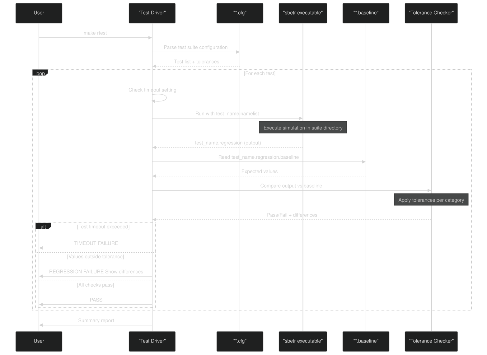

# Regression Testing Framework

Relevant source files

- [README.md](https://github.com/jingtao-lbl/sbetr-resomv1/blob/72301c77/README.md)
- [commit-message-template.txt](https://github.com/jingtao-lbl/sbetr-resomv1/blob/72301c77/commit-message-template.txt)
- [regression-tests/tests/standalone/h2oiso.regression.baseline](https://github.com/jingtao-lbl/sbetr-resomv1/blob/72301c77/regression-tests/tests/standalone/h2oiso.regression.baseline)
- [regression-tests/tests/standalone/mock-adr.regression.baseline](https://github.com/jingtao-lbl/sbetr-resomv1/blob/72301c77/regression-tests/tests/standalone/mock-adr.regression.baseline)
- [regression-tests/tests/standalone/mock-advection.regression.baseline](https://github.com/jingtao-lbl/sbetr-resomv1/blob/72301c77/regression-tests/tests/standalone/mock-advection.regression.baseline)
- [regression-tests/tests/standalone/mock-diffusion.regression.baseline](https://github.com/jingtao-lbl/sbetr-resomv1/blob/72301c77/regression-tests/tests/standalone/mock-diffusion.regression.baseline)
- [regression-tests/tests/standalone/mock-reaction.regression.baseline](https://github.com/jingtao-lbl/sbetr-resomv1/blob/72301c77/regression-tests/tests/standalone/mock-reaction.regression.baseline)
- [regression-tests/tests/standalone/mock-ss-advection.regression.baseline](https://github.com/jingtao-lbl/sbetr-resomv1/blob/72301c77/regression-tests/tests/standalone/mock-ss-advection.regression.baseline)
- [regression-tests/tests/standalone/mock-ss-diffusion.regression.baseline](https://github.com/jingtao-lbl/sbetr-resomv1/blob/72301c77/regression-tests/tests/standalone/mock-ss-diffusion.regression.baseline)
- [regression-tests/tests/standalone/mock-ss-uniform-advection.regression.baseline](https://github.com/jingtao-lbl/sbetr-resomv1/blob/72301c77/regression-tests/tests/standalone/mock-ss-uniform-advection.regression.baseline)
- [regression-tests/tests/standalone/mock-ss-uniform-diffusion.regression.baseline](https://github.com/jingtao-lbl/sbetr-resomv1/blob/72301c77/regression-tests/tests/standalone/mock-ss-uniform-diffusion.regression.baseline)
- [regression-tests/tests/standalone/standalone.cfg](https://github.com/jingtao-lbl/sbetr-resomv1/blob/72301c77/regression-tests/tests/standalone/standalone.cfg)
- [src/readme.md](https://github.com/jingtao-lbl/sbetr-resomv1/blob/72301c77/src/readme.md)
- [src/shr/readme.md](https://github.com/jingtao-lbl/sbetr-resomv1/blob/72301c77/src/shr/readme.md)
- [src/stub_clm/readme.md](https://github.com/jingtao-lbl/sbetr-resomv1/blob/72301c77/src/stub_clm/readme.md)

## Purpose and Scope

This page documents BeTR's regression testing framework, which provides system-level validation by comparing simulation outputs against known baselines. Regression tests execute the `sbetr` and `jarmodel` executables with specific configurations and verify that results remain within specified tolerances. For information about unit testing with pFUnit, see [Unit Testing](#10.1) . For a guide to creating new regression tests, see [Creating New Tests](#10.4) .

Sources:  [README.md 152-252](https://github.com/jingtao-lbl/sbetr-resomv1/blob/72301c77/README.md#L152-L252)

## Architecture Overview

BeTR's regression test system is designed to detect unintended changes in simulation behavior while accommodating expected platform-dependent numerical differences. The framework operates independently from the build system but relies on compiled executables.

Sources:  [README.md 164-252](https://github.com/jingtao-lbl/sbetr-resomv1/blob/72301c77/README.md#L164-L252)  [regression-tests/tests/standalone/standalone.cfg 1-47](https://github.com/jingtao-lbl/sbetr-resomv1/blob/72301c77/regression-tests/tests/standalone/standalone.cfg#L1-L47)

## Test Organization

Regression tests are organized into test suites , each defined by a configuration file. A suite directory contains all artifacts for tests in that suite.

### Directory Structure

Each test requires exactly three files:

Sources:  [README.md 177-222](https://github.com/jingtao-lbl/sbetr-resomv1/blob/72301c77/README.md#L177-L222)

## Configuration File Format

Test suite configuration files use INI/CFG format and define default tolerances plus per-test settings.

### Configuration File Structure

### Key Sections

| Section | Purpose | Required | 
| --- | --- | --- |
| [default_tolerances] | Default comparison tolerances for all tests | Yes | 
| [test_name] | Per-test configuration and tolerance overrides | Yes (one per test) | 

### Tolerance Types

The framework supports three tolerance types:

| Type | Description | Example | 
| --- | --- | --- |
| absolute | Maximum absolute difference allowed | 1.0e-16 absolute | 
| relative | Maximum relative difference allowed | 5.0e-13 relative | 
| percent | Maximum percentage difference allowed | 1.0 percent | 

Sources:  [README.md 183-200](https://github.com/jingtao-lbl/sbetr-resomv1/blob/72301c77/README.md#L183-L200)  [regression-tests/tests/standalone/standalone.cfg 1-47](https://github.com/jingtao-lbl/sbetr-resomv1/blob/72301c77/regression-tests/tests/standalone/standalone.cfg#L1-L47)

## Baseline File Format

Baseline files store expected simulation output in a structured text format for version control compatibility.

### Baseline Structure

### Variable Categories

Baselines track different physical quantities, each with an associated category:

| Category | Description | Units | Example Variables | 
| --- | --- | --- | --- |
| concentration | Tracer concentrations | mol/m³ | N2_total_aqueous_conc, O2_total_aqueous_conc, DOC_total_aqueous_conc | 
| pfraction | Gas partial fractions | dimensionless | N2_gas_partial_fraction, CO2x_gas_partial_fraction | 
| pressure | Gas pressures | Pa | total_gas_pressure | 
| velocity | Water fluxes | m/s | advective flux | 

### Baseline Content Example

From [h2oiso.regression.baseline 1-21](https://github.com/jingtao-lbl/sbetr-resomv1/blob/72301c77/h2oiso.regression.baseline#L1-L21) :

Sources:  [regression-tests/tests/standalone/h2oiso.regression.baseline 1-200](https://github.com/jingtao-lbl/sbetr-resomv1/blob/72301c77/regression-tests/tests/standalone/h2oiso.regression.baseline#L1-L200)  [regression-tests/tests/standalone/mock-adr.regression.baseline 1-145](https://github.com/jingtao-lbl/sbetr-resomv1/blob/72301c77/regression-tests/tests/standalone/mock-adr.regression.baseline#L1-L145)

## Test Execution Workflow

The regression test system executes tests by running the BeTR executable with a namelist configuration and comparing output against baselines.

### Execution Commands

From [README.md 169-171](https://github.com/jingtao-lbl/sbetr-resomv1/blob/72301c77/README.md#L169-L171) :

The test driver:

Sources:  [README.md 164-171](https://github.com/jingtao-lbl/sbetr-resomv1/blob/72301c77/README.md#L164-L171)

## Tolerance Specification Strategy

Setting appropriate tolerances balances sensitivity to code changes with platform independence.

### Tolerance Guidelines

From [README.md 224-228](https://github.com/jingtao-lbl/sbetr-resomv1/blob/72301c77/README.md#L224-L228) :

### Tolerance Override Example

From [standalone.cfg 29-34](https://github.com/jingtao-lbl/sbetr-resomv1/blob/72301c77/standalone.cfg#L29-L34) :

The `mock-advection` test overrides default tolerances for `pfraction` and `pressure` because these calculations involve more numerical operations that accumulate platform-dependent rounding errors.

Sources:  [README.md 224-228](https://github.com/jingtao-lbl/sbetr-resomv1/blob/72301c77/README.md#L224-L228)  [regression-tests/tests/standalone/standalone.cfg 1-47](https://github.com/jingtao-lbl/sbetr-resomv1/blob/72301c77/regression-tests/tests/standalone/standalone.cfg#L1-L47)

## Timeout Management

Tests have configurable timeout limits to prevent infinite loops and detect performance regressions.

### Timeout Configuration

From [README.md 202-209](https://github.com/jingtao-lbl/sbetr-resomv1/blob/72301c77/README.md#L202-L209) :

### Timeout Examples

| Test | Timeout | Reason | 
| --- | --- | --- |
| mock-adr | 15 seconds | Standard transport test | 
| mock-reaction | 35 seconds | Includes BGC reactions (slower) | 
| h2oiso | 15 seconds | Water isotope transport | 

Sources:  [README.md 202-209](https://github.com/jingtao-lbl/sbetr-resomv1/blob/72301c77/README.md#L202-L209)  [regression-tests/tests/standalone/standalone.cfg 6-34](https://github.com/jingtao-lbl/sbetr-resomv1/blob/72301c77/regression-tests/tests/standalone/standalone.cfg#L6-L34)

## Baseline Management and Version Control

Baselines are stored as plain text files to enable effective version control and reproducibility.

### CDL Format for Input Data

From [README.md 230-247](https://github.com/jingtao-lbl/sbetr-resomv1/blob/72301c77/README.md#L230-L247) :

BeTR requires that input data and baselines be stored as text-based CDL files rather than binary NetCDF:

The `-p 9,17` option ensures sufficient precision (9 significant digits, 17 total digits) to preserve double-precision values.

### Verification Requirement

From [README.md 243-247](https://github.com/jingtao-lbl/sbetr-resomv1/blob/72301c77/README.md#L243-L247) :

Sources:  [README.md 230-247](https://github.com/jingtao-lbl/sbetr-resomv1/blob/72301c77/README.md#L230-L247)

## Test Suite Coverage

BeTR's regression tests validate different aspects of the simulation system:

### Standalone Test Suite

From [standalone.cfg 1-47](https://github.com/jingtao-lbl/sbetr-resomv1/blob/72301c77/standalone.cfg#L1-L47) the standalone suite includes:

| Test Name | Purpose | Key Features | 
| --- | --- | --- |
| mock-adr | Transport with all mechanisms | Advection, diffusion, reactions | 
| mock-advection | Pure advective transport | No diffusion or reactions | 
| mock-diffusion | Pure diffusive transport | No advection | 
| mock-ss-diffusion | Steady-state diffusion | Uniform conditions | 
| mock-ss-uniform-diffusion | Uniform steady-state | Validation benchmark | 
| mock-ss-advection | Steady-state advection | Flow-only conditions | 
| mock-ss-uniform-advection | Uniform steady advection | Validation benchmark | 
| mock-reaction | BGC reactions only | No transport | 
| h2oiso | Water isotope transport | O18, D isotopes | 
| analytical-adr-b1 | Analytical solution comparison | Boundary condition type 1 | 
| analytical-adr-b2 | Analytical solution comparison | Boundary condition type 2 | 

### Test Categories

Sources:  [regression-tests/tests/standalone/standalone.cfg 1-47](https://github.com/jingtao-lbl/sbetr-resomv1/blob/72301c77/regression-tests/tests/standalone/standalone.cfg#L1-L47)

## Integration with Build System

The regression test framework operates independently but requires compiled executables.

### Build and Test Workflow

From [README.md 160-171](https://github.com/jingtao-lbl/sbetr-resomv1/blob/72301c77/README.md#L160-L171) :

The separation allows:

- **Unit tests**to validate individual components during development
- **Regression tests**to validate system behavior before releases

Sources:  [README.md 152-171](https://github.com/jingtao-lbl/sbetr-resomv1/blob/72301c77/README.md#L152-L171)

## Relationship to Other Testing Components

From [commit-message-template.txt 7-10](https://github.com/jingtao-lbl/sbetr-resomv1/blob/72301c77/commit-message-template.txt#L7-L10) :

Commit messages should document test status:

Sources:  [commit-message-template.txt 1-10](https://github.com/jingtao-lbl/sbetr-resomv1/blob/72301c77/commit-message-template.txt#L1-L10)  [README.md 152-171](https://github.com/jingtao-lbl/sbetr-resomv1/blob/72301c77/README.md#L152-L171)

## Summary

The BeTR regression testing framework provides:

For information on unit testing individual components, see [Unit Testing](#10.1) . For guidance on adding new regression tests, see [Creating New Tests](#10.4) . For the complete test suite organization, see [Test Suite Organization](#10.3) .

Sources:  [README.md 152-252](https://github.com/jingtao-lbl/sbetr-resomv1/blob/72301c77/README.md#L152-L252)  [regression-tests/tests/standalone/standalone.cfg 1-47](https://github.com/jingtao-lbl/sbetr-resomv1/blob/72301c77/regression-tests/tests/standalone/standalone.cfg#L1-L47)