# Test Suite Organization

Relevant source files

- [regression-tests/tests/standalone/h2oiso.regression.baseline](https://github.com/jingtao-lbl/sbetr-resomv1/blob/72301c77/regression-tests/tests/standalone/h2oiso.regression.baseline)
- [regression-tests/tests/standalone/mock-adr.regression.baseline](https://github.com/jingtao-lbl/sbetr-resomv1/blob/72301c77/regression-tests/tests/standalone/mock-adr.regression.baseline)
- [regression-tests/tests/standalone/mock-advection.regression.baseline](https://github.com/jingtao-lbl/sbetr-resomv1/blob/72301c77/regression-tests/tests/standalone/mock-advection.regression.baseline)
- [regression-tests/tests/standalone/mock-diffusion.regression.baseline](https://github.com/jingtao-lbl/sbetr-resomv1/blob/72301c77/regression-tests/tests/standalone/mock-diffusion.regression.baseline)
- [regression-tests/tests/standalone/mock-reaction.regression.baseline](https://github.com/jingtao-lbl/sbetr-resomv1/blob/72301c77/regression-tests/tests/standalone/mock-reaction.regression.baseline)
- [regression-tests/tests/standalone/mock-ss-advection.regression.baseline](https://github.com/jingtao-lbl/sbetr-resomv1/blob/72301c77/regression-tests/tests/standalone/mock-ss-advection.regression.baseline)
- [regression-tests/tests/standalone/mock-ss-diffusion.regression.baseline](https://github.com/jingtao-lbl/sbetr-resomv1/blob/72301c77/regression-tests/tests/standalone/mock-ss-diffusion.regression.baseline)
- [regression-tests/tests/standalone/mock-ss-uniform-advection.regression.baseline](https://github.com/jingtao-lbl/sbetr-resomv1/blob/72301c77/regression-tests/tests/standalone/mock-ss-uniform-advection.regression.baseline)
- [regression-tests/tests/standalone/mock-ss-uniform-diffusion.regression.baseline](https://github.com/jingtao-lbl/sbetr-resomv1/blob/72301c77/regression-tests/tests/standalone/mock-ss-uniform-diffusion.regression.baseline)
- [regression-tests/tests/standalone/standalone.cfg](https://github.com/jingtao-lbl/sbetr-resomv1/blob/72301c77/regression-tests/tests/standalone/standalone.cfg)

## Purpose and Scope

This document describes the organizational structure of BeTR's regression test suites, including the categorization of tests by functionality, the types of validation each test performs, and the structure of test configurations. For information about the regression testing framework and how to run tests, see [Regression Testing Framework](#10.2) . For instructions on creating new tests, see [Creating New Tests](#10.4) . For unit testing with pFUnit, see [Unit Testing](#10.1) .

## Test Suite Categories

BeTR's regression tests are organized into three primary categories based on simulation mode and validation objectives:

| Test Suite | Location | Purpose | Test Count | 
| --- | --- | --- | --- |
| Standalone | regression-tests/tests/standalone/ | Multi-layer column transport and reactions | 11 tests | 
| Jarmodel | regression-tests/tests/jarmodel/ | Single-layer BGC model validation | Variable | 
| Analytical | regression-tests/tests/analytical/ | Comparison against analytical solutions | 2 tests | 

Sources:  [regression-tests/tests/standalone/standalone.cfg](https://github.com/jingtao-lbl/sbetr-resomv1/blob/72301c77/regression-tests/tests/standalone/standalone.cfg)

## Standalone Test Suite

### Test Organization

The standalone test suite validates multi-layer reactive transport functionality through the `sbetr` executable. Tests are organized by physical process and complexity:

Sources:  [regression-tests/tests/standalone/standalone.cfg 1-47](https://github.com/jingtao-lbl/sbetr-resomv1/blob/72301c77/regression-tests/tests/standalone/standalone.cfg#L1-L47)

### Test Categories and Properties
Transport Tests
Diffusion Tests:

- `mock-diffusion`: Multi-layer diffusive transport with variable properties
- `mock-ss-diffusion`: Steady-state diffusion with source-sink terms
- `mock-ss-uniform-diffusion`: Uniform diffusion coefficients with steady-state

Advection Tests:

- `mock-advection`: Pure advective transport with variable water flux
- `mock-ss-advection`: Steady-state advection with constant velocity
- `mock-ss-uniform-advection`: Uniform advection with homogeneous properties

Reaction Tests
BGC Reaction Tests:

- `mock-reaction`
- Validates ODE integration
- Tests tracer production/consumption rates
- Timeout: 35 seconds (longer due to stiff reactions)

: Isolated biogeochemical reaction without transport

Coupled Tests
Advection-Diffusion-Reaction:

- `mock-adr`
- Most comprehensive test
- Validates Strang splitting
- Tests phase equilibration

: Full coupling of all transport mechanisms with reactions

Isotope Tests
Water Isotope Tracking:

- `h2oiso`
- `5.0e-13 relative`Custom tolerance:
- Tests isotopic fractionation

: Tracks O18, deuterium, and bulk water tracers

Analytical Verification
Boundary Condition Types:

- `analytical-adr-b1`: Dirichlet (concentration) boundary
- `analytical-adr-b2`: Neumann (flux) boundary

Sources:  [regression-tests/tests/standalone/standalone.cfg 6-47](https://github.com/jingtao-lbl/sbetr-resomv1/blob/72301c77/regression-tests/tests/standalone/standalone.cfg#L6-L47)

### Test Configuration Structure

Each test in `standalone.cfg` follows this structure:

Example Configuration:

Sources:  [regression-tests/tests/standalone/standalone.cfg 9-12](https://github.com/jingtao-lbl/sbetr-resomv1/blob/72301c77/regression-tests/tests/standalone/standalone.cfg#L9-L12)

### Baseline File Structure

Each test has a corresponding `.regression.baseline` file containing reference values for validation:

Sources:  [regression-tests/tests/standalone/h2oiso.regression.baseline 1-200](https://github.com/jingtao-lbl/sbetr-resomv1/blob/72301c77/regression-tests/tests/standalone/h2oiso.regression.baseline#L1-L200)

### Tracer Categories in Baselines

Baseline files track multiple variable categories:

| Category | Description | Example Variables | 
| --- | --- | --- |
| concentration | Total aqueous concentration | N2_total_aqueous_conc, O2_total_aqueous_conc, DOC_total_aqueous_conc | 
| pfraction | Gas phase partial fractions | N2_gas_partial_fraction, CO2x_gas_partial_fraction | 
| pressure | Total gas pressure | total_gas_pressure | 
| velocity | Advective flux | advective flux | 

Sources:  [regression-tests/tests/standalone/mock-adr.regression.baseline 1-145](https://github.com/jingtao-lbl/sbetr-resomv1/blob/72301c77/regression-tests/tests/standalone/mock-adr.regression.baseline#L1-L145)

### Tolerance Specifications
Default Tolerances
Default tolerances apply to all tests unless overridden:
Test-Specific Tolerances
Tests with numerical challenges require relaxed tolerances:

| Test | Modified Tolerance | Reason | 
| --- | --- | --- |
| mock-advection | pfraction = 2.0e-14 absolute | Steep concentration gradients | 
| mock-advection | pressure = 2.0e-14 absolute | Pressure reconstruction | 
| h2oiso | concentration = 5.0e-13 relative | Isotope ratio calculations | 

Sources:  [regression-tests/tests/standalone/standalone.cfg 1-35](https://github.com/jingtao-lbl/sbetr-resomv1/blob/72301c77/regression-tests/tests/standalone/standalone.cfg#L1-L35)

### Steady-State vs. Transient Tests

Tests are classified by temporal behavior:

Sources:  [regression-tests/tests/standalone/standalone.cfg 19-41](https://github.com/jingtao-lbl/sbetr-resomv1/blob/72301c77/regression-tests/tests/standalone/standalone.cfg#L19-L41)

## Baseline Reference Values

### Statistical Measures

Each tracer variable in baseline files includes:

Example from baseline:

Sources:  [regression-tests/tests/standalone/h2oiso.regression.baseline 1-10](https://github.com/jingtao-lbl/sbetr-resomv1/blob/72301c77/regression-tests/tests/standalone/h2oiso.regression.baseline#L1-L10)

### Validation Variables by Test Type
Gas Transport Tests
Variables tracked in gas transport tests (e.g., `mock-adr` , `h2oiso` ):

- `N2_total_aqueous_conc``N2_gas_partial_fraction`,
- `O2_total_aqueous_conc``O2_gas_partial_fraction`,
- `AR_total_aqueous_conc``AR_gas_partial_fraction`,
- `CO2x_total_aqueous_conc``CO2x_gas_partial_fraction`,
- `CH4_total_aqueous_conc``CH4_gas_partial_fraction`,
- `total_gas_pressure`

Sources:  [regression-tests/tests/standalone/mock-adr.regression.baseline 1-132](https://github.com/jingtao-lbl/sbetr-resomv1/blob/72301c77/regression-tests/tests/standalone/mock-adr.regression.baseline#L1-L132)
Dissolved Organic Carbon Tests
Tests with DOC tracking (e.g., `mock-adr` , `mock-diffusion` ):

- `DOC_total_aqueous_conc`
- No gas phase (non-volatile)

Sources:  [regression-tests/tests/standalone/mock-adr.regression.baseline 111-121](https://github.com/jingtao-lbl/sbetr-resomv1/blob/72301c77/regression-tests/tests/standalone/mock-adr.regression.baseline#L111-L121)
Isotope Tests
Water isotope tests ( `h2oiso` ) track:

- `BLK_H2O_total_aqueous_conc`: Bulk water
- `O18_H2O_total_aqueous_conc`: Oxygen-18 labeled water
- `D_H2O_total_aqueous_conc`: Deuterium labeled water
- `NaN`Gas fractions: (water is condensed)

Sources:  [regression-tests/tests/standalone/h2oiso.regression.baseline 111-176](https://github.com/jingtao-lbl/sbetr-resomv1/blob/72301c77/regression-tests/tests/standalone/h2oiso.regression.baseline#L111-L176)

### Numerical Precision Considerations
Absolute vs. Relative Tolerances

Sources:  [regression-tests/tests/standalone/standalone.cfg 1-35](https://github.com/jingtao-lbl/sbetr-resomv1/blob/72301c77/regression-tests/tests/standalone/standalone.cfg#L1-L35)

## Test Execution Timeouts

Timeout values reflect computational complexity:

| Timeout | Tests | Complexity | 
| --- | --- | --- |
| 15 seconds | Most transport tests | Standard | 
| 35 seconds | mock-reaction | Stiff ODE integration | 

Purpose of Timeouts:

Sources:  [regression-tests/tests/standalone/standalone.cfg 7-47](https://github.com/jingtao-lbl/sbetr-resomv1/blob/72301c77/regression-tests/tests/standalone/standalone.cfg#L7-L47)

## Test Process Validation Matrix

The following matrix shows which physical processes are validated by each test:

Sources:  [regression-tests/tests/standalone/standalone.cfg 1-47](https://github.com/jingtao-lbl/sbetr-resomv1/blob/72301c77/regression-tests/tests/standalone/standalone.cfg#L1-L47)

## Spatial Resolution in Test Cases

### Cell Sampling Strategy

Baseline files sample odd-numbered cells to capture vertical profiles:

This sampling provides:

- Surface boundary validation
- Interior gradient capture
- Bottom boundary verification
- Computational efficiency (5 samples vs. 10)

Sources:  [regression-tests/tests/standalone/mock-adr.regression.baseline 6-10](https://github.com/jingtao-lbl/sbetr-resomv1/blob/72301c77/regression-tests/tests/standalone/mock-adr.regression.baseline#L6-L10)

## Velocity Field Validation

### Advective Flux Patterns

Tests validate different velocity configurations:

Transient Velocity (mock-adr, mock-advection):

Steady Uniform Velocity (mock-ss-uniform-advection):

Sources:  [regression-tests/tests/standalone/mock-adr.regression.baseline 188-199](https://github.com/jingtao-lbl/sbetr-resomv1/blob/72301c77/regression-tests/tests/standalone/mock-adr.regression.baseline#L188-L199)  [regression-tests/tests/standalone/mock-ss-uniform-advection.regression.baseline 133-144](https://github.com/jingtao-lbl/sbetr-resomv1/blob/72301c77/regression-tests/tests/standalone/mock-ss-uniform-advection.regression.baseline#L133-L144)

## Test Suite File Naming Convention

Naming Components:

- `mock-`: Tests using mock BGC model (minimal reactions)
- `ss-`: Steady-state tests
- `uniform-`: Spatially uniform properties
- `analytical-`: Comparison against analytical solutions
- `h2oiso`: Water isotope tracking

Sources:  [regression-tests/tests/standalone/standalone.cfg 6-47](https://github.com/jingtao-lbl/sbetr-resomv1/blob/72301c77/regression-tests/tests/standalone/standalone.cfg#L6-L47)

## Summary of Test Coverage

| Process | Transport | Reaction | Coupling | Steady-State | 
| --- | --- | --- | --- | --- |
| Diffusion | ✓ | - | ✓ | ✓ | 
| Advection | ✓ | - | ✓ | ✓ | 
| BGC Reaction | - | ✓ | ✓ | - | 
| Phase Equilibration | ✓ | - | ✓ | ✓ | 
| Ebullition | - | - | ✓ | - | 
| Isotopes | ✓ | - | - | - | 

This comprehensive test organization ensures that:

Sources:  [regression-tests/tests/standalone/standalone.cfg 1-47](https://github.com/jingtao-lbl/sbetr-resomv1/blob/72301c77/regression-tests/tests/standalone/standalone.cfg#L1-L47)  [regression-tests/tests/standalone/mock-adr.regression.baseline 1-200](https://github.com/jingtao-lbl/sbetr-resomv1/blob/72301c77/regression-tests/tests/standalone/mock-adr.regression.baseline#L1-L200)