# Creating New Tests

Relevant source files

- [README.md](https://github.com/jingtao-lbl/sbetr-resomv1/blob/72301c77/README.md)
- [commit-message-template.txt](https://github.com/jingtao-lbl/sbetr-resomv1/blob/72301c77/commit-message-template.txt)
- [regression-tests/tests/standalone/h2oiso.regression.baseline](https://github.com/jingtao-lbl/sbetr-resomv1/blob/72301c77/regression-tests/tests/standalone/h2oiso.regression.baseline)
- [regression-tests/tests/standalone/mock-adr.regression.baseline](https://github.com/jingtao-lbl/sbetr-resomv1/blob/72301c77/regression-tests/tests/standalone/mock-adr.regression.baseline)
- [regression-tests/tests/standalone/mock-advection.regression.baseline](https://github.com/jingtao-lbl/sbetr-resomv1/blob/72301c77/regression-tests/tests/standalone/mock-advection.regression.baseline)
- [regression-tests/tests/standalone/mock-diffusion.regression.baseline](https://github.com/jingtao-lbl/sbetr-resomv1/blob/72301c77/regression-tests/tests/standalone/mock-diffusion.regression.baseline)
- [regression-tests/tests/standalone/mock-reaction.regression.baseline](https://github.com/jingtao-lbl/sbetr-resomv1/blob/72301c77/regression-tests/tests/standalone/mock-reaction.regression.baseline)
- [regression-tests/tests/standalone/mock-ss-advection.regression.baseline](https://github.com/jingtao-lbl/sbetr-resomv1/blob/72301c77/regression-tests/tests/standalone/mock-ss-advection.regression.baseline)
- [regression-tests/tests/standalone/mock-ss-diffusion.regression.baseline](https://github.com/jingtao-lbl/sbetr-resomv1/blob/72301c77/regression-tests/tests/standalone/mock-ss-diffusion.regression.baseline)
- [regression-tests/tests/standalone/mock-ss-uniform-advection.regression.baseline](https://github.com/jingtao-lbl/sbetr-resomv1/blob/72301c77/regression-tests/tests/standalone/mock-ss-uniform-advection.regression.baseline)
- [regression-tests/tests/standalone/mock-ss-uniform-diffusion.regression.baseline](https://github.com/jingtao-lbl/sbetr-resomv1/blob/72301c77/regression-tests/tests/standalone/mock-ss-uniform-diffusion.regression.baseline)
- [regression-tests/tests/standalone/standalone.cfg](https://github.com/jingtao-lbl/sbetr-resomv1/blob/72301c77/regression-tests/tests/standalone/standalone.cfg)
- [src/readme.md](https://github.com/jingtao-lbl/sbetr-resomv1/blob/72301c77/src/readme.md)
- [src/shr/readme.md](https://github.com/jingtao-lbl/sbetr-resomv1/blob/72301c77/src/shr/readme.md)
- [src/stub_clm/readme.md](https://github.com/jingtao-lbl/sbetr-resomv1/blob/72301c77/src/stub_clm/readme.md)

## Purpose and Scope

This document explains how to create and configure new regression tests for the BeTR framework. It covers the structure of test suites, configuration files, baseline generation, and best practices for setting tolerances. For information about running existing tests, see [Testing and Validation](#10) . For details on unit testing with pFUnit, see [Unit Testing](#10.1) . For the overall test suite organization, see [Test Suite Organization](#10.3) .

## Overview of Test Types

BeTR supports two levels of testing:

| Test Type | Framework | Purpose | Location | 
| --- | --- | --- | --- |
| Unit Tests | pFUnit | Test individual components and functions | Integrated into build system | 
| Regression Tests | Custom Python driver | Validate system-level behavior against baselines | regression-tests/ directory | 

This page focuses on creating regression tests, which validate the integrated behavior of the entire simulation system.

Sources: [README.md 152-169](https://github.com/jingtao-lbl/sbetr-resomv1/blob/72301c77/README.md#L152-L169)

## Regression Test Architecture

Test Suite Structure:

- **suite directory**`tests/standalone/``tests/jarmodel/`A contains related tests (e.g., , )
- **configuration files**`.cfg`Each suite has one or more ( ) that define test parameters
- **namelist file**Each test requires a that specifies simulation parameters
- **baseline file**Each test has a that contains expected results for comparison

Sources: [README.md 176-182](https://github.com/jingtao-lbl/sbetr-resomv1/blob/72301c77/README.md#L176-L182)  [regression-tests/tests/standalone/standalone.cfg 1-47](https://github.com/jingtao-lbl/sbetr-resomv1/blob/72301c77/regression-tests/tests/standalone/standalone.cfg#L1-L47)

## Configuration File Format

### Required Sections and Structure

Configuration File Template:

Sources: [README.md 183-201](https://github.com/jingtao-lbl/sbetr-resomv1/blob/72301c77/README.md#L183-L201)  [regression-tests/tests/standalone/standalone.cfg 1-47](https://github.com/jingtao-lbl/sbetr-resomv1/blob/72301c77/regression-tests/tests/standalone/standalone.cfg#L1-L47)

### Tolerance Categories and Types

| Category | Purpose | Example Variables | 
| --- | --- | --- |
| concentration | Tracer concentrations | N2_total_aqueous_conc, CH4_total_aqueous_conc | 
| pfraction | Gas partial fractions | N2_gas_partial_fraction, CO2x_gas_partial_fraction | 
| pressure | Pressure values | total_gas_pressure | 
| velocity | Flow rates and fluxes | advective flux | 
| general | Catch-all for uncategorized variables | - | 

| Type | Description | Formula | 
| --- | --- | --- |
| absolute | Maximum absolute difference | ` | 
| relative | Relative to magnitude | ` | 
| percent | Percentage difference | `100 * | 

Sources: [README.md 196-200](https://github.com/jingtao-lbl/sbetr-resomv1/blob/72301c77/README.md#L196-L200)  [regression-tests/tests/standalone/standalone.cfg 1-5](https://github.com/jingtao-lbl/sbetr-resomv1/blob/72301c77/regression-tests/tests/standalone/standalone.cfg#L1-L5)

## Step-by-Step: Creating a New Regression Test

Sources: [README.md 173-248](https://github.com/jingtao-lbl/sbetr-resomv1/blob/72301c77/README.md#L173-L248)

### Detailed Steps
1. Create Namelist File
Create a file named `test_name.namelist` in the appropriate suite directory. The namelist should specify all simulation parameters.

Example namelist structure:

Sources: [README.md 213-215](https://github.com/jingtao-lbl/sbetr-resomv1/blob/72301c77/README.md#L213-L215)
2. Prepare Input Data Files
All input data must be stored as plain text for version control. For NetCDF files:

Important: Verify round-trip consistency before committing:

Sources: [README.md 230-247](https://github.com/jingtao-lbl/sbetr-resomv1/blob/72301c77/README.md#L230-L247)
3. Run Initial Test and Generate Output
From the suite directory:

This generates `test_name.regression` with the following format:

Sources: [regression-tests/tests/standalone/mock-adr.regression.baseline 1-20](https://github.com/jingtao-lbl/sbetr-resomv1/blob/72301c77/regression-tests/tests/standalone/mock-adr.regression.baseline#L1-L20)
4. Create Baseline File
Once satisfied with the output, create the baseline:

Sources: [README.md 217](https://github.com/jingtao-lbl/sbetr-resomv1/blob/72301c77/README.md#L217-L217)
5. Add Test Configuration
Edit the suite configuration file (e.g., `standalone.cfg` ) to add the new test:

Sources: [regression-tests/tests/standalone/standalone.cfg 6-12](https://github.com/jingtao-lbl/sbetr-resomv1/blob/72301c77/regression-tests/tests/standalone/standalone.cfg#L6-L12)

## Baseline File Structure

### Format Specification

Each regression baseline file contains sections for different output variables:

Example baseline entries:

Variable Naming Convention:

- `{tracer}_total_aqueous_conc`Tracer concentrations:
- `{tracer}_gas_partial_fraction`Gas fractions:
- `total_gas_pressure``advective flux`System variables: ,

Sources: [regression-tests/tests/standalone/mock-adr.regression.baseline 1-100](https://github.com/jingtao-lbl/sbetr-resomv1/blob/72301c77/regression-tests/tests/standalone/mock-adr.regression.baseline#L1-L100)

## Setting Appropriate Tolerances

### Tolerance Selection Strategy

### Tolerance Guidelines

| Scenario | Recommendation | Rationale | 
| --- | --- | --- |
| Pure Transport | 1.0e-16 absolute | Highly reproducible, minimal platform variation | 
| Transport + Simple BGC | 1.0e-14 to 1.0e-13 absolute | Some nonlinearity but well-conditioned | 
| Complex BGC Reactions | 1.0e-13 to 1.0e-12 relative | Numerical integration introduces variation | 
| Gas Partial Fractions | 1.0e-14 to 1.0e-13 absolute | Normalized quantities, moderate sensitivity | 
| Long Time Integrations | Use relative | Error accumulation makes absolute impractical | 

Balancing Act:

- **Too Tight:**False positives when moving platforms or compilers
- **Too Loose:**Fails to catch real bugs or numerical regressions

Best Practice: Set tolerances as tight as possible while remaining platform-independent. Test on at least two different compiler/platform combinations before finalizing.

Sources: [README.md 223-228](https://github.com/jingtao-lbl/sbetr-resomv1/blob/72301c77/README.md#L223-L228)  [regression-tests/tests/standalone/standalone.cfg 1-47](https://github.com/jingtao-lbl/sbetr-resomv1/blob/72301c77/regression-tests/tests/standalone/standalone.cfg#L1-L47)

## Test Configuration Examples

### Example 1: Basic Transport Test

This test validates pure diffusion transport. Gas partial fractions and pressure require slightly looser tolerances due to iterative equilibration calculations.

Sources: [regression-tests/tests/standalone/standalone.cfg 14-17](https://github.com/jingtao-lbl/sbetr-resomv1/blob/72301c77/regression-tests/tests/standalone/standalone.cfg#L14-L17)

### Example 2: Reaction Test

Biogeochemical reaction tests typically require longer timeouts due to ODE integration. This test uses default tolerances since reactions dominate over transport.

Sources: [regression-tests/tests/standalone/standalone.cfg 29-30](https://github.com/jingtao-lbl/sbetr-resomv1/blob/72301c77/regression-tests/tests/standalone/standalone.cfg#L29-L30)

### Example 3: Isotope Test with Relative Tolerance

Water isotope tracers span many orders of magnitude, making relative tolerances more appropriate than absolute.

Sources: [regression-tests/tests/standalone/standalone.cfg 32-34](https://github.com/jingtao-lbl/sbetr-resomv1/blob/72301c77/regression-tests/tests/standalone/standalone.cfg#L32-L34)

### Example 4: Steady-State Test

Steady-state tests should converge to consistent values with default tolerances.

Sources: [regression-tests/tests/standalone/standalone.cfg 39-40](https://github.com/jingtao-lbl/sbetr-resomv1/blob/72301c77/regression-tests/tests/standalone/standalone.cfg#L39-L40)

## Running and Validating Tests

### Running Regression Tests

From the repository root:

Or for a specific suite:

### Interpreting Test Results

The test driver outputs:

- **PASS:**Output matches baseline within tolerances
- **FAIL:**One or more variables exceed tolerance
- **TIMEOUT:**Test exceeded time limit
- **ERROR:**Test crashed or produced invalid output

When a test fails:

Sources: [README.md 164-171](https://github.com/jingtao-lbl/sbetr-resomv1/blob/72301c77/README.md#L164-L171)

## Best Practices

### Test Design Principles

| Principle | Description | 
| --- | --- |
| Keep Tests Short | Long tests are harder to debug and rarely provide extra validation benefit | 
| Single Focus | Each test should validate one specific capability (transport, reaction, coupling) | 
| Representative Conditions | Design forcing data that exercises edge cases, not just typical conditions | 
| Self-Contained | All data files should be in the repository; no external dependencies | 
| Platform Independent | Test must pass on different compilers and systems | 

Sources: [README.md 202-209](https://github.com/jingtao-lbl/sbetr-resomv1/blob/72301c77/README.md#L202-L209)

### Timeout Configuration

Default timeout prevents infinite loops and hangs. Typical values:

- **Transport-only tests:**15 seconds
- **Simple BGC tests:**15-20 seconds
- **Complex BGC tests:**30-35 seconds
- **Long integrations:**Up to 60 seconds (discouraged; prefer shorter tests)

If a test consistently approaches the timeout limit, consider:

Sources: [README.md 206-209](https://github.com/jingtao-lbl/sbetr-resomv1/blob/72301c77/README.md#L206-L209)  [regression-tests/tests/standalone/standalone.cfg 7-47](https://github.com/jingtao-lbl/sbetr-resomv1/blob/72301c77/regression-tests/tests/standalone/standalone.cfg#L7-L47)

### Data File Management

NetCDF Conversion Workflow:

Critical: Failure to verify round-trip consistency will result in unreproducible test results across platforms.

Sources: [README.md 230-247](https://github.com/jingtao-lbl/sbetr-resomv1/blob/72301c77/README.md#L230-L247)

### File Naming Conventions

All files for a test should follow consistent naming:

Sources: [README.md 213-217](https://github.com/jingtao-lbl/sbetr-resomv1/blob/72301c77/README.md#L213-L217)

## Test Suite Directory Structure

Sources: [README.md 170-172](https://github.com/jingtao-lbl/sbetr-resomv1/blob/72301c77/README.md#L170-L172)  [regression-tests/tests/standalone/standalone.cfg 1](https://github.com/jingtao-lbl/sbetr-resomv1/blob/72301c77/regression-tests/tests/standalone/standalone.cfg#L1-L1)

## Troubleshooting Common Issues

| Problem | Possible Cause | Solution | 
| --- | --- | --- |
| Test times out | Too many timesteps or convergence issues | Reduce nsteps in namelist or increase timeout | 
| Platform-dependent failures | Tolerance too tight for compiler differences | Use relative tolerance or loosen slightly | 
| NaN values in output | Numerical instability or zero divide | Check for negative concentrations, reduce timestep | 
| CDL conversion errors | Wrong data types in NetCDF | Verify all r8 variables are double precision | 
| Baseline mismatch after code change | Expected behavior change | Regenerate baseline and document in commit message | 

## Commit Message Template for New Tests

When committing new tests, follow this template:

Sources: [commit-message-template.txt 1-10](https://github.com/jingtao-lbl/sbetr-resomv1/blob/72301c77/commit-message-template.txt#L1-L10)