# Testing and Validation

Relevant source files

- [README.md](https://github.com/jingtao-lbl/sbetr-resomv1/blob/72301c77/README.md)
- [commit-message-template.txt](https://github.com/jingtao-lbl/sbetr-resomv1/blob/72301c77/commit-message-template.txt)
- [regression-tests/tests/standalone/h2oiso.regression.baseline](https://github.com/jingtao-lbl/sbetr-resomv1/blob/72301c77/regression-tests/tests/standalone/h2oiso.regression.baseline)
- [regression-tests/tests/standalone/mock-adr.regression.baseline](https://github.com/jingtao-lbl/sbetr-resomv1/blob/72301c77/regression-tests/tests/standalone/mock-adr.regression.baseline)
- [regression-tests/tests/standalone/mock-advection.regression.baseline](https://github.com/jingtao-lbl/sbetr-resomv1/blob/72301c77/regression-tests/tests/standalone/mock-advection.regression.baseline)
- [regression-tests/tests/standalone/mock-diffusion.regression.baseline](https://github.com/jingtao-lbl/sbetr-resomv1/blob/72301c77/regression-tests/tests/standalone/mock-diffusion.regression.baseline)
- [regression-tests/tests/standalone/mock-reaction.regression.baseline](https://github.com/jingtao-lbl/sbetr-resomv1/blob/72301c77/regression-tests/tests/standalone/mock-reaction.regression.baseline)
- [regression-tests/tests/standalone/mock-ss-advection.regression.baseline](https://github.com/jingtao-lbl/sbetr-resomv1/blob/72301c77/regression-tests/tests/standalone/mock-ss-advection.regression.baseline)
- [regression-tests/tests/standalone/mock-ss-diffusion.regression.baseline](https://github.com/jingtao-lbl/sbetr-resomv1/blob/72301c77/regression-tests/tests/standalone/mock-ss-diffusion.regression.baseline)
- [regression-tests/tests/standalone/mock-ss-uniform-advection.regression.baseline](https://github.com/jingtao-lbl/sbetr-resomv1/blob/72301c77/regression-tests/tests/standalone/mock-ss-uniform-advection.regression.baseline)
- [regression-tests/tests/standalone/mock-ss-uniform-diffusion.regression.baseline](https://github.com/jingtao-lbl/sbetr-resomv1/blob/72301c77/regression-tests/tests/standalone/mock-ss-uniform-diffusion.regression.baseline)
- [regression-tests/tests/standalone/standalone.cfg](https://github.com/jingtao-lbl/sbetr-resomv1/blob/72301c77/regression-tests/tests/standalone/standalone.cfg)
- [src/readme.md](https://github.com/jingtao-lbl/sbetr-resomv1/blob/72301c77/src/readme.md)
- [src/shr/readme.md](https://github.com/jingtao-lbl/sbetr-resomv1/blob/72301c77/src/shr/readme.md)
- [src/stub_clm/readme.md](https://github.com/jingtao-lbl/sbetr-resomv1/blob/72301c77/src/stub_clm/readme.md)

This document provides a comprehensive overview of BeTR's testing infrastructure, which ensures code correctness, numerical accuracy, and system reliability through a two-tier testing strategy combining unit tests and regression tests.

For detailed information on specific testing subsystems, see:

- [Unit Testing](#10.1)Unit test framework implementation:
- [Regression Testing Framework](#10.2)Regression test system details:
- [Test Suite Organization](#10.3)Test suite structure and organization:
- [Creating New Tests](#10.4)Guidelines for adding new tests:

## Testing Architecture Overview

BeTR employs a comprehensive testing infrastructure that validates both individual components and the integrated system behavior. The architecture separates concerns between component-level verification (unit tests) and system-level validation (regression tests), ensuring that changes do not introduce numerical errors or behavioral regressions.

### Testing Infrastructure Components

Sources:  [README.md 152-252](https://github.com/jingtao-lbl/sbetr-resomv1/blob/72301c77/README.md#L152-L252)

### Two-Tier Testing Strategy

BeTR implements a hierarchical testing approach where unit tests validate individual components in isolation, while regression tests validate the integrated system behavior and numerical accuracy.

| Test Tier | Framework | Scope | Validation Target | Execution Speed | 
| --- | --- | --- | --- | --- |
| Unit Tests | pFUnit | Component-level | Algorithm correctness, edge cases, error handling | Fast (seconds) | 
| Regression Tests | Custom Python driver | System-level | Numerical accuracy, simulation outputs, mass balance | Moderate (minutes) | 

Key Characteristics:

Unit Tests:

- Test individual functions, methods, and modules
- Use synthetic inputs to test boundary conditions
- Validate mathematical operations and numerical methods
- Fast execution enables frequent testing during development
- `.pf`Located alongside source code with extensions

Regression Tests:

- Execute full simulations with realistic inputs
- Compare outputs against validated baselines
- Ensure changes don't introduce numerical drift
- Test different simulation modes and BGC models
- Platform-independent validation criteria

Sources:  [README.md 154-169](https://github.com/jingtao-lbl/sbetr-resomv1/blob/72301c77/README.md#L154-L169)

## Test Execution Workflow

### Unit Test Execution Flow

Sources:  [README.md 157-162](https://github.com/jingtao-lbl/sbetr-resomv1/blob/72301c77/README.md#L157-L162)

### Regression Test Execution Flow

Sources:  [README.md 164-248](https://github.com/jingtao-lbl/sbetr-resomv1/blob/72301c77/README.md#L164-L248)  [regression-tests/tests/standalone/standalone.cfg 1-47](https://github.com/jingtao-lbl/sbetr-resomv1/blob/72301c77/regression-tests/tests/standalone/standalone.cfg#L1-L47)

## Test Configuration and Baseline Files

### Test Suite Configuration Format

Regression tests are organized into suites defined by `.cfg` files in INI format. Each suite defines default tolerances and individual test configurations.

Configuration Structure:

| Section | Purpose | Contents | 
| --- | --- | --- |
| [default_tolerances] | Suite-wide tolerance settings | Category-value-type triplets (e.g., concentration = 1.0e-14 absolute) | 
| [test_name] | Individual test configuration | Test-specific tolerance overrides, timeout limits, special flags | 

Tolerance Types:

- **absolute**: Maximum absolute difference allowed
- **relative**: Maximum relative difference (fraction of baseline value)
- **percent**: Maximum percent difference

Sources:  [README.md 177-201](https://github.com/jingtao-lbl/sbetr-resomv1/blob/72301c77/README.md#L177-L201)  [regression-tests/tests/standalone/standalone.cfg 1-47](https://github.com/jingtao-lbl/sbetr-resomv1/blob/72301c77/regression-tests/tests/standalone/standalone.cfg#L1-L47)

### Baseline File Structure

Regression baseline files contain statistical summaries and point samples of simulation outputs for comparison.

Baseline File Components:

Each variable section in a baseline file contains:

Example from baseline file:

Sources:  [regression-tests/tests/standalone/h2oiso.regression.baseline 1-200](https://github.com/jingtao-lbl/sbetr-resomv1/blob/72301c77/regression-tests/tests/standalone/h2oiso.regression.baseline#L1-L200)  [regression-tests/tests/standalone/mock-adr.regression.baseline 1-145](https://github.com/jingtao-lbl/sbetr-resomv1/blob/72301c77/regression-tests/tests/standalone/mock-adr.regression.baseline#L1-L145)

## Test Categories and Coverage

BeTR's regression test suite validates different physical processes, numerical methods, and simulation modes through specialized test cases.

### Test Categories by Physical Process

| Test Category | Process Validated | Representative Tests | Key Variables Checked | 
| --- | --- | --- | --- |
| Transport | Multi-phase diffusion, advection, solid transport | mock-diffusion, mock-advection, mock-adr | Tracer concentrations, gas pressures, fluxes | 
| Steady-State Transport | Equilibrium transport solutions | mock-ss-diffusion, mock-ss-advection | Steady-state profiles, boundary conditions | 
| Uniform Transport | Homogeneous transport | mock-ss-uniform-diffusion, mock-ss-uniform-advection | Spatial uniformity, mass conservation | 
| Reactions | BGC reaction kinetics | mock-reaction | Product formation, reactant consumption | 
| Isotopes | Isotope fractionation and transport | h2oiso | Isotope ratios, fractionation factors | 
| Analytical Solutions | Validation against theory | analytical-adr-b1, analytical-adr-b2 | Agreement with analytical solutions | 

Sources:  [regression-tests/tests/standalone/standalone.cfg 1-47](https://github.com/jingtao-lbl/sbetr-resomv1/blob/72301c77/regression-tests/tests/standalone/standalone.cfg#L1-L47)

### Test Validation Matrix

Sources:  [regression-tests/tests/standalone/standalone.cfg 6-46](https://github.com/jingtao-lbl/sbetr-resomv1/blob/72301c77/regression-tests/tests/standalone/standalone.cfg#L6-L46)

### Variables Validated in Regression Tests

Each test validates multiple output variables across different categories:

Gas-Phase Tracers:

- Total aqueous concentration (dissolved + equilibrated)
- Gas partial fraction (composition in gas phase)
- Phase partitioning and Henry's law compliance

Example variables from baselines:

- `N2_total_aqueous_conc`: Nitrogen dissolved concentration
- `N2_gas_partial_fraction`: Nitrogen fraction in gas phase
- `O2_total_aqueous_conc`: Oxygen dissolved concentration
- `CO2x_total_aqueous_conc`: Carbon dioxide (total inorganic carbon)
- `CH4_total_aqueous_conc`: Methane concentration

Aqueous Tracers:

- `DOC_total_aqueous_conc`: Dissolved organic carbon

Diagnostic Variables:

- `total_gas_pressure`: Total gas phase pressure
- `advective flux`: Water flow velocities

Isotope Tracers (h2oiso test):

- `BLK_H2O_total_aqueous_conc`: Bulk water
- `O18_H2O_total_aqueous_conc`: Heavy oxygen isotope
- `D_H2O_total_aqueous_conc`: Deuterium isotope

Sources:  [regression-tests/tests/standalone/h2oiso.regression.baseline 1-200](https://github.com/jingtao-lbl/sbetr-resomv1/blob/72301c77/regression-tests/tests/standalone/h2oiso.regression.baseline#L1-L200)  [regression-tests/tests/standalone/mock-adr.regression.baseline 1-145](https://github.com/jingtao-lbl/sbetr-resomv1/blob/72301c77/regression-tests/tests/standalone/mock-adr.regression.baseline#L1-L145)

## Testing Requirements and Commit Protocol

### Commit Testing Requirements

All code changes must pass testing validation before being committed to the repository. The commit message template enforces documentation of test results.

Required Testing for Commits:

| Build Configuration | Test Type | Required Status | 
| --- | --- | --- |
| Configure and build | Compilation | Pass on target platform | 
| Unit tests | make test | Pass or document why not run | 
| Regression tests | make rtest | Pass or document why not run | 
| Meta-tests (if test driver modified) | Test framework validation | Pass or not required | 

Commit Message Template Structure:

Sources:  [commit-message-template.txt 1-10](https://github.com/jingtao-lbl/sbetr-resomv1/blob/72301c77/commit-message-template.txt#L1-L10)

### Test Development Best Practices

General Principles:

Tolerance Setting Guidelines:

NetCDF Data Conversion Protocol:

To ensure platform independence and version control friendliness:

Important : Always verify round-trip conversion before committing CDL files to prevent unreproducible test results.

Sources:  [README.md 203-247](https://github.com/jingtao-lbl/sbetr-resomv1/blob/72301c77/README.md#L203-L247)

## Test Execution Commands

### Quick Reference

| Command | Description | Location | 
| --- | --- | --- |
| make test | Run all unit tests via CTest | Repository root | 
| make rtest | Run all regression test suites | regression-tests/ directory | 
| ctest | Direct CTest invocation for unit tests | Build directory | 
| ./rtest.py | Direct regression test driver | regression-tests/ directory | 

### Unit Test Execution

### Regression Test Execution

Sources:  [README.md 157-171](https://github.com/jingtao-lbl/sbetr-resomv1/blob/72301c77/README.md#L157-L171)

## Testing Infrastructure Dependencies

BeTR's testing framework relies on several third-party tools and internal utilities:

### External Dependencies

| Dependency | Purpose | Location | Version Requirements | 
| --- | --- | --- | --- |
| pFUnit | Unit testing framework | 3rd-party/pfunit/ | Built automatically, requires gfortran >= 4.9 | 
| CMake/CTest | Build and test orchestration | System-provided | >= 3.1 | 
| Python | Regression test driver | System-provided | >= 3.10 (2.7 supported in older versions) | 
| ncdump/ncgen | NetCDF text conversion | System-provided (NetCDF tools) | Any modern version | 

### Internal Test Utilities

The regression test framework uses internal utilities for:

- **Baseline comparison**: Statistical comparison with configurable tolerances
- **NetCDF processing**: Automatic CDL to NC conversion before tests
- **Timeout enforcement**: Prevents infinite loops in simulations
- **Result aggregation**: Summary reports across test suites

Sources:  [README.md 26-55](https://github.com/jingtao-lbl/sbetr-resomv1/blob/72301c77/README.md#L26-L55)  [README.md 154-156](https://github.com/jingtao-lbl/sbetr-resomv1/blob/72301c77/README.md#L154-L156)

## Integration with CI/CD

BeTR includes continuous integration configuration to automatically run tests on code changes:

### Travis CI Integration

The repository includes Travis CI configuration for automated testing on multiple platforms:

Verified Platforms:

- NERSC Cori (Intel, GNU compilers)
- NERSC Edison (Intel compiler)
- NCAR Yellowstone (Intel, GNU, PGI compilers)
- Generic Linux/Mac systems

Sources:  [README.md 24](https://github.com/jingtao-lbl/sbetr-resomv1/blob/72301c77/README.md#L24-L24)  [README.md 92-151](https://github.com/jingtao-lbl/sbetr-resomv1/blob/72301c77/README.md#L92-L151)

For implementation details on each testing subsystem, refer to the child pages:

- **Unit test framework and execution**[Unit Testing](#10.1):
- **Regression test driver and comparison logic**[Regression Testing Framework](#10.2):
- **Test suite structure and test types**[Test Suite Organization](#10.3):
- **Adding new tests and baseline generation**[Creating New Tests](#10.4):