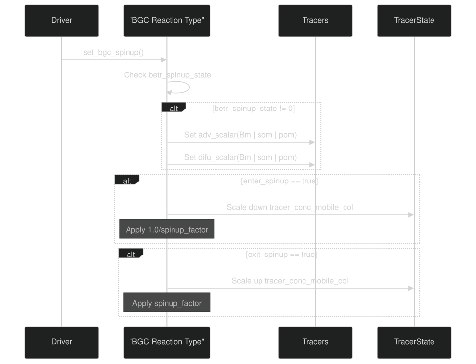

# Spinup Strategies

Relevant source files

- [src/Applications/app_util/ApplicationsFactory.F90](https://github.com/jingtao-lbl/sbetr-resomv1/blob/72301c77/src/Applications/app_util/ApplicationsFactory.F90)
- [src/Applications/soil-farm/bgcfarm_util/BiogeoConType.F90](https://github.com/jingtao-lbl/sbetr-resomv1/blob/72301c77/src/Applications/soil-farm/bgcfarm_util/BiogeoConType.F90)
- [src/Applications/soil-farm/cdom/cdomNlayer/cdomBGCReactionsType.F90](https://github.com/jingtao-lbl/sbetr-resomv1/blob/72301c77/src/Applications/soil-farm/cdom/cdomNlayer/cdomBGCReactionsType.F90)
- [src/Applications/soil-farm/ch4lake/ch4lakeNlayer/ch4lakeBGCReactionsType.F90](https://github.com/jingtao-lbl/sbetr-resomv1/blob/72301c77/src/Applications/soil-farm/ch4lake/ch4lakeNlayer/ch4lakeBGCReactionsType.F90)
- [src/Applications/soil-farm/ch4soil/ch4soilNlayer/ch4soilBGCReactionsType.F90](https://github.com/jingtao-lbl/sbetr-resomv1/blob/72301c77/src/Applications/soil-farm/ch4soil/ch4soilNlayer/ch4soilBGCReactionsType.F90)
- [src/Applications/soil-farm/ecacnp/ecacnp1layer/ecacnpBGCCompetType.F90](https://github.com/jingtao-lbl/sbetr-resomv1/blob/72301c77/src/Applications/soil-farm/ecacnp/ecacnp1layer/ecacnpBGCCompetType.F90)
- [src/Applications/soil-farm/ecacnp/ecacnp1layer/ecacnpBGCIndexType.F90](https://github.com/jingtao-lbl/sbetr-resomv1/blob/72301c77/src/Applications/soil-farm/ecacnp/ecacnp1layer/ecacnpBGCIndexType.F90)
- [src/Applications/soil-farm/ecacnp/ecacnp1layer/ecacnpBGCType.F90](https://github.com/jingtao-lbl/sbetr-resomv1/blob/72301c77/src/Applications/soil-farm/ecacnp/ecacnp1layer/ecacnpBGCType.F90)
- [src/Applications/soil-farm/ecacnp/ecacnpNlayer/ecacnpBGCReactionsType.F90](https://github.com/jingtao-lbl/sbetr-resomv1/blob/72301c77/src/Applications/soil-farm/ecacnp/ecacnpNlayer/ecacnpBGCReactionsType.F90)
- [src/Applications/soil-farm/ecacnp/ecacnpPara/ecacnpParaType.F90](https://github.com/jingtao-lbl/sbetr-resomv1/blob/72301c77/src/Applications/soil-farm/ecacnp/ecacnpPara/ecacnpParaType.F90)
- [src/Applications/soil-farm/keca/kecaNlayer/kecaBGCReactionsType.F90](https://github.com/jingtao-lbl/sbetr-resomv1/blob/72301c77/src/Applications/soil-farm/keca/kecaNlayer/kecaBGCReactionsType.F90)
- [src/betr/betr_util/Tracer_varcon.F90](https://github.com/jingtao-lbl/sbetr-resomv1/blob/72301c77/src/betr/betr_util/Tracer_varcon.F90)
- [src/betr/betr_util/betr_ctrl.F90](https://github.com/jingtao-lbl/sbetr-resomv1/blob/72301c77/src/betr/betr_util/betr_ctrl.F90)

## Purpose and Scope

This document describes the spinup acceleration strategies implemented in BeTR to achieve soil biogeochemical equilibrium in a computationally tractable timeframe. Spinup is essential for initializing soil organic matter (SOM) pools that turnover on multi-decadal to millennial timescales. For general simulation configuration, see [Configuration Files](#2.3) . For details on BGC model parameters, see [Parameter Management](#7.2) .

## Spinup Concept and Motivation

Soil biogeochemical models require centuries to millennia to reach equilibrium due to slow turnover of passive SOM pools. Running models at full temporal resolution for such durations is computationally prohibitive. BeTR implements accelerated decomposition (AD) spinup strategies that:

Sources: [src/betr/betr_util/betr_ctrl.F90 14-18](https://github.com/jingtao-lbl/sbetr-resomv1/blob/72301c77/src/betr/betr_util/betr_ctrl.F90#L14-L18)  [src/Applications/soil-farm/ecacnp/ecacnpPara/ecacnpParaType.F90 248-272](https://github.com/jingtao-lbl/sbetr-resomv1/blob/72301c77/src/Applications/soil-farm/ecacnp/ecacnpPara/ecacnpParaType.F90#L248-L272)

## Spinup States and Control Flags

BeTR defines three spinup states controlled by `betr_spinup_state` :

| State | Value | Description | Purpose | 
| --- | --- | --- | --- |
| Normal | 0 | Regular simulation mode | Production runs with no acceleration | 
| AD-1 | 1 | Accelerated decomposition phase 1 | Accumulate spinup scalars and accelerate decomposition | 
| AD-2 | 2 | Accelerated decomposition phase 2 | Apply pre-computed spinup factors | 

Additional control flags in `betr_ctrl` module:

- `enter_spinup``.true.`**into**: Set to when transitioning spinup mode
- `exit_spinup``.true.`**out**: Set to when transitioning of spinup mode
- `continue_run`: Indicates restart from previous simulation
- `spinup_stage`: Model-specific stage indicator (used by ReSOM)

Diagram: Spinup State Transitions

Sources: [src/betr/betr_util/betr_ctrl.F90 14-19](https://github.com/jingtao-lbl/sbetr-resomv1/blob/72301c77/src/betr/betr_util/betr_ctrl.F90#L14-L19)  [src/Applications/soil-farm/ecacnp/ecacnpBGCReactionsType.F90 177-306](https://github.com/jingtao-lbl/sbetr-resomv1/blob/72301c77/src/Applications/soil-farm/ecacnp/ecacnpBGCReactionsType.F90#L177-L306)

## Acceleration Mechanisms

### Pool-Specific Spinup Factors

BeTR applies different acceleration factors to different organic matter pools. Each BGC model defines a `spinup_factor` array that specifies multipliers for pool-specific decay rates.

Common Pool Indices in`spinup_factor`Array:

| Index | Pool | Typical Factor | 
| --- | --- | --- |
| 1 | Litter pool 1 (metabolic) | 1-10 | 
| 2 | Litter pool 2 (cellulosic) | 1-10 | 
| 3 | Litter pool 3 (lignin) | 1-10 | 
| 4 | Coarse woody debris (CWD) | 1-50 | 
| 5 | Large woody debris (LWD) | 1-50 | 
| 6 | Fine woody debris (FWD) | 1-50 | 
| 7 | Microbial biomass (Bm) | 10-100 | 
| 8 | Slow SOM | 100-1000 | 
| 9 | Passive/Protected SOM (POM) | 100-1000 | 

Diagram: Spinup Factor Application

Sources: [src/Applications/soil-farm/ecacnp/ecacnpPara/ecacnpParaType.F90 248-272](https://github.com/jingtao-lbl/sbetr-resomv1/blob/72301c77/src/Applications/soil-farm/ecacnp/ecacnpPara/ecacnpParaType.F90#L248-L272)  [src/Applications/soil-farm/ecacnp/ecacnpBGCReactionsType.F90 216-222](https://github.com/jingtao-lbl/sbetr-resomv1/blob/72301c77/src/Applications/soil-farm/ecacnp/ecacnpBGCReactionsType.F90#L216-L222)

### Latitude-Based Acceleration

BeTR applies latitude-dependent acceleration factors to account for temperature effects on decomposition rates. This recognizes that high-latitude ecosystems with colder temperatures require longer equilibration times.

The `calc_latacc` function (implementation not shown in provided files but referenced) computes a latitude acceleration factor that multiplies the spinup factors for SOM and POM pools:

This ensures that cold-region soils receive additional acceleration to compensate for naturally slower decomposition.

Sources: [src/Applications/soil-farm/ecacnp/ecacnpBGCReactionsType.F90 215-222](https://github.com/jingtao-lbl/sbetr-resomv1/blob/72301c77/src/Applications/soil-farm/ecacnp/ecacnpBGCReactionsType.F90#L215-L222)

### Transport Scalars

To maintain mass balance during accelerated decomposition, BeTR applies matching scalars to transport processes:

- **`adv_scalar`**: Applied to advective transport (water flow)
- **`difu_scalar`**: Applied to diffusive transport (concentration gradients)

These scalars ensure that accelerated production of mobile tracers (e.g., dissolved organic matter, mineral nutrients) is matched by accelerated transport, preventing unrealistic accumulation.

Sources: [src/Applications/soil-farm/ecacnp/ecacnpBGCReactionsType.F90 217-222](https://github.com/jingtao-lbl/sbetr-resomv1/blob/72301c77/src/Applications/soil-farm/ecacnp/ecacnpBGCReactionsType.F90#L217-L222)

## State Variable Rescaling

### Entering Spinup Mode

When `enter_spinup = .true.` , BeTR rescales state variables downward to compensate for the fact that decay rates will be accelerated:

This rescaling ensures that when the accelerated model runs, the pool sizes grow back to appropriate equilibrium values rather than overshooting.

Process Flow:

### Exiting Spinup Mode

When `exit_spinup = .true.` , BeTR rescales state variables upward to restore them to the slow timescale:

This converts the spinup-equilibrated pools back to full-resolution values appropriate for production simulations.

Rescaling Implementation:

The `rescale_tracer_group` subroutine handles rescaling for tracer groups (C, N, P, and optionally C13, C14):

Sources: [src/Applications/soil-farm/ecacnp/ecacnpBGCReactionsType.F90 264-305](https://github.com/jingtao-lbl/sbetr-resomv1/blob/72301c77/src/Applications/soil-farm/ecacnp/ecacnpBGCReactionsType.F90#L264-L305)

## Model-Specific Implementation

### Factory-Level Coordination

The `ApplicationsFactory` module provides a centralized interface for setting spinup factors across all BGC models:

`AppSetSpinup()`Function:

Sources: [src/Applications/app_util/ApplicationsFactory.F90 277-312](https://github.com/jingtao-lbl/sbetr-resomv1/blob/72301c77/src/Applications/app_util/ApplicationsFactory.F90#L277-L312)

### BGC Reaction Type Interface

Each BGC reaction type (extending `bgc_reaction_type` ) implements a `set_bgc_spinup` method with the following signature:

This method is called during simulation initialization and at spinup transitions to:

Common Implementation Pattern:

Sources: [src/Applications/soil-farm/ecacnp/ecacnpBGCReactionsType.F90 177-306](https://github.com/jingtao-lbl/sbetr-resomv1/blob/72301c77/src/Applications/soil-farm/ecacnp/ecacnpBGCReactionsType.F90#L177-L306)

### Parameter Type Hierarchy

Each BGC model's parameter type extends `BiogeoCon_type` and implements spinup-related methods:

Class Hierarchy:

Sources: [src/Applications/soil-farm/bgcfarm_util/BiogeoConType.F90 8-74](https://github.com/jingtao-lbl/sbetr-resomv1/blob/72301c77/src/Applications/soil-farm/bgcfarm_util/BiogeoConType.F90#L8-L74)  [src/Applications/soil-farm/ecacnp/ecacnpPara/ecacnpParaType.F90 10-89](https://github.com/jingtao-lbl/sbetr-resomv1/blob/72301c77/src/Applications/soil-farm/ecacnp/ecacnpPara/ecacnpParaType.F90#L10-L89)

## Spinup Factor Configuration

### Default Values

BGC models define default spinup factors in their parameter initialization. For example, ECACNP uses:

- **Litter pools (1-3)**: Typically 1-10× acceleration
- **Woody debris (4-6)**: 10-50× acceleration
- **Microbial biomass (7)**: 10-100× acceleration
- **SOM pools (8-9)**: 100-1000× acceleration

These defaults reflect the wide range of turnover times, from months (litter) to millennia (passive SOM).

### Setting Custom Factors

The `set_spinup_factor()` method allows model-specific customization of spinup factors. This method is called by `AppSetSpinup()` to configure factors based on:

- Ecosystem type (tropical vs. boreal)
- Soil properties (clay content, pH)
- Climate (temperature, precipitation)
- Simulation objectives (equilibrium vs. transient)

Sources: [src/Applications/soil-farm/ecacnp/ecacnpPara/ecacnpParaType.F90 87-88](https://github.com/jingtao-lbl/sbetr-resomv1/blob/72301c77/src/Applications/soil-farm/ecacnp/ecacnpPara/ecacnpParaType.F90#L87-L88)  [src/Applications/app_util/ApplicationsFactory.F90 277-312](https://github.com/jingtao-lbl/sbetr-resomv1/blob/72301c77/src/Applications/app_util/ApplicationsFactory.F90#L277-L312)

## Mass Balance Considerations

### C-14 Decay Adjustment

When using C-14 tracers, spinup factors must also be applied to radioactive decay constants to maintain proper isotopic signatures:

This ensures that accelerated carbon cycling is accompanied by proportionally accelerated radioactive decay.

Sources: [src/Applications/soil-farm/ecacnp/ecacnpPara/ecacnpParaType.F90 268-270](https://github.com/jingtao-lbl/sbetr-resomv1/blob/72301c77/src/Applications/soil-farm/ecacnp/ecacnpPara/ecacnpParaType.F90#L268-L270)

### Nutrient Stoichiometry

BeTR rescales all elements (C, N, P) proportionally to maintain stoichiometric ratios:

This prevents artificial changes in C:N:P ratios during spinup transitions.

Sources: [src/Applications/soil-farm/ecacnp/ecacnpBGCReactionsType.F90 281-291](https://github.com/jingtao-lbl/sbetr-resomv1/blob/72301c77/src/Applications/soil-farm/ecacnp/ecacnpBGCReactionsType.F90#L281-L291)

## Usage Workflow

### Typical Spinup Sequence

Diagram: Complete Spinup Workflow

### Key Files and Functions

| Component | File | Key Functions/Variables | 
| --- | --- | --- |
| Spinup State Control | betr_ctrl.F90 | betr_spinup_state, enter_spinup, exit_spinup | 
| Factory Interface | ApplicationsFactory.F90 | AppSetSpinup() | 
| Parameter Initialization | ecacnpParaType.F90 | spinup_factor, set_spinup_factor(), apply_spinup_factor() | 
| State Rescaling | ecacnpBGCReactionsType.F90 | set_bgc_spinup(), rescale_tracer_group() | 
| Tracer Configuration | Tracer_varcon.F90 | AA_spinup_on | 

Sources: [src/betr/betr_util/betr_ctrl.F90 14-18](https://github.com/jingtao-lbl/sbetr-resomv1/blob/72301c77/src/betr/betr_util/betr_ctrl.F90#L14-L18)  [src/Applications/app_util/ApplicationsFactory.F90 277-312](https://github.com/jingtao-lbl/sbetr-resomv1/blob/72301c77/src/Applications/app_util/ApplicationsFactory.F90#L277-L312)  [src/Applications/soil-farm/ecacnp/ecacnpPara/ecacnpParaType.F90 78-88](https://github.com/jingtao-lbl/sbetr-resomv1/blob/72301c77/src/Applications/soil-farm/ecacnp/ecacnpPara/ecacnpParaType.F90#L78-L88)  [src/Applications/soil-farm/ecacnp/ecacnpBGCReactionsType.F90 177-306](https://github.com/jingtao-lbl/sbetr-resomv1/blob/72301c77/src/Applications/soil-farm/ecacnp/ecacnpBGCReactionsType.F90#L177-L306)  [src/betr/betr_util/Tracer_varcon.F90 53](https://github.com/jingtao-lbl/sbetr-resomv1/blob/72301c77/src/betr/betr_util/Tracer_varcon.F90#L53-L53)

## Limitations and Considerations

For debugging spinup issues, see [Debugging Simulations](#11.3) . For performance optimization of long spinup runs, see [Performance Optimization](#11.2) .