# Performance Optimization

Relevant source files

- [3rd-party/CMakeLists.txt](https://github.com/jingtao-lbl/sbetr-resomv1/blob/72301c77/3rd-party/CMakeLists.txt)
- [CMakeLists.txt](https://github.com/jingtao-lbl/sbetr-resomv1/blob/72301c77/CMakeLists.txt)
- [Makefile](https://github.com/jingtao-lbl/sbetr-resomv1/blob/72301c77/Makefile)
- [cmake/Modules/set_up_compilers.cmake](https://github.com/jingtao-lbl/sbetr-resomv1/blob/72301c77/cmake/Modules/set_up_compilers.cmake)
- [cmake/Modules/set_up_platform.cmake](https://github.com/jingtao-lbl/sbetr-resomv1/blob/72301c77/cmake/Modules/set_up_platform.cmake)
- [example_input/ecacnp-reaction.namelist](https://github.com/jingtao-lbl/sbetr-resomv1/blob/72301c77/example_input/ecacnp-reaction.namelist)
- [src/Applications/soil-farm/bgcfarm_util/GeoChemAlgorithmMod.F90](https://github.com/jingtao-lbl/sbetr-resomv1/blob/72301c77/src/Applications/soil-farm/bgcfarm_util/GeoChemAlgorithmMod.F90)
- [src/betr/betr_dtype/BeTR_biogeophysInputType.F90](https://github.com/jingtao-lbl/sbetr-resomv1/blob/72301c77/src/betr/betr_dtype/BeTR_biogeophysInputType.F90)
- [src/driver/clm/BeTRSimulationCLM.F90](https://github.com/jingtao-lbl/sbetr-resomv1/blob/72301c77/src/driver/clm/BeTRSimulationCLM.F90)
- [src/driver/main/BeTRSimulationFactory.F90](https://github.com/jingtao-lbl/sbetr-resomv1/blob/72301c77/src/driver/main/BeTRSimulationFactory.F90)
- [src/driver/main/sbetrDriverMod.F90](https://github.com/jingtao-lbl/sbetr-resomv1/blob/72301c77/src/driver/main/sbetrDriverMod.F90)
- [src/driver/shared/BeTRSimulation.F90](https://github.com/jingtao-lbl/sbetr-resomv1/blob/72301c77/src/driver/shared/BeTRSimulation.F90)
- [src/driver/shared/bncdio_pio.F90](https://github.com/jingtao-lbl/sbetr-resomv1/blob/72301c77/src/driver/shared/bncdio_pio.F90)
- [src/driver/standalone/BeTRSimulationStandalone.F90](https://github.com/jingtao-lbl/sbetr-resomv1/blob/72301c77/src/driver/standalone/BeTRSimulationStandalone.F90)
- [src/driver/standalone/ForcingDataType.F90](https://github.com/jingtao-lbl/sbetr-resomv1/blob/72301c77/src/driver/standalone/ForcingDataType.F90)
- [src/driver/standalone/GridMod.F90](https://github.com/jingtao-lbl/sbetr-resomv1/blob/72301c77/src/driver/standalone/GridMod.F90)
- [src/stub_clm/WaterFluxType.F90](https://github.com/jingtao-lbl/sbetr-resomv1/blob/72301c77/src/stub_clm/WaterFluxType.F90)

This page covers strategies and techniques for optimizing BeTR simulation performance, including compiler optimization, time-stepping strategies, I/O efficiency, and build system configuration. For information about debugging performance issues or numerical instabilities, see [Debugging Simulations](#11.3) . For details on the simulation execution workflow, see [Time-Stepping Loop](#3.3) .

## Compiler Optimization Flags

BeTR supports multiple compiler toolchains with specific optimization strategies for each. The build system automatically selects appropriate flags based on compiler type and build mode.

### Build Mode Selection

Build modes are controlled via the `CMAKE_BUILD_TYPE` variable or the `debug` Makefile option:

Sources:  [Makefile 93-105](https://github.com/jingtao-lbl/sbetr-resomv1/blob/72301c77/Makefile#L93-L105)  [CMakeLists.txt 1-221](https://github.com/jingtao-lbl/sbetr-resomv1/blob/72301c77/CMakeLists.txt#L1-L221)

### Compiler-Specific Optimization Flags

The following table summarizes optimization flags applied by different compilers:

| Compiler | Release Flags | Debug Flags | Platform-Specific | 
| --- | --- | --- | --- |
| GNU Fortran | -O2 (implicit) | -g (implicit) | -fallow-argument-mismatch (gfortran ≥10.1) | 
| Intel Fortran | -O2 -mp1 -r8 -i4 -align dcommons -auto-scalar | -g -debug -r8 -i4 -fpe-all=0 -check all | -mkl (on Cori, Edison) | 
| GNU C | -std=c99 -Wall -fPIC | -g -O0 | -D_POSIX_C_SOURCE=200809L (Linux) | 

Key optimization features:

- **Intel`-mp1`**: Maintains floating-point precision consistency across optimization levels
- **Intel`-r8 -i4`**: Promotes real/integer precision (8-byte reals, 4-byte integers)
- **Intel`-align dcommons`**: Aligns common blocks for better memory access
- **Intel`-auto-scalar`**: Enables automatic scalar temporaries
- **GNU`-fPIC`**: Position-independent code for shared libraries

Sources:  [cmake/Modules/set_up_compilers.cmake 44-75](https://github.com/jingtao-lbl/sbetr-resomv1/blob/72301c77/cmake/Modules/set_up_compilers.cmake#L44-L75)

### Platform-Specific Configurations

Sources:  [cmake/Modules/set_up_platform.cmake 1-106](https://github.com/jingtao-lbl/sbetr-resomv1/blob/72301c77/cmake/Modules/set_up_platform.cmake#L1-L106)  [CMakeLists.txt 134-147](https://github.com/jingtao-lbl/sbetr-resomv1/blob/72301c77/CMakeLists.txt#L134-L147)

## Time-Stepping Strategies

BeTR employs adaptive time-stepping within transport operators to maintain numerical stability while maximizing computational efficiency.

### Operator Splitting Approach

The simulation uses Strang splitting to separate transport processes:

Key components:

- **`step_without_drainage`**: Surface runoff, infiltration, diffusion, advection, ebullition
- **`step_with_drainage`**: Vertical drainage with adaptive substeps
- **BGC reactions**: Occur between transport phases for tight coupling

Performance consideration: The two-phase approach allows different time-stepping strategies for fast (surface) vs. slow (drainage) processes.

Sources:  [src/driver/main/sbetrDriverMod.F90 26](https://github.com/jingtao-lbl/sbetr-resomv1/blob/72301c77/src/driver/main/sbetrDriverMod.F90#L26-L26)  [src/driver/main/sbetrDriverMod.F90 267-343](https://github.com/jingtao-lbl/sbetr-resomv1/blob/72301c77/src/driver/main/sbetrDriverMod.F90#L267-L343)

### Adaptive Time-Stepping Algorithm

Transport operators use adaptive sub-stepping to prevent negative concentrations:

Performance tuning:

- `delta_time`Larger base timesteps ( in namelist) reduce overhead but may trigger more substeps
- Typical values: 1800s (30 min) for biogeochemical simulations, 3600s (1 hour) for tracer-only

Sources:  [src/betr/betr_core/TracerCoeffType.F90](https://github.com/jingtao-lbl/sbetr-resomv1/blob/72301c77/src/betr/betr_core/TracerCoeffType.F90)  [example_input/ecacnp-reaction.namelist 23](https://github.com/jingtao-lbl/sbetr-resomv1/blob/72301c77/example_input/ecacnp-reaction.namelist#L23-L23)

### Mass Balance Checking Overhead

Mass balance checks can be disabled during production runs to reduce overhead:

Performance impact: Mass balance checking adds ~5-10% overhead. Disable for production runs after validation.

Disabled in code:  [src/driver/main/sbetrDriverMod.F90 265](https://github.com/jingtao-lbl/sbetr-resomv1/blob/72301c77/src/driver/main/sbetrDriverMod.F90#L265-L265)  [src/driver/main/sbetrDriverMod.F90 346](https://github.com/jingtao-lbl/sbetr-resomv1/blob/72301c77/src/driver/main/sbetrDriverMod.F90#L346-L346)

Sources:  [src/driver/main/sbetrDriverMod.F90 265-346](https://github.com/jingtao-lbl/sbetr-resomv1/blob/72301c77/src/driver/main/sbetrDriverMod.F90#L265-L346)  [src/driver/shared/BeTRSimulation.F90 717-790](https://github.com/jingtao-lbl/sbetr-resomv1/blob/72301c77/src/driver/shared/BeTRSimulation.F90#L717-L790)

## I/O Optimization

NetCDF I/O operations can dominate runtime for fine temporal output or large spatial domains.

### History Output Frequency

Control output frequency via namelist parameters:

Performance guidelines:

| Output Frequency | Use Case | Relative Cost | 
| --- | --- | --- |
| Every timestep | Debugging, sub-hourly analysis | Very High (10-50x) | 
| Hourly | Process studies | High (3-10x) | 
| Daily | Standard runs | Moderate (1.5-3x) | 
| Monthly | Long-term simulations | Low (1.1-1.5x) | 

Sources:  [example_input/ecacnp-reaction.namelist 22-27](https://github.com/jingtao-lbl/sbetr-resomv1/blob/72301c77/example_input/ecacnp-reaction.namelist#L22-L27)

### Forcing Data Access Patterns

Forcing data is read and cached at initialization, then accessed by timestep:

Memory vs. I/O trade-off:

- **Current approach**: Load entire forcing dataset into memory (favors speed)
- **Alternative**: Stream data timestep-by-timestep (favors memory efficiency)

For large datasets: Consider streaming I/O if memory is constrained (requires code modification).

Sources:  [src/driver/standalone/ForcingDataType.F90 340-494](https://github.com/jingtao-lbl/sbetr-resomv1/blob/72301c77/src/driver/standalone/ForcingDataType.F90#L340-L494)  [src/driver/main/sbetrDriverMod.F90 238-244](https://github.com/jingtao-lbl/sbetr-resomv1/blob/72301c77/src/driver/main/sbetrDriverMod.F90#L238-L244)

### NetCDF Parallel I/O

BeTR uses serial NetCDF I/O through the `bncdio_pio` module. For MPI simulations, I/O is performed by the master process.

Performance bottleneck: Serial I/O becomes a bottleneck for large-scale parallel runs (>100 cores).

Future optimization: Implement parallel NetCDF (PnetCDF or HDF5-parallel) for scalability.

Sources:  [src/driver/shared/bncdio_pio.F90 1-2700](https://github.com/jingtao-lbl/sbetr-resomv1/blob/72301c77/src/driver/shared/bncdio_pio.F90#L1-L2700)

## Memory Allocation Patterns

BeTR allocates memory hierarchically: simulation → columns → layers.

### Column-Based Data Layout

Data is organized by column to facilitate spatial decomposition:

Allocation strategy:

- [BeTRSimulation.F90428-436](https://github.com/jingtao-lbl/sbetr-resomv1/blob/72301c77/BeTRSimulation.F90#L428-L436)Allocate per-column arrays at initialization ( )
- Allocate layer-wise arrays within each column
- `pointer`Use Fortran pointers ( attribute) for flexibility

Memory footprint estimation:

For typical ECACNP simulation: ~50 tracers × 15 layers × 8 bytes ≈ 6 KB per column

Sources:  [src/driver/shared/BeTRSimulation.F90 428-510](https://github.com/jingtao-lbl/sbetr-resomv1/blob/72301c77/src/driver/shared/BeTRSimulation.F90#L428-L510)  [src/betr/betr_dtype/BeTR_biogeophysInputType.F90 185-251](https://github.com/jingtao-lbl/sbetr-resomv1/blob/72301c77/src/betr/betr_dtype/BeTR_biogeophysInputType.F90#L185-L251)

### Restart File Memory

Restart variables are separated from history output to reduce memory:

Performance tip: Restart variables are minimal (only state variables), while history includes diagnostics. This separation reduces restart file size and write time.

Sources:  [src/driver/shared/BeTRSimulation.F90 552-602](https://github.com/jingtao-lbl/sbetr-resomv1/blob/72301c77/src/driver/shared/BeTRSimulation.F90#L552-L602)

## Build System Optimization

The CMake-based build system provides several options for optimizing compilation and linking.

### Parallel Compilation

Third-party library builds:

- zlib, HDF5, NetCDF compiled in sequence (dependencies)
- `make install -j${NUM_BUILD_THREADS}`Each library uses
- Total build time: ~10-30 minutes depending on system

Sources:  [3rd-party/CMakeLists.txt 44-48](https://github.com/jingtao-lbl/sbetr-resomv1/blob/72301c77/3rd-party/CMakeLists.txt#L44-L48)  [3rd-party/CMakeLists.txt 106-120](https://github.com/jingtao-lbl/sbetr-resomv1/blob/72301c77/3rd-party/CMakeLists.txt#L106-L120)

### Static vs. Shared Libraries

Trade-offs:

| Library Type | Advantages | Disadvantages | 
| --- | --- | --- |
| Static | No runtime linking overhead, self-contained | Large executables, recompile for updates | 
| Shared | Smaller executables, update without recompile | Slower startup, library path issues | 

Recommendation: Use static libraries for production HPC runs, shared for development.

Sources:  [Makefile 69-76](https://github.com/jingtao-lbl/sbetr-resomv1/blob/72301c77/Makefile#L69-L76)  [CMakeLists.txt 16-34](https://github.com/jingtao-lbl/sbetr-resomv1/blob/72301c77/CMakeLists.txt#L16-L34)

### CMake Build Type Optimization

Compiler flags by build type:

Performance impact: Release builds are typically 3-10× faster than Debug builds.

Sources:  [cmake/Modules/set_up_compilers.cmake 44-75](https://github.com/jingtao-lbl/sbetr-resomv1/blob/72301c77/cmake/Modules/set_up_compilers.cmake#L44-L75)  [Makefile 93-105](https://github.com/jingtao-lbl/sbetr-resomv1/blob/72301c77/Makefile#L93-L105)

## Profiling and Performance Measurement

### Instrumentation Points

Key performance metrics available through BeTR:

### Performance Bottleneck Identification

Common performance patterns:

Sources:  [src/driver/main/sbetrDriverMod.F90 229-395](https://github.com/jingtao-lbl/sbetr-resomv1/blob/72301c77/src/driver/main/sbetrDriverMod.F90#L229-L395)

### Regression Test Performance Tracking

The regression test framework provides baseline timing:

Use regression tests to detect performance regressions after code changes.

Sources:  [Makefile 160-166](https://github.com/jingtao-lbl/sbetr-resomv1/blob/72301c77/Makefile#L160-L166)

## Platform-Specific Optimizations

### NERSC Systems (Cori, Edison)

Optimization features:

- Intel Math Kernel Library (MKL) for BLAS/LAPACK
- Compiler optimization flags tuned for Xeon processors
- Fast interconnect for MPI (when enabled)

Sources:  [cmake/Modules/set_up_platform.cmake 56-81](https://github.com/jingtao-lbl/sbetr-resomv1/blob/72301c77/cmake/Modules/set_up_platform.cmake#L56-L81)

### NCAR Yellowstone

Sources:  [cmake/Modules/set_up_platform.cmake 82-97](https://github.com/jingtao-lbl/sbetr-resomv1/blob/72301c77/cmake/Modules/set_up_platform.cmake#L82-L97)

### Generic Linux/macOS

Sources:  [cmake/Modules/set_up_platform.cmake 98-106](https://github.com/jingtao-lbl/sbetr-resomv1/blob/72301c77/cmake/Modules/set_up_platform.cmake#L98-L106)  [CMakeLists.txt 134-147](https://github.com/jingtao-lbl/sbetr-resomv1/blob/72301c77/CMakeLists.txt#L134-L147)

## Recommended Performance Tuning Workflow

Sources:  [example_input/ecacnp-reaction.namelist 1-40](https://github.com/jingtao-lbl/sbetr-resomv1/blob/72301c77/example_input/ecacnp-reaction.namelist#L1-L40)  [src/driver/main/sbetrDriverMod.F90 21-404](https://github.com/jingtao-lbl/sbetr-resomv1/blob/72301c77/src/driver/main/sbetrDriverMod.F90#L21-L404)