# Debugging Simulations

Relevant source files

- [src/betr/betr_core/BeTRTracerType.F90](https://github.com/jingtao-lbl/sbetr-resomv1/blob/72301c77/src/betr/betr_core/BeTRTracerType.F90)
- [src/betr/betr_core/TracerBaseType.F90](https://github.com/jingtao-lbl/sbetr-resomv1/blob/72301c77/src/betr/betr_core/TracerBaseType.F90)
- [src/betr/betr_core/TracerBoundaryCondType.F90](https://github.com/jingtao-lbl/sbetr-resomv1/blob/72301c77/src/betr/betr_core/TracerBoundaryCondType.F90)
- [src/betr/betr_core/TracerCoeffType.F90](https://github.com/jingtao-lbl/sbetr-resomv1/blob/72301c77/src/betr/betr_core/TracerCoeffType.F90)
- [src/betr/betr_core/TracerFluxType.F90](https://github.com/jingtao-lbl/sbetr-resomv1/blob/72301c77/src/betr/betr_core/TracerFluxType.F90)
- [src/betr/betr_core/TracerStateType.F90](https://github.com/jingtao-lbl/sbetr-resomv1/blob/72301c77/src/betr/betr_core/TracerStateType.F90)
- [src/betr/betr_main/BetrBGCMod.F90](https://github.com/jingtao-lbl/sbetr-resomv1/blob/72301c77/src/betr/betr_main/BetrBGCMod.F90)
- [src/betr/betr_main/TracerBalanceMod.F90](https://github.com/jingtao-lbl/sbetr-resomv1/blob/72301c77/src/betr/betr_main/TracerBalanceMod.F90)
- [src/betr/betr_para/TracerParamsMod.F90](https://github.com/jingtao-lbl/sbetr-resomv1/blob/72301c77/src/betr/betr_para/TracerParamsMod.F90)

This page provides guidance for diagnosing and resolving failures in BeTR simulations, including common error messages, mass balance failures, negative tracer concentrations, and numerical instabilities. For information about performance optimization, see [Performance Optimization](#11.2) . For configuring simulations, see [Configuration Files](#2.3) .

## Error Detection Architecture

BeTR employs multiple layers of error detection to catch issues early and provide diagnostic information:

Sources:  [src/betr/betr_main/BetrBGCMod.F90 1-720](https://github.com/jingtao-lbl/sbetr-resomv1/blob/72301c77/src/betr/betr_main/BetrBGCMod.F90#L1-L720)  [src/betr/betr_main/TracerBalanceMod.F90 1-245](https://github.com/jingtao-lbl/sbetr-resomv1/blob/72301c77/src/betr/betr_main/TracerBalanceMod.F90#L1-L245)  [src/betr/betr_core/TracerStateType.F90 1-500](https://github.com/jingtao-lbl/sbetr-resomv1/blob/72301c77/src/betr/betr_core/TracerStateType.F90#L1-L500)

## Common Error Types

### Mass Balance Failures

Mass balance errors occur when the sum of inputs, outputs, and internal production/consumption does not match the change in tracer inventory. BeTR performs rigorous mass balance checking at the end of each time step.

Error tolerance thresholds:

| Error Type | Absolute Threshold | Relative Threshold | 
| --- | --- | --- |
| Mass balance error | 1.e-8 mol/m² | 1.e-3 (0.1%) | 
| Solid phase transport | 1.e-12 mol/m² | N/A | 

Typical error message:

Sources:  [src/betr/betr_main/TracerBalanceMod.F90 109-110](https://github.com/jingtao-lbl/sbetr-resomv1/blob/72301c77/src/betr/betr_main/TracerBalanceMod.F90#L109-L110)  [src/betr/betr_main/TracerBalanceMod.F90 147-174](https://github.com/jingtao-lbl/sbetr-resomv1/blob/72301c77/src/betr/betr_main/TracerBalanceMod.F90#L147-L174)

### Negative Tracer Concentrations

Negative concentrations indicate numerical instability, typically during transport operations. BeTR uses adaptive time-stepping to prevent this:

Sources:  [src/betr/betr_main/BetrBGCMod.F90 506-537](https://github.com/jingtao-lbl/sbetr-resomv1/blob/72301c77/src/betr/betr_main/BetrBGCMod.F90#L506-L537)  [src/betr/betr_main/BetrBGCMod.F90 39-40](https://github.com/jingtao-lbl/sbetr-resomv1/blob/72301c77/src/betr/betr_main/BetrBGCMod.F90#L39-L40)

Typical error message:

This error indicates the time step became too small to prevent negative concentrations, suggesting severe numerical instability or incorrect parameterization.

Sources:  [src/betr/betr_main/BetrBGCMod.F90 516-525](https://github.com/jingtao-lbl/sbetr-resomv1/blob/72301c77/src/betr/betr_main/BetrBGCMod.F90#L516-L525)

### Numerical Instabilities in ODE Integration

BGC reaction calculations use ODE integrators that may fail to converge or produce unphysical results:

Common causes:

- Stiff reaction systems (rapid vs. slow reactions)
- Extreme parameter values (very high rate constants)
- Inconsistent initial conditions
- Violating conservation constraints

Where to look:

- `bgc_reaction%calc_bgc_reaction`[src/betr/betr_main/BetrBGCMod.F90](https://github.com/jingtao-lbl/sbetr-resomv1/blob/72301c77/src/betr/betr_main/BetrBGCMod.F90)calls in
- [ODE Integrators](#6.1)ODE integrator selection and settings (see )

## Mass Balance Checking Workflow

BeTR performs mass balance checks using the `TracerBalanceMod` module:

Key equations:

For each tracer, the mass balance error is computed as:

Where:

- `beg_mass``end_mass`, : Integrated column tracer mass at start/end of time step
- `netpro`: Net biogeochemical production (mol/m²/s)
- `netphyloss`: Net physical loss through drainage, runoff, ebullition, diffusion (mol/m²/s)
- `dtime`: Time step size (s)

Sources:  [src/betr/betr_main/TracerBalanceMod.F90 31-66](https://github.com/jingtao-lbl/sbetr-resomv1/blob/72301c77/src/betr/betr_main/TracerBalanceMod.F90#L31-L66)  [src/betr/betr_main/TracerBalanceMod.F90 69-178](https://github.com/jingtao-lbl/sbetr-resomv1/blob/72301c77/src/betr/betr_main/TracerBalanceMod.F90#L69-L178)  [src/betr/betr_main/TracerBalanceMod.F90 182-244](https://github.com/jingtao-lbl/sbetr-resomv1/blob/72301c77/src/betr/betr_main/TracerBalanceMod.F90#L182-L244)

## Diagnostic Output Tools

### Flux Display Method

The `TracerFlux_type` provides a `flux_display` method that outputs all flux components for a specific column and tracer:

Usage location: Called automatically during mass balance check failures [src/betr/betr_main/TracerBalanceMod.F90 168](https://github.com/jingtao-lbl/sbetr-resomv1/blob/72301c77/src/betr/betr_main/TracerBalanceMod.F90#L168-L168)

Output includes:

- `tracer_flx_prec_col`Precipitation flux ( )
- `tracer_flx_infl_col`Infiltration flux ( )
- `tracer_flx_surfrun_col`Surface runoff ( )
- `tracer_flx_drain_col`Drainage ( )
- `tracer_flx_ebu_col`Ebullition ( )
- `tracer_flx_dif_col`Diffusion ( )
- `tracer_flx_vtrans_col`Plant uptake ( )
- `tracer_flx_netpro_col`Net biogeochemical production ( )
- `tracer_flx_netpro_vr_col`Vertically-resolved sources ( )

Sources:  [src/betr/betr_core/TracerFluxType.F90 1-800](https://github.com/jingtao-lbl/sbetr-resomv1/blob/72301c77/src/betr/betr_core/TracerFluxType.F90#L1-L800)

### History Output Variables

Enable detailed history output by activating specific variables (see [Input/Output System](#11.4) ):

| Variable Pattern | Purpose | 
| --- | --- |
| <TRACER>_TRACER_CONC_BULK | Bulk concentration profile | 
| <TRACER>_TRACER_ERR | Mass balance error | 
| <TRACER>_FLX_* | Individual flux components | 
| <TRACER>_TRACER_P_GAS | Gas pressure (volatile tracers) | 
| HMCONDC_vr_<TRACER> | Diffusive conductance profile | 

Sources:  [src/betr/betr_core/TracerStateType.F90 140-222](https://github.com/jingtao-lbl/sbetr-resomv1/blob/72301c77/src/betr/betr_core/TracerStateType.F90#L140-L222)  [src/betr/betr_core/TracerFluxType.F90 195-330](https://github.com/jingtao-lbl/sbetr-resomv1/blob/72301c77/src/betr/betr_core/TracerFluxType.F90#L195-L330)  [src/betr/betr_core/TracerCoeffType.F90 177-251](https://github.com/jingtao-lbl/sbetr-resomv1/blob/72301c77/src/betr/betr_core/TracerCoeffType.F90#L177-L251)

### Debug Mode Configuration

Set `debug = .true.` in the `betrtracer_type` structure to enable additional runtime checks:

Debug features:

- Extra validation of array bounds
- More frequent state dumps
- Detailed convergence information

Source:  [src/betr/betr_core/BeTRTracerType.F90 116](https://github.com/jingtao-lbl/sbetr-resomv1/blob/72301c77/src/betr/betr_core/BeTRTracerType.F90#L116-L116)  [src/betr/betr_core/BeTRTracerType.F90 141](https://github.com/jingtao-lbl/sbetr-resomv1/blob/72301c77/src/betr/betr_core/BeTRTracerType.F90#L141-L141)

## Assertion Failures

BeTR uses `SHR_ASSERT` macros extensively to validate array dimensions and consistency:

Common assertion patterns:

When assertions fail:

- `errMsg`Error message includes file name and line number via macro
- Simulation stops immediately
- Check array dimensions in configuration and initialization

Sources:  [src/betr/betr_main/BetrBGCMod.F90 170-174](https://github.com/jingtao-lbl/sbetr-resomv1/blob/72301c77/src/betr/betr_main/BetrBGCMod.F90#L170-L174)  [src/betr/betr_main/BetrBGCMod.F90 314-318](https://github.com/jingtao-lbl/sbetr-resomv1/blob/72301c77/src/betr/betr_main/BetrBGCMod.F90#L314-L318)  [src/betr/betr_main/BetrBGCMod.F90 447-461](https://github.com/jingtao-lbl/sbetr-resomv1/blob/72301c77/src/betr/betr_main/BetrBGCMod.F90#L447-L461)

## Troubleshooting Guide

### Step-by-Step Debugging Process

### Common Issues and Solutions

| Symptom | Likely Cause | Solution | 
| --- | --- | --- |
| Mass balance error at initialization | Initial conditions inconsistent with parameters | Run spinup simulation to equilibrate | 
| Persistent negative concentrations in top layer | Surface boundary condition too strong | Reduce atmospheric concentration or flux | 
| Negative concentrations during rainfall | Infiltration flux calculation error | Check infiltration calculation in calc_tracer_infiltration | 
| Mass balance error only for volatile tracers | Phase equilibration issue | Check Henry's law coefficients and temperature | 
| Error in specific column only | Unusual forcing data or grid cell type | Examine biophysforc inputs for that column | 
| Solid phase transport failure | Cryoturbation/bioturbation diffusivity too high | Reduce tracer_solid_passive_diffus_scal_group | 
| ODE integration failure | Stiff reaction system | Switch to more robust integrator (e.g., BBKS) | 

Sources:  [src/betr/betr_main/BetrBGCMod.F90 1-1500](https://github.com/jingtao-lbl/sbetr-resomv1/blob/72301c77/src/betr/betr_main/BetrBGCMod.F90#L1-L1500)  [src/betr/betr_para/TracerParamsMod.F90 1-1000](https://github.com/jingtao-lbl/sbetr-resomv1/blob/72301c77/src/betr/betr_para/TracerParamsMod.F90#L1-L1000)  [src/betr/betr_main/TracerBalanceMod.F90 1-245](https://github.com/jingtao-lbl/sbetr-resomv1/blob/72301c77/src/betr/betr_main/TracerBalanceMod.F90#L1-L245)

## Code Entity Reference

Key modules for debugging:

- `BetrBGCMod`[src/betr/betr_main/BetrBGCMod.F90](https://github.com/jingtao-lbl/sbetr-resomv1/blob/72301c77/src/betr/betr_main/BetrBGCMod.F90)
- `tracer_gw_transport`[679-694](https://github.com/jingtao-lbl/sbetr-resomv1/blob/72301c77/679-694): Gas-water transport wrapper
- `tracer_solid_transport`[364-576](https://github.com/jingtao-lbl/sbetr-resomv1/blob/72301c77/364-576): Solid phase transport with error checking
- `do_tracer_gw_diffusion`[661-673](https://github.com/jingtao-lbl/sbetr-resomv1/blob/72301c77/661-673): Diffusion with stability checks

: Transport operations, adaptive time-stepping
- `TracerBalanceMod`[src/betr/betr_main/TracerBalanceMod.F90](https://github.com/jingtao-lbl/sbetr-resomv1/blob/72301c77/src/betr/betr_main/TracerBalanceMod.F90)
- `begin_betr_tracer_massbalance`[31-66](https://github.com/jingtao-lbl/sbetr-resomv1/blob/72301c77/31-66): Initialize mass tracking
- `betr_tracer_massbalance_check`[69-178](https://github.com/jingtao-lbl/sbetr-resomv1/blob/72301c77/69-178): Compute and validate error
- `betr_tracer_mass_summary`[182-244](https://github.com/jingtao-lbl/sbetr-resomv1/blob/72301c77/182-244): Integrate column mass

: Mass balance validation
- `TracerFluxType`[src/betr/betr_core/TracerFluxType.F90](https://github.com/jingtao-lbl/sbetr-resomv1/blob/72301c77/src/betr/betr_core/TracerFluxType.F90)
- `flux_summary`: Aggregate flux components
- `flux_display`: Diagnostic output of all fluxes
- `Temporal_average`[79](https://github.com/jingtao-lbl/sbetr-resomv1/blob/72301c77/79): Time-average fluxes for output

: Flux tracking and display
- `TracerStateType`[src/betr/betr_core/TracerStateType.F90](https://github.com/jingtao-lbl/sbetr-resomv1/blob/72301c77/src/betr/betr_core/TracerStateType.F90)
- `errtracer_col`[43](https://github.com/jingtao-lbl/sbetr-resomv1/blob/72301c77/43): Per-tracer mass balance error
- `int_mass_mobile_col`[320-335](https://github.com/jingtao-lbl/sbetr-resomv1/blob/72301c77/320-335): Integrate mobile tracer mass
- `int_mass_frozen_col`[338-354](https://github.com/jingtao-lbl/sbetr-resomv1/blob/72301c77/338-354): Integrate frozen tracer mass

: State variables with error tracking
- `BetrStatusType`
- `betr_status%reset()`: Clear error state
- `betr_status%check_status()`: Check if error occurred
- `betr_status%set_msg()`: Set error message

: Error status accumulation and propagation

Sources:  [src/betr/betr_main/BetrBGCMod.F90](https://github.com/jingtao-lbl/sbetr-resomv1/blob/72301c77/src/betr/betr_main/BetrBGCMod.F90)  [src/betr/betr_main/TracerBalanceMod.F90](https://github.com/jingtao-lbl/sbetr-resomv1/blob/72301c77/src/betr/betr_main/TracerBalanceMod.F90)  [src/betr/betr_core/TracerFluxType.F90](https://github.com/jingtao-lbl/sbetr-resomv1/blob/72301c77/src/betr/betr_core/TracerFluxType.F90)  [src/betr/betr_core/TracerStateType.F90](https://github.com/jingtao-lbl/sbetr-resomv1/blob/72301c77/src/betr/betr_core/TracerStateType.F90)