# Advanced Topics

Relevant source files

- [example_input/ecacnp-reaction.namelist](https://github.com/jingtao-lbl/sbetr-resomv1/blob/72301c77/example_input/ecacnp-reaction.namelist)
- [src/Applications/app_util/ApplicationsFactory.F90](https://github.com/jingtao-lbl/sbetr-resomv1/blob/72301c77/src/Applications/app_util/ApplicationsFactory.F90)
- [src/Applications/soil-farm/bgcfarm_util/BiogeoConType.F90](https://github.com/jingtao-lbl/sbetr-resomv1/blob/72301c77/src/Applications/soil-farm/bgcfarm_util/BiogeoConType.F90)
- [src/Applications/soil-farm/bgcfarm_util/GeoChemAlgorithmMod.F90](https://github.com/jingtao-lbl/sbetr-resomv1/blob/72301c77/src/Applications/soil-farm/bgcfarm_util/GeoChemAlgorithmMod.F90)
- [src/betr/betr_dtype/BeTR_biogeophysInputType.F90](https://github.com/jingtao-lbl/sbetr-resomv1/blob/72301c77/src/betr/betr_dtype/BeTR_biogeophysInputType.F90)
- [src/betr/betr_util/Tracer_varcon.F90](https://github.com/jingtao-lbl/sbetr-resomv1/blob/72301c77/src/betr/betr_util/Tracer_varcon.F90)
- [src/betr/betr_util/betr_ctrl.F90](https://github.com/jingtao-lbl/sbetr-resomv1/blob/72301c77/src/betr/betr_util/betr_ctrl.F90)
- [src/driver/clm/BeTRSimulationCLM.F90](https://github.com/jingtao-lbl/sbetr-resomv1/blob/72301c77/src/driver/clm/BeTRSimulationCLM.F90)
- [src/driver/main/BeTRSimulationFactory.F90](https://github.com/jingtao-lbl/sbetr-resomv1/blob/72301c77/src/driver/main/BeTRSimulationFactory.F90)
- [src/driver/main/sbetrDriverMod.F90](https://github.com/jingtao-lbl/sbetr-resomv1/blob/72301c77/src/driver/main/sbetrDriverMod.F90)
- [src/driver/shared/BeTRSimulation.F90](https://github.com/jingtao-lbl/sbetr-resomv1/blob/72301c77/src/driver/shared/BeTRSimulation.F90)
- [src/driver/shared/bncdio_pio.F90](https://github.com/jingtao-lbl/sbetr-resomv1/blob/72301c77/src/driver/shared/bncdio_pio.F90)
- [src/driver/standalone/BeTRSimulationStandalone.F90](https://github.com/jingtao-lbl/sbetr-resomv1/blob/72301c77/src/driver/standalone/BeTRSimulationStandalone.F90)
- [src/driver/standalone/ForcingDataType.F90](https://github.com/jingtao-lbl/sbetr-resomv1/blob/72301c77/src/driver/standalone/ForcingDataType.F90)
- [src/driver/standalone/GridMod.F90](https://github.com/jingtao-lbl/sbetr-resomv1/blob/72301c77/src/driver/standalone/GridMod.F90)
- [src/stub_clm/WaterFluxType.F90](https://github.com/jingtao-lbl/sbetr-resomv1/blob/72301c77/src/stub_clm/WaterFluxType.F90)

## Purpose and Scope

This section covers advanced usage patterns, optimization strategies, and implementation details for BeTR simulations. These topics are intended for users who need to:

- Accelerate long equilibration runs using spinup techniques
- Optimize simulation performance for production runs
- Debug numerical instabilities or mass balance failures
- Understand and customize the input/output system

For basic simulation setup and execution, see [Getting Started](#2) . For standard BGC model usage, see [BGC Models](#7) . For coupling with land surface models, see [Land Model Coupling](#9) .

The following subsections provide detailed guidance on:

- **[Spinup Strategies](#11.1)**: Accelerated equilibration techniques for bringing models to steady state
- **[Performance Optimization](#11.2)**: Compiler flags, time-stepping strategies, and computational efficiency
- **[Debugging Simulations](#11.3)**: Error diagnosis, mass balance checking, and troubleshooting numerical issues
- **[Input/Output System](#11.4)**: NetCDF file formats, history output configuration, and restart capability

## Overview of Advanced Topics

BeTR's advanced capabilities are organized around four major themes that address common challenges in reactive transport modeling at ecosystem scales.

### Spinup and Equilibration

Long-term carbon and nutrient cycling simulations require equilibration periods that can span centuries to millennia. BeTR implements accelerated spinup techniques that use temporal scaling factors to reach quasi-equilibrium states more efficiently. The spinup system supports multiple stages (AD-1, AD-2) and model-specific strategies.

Key code entities: `betr_spinup_state` , `scalaravg_col` , `dom_scalar_col` , `AppSetSpinup()`

### Performance Considerations

BeTR's adaptive time-stepping and implicit numerical methods have computational costs that vary with simulation configuration. Performance optimization involves selecting appropriate solver tolerances, managing memory allocation patterns, and exploiting compiler optimizations.

Key code entities: `adaptive_tstep` , ODE integrators (BBKS, RK methods), `dtime` management

### Error Handling and Diagnostics

Robust error detection prevents silent failures and provides actionable diagnostic information. BeTR implements hierarchical status checking, mass balance verification, and convergence monitoring.

Key code entities: `betr_status_type` , `betr_status_sim_type` , `BeginMassBalanceCheck` , `MassBalanceCheck`

### Input/Output Infrastructure

BeTR reads and writes NetCDF files for configuration (parameters), forcing data, history output, and restart capability. Understanding the I/O system is essential for customizing output variables and ensuring reproducible simulations.

Key code entities: `hist_htapes_create` , `BeTRRestartOffline` , `ncd_pio_openfile` , `AppLoadParameters`

## Spinup System Architecture

The following diagram shows how spinup acceleration integrates with the main simulation loop:

Sources : [src/driver/shared/BeTRSimulation.F90 492-501](https://github.com/jingtao-lbl/sbetr-resomv1/blob/72301c77/src/driver/shared/BeTRSimulation.F90#L492-L501)  [src/Applications/app_util/ApplicationsFactory.F90 277-312](https://github.com/jingtao-lbl/sbetr-resomv1/blob/72301c77/src/Applications/app_util/ApplicationsFactory.F90#L277-L312)  [src/betr/betr_util/betr_ctrl.F90 14-18](https://github.com/jingtao-lbl/sbetr-resomv1/blob/72301c77/src/betr/betr_util/betr_ctrl.F90#L14-L18)

### Spinup State Management

The spinup system uses global flags and column-level scaling factors:

| Component | Type | Purpose | Location | 
| --- | --- | --- | --- |
| betr_spinup_state | integer | Global spinup mode (0/1/2) | betr_ctrl.F90:16 | 
| spinup_stage | integer | ReSOM-specific stage | betr_ctrl.F90:18 | 
| enter_spinup | logical | Trigger spinup entry | betr_ctrl.F90:15 | 
| exit_spinup | logical | Trigger spinup exit | betr_ctrl.F90:14 | 
| scalaravg_col(:) | real(r8) | Column-level accumulated scalars | BeTRSimulation.F90:112 | 
| dom_scalar_col(:) | real(r8) | Decomposition scaling factors | BeTRSimulation.F90:113 | 

Sources : [src/betr/betr_util/betr_ctrl.F90 14-18](https://github.com/jingtao-lbl/sbetr-resomv1/blob/72301c77/src/betr/betr_util/betr_ctrl.F90#L14-L18)  [src/driver/shared/BeTRSimulation.F90 112-113](https://github.com/jingtao-lbl/sbetr-resomv1/blob/72301c77/src/driver/shared/BeTRSimulation.F90#L112-L113)

## I/O System Architecture

BeTR's I/O system handles multiple file types with distinct purposes:

Sources : [src/driver/shared/BeTRSimulation.F90 794-875](https://github.com/jingtao-lbl/sbetr-resomv1/blob/72301c77/src/driver/shared/BeTRSimulation.F90#L794-L875)  [src/Applications/app_util/ApplicationsFactory.F90 178-223](https://github.com/jingtao-lbl/sbetr-resomv1/blob/72301c77/src/Applications/app_util/ApplicationsFactory.F90#L178-L223)  [src/driver/standalone/ForcingDataType.F90 340-383](https://github.com/jingtao-lbl/sbetr-resomv1/blob/72301c77/src/driver/standalone/ForcingDataType.F90#L340-L383)

### NetCDF I/O Operations

BeTR uses the `bncdio_pio` module for all NetCDF operations. Key functions:

| Function | Purpose | Common Usage | 
| --- | --- | --- |
| ncd_pio_openfile() | Open existing file for reading | Parameter and forcing data input | 
| ncd_pio_createfile() | Create new NetCDF file | History and restart output | 
| ncd_pio_closefile() | Close file handle | Resource cleanup | 
| ncd_defvar() | Define variable metadata | History file creation | 
| ncd_putvar() | Write data to variable | History and restart output | 
| ncd_getvar() | Read data from variable | Parameter and forcing input | 
| get_dim_len() | Query dimension length | Validation and memory allocation | 

Sources : [src/driver/shared/bncdio_pio.F90 33-50](https://github.com/jingtao-lbl/sbetr-resomv1/blob/72301c77/src/driver/shared/bncdio_pio.F90#L33-L50)

## Error Handling and Status Management

BeTR implements a two-tier error reporting system:

Sources : [src/driver/shared/BeTRSimulation.F90 173-189](https://github.com/jingtao-lbl/sbetr-resomv1/blob/72301c77/src/driver/shared/BeTRSimulation.F90#L173-L189)  [src/betr/betr_util/BetrStatusType.F90](https://github.com/jingtao-lbl/sbetr-resomv1/blob/72301c77/src/betr/betr_util/BetrStatusType.F90)

### Status Type Usage Pattern

The typical pattern for error handling in column loops:

Sources : [src/driver/standalone/BeTRSimulationStandalone.F90 173-189](https://github.com/jingtao-lbl/sbetr-resomv1/blob/72301c77/src/driver/standalone/BeTRSimulationStandalone.F90#L173-L189)

## Mass Balance Checking

BeTR tracks tracer mass balance to detect numerical errors:

Sources : [src/driver/shared/BeTRSimulation.F90 717-790](https://github.com/jingtao-lbl/sbetr-resomv1/blob/72301c77/src/driver/shared/BeTRSimulation.F90#L717-L790)  [src/betr/betr_math/TracerBalanceMod.F90](https://github.com/jingtao-lbl/sbetr-resomv1/blob/72301c77/src/betr/betr_math/TracerBalanceMod.F90)

### Mass Balance Components

The mass balance check accounts for:

| Component | Description | Sign Convention | 
| --- | --- | --- |
| Atmospheric inputs | Top boundary flux | Positive = into soil | 
| Plant inputs | Root exudates, litter | Positive = into soil | 
| Leaching losses | Bottom boundary drainage | Negative = out of soil | 
| Runoff losses | Surface lateral flow | Negative = out of soil | 
| Gas emissions | CO₂, CH₄, N₂O, NH₃ | Negative = to atmosphere | 
| Reactions | Net production/consumption | Varies by tracer | 
| Phase changes | Freeze/thaw, sorption | Internal redistribution | 

Sources : [src/betr/betr_math/TracerBalanceMod.F90](https://github.com/jingtao-lbl/sbetr-resomv1/blob/72301c77/src/betr/betr_math/TracerBalanceMod.F90)

## Performance-Critical Code Paths

The following operations consume the majority of simulation time:

* Percentage estimates are approximate and depend on BGC model complexity and grid resolution.

Sources : [src/driver/main/sbetrDriverMod.F90 229-395](https://github.com/jingtao-lbl/sbetr-resomv1/blob/72301c77/src/driver/main/sbetrDriverMod.F90#L229-L395)  [src/betr/betr_core/BetrType.F90](https://github.com/jingtao-lbl/sbetr-resomv1/blob/72301c77/src/betr/betr_core/BetrType.F90)

### Optimization Opportunities

- **ODE solver tolerance**`btol`: Relaxing reduces derivative evaluations but may decrease accuracy
- **Adaptive time-stepping**`alpha_ads`[src/betr/betr_math/TracerCoeffType.F90318-392](https://github.com/jingtao-lbl/sbetr-resomv1/blob/72301c77/src/betr/betr_math/TracerCoeffType.F90#L318-L392): Smaller maximum time steps ( in ) improve stability but increase iterations
- **BGC model complexity**: Simpler models (e.g., mock models) run faster than full CNP cycling
- **Output frequency**`hist_freq`[example_input/ecacnp-reaction.namelist25](https://github.com/jingtao-lbl/sbetr-resomv1/blob/72301c77/example_input/ecacnp-reaction.namelist#L25-L25): Reducing in decreases I/O overhead

## Debugging Workflow

Sources : [src/betr/betr_util/BetrStatusType.F90](https://github.com/jingtao-lbl/sbetr-resomv1/blob/72301c77/src/betr/betr_util/BetrStatusType.F90)  [src/betr/betr_math/TracerBalanceMod.F90](https://github.com/jingtao-lbl/sbetr-resomv1/blob/72301c77/src/betr/betr_math/TracerBalanceMod.F90)  [src/betr/betr_math/TracerCoeffType.F90](https://github.com/jingtao-lbl/sbetr-resomv1/blob/72301c77/src/betr/betr_math/TracerCoeffType.F90)

## Detailed Topics

The following pages provide comprehensive coverage of each advanced topic:

- **[Spinup Strategies](#11.1)**: Detailed algorithms for AD spinup, exit criteria, and model-specific implementations
- **[Performance Optimization](#11.2)**: Compiler flags, profiling techniques, memory management, and parallelization considerations
- **[Debugging Simulations](#11.3)**: Complete guide to error messages, diagnostic tools, and troubleshooting workflows
- **[Input/Output System](#11.4)**: NetCDF file formats, variable definitions, history tape configuration, and restart file structure

Sources : [src/driver/shared/BeTRSimulation.F90](https://github.com/jingtao-lbl/sbetr-resomv1/blob/72301c77/src/driver/shared/BeTRSimulation.F90)  [src/Applications/app_util/ApplicationsFactory.F90](https://github.com/jingtao-lbl/sbetr-resomv1/blob/72301c77/src/Applications/app_util/ApplicationsFactory.F90)  [src/betr/betr_util/betr_ctrl.F90](https://github.com/jingtao-lbl/sbetr-resomv1/blob/72301c77/src/betr/betr_util/betr_ctrl.F90)