# Code Organization Principles

Relevant source files

- [example_input/ecacnp-reaction.namelist](https://github.com/jingtao-lbl/sbetr-resomv1/blob/72301c77/example_input/ecacnp-reaction.namelist)
- [src/Applications/soil-farm/bgcfarm_util/GeoChemAlgorithmMod.F90](https://github.com/jingtao-lbl/sbetr-resomv1/blob/72301c77/src/Applications/soil-farm/bgcfarm_util/GeoChemAlgorithmMod.F90)
- [src/betr/betr_core/BGCReactionsMod.F90](https://github.com/jingtao-lbl/sbetr-resomv1/blob/72301c77/src/betr/betr_core/BGCReactionsMod.F90)
- [src/betr/betr_dtype/BeTR_biogeophysInputType.F90](https://github.com/jingtao-lbl/sbetr-resomv1/blob/72301c77/src/betr/betr_dtype/BeTR_biogeophysInputType.F90)
- [src/betr/betr_rxns/DIOCBGCReactionsType.F90](https://github.com/jingtao-lbl/sbetr-resomv1/blob/72301c77/src/betr/betr_rxns/DIOCBGCReactionsType.F90)
- [src/betr/betr_rxns/H2OIsotopeBGCReactionsType.F90](https://github.com/jingtao-lbl/sbetr-resomv1/blob/72301c77/src/betr/betr_rxns/H2OIsotopeBGCReactionsType.F90)
- [src/betr/betr_rxns/MockBGCReactionsType.F90](https://github.com/jingtao-lbl/sbetr-resomv1/blob/72301c77/src/betr/betr_rxns/MockBGCReactionsType.F90)
- [src/driver/clm/BeTRSimulationCLM.F90](https://github.com/jingtao-lbl/sbetr-resomv1/blob/72301c77/src/driver/clm/BeTRSimulationCLM.F90)
- [src/driver/main/BeTRSimulationFactory.F90](https://github.com/jingtao-lbl/sbetr-resomv1/blob/72301c77/src/driver/main/BeTRSimulationFactory.F90)
- [src/driver/main/sbetrDriverMod.F90](https://github.com/jingtao-lbl/sbetr-resomv1/blob/72301c77/src/driver/main/sbetrDriverMod.F90)
- [src/driver/shared/BeTRSimulation.F90](https://github.com/jingtao-lbl/sbetr-resomv1/blob/72301c77/src/driver/shared/BeTRSimulation.F90)
- [src/driver/shared/BeTRType.F90](https://github.com/jingtao-lbl/sbetr-resomv1/blob/72301c77/src/driver/shared/BeTRType.F90)
- [src/driver/shared/bncdio_pio.F90](https://github.com/jingtao-lbl/sbetr-resomv1/blob/72301c77/src/driver/shared/bncdio_pio.F90)
- [src/driver/standalone/BeTRSimulationStandalone.F90](https://github.com/jingtao-lbl/sbetr-resomv1/blob/72301c77/src/driver/standalone/BeTRSimulationStandalone.F90)
- [src/driver/standalone/ForcingDataType.F90](https://github.com/jingtao-lbl/sbetr-resomv1/blob/72301c77/src/driver/standalone/ForcingDataType.F90)
- [src/driver/standalone/GridMod.F90](https://github.com/jingtao-lbl/sbetr-resomv1/blob/72301c77/src/driver/standalone/GridMod.F90)
- [src/stub_clm/WaterFluxType.F90](https://github.com/jingtao-lbl/sbetr-resomv1/blob/72301c77/src/stub_clm/WaterFluxType.F90)

## Purpose and Scope

This document describes the architectural and organizational principles underlying the BeTR codebase. It explains how code is structured into layers, how polymorphism enables extensibility, and how different components interact while maintaining separation of concerns. For specifics on how individual subsystems work, see the relevant sections: system architecture overview ( [1.1](#1.1) ), BGC model plugins ( [7.1](#7.1) ), and the core engine ( [4](#4) ).

## Layered Architecture

BeTR employs a three-tier layered architecture that separates concerns and enables flexible coupling with different land surface models (LSMs).

Sources:  [src/driver/shared/BeTRSimulation.F90 1-172](https://github.com/jingtao-lbl/sbetr-resomv1/blob/72301c77/src/driver/shared/BeTRSimulation.F90#L1-L172)  [src/driver/main/BeTRSimulationFactory.F90 1-51](https://github.com/jingtao-lbl/sbetr-resomv1/blob/72301c77/src/driver/main/BeTRSimulationFactory.F90#L1-L51)  [src/driver/shared/BeTRType.F90 1-106](https://github.com/jingtao-lbl/sbetr-resomv1/blob/72301c77/src/driver/shared/BeTRType.F90#L1-L106)

### Layer 1: Driver/Adapter Layer

The driver layer adapts BeTR to different host environments (standalone, CLM, ELM). Each simulation type inherits from `betr_simulation_type` and implements environment-specific methods.

| Simulation Type | File | Purpose | 
| --- | --- | --- |
| betr_simulation_type | src/driver/shared/BeTRSimulation.F90 | Abstract base defining common interface | 
| betr_simulation_standalone_type | src/driver/standalone/BeTRSimulationStandalone.F90 | Offline simulations with forcing files | 
| betr_simulation_clm_type | src/driver/clm/BeTRSimulationCLM.F90 | CLM coupling adapter | 
| betr_simulation_elm_type | src/driver/elm/BeTRSimulationELM.F90 | ELM coupling adapter | 

Key Design Principle: The driver layer isolates LSM-specific data structures from the core BeTR engine. Methods like `SetBiophysForcing()` translate LSM data into BeTR's internal representation.

Sources:  [src/driver/shared/BeTRSimulation.F90 68-170](https://github.com/jingtao-lbl/sbetr-resomv1/blob/72301c77/src/driver/shared/BeTRSimulation.F90#L68-L170)  [src/driver/standalone/BeTRSimulationStandalone.F90 45-60](https://github.com/jingtao-lbl/sbetr-resomv1/blob/72301c77/src/driver/standalone/BeTRSimulationStandalone.F90#L45-L60)

### Layer 2: Core Engine Layer

The core engine orchestrates tracer transport and reactions. The `betr_type` class is the central orchestrator.

The `betr_type` contains:

- `bgc_reaction`[src/driver/shared/BeTRType.F9054](https://github.com/jingtao-lbl/sbetr-resomv1/blob/72301c77/src/driver/shared/BeTRType.F90#L54-L54): Polymorphic pointer to BGC model ( )
- `tracers`[src/driver/shared/BeTRType.F9057](https://github.com/jingtao-lbl/sbetr-resomv1/blob/72301c77/src/driver/shared/BeTRType.F90#L57-L57): Tracer configuration and properties ( )
- `tracerstates`[src/driver/shared/BeTRType.F9060](https://github.com/jingtao-lbl/sbetr-resomv1/blob/72301c77/src/driver/shared/BeTRType.F90#L60-L60): Current concentrations in all phases ( )
- `tracerfluxes`[src/driver/shared/BeTRType.F9059](https://github.com/jingtao-lbl/sbetr-resomv1/blob/72301c77/src/driver/shared/BeTRType.F90#L59-L59): Flux terms for transport processes ( )
- `tracercoeffs`[src/driver/shared/BeTRType.F9058](https://github.com/jingtao-lbl/sbetr-resomv1/blob/72301c77/src/driver/shared/BeTRType.F90#L58-L58): Partition coefficients and transport parameters ( )

Key Design Principle: State and behavior are separated. Data structures ( `TracerState_type` , `TracerFlux_type` ) hold state, while `betr_type` and `BGCReactionsMod` contain algorithms.

Sources:  [src/driver/shared/BeTRType.F90 44-106](https://github.com/jingtao-lbl/sbetr-resomv1/blob/72301c77/src/driver/shared/BeTRType.F90#L44-L106)

### Layer 3: BGC Model Plugin Layer

BGC models are plugins that implement the `bgc_reaction_type` interface. This enables adding new biogeochemical models without modifying core code.

Required Interface Methods:

- `Init_betrbgc()`[src/betr/betr_core/BGCReactionsMod.F9063-85](https://github.com/jingtao-lbl/sbetr-resomv1/blob/72301c77/src/betr/betr_core/BGCReactionsMod.F90#L63-L85): Initialize model and register tracers ( )
- `calc_bgc_reaction()`[src/betr/betr_core/BGCReactionsMod.F90142-183](https://github.com/jingtao-lbl/sbetr-resomv1/blob/72301c77/src/betr/betr_core/BGCReactionsMod.F90#L142-L183): Compute biogeochemical transformations ( )
- `set_boundary_conditions()`[src/betr/betr_core/BGCReactionsMod.F90185-209](https://github.com/jingtao-lbl/sbetr-resomv1/blob/72301c77/src/betr/betr_core/BGCReactionsMod.F90#L185-L209): Set top/bottom boundary conditions ( )
- `do_tracer_equilibration()`[src/betr/betr_core/BGCReactionsMod.F90211-235](https://github.com/jingtao-lbl/sbetr-resomv1/blob/72301c77/src/betr/betr_core/BGCReactionsMod.F90#L211-L235): Phase equilibration chemistry ( )
- `InitCold()`[src/betr/betr_core/BGCReactionsMod.F90237-257](https://github.com/jingtao-lbl/sbetr-resomv1/blob/72301c77/src/betr/betr_core/BGCReactionsMod.F90#L237-L257): Cold start initialization ( )

Sources:  [src/betr/betr_core/BGCReactionsMod.F90 17-59](https://github.com/jingtao-lbl/sbetr-resomv1/blob/72301c77/src/betr/betr_core/BGCReactionsMod.F90#L17-L59)  [src/betr/betr_rxns/MockBGCReactionsType.F90 30-53](https://github.com/jingtao-lbl/sbetr-resomv1/blob/72301c77/src/betr/betr_rxns/MockBGCReactionsType.F90#L30-L53)

### Layer 4: Support Libraries

Support libraries provide reusable numerical and I/O functionality:

- **Numerical Methods**[src/betr/betr_math/](https://github.com/jingtao-lbl/sbetr-resomv1/blob/72301c77/src/betr/betr_math/): ODE integrators, interpolation, root finding ( )
- **I/O**`bncdio_pio`[src/driver/shared/bncdio_pio.F90](https://github.com/jingtao-lbl/sbetr-resomv1/blob/72301c77/src/driver/shared/bncdio_pio.F90): NetCDF file handling via module ( )
- **Utilities**: Mathematical functions, constants, error handling

Sources:  [src/driver/shared/bncdio_pio.F90 1-50](https://github.com/jingtao-lbl/sbetr-resomv1/blob/72301c77/src/driver/shared/bncdio_pio.F90#L1-L50)

## Polymorphism and Factory Patterns

BeTR extensively uses object-oriented polymorphism to achieve runtime flexibility without compile-time dependencies.

### Factory Pattern Implementation

Two primary factories instantiate objects based on runtime configuration:

Simulation Factory ( [src/driver/main/BeTRSimulationFactory.F90 21-47](https://github.com/jingtao-lbl/sbetr-resomv1/blob/72301c77/src/driver/main/BeTRSimulationFactory.F90#L21-L47) ):

BGC Model Factory ( [src/Applications/ApplicationsFactoryMod.F90](https://github.com/jingtao-lbl/sbetr-resomv1/blob/72301c77/src/Applications/ApplicationsFactoryMod.F90) ):

- `reaction_method`Reads from namelist
- `ecacnp_bgc_reaction_type()`Calls appropriate constructor (e.g., )
- `bgc_reaction_type`Returns polymorphic pointer of type

Key Design Principle: Factories decouple object creation from usage. Client code (drivers, core engine) works with abstract interfaces, never concrete types.

Sources:  [src/driver/main/BeTRSimulationFactory.F90 21-47](https://github.com/jingtao-lbl/sbetr-resomv1/blob/72301c77/src/driver/main/BeTRSimulationFactory.F90#L21-L47)  [example_input/ecacnp-reaction.namelist 12-14](https://github.com/jingtao-lbl/sbetr-resomv1/blob/72301c77/example_input/ecacnp-reaction.namelist#L12-L14)

### Polymorphic Method Dispatch

The core engine invokes BGC models through abstract interfaces:

At runtime, this dispatches to the concrete implementation (e.g., `ecacnp_bgc_reaction_type%calc_bgc_reaction()` ). This is standard Fortran polymorphism via `class(...)` pointers.

Sources:  [src/driver/shared/BeTRType.F90 384-399](https://github.com/jingtao-lbl/sbetr-resomv1/blob/72301c77/src/driver/shared/BeTRType.F90#L384-L399)

## Separation of Concerns

BeTR maintains strict separation between different concerns:

### Transport vs. Reaction

| Concern | Location | Responsibility | 
| --- | --- | --- |
| Transport | BetrBGCMod | Diffusion, advection, ebullition, solid transport | 
| Reaction | bgc_reaction_type implementations | Biogeochemical transformations (decomposition, nitrification, etc.) | 

The main time-stepping loop in `betr_type%step_without_drainage()` separates these:

This Strang splitting approach is numerically advantageous and maintains clean separation.

Sources:  [src/driver/shared/BeTRType.F90 309-435](https://github.com/jingtao-lbl/sbetr-resomv1/blob/72301c77/src/driver/shared/BeTRType.F90#L309-L435)

### LSM-Specific vs. LSM-Agnostic Code

The `SetBiophysForcing()` method in each simulation type translates LSM-specific types into BeTR's internal representation ( `betr_biogeophys_input_type` ). The core engine never sees LSM types.

Sources:  [src/driver/clm/BeTRSimulationCLM.F90 237-321](https://github.com/jingtao-lbl/sbetr-resomv1/blob/72301c77/src/driver/clm/BeTRSimulationCLM.F90#L237-L321)  [src/betr/betr_dtype/BeTR_biogeophysInputType.F90 16-122](https://github.com/jingtao-lbl/sbetr-resomv1/blob/72301c77/src/betr/betr_dtype/BeTR_biogeophysInputType.F90#L16-L122)

### Data Structures vs. Algorithms

BeTR separates data (state variables, fluxes, parameters) from algorithms (transport, reactions):

Data Structures:

- `TracerState_type`: Tracer concentrations in all phases
- `TracerFlux_type`: Flux terms for each transport process
- `TracerCoeff_type`: Partition coefficients, diffusivities
- `betr_biogeophys_input_type`: Environmental forcing data

Algorithm Modules:

- `BetrBGCMod`: Transport algorithms
- `bgc_reaction_type`: Biogeochemical algorithms
- Numerical methods (ODE solvers, interpolation)

This separation enables reusing algorithms with different data configurations.

Sources:  [src/betr/betr_dtype/TracerStateType.F90](https://github.com/jingtao-lbl/sbetr-resomv1/blob/72301c77/src/betr/betr_dtype/TracerStateType.F90)  [src/betr/betr_main/BetrBGCMod.F90](https://github.com/jingtao-lbl/sbetr-resomv1/blob/72301c77/src/betr/betr_main/BetrBGCMod.F90)

## Module Organization and Directory Structure

The directory structure reflects the layered architecture:

Key Organizational Principles:

Sources: Repository directory structure

### Module Naming Conventions

| Convention | Purpose | Example | 
| --- | --- | --- |
| *Type.F90 | Type definitions | TracerStateType.F90, BetrType.F90 | 
| *Mod.F90 | Algorithm modules | BetrBGCMod.F90, MathfuncMod.F90 | 
| *Factory*.F90 | Factory patterns | BeTRSimulationFactory.F90, ApplicationsFactoryMod.F90 | 
| BeTR* | Core BeTR components | BeTRTracerType.F90, BeTR_TimeMod.F90 | 

## Type System and Data Structures

BeTR's type system is carefully designed to encapsulate state and enable modular composition.

### Aggregate Composition Pattern

The `betr_type` aggregates multiple type instances:

Each component has a well-defined responsibility and can be tested independently.

Sources:  [src/driver/shared/BeTRType.F90 44-64](https://github.com/jingtao-lbl/sbetr-resomv1/blob/72301c77/src/driver/shared/BeTRType.F90#L44-L64)

### Tracer System Type Hierarchy

The tracer system uses multiple coordinated types:

Key Design Principle: Configuration is separated from state. `BeTRtracer_type` defines what tracers exist and their properties. The other types hold values for those tracers.

Sources:  [src/betr/betr_dtype/TracerStateType.F90](https://github.com/jingtao-lbl/sbetr-resomv1/blob/72301c77/src/betr/betr_dtype/TracerStateType.F90)  [src/betr/betr_dtype/TracerFluxType.F90](https://github.com/jingtao-lbl/sbetr-resomv1/blob/72301c77/src/betr/betr_dtype/TracerFluxType.F90)  [src/betr/betr_dtype/TracerCoeffType.F90](https://github.com/jingtao-lbl/sbetr-resomv1/blob/72301c77/src/betr/betr_dtype/TracerCoeffType.F90)

### Type-Bound Procedures

BeTR types use type-bound procedures to encapsulate operations:

This enables:

- **Encapsulation**: Internal state is private, accessed through methods
- **Polymorphism**: Methods can be overridden in extended types
- **Clear API**: Type interface is self-documenting

Sources:  [src/driver/shared/BeTRType.F90 70-106](https://github.com/jingtao-lbl/sbetr-resomv1/blob/72301c77/src/driver/shared/BeTRType.F90#L70-L106)

## Design Patterns in Use

### 1. Factory Pattern

Purpose: Create objects without specifying exact class

Implementation:

- `BeTRSimulationFactory`[src/driver/main/BeTRSimulationFactory.F90](https://github.com/jingtao-lbl/sbetr-resomv1/blob/72301c77/src/driver/main/BeTRSimulationFactory.F90)( )
- `ApplicationsFactory`[src/Applications/ApplicationsFactoryMod.F90](https://github.com/jingtao-lbl/sbetr-resomv1/blob/72301c77/src/Applications/ApplicationsFactoryMod.F90)( )

### 2. Strategy Pattern

Purpose: Encapsulate algorithms and make them interchangeable

Implementation: BGC models ( `bgc_reaction_type` and implementations) are strategies for computing biogeochemical transformations. The `betr_type` context uses whichever strategy is configured.

Sources:  [src/betr/betr_core/BGCReactionsMod.F90 17-59](https://github.com/jingtao-lbl/sbetr-resomv1/blob/72301c77/src/betr/betr_core/BGCReactionsMod.F90#L17-L59)

### 3. Template Method Pattern

Purpose: Define algorithm skeleton, letting subclasses override steps

Implementation:  `betr_simulation_type` defines the simulation workflow. Subclasses override specific steps like `SetBiophysForcing()` while reusing the overall structure.

Sources:  [src/driver/shared/BeTRSimulation.F90 122-169](https://github.com/jingtao-lbl/sbetr-resomv1/blob/72301c77/src/driver/shared/BeTRSimulation.F90#L122-L169)

### 4. Adapter Pattern

Purpose: Convert interface of a class into another interface clients expect

Implementation: Each simulation type ( `betr_simulation_clm_type` , etc.) adapts LSM-specific interfaces to BeTR's generic interface.

Sources:  [src/driver/clm/BeTRSimulationCLM.F90](https://github.com/jingtao-lbl/sbetr-resomv1/blob/72301c77/src/driver/clm/BeTRSimulationCLM.F90)

### 5. Dependency Injection

Purpose: Provide dependencies from outside rather than creating them internally

Implementation: The `betr_type` receives a `bgc_reaction` instance from the factory rather than creating it directly. This enables testing with mock implementations.

Sources:  [src/driver/shared/BeTRType.F90 184-186](https://github.com/jingtao-lbl/sbetr-resomv1/blob/72301c77/src/driver/shared/BeTRType.F90#L184-L186)

## Summary

BeTR's code organization follows these core principles:

These principles enable:

- Adding new BGC models without modifying core code
- Supporting multiple LSMs with a single core engine
- Testing components in isolation
- Maintaining code as complexity grows

Sources: Overall analysis of [src/driver/shared/BeTRSimulation.F90](https://github.com/jingtao-lbl/sbetr-resomv1/blob/72301c77/src/driver/shared/BeTRSimulation.F90)  [src/driver/shared/BeTRType.F90](https://github.com/jingtao-lbl/sbetr-resomv1/blob/72301c77/src/driver/shared/BeTRType.F90)  [src/betr/betr_core/BGCReactionsMod.F90](https://github.com/jingtao-lbl/sbetr-resomv1/blob/72301c77/src/betr/betr_core/BGCReactionsMod.F90)  [src/driver/main/BeTRSimulationFactory.F90](https://github.com/jingtao-lbl/sbetr-resomv1/blob/72301c77/src/driver/main/BeTRSimulationFactory.F90)