# Contributing Code

Relevant source files

- [README.md](https://github.com/jingtao-lbl/sbetr-resomv1/blob/72301c77/README.md)
- [commit-message-template.txt](https://github.com/jingtao-lbl/sbetr-resomv1/blob/72301c77/commit-message-template.txt)
- [src/readme.md](https://github.com/jingtao-lbl/sbetr-resomv1/blob/72301c77/src/readme.md)
- [src/shr/readme.md](https://github.com/jingtao-lbl/sbetr-resomv1/blob/72301c77/src/shr/readme.md)
- [src/stub_clm/readme.md](https://github.com/jingtao-lbl/sbetr-resomv1/blob/72301c77/src/stub_clm/readme.md)

This page provides guidelines for developers contributing code to the BeTR project. It covers coding standards, commit message conventions, testing requirements, and the contribution workflow. For information about the overall code organization principles and design patterns used in BeTR, see [Code Organization Principles](#12.1) .

## Purpose and Scope

This document is intended for developers who want to contribute bug fixes, new features, or improvements to the BeTR codebase. It outlines the technical requirements and procedures for submitting contributions that maintain code quality, reproducibility, and compatibility across platforms.

## Contribution Workflow

The standard workflow for contributing code to BeTR follows this sequence:

Sources:  [README.md 298-323](https://github.com/jingtao-lbl/sbetr-resomv1/blob/72301c77/README.md#L298-L323)

## Commit Message Format

All commits must follow the standardized format defined in the repository template. This ensures commit history is clear and informative.

### Required Structure

| Section | Character Limit | Required | Description | 
| --- | --- | --- | --- |
| Summary Line | 50 characters | Yes | One-line description of changes | 
| Blank Line | - | Yes | Separator between summary and body | 
| Detailed Description | 72 chars/line | Yes | Full explanation of what changed and why | 
| Testing Section | - | Yes | Documentation of testing performed | 

### Template Format

Sources:  [commit-message-template.txt 1-11](https://github.com/jingtao-lbl/sbetr-resomv1/blob/72301c77/commit-message-template.txt#L1-L11)

### Testing Documentation Requirements

Every commit message must document the testing performed:

Example:

Sources:  [commit-message-template.txt 7-10](https://github.com/jingtao-lbl/sbetr-resomv1/blob/72301c77/commit-message-template.txt#L7-L10)

## Build Verification Requirements

Before submitting any contribution, verify that the code builds correctly across configurations.

### Minimum Build Testing

### Build Commands

| Configuration | Config Command | Build Command | Install Command | 
| --- | --- | --- | --- |
| Debug (default) | make config | make all | make install | 
| Release | make debug=0 config | make debug=0 all | make debug=0 install | 
| HPC with Intel | make config CC=icc CXX=icpc FC=ifort | make all CC=icc CXX=icpc FC=ifort | make install CC=icc CXX=icpc FC=ifort | 

The build system will create executables in:

- `${SBETR_ROOT}/build/Xyz-Debug/src/driver/sbetr`Debug:
- `${SBETR_ROOT}/build/Xyz-Release/src/driver/sbetr`Release:
- `${SBETR_ROOT}/local/bin/sbetr``${SBETR_ROOT}/local/bin/jarmodel`Installed: and

Sources:  [README.md 58-105](https://github.com/jingtao-lbl/sbetr-resomv1/blob/72301c77/README.md#L58-L105)

## Testing Requirements

All contributions must pass both unit tests and regression tests. If your changes intentionally modify model behavior, you must update the baseline files.

### Testing Hierarchy

### Unit Test Execution

Unit tests are built automatically during the build process and use the pFUnit framework:

Or directly with ctest:

Sources:  [README.md 152-162](https://github.com/jingtao-lbl/sbetr-resomv1/blob/72301c77/README.md#L152-L162)

### Regression Test Execution

Regression tests verify system-level behavior by comparing output against known baselines:

Each regression test:

Sources:  [README.md 164-172](https://github.com/jingtao-lbl/sbetr-resomv1/blob/72301c77/README.md#L164-L172)

## Creating and Updating Tests

### Adding New Regression Tests

When adding new features or fixing bugs, you may need to create new regression tests.
Test Configuration Structure
Regression tests are organized into suites defined by configuration files in `cfg/ini` format:

Required Components:

| Component | File Pattern | Location | Description | 
| --- | --- | --- | --- |
| Configuration | suite_name.cfg | Suite directory | Defines tolerances and tests | 
| Namelist | test_name.namelist | Same as .cfg | Runtime configuration | 
| Baseline | test_name.regression.baseline | Same as .cfg | Expected output | 
| Input Data | *.nc.cdl | Same as .cfg | Text-format NetCDF files | 

Tolerance Configuration
Tolerances must be set carefully to balance sensitivity and platform independence:

| Tolerance Type | Format | Example | Use Case | 
| --- | --- | --- | --- |
| Absolute | value absolute | 1.0e-14 absolute | Near-zero values | 
| Relative | value relative | 1.0e-13 relative | Values with magnitude | 
| Percent | value percent | 0.001 percent | Fractional differences | 

Sources:  [README.md 174-228](https://github.com/jingtao-lbl/sbetr-resomv1/blob/72301c77/README.md#L174-L228)

### Input Data Format Requirements

All test input data must be stored as plain text CDL files for version control compatibility:

The test framework automatically converts CDL files back to binary NetCDF format when running tests.

Important: Always verify the round-trip conversion (cdl→nc→cdl) produces identical results before committing CDL files to the repository. Failure to do so will cause unreproducible test results.

Sources:  [README.md 230-248](https://github.com/jingtao-lbl/sbetr-resomv1/blob/72301c77/README.md#L230-L248)

### Updating Baselines

When changes intentionally modify model behavior, baselines must be updated:

## Code Organization Guidelines

### Directory Structure for Contributions

Understanding where to place new code is critical for maintaining BeTR's architecture:

Sources:  [README.md 18-20](https://github.com/jingtao-lbl/sbetr-resomv1/blob/72301c77/README.md#L18-L20)  [README.md 300-318](https://github.com/jingtao-lbl/sbetr-resomv1/blob/72301c77/README.md#L300-L318)  [src/readme.md 1-14](https://github.com/jingtao-lbl/sbetr-resomv1/blob/72301c77/src/readme.md#L1-L14)  [src/stub_clm/readme.md 1-63](https://github.com/jingtao-lbl/sbetr-resomv1/blob/72301c77/src/stub_clm/readme.md#L1-L63)  [src/shr/readme.md 1-17](https://github.com/jingtao-lbl/sbetr-resomv1/blob/72301c77/src/shr/readme.md#L1-L17)

### Contribution Target Areas

| Component | Directory | When to Modify | Key Files | 
| --- | --- | --- | --- |
| Core Transport | src/betr/betr_core/ | Fixing transport bugs, adding new phases | BetrTracerType.F90, BetrBGCMod.F90 | 
| Math/Numerics | src/betr/betr_math/ | Improving ODE solvers, interpolation | ode_*.F90, MathfuncMod.F90 | 
| New BGC Model | src/Applications/soil-farm/ | Implementing new biogeochemical models | Create new subdirectory, extend bgc_reaction_type | 
| Model Registration | src/Applications/ | Adding new BGC model to factory | ApplicationsFactoryMod.F90 | 
| Drivers | src/driver/ | Changing simulation modes, coupling | BeTRSimulation*.F90 | 
| Jarmodel | src/jarmodel/ | Single-layer functionality | JarModel_driver.F90 | 
| CLM/ELM Coupling | src/stub_clm/ | Land model interface changes | Various *Type.F90 files | 
| Build System | cmake/, Makefile | Compiler support, dependencies | set_up_*.cmake | 

Sources:  [src/readme.md 3-13](https://github.com/jingtao-lbl/sbetr-resomv1/blob/72301c77/src/readme.md#L3-L13)

## Platform-Specific Contributions

### HPC Platform Configuration

If contributing platform-specific build configurations or fixes, document the environment:

HPC Build Example (Intel on Yellowstone):

Sources:  [README.md 92-151](https://github.com/jingtao-lbl/sbetr-resomv1/blob/72301c77/README.md#L92-L151)

### Testing on Multiple Compilers

For contributions affecting numerics or portability, test with multiple compilers:

| Compiler | Minimum Version | Status | Notes | 
| --- | --- | --- | --- |
| gfortran | 5.3.0 | Supported | Older versions not supported | 
| Intel | 15.0.1+ | Supported | Recommended for HPC | 
| PGI | TBD | In progress | Limited testing | 
| NAG | TBD | In progress | Limited testing | 

Sources:  [README.md 26-43](https://github.com/jingtao-lbl/sbetr-resomv1/blob/72301c77/README.md#L26-L43)

## Code Style and Quality

### Fortran Naming Conventions

While not formally documented in a style guide, the codebase follows consistent patterns:

| Element | Convention | Example | 
| --- | --- | --- |
| Module names | PascalCase with Mod suffix | ApplicationsFactoryMod, BetrTracerType | 
| Type names | snake_case with _type suffix | bgc_reaction_type, TracerState_type | 
| Subroutines | snake_case | set_boundary_conditions, calc_bgc_reaction | 
| Variables | snake_case | tracer_conc_mobile, num_tracers | 
| Constants | snake_case | pi, grav_const | 

### File Organization

Each module should:

## Contribution Checklist

Before submitting a pull request, verify:

- Code builds successfully in both debug and release modes
- `make test`passes all unit tests
- `cd regression-tests && make rtest`passes all regression tests
- If regression tests fail due to intended behavior changes, baselines are updated
- Commit message follows the required template format
- Testing section in commit message documents actual testing performed
- New features include appropriate unit tests
- New BGC models include jarmodel test cases
- `.nc.cdl`Input data files are stored as text format
- Code follows existing naming and organization conventions
- Changes are documented in commit message body with sufficient detail
- No compiler warnings introduced (with standard flags)

Sources:  [commit-message-template.txt 1-11](https://github.com/jingtao-lbl/sbetr-resomv1/blob/72301c77/commit-message-template.txt#L1-L11)  [README.md 152-172](https://github.com/jingtao-lbl/sbetr-resomv1/blob/72301c77/README.md#L152-L172)  [README.md 230-248](https://github.com/jingtao-lbl/sbetr-resomv1/blob/72301c77/README.md#L230-L248)