# Developer Guide

Relevant source files

- [README.md](https://github.com/jingtao-lbl/sbetr-resomv1/blob/72301c77/README.md)
- [commit-message-template.txt](https://github.com/jingtao-lbl/sbetr-resomv1/blob/72301c77/commit-message-template.txt)
- [example_input/ecacnp-reaction.namelist](https://github.com/jingtao-lbl/sbetr-resomv1/blob/72301c77/example_input/ecacnp-reaction.namelist)
- [src/Applications/soil-farm/bgcfarm_util/GeoChemAlgorithmMod.F90](https://github.com/jingtao-lbl/sbetr-resomv1/blob/72301c77/src/Applications/soil-farm/bgcfarm_util/GeoChemAlgorithmMod.F90)
- [src/betr/betr_dtype/BeTR_biogeophysInputType.F90](https://github.com/jingtao-lbl/sbetr-resomv1/blob/72301c77/src/betr/betr_dtype/BeTR_biogeophysInputType.F90)
- [src/driver/clm/BeTRSimulationCLM.F90](https://github.com/jingtao-lbl/sbetr-resomv1/blob/72301c77/src/driver/clm/BeTRSimulationCLM.F90)
- [src/driver/main/BeTRSimulationFactory.F90](https://github.com/jingtao-lbl/sbetr-resomv1/blob/72301c77/src/driver/main/BeTRSimulationFactory.F90)
- [src/driver/main/sbetrDriverMod.F90](https://github.com/jingtao-lbl/sbetr-resomv1/blob/72301c77/src/driver/main/sbetrDriverMod.F90)
- [src/driver/shared/BeTRSimulation.F90](https://github.com/jingtao-lbl/sbetr-resomv1/blob/72301c77/src/driver/shared/BeTRSimulation.F90)
- [src/driver/shared/bncdio_pio.F90](https://github.com/jingtao-lbl/sbetr-resomv1/blob/72301c77/src/driver/shared/bncdio_pio.F90)
- [src/driver/standalone/BeTRSimulationStandalone.F90](https://github.com/jingtao-lbl/sbetr-resomv1/blob/72301c77/src/driver/standalone/BeTRSimulationStandalone.F90)
- [src/driver/standalone/ForcingDataType.F90](https://github.com/jingtao-lbl/sbetr-resomv1/blob/72301c77/src/driver/standalone/ForcingDataType.F90)
- [src/driver/standalone/GridMod.F90](https://github.com/jingtao-lbl/sbetr-resomv1/blob/72301c77/src/driver/standalone/GridMod.F90)
- [src/readme.md](https://github.com/jingtao-lbl/sbetr-resomv1/blob/72301c77/src/readme.md)
- [src/shr/readme.md](https://github.com/jingtao-lbl/sbetr-resomv1/blob/72301c77/src/shr/readme.md)
- [src/stub_clm/WaterFluxType.F90](https://github.com/jingtao-lbl/sbetr-resomv1/blob/72301c77/src/stub_clm/WaterFluxType.F90)
- [src/stub_clm/readme.md](https://github.com/jingtao-lbl/sbetr-resomv1/blob/72301c77/src/stub_clm/readme.md)

This page provides essential information for developers contributing to the BeTR codebase. It covers the overall architecture, key design patterns, code organization principles, and development workflows. For specific coding standards and contribution procedures, see [Contributing Code](#12.2) . For detailed explanations of architectural principles, see [Code Organization Principles](#12.1) .

## Architecture Overview

BeTR follows a three-tier architecture that separates concerns and enables extensibility:

Sources:  [src/driver/shared/BeTRSimulation.F90 1-172](https://github.com/jingtao-lbl/sbetr-resomv1/blob/72301c77/src/driver/shared/BeTRSimulation.F90#L1-L172)  [src/driver/main/BeTRSimulationFactory.F90 1-51](https://github.com/jingtao-lbl/sbetr-resomv1/blob/72301c77/src/driver/main/BeTRSimulationFactory.F90#L1-L51)  [src/driver/standalone/BeTRSimulationStandalone.F90 1-61](https://github.com/jingtao-lbl/sbetr-resomv1/blob/72301c77/src/driver/standalone/BeTRSimulationStandalone.F90#L1-L61)

This separation enables:

- **Runtime flexibility**: Select simulation mode and BGC model through configuration
- **Maintainability**: Changes to one tier don't affect others
- **Extensibility**: Add new models/modes by implementing interfaces
- **Testability**: Each tier can be tested independently

## Key Design Patterns

### Factory Pattern

BeTR uses factories at two levels to enable runtime selection without recompilation:

Sources:  [src/driver/main/BeTRSimulationFactory.F90 21-47](https://github.com/jingtao-lbl/sbetr-resomv1/blob/72301c77/src/driver/main/BeTRSimulationFactory.F90#L21-L47)

The `BeTRSimulationFactory` module provides `create_betr_simulation()` which instantiates the appropriate simulation type based on the `simulator_name` string. Similarly, `ApplicationsFactory` instantiates BGC models based on `reaction_method` .

### Polymorphism and Abstract Base Classes

The codebase extensively uses Fortran's object-oriented features:

| Base Class | Purpose | Key Methods | Implementations | 
| --- | --- | --- | --- |
| betr_simulation_type | Simulation mode interface | StepWithoutDrainage(), StepWithDrainage(), SetBiophysForcing() | betr_simulation_standalone_type, betr_simulation_clm_type, betr_simulation_elm_type | 
| bgc_reaction_type | BGC model interface | calc_bgc_reaction(), retrieve_biostates(), runbgc() | ecacnp_bgc_reaction_type, simic_bgc_reaction_type, v1eca_bgc_reaction_type, etc. | 
| BiogeoCon_type | Parameter container | Init(), readPars(), checkPars() | ecacnp_para_type, simic_para_type, v1eca_para_type | 

Sources:  [src/driver/shared/BeTRSimulation.F90 68-170](https://github.com/jingtao-lbl/sbetr-resomv1/blob/72301c77/src/driver/shared/BeTRSimulation.F90#L68-L170)  [src/driver/standalone/BeTRSimulationStandalone.F90 45-60](https://github.com/jingtao-lbl/sbetr-resomv1/blob/72301c77/src/driver/standalone/BeTRSimulationStandalone.F90#L45-L60)

This enables the core engine ( `betr_type` ) to work with any simulation mode or BGC model without knowing the concrete implementation.

### Data Type Encapsulation

Complex state is organized into specialized data types:

Sources:  [src/betr/betr_dtype/BeTR_biogeophysInputType.F90 16-123](https://github.com/jingtao-lbl/sbetr-resomv1/blob/72301c77/src/betr/betr_dtype/BeTR_biogeophysInputType.F90#L16-L123)  [src/driver/shared/BeTRSimulation.F90 68-101](https://github.com/jingtao-lbl/sbetr-resomv1/blob/72301c77/src/driver/shared/BeTRSimulation.F90#L68-L101)

Each data type is self-contained with its own `Init()` , `reset()` , and `summary()` methods.

## Code Organization

The BeTR source code is organized into clearly separated functional units:

Sources:  [src/readme.md 1-14](https://github.com/jingtao-lbl/sbetr-resomv1/blob/72301c77/src/readme.md#L1-L14)  [README.md 300-323](https://github.com/jingtao-lbl/sbetr-resomv1/blob/72301c77/README.md#L300-L323)

### Key Directories

| Directory | Purpose | Key Files | 
| --- | --- | --- |
| src/betr/ | Core transport and tracer management | BetrType.F90, BetrBGCMod.F90, tracer types | 
| src/Applications/ | BGC model implementations | ecacnp/, simic/, v1eca/, ApplicationsFactory.F90 | 
| src/driver/shared/ | Base simulation classes | BeTRSimulation.F90, I/O utilities | 
| src/driver/standalone/ | Standalone mode | BeTRSimulationStandalone.F90, ForcingDataType.F90, GridMod.F90 | 
| src/driver/clm/ | CLM coupling | BeTRSimulationCLM.F90 | 
| src/driver/elm/ | ELM coupling | BeTRSimulationELM.F90 | 
| src/jarmodel/ | Single-layer testing | JarModel.F90, simplified driver | 
| src/stub_clm/ | LSM data structures | State/flux types for C, N, P, water, temperature | 

Sources:  [src/readme.md 3-13](https://github.com/jingtao-lbl/sbetr-resomv1/blob/72301c77/src/readme.md#L3-L13)  [src/stub_clm/readme.md 1-63](https://github.com/jingtao-lbl/sbetr-resomv1/blob/72301c77/src/stub_clm/readme.md#L1-L63)

## Key Extension Points

### Adding a New BGC Model

The primary extension point for scientific development. To add a new model:

Sources: See existing models in [src/Applications/](https://github.com/jingtao-lbl/sbetr-resomv1/blob/72301c77/src/Applications/) and factory pattern in the BGC model plugin system diagrams.

### Adding a New Simulation Mode

To add a new land surface model coupling or simulation mode:

Sources:  [src/driver/standalone/BeTRSimulationStandalone.F90 45-60](https://github.com/jingtao-lbl/sbetr-resomv1/blob/72301c77/src/driver/standalone/BeTRSimulationStandalone.F90#L45-L60)  [src/driver/clm/BeTRSimulationCLM.F90 41-58](https://github.com/jingtao-lbl/sbetr-resomv1/blob/72301c77/src/driver/clm/BeTRSimulationCLM.F90#L41-L58)  [src/driver/main/BeTRSimulationFactory.F90 21-47](https://github.com/jingtao-lbl/sbetr-resomv1/blob/72301c77/src/driver/main/BeTRSimulationFactory.F90#L21-L47)

### Extending Transport Mechanisms

Transport mechanisms are implemented in `src/betr/betr_main/` :

- **Gas transport**`do_tracer_gw_diffusion()``do_tracer_equilibration()`: Modify ,
- **Aqueous transport**`do_tracer_advection()`: Modify , diffusion coefficients
- **Solid transport**`tracer_solid_transport()`: Modify for bioturbation/cryoturbation
- **Ebullition**`calc_ebullition()`: Modify for pressure-driven gas release

Sources: See [Diagram 4](https://github.com/jingtao-lbl/sbetr-resomv1/blob/72301c77/Diagram 4#LNaN-LNaN) in the high-level overview.

## Development Workflow

### Build System

BeTR uses CMake with a convenience Makefile wrapper:

Sources:  [README.md 57-90](https://github.com/jingtao-lbl/sbetr-resomv1/blob/72301c77/README.md#L57-L90)
Basic Commands
| Command | Purpose | 
| --- | --- |
| make config | Configure for debug build | 
| make debug=0 config | Configure for release build | 
| make all | Compile all targets | 
| make install | Install to local/bin/ | 
| make test | Run unit tests | 
| CC=icc FC=ifort make config | Specify compilers | 

Platform-Specific Configuration
For HPC systems (Cori, Edison, Yellowstone), the build system auto-detects the platform in `cmake/set_up_platform.cmake` and applies appropriate compiler flags.

Sources:  [README.md 92-151](https://github.com/jingtao-lbl/sbetr-resomv1/blob/72301c77/README.md#L92-L151)

### Testing Framework

BeTR has a two-tier testing system:

Sources:  [README.md 152-248](https://github.com/jingtao-lbl/sbetr-resomv1/blob/72301c77/README.md#L152-L248)
Running TestsCreating Regression Tests
Sources:  [README.md 176-248](https://github.com/jingtao-lbl/sbetr-resomv1/blob/72301c77/README.md#L176-L248)

### Contribution Workflow
Code Style
- **Module organization**: One primary type per module file
- **Naming conventions**
- `lowercase_with_underscores_type`Types:
- `CamelCase``lowercase_with_underscores`Procedures: or
- `lowercase_with_underscores`Variables:

:
- **Documentation**: Add intent and description comments to public interfaces
- **Error handling**`betr_status_type`: Use for returning error states

Commit Messages
Follow the template in `commit-message-template.txt` :

Sources:  [commit-message-template.txt 1-10](https://github.com/jingtao-lbl/sbetr-resomv1/blob/72301c77/commit-message-template.txt#L1-L10)
Pull Request Process
## Important Classes and Modules

### Core Orchestration

| Class/Module | File | Purpose | 
| --- | --- | --- |
| betr_type | src/betr/betr_main/BetrType.F90 | Main orchestrator coordinating transport and reactions | 
| betr_simulation_type | src/driver/shared/BeTRSimulation.F90 | Base class for simulation modes | 
| BetrBGCMod | src/betr/betr_main/BetrBGCMod.F90 | Multi-phase transport engine | 

### Data Types

| Type | File | Purpose | 
| --- | --- | --- |
| betr_biogeophys_input_type | src/betr/betr_dtype/BeTR_biogeophysInputType.F90 | Environmental forcing from LSM | 
| TracerState_type | src/betr/betr_dtype/TracerStateType.F90 | Tracer concentrations (mobile, frozen, solid) | 
| TracerFlux_type | src/betr/betr_dtype/TracerFluxType.F90 | Tracer fluxes (diffusion, advection, ebullition) | 
| TracerCoeff_type | src/betr/betr_dtype/TracerCoeffType.F90 | Transport coefficients (Henry, diffusivity) | 

Sources:  [src/betr/betr_dtype/BeTR_biogeophysInputType.F90 16-123](https://github.com/jingtao-lbl/sbetr-resomv1/blob/72301c77/src/betr/betr_dtype/BeTR_biogeophysInputType.F90#L16-L123)  [src/driver/shared/BeTRSimulation.F90 68-101](https://github.com/jingtao-lbl/sbetr-resomv1/blob/72301c77/src/driver/shared/BeTRSimulation.F90#L68-L101)

### Factories and Utilities

| Module | File | Purpose | 
| --- | --- | --- |
| BeTRSimulationFactory | src/driver/main/BeTRSimulationFactory.F90 | Create simulation instances | 
| ApplicationsFactory | src/Applications/util/ApplicationsFactory.F90 | Create BGC model instances | 
| BeTR_TimeMod | Time management and stepping |  | 
| ncdio_pio | src/driver/shared/bncdio_pio.F90 | NetCDF I/O operations | 

Sources:  [src/driver/main/BeTRSimulationFactory.F90 1-51](https://github.com/jingtao-lbl/sbetr-resomv1/blob/72301c77/src/driver/main/BeTRSimulationFactory.F90#L1-L51)  [src/driver/shared/bncdio_pio.F90 1-217](https://github.com/jingtao-lbl/sbetr-resomv1/blob/72301c77/src/driver/shared/bncdio_pio.F90#L1-L217)

## Development Entry Points

### Typical Development Scenarios

Scenario 1: Adding a parameter to an existing BGC model

- `src/Applications/your_model/YourModelParaType.F90`Edit parameter type in
- `readPars()`Update to read from NetCDF parameter file
- `YourModelReactionType.F90`Use parameter in reaction calculations in
- Update parameter file and regression baselines

Scenario 2: Implementing a new transport mechanism

- `TracerCoeff_type`Add coefficients to
- `BetrBGCMod.F90`Implement calculation in
- `stage_tracer_transport()`Update to set new coefficients
- `tracer_gws_transport()`Add to main transport loop in
- Create regression test with analytical solution if possible

Scenario 3: Creating a test case

- `ncdump -p 9,17`Prepare forcing data as NetCDF (use for text format)
- Create grid data file with soil properties
- Write namelist with simulation parameters
- Create regression test configuration
- Run and establish baseline

Sources: Based on architecture patterns in [src/driver/shared/BeTRSimulation.F90](https://github.com/jingtao-lbl/sbetr-resomv1/blob/72301c77/src/driver/shared/BeTRSimulation.F90)  [src/Applications/](https://github.com/jingtao-lbl/sbetr-resomv1/blob/72301c77/src/Applications/) structure, and testing framework in [README.md 152-248](https://github.com/jingtao-lbl/sbetr-resomv1/blob/72301c77/README.md#L152-L248)

## Next Steps

For detailed information on specific topics:

- **Code organization principles and patterns**[Code Organization Principles](#12.1): See
- **Contribution guidelines and coding standards**[Contributing Code](#12.2): See
- **Building and running**[Building BeTR](#2.1)[Running Simulations](#2.2): See and
- **Testing procedures**[Testing and Validation](#10): See
- **Creating custom BGC models**[Creating Custom BGC Models](#7.7): See