# BeTR Overview

Relevant source files

- [README.md](https://github.com/jingtao-lbl/sbetr-resomv1/blob/72301c77/README.md)
- [commit-message-template.txt](https://github.com/jingtao-lbl/sbetr-resomv1/blob/72301c77/commit-message-template.txt)
- [example_input/ecacnp-reaction.namelist](https://github.com/jingtao-lbl/sbetr-resomv1/blob/72301c77/example_input/ecacnp-reaction.namelist)
- [src/Applications/soil-farm/bgcfarm_util/GeoChemAlgorithmMod.F90](https://github.com/jingtao-lbl/sbetr-resomv1/blob/72301c77/src/Applications/soil-farm/bgcfarm_util/GeoChemAlgorithmMod.F90)
- [src/betr/betr_dtype/BeTR_biogeophysInputType.F90](https://github.com/jingtao-lbl/sbetr-resomv1/blob/72301c77/src/betr/betr_dtype/BeTR_biogeophysInputType.F90)
- [src/driver/clm/BeTRSimulationCLM.F90](https://github.com/jingtao-lbl/sbetr-resomv1/blob/72301c77/src/driver/clm/BeTRSimulationCLM.F90)
- [src/driver/main/BeTRSimulationFactory.F90](https://github.com/jingtao-lbl/sbetr-resomv1/blob/72301c77/src/driver/main/BeTRSimulationFactory.F90)
- [src/driver/main/sbetrDriverMod.F90](https://github.com/jingtao-lbl/sbetr-resomv1/blob/72301c77/src/driver/main/sbetrDriverMod.F90)
- [src/driver/shared/BeTRSimulation.F90](https://github.com/jingtao-lbl/sbetr-resomv1/blob/72301c77/src/driver/shared/BeTRSimulation.F90)
- [src/driver/shared/bncdio_pio.F90](https://github.com/jingtao-lbl/sbetr-resomv1/blob/72301c77/src/driver/shared/bncdio_pio.F90)
- [src/driver/standalone/BeTRSimulationStandalone.F90](https://github.com/jingtao-lbl/sbetr-resomv1/blob/72301c77/src/driver/standalone/BeTRSimulationStandalone.F90)
- [src/driver/standalone/ForcingDataType.F90](https://github.com/jingtao-lbl/sbetr-resomv1/blob/72301c77/src/driver/standalone/ForcingDataType.F90)
- [src/driver/standalone/GridMod.F90](https://github.com/jingtao-lbl/sbetr-resomv1/blob/72301c77/src/driver/standalone/GridMod.F90)
- [src/readme.md](https://github.com/jingtao-lbl/sbetr-resomv1/blob/72301c77/src/readme.md)
- [src/shr/readme.md](https://github.com/jingtao-lbl/sbetr-resomv1/blob/72301c77/src/shr/readme.md)
- [src/stub_clm/WaterFluxType.F90](https://github.com/jingtao-lbl/sbetr-resomv1/blob/72301c77/src/stub_clm/WaterFluxType.F90)
- [src/stub_clm/readme.md](https://github.com/jingtao-lbl/sbetr-resomv1/blob/72301c77/src/stub_clm/readme.md)

## Purpose and Scope

This page provides a high-level introduction to the BeTR (Biogeochemical Transport and Reaction) framework, its architecture, execution modes, and core components. For detailed information about specific subsystems, see:

- [Getting Started](#2)Building and configuration:
- [System Architecture](#1.1)Architecture details and design patterns:
- [Tracer Transport System](#5)Tracer transport implementation:
- [BGC Models](#7)BGC model implementation:

## What is BeTR?

BeTR is a standalone reactive transport library designed for integration into land surface models such as CLM (Community Land Model) and ELM (E3SM Land Model). It simulates multi-phase biogeochemical tracer transport and reactions in soil profiles, supporting both offline standalone simulations and online coupling with Earth system models.

Key Capabilities:

- Multi-phase tracer transport (gas, aqueous, solid phases)
- Pluggable biogeochemical models (ECACNP, SIMIC, V1ECA, RESOM, etc.)
- Multiple execution modes: standalone, CLM-coupled, ELM-coupled, and single-layer (jarmodel)
- Adaptive time-stepping for numerical stability
- Strang splitting for separating transport and drainage processes
- Support for C, N, P cycling with isotope variants (C13, C14)

Sources:  [README.md 1-23](https://github.com/jingtao-lbl/sbetr-resomv1/blob/72301c77/README.md#L1-L23)  [src/readme.md 1-13](https://github.com/jingtao-lbl/sbetr-resomv1/blob/72301c77/src/readme.md#L1-L13)

## System Architecture

BeTR uses a three-tier architecture that separates concerns between simulation orchestration, core transport, and biogeochemical reactions:

Architecture Principles:

Sources:  [src/driver/main/BeTRSimulationFactory.F90 21-47](https://github.com/jingtao-lbl/sbetr-resomv1/blob/72301c77/src/driver/main/BeTRSimulationFactory.F90#L21-L47)  [src/driver/shared/BeTRSimulation.F90 68-170](https://github.com/jingtao-lbl/sbetr-resomv1/blob/72301c77/src/driver/shared/BeTRSimulation.F90#L68-L170)  [README.md 18-20](https://github.com/jingtao-lbl/sbetr-resomv1/blob/72301c77/README.md#L18-L20)

## Execution Modes

BeTR supports four execution modes, each implemented as a subclass of `betr_simulation_type` :

| Mode | Class | Executable | Use Case | 
| --- | --- | --- | --- |
| Standalone | betr_simulation_standalone_type | sbetr | Offline column simulations with forcing files | 
| CLM-coupled | betr_simulation_clm_type | (integrated) | Online coupling with Community Land Model | 
| ELM-coupled | betr_simulation_elm_type | (integrated) | Online coupling with E3SM Land Model | 
| Jarmodel | (direct instantiation) | jarmodel | Single-layer testing and parameter calibration | 

Mode Selection:

- `simulator_name``&sbetr_driver / simulator_name='standalone' /`Configured via in namelist:
- [src/driver/main/BeTRSimulationFactory.F9035-42](https://github.com/jingtao-lbl/sbetr-resomv1/blob/72301c77/src/driver/main/BeTRSimulationFactory.F90#L35-L42)Factory instantiates appropriate subclass:
- `SetBiophysForcing()`Each mode implements LSM-specific data mapping in its method

Sources:  [src/driver/main/BeTRSimulationFactory.F90 21-47](https://github.com/jingtao-lbl/sbetr-resomv1/blob/72301c77/src/driver/main/BeTRSimulationFactory.F90#L21-L47)  [src/driver/main/sbetrDriverMod.F90 21-404](https://github.com/jingtao-lbl/sbetr-resomv1/blob/72301c77/src/driver/main/sbetrDriverMod.F90#L21-L404)  [src/driver/standalone/BeTRSimulationStandalone.F90 45-60](https://github.com/jingtao-lbl/sbetr-resomv1/blob/72301c77/src/driver/standalone/BeTRSimulationStandalone.F90#L45-L60)  [src/driver/clm/BeTRSimulationCLM.F90 41-58](https://github.com/jingtao-lbl/sbetr-resomv1/blob/72301c77/src/driver/clm/BeTRSimulationCLM.F90#L41-L58)

## Core Components

### Driver Layer

File:  `src/driver/shared/BeTRSimulation.F90`

The `betr_simulation_type` base class orchestrates the simulation lifecycle:

- **Initialization**`BeTRInit()`[line 378-550](https://github.com/jingtao-lbl/sbetr-resomv1/blob/72301c77/line 378-550): sets up grid, forcing, tracers, and BGC models
- **Time-stepping**`StepWithoutDrainage()``StepWithDrainage()`[lines 137-138](https://github.com/jingtao-lbl/sbetr-resomv1/blob/72301c77/lines 137-138): and implement Strang splitting
- **I/O Management**`WriteOfflineHistory()``BeTRRestart()`[lines 145, 151](https://github.com/jingtao-lbl/sbetr-resomv1/blob/72301c77/lines 145, 151): ,
- **Data Exchange**`BeTRSetBiophysForcing()``RetrieveBiogeoFlux()`[lines 141-142](https://github.com/jingtao-lbl/sbetr-resomv1/blob/72301c77/lines 141-142): ,

Each simulation mode (standalone, CLM, ELM) extends this base class with LSM-specific implementations.

Sources:  [src/driver/shared/BeTRSimulation.F90 68-170](https://github.com/jingtao-lbl/sbetr-resomv1/blob/72301c77/src/driver/shared/BeTRSimulation.F90#L68-L170)

### Core Engine (betr_type)

File:  `src/betr/betr_dtype/BetrType.F90`

The `betr_type` class is the central orchestrator that coordinates:

- `BetrBGCMod`Multi-phase tracer transport via module
- `bgc_reaction_type`BGC reaction integration via interface
- Phase equilibration and boundary conditions
- Adaptive time-stepping to prevent negative concentrations

Key methods for detailed documentation, see [Core BeTR Engine](#4) :

- `step_without_drainage()`- transport + reaction without drainage
- `step_with_drainage()`- transport with drainage losses
- `UpdateParas()`- parameter initialization

Sources:  [src/driver/shared/BeTRSimulation.F90 463-489](https://github.com/jingtao-lbl/sbetr-resomv1/blob/72301c77/src/driver/shared/BeTRSimulation.F90#L463-L489)  [src/driver/main/sbetrDriverMod.F90 323-343](https://github.com/jingtao-lbl/sbetr-resomv1/blob/72301c77/src/driver/main/sbetrDriverMod.F90#L323-L343)

### Tracer Transport System

Module:  `BetrBGCMod`

Multi-phase tracer transport with five mechanisms:

- **Diffusion**`do_tracer_gw_diffusion()`: - concentration gradient transport
- **Advection**`do_tracer_advection()`: - water flow transport
- **Phase equilibration**`do_tracer_equilibration()`: - gas-aqueous-solid partitioning
- **Ebullition**`calc_ebullition()`: - pressure-driven gas release
- **Solid transport**`tracer_solid_transport()`: - bioturbation/cryoturbation

For implementation details, see [Tracer Transport System](#5) .

Sources: README architecture diagrams, [src/driver/main/sbetrDriverMod.F90 258-261](https://github.com/jingtao-lbl/sbetr-resomv1/blob/72301c77/src/driver/main/sbetrDriverMod.F90#L258-L261)

### BGC Model Plugins

File:  `src/Applications/ApplicationsFactory.F90`

The plugin architecture uses:

- **Abstract interface**`bgc_reaction_type``calc_bgc_reaction()``runbgc()`: defines ,
- **Factory instantiation**`create_betr_usr_application()`[ApplicationsFactory](https://github.com/jingtao-lbl/sbetr-resomv1/blob/72301c77/ApplicationsFactory): selects model at runtime
- **Parameter loading**`AppLoadParameters()`: reads NetCDF parameter files

Available Models:

- `ECACNP`- Full C-N-P cycling with ECA competition
- `SIMIC`- Microbial-mineral carbon dynamics
- `V1ECA`- Enzymatic carbon assimilation with P limitation
- `RESOM`- Reverse Michaelis-Menten decomposition (v2024 addition)
- `KECA`- Kinetic ECA variant
- `Mock`- Simple test model (5 tracers, no reactions)

For detailed BGC model documentation, see [BGC Models](#7) and [Creating Custom BGC Models](#7.7) .

Sources:  [example_input/ecacnp-reaction.namelist 12-14](https://github.com/jingtao-lbl/sbetr-resomv1/blob/72301c77/example_input/ecacnp-reaction.namelist#L12-L14) System architecture diagrams, [src/driver/main/sbetrDriverMod.F90 189-190](https://github.com/jingtao-lbl/sbetr-resomv1/blob/72301c77/src/driver/main/sbetrDriverMod.F90#L189-L190)

## Time-Stepping and Strang Splitting

BeTR uses Strang splitting to separate transport processes with different numerical characteristics:

Phase 1 ( `step_without_drainage` ):

Phase 2 ( `step_with_drainage` ):

- Apply drainage losses with adaptive sub-stepping
- Ensures mass conservation during rapid drainage events

Adaptive Time-Stepping : Within each transport mechanism, substeps are taken to prevent negative concentrations, with maximum substeps controlled by `nsubsteps_max_per_day` .

Sources:  [src/driver/main/sbetrDriverMod.F90 267-343](https://github.com/jingtao-lbl/sbetr-resomv1/blob/72301c77/src/driver/main/sbetrDriverMod.F90#L267-L343) System execution flow diagram, [src/driver/shared/BeTRSimulation.F90 137-138](https://github.com/jingtao-lbl/sbetr-resomv1/blob/72301c77/src/driver/shared/BeTRSimulation.F90#L137-L138)

## Configuration and Input Data

### Namelist Structure

BeTR simulations are configured via Fortran namelist files with multiple sections:

Example:

Sources:  [example_input/ecacnp-reaction.namelist 1-40](https://github.com/jingtao-lbl/sbetr-resomv1/blob/72301c77/example_input/ecacnp-reaction.namelist#L1-L40)  [src/driver/main/sbetrDriverMod.F90 408-535](https://github.com/jingtao-lbl/sbetr-resomv1/blob/72301c77/src/driver/main/sbetrDriverMod.F90#L408-L535)

### Input Data Requirements

| Data Type | File Format | Purpose | 
| --- | --- | --- |
| Grid | NetCDF (.nc) or CDL (.nc.cdl) | Vertical discretization, soil properties | 
| Forcing | NetCDF | Temperature, moisture, atmospheric composition (time-series) | 
| BGC Parameters | NetCDF | Model-specific kinetic parameters | 
| Initial Conditions | NetCDF (restart file) | Tracer concentrations (optional) | 

Grid Data ( `betr_grid_type` ):

- `zsoi``dzsoi``zisoi`Vertical layers: , ,
- `bsw``watsat``sucsat`Soil hydraulic properties: , ,
- `pctsand``pctclay``cellorg`Soil texture: , ,

Forcing Data ( `ForcingData_type` ):

- `TSOI``H2OSOI``SOILICE`Required: (temperature), (moisture),
- Optional: C/N/P fluxes for BGC models (litter inputs, root respiration)

Sources:  [src/driver/standalone/GridMod.F90 22-64](https://github.com/jingtao-lbl/sbetr-resomv1/blob/72301c77/src/driver/standalone/GridMod.F90#L22-L64)  [src/driver/standalone/ForcingDataType.F90 22-72](https://github.com/jingtao-lbl/sbetr-resomv1/blob/72301c77/src/driver/standalone/ForcingDataType.F90#L22-L72)

## Data Flow

Key Data Types:

- `betr_biogeophys_input_type`[src/betr/betr_dtype/BeTR_biogeophysInputType.F9016-131](https://github.com/jingtao-lbl/sbetr-resomv1/blob/72301c77/src/betr/betr_dtype/BeTR_biogeophysInputType.F90#L16-L131)- environmental forcing
- `TracerState_type`- tracer concentrations in three phases
- `TracerFlux_type`- diagnostic fluxes from transport and reactions
- `betr_biogeo_flux_type`- C/N/P fluxes to/from land surface

Sources:  [src/betr/betr_dtype/BeTR_biogeophysInputType.F90 1-131](https://github.com/jingtao-lbl/sbetr-resomv1/blob/72301c77/src/betr/betr_dtype/BeTR_biogeophysInputType.F90#L1-L131)  [src/driver/shared/BeTRSimulation.F90 68-121](https://github.com/jingtao-lbl/sbetr-resomv1/blob/72301c77/src/driver/shared/BeTRSimulation.F90#L68-L121) Data flow diagram from prompt

## Building and Running

### Quick Start

Build Options:

- `make debug=0 config all install`Release build:
- `make CC=icc CXX=icpc FC=ifort config`Specify compilers:
- HPC platforms: Automatic detection for Cori, Edison, Yellowstone

For detailed build instructions including dependencies and HPC-specific configurations, see [Building BeTR](#2.1) .

Sources:  [README.md 60-89](https://github.com/jingtao-lbl/sbetr-resomv1/blob/72301c77/README.md#L60-L89)  [README.md 92-151](https://github.com/jingtao-lbl/sbetr-resomv1/blob/72301c77/README.md#L92-L151)

### Testing

BeTR includes two test frameworks:

For creating new tests, see [Testing and Validation](#10) .

Sources:  [README.md 152-248](https://github.com/jingtao-lbl/sbetr-resomv1/blob/72301c77/README.md#L152-L248)

## Next Steps

- **New Users**[Getting Started](#2): Start with for detailed build instructions and first simulation
- **Understanding Architecture**[System Architecture](#1.1): See for design patterns and component interactions
- **Running Simulations**[Running Simulations](#2.2)[Configuration Files](#2.3): See for command-line usage and for namelist options
- **Developing BGC Models**[Creating Custom BGC Models](#7.7): See for plugin implementation guide
- **Debugging**[Advanced Topics](#11): See for troubleshooting and performance optimization

Sources: Table of contents from prompt