# Building BeTR

Relevant source files

- [3rd-party/CMakeLists.txt](https://github.com/jingtao-lbl/sbetr-resomv1/blob/72301c77/3rd-party/CMakeLists.txt)
- [CMakeLists.txt](https://github.com/jingtao-lbl/sbetr-resomv1/blob/72301c77/CMakeLists.txt)
- [Makefile](https://github.com/jingtao-lbl/sbetr-resomv1/blob/72301c77/Makefile)
- [README.md](https://github.com/jingtao-lbl/sbetr-resomv1/blob/72301c77/README.md)
- [cmake/Modules/set_up_compilers.cmake](https://github.com/jingtao-lbl/sbetr-resomv1/blob/72301c77/cmake/Modules/set_up_compilers.cmake)
- [cmake/Modules/set_up_platform.cmake](https://github.com/jingtao-lbl/sbetr-resomv1/blob/72301c77/cmake/Modules/set_up_platform.cmake)
- [commit-message-template.txt](https://github.com/jingtao-lbl/sbetr-resomv1/blob/72301c77/commit-message-template.txt)
- [src/readme.md](https://github.com/jingtao-lbl/sbetr-resomv1/blob/72301c77/src/readme.md)
- [src/shr/readme.md](https://github.com/jingtao-lbl/sbetr-resomv1/blob/72301c77/src/shr/readme.md)
- [src/stub_clm/readme.md](https://github.com/jingtao-lbl/sbetr-resomv1/blob/72301c77/src/stub_clm/readme.md)

This document provides comprehensive instructions for building the BeTR framework from source. It covers system requirements, third-party dependencies, CMake configuration, compiler setup, platform-specific considerations, and the build process itself.

For information about running simulations after building, see [Running Simulations](#2.2) . For details on configuration files, see [Configuration Files](#2.3) .

## Purpose and Scope

Building BeTR requires:

This page documents each step in detail, including troubleshooting for different platforms and compiler combinations.

## Build System Architecture

BeTR uses a two-stage build system that combines a convenience Makefile with CMake. The Makefile provides a user-friendly interface while CMake handles the actual configuration and compilation.

Build System Flow

Sources:  [README.md 22-106](https://github.com/jingtao-lbl/sbetr-resomv1/blob/72301c77/README.md#L22-L106)  [Makefile 1-195](https://github.com/jingtao-lbl/sbetr-resomv1/blob/72301c77/Makefile#L1-L195)  [CMakeLists.txt 1-221](https://github.com/jingtao-lbl/sbetr-resomv1/blob/72301c77/CMakeLists.txt#L1-L221)

## System Requirements

### Required Software

| Requirement | Minimum Version | Notes | 
| --- | --- | --- |
| CMake | 3.1+ | Required by HDF5 | 
| Fortran Compiler | gfortran 5.3.0+ | Intel, PGI, NAG also supported | 
| C Compiler | Any modern compiler | gcc 5.3+, clang 7.3+, icc | 
| Python | 3.10+ | For test scripts | 

Sources:  [README.md 26-53](https://github.com/jingtao-lbl/sbetr-resomv1/blob/72301c77/README.md#L26-L53)

### Supported Compilers

Compiler Configuration by Type

Sources:  [cmake/Modules/set_up_compilers.cmake 1-76](https://github.com/jingtao-lbl/sbetr-resomv1/blob/72301c77/cmake/Modules/set_up_compilers.cmake#L1-L76)
GNU Compiler Configuration
For GNU compilers, special handling is required for GCC 10.1.0+ due to argument mismatch checking:

[cmake/Modules/set_up_compilers.cmake 44-57](https://github.com/jingtao-lbl/sbetr-resomv1/blob/72301c77/cmake/Modules/set_up_compilers.cmake#L44-L57)

Key GNU flags:

- `-std=gnu -pedantic`- Enforce Fortran standards
- `-Werror=use-without-only`- Enforce explicit-only USE statements
- `-ffree-line-length-none`- Allow long lines
- `-fallow-argument-mismatch`- Required for GCC 10.1.0+ to build NetCDF

Intel Compiler Configuration
Intel compilers receive platform-specific optimizations:

[cmake/Modules/set_up_compilers.cmake 58-73](https://github.com/jingtao-lbl/sbetr-resomv1/blob/72301c77/cmake/Modules/set_up_compilers.cmake#L58-L73)

On NERSC systems (Cori, Edison), the `-mkl` flag links Intel's Math Kernel Library automatically.

Sources:  [cmake/Modules/set_up_compilers.cmake 44-73](https://github.com/jingtao-lbl/sbetr-resomv1/blob/72301c77/cmake/Modules/set_up_compilers.cmake#L44-L73)

## Third-Party Dependencies

BeTR bundles all required dependencies in the `3rd-party/` directory. These are built automatically during configuration.

Dependency Build Chain

Sources:  [3rd-party/CMakeLists.txt 1-439](https://github.com/jingtao-lbl/sbetr-resomv1/blob/72301c77/3rd-party/CMakeLists.txt#L1-L439)

### pFUnit (Unit Testing Framework)

pFUnit is built first as it's independent of other libraries:

[3rd-party/CMakeLists.txt 4-64](https://github.com/jingtao-lbl/sbetr-resomv1/blob/72301c77/3rd-party/CMakeLists.txt#L4-L64)

Build location: `${PROJECT_BINARY_DIR}/pfunit/`

Sources:  [3rd-party/CMakeLists.txt 4-69](https://github.com/jingtao-lbl/sbetr-resomv1/blob/72301c77/3rd-party/CMakeLists.txt#L4-L69)

### zlib (Compression)

Zlib is built using its native configure script:

[3rd-party/CMakeLists.txt 76-123](https://github.com/jingtao-lbl/sbetr-resomv1/blob/72301c77/3rd-party/CMakeLists.txt#L76-L123)

Configuration options:

- `--prefix=${PROJECT_BINARY_DIR}`- Install to build directory
- `--static`- Build static library only

Sources:  [3rd-party/CMakeLists.txt 76-124](https://github.com/jingtao-lbl/sbetr-resomv1/blob/72301c77/3rd-party/CMakeLists.txt#L76-L124)

### HDF5 (Hierarchical Data Format)

HDF5 is built with zlib support and depends on it:

[3rd-party/CMakeLists.txt 126-201](https://github.com/jingtao-lbl/sbetr-resomv1/blob/72301c77/3rd-party/CMakeLists.txt#L126-L201)

Configuration varies by build type:

- `--enable-build-mode=debug`Debug:
- Release: Standard optimization

The build runs `autoreconf -if` before configuration to ensure all build scripts are current.

Sources:  [3rd-party/CMakeLists.txt 126-229](https://github.com/jingtao-lbl/sbetr-resomv1/blob/72301c77/3rd-party/CMakeLists.txt#L126-L229)

### NetCDF-C (C Library)

NetCDF-C requires both zlib and HDF5. BeTR uses CMake configuration for NetCDF-C:

[3rd-party/CMakeLists.txt 236-322](https://github.com/jingtao-lbl/sbetr-resomv1/blob/72301c77/3rd-party/CMakeLists.txt#L236-L322)

Key CMake options:

- `-DUSE_HDF5=ON`- Enable HDF5 backend
- `-DENABLE_DAP=OFF`- Disable OPeNDAP (remote access)
- `-DENABLE_TESTS=OFF`- Skip NetCDF's own tests
- `-DBUILD_UTILITIES=ON`- Build ncdump, ncgen, etc.

Sources:  [3rd-party/CMakeLists.txt 236-337](https://github.com/jingtao-lbl/sbetr-resomv1/blob/72301c77/3rd-party/CMakeLists.txt#L236-L337)

### NetCDF-Fortran (Fortran Bindings)

The final dependency, netcdf-fortran, provides Fortran 90 interfaces:

[3rd-party/CMakeLists.txt 339-418](https://github.com/jingtao-lbl/sbetr-resomv1/blob/72301c77/3rd-party/CMakeLists.txt#L339-L418)

This library is essential for BeTR as most of the codebase is written in Fortran.

Sources:  [3rd-party/CMakeLists.txt 339-432](https://github.com/jingtao-lbl/sbetr-resomv1/blob/72301c77/3rd-party/CMakeLists.txt#L339-L432)

### Using System-Installed NetCDF

To use NetCDF installed on the system instead of building it:

[Makefile 128-140](https://github.com/jingtao-lbl/sbetr-resomv1/blob/72301c77/Makefile#L128-L140)  [CMakeLists.txt 153-165](https://github.com/jingtao-lbl/sbetr-resomv1/blob/72301c77/CMakeLists.txt#L153-L165)

The build system checks for both `TPL_NETCDF_LIBRARIES` and `TPL_NETCDF_INCLUDE_DIRS` . If both are set, it skips building NetCDF from source.

Sources:  [Makefile 128-140](https://github.com/jingtao-lbl/sbetr-resomv1/blob/72301c77/Makefile#L128-L140)  [CMakeLists.txt 151-187](https://github.com/jingtao-lbl/sbetr-resomv1/blob/72301c77/CMakeLists.txt#L151-L187)

## Platform Detection and Configuration

BeTR automatically detects common HPC platforms and configures accordingly.

Platform Detection Flow

Sources:  [cmake/Modules/set_up_platform.cmake 1-106](https://github.com/jingtao-lbl/sbetr-resomv1/blob/72301c77/cmake/Modules/set_up_platform.cmake#L1-L106)

### NERSC Systems (Cori, Edison)

On NERSC systems, compilers should be loaded via modules before building:

Cori (Intel):

Edison (Intel):

[README.md 134-151](https://github.com/jingtao-lbl/sbetr-resomv1/blob/72301c77/README.md#L134-L151)

Sources:  [README.md 92-151](https://github.com/jingtao-lbl/sbetr-resomv1/blob/72301c77/README.md#L92-L151)  [cmake/Modules/set_up_platform.cmake 56-82](https://github.com/jingtao-lbl/sbetr-resomv1/blob/72301c77/cmake/Modules/set_up_platform.cmake#L56-L82)

### NCAR Yellowstone

Yellowstone requires loading compiler and math libraries:

[README.md 107-118](https://github.com/jingtao-lbl/sbetr-resomv1/blob/72301c77/README.md#L107-L118)

Sources:  [README.md 107-133](https://github.com/jingtao-lbl/sbetr-resomv1/blob/72301c77/README.md#L107-L133)  [cmake/Modules/set_up_platform.cmake 82-97](https://github.com/jingtao-lbl/sbetr-resomv1/blob/72301c77/cmake/Modules/set_up_platform.cmake#L82-L97)

## Build Configuration Options

The Makefile accepts numerous command-line options that are translated to CMake flags.

Build Configuration Table

| Makefile Option | Default | CMake Flag | Purpose | 
| --- | --- | --- | --- |
| debug=1 | Debug | -DCMAKE_BUILD_TYPE=Debug | Enable debug symbols, disable optimization | 
| debug=0 | Release | -DCMAKE_BUILD_TYPE=Release | Optimization, no debug info | 
| mpi=1 | Off | -DHAVE_MPI=1 | Enable MPI parallelization | 
| shared=1 | Off | -DBUILD_SHARED_LIBS=ON | Build shared libraries | 
| CC=<compiler> | cc | -DCC=<compiler> | C compiler | 
| CXX=<compiler> | c++ | -DCXX=<compiler> | C++ compiler | 
| FC=<compiler> | gfortran | -DFC=<compiler> | Fortran compiler | 
| prefix=<path> | ./local | -DCMAKE_INSTALL_PREFIX=<path> | Installation directory | 
| sanitize=1 | Off | -DADDRESS_SANITIZER=1 | Enable address sanitizer | 
| BGC=1 | On | -DBGC=1 | Enable BGC models | 

Sources:  [Makefile 3-126](https://github.com/jingtao-lbl/sbetr-resomv1/blob/72301c77/Makefile#L3-L126)

### Build Directory Naming

The build directory is automatically named based on configuration:

[Makefile 21-126](https://github.com/jingtao-lbl/sbetr-resomv1/blob/72301c77/Makefile#L21-L126)

Example: `build/Linux-x86_64-static-double-gcc-Debug/`

Components:

Sources:  [Makefile 21-126](https://github.com/jingtao-lbl/sbetr-resomv1/blob/72301c77/Makefile#L21-L126)

## Build Commands

### Basic Build (Debug, Static)

Default configuration for development:

This creates:

- `build/Linux-x86_64-static-double-gfortran-Debug/`Build directory:
- `local/bin/sbetr``local/bin/jarmodel`Executables: ,

[README.md 60-86](https://github.com/jingtao-lbl/sbetr-resomv1/blob/72301c77/README.md#L60-L86)

Sources:  [README.md 60-90](https://github.com/jingtao-lbl/sbetr-resomv1/blob/72301c77/README.md#L60-L90)

### Release Build (Optimized)

For production runs with optimizations:

Build directory: `build/Linux-x86_64-static-double-gfortran-Release/`

[README.md 77-86](https://github.com/jingtao-lbl/sbetr-resomv1/blob/72301c77/README.md#L77-L86)

Sources:  [README.md 77-90](https://github.com/jingtao-lbl/sbetr-resomv1/blob/72301c77/README.md#L77-L90)

### Custom Compiler Build

Specify compilers explicitly:

[README.md 96-103](https://github.com/jingtao-lbl/sbetr-resomv1/blob/72301c77/README.md#L96-L103)

Sources:  [README.md 92-106](https://github.com/jingtao-lbl/sbetr-resomv1/blob/72301c77/README.md#L92-L106)

### Build with System NetCDF

If NetCDF is already installed on your system:

The Makefile will use `nc-config` and `nf-config` to find paths:

[Makefile 129-140](https://github.com/jingtao-lbl/sbetr-resomv1/blob/72301c77/Makefile#L129-L140)

Sources:  [Makefile 128-140](https://github.com/jingtao-lbl/sbetr-resomv1/blob/72301c77/Makefile#L128-L140)

## Build Directory Structure

Build Output Organization

Sources:  [3rd-party/CMakeLists.txt 1-439](https://github.com/jingtao-lbl/sbetr-resomv1/blob/72301c77/3rd-party/CMakeLists.txt#L1-L439)  [Makefile 24-105](https://github.com/jingtao-lbl/sbetr-resomv1/blob/72301c77/Makefile#L24-L105)

## Installation Process

The `make install` command copies built artifacts to the installation prefix (default: `./local` ).

Installation Layout

The installation prefix can be customized:

[Makefile 108-111](https://github.com/jingtao-lbl/sbetr-resomv1/blob/72301c77/Makefile#L108-L111)  [CMakeLists.txt 36-38](https://github.com/jingtao-lbl/sbetr-resomv1/blob/72301c77/CMakeLists.txt#L36-L38)

Sources:  [Makefile 107-111](https://github.com/jingtao-lbl/sbetr-resomv1/blob/72301c77/Makefile#L107-L111)  [CMakeLists.txt 36-38](https://github.com/jingtao-lbl/sbetr-resomv1/blob/72301c77/CMakeLists.txt#L36-L38)  [README.md 83-86](https://github.com/jingtao-lbl/sbetr-resomv1/blob/72301c77/README.md#L83-L86)

## Build Logs and Troubleshooting

### Build Logs

Each third-party library generates detailed logs in the build directory:

| Library | Log Files | 
| --- | --- |
| pFUnit | pfunit_config.log, pfunit_build.log | 
| zlib | zlib_config.log, zlib_build.log | 
| HDF5 | hdf5_config.log, hdf5_build.log | 
| netcdf-c | netcdf_c_config.log, netcdf_c_build.log | 
| netcdf-fortran | netcdf_fortran_config.log, netcdf_fortran_build.log | 

Error logs (when build fails): `*_config_errors.log` , `*_build_errors.log`

Sources:  [3rd-party/CMakeLists.txt 34-406](https://github.com/jingtao-lbl/sbetr-resomv1/blob/72301c77/3rd-party/CMakeLists.txt#L34-L406)

### Common Build Issues

GCC 10.1.0+ and NetCDF: If you encounter argument mismatch errors, ensure `-fallow-argument-mismatch` is set:

[cmake/Modules/set_up_compilers.cmake 47-50](https://github.com/jingtao-lbl/sbetr-resomv1/blob/72301c77/cmake/Modules/set_up_compilers.cmake#L47-L50)

Missing LAPACK on Linux with GCC: On generic Linux systems with GCC, LAPACK may need to be installed separately. On NERSC and NCAR systems, math libraries are provided by modules.

[cmake/Modules/set_up_platform.cmake 39-43](https://github.com/jingtao-lbl/sbetr-resomv1/blob/72301c77/cmake/Modules/set_up_platform.cmake#L39-L43)

Parallel Build Failures: HDF5 and NetCDF sometimes fail with parallel builds. The build system limits threads:

[CMakeLists.txt 44-45](https://github.com/jingtao-lbl/sbetr-resomv1/blob/72301c77/CMakeLists.txt#L44-L45)

Sources:  [cmake/Modules/set_up_compilers.cmake 44-57](https://github.com/jingtao-lbl/sbetr-resomv1/blob/72301c77/cmake/Modules/set_up_compilers.cmake#L44-L57)  [cmake/Modules/set_up_platform.cmake 39-43](https://github.com/jingtao-lbl/sbetr-resomv1/blob/72301c77/cmake/Modules/set_up_platform.cmake#L39-L43)  [CMakeLists.txt 44-45](https://github.com/jingtao-lbl/sbetr-resomv1/blob/72301c77/CMakeLists.txt#L44-L45)

## Clean and Rebuild

### Clean Build Directory

Remove build artifacts but keep configuration:

[Makefile 168-174](https://github.com/jingtao-lbl/sbetr-resomv1/blob/72301c77/Makefile#L168-L174)

### Complete Rebuild

Remove all build artifacts and configuration:

This deletes:

- `build/<platform>/`directory
- `local/`installation directory

[Makefile 178-181](https://github.com/jingtao-lbl/sbetr-resomv1/blob/72301c77/Makefile#L178-L181)

To rebuild from scratch:

Sources:  [Makefile 168-181](https://github.com/jingtao-lbl/sbetr-resomv1/blob/72301c77/Makefile#L168-L181)

## Summary

Building BeTR involves:

The build system is designed to work on laptops, workstations, and HPC systems with minimal manual configuration. Platform-specific settings are automatically detected for major HPC centers (NERSC, NCAR).

Sources:  [README.md 18-106](https://github.com/jingtao-lbl/sbetr-resomv1/blob/72301c77/README.md#L18-L106)  [Makefile 1-195](https://github.com/jingtao-lbl/sbetr-resomv1/blob/72301c77/Makefile#L1-L195)  [CMakeLists.txt 1-221](https://github.com/jingtao-lbl/sbetr-resomv1/blob/72301c77/CMakeLists.txt#L1-L221)  [3rd-party/CMakeLists.txt 1-439](https://github.com/jingtao-lbl/sbetr-resomv1/blob/72301c77/3rd-party/CMakeLists.txt#L1-L439)