# Running Simulations

Relevant source files

- [README.md](https://github.com/jingtao-lbl/sbetr-resomv1/blob/72301c77/README.md)
- [commit-message-template.txt](https://github.com/jingtao-lbl/sbetr-resomv1/blob/72301c77/commit-message-template.txt)
- [example_input/ecacnp-reaction.namelist](https://github.com/jingtao-lbl/sbetr-resomv1/blob/72301c77/example_input/ecacnp-reaction.namelist)
- [src/Applications/soil-farm/bgcfarm_util/GeoChemAlgorithmMod.F90](https://github.com/jingtao-lbl/sbetr-resomv1/blob/72301c77/src/Applications/soil-farm/bgcfarm_util/GeoChemAlgorithmMod.F90)
- [src/betr/betr_dtype/BeTR_biogeophysInputType.F90](https://github.com/jingtao-lbl/sbetr-resomv1/blob/72301c77/src/betr/betr_dtype/BeTR_biogeophysInputType.F90)
- [src/betr/betr_math/LinearAlgebraMod.F90](https://github.com/jingtao-lbl/sbetr-resomv1/blob/72301c77/src/betr/betr_math/LinearAlgebraMod.F90)
- [src/driver/clm/BeTRSimulationCLM.F90](https://github.com/jingtao-lbl/sbetr-resomv1/blob/72301c77/src/driver/clm/BeTRSimulationCLM.F90)
- [src/driver/main/BeTRSimulationFactory.F90](https://github.com/jingtao-lbl/sbetr-resomv1/blob/72301c77/src/driver/main/BeTRSimulationFactory.F90)
- [src/driver/main/sbetrDriverMod.F90](https://github.com/jingtao-lbl/sbetr-resomv1/blob/72301c77/src/driver/main/sbetrDriverMod.F90)
- [src/driver/shared/BeTRSimulation.F90](https://github.com/jingtao-lbl/sbetr-resomv1/blob/72301c77/src/driver/shared/BeTRSimulation.F90)
- [src/driver/shared/bncdio_pio.F90](https://github.com/jingtao-lbl/sbetr-resomv1/blob/72301c77/src/driver/shared/bncdio_pio.F90)
- [src/driver/standalone/BeTRSimulationStandalone.F90](https://github.com/jingtao-lbl/sbetr-resomv1/blob/72301c77/src/driver/standalone/BeTRSimulationStandalone.F90)
- [src/driver/standalone/ForcingDataType.F90](https://github.com/jingtao-lbl/sbetr-resomv1/blob/72301c77/src/driver/standalone/ForcingDataType.F90)
- [src/driver/standalone/GridMod.F90](https://github.com/jingtao-lbl/sbetr-resomv1/blob/72301c77/src/driver/standalone/GridMod.F90)
- [src/io_util/histMod.F90](https://github.com/jingtao-lbl/sbetr-resomv1/blob/72301c77/src/io_util/histMod.F90)
- [src/io_util/ncdio_pio.F90](https://github.com/jingtao-lbl/sbetr-resomv1/blob/72301c77/src/io_util/ncdio_pio.F90)
- [src/jarmodel/driver/jarmodel.F90](https://github.com/jingtao-lbl/sbetr-resomv1/blob/72301c77/src/jarmodel/driver/jarmodel.F90)
- [src/jarmodel/forcing/CMakeLists.txt](https://github.com/jingtao-lbl/sbetr-resomv1/blob/72301c77/src/jarmodel/forcing/CMakeLists.txt)
- [src/jarmodel/forcing/SetJarForcMod.F90](https://github.com/jingtao-lbl/sbetr-resomv1/blob/72301c77/src/jarmodel/forcing/SetJarForcMod.F90)
- [src/readme.md](https://github.com/jingtao-lbl/sbetr-resomv1/blob/72301c77/src/readme.md)
- [src/shr/readme.md](https://github.com/jingtao-lbl/sbetr-resomv1/blob/72301c77/src/shr/readme.md)
- [src/stub_clm/WaterFluxType.F90](https://github.com/jingtao-lbl/sbetr-resomv1/blob/72301c77/src/stub_clm/WaterFluxType.F90)
- [src/stub_clm/readme.md](https://github.com/jingtao-lbl/sbetr-resomv1/blob/72301c77/src/stub_clm/readme.md)
- [templates/reaction.1d.sbetr.nl](https://github.com/jingtao-lbl/sbetr-resomv1/blob/72301c77/templates/reaction.1d.sbetr.nl)
- [templates/reaction.jar.sbetr.nl](https://github.com/jingtao-lbl/sbetr-resomv1/blob/72301c77/templates/reaction.jar.sbetr.nl)

## Purpose and Scope

This page explains how to execute BeTR simulations using the `sbetr` and `jarmodel` executables. It covers command-line usage, input/output file structures, and basic execution workflows. For detailed information about configuring simulations via namelist files, see [Configuration Files](#2.3) . For in-depth discussion of different simulation modes and their use cases, see [Simulation Modes](#3.1) .

## BeTR Executables Overview

BeTR provides two standalone executables for running biogeochemical simulations:

| Executable | Purpose | Mode | Location After Build | 
| --- | --- | --- | --- |
| sbetr | Column-mode simulations with vertical transport | Multi-layer (1D) | local/bin/sbetr | 
| jarmodel | Single-layer biogeochemical testing | 0D (single layer) | local/bin/jarmodel | 

Both executables are built using the CMake-based build system (see [Building BeTR](#2.1) ) and installed to `${SBETR_ROOT}/local/bin/` via `make install` .

Sources:  [README.md 254-296](https://github.com/jingtao-lbl/sbetr-resomv1/blob/72301c77/README.md#L254-L296)  [src/driver/main/sbetrDriverMod.F90 1-404](https://github.com/jingtao-lbl/sbetr-resomv1/blob/72301c77/src/driver/main/sbetrDriverMod.F90#L1-L404)  [src/jarmodel/driver/jarmodel.F90 1-208](https://github.com/jingtao-lbl/sbetr-resomv1/blob/72301c77/src/jarmodel/driver/jarmodel.F90#L1-L208)

## Running sbetr (Column Mode)

### Command Syntax

The `sbetr` executable requires exactly one command-line argument: the path to a namelist configuration file.

Example:

All paths specified in the namelist file are interpreted relative to the directory where sbetr is executed , not relative to the namelist file location.

Sources:  [README.md 254-264](https://github.com/jingtao-lbl/sbetr-resomv1/blob/72301c77/README.md#L254-L264)  [src/driver/main/sbetrDriverMod.F90 21-82](https://github.com/jingtao-lbl/sbetr-resomv1/blob/72301c77/src/driver/main/sbetrDriverMod.F90#L21-L82)

### Required Namelist Sections

A complete `sbetr` namelist file must contain these sections:

| Section | Purpose | Key Parameters | 
| --- | --- | --- |
| sbetr_driver | Simulation mode and configuration | simulator_name, run_type, case_id, ncols | 
| betr_parameters | BGC model and transport options | reaction_method, advection_on, diffusion_on, bgc_param_file | 
| betr_time | Time stepping and output frequency | delta_time, stop_n, stop_option, hist_freq | 
| forcing_inparm | Forcing data file paths | forcing_filename | 
| betr_grid | Grid/domain configuration | grid_data_filename | 

Example namelist:  [example_input/ecacnp-reaction.namelist 1-40](https://github.com/jingtao-lbl/sbetr-resomv1/blob/72301c77/example_input/ecacnp-reaction.namelist#L1-L40)

Sources:  [src/driver/main/sbetrDriverMod.F90 408-535](https://github.com/jingtao-lbl/sbetr-resomv1/blob/72301c77/src/driver/main/sbetrDriverMod.F90#L408-L535)  [example_input/ecacnp-reaction.namelist 1-40](https://github.com/jingtao-lbl/sbetr-resomv1/blob/72301c77/example_input/ecacnp-reaction.namelist#L1-L40)

### Input Files

Forcing file structure:

- `(time, levgrnd, column)`Time-series NetCDF file with dimensions
- `TSOI``H2OSOI``SOILICE`Required variables: , ,
- Optional: CNP flux variables for BGC simulations
- [src/driver/standalone/ForcingDataType.F90386-440](https://github.com/jingtao-lbl/sbetr-resomv1/blob/72301c77/src/driver/standalone/ForcingDataType.F90#L386-L440)Read by:

Grid file structure:

- NetCDF file defining vertical discretization and soil properties
- `DZSOI``ZSOI``BSW``WATSAT``SUCSAT`Variables: , , , ,
- [src/driver/standalone/GridMod.F9087-184](https://github.com/jingtao-lbl/sbetr-resomv1/blob/72301c77/src/driver/standalone/GridMod.F90#L87-L184)Read by:

Sources:  [src/driver/standalone/ForcingDataType.F90 340-383](https://github.com/jingtao-lbl/sbetr-resomv1/blob/72301c77/src/driver/standalone/ForcingDataType.F90#L340-L383)  [src/driver/standalone/GridMod.F90 70-118](https://github.com/jingtao-lbl/sbetr-resomv1/blob/72301c77/src/driver/standalone/GridMod.F90#L70-L118)  [example_input/ecacnp-reaction.namelist 1-40](https://github.com/jingtao-lbl/sbetr-resomv1/blob/72301c77/example_input/ecacnp-reaction.namelist#L1-L40)

### Output Files

History file:  [src/driver/shared/BeTRSimulation.F90 842-846](https://github.com/jingtao-lbl/sbetr-resomv1/blob/72301c77/src/driver/shared/BeTRSimulation.F90#L842-L846)

- NetCDF format with time dimension
- Contains state variables (concentrations) and fluxes
- `hist_freq`Frequency controlled by in namelist
- [src/driver/shared/BeTRSimulation.F90878-931](https://github.com/jingtao-lbl/sbetr-resomv1/blob/72301c77/src/driver/shared/BeTRSimulation.F90#L878-L931)Written by:

Restart file:  [src/driver/main/sbetrDriverMod.F90 371-373](https://github.com/jingtao-lbl/sbetr-resomv1/blob/72301c77/src/driver/main/sbetrDriverMod.F90#L371-L373)

- `base_filename.NNNNNNNN.rst.nc``NNNNNNNN`NetCDF format with format: where is the time step
- Contains all information needed to continue simulation
- `its_time_to_write_restart()`Written when returns true
- `finit`Can be used as initial condition via parameter

Regression file:  [src/driver/shared/BeTRSimulation.F90 398](https://github.com/jingtao-lbl/sbetr-resomv1/blob/72301c77/src/driver/shared/BeTRSimulation.F90#L398-L398)

- `do_regress_test()`Written only when returns true
- Plain text format for automated testing
- Contains selected variable values for comparison with baseline

Sources:  [src/driver/shared/BeTRSimulation.F90 794-875](https://github.com/jingtao-lbl/sbetr-resomv1/blob/72301c77/src/driver/shared/BeTRSimulation.F90#L794-L875)  [src/driver/main/sbetrDriverMod.F90 369-388](https://github.com/jingtao-lbl/sbetr-resomv1/blob/72301c77/src/driver/main/sbetrDriverMod.F90#L369-L388)

## Running jarmodel (Single-Layer Mode)

### Command Syntax

The `jarmodel` executable also requires exactly one command-line argument: the namelist file path.

Example:

The jarmodel executable validates command-line arguments and displays usage information if incorrect:

[src/jarmodel/driver/jarmodel.F90 16-20](https://github.com/jingtao-lbl/sbetr-resomv1/blob/72301c77/src/jarmodel/driver/jarmodel.F90#L16-L20)

Sources:  [src/jarmodel/driver/jarmodel.F90 2-46](https://github.com/jingtao-lbl/sbetr-resomv1/blob/72301c77/src/jarmodel/driver/jarmodel.F90#L2-L46)  [templates/reaction.jar.sbetr.nl 1-18](https://github.com/jingtao-lbl/sbetr-resomv1/blob/72301c77/templates/reaction.jar.sbetr.nl#L1-L18)

### Required Namelist Sections

Jarmodel uses a simpler namelist structure than sbetr:

| Section | Purpose | Key Parameters | 
| --- | --- | --- |
| jar_driver | Model selection and stress options | jarmodel_name, nitrogen_stress, phosphorus_stress, case_id, hist_freq | 
| betr_time | Time stepping | delta_time, stop_n, stop_option | 
| forcing_inparm | Forcing data | forcing_filename | 

Example namelist:  [templates/reaction.jar.sbetr.nl 1-18](https://github.com/jingtao-lbl/sbetr-resomv1/blob/72301c77/templates/reaction.jar.sbetr.nl#L1-L18)

Sources:  [src/jarmodel/driver/jarmodel.F90 106-120](https://github.com/jingtao-lbl/sbetr-resomv1/blob/72301c77/src/jarmodel/driver/jarmodel.F90#L106-L120)  [templates/reaction.jar.sbetr.nl 1-18](https://github.com/jingtao-lbl/sbetr-resomv1/blob/72301c77/templates/reaction.jar.sbetr.nl#L1-L18)

### Execution Workflow

Sources:  [src/jarmodel/driver/jarmodel.F90 48-207](https://github.com/jingtao-lbl/sbetr-resomv1/blob/72301c77/src/jarmodel/driver/jarmodel.F90#L48-L207)  [src/jarmodel/forcing/SetJarForcMod.F90 1-246](https://github.com/jingtao-lbl/sbetr-resomv1/blob/72301c77/src/jarmodel/forcing/SetJarForcMod.F90#L1-L246)

### Input and Output Files

Jarmodel uses a simpler I/O structure than sbetr:

Input:

- Namelist file (required)
- `forcing_inparm`Forcing file specified in namelist section
- `jarmodel_name`BGC parameters loaded internally based on

Output:

- `jarmodel.case_id.jarmodel_name.hr.YYYYMMDDHHSS.nc`History file: (created at end of simulation)
- No restart files in standard jarmodel operation

Sources:  [src/jarmodel/driver/jarmodel.F90 162-167](https://github.com/jingtao-lbl/sbetr-resomv1/blob/72301c77/src/jarmodel/driver/jarmodel.F90#L162-L167)  [src/io_util/histMod.F90 61-110](https://github.com/jingtao-lbl/sbetr-resomv1/blob/72301c77/src/io_util/histMod.F90#L61-L110)

## Simulation Execution Flow

### High-Level Time-Stepping Loop

Both `sbetr` and `jarmodel` follow a similar time-stepping pattern, though `sbetr` includes additional transport processes:

Key Methods:

| Phase | Method | File Location | 
| --- | --- | --- |
| Initialization | BeTRInit | src/driver/shared/BeTRSimulation.F90378-550 | 
| Clock setup | SetClock | src/driver/shared/BeTRSimulation.F90174-183 | 
| Forcing update | UpdateForcing | src/driver/standalone/ForcingDataType.F90442-562 | 
| Water flux diagnosis | DiagAdvWaterFlux | src/driver/shared/BeTRSimulation.F90131 | 
| Transport without drainage | StepWithoutDrainage | src/driver/standalone/BeTRSimulationStandalone.F90143-190 | 
| Transport with drainage | StepWithDrainage | src/driver/standalone/BeTRSimulationStandalone.F90193-235 | 
| Time update | update_time_stamp | src/driver/main/sbetrDriverMod.F90360 | 
| History output | WriteOfflineHistory | src/driver/shared/BeTRSimulation.F90878-931 | 
| Exit check | its_time_to_exit | src/driver/main/sbetrDriverMod.F90391 | 

Sources:  [src/driver/main/sbetrDriverMod.F90 229-395](https://github.com/jingtao-lbl/sbetr-resomv1/blob/72301c77/src/driver/main/sbetrDriverMod.F90#L229-L395)  [src/driver/standalone/BeTRSimulationStandalone.F90 143-235](https://github.com/jingtao-lbl/sbetr-resomv1/blob/72301c77/src/driver/standalone/BeTRSimulationStandalone.F90#L143-L235)

### Strang Splitting Approach

BeTR uses Strang splitting to separate transport processes for numerical accuracy:

This approach improves accuracy by treating fast processes (diffusion, reactions) separately from slower drainage processes. The splitting method is described in [Strang, 1968].

Sources:  [src/driver/main/sbetrDriverMod.F90 26](https://github.com/jingtao-lbl/sbetr-resomv1/blob/72301c77/src/driver/main/sbetrDriverMod.F90#L26-L26)  [src/driver/standalone/BeTRSimulationStandalone.F90 143-235](https://github.com/jingtao-lbl/sbetr-resomv1/blob/72301c77/src/driver/standalone/BeTRSimulationStandalone.F90#L143-L235)

## Common Usage Patterns

### Running a Basic Simulation

### Continuing from Restart

To continue a simulation from a previous restart file:

[src/driver/main/sbetrDriverMod.F90 159-222](https://github.com/jingtao-lbl/sbetr-resomv1/blob/72301c77/src/driver/main/sbetrDriverMod.F90#L159-L222)

### Testing Different BGC Models

Change the `reaction_method` parameter in the `betr_parameters` namelist section:

Available reaction methods are instantiated via the factory pattern: [src/driver/main/BeTRSimulationFactory.F90 1-49](https://github.com/jingtao-lbl/sbetr-resomv1/blob/72301c77/src/driver/main/BeTRSimulationFactory.F90#L1-L49)

### Single-Layer Parameter Testing

Use jarmodel for rapid testing of BGC parameters at a single soil layer:

This is particularly useful for parameter calibration and sensitivity analysis without the computational cost of multi-layer transport.

Sources:  [src/jarmodel/driver/jarmodel.F90 48-207](https://github.com/jingtao-lbl/sbetr-resomv1/blob/72301c77/src/jarmodel/driver/jarmodel.F90#L48-L207)  [templates/reaction.jar.sbetr.nl 1-18](https://github.com/jingtao-lbl/sbetr-resomv1/blob/72301c77/templates/reaction.jar.sbetr.nl#L1-L18)

## Error Handling and Debugging

### Common Error Messages

| Error | Likely Cause | Solution | 
| --- | --- | --- |
| "ERROR: must pass exactly one argument" | Incorrect command-line usage | Provide namelist file as single argument | 
| "ERROR reading ... namelist" | Malformed namelist syntax | Check namelist format, ensure all sections closed with / | 
| "ERROR inconsistent vertical levels" | Grid and forcing file mismatch | Verify grid and forcing files have matching levgrnd dimension | 
| "ERROR ... unimplemented" | Using abstract base class method | Check simulation mode is correctly set in factory | 

### Checking Simulation Status

During execution, sbetr writes progress information to stdout:

- `its_a_new_year()`Time stamp updates when returns true
- Mass balance check warnings (if enabled)
- File I/O operations (opening/closing files)

For detailed debugging, examine:

- `bstatus`[src/driver/shared/BeTRSimulation.F90466-489](https://github.com/jingtao-lbl/sbetr-resomv1/blob/72301c77/src/driver/shared/BeTRSimulation.F90#L466-L489)error checking:
- [src/driver/shared/BeTRSimulation.F90754-790](https://github.com/jingtao-lbl/sbetr-resomv1/blob/72301c77/src/driver/shared/BeTRSimulation.F90#L754-L790)Mass balance diagnostics:

Sources:  [src/jarmodel/driver/jarmodel.F90 16-20](https://github.com/jingtao-lbl/sbetr-resomv1/blob/72301c77/src/jarmodel/driver/jarmodel.F90#L16-L20)  [src/driver/standalone/ForcingDataType.F90 374-378](https://github.com/jingtao-lbl/sbetr-resomv1/blob/72301c77/src/driver/standalone/ForcingDataType.F90#L374-L378)  [src/driver/shared/BeTRSimulation.F90 466-489](https://github.com/jingtao-lbl/sbetr-resomv1/blob/72301c77/src/driver/shared/BeTRSimulation.F90#L466-L489)