# Configuration Files

Relevant source files

- [example_input/ecacnp-reaction.namelist](https://github.com/jingtao-lbl/sbetr-resomv1/blob/72301c77/example_input/ecacnp-reaction.namelist)
- [src/Applications/soil-farm/bgcfarm_util/GeoChemAlgorithmMod.F90](https://github.com/jingtao-lbl/sbetr-resomv1/blob/72301c77/src/Applications/soil-farm/bgcfarm_util/GeoChemAlgorithmMod.F90)
- [src/betr/betr_dtype/BeTR_biogeophysInputType.F90](https://github.com/jingtao-lbl/sbetr-resomv1/blob/72301c77/src/betr/betr_dtype/BeTR_biogeophysInputType.F90)
- [src/betr/betr_math/LinearAlgebraMod.F90](https://github.com/jingtao-lbl/sbetr-resomv1/blob/72301c77/src/betr/betr_math/LinearAlgebraMod.F90)
- [src/driver/clm/BeTRSimulationCLM.F90](https://github.com/jingtao-lbl/sbetr-resomv1/blob/72301c77/src/driver/clm/BeTRSimulationCLM.F90)
- [src/driver/main/BeTRSimulationFactory.F90](https://github.com/jingtao-lbl/sbetr-resomv1/blob/72301c77/src/driver/main/BeTRSimulationFactory.F90)
- [src/driver/main/sbetrDriverMod.F90](https://github.com/jingtao-lbl/sbetr-resomv1/blob/72301c77/src/driver/main/sbetrDriverMod.F90)
- [src/driver/shared/BeTRSimulation.F90](https://github.com/jingtao-lbl/sbetr-resomv1/blob/72301c77/src/driver/shared/BeTRSimulation.F90)
- [src/driver/shared/bncdio_pio.F90](https://github.com/jingtao-lbl/sbetr-resomv1/blob/72301c77/src/driver/shared/bncdio_pio.F90)
- [src/driver/standalone/BeTRSimulationStandalone.F90](https://github.com/jingtao-lbl/sbetr-resomv1/blob/72301c77/src/driver/standalone/BeTRSimulationStandalone.F90)
- [src/driver/standalone/ForcingDataType.F90](https://github.com/jingtao-lbl/sbetr-resomv1/blob/72301c77/src/driver/standalone/ForcingDataType.F90)
- [src/driver/standalone/GridMod.F90](https://github.com/jingtao-lbl/sbetr-resomv1/blob/72301c77/src/driver/standalone/GridMod.F90)
- [src/io_util/histMod.F90](https://github.com/jingtao-lbl/sbetr-resomv1/blob/72301c77/src/io_util/histMod.F90)
- [src/io_util/ncdio_pio.F90](https://github.com/jingtao-lbl/sbetr-resomv1/blob/72301c77/src/io_util/ncdio_pio.F90)
- [src/jarmodel/driver/jarmodel.F90](https://github.com/jingtao-lbl/sbetr-resomv1/blob/72301c77/src/jarmodel/driver/jarmodel.F90)
- [src/jarmodel/forcing/CMakeLists.txt](https://github.com/jingtao-lbl/sbetr-resomv1/blob/72301c77/src/jarmodel/forcing/CMakeLists.txt)
- [src/jarmodel/forcing/SetJarForcMod.F90](https://github.com/jingtao-lbl/sbetr-resomv1/blob/72301c77/src/jarmodel/forcing/SetJarForcMod.F90)
- [src/stub_clm/WaterFluxType.F90](https://github.com/jingtao-lbl/sbetr-resomv1/blob/72301c77/src/stub_clm/WaterFluxType.F90)
- [templates/reaction.1d.sbetr.nl](https://github.com/jingtao-lbl/sbetr-resomv1/blob/72301c77/templates/reaction.1d.sbetr.nl)
- [templates/reaction.jar.sbetr.nl](https://github.com/jingtao-lbl/sbetr-resomv1/blob/72301c77/templates/reaction.jar.sbetr.nl)

Configuration files control BeTR simulation behavior including runtime mode selection, BGC model choice, time-stepping parameters, input data paths, and simulation output options. BeTR uses Fortran namelist files for runtime configuration and NetCDF files for BGC model parameters.

For information about building BeTR and compiling executables, see [Building BeTR](#2.1) . For information about running simulations once configuration files are prepared, see [Running Simulations](#2.2) .

## Configuration File Types

BeTR uses two categories of configuration files:

| File Type | Format | Purpose | Required | 
| --- | --- | --- | --- |
| Namelist files | Fortran namelist | Runtime configuration, I/O paths, simulation parameters | Yes | 
| BGC parameter files | NetCDF | Biogeochemical model parameters (rate constants, stoichiometry) | Model-dependent | 
| Forcing data files | NetCDF | Environmental drivers (temperature, moisture, atmospheric composition) | Standalone mode only | 
| Grid data files | NetCDF | Vertical grid structure, soil properties | Standalone mode only | 

Configuration File Relationships:

Sources: [src/driver/main/sbetrDriverMod.F90 408-535](https://github.com/jingtao-lbl/sbetr-resomv1/blob/72301c77/src/driver/main/sbetrDriverMod.F90#L408-L535)  [src/jarmodel/driver/jarmodel.F90 106-120](https://github.com/jingtao-lbl/sbetr-resomv1/blob/72301c77/src/jarmodel/driver/jarmodel.F90#L106-L120)

## Namelist File Structure

BeTR configuration files use standard Fortran namelist syntax. Each namelist begins with `&namelist_name` and ends with `/` .

Basic Namelist Syntax:

Namelists are read using Fortran's `read(namelist_buffer, nml=namelist_name)` construct. The entire namelist file is first loaded into a character buffer, then individual namelist groups are parsed.

Sources: [src/driver/main/sbetrDriverMod.F90 456-527](https://github.com/jingtao-lbl/sbetr-resomv1/blob/72301c77/src/driver/main/sbetrDriverMod.F90#L456-L527)  [example_input/ecacnp-reaction.namelist 1-40](https://github.com/jingtao-lbl/sbetr-resomv1/blob/72301c77/example_input/ecacnp-reaction.namelist#L1-L40)

## Main Configuration Namelists (sbetr)

### sbetr_driver Namelist

Controls high-level simulation mode and identifies the runtime configuration.

| Parameter | Type | Description | Default | Valid Values | 
| --- | --- | --- | --- | --- |
| simulator_name | character | Simulation mode | - | 'standalone', 'elm', 'clm' | 
| run_type | character | Simulation type | 'tracer' | 'tracer', 'sbgc' | 
| case_id | character | Case identifier for output files | '' | Any string | 
| continue_run | logical | Restart from existing restart file | .false. | .true., .false. | 
| is_nitrogen_active | logical | Enable nitrogen cycling | .false. | .true., .false. | 
| is_phosphorus_active | logical | Enable phosphorus cycling | .false. | .true., .false. | 
| freqall | character | History output frequency | 'hour' | 'hour', 'day', 'week', 'month', 'year' | 
| ncols | integer | Number of columns to simulate | 1 | Positive integer | 

Key Usage:

- `simulator_name = 'standalone'`: Offline simulation using forcing files
- `run_type = 'sbgc'`: Soil biogeochemistry with C-N-P cycling
- `run_type = 'tracer'`: Tracer transport only, no biogeochemistry

Sources: [src/driver/main/sbetrDriverMod.F90 455-483](https://github.com/jingtao-lbl/sbetr-resomv1/blob/72301c77/src/driver/main/sbetrDriverMod.F90#L455-L483)  [example_input/ecacnp-reaction.namelist 1-10](https://github.com/jingtao-lbl/sbetr-resomv1/blob/72301c77/example_input/ecacnp-reaction.namelist#L1-L10)

### betr_parameters Namelist

Configures BGC model selection and transport process switches.

| Parameter | Type | Description | Default | Valid Values | 
| --- | --- | --- | --- | --- |
| reaction_method | character | BGC model to use | '' | 'ecacnp', 'simic', 'v1eca', 'keca', 'resom', 'cdom', 'ch4soil', 'mock_lump' | 
| advection_on | logical | Enable advective transport | .true. | .true., .false. | 
| diffusion_on | logical | Enable diffusive transport | .true. | .true., .false. | 
| reaction_on | logical | Enable BGC reactions | .true. | .true., .false. | 
| ebullition_on | logical | Enable gas ebullition | .true. | .true., .false. | 
| input_only | logical | Use input fluxes without reactions | .false. | .true., .false. | 
| adv_scalar | real | Advection velocity scaling factor | 1.0 | Positive real | 
| bgc_param_file | character | Path to BGC parameter NetCDF file | '' | Valid file path | 

BGC Model Options:

- `'ecacnp'`: ECA nutrient competition with C-N-P cycling
- `'simic'`: Microbial-mineral carbon interactions
- `'v1eca'`: Enzymatic carbon assimilation with phosphorus limitation
- `'keca'`: Kinetic ECA model
- `'resom'`: Reverse soil organic matter model
- `'mock_lump'`: Simple test model

Sources: [src/driver/main/sbetrDriverMod.F90 458-524](https://github.com/jingtao-lbl/sbetr-resomv1/blob/72301c77/src/driver/main/sbetrDriverMod.F90#L458-L524)  [example_input/ecacnp-reaction.namelist 12-20](https://github.com/jingtao-lbl/sbetr-resomv1/blob/72301c77/example_input/ecacnp-reaction.namelist#L12-L20)

### betr_time Namelist

Controls simulation time-stepping and duration.

| Parameter | Type | Description | Default | Valid Values | 
| --- | --- | --- | --- | --- |
| delta_time | real | Time step size (seconds) | - | Positive real, typically 1800 | 
| stop_n | integer | Number of time units to simulate | - | Positive integer | 
| stop_option | character | Time unit for stop_n | - | 'nsteps', 'ndays', 'nmonths', 'nyears' | 
| hist_freq | integer | History output frequency (timesteps) | - | Positive integer | 

Example Usage:

Sources: [src/driver/main/sbetrDriverMod.F90 158-163](https://github.com/jingtao-lbl/sbetr-resomv1/blob/72301c77/src/driver/main/sbetrDriverMod.F90#L158-L163)  [example_input/ecacnp-reaction.namelist 22-27](https://github.com/jingtao-lbl/sbetr-resomv1/blob/72301c77/example_input/ecacnp-reaction.namelist#L22-L27)

### forcing_inparm Namelist

Specifies input data files for standalone simulations.

| Parameter | Type | Description | Default | Valid Values | 
| --- | --- | --- | --- | --- |
| forcing_filename | character | Path to forcing data NetCDF file | - | Valid file path | 
| forcing_type | character | Forcing data temporal mode | 'transient' | 'transient', 'steady state' | 
| use_rootsoit | logical | Use root-soil water exchange from forcing | .false. | .true., .false. | 

Forcing files must contain variables: `TSOI` (temperature), `H2OSOI` (liquid water), `SOILICE` (ice content), `QINFL` (infiltration), `PBOT` (atmospheric pressure), `TBOT` (atmospheric temperature), `QCHARGE` (bottom flux), and optionally `QFLX_ROOTSOI` (root water uptake).

Sources: [src/driver/standalone/ForcingDataType.F90 340-493](https://github.com/jingtao-lbl/sbetr-resomv1/blob/72301c77/src/driver/standalone/ForcingDataType.F90#L340-L493)  [example_input/ecacnp-reaction.namelist 29-32](https://github.com/jingtao-lbl/sbetr-resomv1/blob/72301c77/example_input/ecacnp-reaction.namelist#L29-L32)

### betr_grid Namelist

Specifies vertical grid configuration for standalone simulations.

| Parameter | Type | Description | Default | Valid Values | 
| --- | --- | --- | --- | --- |
| grid_data_filename | character | Path to grid data NetCDF file | - | Valid file path | 
| grid_type | character | Grid spacing type | 'clm' | 'clm', 'uniform', 'dataset' | 

Grid files must contain soil depth arrays ( `zsoi` , `zisoi` , `dzsoi` ) and soil physical properties ( `bsw` , `watsat` , `sucsat` , `pctsand` , `pctclay` , `cellorg` , `bd` ).

Sources: [src/driver/standalone/GridMod.F90 70-98](https://github.com/jingtao-lbl/sbetr-resomv1/blob/72301c77/src/driver/standalone/GridMod.F90#L70-L98)  [example_input/ecacnp-reaction.namelist 34-36](https://github.com/jingtao-lbl/sbetr-resomv1/blob/72301c77/example_input/ecacnp-reaction.namelist#L34-L36)

### regression_test Namelist

Configures regression testing for validation.

Currently an empty namelist used for future regression test configuration. Presence of this namelist enables regression test mode.

Sources: [src/driver/main/sbetrDriverMod.F90 546](https://github.com/jingtao-lbl/sbetr-resomv1/blob/72301c77/src/driver/main/sbetrDriverMod.F90#L546-L546)  [example_input/ecacnp-reaction.namelist 38-39](https://github.com/jingtao-lbl/sbetr-resomv1/blob/72301c77/example_input/ecacnp-reaction.namelist#L38-L39)

## Jarmodel Configuration Namelists

The `jarmodel` executable uses a simplified namelist structure for single-layer simulations.

### jar_driver Namelist

| Parameter | Type | Description | Default | Valid Values | 
| --- | --- | --- | --- | --- |
| jarmodel_name | character | BGC model to use | - | 'ecacnp', 'simic', 'v1eca', 'keca', 'resom' | 
| case_id | character | Case identifier | '' | Any string | 
| is_surflit | logical | Enable surface litter decomposition | .false. | .true., .false. | 
| nitrogen_stress | logical | Enable nitrogen limitation | .false. | .true., .false. | 
| phosphorus_stress | logical | Enable phosphorus limitation | .false. | .true., .false. | 
| hist_freq | character | Output frequency | 'day' | 'hour', 'day', 'week', 'month', 'year' | 

Jarmodel uses the same `betr_time` and `forcing_inparm` namelists as sbetr but does not require `betr_grid` since it simulates a single layer.

Sources: [src/jarmodel/driver/jarmodel.F90 106-120](https://github.com/jingtao-lbl/sbetr-resomv1/blob/72301c77/src/jarmodel/driver/jarmodel.F90#L106-L120)  [templates/reaction.jar.sbetr.nl 1-18](https://github.com/jingtao-lbl/sbetr-resomv1/blob/72301c77/templates/reaction.jar.sbetr.nl#L1-L18)

## BGC Parameter Files

BGC parameter files are NetCDF files containing model-specific rate constants, stoichiometric ratios, and other biogeochemical parameters. These files are specified via the `bgc_param_file` parameter in the `betr_parameters` namelist.

Parameter File Loading Process:

Parameter Loading Code Flow:

Parameter files contain model-specific variables such as:

- Rate constants (e.g., decomposition rates, nitrification rates)
- Stoichiometric ratios (e.g., C:N:P ratios)
- Temperature sensitivity parameters (Q10 values, activation energies)
- Michaelis-Menten constants for nutrient competition
- Soil order-specific parameters

Sources: [src/driver/shared/BeTRSimulation.F90 288-357](https://github.com/jingtao-lbl/sbetr-resomv1/blob/72301c77/src/driver/shared/BeTRSimulation.F90#L288-L357)  [src/driver/main/sbetrDriverMod.F90 189-190](https://github.com/jingtao-lbl/sbetr-resomv1/blob/72301c77/src/driver/main/sbetrDriverMod.F90#L189-L190)

## Configuration File Examples

BeTR provides template configuration files in the repository:

| File | Purpose | Location | 
| --- | --- | --- |
| ecacnp-reaction.namelist | ECACNP model example | example_input/ | 
| reaction.1d.sbetr.nl | 1D standalone simulation template | templates/ | 
| reaction.jar.sbetr.nl | Jarmodel simulation template | templates/ | 

Example: ECACNP Standalone Simulation

This configuration runs a 1-year ECACNP simulation for 2 columns using half-hourly forcing data, with daily output averaging.

Sources: [example_input/ecacnp-reaction.namelist 1-40](https://github.com/jingtao-lbl/sbetr-resomv1/blob/72301c77/example_input/ecacnp-reaction.namelist#L1-L40)  [templates/reaction.1d.sbetr.nl 1-39](https://github.com/jingtao-lbl/sbetr-resomv1/blob/72301c77/templates/reaction.1d.sbetr.nl#L1-L39)  [templates/reaction.jar.sbetr.nl 1-18](https://github.com/jingtao-lbl/sbetr-resomv1/blob/72301c77/templates/reaction.jar.sbetr.nl#L1-L18)

## Configuration Loading Process

Complete Configuration Loading Sequence:

Key Function Calls:

Error Handling:

Configuration errors are caught at multiple stages:

- Invalid namelist syntax: Fortran runtime error with line number
- `endrun`[src/driver/main/sbetrDriverMod.F90481](https://github.com/jingtao-lbl/sbetr-resomv1/blob/72301c77/src/driver/main/sbetrDriverMod.F90#L481-L481)Missing required parameters: with error message
- `getfil`[src/driver/shared/BeTRSimulation.F90311](https://github.com/jingtao-lbl/sbetr-resomv1/blob/72301c77/src/driver/shared/BeTRSimulation.F90#L311-L311)Invalid file paths: fails with file not found
- [src/driver/standalone/ForcingDataType.F90374-377](https://github.com/jingtao-lbl/sbetr-resomv1/blob/72301c77/src/driver/standalone/ForcingDataType.F90#L374-L377)Inconsistent dimensions: Dimension check failures

Sources: [src/driver/main/sbetrDriverMod.F90 21-404](https://github.com/jingtao-lbl/sbetr-resomv1/blob/72301c77/src/driver/main/sbetrDriverMod.F90#L21-L404)  [src/driver/shared/BeTRSimulation.F90 378-549](https://github.com/jingtao-lbl/sbetr-resomv1/blob/72301c77/src/driver/shared/BeTRSimulation.F90#L378-L549)  [src/jarmodel/driver/jarmodel.F90 22-32](https://github.com/jingtao-lbl/sbetr-resomv1/blob/72301c77/src/jarmodel/driver/jarmodel.F90#L22-L32)

## Common Configuration Patterns

Pattern 1: Tracer Transport Only (No BGC)

Pattern 2: BGC with Input Fluxes Only

Pattern 3: Restart Run

Pattern 4: Multi-Column Simulation

The system automatically handles parameter distribution across multiple columns and manages parallel I/O.

Sources: [src/driver/main/sbetrDriverMod.F90 455-535](https://github.com/jingtao-lbl/sbetr-resomv1/blob/72301c77/src/driver/main/sbetrDriverMod.F90#L455-L535)  [src/driver/standalone/BeTRSimulationStandalone.F90 85-139](https://github.com/jingtao-lbl/sbetr-resomv1/blob/72301c77/src/driver/standalone/BeTRSimulationStandalone.F90#L85-L139)