# Getting Started

Relevant source files

- [3rd-party/CMakeLists.txt](https://github.com/jingtao-lbl/sbetr-resomv1/blob/72301c77/3rd-party/CMakeLists.txt)
- [CMakeLists.txt](https://github.com/jingtao-lbl/sbetr-resomv1/blob/72301c77/CMakeLists.txt)
- [Makefile](https://github.com/jingtao-lbl/sbetr-resomv1/blob/72301c77/Makefile)
- [README.md](https://github.com/jingtao-lbl/sbetr-resomv1/blob/72301c77/README.md)
- [cmake/Modules/set_up_compilers.cmake](https://github.com/jingtao-lbl/sbetr-resomv1/blob/72301c77/cmake/Modules/set_up_compilers.cmake)
- [cmake/Modules/set_up_platform.cmake](https://github.com/jingtao-lbl/sbetr-resomv1/blob/72301c77/cmake/Modules/set_up_platform.cmake)
- [commit-message-template.txt](https://github.com/jingtao-lbl/sbetr-resomv1/blob/72301c77/commit-message-template.txt)
- [src/readme.md](https://github.com/jingtao-lbl/sbetr-resomv1/blob/72301c77/src/readme.md)
- [src/shr/readme.md](https://github.com/jingtao-lbl/sbetr-resomv1/blob/72301c77/src/shr/readme.md)
- [src/stub_clm/readme.md](https://github.com/jingtao-lbl/sbetr-resomv1/blob/72301c77/src/stub_clm/readme.md)

This page provides a quick-start guide for building BeTR from source and running your first simulation. It covers the essential steps to go from a fresh repository checkout to executing a working simulation, including system requirements, the build process, and basic execution commands.

For detailed information about specific topics, see:

- [Building BeTR](#2.1)Build system configuration and dependencies:
- [Running Simulations](#2.2)Command-line options and output interpretation:
- [Configuration Files](#2.3)Namelist parameter specification:

## Prerequisites

BeTR requires the following tools and libraries to build:

| Requirement | Minimum Version | Purpose | 
| --- | --- | --- |
| CMake | 3.1+ | Build system configuration | 
| Fortran compiler | gfortran 5.3.0+ | Source compilation | 
| C compiler | gcc 5.3+ or clang 7.3+ | Third-party libraries | 
| Python | 3.10+ | Build and test utilities | 

The build system automatically compiles these third-party dependencies from source (located in [3rd-party/](https://github.com/jingtao-lbl/sbetr-resomv1/blob/72301c77/3rd-party/) ) if they are not found on your system:

- **pFUnit**- Fortran unit testing framework
- **zlib**- Compression library
- **HDF5**- Hierarchical data format
- **netcdf-c**- Network Common Data Form (C library)
- **netcdf-fortran**- NetCDF Fortran bindings

Platform Support : BeTR has been tested on Linux, macOS, and several HPC systems including NERSC Cori/Edison and NCAR Yellowstone. Platform-specific configurations are handled automatically by [cmake/Modules/set_up_platform.cmake 1-106](https://github.com/jingtao-lbl/sbetr-resomv1/blob/72301c77/cmake/Modules/set_up_platform.cmake#L1-L106)

Sources: [README.md 26-56](https://github.com/jingtao-lbl/sbetr-resomv1/blob/72301c77/README.md#L26-L56)  [3rd-party/CMakeLists.txt 1-439](https://github.com/jingtao-lbl/sbetr-resomv1/blob/72301c77/3rd-party/CMakeLists.txt#L1-L439)  [cmake/Modules/set_up_platform.cmake 1-106](https://github.com/jingtao-lbl/sbetr-resomv1/blob/72301c77/cmake/Modules/set_up_platform.cmake#L1-L106)

## Build Workflow Overview

Workflow Description : The Makefile provides a convenience wrapper around CMake. Running `make config` invokes [Makefile 175-176](https://github.com/jingtao-lbl/sbetr-resomv1/blob/72301c77/Makefile#L175-L176) which creates the build directory and runs CMake with appropriate flags. The CMake system then configures platform-specific settings via [cmake/Modules/set_up_platform.cmake](https://github.com/jingtao-lbl/sbetr-resomv1/blob/72301c77/cmake/Modules/set_up_platform.cmake) and compiler flags via [cmake/Modules/set_up_compilers.cmake](https://github.com/jingtao-lbl/sbetr-resomv1/blob/72301c77/cmake/Modules/set_up_compilers.cmake) builds all dependencies in order, compiles the BeTR library and drivers, and finally `make install` copies executables to [local/bin/](https://github.com/jingtao-lbl/sbetr-resomv1/blob/72301c77/local/bin/)

Sources: [README.md 60-90](https://github.com/jingtao-lbl/sbetr-resomv1/blob/72301c77/README.md#L60-L90)  [Makefile 1-195](https://github.com/jingtao-lbl/sbetr-resomv1/blob/72301c77/Makefile#L1-L195)  [CMakeLists.txt 1-221](https://github.com/jingtao-lbl/sbetr-resomv1/blob/72301c77/CMakeLists.txt#L1-L221)

## Quick Start: Default Build

The simplest way to build BeTR with default settings (debug mode, no MPI, static libraries):

This produces an out-of-source build in:

The build directory structure follows [Makefile 21-24](https://github.com/jingtao-lbl/sbetr-resomv1/blob/72301c77/Makefile#L21-L24) where `systype` is the OS (Linux/Darwin), `cputype` is the processor architecture, and `compiler` is the compiler basename.

Executables installed to : `local/bin/sbetr` and `local/bin/jarmodel`

Sources: [README.md 60-66](https://github.com/jingtao-lbl/sbetr-resomv1/blob/72301c77/README.md#L60-L66)  [Makefile 21-24](https://github.com/jingtao-lbl/sbetr-resomv1/blob/72301c77/Makefile#L21-L24)  [Makefile 94-105](https://github.com/jingtao-lbl/sbetr-resomv1/blob/72301c77/Makefile#L94-L105)

## Build System Architecture

Key Components :

- **Makefile**[Makefile1-195](https://github.com/jingtao-lbl/sbetr-resomv1/blob/72301c77/Makefile#L1-L195): Processes user options (debug, mpi, shared, CC, CXX, FC) and translates them to CMake flags
- **CMakeLists.txt**[CMakeLists.txt1-221](https://github.com/jingtao-lbl/sbetr-resomv1/blob/72301c77/CMakeLists.txt#L1-L221): Main build configuration that sets up version, options, platform detection, and adds subdirectories
- **set_up_platform.cmake**[cmake/Modules/set_up_platform.cmake3-105](https://github.com/jingtao-lbl/sbetr-resomv1/blob/72301c77/cmake/Modules/set_up_platform.cmake#L3-L105): Detects HPC systems (Cori, Edison, Yellowstone) and configures library paths
- **set_up_compilers.cmake**[cmake/Modules/set_up_compilers.cmake1-76](https://github.com/jingtao-lbl/sbetr-resomv1/blob/72301c77/cmake/Modules/set_up_compilers.cmake#L1-L76): Sets compiler-specific flags for GNU, Intel, Clang, and PGI

Sources: [Makefile 1-195](https://github.com/jingtao-lbl/sbetr-resomv1/blob/72301c77/Makefile#L1-L195)  [CMakeLists.txt 1-221](https://github.com/jingtao-lbl/sbetr-resomv1/blob/72301c77/CMakeLists.txt#L1-L221)  [cmake/Modules/set_up_platform.cmake 1-106](https://github.com/jingtao-lbl/sbetr-resomv1/blob/72301c77/cmake/Modules/set_up_platform.cmake#L1-L106)  [cmake/Modules/set_up_compilers.cmake 1-76](https://github.com/jingtao-lbl/sbetr-resomv1/blob/72301c77/cmake/Modules/set_up_compilers.cmake#L1-L76)

## Build Options

The Makefile accepts several options that control the build configuration:

| Option | Values | Default | Description | 
| --- | --- | --- | --- |
| debug | 0, 1 | 1 | Debug (1) or Release (0) build | 
| mpi | 0, 1 | 0 | Enable MPI parallelization | 
| shared | 0, 1 | 0 | Build shared libraries (1) or static (0) | 
| CC | compiler path | cc | C compiler | 
| CXX | compiler path | c++ | C++ compiler | 
| FC | compiler path | gfortran | Fortran compiler | 
| prefix | directory path | ./local | Installation directory | 

Example - Release build with Intel compilers :

Build directory naming : Options affect the build directory path. For example, `debug=0 mpi=1 CC=icc` creates:

This is constructed by [Makefile 21-127](https://github.com/jingtao-lbl/sbetr-resomv1/blob/72301c77/Makefile#L21-L127)

Sources: [Makefile 3-127](https://github.com/jingtao-lbl/sbetr-resomv1/blob/72301c77/Makefile#L3-L127)  [README.md 92-106](https://github.com/jingtao-lbl/sbetr-resomv1/blob/72301c77/README.md#L92-L106)

## HPC System Configuration

BeTR automatically detects and configures for supported HPC systems:

Platform-specific configuration is performed by [cmake/Modules/set_up_platform.cmake 56-103](https://github.com/jingtao-lbl/sbetr-resomv1/blob/72301c77/cmake/Modules/set_up_platform.cmake#L56-L103) The macro `site_name(HOSTNAME)` retrieves the machine hostname, which is matched against known HPC systems. For recognized systems, compilers are set from environment variables (typically loaded via modules), and math library requirements are configured.

Intel compiler flags on HPC systems include `-mkl` for math libraries [cmake/Modules/set_up_compilers.cmake 58-73](https://github.com/jingtao-lbl/sbetr-resomv1/blob/72301c77/cmake/Modules/set_up_compilers.cmake#L58-L73)

Sources: [cmake/Modules/set_up_platform.cmake 3-105](https://github.com/jingtao-lbl/sbetr-resomv1/blob/72301c77/cmake/Modules/set_up_platform.cmake#L3-L105)  [cmake/Modules/set_up_compilers.cmake 58-73](https://github.com/jingtao-lbl/sbetr-resomv1/blob/72301c77/cmake/Modules/set_up_compilers.cmake#L58-L73)  [README.md 92-151](https://github.com/jingtao-lbl/sbetr-resomv1/blob/72301c77/README.md#L92-L151)

## Executable Outputs

The build process produces two main executables:

### sbetr - Column-Mode Simulator

Location : `local/bin/sbetr`

Purpose : Full reactive transport simulator for soil column with multiple vertical layers

Build source : [src/driver/](https://github.com/jingtao-lbl/sbetr-resomv1/blob/72301c77/src/driver/)

Usage :

Key capabilities :

- Multi-layer vertical transport (diffusion, advection, ebullition)
- Coupling with CLM/ELM/ALM land surface models
- `BeTRSimulationFactory`Multiple simulation modes via
- History output for time-series analysis

### jarmodel - Single-Layer Simulator

Location : `local/bin/jarmodel`

Purpose : Simplified single-layer BGC model for rapid testing and parameter calibration

Build source : [src/jarmodel/](https://github.com/jingtao-lbl/sbetr-resomv1/blob/72301c77/src/jarmodel/)

Usage :

Key capabilities :

- Single soil layer, no vertical transport
- Faster execution for parameter sensitivity analysis
- Same BGC models as sbetr (ECACNP, SIMIC, V1ECA, etc.)
- Useful for model development and debugging

Sources: [README.md 18-21](https://github.com/jingtao-lbl/sbetr-resomv1/blob/72301c77/README.md#L18-L21)  [README.md 73-76](https://github.com/jingtao-lbl/sbetr-resomv1/blob/72301c77/README.md#L73-L76)  [README.md 254-264](https://github.com/jingtao-lbl/sbetr-resomv1/blob/72301c77/README.md#L254-L264)  [src/readme.md 1-14](https://github.com/jingtao-lbl/sbetr-resomv1/blob/72301c77/src/readme.md#L1-L14)

## Running Your First Simulation

After installation, you can run a test simulation using example input files:

What happens :

Important note : Paths in the namelist file are relative to the directory where sbetr is executed , not relative to the namelist file location [README.md 256-259](https://github.com/jingtao-lbl/sbetr-resomv1/blob/72301c77/README.md#L256-L259)

For detailed information on namelist configuration parameters, see [Configuration Files](#2.3) .

Sources: [README.md 254-267](https://github.com/jingtao-lbl/sbetr-resomv1/blob/72301c77/README.md#L254-L267)

## Testing Your Build

BeTR includes two levels of testing:

### Unit Tests

Built automatically with pFUnit. Run with:

or

Unit tests verify individual components and numerical methods.

### Regression Tests

System-level tests that compare simulation output against validated baselines:

Regression tests are configured via `.cfg` files defining test suites, tolerances, and baselines [README.md 177-248](https://github.com/jingtao-lbl/sbetr-resomv1/blob/72301c77/README.md#L177-L248)

For more information on testing, see [Testing and Validation](#10) .

Sources: [README.md 152-172](https://github.com/jingtao-lbl/sbetr-resomv1/blob/72301c77/README.md#L152-L172)

## Source Code Organization

Understanding the source directory structure helps navigate the codebase:

| Directory | Purpose | Key Components | 
| --- | --- | --- |
| src/betr/ | Core BeTR library | betr_type, tracer transport, numerical methods | 
| src/Applications/ | BGC model implementations | ECACNP, SIMIC, V1ECA, RESOM, mock models | 
| src/driver/ | Simulation orchestration | BeTRSimulationFactory, standalone/CLM/ALM modes | 
| src/jarmodel/ | Single-layer driver | Simplified BGC testing framework | 
| src/stub_clm/ | Land model interfaces | CLM/ELM data structures for standalone mode | 
| src/shr/ | Shared utilities | Constants, MPI, file I/O, logging | 
| src/esmf_wrf_timemgr/ | Time management | Calendar and timestep utilities | 
| 3rd-party/ | External dependencies | pFUnit, netCDF, HDF5, zlib | 
| regression-tests/ | Test suites | Configuration files, baselines, input data | 

Each subdirectory contains a `readme.md` file with detailed documentation of its contents.

Sources: [README.md 18-21](https://github.com/jingtao-lbl/sbetr-resomv1/blob/72301c77/README.md#L18-L21)  [src/readme.md 1-14](https://github.com/jingtao-lbl/sbetr-resomv1/blob/72301c77/src/readme.md#L1-L14)  [src/stub_clm/readme.md 1-63](https://github.com/jingtao-lbl/sbetr-resomv1/blob/72301c77/src/stub_clm/readme.md#L1-L63)  [src/shr/readme.md 1-17](https://github.com/jingtao-lbl/sbetr-resomv1/blob/72301c77/src/shr/readme.md#L1-L17)

## Next Steps

After successfully building and running your first simulation:

For build troubleshooting, compiler-specific issues, or advanced configuration, see [Building BeTR](#2.1) .