# Simulation Modes

Relevant source files

- [example_input/ecacnp-reaction.namelist](https://github.com/jingtao-lbl/sbetr-resomv1/blob/72301c77/example_input/ecacnp-reaction.namelist)
- [src/Applications/soil-farm/bgcfarm_util/GeoChemAlgorithmMod.F90](https://github.com/jingtao-lbl/sbetr-resomv1/blob/72301c77/src/Applications/soil-farm/bgcfarm_util/GeoChemAlgorithmMod.F90)
- [src/betr/betr_dtype/BeTR_biogeophysInputType.F90](https://github.com/jingtao-lbl/sbetr-resomv1/blob/72301c77/src/betr/betr_dtype/BeTR_biogeophysInputType.F90)
- [src/betr/betr_math/LinearAlgebraMod.F90](https://github.com/jingtao-lbl/sbetr-resomv1/blob/72301c77/src/betr/betr_math/LinearAlgebraMod.F90)
- [src/driver/clm/BeTRSimulationCLM.F90](https://github.com/jingtao-lbl/sbetr-resomv1/blob/72301c77/src/driver/clm/BeTRSimulationCLM.F90)
- [src/driver/main/BeTRSimulationFactory.F90](https://github.com/jingtao-lbl/sbetr-resomv1/blob/72301c77/src/driver/main/BeTRSimulationFactory.F90)
- [src/driver/main/sbetrDriverMod.F90](https://github.com/jingtao-lbl/sbetr-resomv1/blob/72301c77/src/driver/main/sbetrDriverMod.F90)
- [src/driver/shared/BeTRSimulation.F90](https://github.com/jingtao-lbl/sbetr-resomv1/blob/72301c77/src/driver/shared/BeTRSimulation.F90)
- [src/driver/shared/bncdio_pio.F90](https://github.com/jingtao-lbl/sbetr-resomv1/blob/72301c77/src/driver/shared/bncdio_pio.F90)
- [src/driver/standalone/BeTRSimulationStandalone.F90](https://github.com/jingtao-lbl/sbetr-resomv1/blob/72301c77/src/driver/standalone/BeTRSimulationStandalone.F90)
- [src/driver/standalone/ForcingDataType.F90](https://github.com/jingtao-lbl/sbetr-resomv1/blob/72301c77/src/driver/standalone/ForcingDataType.F90)
- [src/driver/standalone/GridMod.F90](https://github.com/jingtao-lbl/sbetr-resomv1/blob/72301c77/src/driver/standalone/GridMod.F90)
- [src/io_util/histMod.F90](https://github.com/jingtao-lbl/sbetr-resomv1/blob/72301c77/src/io_util/histMod.F90)
- [src/io_util/ncdio_pio.F90](https://github.com/jingtao-lbl/sbetr-resomv1/blob/72301c77/src/io_util/ncdio_pio.F90)
- [src/jarmodel/driver/jarmodel.F90](https://github.com/jingtao-lbl/sbetr-resomv1/blob/72301c77/src/jarmodel/driver/jarmodel.F90)
- [src/jarmodel/forcing/CMakeLists.txt](https://github.com/jingtao-lbl/sbetr-resomv1/blob/72301c77/src/jarmodel/forcing/CMakeLists.txt)
- [src/jarmodel/forcing/SetJarForcMod.F90](https://github.com/jingtao-lbl/sbetr-resomv1/blob/72301c77/src/jarmodel/forcing/SetJarForcMod.F90)
- [src/stub_clm/WaterFluxType.F90](https://github.com/jingtao-lbl/sbetr-resomv1/blob/72301c77/src/stub_clm/WaterFluxType.F90)
- [templates/reaction.1d.sbetr.nl](https://github.com/jingtao-lbl/sbetr-resomv1/blob/72301c77/templates/reaction.1d.sbetr.nl)
- [templates/reaction.jar.sbetr.nl](https://github.com/jingtao-lbl/sbetr-resomv1/blob/72301c77/templates/reaction.jar.sbetr.nl)

## Purpose and Scope

This page documents the different simulation modes available in BeTR and how they are selected and configured at runtime. BeTR supports multiple execution modes to accommodate different use cases, from standalone offline simulations to coupled operation within land surface models. The factory pattern enables runtime selection of the appropriate simulation mode without recompilation.

For information about the overall system architecture, see [System Architecture](#1.1) . For details on time-stepping execution, see [Time-Stepping Loop](#3.3) . For jarmodel-specific details, see [Jarmodel Single-Layer Mode](#8) .

## Available Simulation Modes

BeTR provides four primary simulation modes, each designed for specific applications:

| Mode | Executable | Coupling | Primary Use Case | Forcing Source | 
| --- | --- | --- | --- | --- |
| Standalone | sbetr | None | Offline testing, sensitivity analysis | NetCDF files | 
| CLM-coupled | sbetr | CLM land model | Production runs in CESM | CLM state variables | 
| ELM-coupled | sbetr | ELM land model | Production runs in E3SM | ELM state variables | 
| Jarmodel | jarmodel | None | Single-layer testing, parameter calibration | NetCDF files | 

Sources: [src/driver/main/BeTRSimulationFactory.F90 21-47](https://github.com/jingtao-lbl/sbetr-resomv1/blob/72301c77/src/driver/main/BeTRSimulationFactory.F90#L21-L47)  [src/jarmodel/driver/jarmodel.F90 1-208](https://github.com/jingtao-lbl/sbetr-resomv1/blob/72301c77/src/jarmodel/driver/jarmodel.F90#L1-L208)

## Simulation Mode Architecture

Diagram: Simulation Mode Selection and Type Hierarchy

Sources: [src/driver/main/BeTRSimulationFactory.F90 21-47](https://github.com/jingtao-lbl/sbetr-resomv1/blob/72301c77/src/driver/main/BeTRSimulationFactory.F90#L21-L47)  [src/driver/shared/BeTRSimulation.F90 68-170](https://github.com/jingtao-lbl/sbetr-resomv1/blob/72301c77/src/driver/shared/BeTRSimulation.F90#L68-L170)  [src/jarmodel/driver/jarmodel.F90 48-207](https://github.com/jingtao-lbl/sbetr-resomv1/blob/72301c77/src/jarmodel/driver/jarmodel.F90#L48-L207)

## Factory Pattern Implementation

The simulation mode is determined at runtime using the factory pattern. The `create_betr_simulation` function in `BeTRSimulationFactory` instantiates the appropriate simulation type based on the namelist parameter.

Factory Function:

The factory examines the `simulator_name` string and returns a polymorphic pointer to the appropriate simulation type:

This approach allows all simulation modes to share the same interface defined by `betr_simulation_type` while providing mode-specific implementations of key methods.

Sources: [src/driver/main/BeTRSimulationFactory.F90 21-47](https://github.com/jingtao-lbl/sbetr-resomv1/blob/72301c77/src/driver/main/BeTRSimulationFactory.F90#L21-L47)

## Standalone Simulation Mode

### Overview

Standalone mode executes BeTR offline without coupling to a land surface model. It reads all forcing data (temperature, moisture, atmospheric conditions) from NetCDF files and is primarily used for testing, debugging, and sensitivity analysis.

### Key Characteristics

- **Forcing**`ForcingData_type`: Read from user-specified NetCDF files via
- **Grid**: Configured from standalone grid files
- **Time control**: Fully specified in namelist
- **BGC substrate inputs**: Either from forcing files or synthesized
- **Output**: Direct NetCDF history files

### Implementation Details

The standalone mode is implemented in `betr_simulation_standalone_type` , which extends `betr_simulation_type` and overrides key methods:

- `Init`: Initializes from forcing files without LSM data structures
- `StepWithoutDrainage`: Executes transport and reactions using forcing data
- `StepWithDrainage`: Applies drainage using prescribed fluxes
- `SetBiophysForcing`: Reads and updates forcing from NetCDF

Sources: [src/driver/standalone/BeTRSimulationStandalone.F90 45-60](https://github.com/jingtao-lbl/sbetr-resomv1/blob/72301c77/src/driver/standalone/BeTRSimulationStandalone.F90#L45-L60)  [src/driver/standalone/ForcingDataType.F90 22-72](https://github.com/jingtao-lbl/sbetr-resomv1/blob/72301c77/src/driver/standalone/ForcingDataType.F90#L22-L72)

### Execution Flow Comparison

Diagram: Execution Flow Differences Between Standalone and Coupled Modes

Sources: [src/driver/main/sbetrDriverMod.F90 95-209](https://github.com/jingtao-lbl/sbetr-resomv1/blob/72301c77/src/driver/main/sbetrDriverMod.F90#L95-L209)  [src/driver/standalone/BeTRSimulationStandalone.F90 143-236](https://github.com/jingtao-lbl/sbetr-resomv1/blob/72301c77/src/driver/standalone/BeTRSimulationStandalone.F90#L143-L236)

## CLM and ELM Coupled Modes

### Overview

CLM and ELM coupled modes integrate BeTR with the Community Land Model (CLM) and Energy Exascale Earth System Model Land Model (ELM), respectively. In these modes, BeTR receives environmental forcing and biogeochemical substrate inputs directly from the host land model.

### Key Characteristics

- **Forcing**`temperature_type``waterstate_type`: Provided by land model state variables ( , , etc.)
- **Grid**: Inherited from land model decomposition
- **Time control**: Managed by land model
- **BGC substrate inputs**: Carbon, nitrogen, phosphorus fluxes from vegetation model
- **Output**: Integrated with land model history system

### Coupling Interface

Both CLM and ELM modes implement specialized methods for data exchange:

Setting Biophysical Forcing:

Exchanging BGC Data:

Sources: [src/driver/clm/BeTRSimulationCLM.F90 41-58](https://github.com/jingtao-lbl/sbetr-resomv1/blob/72301c77/src/driver/clm/BeTRSimulationCLM.F90#L41-L58)  [src/driver/elm/BeTRSimulationELM.F90 42-59](https://github.com/jingtao-lbl/sbetr-resomv1/blob/72301c77/src/driver/elm/BeTRSimulationELM.F90#L42-L59)

### Differences Between CLM and ELM Modes

While CLM and ELM modes share similar architecture, they differ in:

| Aspect | CLM Mode | ELM Mode | 
| --- | --- | --- |
| Data structures | CLM-specific type definitions | ELM-specific type definitions | 
| Compilation | #ifdef CLM preprocessor flags | #ifdef ELM preprocessor flags | 
| Plant-microbe coupling | Basic interface | Extended PlantMicKinetics_type | 
| Phosphorus cycling | Limited | Full weathering and sorption | 

Sources: [src/driver/clm/BeTRSimulationCLM.F90 1-646](https://github.com/jingtao-lbl/sbetr-resomv1/blob/72301c77/src/driver/clm/BeTRSimulationCLM.F90#L1-L646)  [src/driver/elm/BeTRSimulationELM.F90 1-730](https://github.com/jingtao-lbl/sbetr-resomv1/blob/72301c77/src/driver/elm/BeTRSimulationELM.F90#L1-L730)

## Jarmodel Single-Layer Mode

### Overview

Jarmodel is a specialized single-layer simulation mode designed for rapid parameter testing and calibration. Unlike the column-based `sbetr` executable, `jarmodel` operates on a single soil layer with simplified physics.

### Key Characteristics

- **Separate executable**`jarmodel``sbetr`: (not )
- **Dimensionality**: Single layer (0-D in vertical)
- **Purpose**: Parameter sensitivity, calibration, theoretical studies
- **Speed**: Much faster than full column simulations
- **Factory**`JarModelFactory``BeTRSimulationFactory`: Uses instead of

### Jarmodel Architecture

Diagram: Jarmodel Architecture and Execution Flow

Sources: [src/jarmodel/driver/jarmodel.F90 1-208](https://github.com/jingtao-lbl/sbetr-resomv1/blob/72301c77/src/jarmodel/driver/jarmodel.F90#L1-L208)  [src/jarmodel/forcing/SetJarForcMod.F90 1-246](https://github.com/jingtao-lbl/sbetr-resomv1/blob/72301c77/src/jarmodel/forcing/SetJarForcMod.F90#L1-L246)

### When to Use Jarmodel

Jarmodel is appropriate for:

Jarmodel is not appropriate for:

- Vertical profile studies (no depth dimension)
- Transport process investigations (advection, diffusion disabled)
- Spatial heterogeneity analysis (single point)
- Full column simulations

Sources: [src/jarmodel/driver/jarmodel.F90 48-207](https://github.com/jingtao-lbl/sbetr-resomv1/blob/72301c77/src/jarmodel/driver/jarmodel.F90#L48-L207)

## Configuration Examples

### Standalone Mode Configuration

Sources: [example_input/ecacnp-reaction.namelist 1-40](https://github.com/jingtao-lbl/sbetr-resomv1/blob/72301c77/example_input/ecacnp-reaction.namelist#L1-L40)

### Jarmodel Mode Configuration

Sources: [templates/reaction.jar.sbetr.nl 1-18](https://github.com/jingtao-lbl/sbetr-resomv1/blob/72301c77/templates/reaction.jar.sbetr.nl#L1-L18)

## Runtime Mode Selection Details

### Driver-Level Selection

The main driver ( `sbetrDriverMod::sbetrBGC_driver` ) performs runtime selection:

This pattern allows the driver to access mode-specific functionality while maintaining a common interface for shared operations.

Sources: [src/driver/main/sbetrDriverMod.F90 198-209](https://github.com/jingtao-lbl/sbetr-resomv1/blob/72301c77/src/driver/main/sbetrDriverMod.F90#L198-L209)  [src/driver/main/sbetrDriverMod.F90 246-320](https://github.com/jingtao-lbl/sbetr-resomv1/blob/72301c77/src/driver/main/sbetrDriverMod.F90#L246-L320)

### Polymorphic Method Dispatch

Each simulation mode overrides methods from `betr_simulation_type` :

Diagram: Polymorphic Method Override Pattern

Sources: [src/driver/standalone/BeTRSimulationStandalone.F90 52-59](https://github.com/jingtao-lbl/sbetr-resomv1/blob/72301c77/src/driver/standalone/BeTRSimulationStandalone.F90#L52-L59)  [src/driver/clm/BeTRSimulationCLM.F90 47-57](https://github.com/jingtao-lbl/sbetr-resomv1/blob/72301c77/src/driver/clm/BeTRSimulationCLM.F90#L47-L57)

## Mode-Specific Features

### Standalone-Specific Features

- **`CalcSmpL`**: Calculates soil matric potential from water content using retention curves
- **`UpdateForcing`**: Reads and interpolates forcing data at each timestep
- **`UpdateCNPForcing`**: Optionally reads carbon, nitrogen, phosphorus inputs from forcing files
- **Direct restart**: Simple NetCDF-based restart without LSM coordination

Sources: [src/driver/standalone/BeTRSimulationStandalone.F90 582-636](https://github.com/jingtao-lbl/sbetr-resomv1/blob/72301c77/src/driver/standalone/BeTRSimulationStandalone.F90#L582-L636)  [src/driver/standalone/ForcingDataType.F90 340-494](https://github.com/jingtao-lbl/sbetr-resomv1/blob/72301c77/src/driver/standalone/ForcingDataType.F90#L340-L494)

### CLM/ELM-Specific Features

- **`DiagnoseDtracerFreezeThaw`**: Handles tracer redistribution during soil freeze/thaw
- **`ConsistencyCheck`**: Validates water isotope consistency with LSM
- **`PlantMicKinetics`**: Advanced plant-microbe competition in ELM mode
- **Coordinated restart**: Restart synchronized with LSM state

Sources: [src/driver/clm/BeTRSimulationCLM.F90 244-367](https://github.com/jingtao-lbl/sbetr-resomv1/blob/72301c77/src/driver/clm/BeTRSimulationCLM.F90#L244-L367)  [src/driver/elm/BeTRSimulationELM.F90 279-407](https://github.com/jingtao-lbl/sbetr-resomv1/blob/72301c77/src/driver/elm/BeTRSimulationELM.F90#L279-L407)

### Jarmodel-Specific Features

- **`init_cold`**: Sets initial conditions for single-layer state
- **`getvarllen`**: Returns number of output variables
- **Batch mode**: Can be compiled with or without interactive mode
- **Direct forcing types**: Simplified forcing structures optimized for single-layer

Sources: [src/jarmodel/driver/jarmodel.F90 134-156](https://github.com/jingtao-lbl/sbetr-resomv1/blob/72301c77/src/jarmodel/driver/jarmodel.F90#L134-L156)  [src/jarmodel/forcing/SetJarForcMod.F90 22-97](https://github.com/jingtao-lbl/sbetr-resomv1/blob/72301c77/src/jarmodel/forcing/SetJarForcMod.F90#L22-L97)

## Summary

BeTR's simulation mode architecture provides flexibility through:

The choice of simulation mode depends on the scientific question, available forcing data, and computational resources. Standalone mode provides maximum control and debugging capability, coupled modes enable full Earth system integration, and jarmodel offers rapid parameter exploration.