# Initialization Process

Relevant source files

- [example_input/ecacnp-reaction.namelist](https://github.com/jingtao-lbl/sbetr-resomv1/blob/72301c77/example_input/ecacnp-reaction.namelist)
- [src/Applications/app_util/ApplicationsFactory.F90](https://github.com/jingtao-lbl/sbetr-resomv1/blob/72301c77/src/Applications/app_util/ApplicationsFactory.F90)
- [src/Applications/soil-farm/bgcfarm_util/BiogeoConType.F90](https://github.com/jingtao-lbl/sbetr-resomv1/blob/72301c77/src/Applications/soil-farm/bgcfarm_util/BiogeoConType.F90)
- [src/Applications/soil-farm/bgcfarm_util/GeoChemAlgorithmMod.F90](https://github.com/jingtao-lbl/sbetr-resomv1/blob/72301c77/src/Applications/soil-farm/bgcfarm_util/GeoChemAlgorithmMod.F90)
- [src/betr/betr_core/BGCReactionsMod.F90](https://github.com/jingtao-lbl/sbetr-resomv1/blob/72301c77/src/betr/betr_core/BGCReactionsMod.F90)
- [src/betr/betr_dtype/BeTR_biogeophysInputType.F90](https://github.com/jingtao-lbl/sbetr-resomv1/blob/72301c77/src/betr/betr_dtype/BeTR_biogeophysInputType.F90)
- [src/betr/betr_rxns/DIOCBGCReactionsType.F90](https://github.com/jingtao-lbl/sbetr-resomv1/blob/72301c77/src/betr/betr_rxns/DIOCBGCReactionsType.F90)
- [src/betr/betr_rxns/H2OIsotopeBGCReactionsType.F90](https://github.com/jingtao-lbl/sbetr-resomv1/blob/72301c77/src/betr/betr_rxns/H2OIsotopeBGCReactionsType.F90)
- [src/betr/betr_rxns/MockBGCReactionsType.F90](https://github.com/jingtao-lbl/sbetr-resomv1/blob/72301c77/src/betr/betr_rxns/MockBGCReactionsType.F90)
- [src/betr/betr_util/Tracer_varcon.F90](https://github.com/jingtao-lbl/sbetr-resomv1/blob/72301c77/src/betr/betr_util/Tracer_varcon.F90)
- [src/betr/betr_util/betr_ctrl.F90](https://github.com/jingtao-lbl/sbetr-resomv1/blob/72301c77/src/betr/betr_util/betr_ctrl.F90)
- [src/driver/clm/BeTRSimulationCLM.F90](https://github.com/jingtao-lbl/sbetr-resomv1/blob/72301c77/src/driver/clm/BeTRSimulationCLM.F90)
- [src/driver/main/BeTRSimulationFactory.F90](https://github.com/jingtao-lbl/sbetr-resomv1/blob/72301c77/src/driver/main/BeTRSimulationFactory.F90)
- [src/driver/main/sbetrDriverMod.F90](https://github.com/jingtao-lbl/sbetr-resomv1/blob/72301c77/src/driver/main/sbetrDriverMod.F90)
- [src/driver/shared/BeTRSimulation.F90](https://github.com/jingtao-lbl/sbetr-resomv1/blob/72301c77/src/driver/shared/BeTRSimulation.F90)
- [src/driver/shared/BeTRType.F90](https://github.com/jingtao-lbl/sbetr-resomv1/blob/72301c77/src/driver/shared/BeTRType.F90)
- [src/driver/shared/bncdio_pio.F90](https://github.com/jingtao-lbl/sbetr-resomv1/blob/72301c77/src/driver/shared/bncdio_pio.F90)
- [src/driver/standalone/BeTRSimulationStandalone.F90](https://github.com/jingtao-lbl/sbetr-resomv1/blob/72301c77/src/driver/standalone/BeTRSimulationStandalone.F90)
- [src/driver/standalone/ForcingDataType.F90](https://github.com/jingtao-lbl/sbetr-resomv1/blob/72301c77/src/driver/standalone/ForcingDataType.F90)
- [src/driver/standalone/GridMod.F90](https://github.com/jingtao-lbl/sbetr-resomv1/blob/72301c77/src/driver/standalone/GridMod.F90)
- [src/stub_clm/WaterFluxType.F90](https://github.com/jingtao-lbl/sbetr-resomv1/blob/72301c77/src/stub_clm/WaterFluxType.F90)

This page documents the complete initialization sequence for BeTR simulations, from reading configuration files through to creating a ready-to-run simulation. The initialization process establishes the spatial grid, loads environmental forcing data, instantiates the selected biogeochemical (BGC) model, configures tracers, and loads parameters.

For information about the simulation execution after initialization, see [Time-Stepping Loop](#3.3) . For configuration file syntax, see [Configuration Files](#2.3) .

## Overview of Initialization Stages

The BeTR initialization process follows a well-defined sequence of stages:


Sources: [src/driver/main/sbetrDriverMod.F90 21-404](https://github.com/jingtao-lbl/sbetr-resomv1/blob/72301c77/src/driver/main/sbetrDriverMod.F90#L21-L404)  [src/driver/shared/BeTRSimulation.F90 378-550](https://github.com/jingtao-lbl/sbetr-resomv1/blob/72301c77/src/driver/shared/BeTRSimulation.F90#L378-L550)  [src/driver/shared/BeTRType.F90 153-222](https://github.com/jingtao-lbl/sbetr-resomv1/blob/72301c77/src/driver/shared/BeTRType.F90#L153-L222)

## Stage 1: Namelist Configuration Parsing

The initialization begins by reading the namelist file, which contains simulation configuration parameters.

### Key Configuration Parameters

The namelist is organized into several sections:

| Namelist Section | Purpose | Key Variables | 
| --- | --- | --- |
| sbetr_driver | Simulation mode and case setup | simulator_name, case_id, run_type, continue_run | 
| betr_parameters | BGC model selection | reaction_method, transport switches | 
| betr_time | Time stepping control | delta_time, stop_n, stop_option | 
| forcing_inparm | Forcing data location | forcing_filename | 
| betr_grid | Grid configuration | grid_data_filename | 

### Namelist Reading Flow


Sources: [src/driver/main/sbetrDriverMod.F90 408-535](https://github.com/jingtao-lbl/sbetr-resomv1/blob/72301c77/src/driver/main/sbetrDriverMod.F90#L408-L535)  [src/Applications/app_util/ApplicationsFactory.F90 226-275](https://github.com/jingtao-lbl/sbetr-resomv1/blob/72301c77/src/Applications/app_util/ApplicationsFactory.F90#L226-L275)

The `read_name_list` routine performs several key tasks:

- `sbetr_driver`Parses the namelist to determine simulation mode
- `betr_parameters``reaction_method`Parses the namelist to get the BGC model selection ( )
- `tracer_varcon``betr_ctrl`Sets module-level variables in and
- Initializes the appropriate parameter type for the selected BGC model

Sources: [src/driver/main/sbetrDriverMod.F90 408-535](https://github.com/jingtao-lbl/sbetr-resomv1/blob/72301c77/src/driver/main/sbetrDriverMod.F90#L408-L535)

## Stage 2: Simulation Factory Instantiation

BeTR uses the factory pattern to create the appropriate simulation type based on the `simulator_name` specified in the namelist.

### Simulation Type Selection


The factory function `create_betr_simulation` in `BeTRSimulationFactory` module selects the appropriate concrete type:

- **`betr_simulation_standalone_type`**: For offline simulations with prescribed forcing
- **`betr_simulation_clm_type`**: For coupling with CLM land model
- **`betr_simulation_elm_type`**: For coupling with ELM land model
- **`betr_simulation_alm_type`**: For coupling with ALM land model

Each simulation type extends the base `betr_simulation_type` and provides specialized methods for interfacing with its respective land surface model or forcing data.

Sources: [src/driver/shared/BeTRSimulation.F90 68-121](https://github.com/jingtao-lbl/sbetr-resomv1/blob/72301c77/src/driver/shared/BeTRSimulation.F90#L68-L121)  [src/driver/standalone/BeTRSimulationStandalone.F90 45-79](https://github.com/jingtao-lbl/sbetr-resomv1/blob/72301c77/src/driver/standalone/BeTRSimulationStandalone.F90#L45-L79)

## Stage 3: Grid Initialization

The grid defines the spatial discretization of the soil column.

### Grid Data Structures


The `betr_grid_type` manages spatial discretization:

Key Grid Variables:

- `nlevgrnd`: Number of soil layers
- `zsoi(j)`: Depth of layer center j from surface (m)
- `dzsoi(j)`: Thickness of layer j (m)
- `zi(j)`: Depth of layer interface j from surface (m)

The grid initialization occurs in `BeTR_GridMod` :

Sources: [src/driver/standalone/GridMod.F90 32-90](https://github.com/jingtao-lbl/sbetr-resomv1/blob/72301c77/src/driver/standalone/GridMod.F90#L32-L90)  [src/driver/standalone/GridMod.F90 209-300](https://github.com/jingtao-lbl/sbetr-resomv1/blob/72301c77/src/driver/standalone/GridMod.F90#L209-L300)

## Stage 4: Forcing Data Initialization

Environmental forcing data drives the biogeochemical processes and tracer transport.

### Forcing Data Types


The `ForcingData_type` class manages forcing data:

Initialization steps:

Key methods for accessing forcing:

- `UpdateForcing`: Interpolate forcing to current time step
- `UpdateCNPForcing`: Update biogeochemical inputs

Sources: [src/driver/standalone/ForcingDataType.F90 22-187](https://github.com/jingtao-lbl/sbetr-resomv1/blob/72301c77/src/driver/standalone/ForcingDataType.F90#L22-L187)  [src/driver/standalone/ForcingDataType.F90 337-638](https://github.com/jingtao-lbl/sbetr-resomv1/blob/72301c77/src/driver/standalone/ForcingDataType.F90#L337-L638)

## Stage 5: Filter and Bounds Setup

Filters define which columns and patches are active for BGC calculations.

### Filter Configuration

The filter setup includes:

- **Column filters**`filter_soilc`( ): Indices of columns with active soil
- **Patch filters**`filter_soilp`( ): Indices of patches with vegetation
- **Top layer indices**`jtops`( ): Starting layer for each column
- **Bounds**`begc:endc``lbj:ubj`: Spatial extent ( ) and vertical extent ( )

Sources: [src/driver/shared/BeTRSimulation.F90 245-285](https://github.com/jingtao-lbl/sbetr-resomv1/blob/72301c77/src/driver/shared/BeTRSimulation.F90#L245-L285)

## Stage 6: BGC Model Creation

The BGC model is instantiated using the factory pattern based on `reaction_method` .

### BGC Model Factory


The factory instantiates two polymorphic objects:

Sources: [src/Applications/app_util/ApplicationsFactory.F90 27-115](https://github.com/jingtao-lbl/sbetr-resomv1/blob/72301c77/src/Applications/app_util/ApplicationsFactory.F90#L27-L115)  [src/betr/betr_core/BGCReactionsMod.F90 17-59](https://github.com/jingtao-lbl/sbetr-resomv1/blob/72301c77/src/betr/betr_core/BGCReactionsMod.F90#L17-L59)

## Stage 7: BeTR Core Initialization

The `betr_type` orchestrates all components of the reactive transport system.

### BeTR Type Initialization Sequence

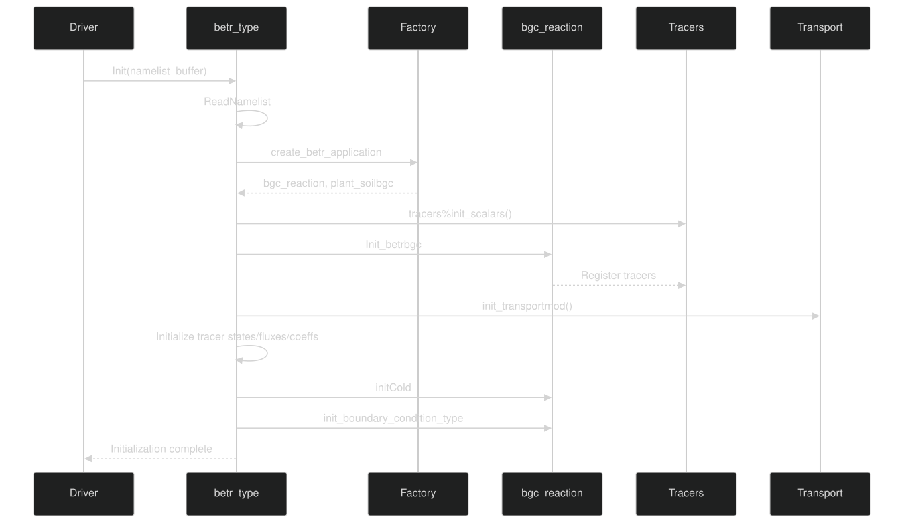

The `betr_type%Init` method coordinates:

Sources: [src/driver/shared/BeTRType.F90 153-222](https://github.com/jingtao-lbl/sbetr-resomv1/blob/72301c77/src/driver/shared/BeTRType.F90#L153-L222)

## Stage 8: Tracer System Initialization

Tracers are the fundamental units transported and reacted upon in BeTR.

### Tracer Registration Flow


Each BGC model registers its tracers during `Init_betrbgc` :

Tracer properties defined:

- `tracernames(id)`: Human-readable name
- `is_mobile(id)`: Can move with water?
- `is_volatile(id)`: Can enter gas phase?
- `is_solid_adsorb(id)`: Adsorbs to soil matrix?
- Partition coefficients (Henry's law, Bunsen, Kd)

Tracer indexing:

- `ntracers`: Total number of tracers
- `ngwmobile_tracers`: Number of mobile (aqueous) tracers
- `nvolatile_tracers`: Number of volatile (gas) tracers
- `nsolid_passive_tracers`: Number of solid-phase tracers

Sources: [src/betr/betr_dtype/BeTRTracerType.F90](https://github.com/jingtao-lbl/sbetr-resomv1/blob/72301c77/src/betr/betr_dtype/BeTRTracerType.F90) (not provided but referenced)

## Stage 9: Transport System Initialization

The transport system manages diffusion, advection, and phase equilibration.

### Transport Component Initialization


The transport initialization creates these key data structures:

TracerState_type : Tracer concentrations

- `tracer_conc_mobile(c,j,id)`: Aqueous phase concentration (mol/m³)
- `tracer_conc_frozen(c,j,id)`: Frozen phase concentration (mol/m³)
- `tracer_conc_solid(c,j,id)`: Solid phase concentration (mol/m³)

TracerFlux_type : Tracer fluxes

- `tracer_flx_dif(c,j,id)`: Diffusive flux (mol/m²/s)
- `tracer_flx_adv(c,j,id)`: Advective flux (mol/m²/s)
- `tracer_flx_ebu(c,id)`: Ebullition flux (mol/m²/s)

TracerCoeff_type : Transport coefficients

- `henrycef(c,j,id)`: Henry's law coefficient
- `diff_gas(c,j,id)`: Gas-phase diffusivity (m²/s)
- `diff_aqu(c,j,id)`: Aqueous-phase diffusivity (m²/s)

Sources: [src/driver/shared/BeTRType.F90 200-208](https://github.com/jingtao-lbl/sbetr-resomv1/blob/72301c77/src/driver/shared/BeTRType.F90#L200-L208)

## Stage 10: Parameter Loading

Model parameters are loaded from NetCDF files after the BGC model is instantiated.

### Parameter Loading Sequence

The parameter loading process:

Parameter types include:

- Kinetic rate constants (decomposition, nitrification, etc.)
- Stoichiometric ratios (C:N:P)
- Partition coefficients
- Temperature sensitivity (Q₁₀ values)
- Michaelis-Menten parameters for nutrient competition

Sources: [src/driver/shared/BeTRSimulation.F90 288-357](https://github.com/jingtao-lbl/sbetr-resomv1/blob/72301c77/src/driver/shared/BeTRSimulation.F90#L288-L357)  [src/Applications/app_util/ApplicationsFactory.F90 178-223](https://github.com/jingtao-lbl/sbetr-resomv1/blob/72301c77/src/Applications/app_util/ApplicationsFactory.F90#L178-L223)

## Stage 11: Cold Start Initialization

Cold start sets initial tracer concentrations when not restarting from a previous run.

### Cold Start Process


Each BGC model implements its own `initCold` method to set appropriate initial conditions:

Common initialization approaches:

- **Equilibrium assumption**: Assume pools are at steady state
- **Prescribed values**: Use default concentrations from parameters
- **Input file**: Read initial conditions from forcing file
- **Spin-up derived**: Use results from previous spin-up simulation

For soil BGC models, typical initial conditions include:

- Litter pool sizes (metabolic, cellulosic, lignin, CWD)
- Soil organic matter pools (SOM1, SOM2, SOM3)
- Mineral nutrient pools (NH₄⁺, NO₃⁻, PO₄³⁻)
- Microbial biomass

Sources: [src/driver/shared/BeTRType.F90 214](https://github.com/jingtao-lbl/sbetr-resomv1/blob/72301c77/src/driver/shared/BeTRType.F90#L214-L214)

## Initialization for Different Simulation Modes

The initialization process varies slightly depending on the simulation mode.

### Standalone Mode Initialization


Standalone-specific steps:

Sources: [src/driver/standalone/BeTRSimulationStandalone.F90 85-139](https://github.com/jingtao-lbl/sbetr-resomv1/blob/72301c77/src/driver/standalone/BeTRSimulationStandalone.F90#L85-L139)

### Coupled Mode Initialization


Coupled-specific steps:

Sources: [src/driver/clm/BeTRSimulationCLM.F90](https://github.com/jingtao-lbl/sbetr-resomv1/blob/72301c77/src/driver/clm/BeTRSimulationCLM.F90)

## Key Initialization Data Structures

### Main Initialization Types

| Type | Purpose | Key Components | 
| --- | --- | --- |
| betr_simulation_type | Top-level simulation orchestrator | betr(), biophys_forc(), biogeo_state(), biogeo_flux() | 
| betr_type | Core reactive transport engine | bgc_reaction, tracers, tracerstates, tracerfluxes | 
| bgc_reaction_type | BGC model (abstract base) | Model-specific parameters, reaction rates | 
| betr_biogeophys_input_type | Environmental forcing | Temperature, moisture, atmospheric composition | 
| betr_biogeo_state_type | BGC state variables | Carbon, nitrogen, phosphorus pools | 
| betr_biogeo_flux_type | BGC fluxes | Inputs, outputs, transformations | 

## Error Handling During Initialization

BeTR uses the `betr_status_type` for error reporting throughout initialization.

### Status Checking Pattern

Error handling approach:

Sources: [src/driver/shared/BeTRSimulation.F90 466-470](https://github.com/jingtao-lbl/sbetr-resomv1/blob/72301c77/src/driver/shared/BeTRSimulation.F90#L466-L470)

## Restart Capability

When `continue_run = .true.` , initialization reads from a restart file instead of cold start.

### Restart Initialization Flow

Restart variables read:

- All tracer concentrations (mobile, frozen, solid phases)
- BGC state variables (pools, fluxes)
- Accumulated diagnostic variables
- Time step counter

Sources: [src/driver/main/sbetrDriverMod.F90 159-222](https://github.com/jingtao-lbl/sbetr-resomv1/blob/72301c77/src/driver/main/sbetrDriverMod.F90#L159-L222)

## Summary

The BeTR initialization process is a comprehensive 11-stage sequence that:

This modular initialization design allows BeTR to support multiple simulation modes, BGC models, and coupling configurations while maintaining a consistent core architecture.

Sources: [src/driver/main/sbetrDriverMod.F90 21-404](https://github.com/jingtao-lbl/sbetr-resomv1/blob/72301c77/src/driver/main/sbetrDriverMod.F90#L21-L404)  [src/driver/shared/BeTRSimulation.F90 378-550](https://github.com/jingtao-lbl/sbetr-resomv1/blob/72301c77/src/driver/shared/BeTRSimulation.F90#L378-L550)  [src/driver/shared/BeTRType.F90 153-222](https://github.com/jingtao-lbl/sbetr-resomv1/blob/72301c77/src/driver/shared/BeTRType.F90#L153-L222)  [src/Applications/app_util/ApplicationsFactory.F90 1-370](https://github.com/jingtao-lbl/sbetr-resomv1/blob/72301c77/src/Applications/app_util/ApplicationsFactory.F90#L1-L370)