# Time-Stepping Loop

Relevant source files

- [example_input/ecacnp-reaction.namelist](https://github.com/jingtao-lbl/sbetr-resomv1/blob/72301c77/example_input/ecacnp-reaction.namelist)
- [src/Applications/soil-farm/bgcfarm_util/GeoChemAlgorithmMod.F90](https://github.com/jingtao-lbl/sbetr-resomv1/blob/72301c77/src/Applications/soil-farm/bgcfarm_util/GeoChemAlgorithmMod.F90)
- [src/betr/betr_core/BGCReactionsMod.F90](https://github.com/jingtao-lbl/sbetr-resomv1/blob/72301c77/src/betr/betr_core/BGCReactionsMod.F90)
- [src/betr/betr_dtype/BeTR_biogeophysInputType.F90](https://github.com/jingtao-lbl/sbetr-resomv1/blob/72301c77/src/betr/betr_dtype/BeTR_biogeophysInputType.F90)
- [src/betr/betr_rxns/DIOCBGCReactionsType.F90](https://github.com/jingtao-lbl/sbetr-resomv1/blob/72301c77/src/betr/betr_rxns/DIOCBGCReactionsType.F90)
- [src/betr/betr_rxns/H2OIsotopeBGCReactionsType.F90](https://github.com/jingtao-lbl/sbetr-resomv1/blob/72301c77/src/betr/betr_rxns/H2OIsotopeBGCReactionsType.F90)
- [src/betr/betr_rxns/MockBGCReactionsType.F90](https://github.com/jingtao-lbl/sbetr-resomv1/blob/72301c77/src/betr/betr_rxns/MockBGCReactionsType.F90)
- [src/driver/clm/BeTRSimulationCLM.F90](https://github.com/jingtao-lbl/sbetr-resomv1/blob/72301c77/src/driver/clm/BeTRSimulationCLM.F90)
- [src/driver/main/BeTRSimulationFactory.F90](https://github.com/jingtao-lbl/sbetr-resomv1/blob/72301c77/src/driver/main/BeTRSimulationFactory.F90)
- [src/driver/main/sbetrDriverMod.F90](https://github.com/jingtao-lbl/sbetr-resomv1/blob/72301c77/src/driver/main/sbetrDriverMod.F90)
- [src/driver/shared/BeTRSimulation.F90](https://github.com/jingtao-lbl/sbetr-resomv1/blob/72301c77/src/driver/shared/BeTRSimulation.F90)
- [src/driver/shared/BeTRType.F90](https://github.com/jingtao-lbl/sbetr-resomv1/blob/72301c77/src/driver/shared/BeTRType.F90)
- [src/driver/shared/bncdio_pio.F90](https://github.com/jingtao-lbl/sbetr-resomv1/blob/72301c77/src/driver/shared/bncdio_pio.F90)
- [src/driver/standalone/BeTRSimulationStandalone.F90](https://github.com/jingtao-lbl/sbetr-resomv1/blob/72301c77/src/driver/standalone/BeTRSimulationStandalone.F90)
- [src/driver/standalone/ForcingDataType.F90](https://github.com/jingtao-lbl/sbetr-resomv1/blob/72301c77/src/driver/standalone/ForcingDataType.F90)
- [src/driver/standalone/GridMod.F90](https://github.com/jingtao-lbl/sbetr-resomv1/blob/72301c77/src/driver/standalone/GridMod.F90)
- [src/stub_clm/WaterFluxType.F90](https://github.com/jingtao-lbl/sbetr-resomv1/blob/72301c77/src/stub_clm/WaterFluxType.F90)

This page documents the main time-stepping loop that advances BeTR simulations forward in time. The loop orchestrates forcing updates, biogeochemical reactions, tracer transport, and output writing. For information about how simulations are initialized before entering the time loop, see [Initialization Process](#3.2) . For details about the data exchanged between components, see [Data Flow and Coupling](#3.4) .

## Overview

The time-stepping loop is the central execution mechanism of BeTR. It uses Strang operator splitting to separate transport processes into two phases:

This splitting improves numerical accuracy by treating different physical processes with appropriate time scales and methods.

## Main Loop Structure

Sources:  [src/driver/main/sbetrDriverMod.F90 229-395](https://github.com/jingtao-lbl/sbetr-resomv1/blob/72301c77/src/driver/main/sbetrDriverMod.F90#L229-L395)

## Time Management System

The `betr_time_type` class manages simulation time advancement and controls loop termination:

| Component | Purpose | Key Methods | 
| --- | --- | --- |
| betr_time_type | Time tracking and control | get_step_size(), get_nstep(), update_time_stamp() | 
| SetClock() | Updates time step size and elapsed steps | Called at loop start BeTRSimulation.F90174-183 | 
| its_time_to_exit() | Determines loop termination | Based on stop_n and stop_option from namelist | 
| its_time_to_write_restart() | Controls restart output frequency | sbetrDriverMod.F90369 | 

Sources:  [src/betr/betr_util/BeTR_TimeMod.F90](https://github.com/jingtao-lbl/sbetr-resomv1/blob/72301c77/src/betr/betr_util/BeTR_TimeMod.F90)  [src/driver/main/sbetrDriverMod.F90 229-395](https://github.com/jingtao-lbl/sbetr-resomv1/blob/72301c77/src/driver/main/sbetrDriverMod.F90#L229-L395)

## Forcing Updates

Before each time step, environmental forcing data is updated to provide current conditions:

The forcing update process involves:

Sources:  [src/driver/standalone/ForcingDataType.F90 407-534](https://github.com/jingtao-lbl/sbetr-resomv1/blob/72301c77/src/driver/standalone/ForcingDataType.F90#L407-L534)  [src/driver/main/sbetrDriverMod.F90 241-256](https://github.com/jingtao-lbl/sbetr-resomv1/blob/72301c77/src/driver/main/sbetrDriverMod.F90#L241-L256)

## Phase 1: Step Without Drainage

Phase 1 implements tracer transport and reactions without considering drainage losses:

Key operations in Phase 1:

| Operation | Module/Function | Purpose | 
| --- | --- | --- |
| stage_tracer_transport | BetrBGCMod | Calculate partition coefficients, set boundary conditions | 
| surface_tracer_hydropath_update | BetrBGCMod | Handle surface runoff, snow melt/sublimation impacts | 
| calc_bgc_reaction | bgc_reaction_type | Execute biogeochemical reactions (decomposition, nitrification, etc.) | 
| tracer_gws_transport | BetrBGCMod | Multi-phase diffusion, advection, solid transport | 
| calc_ebullition | BetrBGCMod | Gas bubble formation and release | 

The `step_without_drainage` method is implemented differently for each simulation type:

- **Standalone**[BeTRSimulationStandalone.F90143-190](https://github.com/jingtao-lbl/sbetr-resomv1/blob/72301c77/BeTRSimulationStandalone.F90#L143-L190):
- **CLM**[BeTRSimulationCLM.F90176-239](https://github.com/jingtao-lbl/sbetr-resomv1/blob/72301c77/BeTRSimulationCLM.F90#L176-L239):
- **Core logic**[BetrType.F90309-435](https://github.com/jingtao-lbl/sbetr-resomv1/blob/72301c77/BetrType.F90#L309-L435):

Sources:  [src/driver/shared/BetrType.F90 309-435](https://github.com/jingtao-lbl/sbetr-resomv1/blob/72301c77/src/driver/shared/BetrType.F90#L309-L435)  [src/betr/betr_core/BetrBGCMod.F90](https://github.com/jingtao-lbl/sbetr-resomv1/blob/72301c77/src/betr/betr_core/BetrBGCMod.F90)

## Phase 2: Step With Drainage

Phase 2 handles tracer losses through drainage after Phase 1 transport:

The drainage step:

Implementation details:

- **mobile tracers**Drainage only affects in the aqueous phase
- `qflx_drain_vr`Uses (drainage velocity) from waterflux variables
- `tracer_drainage = qflx_drain_vr * tracer_conc_mobile`Computes tracer drainage flux:

Sources:  [src/driver/shared/BetrType.F90 506-638](https://github.com/jingtao-lbl/sbetr-resomv1/blob/72301c77/src/driver/shared/BetrType.F90#L506-L638)  [src/driver/standalone/BeTRSimulationStandalone.F90 193-235](https://github.com/jingtao-lbl/sbetr-resomv1/blob/72301c77/src/driver/standalone/BeTRSimulationStandalone.F90#L193-L235)

## Output Writing

History output accumulates and writes state and flux variables at configured frequencies:

Output types:

| Type | Frequency Control | Content | Files | 
| --- | --- | --- | --- |
| History | hist_freq in namelist | State variables (tracer concentrations, pool sizes) and fluxes (reactions, transport) | *.output.nc | 
| Restart | its_time_to_write_restart() | All tracers, BGC states needed to continue simulation | *.rst.nc | 
| Regression | Optional, end of simulation | Final states for validation testing | Used by regression framework | 

The history output for standalone simulations includes:

- **State variables**`betr(c)%HistRetrieveState()`[BetrType.F90851-932](https://github.com/jingtao-lbl/sbetr-resomv1/blob/72301c77/BetrType.F90#L851-L932): Retrieved via
- **Flux variables**`betr(c)%HistRetrieveFlux()`[BetrType.F90934-1007](https://github.com/jingtao-lbl/sbetr-resomv1/blob/72301c77/BetrType.F90#L934-L1007): Retrieved via
- **Diagnostic variables**: Water fluxes, gas pressures, etc.

Sources:  [src/driver/shared/BeTRSimulation.F90 878-953](https://github.com/jingtao-lbl/sbetr-resomv1/blob/72301c77/src/driver/shared/BeTRSimulation.F90#L878-L953)  [src/driver/main/sbetrDriverMod.F90 363-388](https://github.com/jingtao-lbl/sbetr-resomv1/blob/72301c77/src/driver/main/sbetrDriverMod.F90#L363-L388)

## Loop Control and Exit Conditions

The time loop continues until one of several exit conditions is met:

Exit control parameters (from namelist `&betr_time` ):

| Parameter | Purpose | Example Values | 
| --- | --- | --- |
| stop_option | Units for simulation length | 'nyears', 'nmonths', 'ndays', 'nsteps' | 
| stop_n | Number of periods | 1 (one year), 365 (365 days) | 
| stop_date | Absolute end date (optional) | 20101231 (December 31, 2010) | 

The `continue_run` flag in the namelist determines whether the simulation starts fresh or continues from a restart file. When continuing, the loop begins from step number read from the restart file.

Sources:  [src/betr/betr_util/BeTR_TimeMod.F90](https://github.com/jingtao-lbl/sbetr-resomv1/blob/72301c77/src/betr/betr_util/BeTR_TimeMod.F90)  [src/driver/main/sbetrDriverMod.F90 159-223](https://github.com/jingtao-lbl/sbetr-resomv1/blob/72301c77/src/driver/main/sbetrDriverMod.F90#L159-L223)

## First Time Step Handling

The first iteration through the time loop (when `record == 0` ) skips the calculation phase to ensure forcing data alignment:

This allows the simulation to:

After cycling, `record` is incremented, and subsequent iterations perform full calculations.

Sources:  [src/driver/main/sbetrDriverMod.F90 229-264](https://github.com/jingtao-lbl/sbetr-resomv1/blob/72301c77/src/driver/main/sbetrDriverMod.F90#L229-L264)

## Mass Balance Checking

Optional mass balance checks can be performed around the transport/reaction steps:

Mass balance checking:

- Tracks total tracer mass before and after transport
- Accounts for fluxes: surface inputs, BGC reactions, ebullition, drainage
- Reports errors exceeding tolerance (typically 1e-10)
- Can be disabled for performance in production runs

Sources:  [src/driver/shared/BeTRSimulation.F90 717-790](https://github.com/jingtao-lbl/sbetr-resomv1/blob/72301c77/src/driver/shared/BeTRSimulation.F90#L717-L790)