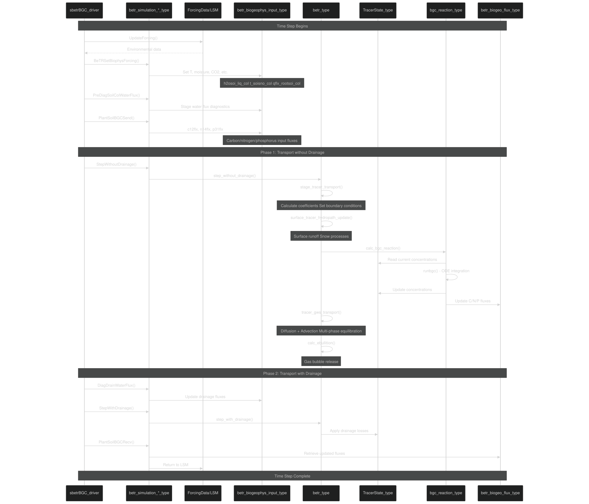
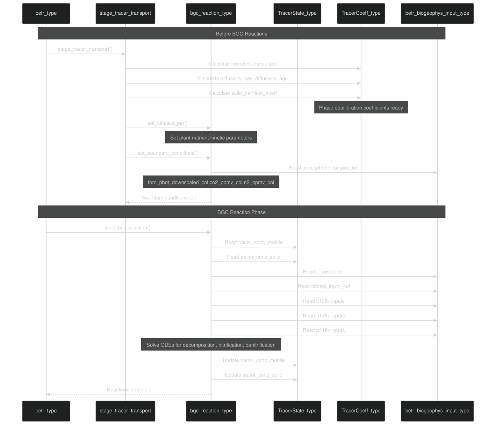
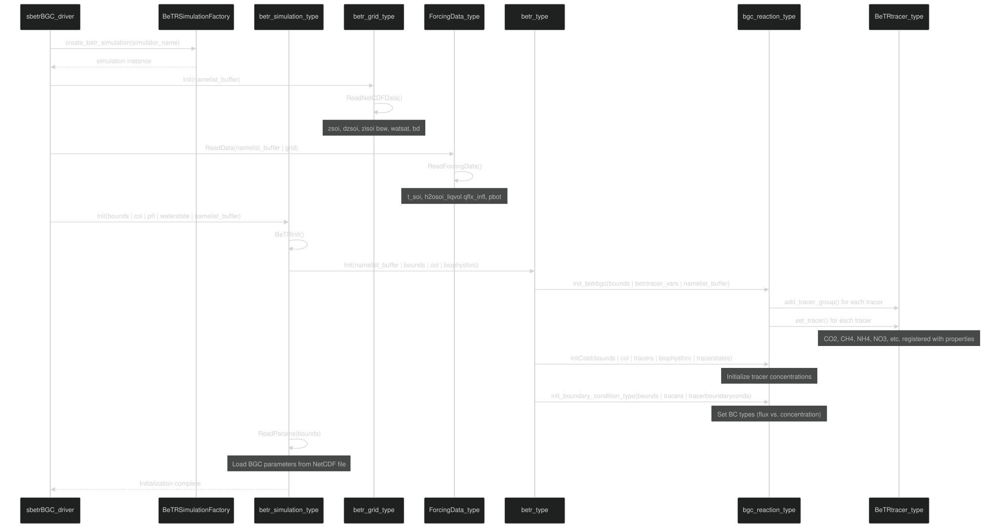

# Data Flow and Coupling

Relevant source files

- [example_input/ecacnp-reaction.namelist](https://github.com/jingtao-lbl/sbetr-resomv1/blob/72301c77/example_input/ecacnp-reaction.namelist)
- [src/Applications/soil-farm/bgcfarm_util/GeoChemAlgorithmMod.F90](https://github.com/jingtao-lbl/sbetr-resomv1/blob/72301c77/src/Applications/soil-farm/bgcfarm_util/GeoChemAlgorithmMod.F90)
- [src/betr/betr_core/BGCReactionsMod.F90](https://github.com/jingtao-lbl/sbetr-resomv1/blob/72301c77/src/betr/betr_core/BGCReactionsMod.F90)
- [src/betr/betr_dtype/BeTR_biogeophysInputType.F90](https://github.com/jingtao-lbl/sbetr-resomv1/blob/72301c77/src/betr/betr_dtype/BeTR_biogeophysInputType.F90)
- [src/betr/betr_rxns/DIOCBGCReactionsType.F90](https://github.com/jingtao-lbl/sbetr-resomv1/blob/72301c77/src/betr/betr_rxns/DIOCBGCReactionsType.F90)
- [src/betr/betr_rxns/H2OIsotopeBGCReactionsType.F90](https://github.com/jingtao-lbl/sbetr-resomv1/blob/72301c77/src/betr/betr_rxns/H2OIsotopeBGCReactionsType.F90)
- [src/betr/betr_rxns/MockBGCReactionsType.F90](https://github.com/jingtao-lbl/sbetr-resomv1/blob/72301c77/src/betr/betr_rxns/MockBGCReactionsType.F90)
- [src/driver/clm/BeTRSimulationCLM.F90](https://github.com/jingtao-lbl/sbetr-resomv1/blob/72301c77/src/driver/clm/BeTRSimulationCLM.F90)
- [src/driver/main/BeTRSimulationFactory.F90](https://github.com/jingtao-lbl/sbetr-resomv1/blob/72301c77/src/driver/main/BeTRSimulationFactory.F90)
- [src/driver/main/sbetrDriverMod.F90](https://github.com/jingtao-lbl/sbetr-resomv1/blob/72301c77/src/driver/main/sbetrDriverMod.F90)
- [src/driver/shared/BeTRSimulation.F90](https://github.com/jingtao-lbl/sbetr-resomv1/blob/72301c77/src/driver/shared/BeTRSimulation.F90)
- [src/driver/shared/BeTRType.F90](https://github.com/jingtao-lbl/sbetr-resomv1/blob/72301c77/src/driver/shared/BeTRType.F90)
- [src/driver/shared/bncdio_pio.F90](https://github.com/jingtao-lbl/sbetr-resomv1/blob/72301c77/src/driver/shared/bncdio_pio.F90)
- [src/driver/standalone/BeTRSimulationStandalone.F90](https://github.com/jingtao-lbl/sbetr-resomv1/blob/72301c77/src/driver/standalone/BeTRSimulationStandalone.F90)
- [src/driver/standalone/ForcingDataType.F90](https://github.com/jingtao-lbl/sbetr-resomv1/blob/72301c77/src/driver/standalone/ForcingDataType.F90)
- [src/driver/standalone/GridMod.F90](https://github.com/jingtao-lbl/sbetr-resomv1/blob/72301c77/src/driver/standalone/GridMod.F90)
- [src/stub_clm/WaterFluxType.F90](https://github.com/jingtao-lbl/sbetr-resomv1/blob/72301c77/src/stub_clm/WaterFluxType.F90)

## Purpose and Scope

This page documents how data flows between different components of the BeTR system: from land surface models or forcing files into BeTR, through BeTR's core transport engine, to BGC reaction modules, and back out to the land model or output files. Understanding these data pathways is essential for:

- Implementing new BGC models that integrate with BeTR
- Coupling BeTR with different land surface models
- Debugging simulation issues related to data exchange
- Optimizing performance by understanding memory layout and access patterns

For information about the specific tracer transport mechanisms within BeTR, see [5.4](#5.4) . For details on simulation initialization, see [3.2](#3.2) . For the overall time-stepping structure, see [3.3](#3.3) .

## Coupling Architecture Overview

BeTR uses an adapter pattern to support multiple simulation modes while maintaining a common core. Data flows through several layers of abstraction:

Sources:  [src/driver/shared/BeTRSimulation.F90 1-172](https://github.com/jingtao-lbl/sbetr-resomv1/blob/72301c77/src/driver/shared/BeTRSimulation.F90#L1-L172)  [src/driver/standalone/BeTRSimulationStandalone.F90 1-64](https://github.com/jingtao-lbl/sbetr-resomv1/blob/72301c77/src/driver/standalone/BeTRSimulationStandalone.F90#L1-L64)  [src/driver/main/BeTRSimulationFactory.F90 1-51](https://github.com/jingtao-lbl/sbetr-resomv1/blob/72301c77/src/driver/main/BeTRSimulationFactory.F90#L1-L51)

## Key Data Structures

BeTR uses several primary data structures to manage the flow of information between components:

| Data Structure | File | Purpose | 
| --- | --- | --- |
| betr_biogeophys_input_type | BeTR_biogeophysInputType.F90 | Environmental forcing: temperature, moisture, pressure, pH | 
| betr_biogeo_flux_type | BeTR_biogeoFluxType.F90 | Carbon, nitrogen, phosphorus fluxes from/to land model | 
| betr_biogeo_state_type | BeTR_biogeoStateType.F90 | Biogeochemical pool states for land model | 
| TracerState_type | TracerStateType.F90 | Tracer concentrations (mobile, frozen, solid phases) | 
| TracerFlux_type | TracerFluxType.F90 | Tracer fluxes (diffusion, advection, ebullition) | 
| TracerCoeff_type | TracerCoeffType.F90 | Phase equilibration coefficients (Henry, Bunsen, partition) | 
| ForcingData_type | ForcingDataType.F90 | Time-series forcing data reader (standalone mode only) | 

Detailed Data Structure Relationships:

Sources:  [src/betr/betr_dtype/BeTR_biogeophysInputType.F90 1-123](https://github.com/jingtao-lbl/sbetr-resomv1/blob/72301c77/src/betr/betr_dtype/BeTR_biogeophysInputType.F90#L1-L123)  [src/driver/shared/BetrType.F90 44-106](https://github.com/jingtao-lbl/sbetr-resomv1/blob/72301c77/src/driver/shared/BetrType.F90#L44-L106)

## Simulation Time Step Data Flow

The following diagram shows the complete data flow during a single simulation time step, from forcing update through both transport phases:

Sources:  [src/driver/main/sbetrDriverMod.F90 229-395](https://github.com/jingtao-lbl/sbetr-resomv1/blob/72301c77/src/driver/main/sbetrDriverMod.F90#L229-L395)  [src/driver/shared/BetrType.F90 309-435](https://github.com/jingtao-lbl/sbetr-resomv1/blob/72301c77/src/driver/shared/BetrType.F90#L309-L435)

## Forcing Data Input (Standalone Mode)

In standalone mode, BeTR reads environmental forcing from NetCDF files through the `ForcingData_type` class:

### Forcing Data Flow

Key Methods:

| Method | File:Lines | Purpose | 
| --- | --- | --- |
| ReadData() | ForcingDataType.F90340-383 | Read namelist and open NetCDF file | 
| ReadForcingData() | ForcingDataType.F90386-535 | Load all time-series data into memory | 
| UpdateForcing() | ForcingDataType.F90538-703 | Interpolate forcing to current time step | 
| UpdateCNPForcing() | ForcingDataType.F90706-769 | Update carbon/nitrogen/phosphorus inputs | 

Sources:  [src/driver/standalone/ForcingDataType.F90 22-73](https://github.com/jingtao-lbl/sbetr-resomv1/blob/72301c77/src/driver/standalone/ForcingDataType.F90#L22-L73)  [src/driver/main/sbetrDriverMod.F90 139-184](https://github.com/jingtao-lbl/sbetr-resomv1/blob/72301c77/src/driver/main/sbetrDriverMod.F90#L139-L184)

## Land Model to BeTR Coupling

When coupled with CLM/ELM, data flows from the land model's internal data structures into BeTR through the simulation adapter layer:

### Coupling Interface Methods

Key Coupling Variables:

| Variable | LSM Type | BeTR Type | Units | 
| --- | --- | --- | --- |
| Soil liquid water | h2osoi_liq | h2osoi_liq_col | kg/m² | 
| Soil ice | h2osoi_ice | h2osoi_ice_col | kg/m² | 
| Soil temperature | t_soisno | t_soisno_col | K | 
| Root water uptake | qflx_rootsoi | qflx_rootsoi_col | mm/s | 
| Carbon input flux | cflx_input_litr_met_vr | cflx_input_litr_met_vr_col | gC/m³/s | 
| Nitrogen input flux | nflx_input_litr_met_vr | nflx_input_litr_met_vr_col | gN/m³/s | 
| Phosphorus input flux | pflx_input_litr_met_vr | pflx_input_litr_met_vr_col | gP/m³/s | 

Sources:  [src/driver/shared/BeTRSimulation.F90 378-461](https://github.com/jingtao-lbl/sbetr-resomv1/blob/72301c77/src/driver/shared/BeTRSimulation.F90#L378-L461)  [src/driver/standalone/BeTRSimulationStandalone.F90 288-389](https://github.com/jingtao-lbl/sbetr-resomv1/blob/72301c77/src/driver/standalone/BeTRSimulationStandalone.F90#L288-L389)  [src/betr/betr_dtype/BeTR_biogeophysInputType.F90 16-123](https://github.com/jingtao-lbl/sbetr-resomv1/blob/72301c77/src/betr/betr_dtype/BeTR_biogeophysInputType.F90#L16-L123)

## BeTR Core to BGC Model Coupling

The BeTR core engine passes environmental conditions and tracer states to BGC reaction models through a well-defined interface:

### BGC Reaction Interface Data Flow

Key BGC Interface Methods:

| Method | Purpose | Key Inputs | Key Outputs | 
| --- | --- | --- | --- |
| set_boundary_conditions() | Set atmospheric concentrations | forc_pbot, co2_ppmv, n2_ppmv | Updated tracerboundarycond_vars | 
| set_kinetics_par() | Update plant-nutrient parameters | plantNutkinetics | Updated tracercoeff_vars | 
| calc_bgc_reaction() | Run biogeochemical reactions | tracerstates, biophysforc | Updated tracerstates, tracerfluxes | 
| retrieve_biogeoflux() | Extract land model fluxes | tracerfluxes | Updated biogeo_flux | 
| retrieve_biostates() | Extract land model states | tracerstates | Updated biogeo_state | 

Sources:  [src/betr/betr_core/BGCReactionsMod.F90 17-59](https://github.com/jingtao-lbl/sbetr-resomv1/blob/72301c77/src/betr/betr_core/BGCReactionsMod.F90#L17-L59)  [src/driver/shared/BetrType.F90 309-435](https://github.com/jingtao-lbl/sbetr-resomv1/blob/72301c77/src/driver/shared/BetrType.F90#L309-L435)  [src/betr/betr_main/BetrBGCMod.F90 371-403](https://github.com/jingtao-lbl/sbetr-resomv1/blob/72301c77/src/betr/betr_main/BetrBGCMod.F90#L371-L403)

## BGC Model to BeTR Return Path

After BGC reactions complete, updated states and fluxes flow back through the system:

Common Return Variables:

| BeTR Variable | LSM Variable | Meaning | 
| --- | --- | --- |
| c12flux_vars%hr | carbonflux_vars%hr | Heterotrophic respiration (gC/m²/s) | 
| n14flux_vars%f_nit | nitrogenflux_vars%f_nit | Nitrification flux (gN/m²/s) | 
| n14flux_vars%f_denit | nitrogenflux_vars%f_denit | Denitrification flux (gN/m²/s) | 
| n14flux_vars%f_n2o_nit | nitrogenflux_vars%f_n2o_nit | N₂O from nitrification (gN/m²/s) | 
| c12state_vars%totsomc | carbonstate_vars%totsomc | Total soil organic carbon (gC/m²) | 
| n14state_vars%smin_nh4 | nitrogenstate_vars%smin_nh4 | NH₄⁺ concentration (gN/m²) | 
| n14state_vars%smin_no3 | nitrogenstate_vars%smin_no3 | NO₃⁻ concentration (gN/m²) | 
| p31state_vars%sminp | phosphorusstate_vars%sminp | Mineral phosphorus (gP/m²) | 

Sources:  [src/driver/standalone/BeTRSimulationStandalone.F90 392-521](https://github.com/jingtao-lbl/sbetr-resomv1/blob/72301c77/src/driver/standalone/BeTRSimulationStandalone.F90#L392-L521)  [src/driver/main/sbetrDriverMod.F90 326-353](https://github.com/jingtao-lbl/sbetr-resomv1/blob/72301c77/src/driver/main/sbetrDriverMod.F90#L326-L353)

## Internal BeTR Core Data Flow

Within the BeTR core, data flows through several stages of the transport calculation:

### Multi-Phase Transport Data Flow

Sources:  [src/betr/betr_main/BetrBGCMod.F90 164-370](https://github.com/jingtao-lbl/sbetr-resomv1/blob/72301c77/src/betr/betr_main/BetrBGCMod.F90#L164-L370)  [src/driver/shared/BetrType.F90 369-433](https://github.com/jingtao-lbl/sbetr-resomv1/blob/72301c77/src/driver/shared/BetrType.F90#L369-L433)

## Coupling Methods Summary

The following table summarizes all key coupling methods and their roles:

| Method | Class | File:Lines | Purpose | 
| --- | --- | --- | --- |
| BeTRSetBiophysForcing() | betr_simulation_type | BeTRSimulation.F90378-461 | Map LSM environmental data to BeTR structures | 
| PlantSoilBGCSend() | betr_simulation_standalone_type | BeTRSimulationStandalone.F90288-389 | Send C/N/P input fluxes to BeTR | 
| PlantSoilBGCRecv() | betr_simulation_standalone_type | BeTRSimulationStandalone.F90392-521 | Retrieve updated C/N/P states and fluxes | 
| step_without_drainage() | betr_type | BetrType.F90309-435 | Execute transport and reactions without drainage | 
| step_with_drainage() | betr_type | BetrType.F90506-624 | Apply drainage losses to tracers | 
| stage_tracer_transport() | (function) | BetrBGCMod.F9045-153 | Calculate coefficients and set boundary conditions | 
| calc_bgc_reaction() | bgc_reaction_type | BGCReactionsMod.F90142-175 | Execute biogeochemical reactions (abstract) | 
| retrieve_biogeoflux() | bgc_reaction_type | BGCReactionsMod.F90177-191 | Extract land model fluxes from tracers | 
| retrieve_biostates() | bgc_reaction_type | BGCReactionsMod.F90193-207 | Extract land model states from tracers | 
| UpdateForcing() | ForcingData_type | ForcingDataType.F90538-703 | Update forcing data for current time step | 

Sources:  [src/driver/shared/BeTRSimulation.F90 1-172](https://github.com/jingtao-lbl/sbetr-resomv1/blob/72301c77/src/driver/shared/BeTRSimulation.F90#L1-L172)  [src/driver/shared/BetrType.F90 44-106](https://github.com/jingtao-lbl/sbetr-resomv1/blob/72301c77/src/driver/shared/BetrType.F90#L44-L106)  [src/betr/betr_core/BGCReactionsMod.F90 17-59](https://github.com/jingtao-lbl/sbetr-resomv1/blob/72301c77/src/betr/betr_core/BGCReactionsMod.F90#L17-L59)

## Data Flow During Initialization

The initialization phase establishes the coupling between components:

Sources:  [src/driver/main/sbetrDriverMod.F90 106-223](https://github.com/jingtao-lbl/sbetr-resomv1/blob/72301c77/src/driver/main/sbetrDriverMod.F90#L106-L223)  [src/driver/shared/BeTRSimulation.F90 378-550](https://github.com/jingtao-lbl/sbetr-resomv1/blob/72301c77/src/driver/shared/BeTRSimulation.F90#L378-L550)  [src/driver/shared/BetrType.F90 153-222](https://github.com/jingtao-lbl/sbetr-resomv1/blob/72301c77/src/driver/shared/BetrType.F90#L153-L222)