# Simulation Execution

Relevant source files

- [example_input/ecacnp-reaction.namelist](https://github.com/jingtao-lbl/sbetr-resomv1/blob/72301c77/example_input/ecacnp-reaction.namelist)
- [src/Applications/soil-farm/bgcfarm_util/GeoChemAlgorithmMod.F90](https://github.com/jingtao-lbl/sbetr-resomv1/blob/72301c77/src/Applications/soil-farm/bgcfarm_util/GeoChemAlgorithmMod.F90)
- [src/betr/betr_core/BGCReactionsMod.F90](https://github.com/jingtao-lbl/sbetr-resomv1/blob/72301c77/src/betr/betr_core/BGCReactionsMod.F90)
- [src/betr/betr_dtype/BeTR_biogeophysInputType.F90](https://github.com/jingtao-lbl/sbetr-resomv1/blob/72301c77/src/betr/betr_dtype/BeTR_biogeophysInputType.F90)
- [src/betr/betr_rxns/DIOCBGCReactionsType.F90](https://github.com/jingtao-lbl/sbetr-resomv1/blob/72301c77/src/betr/betr_rxns/DIOCBGCReactionsType.F90)
- [src/betr/betr_rxns/H2OIsotopeBGCReactionsType.F90](https://github.com/jingtao-lbl/sbetr-resomv1/blob/72301c77/src/betr/betr_rxns/H2OIsotopeBGCReactionsType.F90)
- [src/betr/betr_rxns/MockBGCReactionsType.F90](https://github.com/jingtao-lbl/sbetr-resomv1/blob/72301c77/src/betr/betr_rxns/MockBGCReactionsType.F90)
- [src/driver/clm/BeTRSimulationCLM.F90](https://github.com/jingtao-lbl/sbetr-resomv1/blob/72301c77/src/driver/clm/BeTRSimulationCLM.F90)
- [src/driver/main/BeTRSimulationFactory.F90](https://github.com/jingtao-lbl/sbetr-resomv1/blob/72301c77/src/driver/main/BeTRSimulationFactory.F90)
- [src/driver/main/sbetrDriverMod.F90](https://github.com/jingtao-lbl/sbetr-resomv1/blob/72301c77/src/driver/main/sbetrDriverMod.F90)
- [src/driver/shared/BeTRSimulation.F90](https://github.com/jingtao-lbl/sbetr-resomv1/blob/72301c77/src/driver/shared/BeTRSimulation.F90)
- [src/driver/shared/BeTRType.F90](https://github.com/jingtao-lbl/sbetr-resomv1/blob/72301c77/src/driver/shared/BeTRType.F90)
- [src/driver/shared/bncdio_pio.F90](https://github.com/jingtao-lbl/sbetr-resomv1/blob/72301c77/src/driver/shared/bncdio_pio.F90)
- [src/driver/standalone/BeTRSimulationStandalone.F90](https://github.com/jingtao-lbl/sbetr-resomv1/blob/72301c77/src/driver/standalone/BeTRSimulationStandalone.F90)
- [src/driver/standalone/ForcingDataType.F90](https://github.com/jingtao-lbl/sbetr-resomv1/blob/72301c77/src/driver/standalone/ForcingDataType.F90)
- [src/driver/standalone/GridMod.F90](https://github.com/jingtao-lbl/sbetr-resomv1/blob/72301c77/src/driver/standalone/GridMod.F90)
- [src/stub_clm/WaterFluxType.F90](https://github.com/jingtao-lbl/sbetr-resomv1/blob/72301c77/src/stub_clm/WaterFluxType.F90)

## Overview

This page documents how BeTR simulations execute from program start to termination, including the main driver architecture, key execution phases, and data flow patterns. BeTR uses a Strang splitting approach to separate transport processes, executing in two phases per time step: transport without drainage followed by transport with drainage.

For details on specific simulation modes (standalone vs. coupled), see [Simulation Modes](#3.1) . For the initialization sequence, see [Initialization Process](#3.2) . For time-stepping loop internals, see [Time-Stepping Loop](#3.3) . For data exchange with land surface models, see [Data Flow and Coupling](#3.4) .

## Main Driver Architecture

BeTR simulations begin execution through one of two entry points:

### Standalone Driver Execution Flow


Sources: [src/driver/main/sbetrDriverMod.F90 21-404](https://github.com/jingtao-lbl/sbetr-resomv1/blob/72301c77/src/driver/main/sbetrDriverMod.F90#L21-L404)

### Simulation Class Hierarchy

BeTR uses polymorphism to support multiple simulation modes while sharing core infrastructure:


Sources: [src/driver/shared/BeTRSimulation.F90 68-170](https://github.com/jingtao-lbl/sbetr-resomv1/blob/72301c77/src/driver/shared/BeTRSimulation.F90#L68-L170)  [src/driver/standalone/BeTRSimulationStandalone.F90 45-60](https://github.com/jingtao-lbl/sbetr-resomv1/blob/72301c77/src/driver/standalone/BeTRSimulationStandalone.F90#L45-L60)  [src/driver/clm/BeTRSimulationCLM.F90 41-58](https://github.com/jingtao-lbl/sbetr-resomv1/blob/72301c77/src/driver/clm/BeTRSimulationCLM.F90#L41-L58)

## Two-Phase Time-Stepping: Strang Splitting

BeTR implements Strang operator splitting to separate transport processes that occur with and without drainage. This approach improves numerical accuracy and stability by treating different physical processes appropriately.

### Phase 1: Transport Without Drainage

The `StepWithoutDrainage` method executes the following sequence:


Key operations in Phase 1  [src/driver/shared/BeTRType.F90 309-435](https://github.com/jingtao-lbl/sbetr-resomv1/blob/72301c77/src/driver/shared/BeTRType.F90#L309-L435) :

| Step | Module/Function | Purpose | 
| --- | --- | --- |
| 1 | set_kinetics_par | Set plant nutrient uptake parameters | 
| 2 | stage_tracer_transport | Calculate transport coefficients, set boundaries | 
| 3 | surface_tracer_hydropath_update | Handle surface water tracers (snow, runoff) | 
| 4 | calc_bgc_reaction | Biogeochemical reactions (optional, configurable) | 
| 5 | tracer_gws_transport | Multi-phase diffusion and advection | 
| 6 | calc_ebullition | Gas bubble formation and release | 
| 7 | plant_soilbgc_summary | Summarize plant-soil nutrient fluxes | 

### Phase 2: Transport With Drainage

The `StepWithDrainage` method handles vertical drainage losses:


Drainage implementation  [src/driver/shared/BeTRType.F90 506-591](https://github.com/jingtao-lbl/sbetr-resomv1/blob/72301c77/src/driver/shared/BeTRType.F90#L506-L591) :

- Drainage is applied layer-by-layer based on vertical water fluxes
- Only mobile, non-volatile tracers experience drainage losses
- Diagnostic variables include gas pressures and total drainage fluxes

Sources: [src/driver/shared/BeTRType.F90 309-435](https://github.com/jingtao-lbl/sbetr-resomv1/blob/72301c77/src/driver/shared/BeTRType.F90#L309-L435)  [src/driver/shared/BeTRType.F90 506-591](https://github.com/jingtao-lbl/sbetr-resomv1/blob/72301c77/src/driver/shared/BeTRType.F90#L506-L591)

## Key Data Structures

### betr_type: Core Orchestrator

The `betr_type` class is the central object coordinating all BGC and transport operations:


Sources: [src/driver/shared/BeTRType.F90 44-106](https://github.com/jingtao-lbl/sbetr-resomv1/blob/72301c77/src/driver/shared/BeTRType.F90#L44-L106)

### betr_biogeophys_input_type: Environmental Forcing

This data structure contains all environmental conditions passed to BeTR:

| Category | Key Variables | Units/Description | 
| --- | --- | --- |
| Water State | h2osoi_liq_col(:,:) | Liquid water content (kg/m²) | 
|  | h2osoi_ice_col(:,:) | Ice content (kg/m²) | 
|  | h2osoi_liqvol_col(:,:) | Volumetric liquid water (m³/m³) | 
|  | h2osoi_icevol_col(:,:) | Volumetric ice (m³/m³) | 
|  | finundated_col(:) | Inundation fraction | 
| Water Flux | qflx_surf_col(:) | Surface runoff (mm/s) | 
|  | qflx_rootsoi_col(:,:) | Root water uptake by layer (mm/s) | 
|  | qflx_runoff_col(:) | Total runoff (mm/s) | 
|  | qflx_adv(:,:) | Advection velocity (mm/s) | 
| Temperature | t_soisno_col(:,:) | Soil/snow temperature (K) | 
|  | t_soi_10cm(:) | Top 10cm temperature (K) | 
|  | forc_t_downscaled_col(:) | Atmospheric temperature (K) | 
| Atmospheric | forc_pbot_downscaled_col(:) | Atmospheric pressure (Pa) | 
|  | co2_ppmv_col(:) | CO₂ concentration (ppmv) | 
|  | o2_ppmv_col(:) | O₂ concentration (ppmv) | 
|  | n2_ppmv_col(:) | N₂ concentration (ppmv) | 
| Soil Properties | bsw_col(:,:) | Clapp-Hornberger b parameter | 
|  | watsat_col(:,:) | Saturated water content (porosity) | 
|  | eff_porosity_col(:,:) | Effective porosity (ice-free) | 
|  | bd_col(:,:) | Bulk density (kg/m³) | 
|  | smp_l_col(:,:) | Soil matric potential (mm) | 
| BGC Fluxes | c12flx, c13flx, c14flx | Carbon flux structures | 
|  | n14flx | Nitrogen flux structure | 
|  | p31flx | Phosphorus flux structure | 

Sources: [src/betr/betr_dtype/BeTR_biogeophysInputType.F90 16-122](https://github.com/jingtao-lbl/sbetr-resomv1/blob/72301c77/src/betr/betr_dtype/BeTR_biogeophysInputType.F90#L16-L122)

## Forcing Data Update Pipeline

In standalone mode, forcing data flows from NetCDF files through a series of transformations:


Forcing update sequence  [src/driver/main/sbetrDriverMod.F90 241-262](https://github.com/jingtao-lbl/sbetr-resomv1/blob/72301c77/src/driver/main/sbetrDriverMod.F90#L241-L262) :

Sources: [src/driver/standalone/ForcingDataType.F90 340-694](https://github.com/jingtao-lbl/sbetr-resomv1/blob/72301c77/src/driver/standalone/ForcingDataType.F90#L340-L694)  [src/driver/main/sbetrDriverMod.F90 229-262](https://github.com/jingtao-lbl/sbetr-resomv1/blob/72301c77/src/driver/main/sbetrDriverMod.F90#L229-L262)

## Tracer State and Flux Management

### Tracer State Allocation

Tracer states are organized by phase:


Sources: [src/betr/betr_dtype/TracerStateType.F90](https://github.com/jingtao-lbl/sbetr-resomv1/blob/72301c77/src/betr/betr_dtype/TracerStateType.F90)  [src/betr/betr_dtype/TracerFluxType.F90](https://github.com/jingtao-lbl/sbetr-resomv1/blob/72301c77/src/betr/betr_dtype/TracerFluxType.F90)

## Mass Balance Verification

BeTR includes comprehensive mass balance checking:

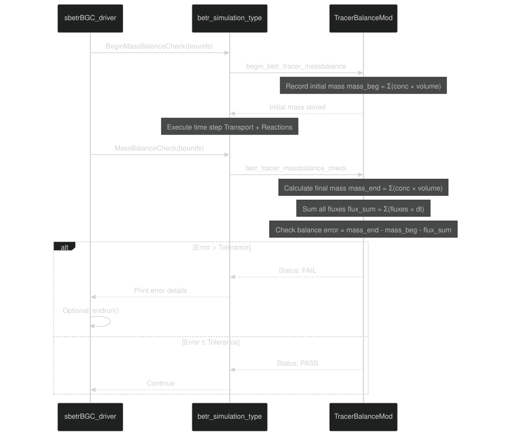

Mass balance implementation  [src/driver/shared/BeTRSimulation.F90 717-790](https://github.com/jingtao-lbl/sbetr-resomv1/blob/72301c77/src/driver/shared/BeTRSimulation.F90#L717-L790) :

- Checks conservation for all mobile and solid tracers
- Accounts for all fluxes: top/bottom boundaries, drainage, ebullition, BGC sources/sinks
- Can optionally abort simulation on mass balance failure
- Useful for debugging and validation

Sources: [src/driver/shared/BeTRSimulation.F90 717-790](https://github.com/jingtao-lbl/sbetr-resomv1/blob/72301c77/src/driver/shared/BeTRSimulation.F90#L717-L790)  [src/betr/betr_util/TracerBalanceMod.F90](https://github.com/jingtao-lbl/sbetr-resomv1/blob/72301c77/src/betr/betr_util/TracerBalanceMod.F90)

## History Output System

BeTR generates two categories of output files:

### 1. Tracer Transport History

Written by `WriteOfflineHistory`  [src/driver/shared/BeTRSimulation.F90 878-960](https://github.com/jingtao-lbl/sbetr-resomv1/blob/72301c77/src/driver/shared/BeTRSimulation.F90#L878-L960) :


Output variables :

- **1D state variables**: Column-integrated quantities
- **2D state variables**`(ncol, levtrc)`: Tracer concentrations by layer
- **1D flux variables**: Column-integrated fluxes (time-averaged)
- **2D flux variables**: Layer-by-layer fluxes (time-averaged)
- **Auxiliary**`QFLX_ADV``ZSOI`: advection velocity, soil depths

### 2. BGC State and Flux History

For soil BGC simulations, additional variables written by `WriteHistBGC`  [src/driver/main/sbetrDriverMod.F90 572-697](https://github.com/jingtao-lbl/sbetr-resomv1/blob/72301c77/src/driver/main/sbetrDriverMod.F90#L572-L697) :

| Variable | Units | Description | 
| --- | --- | --- |
| hr | gC/m²/s | Heterotrophic respiration | 
| f_n2o_nit | gN/m²/s | N₂O flux from nitrification | 
| f_denit | gN/m²/s | N₂+N₂O flux from denitrification | 
| f_nit | gN/m²/s | NO₃ production from nitrification | 
| co2_soi_flx | gC/m²/s | Soil CO₂ flux to atmosphere | 
| nh3_soi_flx | gN/m²/s | Soil NH₃ flux to atmosphere | 
| cwdc | gC/m² | Coarse woody debris carbon | 
| totlitc | gC/m² | Total litter carbon | 
| totsomc | gC/m² | Total soil organic matter carbon | 
| smin_nh4 | gN/m² | Soil mineral NH₄ | 
| smin_no3 | gN/m² | Soil mineral NO₃ | 
| sminp | gP/m² | Soil mineral PO₄ | 

Sources: [src/driver/shared/BeTRSimulation.F90 794-960](https://github.com/jingtao-lbl/sbetr-resomv1/blob/72301c77/src/driver/shared/BeTRSimulation.F90#L794-L960)  [src/driver/main/sbetrDriverMod.F90 572-697](https://github.com/jingtao-lbl/sbetr-resomv1/blob/72301c77/src/driver/main/sbetrDriverMod.F90#L572-L697)

## Restart File System

BeTR implements full restart capability for long simulations:


Restart file contents :

- `rest_states_2d(begc:endc, lbj:ubj, 1:nrest_state2d)`All tracer state variables:
- Time step information for synchronization
- Grid configuration (dimensions must match)
- BGC-specific internal states

Restart workflow  [src/driver/main/sbetrDriverMod.F90 159-222](https://github.com/jingtao-lbl/sbetr-resomv1/blob/72301c77/src/driver/main/sbetrDriverMod.F90#L159-L222)  [src/driver/main/sbetrDriverMod.F90 369-388](https://github.com/jingtao-lbl/sbetr-resomv1/blob/72301c77/src/driver/main/sbetrDriverMod.F90#L369-L388) :

Sources: [src/driver/shared/BeTRSimulation.F90 606-645](https://github.com/jingtao-lbl/sbetr-resomv1/blob/72301c77/src/driver/shared/BeTRSimulation.F90#L606-L645)  [src/driver/main/sbetrDriverMod.F90 159-222](https://github.com/jingtao-lbl/sbetr-resomv1/blob/72301c77/src/driver/main/sbetrDriverMod.F90#L159-L222)  [src/driver/main/sbetrDriverMod.F90 369-388](https://github.com/jingtao-lbl/sbetr-resomv1/blob/72301c77/src/driver/main/sbetrDriverMod.F90#L369-L388)

## Simulation Termination

The main time loop continues until `its_time_to_exit()` returns `.true.` :


Exit conditions determined by namelist parameters:

- `stop_option`: "nsteps", "ndays", "nyears"
- `stop_n``stop_n=10``stop_option='nyears'`: Number of units (e.g., with → 10 years)
- `betr_time_type%its_time_to_exit()`[src/betr/betr_util/BeTR_TimeMod.F90](https://github.com/jingtao-lbl/sbetr-resomv1/blob/72301c77/src/betr/betr_util/BeTR_TimeMod.F90)Implementation in

Sources: [src/driver/main/sbetrDriverMod.F90 391-404](https://github.com/jingtao-lbl/sbetr-resomv1/blob/72301c77/src/driver/main/sbetrDriverMod.F90#L391-L404)  [src/betr/betr_util/BeTR_TimeMod.F90](https://github.com/jingtao-lbl/sbetr-resomv1/blob/72301c77/src/betr/betr_util/BeTR_TimeMod.F90)

## CLM/ELM Coupling Architecture

For coupled simulations (not standalone), the execution flow differs:

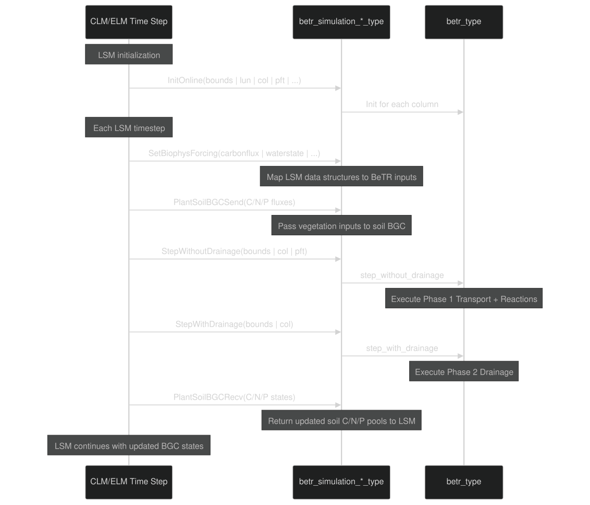

Key differences from standalone :

- No separate forcing file reading (LSM provides forcing directly)
- Restart handled by LSM's restart system
- History output managed by LSM's history system
- Initialization called once during LSM setup, not as standalone executable

Sources: [src/driver/clm/BeTRSimulationCLM.F90 81-248](https://github.com/jingtao-lbl/sbetr-resomv1/blob/72301c77/src/driver/clm/BeTRSimulationCLM.F90#L81-L248)  [src/driver/elm/BeTRSimulationELM.F90 79-286](https://github.com/jingtao-lbl/sbetr-resomv1/blob/72301c77/src/driver/elm/BeTRSimulationELM.F90#L79-L286)